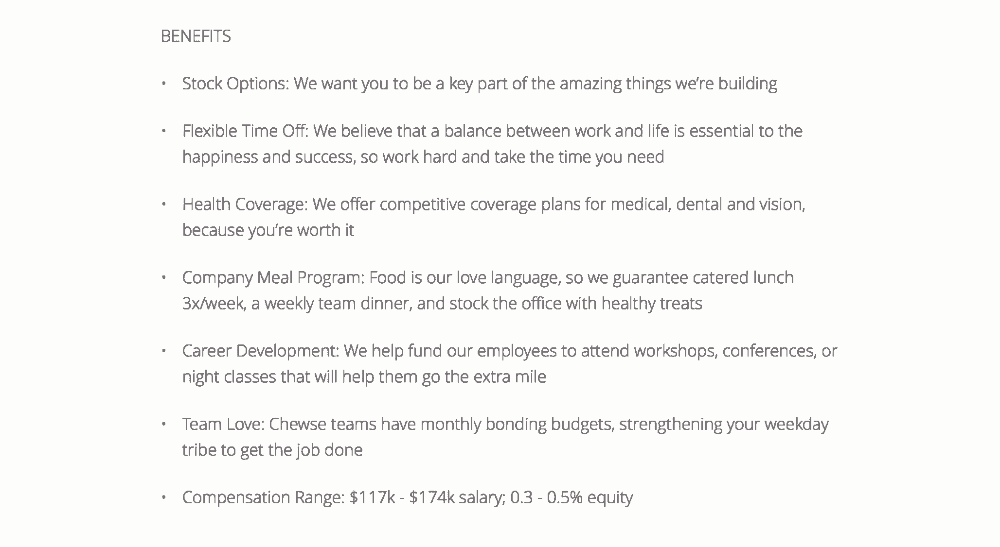
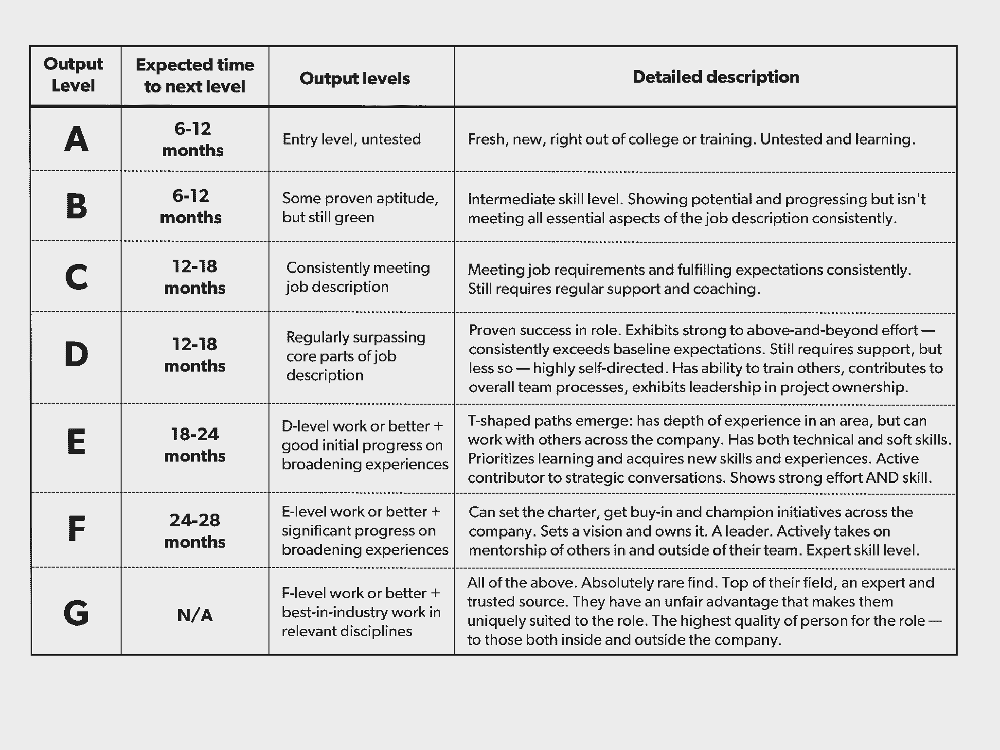

# Chewse 如何实现透明度——从工资开始

> 原文：<https://review.firstround.com/how-chewse-operationalized-transparency-starting-with-salaries>

那是中学时代。九岁的特雷西·劳伦斯 蹲在浴室里，匆忙地吞下她在一个摊位上的午餐。这是她远离恶霸的避风港，那些恶霸每天都在说她的闲话，奚落她。这也是一种避免独自坐在自助餐厅里受辱的方式。

许多年后，那段记忆又回到了劳伦斯身上。作为办公室餐饮创业公司**[Chewse](https://www.chewse.com/ "null")** 的现任 CEO，她恍然大悟。流言蜚语可能会在青春期前泛滥，但作为一个成年人，你不应该容忍这种事情。一家公司最深、最黑暗的秘密是什么？他们通常是围绕报酬。因此，劳伦斯和她的联合创始人杰夫·申克做了一个对早期创业公司来说似乎有悖常理的决定。他们制作了一份电子表格，列出了每个员工的工资——包括他们自己的。当她的员工睁大眼睛盯着她时，劳伦斯告诉他们，他们正在给公司引入透明度，当时公司只有 18 个人。它将从薪水开始。她打出了一封电子邮件，并附上了电子表格。她闭上眼睛，心怦怦直跳，然后点击了“发送”

什么都没发生。没有人害怕。其实根本没人说什么。

嗯，好吧，*发生了一些*事情。在发出那封邮件后的 16 个月里，在实施的第一年里，Chewse 的自愿流动率下降了一半至 10%。辞职的员工平均提前 5.25 周通知，而国家标准是两周。认为薪酬合理的员工比例为 72%，而全国平均比例为 20%。也没有员工向该公司提出过竞争性的工作邀请，部分原因是该公司有明确的评级体系、设定预期以及定期就绩效和薪酬进行对话。有些人甚至告诉劳伦斯，他们从来没有打开过电子表格。只要知道它在那里就够了。

朱斯的团队现在已经增加了一倍，达到了 36 人，工作场所正在蓬勃发展。该公司去年的销售额几乎增加了两倍。劳伦斯之前创办了学生用餐指南(student dining guide)[Dish Dash](https://www.facebook.com/USCStevens/posts/10151840393506764 "null")并担任 [TEDx](https://www.ted.com/about/programs-initiatives/tedx-program "null") 的企业活动策划人，他已经成为真正透明的倡导者——不仅仅是在工资方面，也是在公司价值观方面。在这里，她向我们解释了为什么即使是最早期的创业公司也应该考虑公开的薪酬政策，尤其是如果他们关心多样性的话。劳伦斯解释了如何实施这样一个计划，以及为什么你应该把它与一个精心设计的反馈和审查系统结合起来。她分享了一个关于如何给员工定期的、建设性的反馈的四步过程，这些反馈设定了期望值并给出了正确的基调。最终结果是:一种开放的文化，围绕薪酬的不满情绪减少，管理者和员工之间有了清晰的沟通渠道。

# 透明薪酬的理由

以一个显而易见的问题开始:为什么要考虑公开薪酬？以下是您应该考虑实施类似策略的主要原因:

**基础文化价值观。**首先，从一开始就要将透明和公平的价值观融入公司文化，并为健康的环境奠定基础。在朱斯的早期，劳伦斯和申克就如何最好地向员工表达感激之情争论不休。“我们考虑了不同的福利项目，但最终还是要回到薪酬上来。人们真的很在乎他们的报酬。我们想知道，处理赔偿的最真实的方式是什么？劳伦斯说:“引入透明度似乎是正确的。如果你认为这件事应该等到你有了一个成熟的人力资源部门后再做，请三思。这一政策对超早期创业公司尤其有效。这可能看起来违反直觉，因为这么少的员工，难道不会对薪酬更加敏感吗？“从一开始就融入透明度将为你成为的组织定下基调。你雇佣那些想要公开工资的人是非常重要的——不仅仅是作为一种工具，而是作为欣赏这种方法的那种人。你会发现有人说，“我相信多样性，我相信平等和公平。”这就是你希望在创业时成长为领导者的那类人。"

**招聘。**公开的薪酬可以改善候选人的体验，吸引人才。“绝大多数候选人都会说，他们真的很欣赏这种透明度。和某一类人产生共鸣。在我们开展的一项调查中，90%的新员工表示，该政策为薪酬和聘用流程设定了明确的预期。这确实说明了一些问题。当涉及到支付的时候，人们经常觉得他们面对的是一个黑箱。这是禁止的。你不应该谈论它。劳伦斯说:“我们把它直接公开，我们发现它真的给很多候选人留下了深刻的印象。“它不仅告诉了他们很多关于他们将如何获得补偿的信息，还告诉了他们为我们工作是什么感觉。封闭的薪酬体系对求职者来说也很难。难以置信的不透明，你在黑暗中谈判。人们会觉得自己在摸索。我们觉得这样不对。我们希望在整个过程中与我们的候选人*肩并肩——而不是友好相处，然后在竞争中针锋相对，然后假设一切都会好起来。”*

Chewse CEO Tracy Lawrence

**滞留。**透明的薪酬也有助于留住员工，因为他们可能对自己的薪酬更满意——因为作为制度的一部分，你会清楚地说明薪酬是如何计算的。许多人如果觉得自己的工资太低，就不会和他们的经理说话。他们会去找另一份工作**[。在 Chewse，我们有一个关于员工产出水平的每月谈话系统，这直接影响到工资。劳伦斯说:“它的设计与某人的价值无关，而与他们的产出和我们基于此的薪资公式有关。”。“这也不是说要等到 12 月份才能实现这一神话般的加薪。加薪不会是因为你在谈判一份更好的工作。从来没有人带着另一家公司的另一份工作来找我们，并对我们说，‘我想就我的薪酬进行谈判。’没人。他们一开始就会来找我们，说他们不同意我们对他们产出水平的评估。太好了。然后我们可以就此进行对话。这就是我们更愿意去的地方，而不是不得不说，'你为此烦恼了六个月，你去了，你在努力争取另一份工作？当然，我可以给你加 2000 块。我们在这里看不到这种情况。"](http://www.payscale.com/compensation-today/2015/08/time-to-get-real-about-employee-engagement-65-of-employees-are-quitting-for-more-money "null")**

**多样性。**你也可以看到这一重要领域的进展。Chewse 的全职员工中有 55%是女性。“女性[更有可能在谈判薪资时感到不安](http://www.payscale.com/career-news/2015/02/why-women-dont-negotiate-salary-and-what-to-do-about-it "null")。我在担任经理期间了解到，女性和对我们来说，工程师倾向于不谈判或谈判不那么艰难。我一直对此感到困惑，因为作为一名经理，你被训练成不能给出最终报价。所以你压低价格，希望有人谈判，然后到达合适的地方。当你遇到不喜欢谈判的女性或少数群体时，这种策略并不奏效。每次有人没有做到这一点，我都会退缩并问自己，“如果多元化对我这样一位亚裔美国女性首席执行官来说如此重要，为什么我要在自己的公司阻碍它？”劳伦斯说。如果你想让女性和代表性不足的少数民族留下来，[给他们公平的报酬，并确保他们知道这一点。这不仅仅是道德上的正确做法。这对你的公司和你的员工都是正确的。你会发现人们更快乐了。他们更自在。平等地支付给每个人，同样重要的是，确保他们知道事实就是如此。"](https://hbr.org/2016/03/why-so-many-thirtysomething-women-are-leaving-your-company "null")

科技应该成为多元化运作的榜样。现在，我们有一个问题。一个解决方案是:公开工资。

# 让透明度发挥作用的四个关键

然而,“公开薪资”并不仅仅是在公告板上公布每个人的薪酬。“事情远不止如此。你必须有一种建立在基本透明基础上的文化。劳伦斯说:“这渗透到方方面面，从经理与员工交谈的频率和方式，到一个人如何获得加薪。“与此同时，你不会完全停止怨恨。但这里的关键是让它浮出水面。它不会成为一种有害的力量，没有人会觉得自己被倾听，你会确切地知道谁对谁感到不满，因为这是一个开放、共享的空间。有些公司会因为你分享工资而解雇你。在这里，我们说，‘来和我们谈谈吧。你不同意你的工资。没关系，”我们每个月都会谈论它。自从我们实行公开工资以来，我们对任何人的离开都不感到惊讶，尤其是那些与赔偿有关的案件。从计划和继承的角度来看，特别是在事物发展非常迅速的初创阶段，这非常有帮助。"

以下是她的四步指南，告诉你楚丝是如何做到的:

**在你的工作描述中注明薪水。**“从一开始就要清晰、坦率。包括工资范围。因为我们的工资是以产出为基础的，所以在这个阶段我们会遇到一个常见的问题，那就是我们如何衡量产出？所以，在你的[职位描述](https://www.chewse.com/jobs/ "null")中，具体说明你如何量化工资的决定因素。在工作描述中也要包括你的开放式薪酬体系的细节。在大多数情况下，人们听到这个消息时都会非常兴奋。劳伦斯说:“这可能是一个很好的招聘工具。“这种方法还会过滤掉那些不适合你公司文化的人，因为他们对薪资透明度不感兴趣，或者因为他们不在你的工作范围内而不适合你，从而节省你的时间、精力和痛苦。这是一个非凡的过滤器。你浪费了太多时间进行 20 分钟的谈话，最后你意识到你在薪酬问题上没有达成一致。你本可以为自己节省很多时间和麻烦。当然，要确保你发布的范围是真实的范围。过去，我们曾试图偏离我们为某些候选人确定薪酬的方式，但最终，透明的薪酬让我们保持诚实——聘用最适合公司的人，而不仅仅是职位。”

Excerpt of a Chewse job description, including compensation details, for a VP of Operations & Logistics

**定义评级系统。** Chewse 使用 A-G 评级系统，根据技能和预期产出水平对员工进行分类。A 代表刚从大学毕业的人，或者未经考验的新人，而 G 代表她所在领域的顶尖人物——非常适合这份工作，而且难得一见。“我们衡量他们评级的方式是通过产出，这让经理们更容易进行这些对话。它带走了很多情感。当然，我们如何定义这些级别在很大程度上取决于经理和角色。对于销售来说，它是关于达到 X %的时间定额。一旦这个人开始交付成果，我们就可以开始讨论将他从 C 级提升到 D 级或 e 级。然后还有其他的角色，比如工程，在那里不那么依赖硬性指标。这就是管理艺术的用武之地。这不是一门科学，”劳伦斯说。“A 是初级，B 是中级，C 始终按照工作标准表现。如果有人在 A 或 B 呆了太长时间，这表明你有问题。在 D、E、F 和 G 中，你会特别开始了解什么是艺术。它已经成为我们如何参考我们需要的技能水平和经验的组织的简写。虽然不同的工作有所不同，但预期的绩效水平应该有与之相关的有意义的、细微的里程碑。”

Chewse's A-G rating rubric

**选择变量以确定补偿公式。** Chewse 使用[公式](https://blog.chewse.com/wp-content/uploads/2017/02/Chewse-Open-Compensation-Calculator.xlsx "null")给出基本工资，然后根据个人表现给出乘数。性能越好，价值越高，乘数越大。“我们使用 [Payscale](http://www.payscale.com/ "null") 数据和 [AngelList](https://angel.co/ "null") 数据，并用我们的网络对其进行彻底检查。我会问问其他创始人，他们为某些角色支付了多少报酬。通常对于销售人员和客户经理来说，如果有很多这样的人，你会得到大量的数据，这很好。但一开始，我并没有意识到高管职位的薪酬有多高，”劳伦斯说。“我们经历了一系列人说我们的范围太低。起初，我们认为我们只是找不到理解创业阶段的人。但在第四次或第五次之后，我们意识到我们没有捕捉到市场的信号。这肯定是我们一直在努力解决的问题，所以我们现在与一位 comp 专家合作。她物有所值，因为她帮助我们了解我们何时支付不足。那我们就把它扼杀在萌芽状态。我们将每年进行一次市场测试，从 Payscale 获取数据，并以此为基础构建我们的基础和公式。”

**每月进行反思，这也是绩效讨论的一部分。**这是魔法开始真正发挥作用的地方——在这里你可以创造一个开放的空间，为围绕员工的工作和成长进行诚实、真实的对话铺平道路。“我们每月与经理和员工进行一对一的交流。这是一种进行直觉检查并掌握某人是否符合其标准的方式。这也是一个表达不同意见或确定问题领域的空间，并且每月就薪酬问题进行一次对话。劳伦斯说:“在这里，设定期望值，并围绕如何提高产出水平给员工设定具体目标。“相信每月反思的框架。真的有用。我们有一个经理，在多次思考的过程中，发现团队中有一个人准备离开。经理与她展开了一场关于产出水平的谈话，这导致了一场关于职业发展和他们能够解决的不满的大谈话。那个人今天仍然在这里，而且比以往任何时候都更加投入。”

下面是劳伦斯进行富有成效的月度反思的六步方法。

从雇佣乐于接受反馈的人开始。这发生在月反射之前，但它是一个重要的结构支撑。“我们雇佣员工是因为我们的价值观，其中包括无畏的自省。我们在招聘过程中会问的一个问题是:“在过去的 18 个月里，对你来说，什么是重要的转折点，让你了解了自己？”我们寻求即时的亲密。劳伦斯说:“他们不必讲述自己的一生，但他们必须愿意变得脆弱。如果你对他们的诚实表现出接受的话，一部分就会到来。我和我的经理们都把自己无畏的自省带到了桌面上，我们鼓励其他人也这样做。例如，我们面试了一个人，她迟到了一会儿。她几乎要哭了。我碰巧是第一个面试的人，我说，‘嘿，你现在是怎么了？’她说，我只是觉得我搞砸了，我觉得我没有通过这次面试。我们雇佣了她。她的开放和脆弱有助于获得成功。"

**使用一个简单的、低层次的评分标准。Chewse 有一个[标准表格](https://blog.chewse.com/wp-content/uploads/2017/02/Chewse-Monthly-Reflection.pdf "null")，经理们在一对一之前要填写。评分范围从√ -(检查减-减)-表示未能执行，需要立即采取行动解决-到√++(检查加-加)，这意味着远远超出预期。“首先，管理者评估工作绩效，这基本上是你的产出水平。接下来的三个部分列出了我们的价值观:真实的联系、无畏的自省和求知欲。每次反思时，向他们展示你是如何给他们排名的。我不隐瞒，也学会了常态化。头几次感觉糟透了。劳伦斯说:“你说，‘听着，我给了你一张负号支票’，即使这是合理的，告诉别人这个坏消息还是让人感觉很糟糕。”。“但是你知道吗？每当这个人说‘谢谢你告诉我这些’的时候。我很感激这没有被隐藏。然后就开始变得容易了。下个月，你可能会给它一个检查加，然后你连续做了三个月，六个月，九个月，在这一点上，这是一个信号，是时候提高输出水平了，因为他们一直在踢屁股。虽然这个过程确实需要经理们花时间去执行，但它在员工满意度和期望值设定方面是有回报的。"**

利用会议来培养和成长你的员工。反思为员工提供了一个机会，让他们可以与经理讨论自己的成长，并就自己的发展轨迹获得诚实的反馈。“我的一位经理有 A-G 绩效的要点。她可能会说，“是的，他们在 B 区做得很好，但还没到 C 区。”**必须有一个步骤变化的差异。劳伦斯说:“对于客户经理来说，你必须要么扮演积极的导师角色，要么在自己的工作量之外承担自己的个人项目。不过，你不必满足每一项要求就能进入下一个级别——这更多的是与你的经理讨论，他有一个衡量你表现的框架。人们有时会选择自己的道路，我们告诉他们有几条路可以走。你可以开始走导师路线，成为未来的管理者。岔路口通常出现在 C 点——当有人在 A 点或 B 点逗留太久时要小心。进步有许多面。你可以成为一个真正伟大的个人贡献者。有人可能正在做令人难以置信的工作，但不想成为一名经理。他们应该还会增加产量。"**

我们是人类。我们不能什么都记在脑子里。每月的反思有助于量化一系列好的或坏的表现。

期待——并欢迎——不同意见。虽然这个框架通过将薪酬与绩效联系起来，消除了很多情感因素，但薪酬问题仍然是一个棘手的问题，所以预计人们会不同意他们的评价。“我们完全预料到会有分歧。我们以前有过，以后也会有。它是关于你如何围绕绩效设定期望，并围绕如何提高他们的产出水平给人们设定具体目标。那不是一件容易的工作。有时候经理会说，“我第一次有这么多艰难的对话，”但这些艰难对话的结果是，人们不会离开你的团队。**Lawrence 说:“我们衡量成功的标准不仅仅是保留数字，还包括我们进行的艰难对话的数量。“这也是关于在前期有很多明确性。在你工作的第一天，我们会给你非常明确的指导方针，从那时起，当这些对话发生时，我们总是不断地参考它。这样就不存在期望是什么的问题了。只要你事先考虑周全，系统会为你做好工作。这个过程也消除了意外。比方说，我们一整年都在告诉一名销售代表，“嘿，你很擅长达成交易，但你在努力进行追加销售。”这是我们将在每月反思中强化的东西。因此，在第六个月的时候，当我们说，“我把你保持在 C，因为我已经给了你所有这些反馈，我们还没有准备好把你提升到 d，”这应该不会令人惊讶。这让经理们更容易说这是产出。"**

对你的经理进行语气和方式的培训。劳伦斯的团队使用了[非暴力沟通](https://en.wikipedia.org/wiki/Nonviolent_Communication "null")的原则，这是一种围绕同情和移情而设计的方法。“我们使用 OFNR 框架的[来构建反馈:观察、感受、需求、请求。做一个观察，陈述它让你感觉如何，然后你需要什么，最后在一个具体的要求中巩固它。例如，“我知道从 C 级升到 D 级对你来说非常重要，所以我们来谈谈这个吧。我对此很兴奋，但是我注意到你在过去的两周里已经举办了三次工作聚会。这让我觉得你没有在截止日期前全力以赴。我需要感觉到你很饿，因为组织现在需要它。“我们正在融资，我们需要达到收入里程碑，这样我们才能筹集资金，”劳伦斯说。不要引发一个人的战斗或逃跑反应。感同身受，但也要直爽。作为一名经理，从一开始就定下基调:“我会对你很严厉，对你很真诚，但我会从关心的角度去做。永远把它放在一个安全的地方。"](http://www.nonviolentcommunication.com/aboutnvc/4partprocess.htm "null")

召集法庭帮助经理们统一衡量成功。利用每周的管理会议作为讨论的机会。“所有经理聚在一起，讨论他们考虑给谁加薪。实际上，我们也在每周的高管会议上优先考虑它。最后，我们会为任何发布输出等级增加的人保留一个空间。他们将展示关于产量和每月反映的数据。我们会问问题。法庭是一个艰难的地方。我们会反推，要求更多的数据，或者挑战对方说，‘这个人呢？难道她不应该提高产量吗？“我们互相支持，”劳伦斯说。必须一致通过。这是一种确保每个人都用同样的标准评分的方法。如果你落后了，相信我，你的员工会知道的。他们会说，‘我的朋友有一个随和的经理。这不公平。我们试图保持一致性。这很难，但如果你定期把人们聚集在一起，让他们互相挑战，这是一种让所有人都处于同一水平的方法。有一个时间表也很重要。人们要么会忘记，要么只有吱吱响的轮子会得到加薪。我们在每个人六个月的时候对他们的产出进行评估，但是如果有人提升得更快，你可以更快地开始提升。"

一个员工的产出水平是微观的，但宏观的是他们的职业进展。每月的反思可以捕捉到这两者。

# 展望未来

通过公开员工工资走向透明的文化。这种策略也有利于你的多元化和包容性努力。围绕你如何评定和评估员工的加薪建立一个框架和结构。从与员工产出水平挂钩的评级系统开始。在此基础上制定你将如何确定薪酬——尝试一个乘数，或者修改你自己的公式。然后每月进行反思，这也是绩效讨论的一部分。训练你的经理在这些会议上感同身受、开诚布公地说话，在招聘时，寻找那些表现出愿意内省和坦诚的候选人。每季度召开一次经理听证会，让经理们陈述自己加薪的理由，并就自己的决策相互质疑。

“在实施公开工资后，我们已经形成了一种更健康的冲突文化。最初，我的想法是，“我们就不能好好相处吗？”它实际上迫使我认识到冲突是不可避免的，并认真对待冲突发生时我和我的经理如何沟通。你无法避免分歧。劳伦斯说:“你能做的就是将它浮出水面，解决它，并尽早谈论它，这就是拥有一个开放透明的文化的意义所在。如果更多的公司实施这一政策，我认为你会有更多的多样性。会有更多的女性和少数族裔申请科技公司，成为科技行业的一员。文化会变得不那么有害，你会更快地进行更有成效的对话。这是创新和包容能够继续共同发展的唯一途径。"

*摄影由* *[邦妮·雷·米尔斯](http://www.bonnieraemillsphoto.com "null")* 。