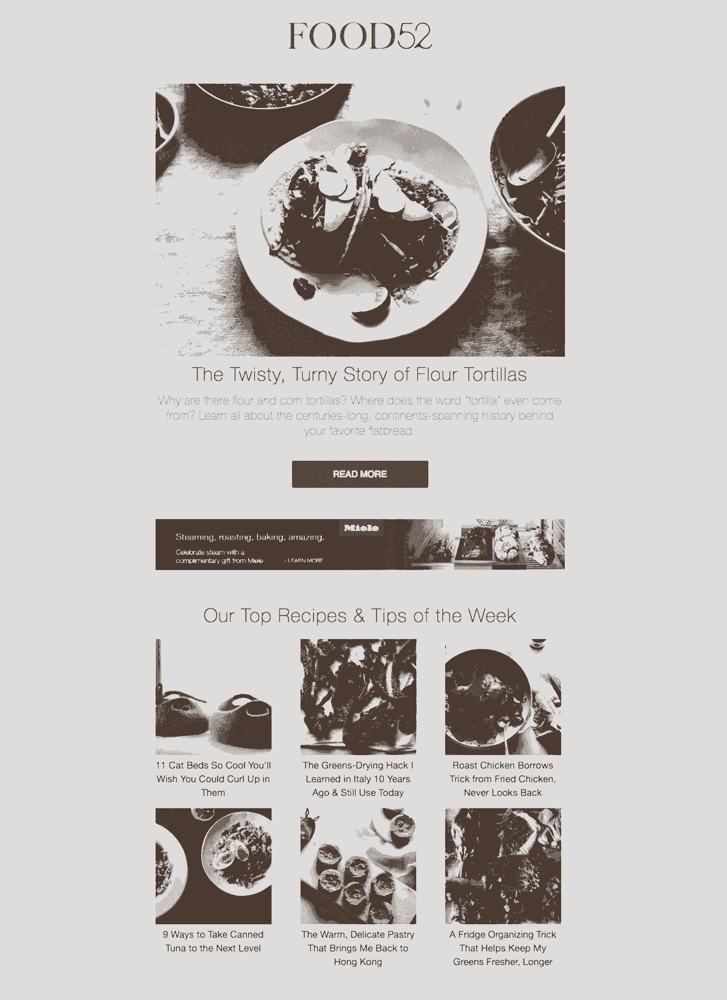
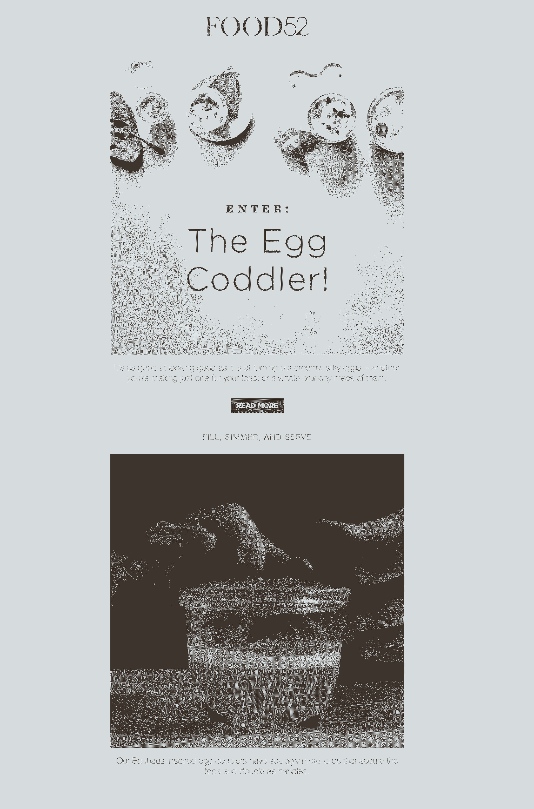

# Food52 如何在内容和商业之间取得平衡

> 原文：<https://review.firstround.com/how-food52-strikes-a-winning-balance-between-content-and-commerce>

阿曼达·海瑟 24 岁时写了她的第一本书，作为《纽约时报》的美食记者写了 750 多个故事，并且是第一个在美国主要出版物上刊登[费朗·阿德里亚](https://en.wikipedia.org/wiki/Ferran_Adri%C3%A0 "null")埃尔布利的人物。说到讲故事，她早熟、多产，走在最前沿。

那么，是什么开创性的工作让内容如此引人注目，以至于成为她生活和职业生涯的核心？ *[官方预科生手册](https://en.wikipedia.org/wiki/The_Official_Preppy_Handbook "null")* 。年轻的赫塞把这个模仿秀(她姐姐送给她的礼物)误认为是她渴望拥有的生活方式的指南。她从头到尾如饥似渴地阅读指南。

赫塞回忆说，这本书展示了她从未听说过的品牌的帆布手提袋。这驱使她去寻找一份“土地的尽头”目录。事实上，她最近发现了一张给父母的便条，要求他们从零售商那里买一个蓝色的行李袋。她在纸条的结尾写道:“难道我不配吗？”

这就是内容的影响，通过吸引和告知读者来促使他们采取行动，而不是简单地强行推销。

如今，赫塞和梅里尔·斯塔布斯都是训练有素的厨师和美食编辑和作家，他们是 **[Food52](https://food52.com/ "null")** 的联合创始人，这是一个家居品牌，结合了食谱、文章和社区提交的内容，拥有 2000 多种商品的家居用品店。这个品牌每个月拥有 1300 万用户，并且正在迅猛发展，这在很大程度上要归功于其蓬勃发展的网上商店，该商店占其年收入的三分之二。

尽管如此，当你登陆这个网站时，网站上充满了丰富的食物照片和巧妙的烹饪技巧，你会理所当然地认为它只是一本在线杂志。在这次独家采访中，赫塞和斯塔布斯解释了为什么他们总是以引人入胜的内容领先，并相信销售会随之而来。他们向我们展示了他们最有价值的三个渠道——电子邮件、Instagram 和视频——以及最大限度地利用每条途径吸引客户的技巧。他们分享了无成本到低成本的内容策略，任何创始人都可以——也应该——实施这些策略。

内容和商业之间的互动——就像公司和客户之间的互动——必须是双向的。

# 通过内容和商务建立品牌

从一开始，Food52 的目标就不仅仅是一个商业网站。赫塞尔和斯塔布斯开始创建一个资源，通过食谱、文章、技巧、问答，以及一个提供精心策划的厨房和生活工具的商店，全面帮助家庭厨师。“我们的目标不仅仅是被视为一个商业企业，而是一个你可以在许多方面获得帮助的地方，”Hesser 说。“因此，很自然地，如果你需要新的烹饪勺子，你可以来找我们，因为你也信任我们的食谱和专业知识。”

近十年来，数据证明 bet 是一个很好的选择:**至少在购买前一天在网站上注册的用户中，有 60%在他们的第一个订单**之前与 Food52 进行了“有意义的互动”——无论是评论帖子、提交食谱、提问或回答问题，还是为竞赛投票。“我们认为这是一个强有力的案例，为人们建立和发展多方面的资源，”斯塔布斯说。“我们已经看到这种参与对我们的商业产生了有意义的影响。”

随着网站变得越来越成熟，导致商业的内容也朝着另一个方向发展，商店引领着新内容的方向。Food52 开始为商店增加新的类别——洗衣、整理和家居装饰——所有这些都获得了成功。该团队开始在这些相同的类别中构建内容，以满足人们的兴趣。“他们强烈地相互影响，”赫塞说。“对我们来说，这扩大了我们所能做的事情的可能性，因为我们正在与人们建立长期的关系，而不仅仅是满足他们一时的需求。”

Food52 Co-founder and CEO Amanda Hesser

# 内容和商业之间的常数

赫塞和斯塔布斯在各种平台上分享他们成功的秘密，从 Instagram 故事到食谱视频，有一条很强的主线:在所有情况下，他们都努力磨练和实现了自己的品牌个性。“当谈到发展视觉和书面的声音，这是如此多的与人们在情感层面上的联系，”斯塔布斯说。“它很强大。只是需要努力在最初定义它，并保持一致性。”

Food52 将他们的成功在很大程度上归功于他们直接、友好、有教育意义的个性，他们认为这是品牌运营方式发生巨变的一部分。“你看到的新品牌，如 [Everlane](https://www.everlane.com/ "null") 、 [Casper](https://casper.com/ "null") 和 [Cuyana](https://www.cuyana.com/ "null") 突然出现并取得成功？他们以一种消费品牌历史上从未有过的方式在人的层面上建立联系，”斯塔布斯说。“从你的网站文案到你的客户互动，你越是人性化，以一种令人难忘和真实的方式对待他人，这就是你能做的最强大的事情。”

以下是 Hesser 和 Stubbs 用来维护 Food52 品牌个性以及链接和提升其内容和商业战略的三个渠道。

# 把你的电子邮件想象成杂志

Food52 不仅将电子邮件视为一种分销机制，也是其商业战略中至关重要的创新元素。电子邮件不是一种达到目的的手段，也不是一种简单地传递链接和产生点击的方式。赫塞和斯塔布斯当然希望他们的电子邮件能够增加参与度，但他们致力于以这种形式发布有价值的内容，就像其他任何形式一样。

“电子邮件不仅仅是一个传递的容器，而是它自己的内容。它必须激发灵感，策划故事，发布外卖。如果你没有时间看，我们希望你留着以后看。”

以下是 Food52 的打开率经常超过商业行业基准 30%的原因。以下是它通过电子邮件吸引读者注意力的一些方式:

**借鉴旧媒体。我们的格式非常像杂志。“你试图用一个真正强有力的标题吸引人们，然后在他们向下滚动时保持他们的兴趣，”赫塞说。“我们用大而美的照片来吸引人们的注意力，将他们带入另一个世界。我们在电子邮件中加入了各种各样的内容、产品和功能。一封电子邮件可能包含一个关于制造商的故事，一个突出我们播客的片段，一个事件的公告和一系列新产品。并非我们所有的电子邮件都如此多样化——有些侧重于商店，以新产品或食谱为特色，并专注于烹饪内容——但我们发现，以杂志的方式反映重点或多样性可能对我们很有帮助。”**

改变形式——但可以预见。订阅者每天会收到 Food52 的一两次消息，所以为了吸引读者的注意力，它会混合自己的电子邮件模板。“有些日子我们会更关注内容，有些日子我们会关注商店，”Hesser 说。“但变化不同于惊喜。例如，每周三都有一封来自 Food52 创意总监[克里斯汀·米格罗](https://food52.com/users/2821-kristen-miglore "null")的邮件。她写了我们最受欢迎的专栏，叫做天才食谱。这很像她写的一封私人信件。有几周，她会对她一直最喜欢的洗碗皂大加赞赏，这是一种必备的厨房用具。其他情况下，她可能会分享她最喜欢的晚餐聚会播放列表。很奇怪，而且来自一个真实的人。那封邮件表现非常好。"

**展示你店里有什么** ***不是*** **。**有趣的是，尽管 Miglore 周三发来的电子邮件并不关注 Food52 商店(通常还会推荐该商店没有的产品)，但它带来的销量却不亚于一封关注商业的电子邮件。“我们在每封邮件的底部都有相关的内容——推荐与克里斯汀谈论的内容相关的产品。斯塔布斯说:“即使产品只是以小缩略图的形式出现在时事通讯中，这封天才食谱邮件最终也能带来 3000 到 9000 美元的销售额。

这进一步证明了 Food52 的核心假设:以高质量的内容为先导——为你的读者提供价值——销售就会随之而来。

# 建立一个反馈循环(一种奇特的说法:阅读并回复你的邮件)。

Food52 的几封表现最好的电子邮件是他们社区直接反馈的结果。事实上，这就是他们如何在一个月内将一只德国鸡蛋布丁卖出 2 万美元的原因。“这是我们喜欢的产品，”Hesser 说。“我们从很早的时候就开始销售它，它表现很好，但不是最畅销的。我们通过客户服务得到反馈，有些人不理解它，不知道它是什么，也不知道它是如何工作的。”

因此，该团队利用这一线索，构建了一套内容，包括 coddler 如何工作的视频和 gif，以及如何使用它的食谱和想法。是时候在电子邮件中把鸡蛋布丁放在前面和中间了。**尽管许多品牌不愿意在顾客和销售之间放置一次以上的点击，但该团队决定利用每一条内容来创造丰富的教育体验**。“我们没有从电子邮件中链接到可以购买鸡蛋编码机的产品页面，而是链接到了社论文章。”

“人们必须首先打开我们的电子邮件，阅读我们的电子邮件，点击进入 egg coddler 文章，然后点击进入 egg coddler 产品页面，以便购买它，”Hesser 说。“这个过程没有吓退感兴趣的读者，而是让他们更深入地参与进来。我们娱乐。我们通知了。然后人们说，‘好吧，现在我必须得到它。’"

其他时候，顾客的反馈促使 Food52 与其商业伙伴一起重新思考产品的设计方式。“我们的团队长期以来一直迷恋 butter keeper，这是一种可以在室温下保持黄油不变质的菜肴。再一次，通过制作视频和一些额外的解释性内容，该团队将一个不被看好的宝石变成了畅销书，”斯塔布斯说。“但我们得到的反馈是，它并没有装满黄油。所以我们回到制造商那里说，‘嘿，我们能做一个更大的版本吗？’他做了一个新的原型，现在我们店里有了更大的版本。也是畅销书。"

外卖？最好的参与方式是真诚地接受教育——教导而不是展示你的专业程度。通过满足用户的需求，围绕教育用户建立内容策略，你所获得的洞察力将会是非常值得的。

# 双倍下注你的注册流程。

多亏了最近对他们注册数据的分析，Hesser 和 Stubbs 发现积极参与的用户实际上也更有价值。“我们根据注册来源对 2017 年的用户进行了分析，我们看到了一些非常有趣的事情，”斯塔布斯说。“那些为了收到订单信息而在结账时订阅的人，最终比那些注册了我们的电子邮件、做了一段时间读者、然后进行购买的订阅者的终身价值要低。”

有了这种认识，该团队继续试验如何以及何时提示用户注册电子邮件。他们尝试过在用户到达网站后多长时间显示一个注册弹出窗口——现在，一旦用户在页面上显示参与度，他们就会出现。他们与类似的品牌合作，将彼此的受众吸引到各自的网站，并产生新的注册用户。他们想尽一切办法来优化电子邮件的获取。“数据证实了我们一直以来的假设，即高质量的电子邮件线索是我们业务的巨大推动力，”斯塔布斯说。“正确的电子邮件注册对 Food52 至关重要。”

Food52 Co-founder and President Merrill Stubbs

# 提升他人，在社交场合脱颖而出

Food52 发现 Instagram 是建立社区和传播品牌个性的一个特别有价值的平台。它在推动 Instagram 的直接销售方面也取得了巨大成功——任何社交媒体经理都会告诉你，这是一个不小的成就。“Instagram 是一个免费的营销平台。斯塔布斯说:“对于资源有限的初创公司来说，这是一个很容易获得受众的地方。"这么多繁重的工作已经为你做了."

从 Instagram 起飞的那一刻起，Food52 就一直在上面。“特别是对于任何从事食品出版工作的人来说，像 Instagram 或 Pinterest 这样以图片为中心的平台是一个非常自然的地方，”斯塔布斯说。“我们马上就知道，这是一个平台，我们可以在这里真正表明自己的品牌立场。”

赫塞和斯塔布斯明白，Instagram 最适合那些视觉和短视频是其传达业务核心的公司，如 [Airbnb](https://www.instagram.com/airbnb/?hl=en "null") 、[劳力士](https://www.instagram.com/rolex/?hl=en "null")或 [GoPro](https://www.instagram.com/gopro/?hl=en "null") ，但以下许多策略也适用于其他社交媒体渠道。

Instagram 为 Food52 提供了一个发布美食照片的地方，这些照片让他们声名远扬。但它也提供了一套构建和参与社区的理想工具。“很快，我们就采取了重新塑造他人的策略，把他们叫出来，给他们曝光，”斯塔布斯说。“正如我们希望我们的网站成为其他人的食谱、摄影和知识的平台一样，我们发现 Instagram 是向更广泛的受众介绍人们的另一个伟大平台。”

开拓者常常因为走在最前沿而受到称赞，却很少因为他们身后留下的东西而受到称赞。品牌的好坏取决于他们留给别人的道路。

不要担心把用户从你的网站转移到社交平台——food 52 的创始人不担心分食他们的网络观众。他们只是专注于优化内容，如分享食谱和在 Instagram 格式的自然环境中展示商店产品——为新用户创造一个入口，并加深现有用户的参与。“我们一直将社交网站视为我们与社区见面和互动的另一个地方，”Hesser 说。“我们一直关注的是如何在每个平台上以有意义的方式吸引人们。”

例如，该团队通过放大用户的声音获得了病毒性黄金。2014 年底，Food52 拥有 10 万名 Instagram 粉丝。那时他们推出了#f52grams。“每周都会有一个特定的主题，无论是粉色食物还是你最拿手的炖菜。海瑟说:“人们会用这个标签在 Instagram 上发布消息，并邀请他们的朋友加入，他们的朋友也会认识我们。到 2015 年，Food52 的 Instagram 粉丝已经膨胀到 100 万。

他们并没有打算提高他们的数字。这只是一个跨所有平台建立社区的倡议的快乐结果。“它反映了我们在网站上进行的食谱竞赛。斯塔布斯说:“我们想要复制的是这种模式，通过大声说出和宣传他们的贡献，让人们感到受到重视，进而投资和参与社区。”“我们知道我们网站上的社区会熟悉这种机制——我们只是调整了它，使它与平台相关。当我们开始看到我们的关注者数量和#f52grams 的提及数量飙升时，我们知道我们正在做一些事情。”

# 不要停留在甜甜圈。

然而，在达到 100 万——甚至 10 万——粉丝之前，有很多尝试和错误。这是一个不断尝试各种内容的过程，看看哪些内容最吸引人，同时也促使关注者尝试 Food52 提供的各种内容。

“我记得在早期，我们发现甜甜圈只是杀死它，”赫塞说。“如果你是一家食品媒体公司，你可以每天这样做，并获得大量点击，但你不会成为一个鼓舞人心的资源，”她说。“所以我们记下了什么有效，然后不断尝试寻找新的方法来激发兴奋感。我们想，'好吧，很高兴知道甜甜圈。“现在我们必须找到 17 种人们想看的东西，”"

随着 Food52 接近 200 万 Instagram 粉丝，这种实验精神继续很好地服务于他们。因为当涉及到多变的、不可预测的社交媒体形式时，你不能固步自封。“insta gram——以及几乎所有的社交媒体媒体——的特点是，你必须经常保持灵活性，愿意尝试，同时不要拿你与现有受众建立的关系冒险，”赫塞说。

赫塞和斯塔布斯发现了三个关键的技巧，综合起来，形成了一个循环，他们重复了多次，以保持他们在 Instagram 上的高性能表现:

**扑向社交上的新功能。**每次 Instagram 发布新的视频功能，Food52 都会立即跟进。“Instagram 推出 Stories 的第一天，我们就发布了一个 Instagram 故事。我们将使用文本覆盖来提问或提示反馈。或者将华丽的产品照片与这些相同产品的运行视频相结合。我们什么都尝试过，”斯塔布斯说。“这一点至关重要，因为每一种新工具都是与受众交流的潜在方式。一旦你意识到这个新的杠杆，就试一试。不要把事情看得太严重。保护你的品牌，但不要让它变得珍贵。我们提醒我们的社交媒体团队不要想太多。社会就是这条河，不停地流动。所以你必须尝试，并且明白有些尝试会失败。”

**在社交平台上测试和调整你的策略。**当某件事成功了——或者真的失败了——欢迎你的观众有新的见解。例如，尽管 Food52 团队对视频进行了各种实验，但他们发现，相比视频，他们的粉丝更倾向于评论他们订阅源中的照片。现在,《Food52》更多地关注照片帖子，更多地依靠视频来获取故事，在视频中获得更多的参与。“还有，我们经常做的是先分发一段关于脸书的视频。如果它在脸书表现良好，这通常是一个好信号，表明它将在 Instagram 上表现良好，”赫塞说。“为了不仅标记即将推出的新功能，而且预测它们可能如何协同工作，我们的社交团队中有人与脸书和 Instagram 的联系人保持密切联系，以确保我们为即将到来的事情做好准备。”

**在社交网站上，要以数据为导向，而不是以数据为驱动。**只要你能得到数据，就要接近它。“我们确实有一个分析团队，但我想说社交团队可能处理了社交网站 90%的数据分析，”斯塔布斯说。赫塞补充道，“我们在媒体工作了很长时间，知道你需要进化，即使数据告诉你一遍又一遍地做同样的事情，”她说。当谈到知道如何以及何时挑战极限时，雇佣合适的社交媒体专家是关键。斯塔布斯说:“他们真的必须能够轻松地分析数据，并有乐趣和创新意识，才能编写出符合品牌的 Instagram 故事，但也有一点点乐趣和古怪。”。

有了这种内部洞察力，一切又回到了起点:再次尝试新事物。这并不是说你应该做出巨大的改变或者放弃你的品牌。只需在品牌内部为温和的创新留出空间。“这个想法是，你应该不断调整和承担风险，衡量风险，”赫塞说。“要做到这一点，不仅要发布产品，还要将它们框定为体验。带一个刨丝器或黄油罐或任何数量的厨房用品。它们如何融入你的生活并不总是显而易见的。所以，我们会贴上一套碗*和*五个伟大的沙拉食谱*和*一个制作沙拉酱的窍门。这是一种体验，而不仅仅是让人们购买产品的机会。”

这很有效:故事目前为 Food52 的 Instagram 带来了 50%的收入，并为其网站带来了 30%的 Instagram 流量。“显然，制作故事比摄影帖子需要更多的资源、时间和思考，但我们发现这绝对值得，”赫塞说。

# 提升视频:把你最好的故事放在屏幕上

当谈到视频时，Food52 团队一直采取的立场是，任何形式的任何内容都需要清除相同的障碍:它必须讲述一个伟大的故事。“根据视频的格式和长度，看起来会有很大的不同，”斯塔布斯说。“但有一个清晰的叙事弧线和观点是必不可少的，无论是 30 秒的食谱视频还是 3 分钟的制造商故事。”

以 Food52 的视频为例，懒玛丽馅饼[自 2010 年赢得比赛以来，一直是粉丝们最喜欢的食谱。顾名思义，这个食谱很简单，只有一个棘手的要素:准备面团。所以在制作视频的时候，把蛋挞和店里的](https://food52.com/recipes/1374-lazy-mary-s-lemon-tart "null")[可爱的烘焙擀面杖套装](https://food52.com/shop/products/4549-lovely-baking-rolling-pin-set "null")搭配起来也就顺理成章了。

“这个视频的承诺是解决食谱的最大挑战。海瑟说:“它的美妙之处在于，这是你做过的最简单的柠檬馅饼——你可以把所有东西，包括柠檬的皮和籽，都扔进搅拌机里。”“所以最难的部分是制作面团并把它擀平。在这个视频中，我们向您展示了一个来自该网站的传奇性的、永恒的食谱，然后通过一个伟大的产品帮助您解决一个挑战。”

结果是一个食谱视频也有机地融入了产品宣传。这种合作的成功是显而易见的:该视频在脸书获得了 2500 次参与，并售出 18 套，远远超过该公司的有机帖子基准。

一些最好的视频是伪装成故事的解决方案。通过一点魅力和电影摄影，解决问题变得令人愉快。

# 视频是你运动中的品牌个性。

除了叙事弧线之外，视频也是你的品牌审美标准的生动载体。“我们的视频能够立即被识别为 Food52，这一点非常重要，”Hesser 说。“这些不仅仅是拆箱的产品视频。这个品牌很有个性。我们在和你说话。我们是你在家里的朋友，帮你解决问题，给你好主意，最理想的是帮助你过上更好、更幸福的生活。”

“一个强大的品牌识别的方法是视觉一致性。最重要的是，你要在所有媒体中做到这一点。”

为了实现这一使命，Hesser 和 Stubbs 仍然对每一个产品表示肯定或否定，并在网站的任何主要视觉决策上发表意见。但是随着公司的成长，他们也采取措施来衡量这些审美判断。在早期，他们总是与同一个摄影师合作，后来这个摄影师负责招聘新的摄影师，并对他们进行品牌灯光和视觉风格的培训。

为团队增加一名艺术总监是另一个重大举措。“她真的帮助我们完善了我们的外观，并帮助编纂品牌指南和风格指南，”赫塞说。“她雇佣了一个团队，可以复制我们的造型，这样当她不在片场时，就有了一致性。”

Food52 将他们对一致性的追求推进了一步:他们按照他们努力在电子邮件、视频和所有社交平台中实现的外观和感觉来模仿他们的办公室。“我们把它设计得真的像一个家，”斯塔布斯说。“这是我们为将品牌美学融入每位员工的日常生活而做的许多事情之一。如果你在我们的办公室工作，你至少会对它有所了解。”

# 把这一切联系在一起

对许多人来说，内容和商业之间的关系很遥远——或者充其量是一种松散的关联。但是，Food52 已经找到了一种方法，通过电子邮件、社交和视频等工具，以一致的方式将他们联系起来。首先，从旧媒体中抽出一页，把你的电子邮件想象成杂志。尝试不同的形式和策展人来介绍多样性，而不要让你的读者感到惊讶。通过链接到评论文章而不是产品页面来培养信任感和客观性，或者展示你的网店可能还没有销售的产品。在社交方面，提升他人来扩大你的品牌。利用社交网站上的每一项新功能来接触新客户，并以数据为导向(而非数据驱动)做出决策。最后，使用视频来讲述你最好的故事，并作为你最有效的工具来展示你的品牌个性。

“我们现在通过开发自己的产品线，将我们以内容和社区为中心的方法向前推进了一步。这将是我们将内容和商业相结合的最大实验——我们不会独自在后台制定计划。这将是一个众包的努力，我们已经联系了我们的社区来帮助我们设计产品，”Hesser 说。因此，很明显，这些东西将具有人们所熟知的食物的视觉美感。但是有了社区的投入。已经有一万人附和我们的第一个产品:砧板。他们对木材的厚度和类型，木材的来源，木板是否应该有把手都提出了意见。我们通过电子邮件、Instagram 故事和视频——所有我们讨论过的渠道——征求答案。产品开发的每个阶段都将是透明的。在我们的类别中，这是一个相当激进的转变。但不应该。没有什么比我们邀请到家里和厨房的东西更亲密的了。”

*摄影由* *[迈克尔乔治](http://home.michaelgeorgephoto.com/ "null")* *。*