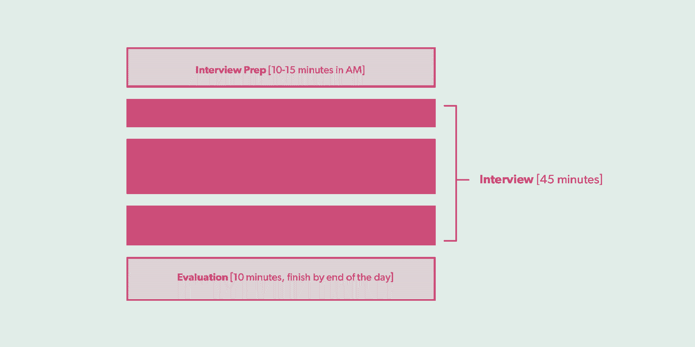
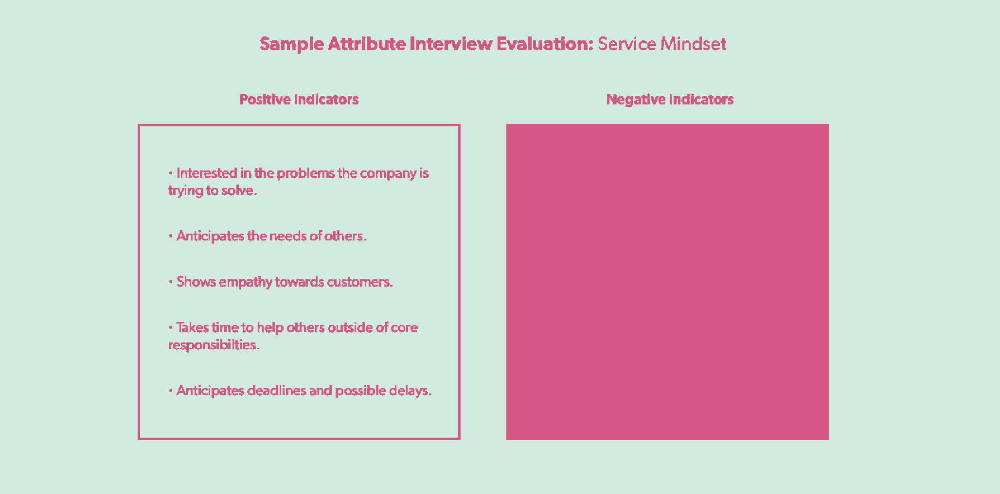
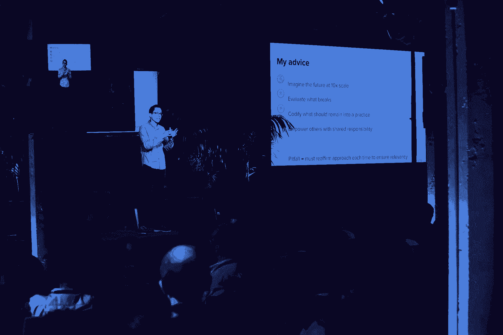

# Gusto 如何建立植根于传统的可扩展招聘实践

> 原文：<https://review.firstround.com/how-gusto-built-scalable-hiring-practices-rooted-in-tradition>

## 介绍

“最近文化发生了很大变化。”

“我感觉我不再了解所有人了。”

"我们正在经历一些严重的成长困难。"

这些评论经常出现在创业公司的玻璃门页面上。这是因为驾驭高速增长很难。一方面，创业公司需要尽快找到人才，但为了长寿和士气，他们还需要找到适合并补充现有文化的人，而不是慢慢地将其扭曲成难以辨认的东西。

欢迎大量新员工的加入通常会带来最初的担忧。但是还有更深层次的东西。这些评论的意思是，从团队早期的争斗中，有一种“不可逾越”的精神——每一个新成员都代表着一种对最初形成文化的“不可否认”的慢慢侵蚀。作为一名领导者，这似乎是一个无法克服的挑战。你如何快速招聘和扩大规模，同时又不丧失公司的精髓？

进入 **Josh Reeves，**首席执行官和 **[Gusto](https://gusto.com/ "null")** 的联合创始人，这是一个面向小企业的薪资、福利和人力资源平台(在其[深思熟虑的更名过程](http://firstround.com/review/this-is-how-you-design-a-lasting-brand-an-inside-look-at-gustos-reinvention/ "null")之前被称为 ZenPayroll)。在不到六年的时间里，从帕洛阿尔托一所房子里的三个人到旧金山和丹佛办公室的 600 多名员工，Reeves 认真、周到并致力于价值观，令人印象深刻。Gusto 的文化以热情、平易近人和个性鲜明为标志，随着规模的扩大，它成功地保持了自己的价值观，并植根于自己的传统。据里维斯称，他们的招聘方式是一个重要原因。

受他在第一轮创始人峰会上的讲话的启发，Reeves 在这里分享了 Gusto 如何衡量招聘中不可扩展的部分，详细介绍了他的招聘哲学，并通过三个例子说明了 Gusto 为保留其独特的文化并确保其最佳传统得以延续而采取的步骤。

# 扩大公司规模的关键是从梳理传统开始

传统是有机发展的习俗，是公司文化的天然组成部分。但是它们看起来没有特别好的可扩展性。在达到一定规模后，创始传统往往会半途而废，因为很少有人记得在辉煌时期是如何做到的。但对李维斯来说，传统可能是一家公司的名片，所以保留它们是一种不错的方式，但只是在它们有意义的地方。“如果说我对传统有什么建议的话，那就是不要过于规范或强势。观察自然发展，然后顺其自然。他说:“它们不应该是你以非常广泛的方式计划出来的东西。“传统慢慢成为你公司 DNA 的一部分，并随着时间的推移不断自我强化，成为一种文化。它们必须是真实的。对于什么是“正确的”或“错误的”传统，没有公式可循。每个创始团队都不一样。”

作为一个例子，里夫斯指出了古斯特的一个古怪传统:“不穿鞋”的办公室。是的，所有 600 多名员工都在公司的地板上走来走去，光着脚。他们在丹佛和旧金山的办公室门口摆满了放鞋的柜子，同时还会向来访者发放免费的袜子或拖鞋。“这一切都要追溯到我们在帕洛阿尔托的一所房子里创办公司的时候，”里维斯解释道。“我和我的两位联合创始人都是在‘不穿鞋’的家庭中长大的，因为我们是在我们居住的地方工作，所以这种情况就延续了下来。当我们在旧金山有了一个真正的办公室，我们和团队讨论了这个问题，每个人都想保持这个传统，所以我们做到了。随着我们的扩张，这种情况一直持续到今天。我认为这有助于我们的文化，因为有一种感觉，你脱鞋后会感觉更自在。公司可能经常是非常无菌的环境，一点也不像你的房子，但我们希望每个人在办公室里都能感到舒适和兴奋。在某种程度上，这是一种微妙的方式，将它与我们对一个世界的愿景联系起来，在这个世界上，工作赋予人们更好的生活，人们可以在工作中找到社区。但是，这是刚刚发生的事情。如果我们开始尝试制定这项政策，它可能不会引起共鸣，也不会成为公司的传统。”

但是正如里夫斯发现的那样，并不是所有的东西都能被保留下来。“早些时候，团队为每个新员工编写了详细的简历，在他们到达之前发给整个公司。虽然这是一个珍贵的传统，但随着我们发展到数百人，很难保持下去，”他说。“现在，一个更长的背景只与个人招聘团队分享，但我们确保在每次全体会议开始时向整个公司介绍所有新的阵风。”

对于白手起家的创始人来说，第一步是确定你的价值观是什么，因为它们最终会引导你的传统。“每家公司都会经历一个过程，以找出对他们来说什么是真实的。里维斯说:“我能给你的最大建议是，价值观是一个你应该大胆坚持己见的领域。“不要试图成为每个人的一切。建立一家公司有很多方法，没有正确的道路或错误的道路。遵循对你来说真实的哲学。在招聘过程中，价值观不是你应该试图说服人们的东西——它们要么一致，要么不一致。兴致勃勃的时候，我们有少量的核心[价值观](https://gusto.com/about/values "null")。如果有人不适合他们，并不意味着他们是坏人。这只是意味着他们可能在其他地方做得更好。这就是为什么在面试中展现价值观——以及在招聘过程中拥有反映和强化这些价值观的传统——是至关重要的。

# 找到并改变你的招聘传统

Gusto 对其招聘理念以及如何将其价值观和传统融入候选人体验感到自豪。“我们的指导思想是，招聘实际上只是寻找匹配，”里维斯说。“公司不会说服人们加入他们，候选人也不会说服公司雇佣他们。双方都在寻找契合点，以弄清楚“我们能一起做一些伟大的事情吗？”"

具体来说，Reeves 认为公司和候选人需要在三个方面保持一致:**价值观**、**动机**和**技能组合**。“很多时候，公司往往只关注技能。但如果你不在其他非常重要的领域花太多时间，那么面试就变成了围绕职位描述中所列内容的模式匹配，”里维斯解释道。“别误会，技能很重要。你不想在你的公司里只剩下啦啦队员，所以你需要确保你获得了合适的能力。但在价值观和动机上保持一致是为了找出候选人是谁，他们关心什么，以及我们正在解决的问题是否能引起他们的共鸣。如果他们没有被我们的使命所激励，或者他们不认同或不践行我们的价值观，那对我来说就是一个很大的招聘信号。”

围绕价值观和动机的排列才是真正能决定招聘成败的标尺。

为了让招聘过程围绕这种寻求一致的目标，Gusto 使用了三种策略，这些策略基于他们从第一天开始所做的传统，但扩大到了目前的规模:进行他们所谓的“西瓜面试”，通过一个中央招聘委员会仔细审查每一份邀约，并将邀约变成庆祝活动。

# 策略 1:进行西瓜面试

**最初的做法:** CEO 会面试每一位候选人，评估他们的动机和价值观是否合适。

**规模化实践:**精心设计的员工面试培训计划，注重价值观和动机的一致性，以及评估候选人的记分卡系统。

虽然价值观和动机在招聘中很重要，但需要努力去发现它们。但是里维斯发展了一种特殊的采访风格，帮助他们浮出水面。

“最初，我对每一位候选人都进行了面试，这与技能或工作经验无关。他说:“起初，我们没有给它起一个名字，它只是我们在招聘过程中开始做的一件有机的事情，但它总是围绕着价值观和动力。“这实际上是从我与每位候选人的对话开始的。这是非常随意的，旨在探索是什么驱使着人们，什么让他们兴奋，什么让他们感兴趣。我们讨论的话题往往是由一些非常随机的事情引发的。”

例如，里夫斯曾经和一位候选人谈论他们的家庭厨房改造项目。“通过那次讨论，我对几件不同的事情有了一些了解，比如他们如何与他人合作，以及他们如何做决定。但总的来说，作为一个人，我越来越了解他们，对于每一个回答，我基本上都在问‘为什么？’就像三岁小孩一样。如果你这样做，那么最终你会谈到他们的目的和更深层次的哲学。这些问题没有黑白分明的答案。我只是想了解他们是如何思考和合作的。这源于这样一个想法，即**面试不应该是盘问或说服对方**。相反，我把它们看作是一个谈论生活、更好地了解彼此和理解是否有一致性的机会。通过我的问题，我在挖掘，试图掸去灰尘，揭开它。"

这个过程现在被称为西瓜面试。当然，这源于另一个非传统的传统。“当你加入 Gusto 后，头几周你会得到一个西瓜。这是因为当我们在帕洛阿尔托创办公司的房子里雇佣第一名员工时，我们碰巧在厨房里有一个房东送的西瓜，所以我们把它作为某种欢迎礼物送给了他。我们一直在这么做，所以这似乎是一个合适的名字，”里维斯解释道。

虽然后来被称为西瓜面试的面试是兴致勃勃地建立核心团队的一个关键部分，但里维斯会见每一位候选人显然是不可持续的。“当我们有 50 或 60 名员工时，很明显我不能对我们雇佣的每个人都进行面试，”他说。“所以我选择了公司里的其他几个人，我知道他们自然会进行非常类似的面试，我会确保我们中至少有一个人对每个候选人进行这种类型的面试。但这仍处于早期阶段，我们知道，鉴于我们的增长率，这种方法无法扩展。因此，当我们兴致勃勃地来到大约 100 人的时候，我们决定是时候将这种做法正式化了，于是正式的西瓜计划诞生了。”

面试是一种肌肉——你必须通过训练和实践来锻炼它。

**培训西瓜农。**

Reeves 和他的团队的目标是打造一个世界级的面试培训项目。但首先，他们必须确定他们训练员工寻找的是什么。

“我们已经有了自己的[公司价值观](https://gusto.com/about/values "null")，从早期开始，这就是 Gusto 的一部分。但我们希望从团队中获得更多的信息，所以我们发出了一份调查，请 Gusties 帮助我们确定哪些特质让一个人在公司取得了成功。里维斯说:“最终，我们将这些信息和我们的价值观结合起来，形成了我们所谓的西瓜四大属性:**服务意识、求知欲、无我**和**拥抱变化的能力。“这些成为西瓜面试计划的核心过滤器，以及筛选候选人与我们的使命和我们正在解决的问题的一致性。然而，这些特质并不是所有公司都具备的——它们引起了我们的共鸣。我给创业者的建议是，花时间确定什么对你最重要。当结果是真实的、有主见的时候，你就会知道你已经找到了正确的答案。”**

接下来是组建内部西瓜面试团队。Gusto 通过同行提名、仔细的筛选过程、对所需承诺的期望设定和培训课程来确定员工参与。对于希望复制 Gusto 西瓜面试计划的创业公司来说，以下是需要遵循的步骤:

集合你的采访小组。让同事提名能够展示贵公司价值观的个人。让一个选拔委员会筛选出最合适的人选，目的是把一个多元化的团队放在一起，代表整个团队。在 Gusto，这意味着要看面试经历和任期，以及团队和地点。

**训练他们。**举行互动培训，进行角色扮演和练习。创建一个面试问题库，供新面试官从中挑选，并让他们互相练习面试。面试官可能会兴致勃勃地问:“告诉我你做过的最好的工作或者你工作过的最好的公司，以此来寻找动机的一致性。为什么这对你来说是一场伟大的比赛？”为了识别求知欲，可以问:“你最后一次做白日梦或看钟时发现完全忘记了时间，你在做什么？是什么吸引了你的注意力？”里夫斯还喜欢问应聘者他们最近在工作之外学到了什么，以及为什么要花时间去学习。

**概述面试应该如何进行。建立一个面试官可以遵循的结构，强调面试的来回性质。兴致勃勃地，这种结构通常需要面试官问一个问题，然后好奇。专注于候选人答案中你想了解更多的东西，使用诸如“告诉我更多”或“解释一下你的想法”或简单地问“为什么”这样的短语当候选人给出后续回答时，面试官可以过渡到下一个问题，或者选择深入原始话题。有时，通过讨论一个故事或项目，可以探究所有这四种属性。**

熟能生巧。确保受训者与已经接受过这种风格训练和实践的人进行影子面试。然后做反向阴影，由受训者带头，有人倾听并在事后给他们反馈。

前去面试。让你的学员从计划中毕业，放他们到野外进行单独面试。兴致勃勃的时候，除了日常工作之外，他们每周还会接受几个小时的采访。重要的是,“阵风”被指派去面试他们可能不会共事的团队的候选人。例如，一名工程师可能会面试一名营销候选人，反之亦然。这种做法确保面试侧重于价值观和动机的一致性，而不是技能。

强调成为西瓜面试官的好处。除了在帮助 Gusto 扩大规模方面发挥关键作用，每位面试官还会磨练自己的面试技巧，并与公司其他部门建立联系，他们可能不会经常与这些部门打交道。西瓜面试者也在公司内部形成了自己的社区，彼此建立联系并分享技巧。

**西瓜籽面试**

每个西瓜面试都包含五个部分。以下是 Gusto 遵循的流程:

里夫斯强调了区分好的西瓜面试和优秀面试的几个关键因素:

**做功课，预习。里夫斯说:“我们希望面试小组的人事先花点时间调查一下候选人，通常是在早上或前一天，了解一下他们的背景，并挑选几个重点问题。”。“这里需要注意的另一个关键点是，我们的西瓜面试者几乎总是与本部门以外的候选人进行匹配，因此申请人可以对公司有一个整体的了解。这就是为什么准备工作非常重要——你可能不太熟悉这个角色或者这个团队。这也有助于你进入面试的心态，让你做好心理准备。”**

**建立双向对话。“对话真的应该是双向的，”里维斯说。“我们要求我们的面试官首先分享他们自己的旅程，进入什么让他们兴奋，什么驱动他们，以及他们为什么加入 Gusto。这有助于候选人了解为什么面试他们的人会加入这家公司，实际上这最终会非常有说服力地帮助他们了解我们作为一家企业的工作方式，如果我们到了那个阶段，这增加了他们接受我们提议的机会。”**

**根据公司属性进行评估。里夫斯解释道:“西瓜面试是对我们提出的四个属性的评估，同时探索候选人的动机。”。“因此，在培训期间，面试官会得到一份四个属性中每个属性的正面和负面指标的列表，以帮助评估候选人的一致性。例如，对于“服务心态”这一属性，我们寻找的是候选人如何帮助他人的真实回答。我们希望看到他们如何设身处地为他人着想，理解为什么这样做对他们很重要，并看到他们从为他人服务中获得的快乐。”**

**依靠记分卡。**“面试结束后，我们让人们提交[记分卡](https://docs.google.com/document/d/10afLWzo-ZzMaBh3LgSpJeLCxtp3VMfu9cGhzBov1Sls/edit?usp=sharing "null")，根据西瓜的特性评估候选人，探索他们的动机，并给出一个总体建议。我们努力确保这些评估在同一天完成，以便尽快捕捉到想法，”Reeves 说。“成功的西瓜面试评估是提供工作的关键因素。这是我们面试过程中很重要的一部分——实际上，这是我们在招聘委员会中首先考虑的事情。”

**追踪你的收获。**

测量是必不可少的，所以要监控你的努力是如何进行的。2017 年，33 位面试官进行了 740 次西瓜面试，以聘用 242 名新阵风，85%的要约接受率。“我们现在是第四批新的西瓜面试官，这无疑是我们计划在未来许多年里在公司保持的一个项目，”里维斯说。“通过西瓜访谈，我觉得所有的阵风在价值观和动机上都是一致的。我们一直在努力变得更好，但这个项目的实施让我有信心，我们可以在 500 人或 5000 人时拥有与我们只有 5 个人时相同的核心价值观和哲学。”

但他知道这是成功的真正原因是什么？“当我和新员工一起参加研讨会时，我会问他们为什么加入，每个人都会提到西瓜面试。这不仅仅是 Gusto 在做什么，他们被我们建设公司的方式所吸引，这引起了他们的共鸣。这就是我如何知道这些关于价值观和动机一致性的过滤器已经升级的原因——那次面试中的不是我。其他几十个阵风成员和我一样关心招聘对齐。他们彼此创建了一个社区，看到他们分享面试技巧，改进计划，并帮助培训每年新一批西瓜面试官，真是太棒了。这将有助于我们怀着同样的意愿，满怀热情地雇佣下 500 名员工。”

# 策略 2:创建一个招聘委员会以确保一致性

最初的做法:首席执行官会面试每一位候选人，以决定是否应该录用。

由代表公司各个部门的四个人组成的招聘委员会每周花一个小时来审核和签署每一份工作机会。

早期阶段的创始人会深入参与每一次招聘。出于显而易见的原因，他们从一开始就参与了每一次采访，甚至可能没有意识到这提供了一种稳定这艘船的安静的一致性暗流。然后到了一定规模，创始人的工作变得更加繁忙，招聘的步伐加快，突然之间，与所有人见面不再可行。

但恰恰是在初创公司快速招聘的时候，事情最有可能失控，尤其是在没有一个中央机构来确保至少某种程度的质量控制的情况下。采取替代方案。在一些快速发展的公司，招聘的节奏如此之快，以至于经理们都忘了他们的候选人和雇员。

Gusto 的增长方式与众不同。“随着我们规模的扩大，我们的一个大目标是保持招聘的一致性，”Reeves 说。“在快速增长的业务中，有很多潜在的意想不到的后果，团队每年增长 20%、50%甚至 100%。但其中最大的一个问题是，这些公司往往有很多首次招聘经理。因此，如果你没有一个结构化的方式来考虑招聘，不同的方法很容易有机地发展，很快你就会在整个公司有不同的招聘实践，甚至完全不同的文化，这可能会让事情变得非常混乱。”

里维斯着手避免这种情况的一个方法是创建一个招聘委员会。“这是许多公司都在做的事情，但我们想创造适合自己的版本。对我来说，招聘委员会的目的是检查以确保我们有一个整体的、一致的招聘方法。但这也创造了一个与招聘经理分享最佳实践的机会，让他们得以改进，”他说。“我们的委员会有四个人，每个人代表 Gusto 的一个不同团队。我们每周会面一小时，浏览所有的报价。我仍然兴致勃勃地阅读每一份记分卡和每一份报价。在一个小时内完成这项工作仍然可行的原因是，面试信息都是以一种有组织、统一的方式汇集在一起的。”

招聘经理和招聘人员通过创建提供职位概述、候选人背景和面试记分卡的包来帮助简化流程。但正如里维斯指出的，除了为招聘委员会节省时间之外，还有其他好处。“如果事情做得正确，所有这些材料都是正常面试过程的一部分。对于一个空缺的职位，招聘经理应该对新员工的工作有一个清晰的总结。招聘小组要想发出邀请，应该有一个清晰的面试总结，并有一个汇报来协调所有的标志。他说:“如果工作机会延长了，候选人接受了，这些材料应该用来帮助新员工制定入职计划。”

在他们的周会上，招聘委员会花了大部分时间看记分卡。“这是关于模式匹配，寻找一致的主题。但我们也会留意任何旗帜或标注。例如，如果记分卡上有一个“否”建议，我们希望确保招聘小组在汇报中讨论了该标志。无论是通过团队辩论、后续面试还是背景调查，重要的是，最初说“不”的人已经调整了他们的回答，现在可以接受这份工作了；否则将不会提供。里维斯说:“这种协调是我们使用招聘小组，而不是让招聘经理自己打电话的关键原因。”

作为古斯特面试过程中严格性的证明，里夫斯说大多数录用都被批准了。“我们要求对 3%到 5%的报价进行更深入的调查，这可能会导致额外的面试或后续谈话，或者在某些情况下，报价不会被发出。更广泛地说，我认为招聘委员会是一个机会，让我们看看在招聘过程中什么是有效的，什么是无效的，这样我们就可以向招聘经理提供反馈，或者调整我们的工作方式。我们一直在努力改进。”

Gusto CEO Josh Reeves

# 策略三:把邀约电话变成庆祝

**最初的做法:**整个公司面试了每一位候选人，并加入了邀请电话，欢呼并分享他们为什么感到兴奋。然后，首席执行官一对一地向候选人介绍了工作细节。

**规模化实践:**每个招聘小组有三到四名成员参加招聘电话会议，每个人都欢呼并分享他们面试中的趣闻，然后招聘经理和招聘人员与候选人分享招聘细节。

当一个团队很小的时候，每一个额外的队友都会产生巨大的影响。因此，当一家初创公司在经过精心制作的过程后发现某人很棒时，提供一份工作真的很令人兴奋——毕竟，这对团队来说可能是一个巨大的变化。但是，对于第 501 个被邀请的人来说，一家初创公司如何保持这种兴奋程度呢？

“将招聘视为一个漏斗会有所帮助。里夫斯说:“在顶端，你拥有整个广阔的世界。“然后你就有了所有听说过你公司的人，那些申请工作的人或者你找到的人。然后是通过面试、谈话、背景调查和工作会议进一步筛选的过程，所有这些都是为了弄清楚，“这个人是我们想要加入我们团队的吗？”所以，当你走到漏斗的尽头，准备向候选人发出邀请时，你可能已经花了数百个小时，让几十个人参与进来，只是为了让你能胜任这个角色。正因为如此，**我们一直将出价视为一种庆祝。这是一个激动人心的时刻，我们找到了与我们的价值观和动机一致的人，并且拥有相关的技能，现在如果他们接受邀请，我们可以一起做一些不可思议的事情。"**

这种兴致勃勃地出价的热情再次源于他们早期的创业时期。当只有五个人的时候，整个团队会面试每一个人。“由于我们都在一个房间里工作，当我们打电话时，我们没有任何会议室可躲，”Reeves 解释说。“所以我们都加入了要约电话。我们会欢呼庆祝，因为我们真的很兴奋能找到与我们的使命、价值观和哲学相关的人。欢呼是一件小事，但它对我们来说是真实的，我们真的很兴奋。我们对每一个提议都有这种感觉，所以我们一直在做。”

但这不仅仅是一场啦啦队会议。在最初的掌声和欢呼声平息后，每个团队成员轮流发言几分钟，讲述他们在面试中产生共鸣的一个时刻，分享他们为什么对候选人可能加入感到如此兴奋。然后，里维斯会冲进附近的一个壁橱，就报价的其余细节进行更私人的谈话。

**给你的招聘面板增添一些(结构化的)乐趣。**

那么 Gusto 是如何扩展这种能量的呢？“当然，整个公司不可能一直面试每一个候选人，并参加每一个邀请电话，”里维斯说。“我们为每个空缺职位设立了招聘小组，但我们真的希望保持同样的热情和兴奋，所以我们精心创建了一个我们认为可以扩展的结构。”以下是初创公司如何重现 Gusto 的可扩展方法:

根据职位的不同，组建一个四至六人的面试小组。

在决定你想延长一份工作后，给候选人发一封友好的电子邮件，暗示会有一个积极的信息。招聘人员兴致勃勃地使用这样的短语:“你有时间进行 30 分钟的谈话吗？:)"

从招聘小组中挑选三到四个人参加电话面试。当候选人打电话进来时，解释其他人在房间里，因为你们都很高兴向他或她发出加入团队的邀请。兴致勃勃地，这是每个人开始欢呼和鼓掌的信号。

让房间里的每个人都走一走，分享一下面试中候选人是如何给他们留下深刻印象的。这些细节在表明你发现了强一致性方面有很大的不同。

然后与候选人更私下地讨论实际的录用细节。招聘经理或招聘人员兴致勃勃地处理这部分对话。

虽然这一传统源于一家没有办公空间的初创公司的现实，但里维斯认为，这是一种任何公司都可以采用的更普遍的方法。他表示:“我非常支持将邀约电话视为庆祝活动。”。“因为一天结束时，外面有那么多的工作、公司和候选人，所以当你找到一个真正合适的人选时，应该是真正令人兴奋的。因为这些天我们招了很多人，所以你会听到不同的会议室整天爆发出阵阵欢呼，这总能让我微笑。”

你应该为你雇佣的每一个人感到振奋和兴奋——以至于你会这么做。

# 关于扩展不可扩展的建议

初创公司需要更有意识地提升自己的文化，在招聘过程中保持严谨，尤其是在高速增长时期。首先，把招聘看作是一种寻找一致性的过程，而不是一种扩大团队规模的方式，或者是一个拷问未来员工的机会。记住，公司不会说服应聘者加入，应聘者也不会说服公司雇佣他们。这是一个寻求两边一致的过程。试着把每一个邀请电话都变成一次庆祝，把它作为一个机会来表达你对找到一个非常合适的人的喜悦——并认可在寻找合适人选的过程中所做的所有工作。进行抽查，确保发出去的报价符合你的标准。无论你是以 5 英镑还是 5，000 英镑的价格招聘，都要考虑到你招聘理念的核心要素，努力将它们整理成文，并培训其他人，让他们对你的文化有一种共同的管理意识。

对于展望未来的初创公司，里夫斯提供了一套最终原则，指导你扩大招聘中不可扩展的部分:

展望未来。“想一想你今天正在做的与招聘相关的事情，无论是你如何进行面试，如何提供工作机会，还是如何做背景调查。然后想象在 10 倍的体积下做同样的过程或结构，并试图找出在你目前的方法中什么会继续工作，什么会中断，”他说。

**找出你想抓住的东西，抓住它** **[把它交给别人](http://firstround.com/review/give-away-your-legos-and-other-commandments-for-scaling-startups/ "null")** **。**“你需要开始思考，在你成长的过程中，你真正想要争取保护的是什么。这些是你认为非常重要的传统和惯例。里维斯说:“记住，这并不是要你完全按照现在的方式去做，而是要保持背后的理念和精神。“那就试着围绕这件事创造一种惯例，把它编纂成文。用几个句子或项目符号来说明是什么让你的公司与众不同。然后确保这不是你作为个人创始人所拥有的东西，因为随着公司的发展，你很快就会成为一个瓶颈。”

**重新评估以确保它仍然相关。**“你需要确保你不是为了维持某样东西而维持它，”里维斯说。“你不能仅仅保持一种做法或传统不变，因为你以前就是这么做的。不断重申你所做的是特定主题的最佳方法，确保它符合你的价值观，无论你是什么规模的公司，你都会保留招聘实践中的特殊部分。”