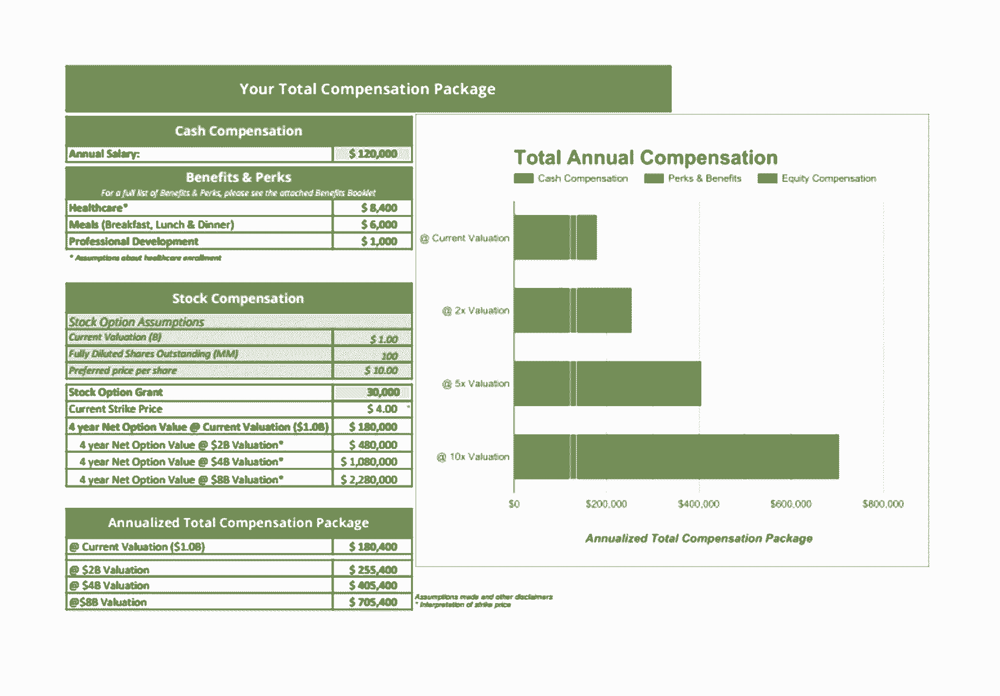

# Instacart 如何利用数据制定定制薪酬战略

> 原文：<https://review.firstround.com/how-instacart-uses-data-to-craft-a-bespoke-comp-strategy>

这是一个科技领域常见的比喻。创始人创办创业公司。创业公司开始制造产品。它迫切需要将该产品推向市场。为此，这家初创公司需要技术人才。工程师在创业公司面试。招聘经理(或早期的创始人或 VPE)喜欢一名候选人，并给出了一份工作机会。工程师要求更多——实质上更多。招聘经理需要这个“关键路径”招聘，并同意了。冲洗、循环、重复——更多的工程师加入进来。人数增加。产品上市。公司发展壮大。现在是正式确定绩效水平和薪酬方案的时候了，但是它们都在地图上。

如果这听起来很熟悉，那是因为它一直在发生。在压力下，初创公司需要速度，这使得自由式谈判或即插即用的公司数据资源具有吸引力。但这并不是必须的——如果一家公司想要一个健全的薪酬哲学，一个重视公平、透明和员工幸福的哲学，它就不能这样。输入 **[杰瑞米·史丹利](https://twitter.com/jeremystan "null")** 、 **[Udi Nir](https://www.linkedin.com/in/udinir/ "null")** 和 **[贵苏拜尔](https://www.linkedin.com/in/guissu/ "null")** ，分别是数据科学、工程和 HR 的 VP。他们是由 insta cart组建的多功能工作组，旨在改进公司的薪酬制度。它的系统没有被破坏，但他们希望它成为一个典范。所以他们开始工作。

往前闪几年。Instacart Engineering 是一个约 90 人的团队，一直在使用三人组的薪酬体系，并看到了有希望的结果。几年前，同一级别的工程师之间存在薪酬差异，金额高达数万美元。现在，83%的 Instacart 工程师的薪酬与他们的目标薪酬相差不到 5%，95%的工程师与目标薪酬相差不到 10%。三人组承认，他们的努力仍在进行中，但他们的变化不仅改善了候选人的体验，还帮助 Instacart 校准和预测了其当前团队如何增长。

在这次独家采访中，斯坦利、尼尔和拜尔解构了他们是如何建立一个更加透明和值得信赖的薪酬文化的。他们首先分享何时以及如何使用第三方 comp 数据作为输入来创建定制算法。他们还分解不同的数据源来添加数据。最后，他们分享了在讨论薪资和股权时如何将这些信息整合到招聘流程中，以及如何随着公司和市场的变化保持竞争力。让我们开始吧。

# 制定数据驱动的薪酬方法

在斯坦利、尼尔和拜尔开始他们的努力之前，Instacart 使用数据来确定补偿，但它对其方法没有那么自信。在其成长阶段，该公司发现它需要一种更复杂的方法。“会有不同的信号表明你需要一个更好的比较方法。对我们来说，我们注意到与候选人的对话产生了许多问题，而且来来回回。如果我们不能清楚地解释我们的方法，就会有疑问。拜尔说:“这很快就会变成不信任。“虽然我们早期的方法有缺陷，但我们并没有错。我们只知道我们希望在薪酬问题上更加一致，并明确表示我们的运营方法清晰且具有竞争力。”

“因此，我们首先在数据决策方面坚持与竞争对手相同的标准。Nir 说:“我们觉得我们应该向员工解释清楚我们是如何得出这些数字的——不仅仅是任何科技公司的数字，尤其是 Instacart 的数字。“这意味着需要一个新的流程来达到这种清晰性和一致性。这在短期内可能是痛苦的，但如果你不这样做，从长期来看将是痛苦的。因为当你成长时，痛苦会成倍增加。”

现在，在候选人与 Instacart 的招聘经理见面之前，该公司手头有三种信息:**市场数据、过去候选人的面试数据，以及帮助评估候选人贡献水平的指标**。每个类别都来自其自己的数据流合并，Instacart 三人组帮助识别、称重和微调这些数据流。

# 定制市场数据

在 Instacart 薪酬的三个分类输入中，市场数据是该公司继续进行大部分分析的地方。简而言之，它的目标是了解市场利率和当前支付价格之间的差异。虽然这听起来很简单，但需要对人才漏斗进行一些过滤。Instacart 是这样做的:

**给数据获取数据。**要在一家公司的早期阶段确定薪酬基准，你可能不清楚自己在与谁争夺人才，也不清楚自己需要挖掘的历史候选人数据。“有些公司，比如高级人力资源公司(Advanced HR)或拉德福德，会进行薪酬调查，汇总反馈，然后返回给参与者。早期，Instacart 发现这一调查数据特别有用，”Stanley 说。

“作为一家 A 轮或 B 轮公司，这在可靠性和可承受性方面都达到了最佳状态——介于你自己的猜测和自己的研究之间。拜尔说:“我会避免使用不遵循类似方法或多年没有进行过这些研究的其他来源，因为即使他们给出了一个大概的范围，我也发现这些数据不太可信或不太容易解释。”

**收获**:如果你还在早期融资阶段，而且你的团队大部分人都在开发产品，考虑坚持提供像[拉德福德调查](https://radford.aon.com/surveys "null")或[期权驱动](https://www.advanced-hr.com/products-overview#optiondriver "null")这样的服务。它将提供可靠的数据，不会占用你有限的资源。如果您有带宽或想要更精确的补偿公式，请继续。

与你的同伴一起检查。大多数薪酬调查或产品允许您按城市或邮政编码进行筛选，以使国家数据与公司所在地更相关。“这是一个好的开始，但地区并不等于同龄群体。拜尔说:“即使你能够与数据库中的一组特定公司进行比较，我们也发现与其他公司的人力资源或人事运营联系人联系会有所帮助。“大多数人感到惊讶的是，给另一家公司的同行——甚至是竞争对手——打电话会带来任何结果。但这不是交换公司编号。这是对哪些数据源有效、他们尝试过的方法以及他们在薪酬方面面临的挑战的水平设置。你会从处于你这个阶段的公司学到很多东西，就像那些成长稍早和稍晚的公司一样。我们都在努力解决这个问题，并保持我们的竞争战略。”

**要点**:如果你有时间，不要只是在你的薪酬调查数据库中微调过滤器。拿起电话，打电话给你的同伴来比较过程。以下是拜尔问自己的一些问题，以便在 Instacart 的同行群体中获得第一次机会:你的竞争对手是谁——不仅是商业上的，还有人才上的？谁的估值差不多？谁在使用相似的数据源做决策？

Guissu Baier

启动回归分析。这是 Instacart 提升其竞争战略的地方。“最初，我们的目标是从全国的数据出发，想出一些可以应用的因素，把我们从全国带到旧金山(Instacart 的总部所在地)，再从那里带到我们的同行、处于成长期的私营 B2C 科技公司。但我们意识到:这个因素会随着角色的变化而变化，”斯坦利说。

“这将因资历、职能、角色而异——一大堆不同的属性，”他说。“因此，提出这些因素本质上是一个挑战。我们最终使用更多的数据科学来建立回归模型，这些模型基于我们拥有的所有数据点。只是试图理顺这些数据，并估算出我们没有的数据。”

所以下面是斯坦利、尼尔和拜尔的建议:

**从你自己混合的行业数据开始，确定你的同行组合——以及现金对股票公式**。“早期创业公司可能只会以私营公司为基准。但是在成长阶段，你可能会混合使用私有和公有公司的数据。这就是我们的工作。具体来说，我们将我们的现金与其他私人公司进行比较。然而，我们与上市公司争夺人才，所以我们使用 TDC——实质上是全部现金激励和股权——来衡量上市公司，”Guissu 说。“然后，我们收回现金，用股权支付余额。我们相信我们的股票价值会不断增长，如果公司实现了目标，我们的薪酬方案价值将超过上市公司员工的收入。”

**给这个数据分配属性。“然后我们添加信息，根据角色给出背景，”Stanley 说。“我们从私有和公共数据库中收集或提取所有角色的数据。这让我们了解了这些职位的组织结构。我们捕捉并分类业务单位或团队、其职能、资历级别(从副总裁到个人贡献者)以及教育水平(从应届毕业生到博士)。”**

**建立回归模型。然后，我们获取所有这些数据，并在此基础上建立一个回归模型。斯坦利说:“这是根据有多少公司向每一个这样的单元汇报而定的。”。“我们加入了一些因素，这些因素将根据地理区域、资历水平和相对于组织结构的职位进行调整。然后，我们慢慢地加入我们所谓的“互动效应”，它允许一个变量改变另一个变量的效应——例如，资历水平对不同职位的薪酬产生不同的影响。这可以让你看到一个产品经理从三级到四级到五级到六级时，她的收入增加了多少。以及这个斜率对于工程师或工程经理来说有什么不同。或者仅仅使用旧金山的数据，斜率是如何变化的。”**

**调整好自己的位置，理顺数据。斯坦利说:“这种分析可以帮助你调整你在竞争对手群体中的整体相对位置。”。“我们做了一些称为正则化的事情，以防止数据过度拟合。如果你不这么做，那么你的薪酬最终会大幅波动，甚至会出现无意义的结果，比如某个职位的薪酬会随着资历而下降。”**

**要点**回归分析可以让你将基准缩小到更有竞争力的群体，同时仍能提供稀有职位和资历级别的有意义数据，从而更有信心你的薪酬相对于你的同行群体而言是有目标的。“让我钻点家。假设你正在寻找一个五级机器学习工程师的职位。在全国范围内，可能有数百家公司拥有这些人——甚至数千家。因此，你得到的数据将是工资中位数或直接薪酬总额中位数，以及第 75 和第 95 个百分点，”斯坦利说。“问题是，这不是我们争夺人才的对手——我们在旧金山与 Airbnb、Stripe、优步、谷歌、脸书和 Slack 等 B2C 公司竞争。当您将数据分割到该群组时，可能没有足够多的公司可供供应商向您提供任何信息，因为他们有最小的报告样本量。通过运行回归分析，您可以利用所有数据，包括更常见的级别、相似的角色和其他地理位置，以便估计您的真正竞争对手为该角色支付的价格。这会让你对自己的薪酬目标有一个更自信的估计。”

Jeremy Stanley

# 定义您的市场定位和员工水平

一旦 Instacart 回到其定制的竞争队伍中，它对自己的方法以及与候选人关于薪酬的谈话就更有信心了。然后，相对于竞争对手，它必须确定自己在任何一个职位的薪酬上的定位。

“我们有自己的定制市场数据集。但同样重要的是我们明确的过程来决定我们希望*在那个市场数据中处于*什么位置，这是一个完全不同的过程，”Nir 说。“我对创业公司的建议是我们自己遵循的:把自己放在一个强有力的位置来赢得候选人，但不要指望每次都有最好的薪酬。此外，最高奖金并不总是赢。我们已经看到，通过公平支付，精心制作一个令人兴奋的角色，并传达一个令人信服的使命，就能达成交易。这不仅仅是报酬的问题。如果是的话，你可能不想要这份工作。”

关于竞争的市场数据没有经过贵公司的实战检验。与候选人进行几轮较量。看看它是否站得住脚。

确定他们想要进入的市场百分比是一项内部决策，也是 Instacart 团队保密的指标。然而，等式的另一部分是让候选人清楚他们的角色级别——与薪酬挂钩。“从一开始就要考虑以下几个关键原则:首先，如果你不精确地知道如何平衡员工，那么再多的市场数据也帮不了你。斯坦利说:“你最终只会把苹果和橘子相提并论。”。“其次，一旦您定义了精确均衡，就要逐个短语地将其与您从第三方数据中获得的均衡进行比较。如果不匹配，并不意味着你需要改变你的水平，但你需要知道这是不同的。在某些情况下，我们的第 4 级是另一家公司的第 5 级，这对薪酬有很大影响。”

到目前为止，Instacart 已经在其工程团队中试行了这种方法，并在整个组织中完善级别和角色定义。对于 Instacart Engineering，每个级别都有深入的描述，但这里概括如下:

**第一关**:你的职业生涯才刚刚开始。

第二级:你很有效率，但仍在学习。

第三级:你是一个可靠的、值得信任的高级贡献者。

**第四级**:你让你的团队明显变得更好。

**第五级**:你让你的组织(比如工程)和 Instacart 变得更好。

**第六关**:你在改变行业。

以下是关于这些级别的三个关键原则:

报酬是基于贡献，而不是资历。“这是我们想要回答的问题:这位候选人会产生什么样的影响？你会注意到这些描述集中在*身上，他*受到了个人贡献的影响。对于一级和二级，影响主要是在个人身上，然后从那里向外扩展，”NIr 说。“我们使用一个标准来衡量他们的影响如何映射到 Instacart，而不是他们迄今为止的职业生涯。这与他们的教育或多年经验关系不大。”

**这不是线性标尺**。“事实上，把它想象成一个对数标度。“达到下一个级别的难度是达到上一个级别的两倍，”Nir 说。“这需要时间。有时要花很长时间才能升级。在一个水平之内有成长的空间。表现出更高水平的行为和技能的明星员工通常会在 6-18 个月内得到提升。对于更高的级别来说会更长。有些人会达到一定的水平，但仍会为 Instacart 的成功做出巨大贡献。”

这些原则强化了招聘过程——无论是招聘还是招聘后。“分享这些级别的目的是阐明在 Instacart 中更高级意味着什么，帮助 ICs 了解他们如何才能成长，支持经理评估他们的团队，并建立公平校准薪酬调整的做法，”Nir 说。“如果你注意到，这些不仅仅是用于招聘过程的屏幕。我们只是尽可能早地向候选人介绍他们——在他们可能加入之前。这是我们介绍自己并保持一致的第一步，也是最好的一步。”

除了这些原则，**每一个层次都符合对公司价值观的一定深度的理解。“我们也给每个等级附加特征。所以，在工程学中，我们已经很清楚一个工程师可以有不同的层次。尽管我们试图理解这些层次的精神，而不是确切的措辞，”杰里米说。**

简而言之，它们是**所有权**(把 Instacart 当作“你的宝贝”)、**智慧**(你做出良好判断的能力)、**知识**(帮助你执行的印章，与智慧分开)、**影响力**(通过帮助他人发挥杠杆作用)和**社区**(大使和主持人的角色)。

下面是这个**价值指标**如何寻找三级工程师的例子:

所有权。当你认为有必要时，你会主动承担责任，并在需要时让他人对自己的责任负责。

**智慧。**无论是从业务角度还是从技术角度，你对自己的领域都有很好的理解。你建议可以推动业务发展的功能和项目。您评估提议功能的潜在影响。你理解并能清楚地表达这些特性的短期和长期技术含义(成本、规模、复杂性等)。).在做出权衡决策时，你有很好的判断力。

**知识。**你需要使用已知的技术/方法，独立实施解决方案，解决预先定义的问题。您对我们的技术基础(如语言、框架等)有深入的了解。).您了解性能、可扩展性和健壮性的含义。你有扎实的软件设计和系统设计技能。您可以选择工具、库等。你知道什么时候写测试，什么时候不写。

**影响力。**你自给自足。你至少掌握了一个领域/系统，并且能够为其他人提供指导。您可以通过改进我们的文档、获取提示&技巧等方式与团队分享您的经验。您对拉动式请求给出了很好的反馈。你的个性和态度对团队有积极的影响。

**社区。你参加当地的聚会。你给闪电说话。您帮助编写开源项目的文档。你定期在工程或功能午餐上做内部介绍。**

Udi Nir

# 对你的薪酬策略进行压力测试

其经过算法调整的市场数据和价值指标不仅表明 Instacart 对其薪酬进行了深思熟虑，还表明它的设计是公平的。这种跑腿工作对帮助公司自信地与候选人谈判至关重要。**尽管 Instacart 在薪酬问题上立场坚定，但当候选人开始谈判时，insta cart 仍会收集见解。**

“市场数据和与 comp 的候选人谈判相互验证。密切关注那些没有被立即接受，但没有被拒绝的提议。如果你的提议有效，那意味着你可能在范围内。尼尔说:“回答求职者的薪酬问题或讨论他们的其他提议，只会让你更详细地了解你的薪酬目标，并帮助你在未来的工作中不受天气影响。“例如，在进行了多次面试后，我们很早就意识到我们在某些分析职位上的表现一直低于市场水平。这是一个信号，因此我们重新审视了我们对角色的定义，调整了我们的算法以及公共和私人数据的定制混合，以将薪酬目标设定在正确的水平。”

一个关键的警告:**不要收集信息来谈判一个单独的报价，而是要校准*****你如何给出未来的报价。“我们发现，候选人通常会提供他们目前的收入和期望的收入——通常是在面试过程中，当然也包括面试之后。他们希望我们知道这些信息，我们希望他们知道我们支付公平。因此，我们不仅在个人谈话中记录这些期望，还将其作为改善我们整体薪酬策略的数据，”Stanley 说。“但重要的是:我们在工程类候选人面前明确表示，我们的目标是公平补偿，但不会讨价还价。如果他们仍然想拒绝，我们会记录并收集这些数据，即使他们决定不接受这个提议。如果我们发现无法在现有范围内找到多个候选人，我们会重新评估我们的角色定义、级别、数据和流程。但我们不会在面试中当场决定。我们在 comp 上保持内部对等的能力岌岌可危。”***

*即使我们想要一个候选人，我们更希望整个组织的薪酬标准一致。我们不想为了一个乘客而搅乱整艘船。*

# *坚定和灵活的艺术*

*反对谈判的政策并不意味着，如果一位受人喜爱的候选人不愿在更高的薪酬预期上让步，谈判就不会成功。这里有几种方法来处理这种情况:*

***给出股权/工资余额的期权**。“如果他们寻求更高的报酬，薪水只是一个杠杆。候选人能做的就是用现金换股权。我们有一个正式的流程，涉及这些选项之间的对话。我们从生活方式和风险的角度来谈论它。例如，如果你需要更多的现金，因为你有抵押贷款或家庭责任，你可以用股票换现金。但如果你想在公司上下更大的赌注，你也可以这么做，”尼尔说。“我们大约 20%的工程师选择改变他们的股权/薪酬平衡，其中 75%的人选择更多的现金，这是出于人生阶段的原因，也是因为我们的报价以股权为主。了解*为什么*人们选择重新平衡他们薪酬的这些部分是关键。我们想知道他们的理由，不仅是为了获得数据，也是为了更好地了解如何支持他们。”*

***让市场赶上薪酬过高的现任者。斯坦利说:“如果你像大多数初创公司一样，你会有早期雇员或一次性雇员，他们的薪酬可能高于现在的标准水平。”。“如果你正在为每个级别制定一致的薪酬，那么就让它们在短期内成为异常值。如果你给了一个员工太多的钱，不要降低他们的报酬。那是你的错误；不要让员工为此买单。对于我们给员工过高薪酬的情况，我们会让他们保持在这个水平，直到市场上涨。同样，如果我们给他们的薪酬过低，我们会提高他们的薪酬。”***

# *让股票更容易获得，比如现金*

*Instacart 有两种做法，人们发现它们与 comp 的股权部分有很大的不同。第一个是**工作表，概述了职位薪酬的全部** **福利**。这不仅包括工资和股权，还包括公司对医疗保健的贡献、职业发展预算和其他福利，如餐饮。与以下文档类似的工作表与候选人共享:*

*

Sample Compensation Worksheet* 

*总体薪酬方案文件中最有帮助的部分之一是公司如何计算候选人在不同估值下的股票期权价值。Baier 说:“由于员工在雇佣后会收到晋升或更新补助，我们开始发布更新的工作表，以便他们可以继续跟踪他们的股权价值。”“此外，我们正在举办一系列股票期权研讨会，在研讨会上，我们的高管将一步一步地解释股票期权的工作原理，例如什么是授权日期，什么是授予日期。它深入到如何计算估值。这些都发生在 20 人左右的小群体中，所以员工可以提问。”*

*其次，Instacart 已经加入了越来越多具有前瞻性思维的科技初创公司的行列，如比特币基地、Pinterest、Asana、Gusto 和 T2 振幅，延长了 90 天的窗口期，在此期间，初创公司的大多数离职员工必须行使他们的既得股票期权，至 7 年或更长时间。“90 天的窗口期通常会导致员工放弃股票，因为他们买不起，或者激励他们留下来，即使他们不开心。前者剥夺了员工的权力。拜尔说:“后者创造了一种‘休息和背心’的心态，降低了生产率，侵蚀了品牌。“因此，我们决定将锻炼时间延长至 7 年。我们希望员工权益成为薪酬*和*的保留工具。两者都不需要金手铐。对于既得权益，我们希望员工感觉他们对它和他们的命运有灵活性。当然，我们希望是在 Instacart，但如果不是，我们不希望他们留下来的原因是因为他们承担不起离开的费用。”*

# *像校友一样追踪前员工*

*候选人被雇用，员工履行他们的任期。如果他们决定离开，Instacart 还会利用任何离职机会来完善他们的薪酬策略，以便将其流失率控制在同行公司的范围内。“我们跟踪减员情况。Guissu 说:“流失数据并不完美，而且严重滞后，但它是帮助我们完善薪酬战略的又一个数据来源。”“人们告诉你他们离开是因为他们在另一个职位上获得了更高的薪酬，这种情况并不常见，但这仍然是我们想要追踪的事情。但最重要的是，我们希望确保我们的流失率不会与其他公司经历的不相称。如果是的话——我们开始看到市场数据相对于我们支付的价格有很大的差距——我们就能够把两者结合起来进行调整。损耗是帮助验证我们的数据驱动模型的另一个数据点。”*

*我的目标是让人们不去想 comp。他们只知道自己受到了公平的对待，可以放心地将自己的精力投入到业务发展中。*

# *全部加起来*

*致准备招聘的初创企业领导人:在你顶着压力去填补关键职位，并试图为那个必备的工程师挤出职位的薪酬范围之前，先做些跑腿的工作。一个透明、可信的薪酬体系需要付出努力，但会带来回报。第三方提供商的薪酬数据是一个有效的起点。使用私有数据和公共数据的混合来创建一个更加定制的对等组，以此作为基准。这个群体应该反映你的成长阶段和你争夺人才的公司类型。根据这些公司中的角色分层，如地区、资历和职能。构建一个回归模型，并添加交互效应以更好地操纵变量和正则化，从而避免过度拟合数据。将这种智能映射到按职能划分的员工级别。然后与你的候选人和员工一起对这些薪酬目标进行压力测试。这意味着要跟踪薪资预期、竞争性报价和流失率等指标。所有这些输入都有助于在现实中为你的算法打下基础，并更有效、更公平地竞争人才。*

*“投资于薪酬方法就是投资于你的员工——那些你已经雇佣和将要雇佣的人。但我听说早期创业公司在没有认真考虑整体薪酬哲学的情况下就直接开始招聘。这是一种用你的未来雇员抵押给你的早期雇员的快速方法，通过无意中创造出“现任者”,他们最终会成为公司的局外人。斯坦利说:“这可能不会马上痛，但随着时间的推移，你会感到疼痛加剧。“尽快制定一个更加定制化、数据驱动的薪酬方法。你将创建一个更持久的系统，建立在你支付公平的信心以及候选人和员工都认可的一致性之上。如果你做得对，你不仅会决定员工的薪酬，还会开始感受到他们的价值。那时，你的货币不仅是你提供的薪酬，也是你建立的文化。那是强大的。”*

**摄影由* *[邦妮雷伊米尔斯](http://www.bonnieraemillsphoto.com/ "null")* *。**