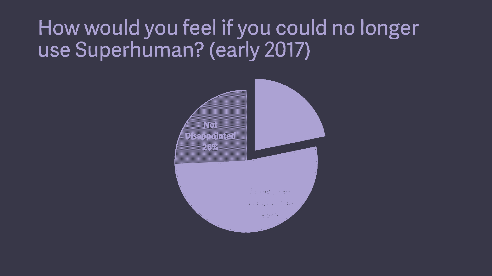
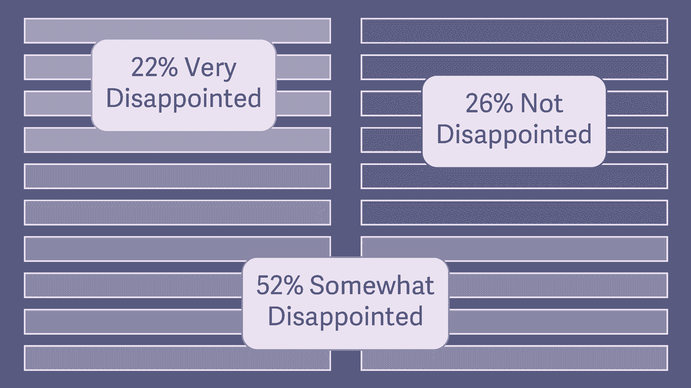
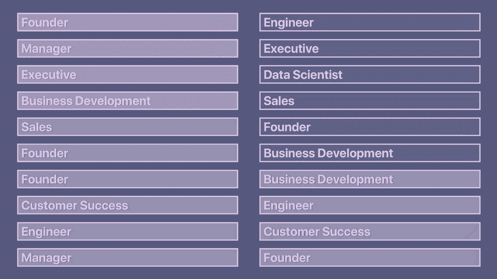
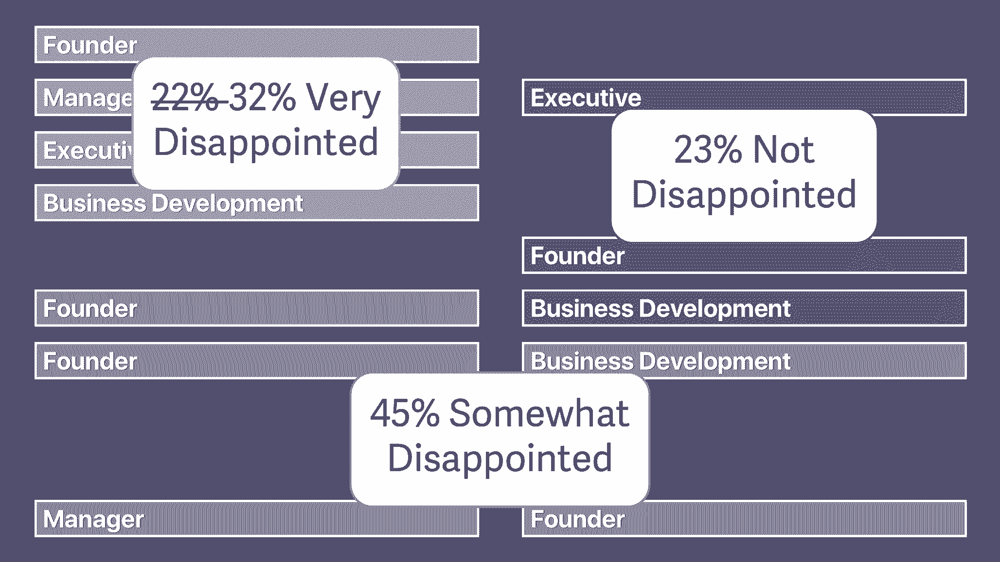
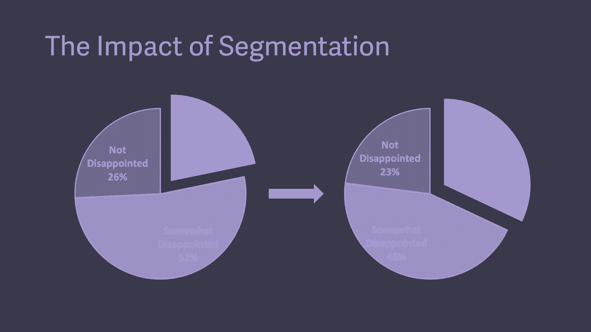
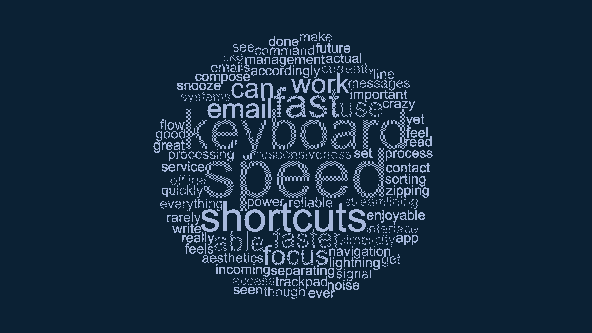
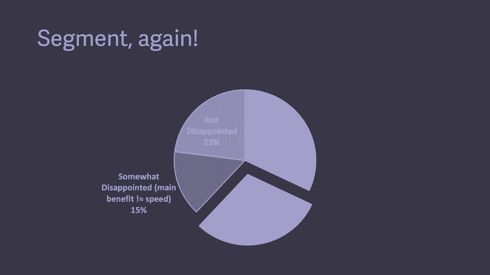
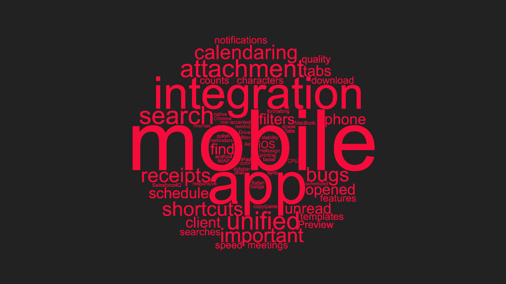
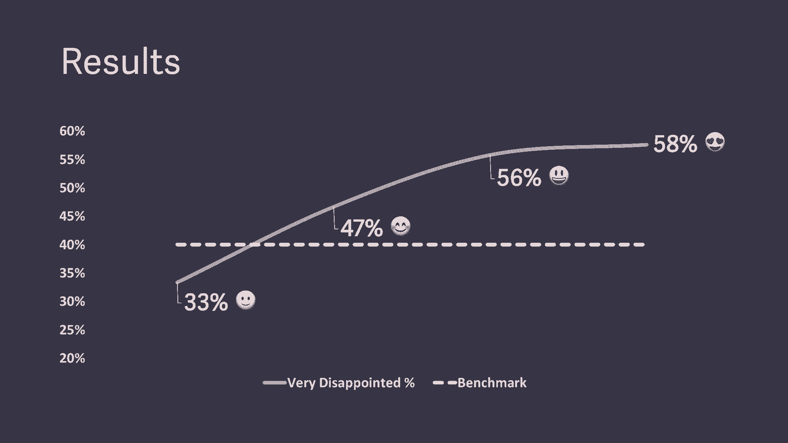

# 超人如何制造引擎来找到适合市场的产品

> 原文：<https://review.firstround.com/how-superhuman-built-an-engine-to-find-product-market-fit>

*本文由* *[拉胡尔·沃赫拉](https://www.linkedin.com/in/rahulvohra/ "null")***[超人](https://superhuman.com/?utm_source=first-round-review&utm_medium=blog&utm_campaign=product-market-fit "null")**——一家创业公司的创始人兼 CEO 打造世界上最快的电子邮件体验。**

*我们都听说过，产品/市场匹配推动创业成功，而缺乏产品/市场匹配是几乎每一次失败背后的潜在原因。*

*对于创始人来说，实现产品/市场匹配从第一天起就是一个困扰。这是我们正在努力跨越的巨大障碍，也是让我们夜不能寐的不断恶化的恐惧，担心我们永远也不会成功。但是当谈到了解什么样的产品/市场真正适合以及*如何达到*的时候，我们大多数人很快意识到没有一个久经考验的方法。*

*2017 年夏天，我一直在寻找一种方法，为我的初创公司 [Superhuman](https://superhuman.com/?utm_source=first-round-review&utm_medium=blog&utm_campaign=product-market-fit "null") 找到合适的产品/市场。回到经典的博客文章和开创性的思想片段，我注意到一些观察。Y Combinator 创始人保罗·格拉厄姆将产品/市场契合度描述为当你[做出了人们想要的东西](http://www.paulgraham.com/13sentences.html "null")，而山姆·奥特曼[将其描述为当用户自发地告诉其他人使用你的产品。当然，被引用最多的描述来自马克·安德森 2007 年的博客文章:](http://blog.samaltman.com/before-growth "null")*

**“你总能感觉到当产品/市场契合度是* ***而不是*** *发生的时候。客户没有从产品中获得足够的价值，口碑没有传播开来，使用率没有快速增长，媒体评论有点“废话”，销售周期太长，很多交易永远不会成交。**

*当**发生时，你总能感觉到产品/市场的契合。客户购买产品的速度与您生产产品的速度一样快，或者使用量的增长速度与您添加更多服务器的速度一样快。客户的钱在你公司的支票账户上堆积如山。你正在尽可能快地招聘销售和客户支持人员。记者打电话来是因为他们听说了你的热门新东西，他们想和你谈谈。你开始获得哈佛商学院颁发的年度企业家奖。投资银行家正在监视你的房子。”***

**对我来说，这是最生动的定义——也是我透过泪水凝视的定义。**

**2015 年，我们成立了工作室，并开始编写超人代码。一年后，我们的团队已经发展到 7 人，我们仍然在疯狂地编码。到 2017 年夏天，我们已经有了 14 个人——我们还在*编码。我感受到了来自团队和我自己的巨大压力。我之前的创业公司 [Rapportive](http://rapportive.com/ "null") ，在更短的时间内就已经启动、壮大并被 LinkedIn[收购](https://medium.com/swlh/rip-mailbox-or-founders-how-to-stop-worrying-and-love-being-acquired-261da4f6d566 "null")。然而，我们在这里，两年了，我们没有通过。***

**但是不管压力有多大，我都没有准备好发射。通常的做法是“把它扔出去，看看有什么能坚持下来”，当沉没成本较低时，经过几个月的努力，这可能是好的。但是“发射然后看看会发生什么”的方法在我看来是不负责任和鲁莽的——特别是考虑到我们已经投资了这么多年。**

**

Superhuman founder and CEO Rahul Vohra** 

**进一步加剧压力的是，作为一名创始人，我不能直接告诉团队我的感受。这些雄心勃勃的工程师将他们的心和灵魂倾注到了产品中。我没有办法告诉团队我们没有准备好，更糟糕的是，没有摆脱这种局面的策略——这不是他们想听到的。我想找到合适的语言或框架来表达我们当前的立场，并传达将使我们达到产品/市场契合度的下一步措施，但很难做到这一点。**

**这是因为我发现的产品/市场契合度的描述对上市后的公司非常有帮助。如果在发布后，收入没有增长，融资困难，媒体不想和你说话，用户增长乏力，那么你可以有把握地得出结论，你没有合适的产品/市场。但在实践中，由于我之前作为创始人的成功，我们在筹集资金方面没有问题。我们本可以受到媒体的关注，但我们积极地避免了。用户增长并没有发生，因为我们故意选择不搭载更多的用户。我们处于预发布阶段，我们没有任何指标来清楚地说明我们的情况。**

**对产品/市场适合度的描述似乎都是事后的，不可操作的。我清楚地知道我们所处的位置，但是我没有办法把这一点传达给其他人——也没有下一步的计划。**

**所以我绞尽脑汁寻找答案，如何在超人所在的地方和我们需要达到的高标准之间旅行。我最终开始思考:**如果你能衡量产品/市场的契合度会怎么样？**因为如果你能*衡量*产品/市场契合度，那么也许你能*优化*它。然后，也许你可以*系统地提高*产品/市场的契合度，直到你达到目标。**

**围绕这一目标重新定位，并通过新的方向重新注入活力，我开始对产品/市场匹配的过程进行逆向工程。下面，我概述了随后的调查结果，特别是解开了使一切井井有条的澄清指标，以及我们用来构建引擎的四步过程，该引擎推动超人在找到我们的适合的道路上前进。**

# **围绕一个指标锚定:产品/市场契合度的领先指标**

**在我寻求了解产品/市场适合度的过程中，我阅读了所有我能阅读的资料，并与我能找到的每一位专家交谈。当我发现[肖恩·埃利斯](https://www.linkedin.com/in/seanellis "null")时，一切都改变了，他在 [Dropbox](https://www.dropbox.com/ "null") 、 [LogMeIn](https://www.logmein.com/ "null") 和 [Eventbrite](https://www.eventbrite.com/ "null") 的早期经营早期增长，后来创造了“增长黑客”这个术语**

**我发现的产品/市场契合度的定义生动而有说服力，但它们是滞后于指标的指标——当投资银行家在监视你的房子时，你已经有了产品/市场契合度。相反，埃利斯让[找到了](http://www.startup-marketing.com/the-startup-pyramid/ "null")一个*领先*指标:**只要问用户“如果你不能再使用这个产品，你会有什么感觉？”测量回答“非常失望”的百分比****

**在用他的[客户发展调查](https://pmfsurvey.com/ "null")对近 100 家创业公司进行基准测试后，埃利斯发现神奇的数字是 40%。努力寻求增长的公司几乎总是有不到 40%的用户回答“非常失望”，而具有强大牵引力的公司几乎总是超过这个阈值。**

**问问你的用户，如果他们不能再使用你的产品，他们会有什么感受。回答“非常失望”的那一组将打开产品/市场契合度。**

**一个很有帮助的例子来自于 [Hiten Shah](https://firstround.com/review/advice-is-cheap-context-is-priceless/ "null") ，他在 2015 年的一个开放研究项目中向 [731 Slack 用户](https://hitenism.com/slack-product-market-fit-survey/ "null")提出了 Ellis 的问题。这些用户中有 51%的人回答说，如果没有 Slack，他们会非常失望，这表明当该产品拥有大约 50 万付费用户时，它确实达到了产品/市场适合度。今天，考虑到 Slack 的[传奇成功故事](https://firstround.com/review/From-0-to-1B-Slacks-Founder-Shares-Their-Epic-Launch-Strategy/ "null")，这并不太令人惊讶。实际上，这个例子显示了要超过 40%的基准有多难。**

**受到这种方法的启发，我们开始测量超人的反应。根据 Ellis 的建议，我们确定了最近体验过我们产品核心的用户，重点关注那些在过去两周内至少使用过该产品两次的用户。(当时我们有 100 到 200 名用户需要投票，但规模较小、处于早期阶段的初创公司不应该回避这种策略——你开始在 40 名受访者左右获得方向正确的结果，这比大多数人想象的要少得多。)**

**然后，我们通过电子邮件向这些用户发送了一份[类型表格](https://www.typeform.com/ "null")调查的链接，询问了以下四个问题:**

****1。如果不能再用超人，你会有什么感受？** *A)非常失望 B)有点失望 C)不失望***

****2。你认为什么类型的人会从超人中受益最多？****

****3。你从超人那里得到的主要好处是什么？****

****4。我们怎样才能为你改善超人？****

**根据收集到的回答，我们分析了第一个问题:**

****

**只有 22%的人选择了“非常失望”的答案，很明显，超人还没有达到产品/市场契合度。虽然这个结果看起来令人沮丧，但我反而充满活力。我有了一个向团队解释我们情况的工具，最令人兴奋的是，还有一个提升我们产品/市场契合度的计划**

# **从基准到引擎:优化产品/市场匹配的四步手册**

**决心改变现状，我开始特别关注如何提高我们的产品/市场契合度得分。对每个调查问题的回答将成为实现我们目标的框架的关键要素。**

**以下是构成我们产品/市场契合度引擎的四个组成部分:**

# **1)细分以找到你的支持者，并描绘出你的高期望客户。**

**通过早期营销，你可能吸引了各种各样的用户——特别是如果你有媒体，并且你的产品在某种程度上是免费的。但是这些人中的许多人都不够格；他们对你的产品没有真正的需求，它的主要好处或使用案例可能并不适合你。无论如何，你都不会希望这些人成为用户。**

**作为一个早期团队，你可以用先入为主的概念来缩小市场，比如你认为产品是给谁用的，但这不会教给你任何新东西。相反，如果你使用“非常失望”的调查受访者群体作为缩小市场的镜头，数据会自己说话——你甚至可以发现你的产品产生强烈共鸣的不同市场。**

**对我来说，细分的目标是找到超人可能有更好的产品/市场契合度的领域，那些我可能忽略或没有想到要深入的领域。**

**首先，我们根据他们对第一个问题的回答(“如果你不能再使用超人，你会有什么感觉？”):**

****

**然后，我们给每个填写调查的人分配一个角色。**

****

**接下来，我们观察了出现在非常失望的群体中的人物角色——22%的人是我们最大的支持者——并利用这些人物角色来缩小市场。在这个简化的例子中，你可以看到我们专注于创始人、经理、高管和业务发展——暂时忽略了所有其他角色。**

****

**有了这个更细分的数据视图，数字就发生了变化。通过细分到最喜欢我们产品的非常失望的群体，我们的产品/市场契合度得分上升了 10%。我们还没有达到梦寐以求的 40%,但是我们已经非常接近了。**

****

**为了更深入，我想更好地了解这些真正喜欢我们产品的用户。我希望尽可能生动地描绘他们，这样我可以激励整个团队更好地为他们服务。**

**我求助于[朱莉·潘素](https://www.linkedin.com/in/juliesupan/ "null")的[高期望客户框架](https://firstround.com/review/what-i-learned-from-developing-branding-for-airbnb-dropbox-and-thumbtack/ "null")作为一个工具来做到这一点。潘素指出，高期望客户(HXC)并不是一个包罗万象的角色，而是你的目标人群中最有眼光的人。最重要的是，他们会享受你的产品带来的最大好处，并帮助传播这个词。例如，Airbnb 的 HXC 不只是想去新的地方，而是想有归属感。对于 Dropbox，HXC 人希望保持有序，简化他们的生活，并确保他们一生的工作安全。**

**考虑到这一点，我试图找出超人的 HXC。我们只选择了那些没有我们的产品会非常失望的用户，并分析了他们对调查中第二个问题的反应:“你认为什么样的人会从超人身上受益最多？”**

**这是一个非常有力的问题，因为快乐的用户几乎总是用对他们最重要的词来描述自己，而不是其他人。这让你知道产品是为谁工作的，以及与他们产生共鸣的语言(也为你的营销文案提供了有价值的核心见解)。**

**利用顾客的话语和潘素的建议，我们精心制作了超人 HXC 丰富而详细的图像:**

***妮可是一位工作努力的专业人士，与许多人打过交道。例如，她可能是执行官、创始人、经理或业务开发人员。妮可工作时间很长，经常工作到周末。她认为自己很忙，希望有更多的时间。Nicole 觉得自己似乎很有成效，但她很清楚自己可以做得更好，并且会偶尔研究改进的方法。她每天大部分时间都呆在收件箱里，阅读 100 至 200 封电子邮件，通常一天会发送 15 至 40 封(非常忙的时候会发送 80 封)。***

***妮可认为反应灵敏是她工作的一部分，她为此感到自豪。她知道不响应可能会阻碍她的团队，损害她的声誉，或导致错失机会。她的目标是到达零收件箱，但是一周最多两三次。偶尔——也许一年一次——她会宣布电子邮件破产。她通常有一个成长的心态。虽然她对新产品持开放态度，并紧跟技术潮流，但她可能对电子邮件有一种固定的思维模式。虽然对新客户开放，她怀疑一个可以让她更快。***

**考虑到我们的 HXC，我们有了一个工具，可以让整个公司专注于比任何人都更好地服务于这个狭窄的细分市场。有些人可能会发现这种方法过于局限，认为你不应该在早期就缩小这样一个特定的客户群。**

**人们普遍认为，将产品过于狭隘地针对较小的目标市场，意味着增长将会遇到上限——但我认为事实并非如此。**

**这些来自保罗·格拉厄姆的智慧之言解释了为什么:**

**“当一家初创公司启动时，至少会有一些用户真正需要他们所做的东西——不仅仅是那些可能看到自己有一天会使用它的人，而是那些迫切想要它的人。通常这个最初的用户群很小，原因很简单，如果有大量的人迫切需要的东西，并且可以用创业公司通常投入到版本 1 中的努力来建立，那么它可能已经存在了。这意味着你必须在一个维度上做出妥协:你要么做一些大多数人想要的少量的东西，要么做一些少数人想要的大量的东西。选择后者。并非所有这种类型的想法都是好的创业想法，但几乎所有好的创业想法都是这种类型的。”**

**在另一篇文章中，他进一步阐述了这一点:**

***“理论上，这种爬山法可能会让初创公司陷入困境。它们可能会达到局部最大值。但实际上这从未发生过。…创业想法空间中的最大值不是尖锐的和孤立的。大多数相当好的想法都与更好的想法相邻。”***

**本质上，做一个小部分人要的量大的东西，比做一个大部分人要的量小的产品要好。在我看来，缩小市场的产品/市场匹配引擎过程极大地优化了一种少数人想要大量的产品。**

# **2)分析反馈，将骑墙派用户转化为狂热分子。**

**然而，仅仅筛选到 HXCs 是不够的。我们已经走得很窄了，但现在需要更深入地挖掘。由于我们低于 40%的门槛，我们需要弄清楚为什么这个更小的子集真的喜欢超人——以及我们如何才能让更多的用户进入这个细分市场。**

**为了深入了解我们将如何改进产品并扩大其吸引力的深度，我发现将精力集中在以下关键问题上很有帮助:**

*****为什么*** **人们喜爱产品？****

****什么** ***阻碍人们对产品的热爱*** **？****

**为了理解为什么用户喜欢超人，我们再次转向那些没有我们的产品会非常失望的人。这一次，我们看了他们对调查中第三个问题的回答:“你从超人那里得到的主要好处是什么？”**

**以下是一些突出的答案示例:**

**“超人处理邮件的速度快得多，原因有二:一次显示一封邮件，整体速度比 gmail 快得多。我用一半的时间就能看完收件箱。”**

**“速度！这款应用程序运行速度非常快，UX +键盘快捷键让我成为了真正的超人。”**

**“使用超人比使用 Gmail 要快得多。差远了。它反映了我最喜欢的 Gmail 快捷方式，所以对于一个超级 Gmail 用户来说，没有学习曲线。”**

**“我可以更快地处理收到的电子邮件，相应地对邮件进行分类，并简化我的工作流程。”**

**“速度。审美。我可以从键盘上做任何事情。”**

**“速度和伟大的键盘快捷键集。我很少使用触控板。”**

**在将这些回复放入一个单词云之后，一些共同的主题出现了:喜爱我们产品的用户最欣赏超人的速度、专注和键盘快捷键。**

****

**对产品的吸引力有了更深的理解后，我们将注意力转向如何帮助更多的人喜欢超人。**

**我们的下一步有点违反直觉:**我们决定礼貌地传递用户的反馈，如果他们不再使用该产品，他们不会感到失望。****

**这批没有失望的用户不应该以任何方式影响你的产品策略。他们会要求分散注意力的功能，提出不合适的用例，可能会非常直言不讳，所有这些都是在他们粗制滥造并给你留下一个混乱的路线图之前。尽管看起来令人惊讶或痛苦，但不要根据他们的反馈采取行动——这会让你在寻找产品/市场契合度时误入歧途。**

**委婉地无视那些没有你的产品就不会失望的人。他们根本不爱你，所以他们基本上是一个失败的事业。**

**没有你的产品，用户会有些失望。一方面,“有点”表示一个开端。吸引力的种子就在那里；也许通过一些调整，你可以说服他们爱上你的产品。但另一方面，不管你做什么，没有你的产品，这些人很可能永远不会失望。**

**为了微调我们从谁那里得到线索，我们再次进行了细分。通过分析我们的第三个调查问题，我们知道快乐的超人用户将速度作为他们的主要优势，因此我们将此作为有点失望的群体的过滤器:**

****

**在围绕速度将有些失望的小组分成两个新的部分后，我们决定对他们的反馈采取以下行动:**

****有些失望的用户认为速度是** ***而不是*** **主要好处:**我们选择礼貌地忽略他们，因为我们的主要好处没有引起共鸣。即使我们制造了他们想要的一切，他们也不太可能爱上这个产品。**

****有些失望的用户，因为速度** ***是*** **的主要收益:**我们非常关注*这个群体，因为我们的主要收益确实引起了共鸣。某种东西——可能是某种小东西——阻止了他们。***

**针对这最后一组人，我们更仔细地观察了他们对调查中第四个问题的回答:“我们怎样才能为你改善超人？”**

**这是我们看到的:**

****

**经过一些分析，我们发现阻碍我们用户的主要原因很简单:**我们缺乏移动应用。**2015 年，我们采取了逆势策略，从台式机开始。大多数电子邮件是从桌面发送的，所以我们认为这是我们可以增加价值的地方。我们一直计划开发一个移动应用程序，但在我们旅程的开始——像所有创业公司一样——我们只有一个赌注的筹码。在 2017 年，很明显我们不能再拖延了，移动已经成为产品/市场契合度的关键。**

**进一步调查，我们发现一些不太明显但更有趣的请求:集成、附件处理、日历、统一收件箱、更好的搜索、阅读回执等等。例如，作为一家初创公司，在内部我们并没有大量使用我们的日历，我们也不会根据自己对电子邮件的直觉来优先考虑日历。因此，这种挖掘反馈的过程在产品优先级列表上被大大提升了。**

**有了对我们的主要优势和缺失特征的清晰理解，我们所要做的就是将这些见解引导回我们如何建造超人。实现这种分段的反馈可以帮助有些失望的用户离开围栏，进入热情拥护者的领地。**

# **3)通过加倍关注用户喜爱的东西并解决阻碍他人的问题来构建您的路线图。**

**尽管我们明白为什么用户喜欢我们的产品，以及是什么阻碍了其他人，但最初并不清楚当涉及到承诺产品路线图时，我们将如何处理这两者之间的紧张关系。**

**我最终意识到:**如果你只在用户喜欢的东西上下双倍赌注，你的产品/市场契合度分数不会增加。如果你只解决阻碍用户的问题，你的竞争对手很可能会超过你。**这一见解指导了我们的产品规划流程，有效地为我们书写了路线图。**

**为了让我们非常失望的用户喜欢的东西翻倍，我们的路线图有一半致力于以下主题:**

****速度更快。超人已经非常快了，但我们努力让它更快。例如，用户界面会在 100 毫秒内响应，搜索速度比 Gmail 更快。我们进一步推动响应时间小于 50 毫秒，并努力使搜索感觉即时。****

****更多快捷方式。用户喜欢在键盘上做任何事情。因此，我们将快捷方式变得更加强大和全面。我们建立了其他电子邮件体验所没有的快捷方式，我们开始流水线化击键，确保即使你打字的速度超过了你的机器的处理能力，一切仍能正常工作。****

**自动化程度更高。用户非常重视更有效利用时间的能力。但是我们都遇到了同样的极限:打字所花的时间。所以我们建立了 Snippets，这是一个让用户自动输入短语、段落或整封邮件的功能。为了节省更多的时间，我们使 Snippets 更加健壮，增加了包含附件、自动将人员添加到 CC，甚至与 CRM 和 ATS 集成的能力。**

****更多的设计蓬勃发展。**在我们的反馈中，我们看到用户喜欢这个设计和它的许多小细节，所以我们投资了数百个小细节来表示我们的关心。比如输入“- >”现在自动变成右箭头:→。**

**为了赢得热爱速度但有些失望的用户，我们的路线图的另一半集中在这里:**

**开发移动应用程序。**

**添加集成。**

**改进附件处理。**

**介绍日历功能。**

**创建统一的收件箱选项。**

**让搜索变得更好。**

**推出已读回执。**

**为了对这些计划进行排序，我们使用了一个非常简单的成本影响分析:我们将每个潜在项目标记为低/中/高成本，以及类似的低/中/高影响。对于路线图的后半部分，解决阻碍人们前进的问题，从任何给定改进的请求数量来看，影响是明显的。在路线图的前半部分，我们加倍关注人们喜欢什么，我们必须直观地感受影响。这就是“产品本能”的用武之地，这是体验和与用户深切共鸣的功能。(之前的 HXC 侧写练习对锻炼这块肌肉有很大帮助。)**

**有了这个攻击计划的大纲，我们开始工作，从低成本、高影响的工作中最容易实现的部分开始，这样我们就可以立即交付改进。**

**要提高你的产品/市场契合度，一半时间花在用户已经喜欢的东西上，另一半时间花在解决阻碍别人的问题上。**

# **4)重复该过程，使产品/市场契合度得分成为最重要的指标。**

**随着时间的推移，我们不断调查新用户，以跟踪我们的产品/市场契合度得分如何变化。(我们小心翼翼地确保我们不会对用户进行超过一次的调查，以免偏离 40%的基准。)**

**回答“非常失望”的用户百分比很快成为我们最重要的数字。这是我们最引人注目的指标，我们每周、每月和每季度都进行跟踪。为了使这一点随着时间的推移更容易衡量，我们构建了一些定制工具来不断调查新用户，并更新每个时间段的总人数。我们还重新关注了产品团队，创建了一个 [OKR](https://firstround.com/review/How-to-Make-OKRs-Actually-Work-at-Your-Startup/ "null") ，在那里唯一的[关键结果](http://eleganthack.com/the-art-of-the-okr/ "null")是非常令人失望的百分比，因此我们可以确保不断提高我们的产品/市场契合度。**

**围绕这个单一指标重新定位超人得到了回报。当我们在 2017 年夏天开始这段旅程时，我们的产品/市场契合度得分为 22%。经过细分以关注非常失望的用户群后，我们达到了 33%。**在我们改进产品的短短四分之三时间内，得分几乎翻了一番，达到 58%。****

****

**我们还没有完成——产品/市场契合度分数是我们将继续追踪的内容。我认为对于初创公司来说，看看这个指标总是有用的，因为随着你的成长，你会遇到不同类型的用户。早期采用者更宽容，尽管你的产品有不可避免的缺点，他们还是会享受它的主要好处。但是当你超越这个群体时，用户会变得更加苛刻，要求与他们当前产品的功能对等。你的产品/市场适合度分数可能会因此下降。**

**然而，这不应该引起太多的焦虑，因为有一些方法可以绕过它。如果你的企业有强大的网络效应(想想优步或 Airbnb)，那么核心利益会随着你的成长而变得越来越好。如果你是一家像 Superhuman 这样的 SaaS 公司，你只需随着用户群的扩大不断改进产品。为此，我们每个季度都使用这一流程来重建我们的路线图，确保我们以足够快的速度提高产品/市场契合度得分。**

# **为冲击做准备**

**在遵循这一过程的曲折过程中，我找到了一种定义产品/市场契合度的方法和衡量它的标准。我们的团队有一个团结一致的数字，而不是一个让我们感到绝望的抽象目标。通过调查我们的用户，细分我们的支持者，了解用户喜欢什么，什么阻碍了他们，然后在两者之间划分路线图，我们找到了一种提高产品/市场契合度的方法。**

**很难夸大这种产品/市场契合引擎对我们公司的影响。我们在 Superhuman 所做的一切——从招聘到销售和营销到融资——都变得简单多了。我们的团队已经发展到 22 人，我们的 NPS 也随着我们的产品/市场契合度得分而增长。无论是在我们的调查中还是在社交媒体上，用户对他们有多爱这个产品的呼声明显变得更高了。目前的投资者开始问他们是否能在接下来的几轮中投入更多资金，而外部投资者不断问我他们是否能投资。**

**退一步来思考我从为超人打造这个产品/市场匹配引擎中学到了什么，我有两个最后的收获:**

**建议早期团队的投资者应避免在产品/市场适合之前推动增长。作为一个行业，我们都知道这将以灾难告终，但过早增长的压力仍然太普遍了。初创公司需要时间和空间来找到自己的契合点，并以正确的方式启动。**

**对于任何想要走出荒野，走上难以捉摸的产品/市场契合之路的创始人来说，我一直处于你的位置——我希望你会考虑在那些众所周知的创业车库里重新装备这个引擎，让它成为你自己的。当你最终达到你的目标产品/市场契合度时，我的建议是把踏板踩到底，尽可能快地增长。这会让你感觉不舒服，但是你会有你需要的证据来知道你会成功。**

# **如果你想亲自尝试这个引擎，请使用这个互动工具的[，它提供了一个真实的超人结果的样本。你可以看到单词 clouds 在你摆弄它的时候发生了变化——你也可以放入你自己的数据，用它来构建你自己的产品。](https://coda.io/@rahulvohra/superhuman-product-market-fit-engine "null")**

***图片由 DNY59 / Getty Images 提供。照片和图表由 Rahul Vohra 提供。***