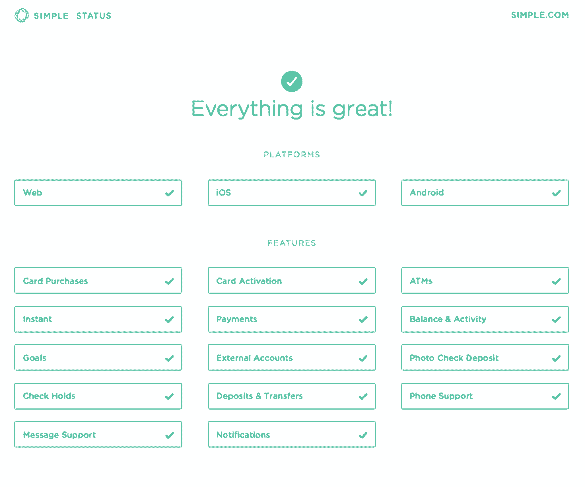
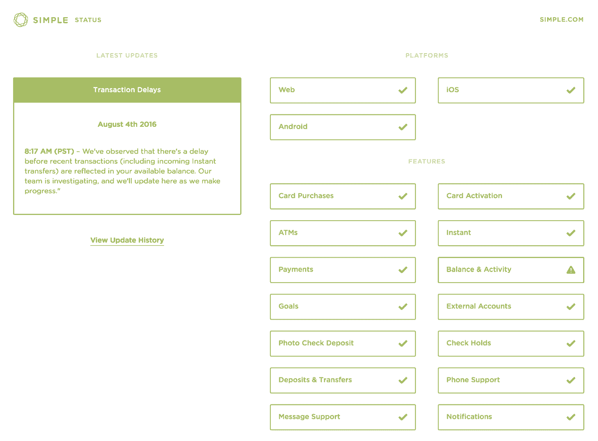
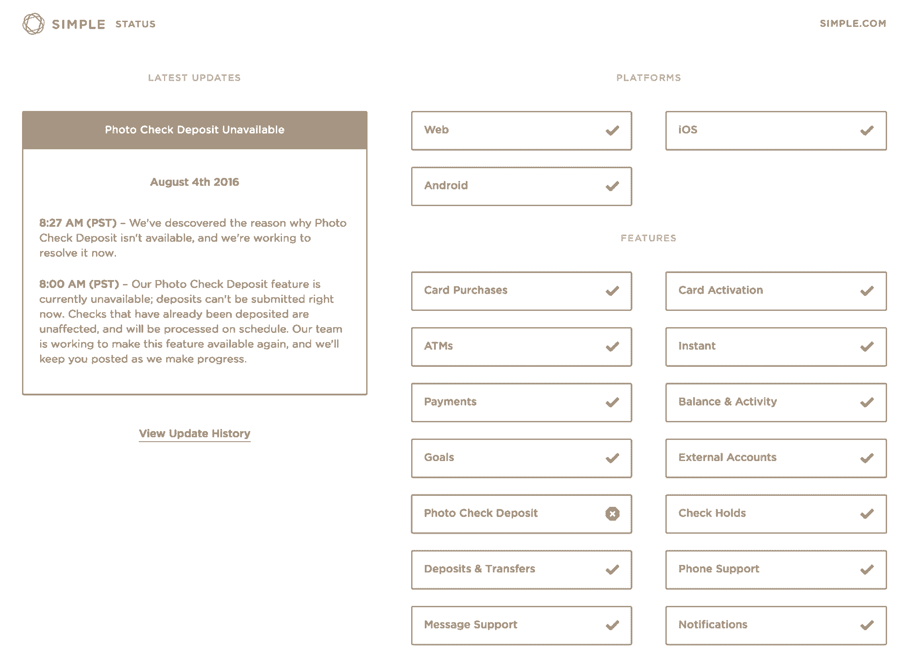
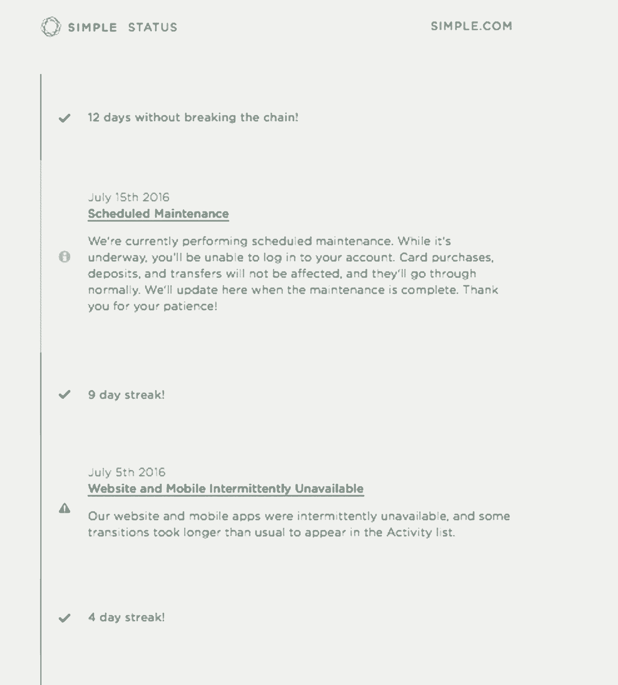
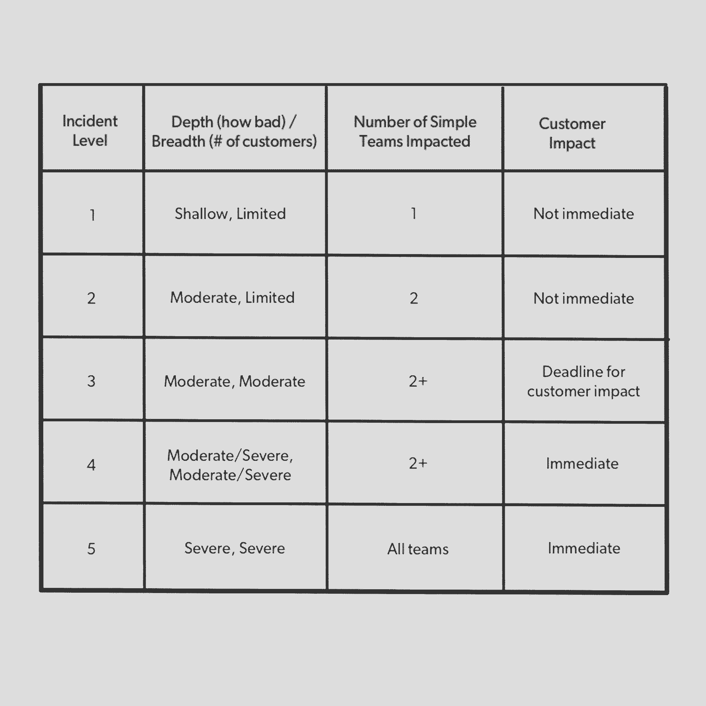

# 如何从沟通危机中拯救你的公司

> 原文：<https://review.firstround.com/how-the-u-s-forest-service-can-save-your-company-from-a-crisis>

七年前， **[克里斯塔·柏林考特](https://www.linkedin.com/in/kristaberlincourt "null")** 走出办公室，走向自己的车，坐下来，希望得到神的启示。她刚刚和《纽约时报》的记者*通完电话，这是她在 48 小时内接到的来自各大新闻媒体的 87 个电话之一。她的公司正处于一场风暴之中，因为估计有 80 万客户的个人数据在他们的智能手机上消失了。当时，它被描述为“[整个云计算概念迄今为止最大的灾难](http://www.bbc.co.uk/blogs/technology/2009/10/the_sidekick_cloud_disaster.html "null")，并且仍然是历史上最大的移动数据中断之一。那天她是最后一个离开的，因为媒体在等待她的回应。*

这一事件永远地塑造了 Berlincourt 应对她所称的“品牌威胁”的哲学，这是一种有可能让公司陷入混乱的恐慌时刻。她现在是金融科技公司 **[的公关主管。在此之前，她曾负责微软 Windows Phone 的开发人员和应用程序通信，此前她曾为该公司的初创业务部门提供过支持。如今，Berlincourt 积极为初创公司的沟通战略提供建议，最近的例子是捷豹路虎科技孵化器，以及之前参与 Nike+ TechStars 加速器的公司。](https://www.simple.com/ "null")**

在这次独家采访中，Berlincourt 分享了她多年来磨练的原则和实践，以帮助她在即使是监管最严格的消费行业中度过痛苦的困境。在这里，她不仅利用了自己的职业经验，还利用了国家林业局的框架来分类和处理森林火灾，这是 Simple 积极采用的一种方法。无论你是一家刚刚开始建立品牌的初创公司，还是数十亿人关注下的现任公司，柏林法院关于如何主动准备和被动应对事故的建议将帮助你始终如一地管理和专业地扑灭任何火灾。

当事情呈螺旋式上升时，不要随其旋转。进入一种强烈的平静状态，就像飓风眼一样。

# 危机沟通的七宗罪

公司危机——就像野火——是复杂的事态发展，可能会以意想不到的方式发展。在最激烈的时刻，管理上的失误会很快导致品牌受损和客户流失。

“在管理公司‘危机’时，重要的是要记住，你的品牌是你的客户在想到你时的直觉。因为我们是感性的、直觉的生物，我们用来描述人际关系的许多情感也用于品牌:爱、信任、激情、恨。他们实际上并没有什么不同。因此，从客户的角度来看，任何失误都是对这些感受的管理不善或误解，”柏林考特说。“你会注意到，冒犯顾客的同样反应也会让你的密友或家人陷入困境。你绝不会在一个需要你帮助的家庭成员面前走开或挂断电话，对吗？像对待你的核心圈子一样慷慨地对待你的每一位客户，看起来似乎不可逾越，但事实是，事件越严重，你的客户感受到的个人影响就越大。”

有一个应对危机的框架，但首先让我们看看一些需要避免的行为和反应。以下是柏林考特在职业生涯中观察到的最常见的错误:

**消失**。“就像你不会在有需要的朋友面前消失一样，品牌应该避免保持沉默。这是最常见的，也是最具破坏性的反应之一。这种回避是建立在恐惧的基础上的，恐惧会滋生不信任感，让你立即处于守势，即使你没有做错什么。当事情不对劲时，客户最不想见到的就是辩护。然后，比以往任何时候都更需要展示你的品牌。”

**隐蔽**。“当一个品牌消失时，人们可能不清楚它是优柔寡断还是有意为之。但是，当一家公司故意隐瞒一个问题时，动机是毫无疑问的。我很震惊有这么多的通讯机构建议我们干脆把它藏起来。即使是埋藏最深的危机最终也会浮出水面。通过对你的顾客撒谎，你是在说‘我们不在乎你的感受’。冷漠比无能更有杀伤力。"

**惯性**。“当出现问题时，速度和时机至关重要。但是权宜之计和仓促行事是有区别的。最好是利用现有的信息，而不是在回应之前等待更多的洞察力。再次考虑人际关系。想象一下，你正在进行一场特别高风险的文本对话，分享一些重大新闻，然后在接下来的 30 分钟里，你会看到可怕的文本气泡省略号来回跳动。你等着。你被激怒了。你的焦虑增加了。你觉得被忽视了。你到底在哪里？!'这种感觉和你的社区在等你发表声明的 45 分钟时的感觉是一样的。"

**间接性**。“回避一个问题只会延长悬念。没有回答这个问题会继续对话。重构和偏离增加了骚动和混乱。如果你的客户不得不去解决这些问题，这会让他们更加沮丧，也会损害你的品牌。”

**自动化**。“将对话非人性化是一个典型的错误。当谈话出现照本宣科的僵硬时，我称之为“机器人说话”。你在和人类说话吗？然后听起来像人类。机器人说话是一种急性应激反应。正如人类心理学中的情况一样，品牌通常会以情感超脱和人格解体来回应。“我们对这一事件引起我们的关注深感悲痛……”相当于“嗯，很好，但如果你能腾出时间，我希望我们能……”去掉介词，直奔主题

**假设**。“花一分钟坐下来面对这种情况，然后用你的精力尽可能地剥离表面情绪和自我。理性地框定你所知道的。我们经常看到的一个错误是，当一家公司通过推断可用信息以外的信息来应对危机。然后，一旦事情发生了变化，他们就打退堂鼓，不清楚这是不是故意的。就像你在个人生活中所做的那样，如果有人问你一个问题，而你只知道事情的 10%，不要给出试图弥合其余 90%的答案。可以说，“我只有 10%的信息，我正在努力寻找另外 90%，但现在这是我所知道的。”要诚实。正如我的一位导师所说:有真理，也有真实。说出真相。"

**即兴发挥**。“如果运气是机会遇到准备时发生的事情，那么危机就是困难遇到准备不足。在商业中，“事件”可能在任何地方发生:领导层变动、市场变化、产品失误、员工流失或数据泄露。所以在某种程度上，你总是被动的。考虑为增长而扩展。正如真大数定律所说，在一定规模下，任何离谱的事情都有可能发生。你无法解释未知的未知，但这并不意味着你应该凭直觉飞行。计划——这是唯一能让你对万一发生的“如果”感到些许安慰的方法。你不可能避开每一座冰山，但你可以多加几艘安全船。”

# 创造一种应对危机的文化

在你发现自己在消防水管后面之前，准备好你的公司与你交火。以下是 Berlincourt 用来为她的团队创造正确文化的原则和在危机中最有效工作的工具:

**寻求通知，而不是报警。**

将一个事件称为“危机”对任何人都没有好处——对 point 的通信人员和团队的其他成员都没有好处。“对于组织中的大多数人来说，当事情变得非常糟糕时，他们会敏锐地意识到，并可能在寻找解决方案时感到无助。随着时间的推移，这种感觉会转变成一种信念，即你也无法准确识别风险，”柏林考特说。“有一个系统可以帮助你做到这一点，但第一步是让你对这个词的本能反应变得迟钝。使用“事件”一词，而不是“危机”这不是语义上的，而是一个细微的差别，它会对你处理挑战性情况的能力产生真正的影响。如果只是有烟，不要大喊着火了。"

简而言之，柏林法院对“事件”的使用产生了广泛的影响。“我试图区分危机和突发事件。危机这个词很吓人。如果我给你发短信说，“嘿，我遇到危机了”，你会放下一切跑过来。在 Simple，我们寻求通知，而不是互相警告，”Berlincourt 说。“当一些不可预见的事情发生时——无论是打嗝还是灾难——基于每个团队成员过去的经验，他们的恐慌阈值是不同的。我们最不想做的事情就是引发过度恐慌。”

他们是偶发事件。“危机”这个词让人感到恐慌和麻痹，而不是清晰、有分寸的行动。

**旗早，旗勤。**

只有你能防止森林火灾。品牌也是如此。建立一种文化，在这种文化中，每个贡献者不仅被授权，而且被鼓励在出现问题时举手。“如果你闻到烟味，就说点什么。Berlincourt 说:“我们要求简单团队的每个成员标记事件，并描述它们，而不是分析它们。“例如，最好的结果是他们举手说，‘嘿，我注意到了这个客户问题’，或者‘我们似乎超出了预测的入职数量，申请需要更长的时间来处理。’我们在一个专用的[松弛](https://slack.com/ "null")通道中这样做。然后，团队的一个部分将在技术团队的支持下，根据需要对每个问题进行实地调查、分类和分类。通常情况下，烟雾在着火之前就被消除了。"

Simple 的工程师们引入了美国林务局的 T2 模型进行事故分类。“这是[国家火险等级系统](https://www.nps.gov/fire/wildland-fire/learning-center/fire-in-depth/understanding-fire-danger.cfm "null")简单易懂。警报以绿色开始，但任何超出绿色的颜色都是一个事件。如果护林员或公众有一点暗示，说有什么事情正在发生，它就会发出警报，即使没有立即采取行动。她说:“信息是一个敏感的触发因素，但行动是一个更为深思熟虑的因素。”。“这种颜色警告图的妙处在于，它的基本类别是众所周知的，而且已经确立，但针对特定地区进行了改进。例如，林务局与南加州的一家当地机构合作[开发了一种额外的颜色警告，以更好地评估该地区特有的风险](http://www.sdge.com/newsroom/press-releases/2014-09-17/us-forest-service-launches-new-tool-fire-preparedness "null")。同样，考虑到公司所处的阶段、行业和客户基础等因素，公司应该调整评级体系，以最大限度地适应自己的风险承受能力。简单来说，它处理银行业务和个人身份信息，早做标记，经常做标记。

旗早，旗常。否则，一桶水浇灭的东西现在需要 100 名消防队员来修理。

感谢是唯一的答案，也是最后一句话。

大多数危机沟通系统忽略的是，像对待客户一样，小心翼翼地结束与同事的沟通。“要建立一种支持有效危机沟通系统的文化，你需要感谢每一个提出问题的人，”Berlincourt 说。“即使这是一个错误的警报或信号，带着同情去面对他们也是非常重要的，并说，‘嘿，非常感谢你标记这个，我想我们会没事的，但我们会继续关注它’，而不是‘你为什么会认为这是一个问题？’"

这一原则建立在这样一种文化之上，即宁愿回应喊狼来了的男孩的每一声呼喊，也不愿在毫无察觉的情况下被吞噬。“这是一个文化问题。如果在你所处的环境中，你甚至含蓄地要求 100%的成功，那么举手就成了高风险。在这种情况下，你会在看到火之前就感觉到火焰，因为没有人会告诉你，”克里斯塔说。“前线的人看得最多，对吧？对于消费科技公司来说，前线是由可能是业务新手的客户服务代表推动的。如果他们不愿意举手，因为官僚主义会把他们打倒，那么如果在你意识到之前就发生了事故，不要感到惊讶。”

Krista Berlincourt

# 管理事故的团队、工具和系统

柏林考特认为，品牌和人一样，在经济不景气的时候最受重视。正是在这些深度中，价值观受到了考验。结果就是诚信。然而，对许多公司来说，当灾难降临时，这些无形资产就消失了。为了确保这种情况不会在 Simple 发生，Berlincourt 和她的团队求助于 Simple 的公司价值观和事件管理系统(IMS ),以确保他们的信息留在品牌上。

第一个工具是 Simple 的 IMS。“对于任何由内部系统或 Simple 人员标记的问题，都会向特定的 Slack 通道发送警报。柏林考特说:“警报分为两类:技术性和非技术性。

**非技术性事件**与人或关系有关。“这可能包括客户问题、合作伙伴或供应商问题，或者社交风暴。这些类型的事件各不相同，但通常不涉及内部代码，因此工程师不会自动收到警报。运营或集成团队会收到 pinged 命令，并决定是否需要工程团队在线协助。”

**技术事故**与产品错误有关。“在 Simple，除了最佳产品操作之外的任何事情都会立即触发[寻呼任务](https://www.pagerduty.com/ "null")，同时工程、通信、集成和客户关系都会收到警报。这消除了打电话的障碍，并创建了一个可以立即深入调查事件的即时响应团队。因此，即使凌晨 2 点发生了什么，所有合适的球员都已经就位。”

Simple 开发了这些轨道，以授权不同的团体处理独特的情况。“这两者各需要一个具有特定消防专业的不同团队，因此我们将他们分开。您可能不需要工程师来解决非技术问题，也不需要业务运营专家来帮助您调试基础设施。我发现试图创造一个包罗万象的过程只会导致混乱，”柏林考特说。"真正节省时间的工具是和我们的状态页面一起被激活的."

自动化状态页面。

当技术警报通过 IMS 时，不仅相关团队会收到通知，而且 [Simple 的状态页面](https://status.simple.com/ "null")也会更新，以提醒客户任何产品错误、速度下降或计划维护。“这种透明度对一些公司来说可能过于脆弱，但我们回报了客户对我们的信任，让我们能够保护他们的财务生活。我们有一个明确的使命，那就是帮助我们的客户对他们的钱充满信心，”柏林考特说。“这意味着让他们选择自助提问:‘我的银行账户正常吗？’我们不需要等待或争论何时更新状态页面，也不需要等待技术问题变得清晰，我们只需要改变颜色，专注于解决问题。"

与国家火灾危险等级系统类似，以下是几种不同模式下的状态页面:

状态页面还可以作为过去事件的运行日志。它们不会被隐藏起来，而是显示在提要上。任何定期维护也会出现在这里，以便提前提醒 Simple 的客户任何服务中断。

衡量透明度，衡量你的客户在危机中的自助能力。

状态页面工作的很大一部分原因是与 Simple 的事件管理系统的集成。“我们以前的状态博客是由工程部管理的 Wordpress 网站。Berlincourt 说:“事故是用专业术语描述的，虽然准确，但普通客户并不总能理解。“另外，在下一次更新发布之前，没有办法保持最新。对于一家年轻的公司来说，这已经足够了，因为我们的客户都是早期的书呆子。”

现在，当一个事件由于服务中断而被标记时，例如即时转移速度变慢或照片检查存款中的 10 分钟故障，该功能的指示器会根据严重性更改为黄色或红色。不仅仅是创建一个高效的系统，状态页还提升了 Simple 对加强和回报信任的追求。“从更大的范围来看，我们的愿景是创建一个自动驾驶的银行账户。所以从根本上说，如果客户不能回答自己的问题，那么我们就有问题了。”能够看到服务最后一次离线的时间并检查其当前功能可以建立信任。我们相信你的钱是你的，你不应该需要打电话给我们回答基本问题。我们将永远不会停止工作，继续赢得客户的信任。"

**用四个问题和一个框架对事件进行分类。**

当警报同时召集相关群组并更新状态页面时，团队有时间后退一步并对事件进行分类。现在，在问题得到解决的同时，通过有条不紊地处理以下问题来开发信息传递，可以做到及时和周到。应按以下顺序处理这些问题:

你知道什么？“思考您的业务，然后在每个小组中走一走，考虑事件的影响——技术、品牌、时机/持续时间、风险、合规性等等。澄清你所知道的。”

**你不知道什么？**“如果你发现了差距，你能在回应你的社区之前回答它们吗？如果没有，要清楚你只是没有所有的信息，而不是推断可能是什么。通常，一旦你后来填补了这些漏洞，这就会演变成一个谎言。”

**你有什么不能说的？**“出于风险、合规、隐私(可识别个人身份的客户信息)和其他法律原因，有些事情公司不能说，即使你真的很想说。这将有助于你为信息传递划定界限。”

**你想说什么？**“现在你已经收集了所有存在的信息，确定了差距，评估了需要多长时间才能了解更多信息，以及你不能说的事情，你想说什么？从子弹开始，然后从那里开始。我们有一个简单的团队协议，没有谎言——说谎是站不住脚的。”

Simple 还使用一个**风险分类框架**来诊断问题的严重性以及解决问题所需的资源。它通过帮助衡量事故发生后的潜在损害来补充这四个问题。“任何事故都可以分为五个严重级别。Berlincourt 说:“这一切都是为了让公司知道并理解他们的优先事项，以及在紧急情况下什么是重要的。”“简单来说，我们首先考虑有多少内部团队受到影响，以及客户的影响。我们还会考虑内部影响，以及是否需要让外部合作伙伴参与进来。”

Simple's Risk Classification Network

**根据现在了解的情况发表声明。**

一旦事件得到评估，内部团队动员起来解决问题，就该为您的客户和更广泛的社区进行解释了。虽然柏林考特已经制定了如何应对的指导方针，但她回避了具体的应对策略。Berlincourt 说:“处理事件的一大罪过是变得机器人化，所以你的陈述必须针对事件，而不是‘固定的’”。“我们开发的技巧和工具有助于指导我们的声明，但不是脚本，包括三点信息、无时间表默认和禁飞区列表。”

**三点声明**。“这种方法对于特别具有挑战性的复杂事件尤其有价值。这是一个简短的更新，遵循以下格式:“我们是[插入感觉]。我们正在调查。我们在这里。第一句话应该反映公司在更广泛的整体上的感受。第二句话表明你正在寻找解决方案，第三句话表明你是可接近的、有空的。许多公司可以避免公关惨败，客户抗议和激烈的头条新闻，如果他们执行他们的事件管理系统，并在制定解决方案时立即发布类似的响应。最后，不要过度承诺也很重要。"

**没有默认的时间线**。“如果你已经接触了公司的每个人，但仍然只有 10%的信息，那么这就是你所知道的。将你的回答扩大到超过 10%将是一个谎言，即使是无意的。你这样推断是出于好意，但你是在用未来的痛苦换取暂时的解脱。我在时间线上看到了很多。你的公司可能会说，“一个小时后我们会有更多的东西可以分享。”好吧，你已经承诺了一个小时。你的工程师也在同一时间线上吗？如果一个小时后你没有更多可以分享的东西怎么办？你不想盲目地、公开地给你更广泛的团队强加一个截止日期。不要成为代表公司发言但完全脱离*实际上*需要完成的工作的沟通主管。评估你所知道的，并在内部调整。"

**禁飞区名单**。“禁飞区就像是同理心的安全带。创建一个在最好的时候你不喜欢在声明中看到的单词的列表，然后参考当事件发生时让你保持正确的禁忌。这些通常分为三类——危言耸听、粗心大意和机器人化——这三类加在一起，将有助于保持一种知情、友好的品牌声音。例如，如果你过于正式，听起来会像机器人，但如果你过于随意，就会显得粗心或轻率。我最讨厌的一个词是‘哎呀’。现代的、对话式的品牌越来越常见，它们试图让自己听起来有趣，并消除事件中的刺痛。我们的最佳做法是定期审查事故信息，并标出我们有发展空间的地方。

**以学习回顾结束循环。**

每个事件都需要结束。“我们都相信增长心态的重要性。我们总是可以改进的。这并不是说你需要变得更好，但你可以。我们在为流程命名时强调了这一概念。柏林考特说:“我们不用‘验尸’——字面意思是对尸体进行检查，以确定死亡原因——而是使用术语‘学习回顾’。“正如我们标记事件一样，我们鼓励组织中的任何人举手建议学习回顾。我们将组建一个小团队，并运行典型的问题:什么在这里工作？我们在哪里被抓住的？为什么我们花了这么长时间？下次我们会有什么不同的做法？如果没有时间的混乱，我们的语言是如何堆积起来的？”

另一个不寻常的地方是 Berlincourt 的团队如何实现制衡。“我们还有一名品牌声音主管，负责监控和评估整个公司的品牌基调和语言。他不在应对事故的团队中，所以他为我们的副本提供客观的外部视角，”柏林考特说。“在你的封闭循环或反馈循环中，我建议在风暴过后，让那些与事件没有密切关系的人加入你的学习回顾。它让你走出回声室，是另一个学习的机会。”

野火就像公司危机一样，威力巨大，但只要有正确的灭火和逃生路线，是可以控制的。

当 Berlincourt 加入 Simple 时，该团队刚刚超过 20 人。如今，该公司拥有 300 多名员工。在过去的两个季度中，客户数量增长了 40%以上。风险很高，必须以同理心和准确性来应对事件——你不能在银行业丢下一条失败的鲸鱼。

为你的公司不可避免的“哦不”时刻做准备，学会回避危机沟通的七宗罪。创造一种文化，让你的同事可以习惯性地尽早、经常标记事件。寻求告知，而不是报警。一旦这种文化活跃起来，就要覆盖工具来实现它。诚实的状态页面、事件管理系统、风险分类框架、禁飞区列表和学习回顾是关键工具，当作为一个系统同步时，这些工具更加有效。这个计划可以帮助一个孤独的消防员建立一个过程，即使在大规模的情况下，也能增强团队的力量。

“火可以很快从火花变成熊熊大火。事实上，当温度、湿度和风等条件一致时，火旋风的时速超过 50 英里。相比之下，人类最快的步行速度为每小时 28 英里，你会开始理解为什么你需要一个计划、一个团队和专注的反应，才能有机会与自然对抗。”柏林考特说。“关键是，无论是短跑还是长跑，即使是最熟练的个人也无法独自超过一场火灾。消息传播得更快。如果你的公司有工具和系统来集体地、有条不紊地处理事故，你就能防止品牌受损。”

*摄影由* *[瑞安唐纳森](https://www.linkedin.com/in/ryan-donaldson-59421058 "null")* 负责。