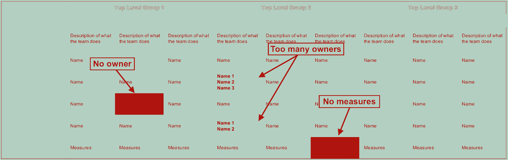

# 这位工程主管如何提高 Instagram 的透明度

> 原文：<https://review.firstround.com/how-this-head-of-engineering-boosted-transparency-at-instagram>

詹姆斯·艾文翰 加入 **[Instagram](https://www.instagram.com/ "null")** 担任工程主管后不久，每半年进行一次的员工满意度调查结果出来了。分数相当不错，但是一个问题点引起了 Everingham 的注意:透明度分数低。

这让他大吃一惊，因为他觉得只要不侵犯某人的隐私或机密，管理团队就是一个公开的书。即使经过更多的思考和对数据的进一步挖掘，Everingham 仍然没有任何理论。

最终，是一个商业决策上的冲突让它成为焦点。经过深思熟虑，领导层做出了艰难的决定，将他们的一个团队从门洛帕克总部转移到纽约办公室。此后不久，Everingham 把球队经理拉到一个房间，给他提了个醒。这位经理理所当然地受到了震动，但他的回应却让埃弗宁厄姆印象深刻。“我真的很失望，”他说。“这是我第一次了解到这一点。你根本没把我牵扯进来。你不够透明。”

对艾文翰来说，这是灯泡熄灭的时候。**透明度是一个持久而棘手的问题，因为我们对它的含义并不完全一致。对他来说，透明度意味着与你的员工建立信任，同时给他们更好的数据，让他们在这个过程中做出更好的决策。但对这位经理来说，更多的是参与。Everingham 很快意识到，提高 Instagram 落后的透明度分数意味着弄清楚什么是普遍定义。这还不是全部——他很快意识到，揭示决策过程也将成为他们解决透明度问题的重要组成部分。工程小组需要确定*谁*在做决策，*如何*做出这些决策，以及*为什么*做出这些决策。**

在接下来的六个月里，Everingham 将提高透明度和定义决策过程作为首要任务，并取得了回报。随后的调查显示，Instagram 的领导力透明度得分大幅增加了 10%以上，成为脸书最高的之一。

受他在第一轮创始人峰会上的演讲的启发，Everingham 在这里分享了 Instagram 如何在不到三年的时间里将工程人员从 100 人扩大到 600 人。他详细介绍了他们系统化方法的步骤，并给出了定义透明度、教育他人和建立一个深思熟虑的过程和框架来支持它的有用提示。现在是脸书区块链工程负责人，Everingham 正在把这个教训和系统带到他的新团队和角色中——就像任何一个成长团队的领导者一样。

# 透明度如何从直观转变为无形

从根本上说，大多数人都认为透明度是任何公司的重要元素。

“如果有人说，‘嘿，你知道什么才是真正有趣的吗？让我们开一家公司，不要告诉我们的员工任何事情。“让他们一路想出来，”埃弗灵厄姆说。“直觉告诉我们，这不是做生意的最佳方式。这是因为在企业界，人们不太喜欢惊喜的元素。想象一下，如果有一天你去上班，你的雇主突然对你说，'嘿，我们没钱了，不能给你发工资，所以谢谢，回家吧。'你会很不高兴的。但如果相反，你的雇主找到你，对你说，除非我们筹到一些钱，否则我们的资金似乎将在六个月内告罄，我想给你提个醒。这样你不仅能为自己做出更好的决定，而且在此期间你会更有动力去做对公司最有利的事情。"

除了让每个人都能做出最佳决策，培养透明度还有助于解决初创公司通常会遇到的许多其他问题，从建立信任和减少政治，到让人们的声音被听到和保持速度，同时快速扩张。

但实际上，确保透明度比简单地说“让我们变得透明”要难得多，尤其是在初创公司成长的过程中。这是因为在早期，透明度通常是默认发生的。凭借在一个狭窄的空间里拥有一个所有人都在甲板上的心态的小团队，整个团队自然对正在发生的事情有很多洞察力。但是，随着一个团队增加更多的人员并扩展到各个办公室，这种可见性开始消失。一层管理形式，会议闭门进行，沟通变得不频繁，更少的人参与做出最重要的决定。

正如 Everingham 发现的那样，仅仅将透明度作为一种价值观是不够的——如果领导者真的想开放事物，他们需要更深入地点击几次。他在 Instagram 上做到了这一点，揭示了他的团队对透明度的定义，制定了一个标准框架，规定了如何做出决定以及由谁做出决定，并确保每一项行动都牢牢植根于一套共同的运营原则。

# 什么:明确模糊的概念

当 Everingham 第一次发现如何定义透明度的差异时，他开始了一项调查，以揭示为什么会出现这种概念分歧。

“在我一对一和跳级的时候，我开始问每个人透明度对他们意味着什么，”他说。“在长时间的凝视和一些思考之后，人们通常会给我一些不同的说法，比如‘嗯，这让我们了解情况’，或者‘这意味着你没有对我们隐瞒任何事情’，或者‘这让我们从一开始就参与到影响我们的事情中。’这些都是对透明度的不同理解。我意识到，如果没有一个共同的定义，无论你做什么都会让别人失望。你也潜在地为某些人打开了大门，让他们将这个概念武器化来对付你，指责你不透明。"

不要把透明和介入混为一谈。

一开始，Everingham 和他的团队所要做的似乎只是聚在一起，就透明度的共同定义达成一致，这似乎是一个容易解决的问题。这是他们得出的定义:

清晰一致的沟通

决策方式的清晰性

诚实而清晰的反馈

承认我们的错误

甚至在与团队敲定了定义之后，Everingham 很快意识到还有更多工作要做。“我们已经实践了其中的三条，但我们甚至没有准备好支持第二条，”他说。“这就是我打开它的原因。我意识到这一切都是为了理清决策。当你想到透明度时，你通常会想到沟通方面:告诉每个人发生了什么，或者承认你犯了错误。但是当人们说事情不透明时，他们可能指的是决策过程不透明。这是一种感觉，决策有时会从领导团队高高在上的位置上滚下来，似乎是凭空而来的。相反，拉开决策过程的帷幕，将一些过程和原则放在背后，这样就不会有这个神秘的黑匣子可供猜测了。”

Instagram 决策清晰化的解决方案可以归结为两件事:在决策过程中使用框架和原则，以及与单一负责的所有者建立明确的角色。“我们必须让我们的决策易于理解、一致且可重复。我们还必须确保人们明白谁是做出特定决定的唯一人选。它是关于标准化我们的算法和指导方针，”Everingham 说。

# 如何与世卫组织:让责任发生

所以 Everingham 和他的团队开始寻找一个框架。他们选定了一个简单的 **[RACI 模型](https://en.wikipedia.org/wiki/Responsibility_assignment_matrix "null")** 来分配角色和做决定。在咨询行业很常见，这是一个非常适合创业公司的工具。它的工作方式是在每个项目或决策*之前，识别并分配谁负责***r****r****a****accountable，***t【19】c****consulted*和***I****informed*“我见过的最喜欢的例子是将 RACI 应用到《星球大战》中。“如果你像我一样是个极客，那就太完美了。基本上，在消灭绝地的努力中，赏金猎人负责，或者说做实际工作，而达斯·维德负责，冲锋队被征求意见，达斯·西迪厄斯被告知最后发生了什么。”

当然，Instagram 应用 RACI 模型处理的问题略有不同。“我们将它用于我们最重要的计划，实际上我们总是从定义‘A’开始。例如，当试图确定我们将使用哪种数据库架构向前发展时，我们挑选我们的首席技术官作为负责任的决策者，”Everingham 说。“R 小组负责完成工作，并就我们应该做的事情提出建议，其中包括从一组接受咨询的工程师那里收集信息。有一个最终演示，让 CTO 了解他们的想法，同时也邀请了“C”组来听取决策。最后，我们积极确定谁需要被告知该决定，并将其传达给每一个受影响的群体。”

在一家更大的公司，RACI 模式如何帮助减少混乱是显而易见的。但是，对于一个刚刚起步、汇报路线更简单、团队更精简的初创公司来说，这有必要吗？“当我们开始这个过程时，Instagram 是一家相对成熟的公司。当你越来越老越来越大的时候，做这些事情就越来越难了。“如果你是一个新的创始人，刚刚起步，这可能看起来像是尖头管理的东西，这是正确的。通常在开始的时候，你可以本能地解决大部分问题。但我坚信，如果在你需要的时候，它已经成为你文化的一部分，事情会变得容易得多。决策出错的方式太多了，无论是所有者太多，过于关注共识，还是无法在你面前捕捉或阐明决策。经历整个过程可能看起来很麻烦，但是你几乎总是会发现一些需要澄清的事情。即使你现在还没有遇到这些问题，我保证它会出现的。这是一个很好的团队力量。”

当然，初创公司也可以采用其他方法，从成长团队的[矩阵](http://firstround.com/review/this-matrix-helps-growing-teams-make-great-decisions/ "null")到困难决策的[框架](http://firstround.com/review/square-defangs-difficult-decisions-with-this-system-heres-how/ "null")。“我们使用哪个决策框架并不重要，只是我们选择了一个，然后每个人都知道我们将对所有事情应用什么算法，”Everingham 评论道。“我们最大的考虑是我们想要一个单一的决策模型。我们希望人们确切地了解谁在做决策，所以你只能有一个‘A’或一个决策者。”

你可以拥有比决策者更多的决策，但如果决策者比决策更多，那你就遇到问题了。

Everingham 分享了三种策略，Instagram 的工程团队使用这些策略来确定谁将做决定:

把它画出来给所有人看。

为了将 RACI 模型应用到实践中，Everingham 和他的团队使用了另一个缩写:RAM，即责任分配矩阵。

“我们需要强调每个决策或项目背后的‘谁’,并确保只有一个共同的理解，所以我们在电子表格中构建了一个 RAM，将职能或团队放在顶部，将任务垂直放置，并在方框中填写所有者的姓名，”他解释道。“关键是谁打电话。其中一些有不止一个名称，这表明缺乏一致性。他们中的一些人甚至没有任何名字，这突出了一个明显的差距。我发现作为一个组织，这是一次很好的锻炼。这让我想起艾森豪威尔的经典名言，“计划是无用的，但规划是必不可少的。”就其本身而言，RAM 是相当无用的，但构建它并明确所有者的过程对于调整你的公司至关重要。这是一个框架，它概述了责任，并让每个人都可以看到如何做出决策。"

Sample Responsibility Assignment Matrix (RAM), provided by James Everingham

**去除偏见，尤其是自己的。**

指派决策者需要仔细考虑。仅仅选择最佳框架是不够的——为了成功地实现它，需要尽可能地消除等式中的偏见。

“偏见往往会导致糟糕的决策。Everingham 说:“回到之前纽约团队搬迁的例子，我们有理由问，为什么我们不能从一开始就让团队经理参与进来。“但我觉得他不能参与决策，因为我已经知道他的答案会是什么。他当然会说，‘不，不要动我的团队。’是行动上的利己偏见。如果我们想要一个对整个公司都有利的公正结果，我们就不能让他参与决策。这是你需要在透明和参与之间划出的界线的一部分。回过头来看，当然有些事情我们本可以做得不同。作为一个领导团队，我们本可以通过更加明确我们的优先事项来避免这种情况。例如，如果我们强调了现场高层领导或减少团队间相互依赖的重要性，经理可能会在我们做出决定之前有更多的背景信息。"

但是为了减少偏见，领导者也必须照照镜子。“当我知道自己会有偏见时，我也会尽最大努力让自己不参与决策，”Everingham 分享道。“树立榜样至关重要，否则它会慢慢渗透，突然间一切都变得可疑。例如，我可能想在我家旁边有一间办公室，里面全是我所有的朋友和家庭成员。然而，即使这些决定是正确的，如果他们是我能雇用的最好的人，而且那确实是我们公司的最佳位置，人们仍然会质疑我的动机。当你的团队知道你在做决定时有偏见时，很难在团队中建立信任。”

鼓起勇气，重整旗鼓。

对于 Everingham 来说，阐明谁拥有决策权这个更广泛的问题与团队的组织方式有着内在的联系。

“太多的领导者回避重组他们的团队，因为害怕变动、焦虑或由此发出的信号，而是选择在现有结构的限制下工作，或应用短期补丁。但我见过团队因为糟糕的设计或原始蓝图的简单衍生而自我屈服，”Everingham 说。“缺乏明确的角色定义会带来极大的破坏性，并严重抑制透明度。所有权开始漂移，变得令人难以置信的模糊，并减缓了事情的进展。团队可能会在完全相同的问题上分开工作，让每个人都感到沮丧，浪费时间。你还会看到高级经理被拉进他们不需要参与的谈话中，或者更多的下级在他们需要的时候没有被卷入。当我在 2015 年加入 Instagram 时，你真的可以在工程组感受到这一点。在我们当时拥有的数字下，事情并没有发生作用，更不用说在我们快速前进的规模下了。因此，我们进行了重组，仔细定义了工程师的指标、职责和团队领导，所有这些都是为了消除每个环节的不透明性。”

更重要的是，Everingham 发现，这种重组和责任的明确细化除了提高透明度之外，还有其他好处。“自从我们转型以来，最大的收获是，当人们清楚地理解对他们的期望时，他们更有可能超越它，”他评论道。“例如，Instagram Stories 功能是由一个小团队在三个多月的时间里构思、构建并向 5 亿人推出的。我不认为这在我们之前的设置中是可能的。它为我们的工程团队注入了更多的创新和速度。这让我相信[管理不是给你的团队出主意或干涉](http://firstround.com/review/the-principles-of-quantum-team-management/ "null")——而是确保组织是一台运转良好的机器，为成功做好准备。”

James Everingham, former Head of Engineering at Instagram and current Head of Engineering, Blockchain at Facebook

# 为什么:遵循的原则

但是，即使一个团队弄清楚了它将如何做出决策，以及谁将做出决策，透明度拼图仍缺少一块。

“我们旅程的最后一部分是，在考虑行动方案时，找出我们的目标是改善什么。你希望看到的最大结果是什么？埃弗宁厄姆说:“你需要找出你所做事情背后的‘为什么’,同意一套指导原则，这套原则可以成为你采取的每一个行动的北极星。“对我们来说，这意味着提出一套我们公布的原则。对我来说，原则是解释或控制事物如何运作的想法或规则。“100%以目标为导向”是一个简单商业原则的最基本的例子。这意味着任何时候你计划某事，你*需要*有一个非常明确的目标。因此，考虑到这一点，我们的团队聚集在一起，提出了 20 多个要努力实现的结果，比如“建立一支有灵感的员工队伍”。然后，我们缩小了范围，并将其优先排序为我们的前五名。"

这些是 Instagram 的工程团队提出的**高级组织原则**，以及它们*在实践层面上真正的*含义:

尽可能快地移动。我们应该不断地向我们的用户提供价值，所以速度比成本效率更重要。这意味着我们必须*最小化依赖性*，这样每个人都可以快速移动*。*

**用最少的决策者建立清晰的问责制。**我们需要避免在跨职能决策或产品特性上团队之间的分歧中陷入责任和减缓行动。这意味着我们需要在产品和工程之间建立一一对应的关系。

**写简单明了的 KPI。**我们都需要清楚地了解我们努力的目标和成功的样子。这意味着*所有团体都需要有措施。*

**扩大到一个更大的组织。**我们不能假设我们目前的结构将继续工作，所以我们需要提前思考，勾勒出当我们在更大的规模上做更多事情时它会是什么样子。这意味着所有组织都应该有路线图。

**保持极高的质量和工艺水平。**用户体验的每一部分都需要细致一致，尽可能减少摩擦。这意味着*性能、稳定性和代码都应该有自己的主人。*

这套原则和实际操作规则并不是一成不变的。“任何人都可以提出改变的建议，如果我们都同意，我们就会采纳。但最大的优势是它起到了问责机制的作用，”Everingham 解释道。“当我们传达一个决定时，任何人都可以参考我们的原则，并对我们的正确性进行‘代码审查’。团队成员可以按照我们为自己设定的标准来检查和监督我们。例如，当我们宣布一项计划时，我们会听到‘嘿，那项计划只是产生了一堆依赖’，或者‘现在你把这项工作分成两个团队，谁是决策者？’这非常有助于我们保持诚实，并确保透明度是我们集团运营方式的一个标志，而不仅仅是我们渴望的一个概念。"

# 过程:冲洗，重复透明

最后一步是将*什么*、*如何*、*谁*和*为什么*联系在一起，以创建一个新的决策或问题出现时可以遵循的简化流程。

“我们对它进行了改进和调整，直到我们满意地认为它解决了我们需要它解决的所有问题，”Everingham 说。“但是，要想在日常工作中发挥作用，它必须是一个我们不断重温和参考的活框架，而不是一个束之高阁的指导方针。这就是为什么我们鼓励每个人查看我们发布的流程，提出可以改进的地方，或者在我们没有遵循流程时指出来。”

以下是 Instagram 的透明决策过程，以及它在实践中的运作方式:

诊断问题。工程团队注意到网络流量在增长，但他们在网络体验上投资不够。

**组织变革提案。增长团队经理建议他在纽约组建一个团队。这个小组不需要很大的团队，而且有一些很好的理由说明在那个地方做是有意义的。**

**确定 RACI 模式并传达角色。**增长经理承担了责任，作为工程主管，Everingham 对此负有责任。咨询了同行工程经理，并通知了产品负责人。

**违背原则的审计行为。**但是，当他们对照工程团队公布的组织原则审核该计划时，很明显这个提议没有意义。

**阐明权衡。(把它们写出来。)**考虑到“扩展到更大的组织原则”，需要一个路线图来展示新团队如何成长为一个具有重要范围的大型团队。此外，该提案只要求一线经理管理团队，向全国各地的领导报告，这意味着不会有现场高级领导。

讨论设计变更，考虑替代设计。通过讨论不违反组织原则的不同版本之间的权衡，团队就有意义的组织模型达成了共识。

**决定。有了新的提案，最终决定在门洛帕克本地组建新团队。这使得当地的高级领导能够在培养团队经理方面发挥积极作用，同时密切关注新的工作。其他好处包括能够与重要的产品同行进行更密切的沟通，突出团队工程师的长期职业发展道路，以及利用脸书当地的人才库。**

**更新责任矩阵。**最后，RAM 进行了更新，以反映新团队、其范围、决策者、他们具体拥有什么以及如何衡量新工作。然后，整个流程和矩阵更新被传达给公司的其他部门。

# 进行投资

我们大多数人都努力追求透明，但是严酷的现实意味着这个原则在实践中比我们愿意承认的更加难以捉摸。凭借专注的努力和清晰的流程，Instagram 的工程团队能够逆转增长不可避免地带来的清晰决策的自然侵蚀。对于其他寻求实现同样飞跃的团队来说，首先要建立一个透明度在您的组织中意味着什么的通用定义。采用一个决策框架，如 RACI，制定出所有人都能看到的责任。明确角色和所有者，消除过程中的偏见，必要时进行重组。确定你在决策中努力争取的结果，把它们编成指导原则。最后，列出一个可重复的过程，你可以通过它来执行每一个决策。

“我们看到的最大变化是团队成员不再混淆透明和参与。我们的胜利很大程度上是简单地让团队了解差异并设定共同的基准。现在，人们不再互相指责，而是有了一个系统和一种语言来进行富有成效的辩论。我们可以更深入地、恭敬地探究，而不是笼统地说“你不透明”，而是说“你是根据什么原则做出这个决定的？”或者‘这种变化如何减少依赖而不是制造依赖？’”艾文翰说。在某些方面，我们正在改变公司的 DNA。透明度是一个值得追求的令人钦佩的目标，但你必须建立正确的流程来支持它，否则它不会成为你的现实。技术和团队可能会改变，但人们理解正在发生的事情并感到被接受的需求永远不会改变。尽管过去 30 年来我一直领导 Instagram、雅虎和网景的工程团队，但随着我们在脸书组建区块链团队，我正在重新开始，所以我仍然需要花时间来做好这件事。透明度是一项终身投资，你必须不断地重新投入。"