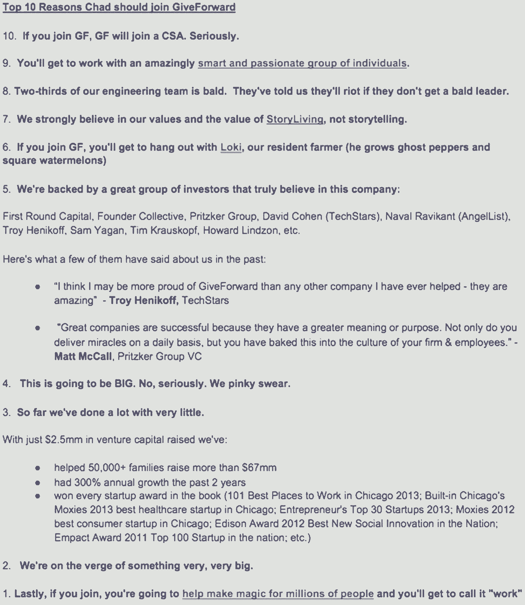
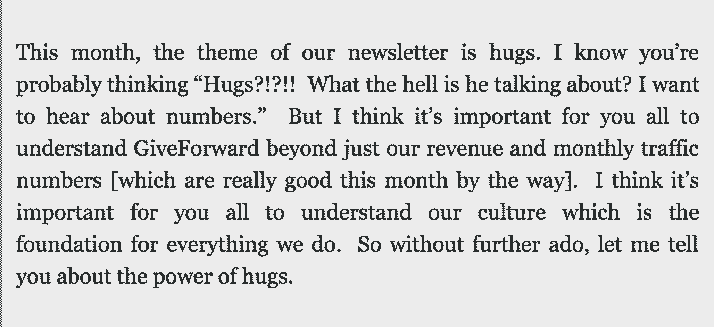
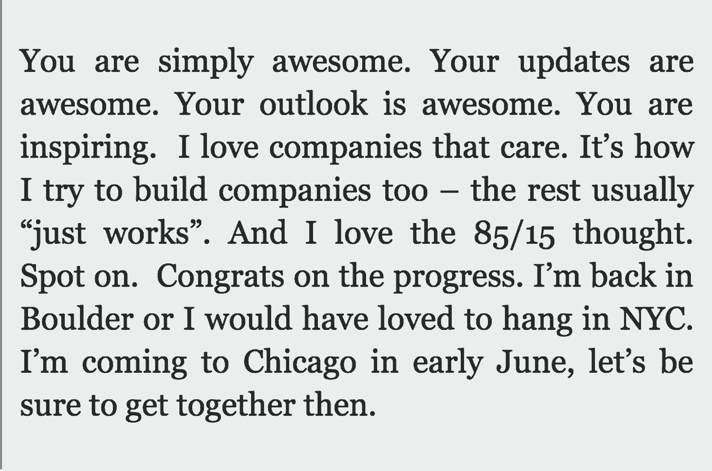

# 这家初创公司的文化是如何为其赢得令人敬畏的高管层、资金和合作伙伴关系的

> 原文：<https://review.firstround.com/how-this-startups-culture-won-it-an-awesome-c-suite-funding-and-partnerships>

五年前，短道速滑运动员阿波罗·奥诺成为冬奥会历史上获得奖牌最多的美国运动员，中场球员安德烈斯·伊涅斯塔帮助西班牙赢得了第一个世界杯冠军， **[吉福沃德](http://www.giveforward.com/ "null")** 联合创始人 **[伊森·奥斯丁](https://www.linkedin.com/in/ethanaustin "null")** 梅特兹[捷步达康](http://www.zappos.com/ "null")创始人[谢家华](https://en.wikipedia.org/wiki/Tony_Hsieh "null")。一生的梦想在各方面都实现了。在一次活动中，奥斯汀与谢长廷进行了交谈，谢长廷是基于价值观的文化的主要倡导者和实践者之一。并非巧合的是，那一年标志着 GiveForward 的第一次员工招聘和对其文化的不懈投入。

快进到 2015 年，在重新思考什么是伟大的公司文化时，奥斯汀似乎不像是谢长廷的信徒，而更像是他的继任者。与之前的许多创业公司一样，GiveForward 提供无限假期，并支付继续教育的费用。然而，它也举办了为期两天的公司异地会议，期间禁止谈论工作。全年都有吃墨西哥卷饼比赛、手写节日贺卡和年度管道旅行。但是所有这些乐趣掩盖了深层文化原则所产生的生产力。它的 45 名团队成员使数百万捐赠者筹集了近 2 亿美元的捐款，以支付亲人的医疗紧急情况和费用。

在科技领域，文化在很大程度上已经成为 nerf 枪支、乒乓球和无限量小吃的同义词，并且经常被视为保留成本。创业公司很少能从他们的文化到实际的商业影响之间画出直线。在这次独家采访中，奥斯汀概述了 GiveForward 的文化如何成为其在四个领域的竞争优势:招聘、保留、筹款和合作伙伴关系。

# 雇用

Cars.com 的运营副总裁。首席技术官， [GrubHub](https://www.grubhub.com/ "null") 的用户体验主管和品牌营销高级总监。T4 Groupon 和奥巴马竞选团队的高管们。这些人不在 GiveForward 的董事会或顾问委员会。他们已经离开这些组织，作为全职员工加入了 GiveForward。“我认为招聘绝对是一个文化允许我们超越自己的领域，”奥斯汀说。

许多公司错误地认为他们的文化在第一次面试、入职或员工的第一周就展现出来了。奥斯汀知道公司的第一印象是在更早的时候形成的。“这并不像亲自与某人见面。他说:“不管你喜不喜欢，你的第一印象在你见过你的候选人之前就已经形成了。“这就是为什么我们把‘奇怪’的职位描述公之于众。”

怪异而响亮是好。怪异和安静是一个失败的命题。

怎么奇怪？一个 QA 工程师最近给出的工作描述介绍了公司，涵盖了角色要求，描述了其价值*和*说明了它们。大多数公司止步于前三个要素，发布开场，然后收工。以下节选自 JD，展示了 GiveForward 如何将文化特征融入其职位描述:

*描述文化的语言*

“我们将客户放在我们所做的一切的中心，我们相信在技术中赋予同情心。”

"我们重视同理心胜于自我，人才胜于头衔，合作胜于文档."

“这是一个绝佳的机会，可以对大众捐赠的新兴发展产生重大影响，并巩固我们作为行业领导者的地位。”

“最重要的是，您的专业知识将通过我们创造的产品真正改变人们的生活。”

*展示文化的语言*

**收录例证，说明备份论述**。“这就是我们做的。这就是[我们做](http://www.giveforward.com/blog/healing-touch-of-crowdsourcing "null")的原因。去年，我们向世界展示了[爱永远会战胜暴力](http://www.giveforward.com/fundraiser/ygf1/helpforpatandjess "null")，展示了[诚实确实是最好的政策](https://www.giveforward.com/fundraiser/f3x1/billyray "null")，展示了当 [1000 个陌生人决定向前付出](https://www.giveforward.com/fundraiser/25q2/jen-s-wedding-wish-cancer-fund "null")时，生活会以神奇的方式展开。”

**阐述你的价值观和口头禅**:对于 GiveForward 来说，它想要传达其核心价值观“真实性”和其内部口头禅“怪异就是好”以下是一些方法:“如果你具备以上所有条件，那就太好了。当然，我们认识到这是一个很长的[需求]列表，你不会拥有所有这些技能。无论如何你都应该申请。这将是一场变革。我们小拇指发誓。”

展示你对自己个性的承诺——以及你对优秀候选人的追求。职位描述的最后有一部分是全大写的，标题是:“还在读书？太好了，那我们一起创造历史吧。”在底部:“如果这个角色不适合你，请把它传给你认识的最好的人。”

大多数人认为工作描述是向外界发出的请求。GiveForward 颠倒了这种关系，就好像它把自己的简历放在那里，用最好的候选人获得一份工作。通过额外努力传达其核心价值观——真实、有趣、同情和赋权——这家初创公司让候选人在申请之前筛选自己并自我选择*。这对每个参与的人来说都更有效率。*

古怪的工作描述淘汰了无聊、沉闷的人，给我们带来了我们想要与之共事的古怪、有创造力、有趣的人。

当候选人收到 GiveForward 的录取通知书时，团队会利用其文化来接近他们。“我们给最终候选人写了一份个性化的‘T5’十大名人名单。它指出了他们应该加入 GiveForward 的主要原因，”奥斯汀说。“它汲取了我们作为候选人与他们打交道的经验，并融入了我们的使命、愿景和价值观。我们希望表明我们已经了解他们，并借此机会提醒他们我们是谁。”

虽然它看起来更像是艺术而不是科学，但 GiveForward 以其整合所有价值观的精确性而自豪。奥斯汀说:“这封附有清单的信表明，仅仅通过写这封信，我们就践行了很多价值观。”。“我们强调真实性和趣味性，因为这是一个愚蠢的手势。它传达了同情，因为我们倾听了他们的心声，并且足够关心去做额外的努力。它列出了许多直接引自受访者的理由，表明他们为什么适合这份工作，并且能够胜任这份工作，从而展示了他们的能力。”

多年来，这十大清单已被证明是公司最好的招聘工具之一(*见下文*的例子)。“我认为，人们希望加入一家有明确使命和愿景的初创公司。奥斯汀说:“他们希望从日常工作中获得灵感。“我们听说过求职者将这些名单转发给他们的父母或配偶，并自豪地补充道‘嘿，这就是我要加入的公司。’如果他们在观望，这通常会带他们到我们这边来。一次又一次，人们加入是因为使命和价值观与他们所代表的一致。"

Excerpt from an email from Ethan Austin to GiveForward CTO Chad Cooper, 2013\. Edited lightly for clarity and brevity.

# 保留

对于科技创业公司来说，如果有什么比雇佣人才更具挑战性的话，那就是留住人才。GiveForward 很早就认识到，留住人才并不是由经济补偿驱动的(尽管有普遍的假设)。“我回想起我们创业的头两年。那是 2008 年，在 Kickstarter 或“众筹”这个词真正存在之前。我们无法筹集资金，”奥斯汀说。“我们当时不拿薪水，只有实习生。我们没有要求他们这样做，但他们中的一些人在没有报酬的情况下呆了一年半。即使那应该是三个月的实习期。”

文化抚平了一家公司经历的不可避免的起伏、起起落落。即使是火箭飞船也在太空中有加油站。文化是你所依赖的。

如今，Erica——这些实习生中的一员——领导着 GiveForward 的客户服务小组，这是这家初创公司最大的部门之一。当被问及为何无偿工作如此之久时，她说她觉得这家公司将成为一股改变她这一代人和世界的力量。更重要的是，她在没有报酬的情况下也很满足，就像她真正拥有了公司的一角一样——而且在某一点上甚至更多。

“从一开始，我们的价值观之一就是授权——我们最好将其概括为‘成为你职位上的首席执行官’“在埃里卡还是实习生的时候，这还不是一种既定的价值观，而是我们生活中的一部分，”奥斯汀说。两年来，我和(我的联合创始人)Desiree 度过的第一个假期是 Desiree 的婚礼。有四天，我们让埃里卡负责生意。我们回来了，它没有崩溃或分崩离析。一个实习生经营了我们公司！"

底线是让每个人——从实习生到二把手——都成为业务中的平等伙伴。这可能并不总是伴随着大的头衔变化，而是拥有重要选择的清晰而永恒的机会。即使它们很小，也不意味着它们微不足道。以下是一些具体的做法，它们不仅推动和定义了 GiveForward 的文化，还让其员工愿意留下来更加努力地工作:

将个人优先事项与公司价值观联系起来。 GiveForward 定期给员工一个惊喜的休息日，让他们做一些让他们充电、滋养他们的灵魂、让他们开心的事情。这有助于连接和融合员工的个人和企业价值观。

**通过预算授权**。该公司的口号之一是为用户“创造意想不到的快乐”。每位员工都有超过 500 美元的自由裁量权来推动 GiveForward 活动或用个人礼物取悦用户。一名员工给一位孩子开始上学的单身父亲送去了一个装有衣服和用品的爱心包裹。今天有多少人会说他们在工作中感动或改变了生活？GiveForward 赋予其员工这种难以置信的罕见能力。

**让聚在一起加深影响成为一种习惯**。当 GiveForward 活动的受益人去世或将要接受手术时，该团队会手写卡片，并通过蜗牛邮件或数字方式发送“拥抱炸弹”。在本练习中，用户快乐代表将召集团队成员，通过用户活动页面上的一系列帖子来表达鼓励的话语。

奥斯汀说:“归根结底，人们希望公司有四样东西。“他们想要一种使命感，知道这项业务对世界有积极影响。其次，人们希望不仅仅是一个小人物，而是在公司内部产生影响。第三，他们希望向同事学习，并受到他们的启发。最后，他们想要真正享受和同事在一起的时光，以至于想在工作之余和他们一起出去玩。”

没人在乎你做什么。他们关心你为什么这么做。同样，人们也不会真的买你做的东西。他们买你做它的理由。

# 筹款

除了精心制作的宣传资料和热情洋溢的介绍，GiveForward 在宣传其真实性时是最成功的筹款方式。在许多方面，奥斯汀可以看到该公司迄今为止筹集的资金可以追溯到与 Techstars 管理合伙人兼天使投资人大卫·科恩(David Cohen)的一些非常开放和诚实的时刻。“目标是让投资者爱上你的公司，”奥斯汀说。“你只能通过脆弱来做到这一点，不仅要向他们展示你的头脑，还要展示你的内心。”

[正如奥斯汀](http://ethansaustin.com/2015/01/30/150m1-new-reasons-to-be-thankful-at-techstars/ "null")所述，科恩最初支持 GiveForward 是因为其创始人对另一位投资者的投资条款清单直言不讳。奥斯汀和德西蕾·瓦加斯·瑞格利因兑现吉福沃德的第一张支票的前景而受到鼓舞，因为它需要资金，但他们有很大的保留意见。投资者以 200 万美元的后估值向 GiveForward 出价 100 万美元。你很难在科技创始人身上看到这一举动，他们决定向科恩吐露他们的感受。他告诉创始人要相信自己的直觉。他们照做了，GiveForward 后来与科恩和一群天使投资人完成了一轮 50 万美元的种子投资。

在 GiveForward 完成这轮融资三个月后，奥斯汀写了 GiveForward 的第一份投资者更新，标题是“拥抱的力量”。邮件收件人包括一位亿万富翁、一位名字出现在芝加哥大学(University of Chicago)商学院大楼上的成功高管、一位即将进行首次公开募股的创始人，以及其他几位连续创业者。“我很害怕把它发出去，因为我觉得我会被人笑出房间。我真的要给这些经验丰富的投资者和创始人发一封关于拥抱的短信吗？”奥斯汀说我鼓足勇气按下发送键，躲在桌子下面，希望我不会就此结束我的职业生涯。"

Opening Paragraph of GiveForward’s Investor Update

科恩以他的三个字的电子邮件而闻名，他回复了所有人:

天使的结束语是:

...很快，其他投资者的类似反馈也纷至沓来。“对我们来说，这是一个很大的鼓舞，因为我们确认我们的投资者接受了我们的怪异，并奖励我们的真实性——基本上，与我们的文化价值观同步，”奥斯汀说。“这让我们有信心按照我们想要的方式建立公司和文化，而不会受到质疑。”

底线是，你越快向投资者展示你的真面目，他们就会越快成为你团队的一员——或者找到投资的大门。 **两种结局都是早就确立好的。**科恩不仅非常适合这家公司，也是一名重要的联系人。“这有乘数效应。奥斯汀说:“我们现在的投资者让融资变得容易多了。“大卫(科恩)真的爱上了 GiveForward，到了我们下一轮融资的时候，他是向我们目前的投资者介绍最多的人。像大卫这样受人尊敬的人做自我介绍是非常重要的。这一切都是因为我们能够做到真实。”

文化只是一个给人以信仰的花哨词。这意味着清楚地说出你作为一家公司的立场，然后创建基础设施，让你的团队相信同样的想法。

# 伙伴关系

与投资者一样，公司合伙也能显著改变初创公司的成长轨迹。同样，关键是要表现出来而不是说出来。你可以做一个演示或推销，但大多数人会想接触产品或下载应用程序。当文化是你的产品时，你必须想办法让它变得有形。

“仅仅活出你的价值观是不够的。奥斯汀说:“如果你希望与价值观相似的公司建立伙伴关系，你需要[创造数字资产](http://unexpectedjoy.com/post/56331265411/create-unexpected-joy "null")，比如记录你信仰的博客帖子和视频。“潜在的伴侣不会相信你所说的‘通过同情培养’或‘认真对待乐趣’他们需要亲眼看到，才能真正确定你的文化是否是他们想要认同的。"

GiveForward 最近宣布了迄今为止与保险公司 [Nationwide](http://www.nationwide.com/ "null") 的最大合作。在行动中展示其文化对达成交易至关重要。“在我们分享了一个受益于 GiveForward 活动的家庭的视频后，我们的工作尤其引起了他们的共鸣。朋友和同事筹集了资金，并用一张 35，000 美元的支票给了这个家庭一个惊喜。我们没有使用营销或编辑剪辑。只是原版的。”

如果视频没有打破平衡，GiveForward 的业务发展总监 Ariana Vargas 希望加倍努力将团队的核心工作和价值观摆在前面和中心。在她与 Nationwide 的第二次会面中，Vargas 安排了一位 Giveforward 用户的惊喜亲自访问，分享了她的故事，从而创造了意想不到的喜悦。当她生病时，她的妻子很尴尬，不希望她有一个 GiveForward 页面。当捐款和鼓励的话语从社区涌来时，她的配偶做了 180 度的大转变。

**教训:想办法让合作伙伴直接体验你的产品和文化。**他们更有可能将你的工作视为他们使命的延伸。“当他们看到*他们的*口号——‘站在你这边’时，我们可以从他们的脸上看到新的含义。奥斯汀说:“这不仅仅是照顾一个人，还包括他或她关心的人。”。"我们的目标是超越常规保险，帮助人们重建情感和财务."

合作关系刚刚点击。我们集体意识到，众筹是事后保险，保险是事前众筹。

一个公司的文化具有病毒式传播，尤其是在分享共同故事和事业的社区。“Giveforward 由社区驱动的新产品方向引起了全国范围的关注，在为期两个月的测试中，它刺激了超过 1650 个新的活动页面，并将用户参与度提高了两倍，”奥斯汀说。“全国社区中有数百万成员，我们可以帮助照顾他们，并为他们提供经济支持。所有这一切都是因为他们看到了我们如何为用户和他们创造意想不到的快乐。他们也想让他们的成员知道，他们支持他们和他们关心的人。

展望未来，Austin 和 Vargas Wrigley 看到 GiveForward 通过与不仅分享他们的价值观，而且在人们最需要的时候让他们的生活变得更轻松的组织建立伙伴关系而扩大规模。例如，合作伙伴关系、产品功能和整合，使杂货交付、房屋清洁、儿童保育和运输安排成为可能。

# 外卖

正如我们之前所写的，文化不是 kumbaya 的东西。这是基础，[创始人](http://firstround.com/review/80-of-Your-Culture-is-Your-Founder/ "null")甚至在创业公司的早期员工“进入第一层”之前就已经准备好了如果做得好，这将不是一个小的推动，而是*你雇用候选人、留住你的明星人才、获得你的主要投资者并完成交易的*原因。你的文化将与你一起成长，但它将永远源于你作为企业基础的价值观。

“不要在第一天就写下你的价值观。第一天，他们很有抱负。那么它们就没有任何意义，”奥斯汀说。“在第 100 天、180 天或 365 天写下来。当它们真正有意义的时候写下来，你的文化就覆盖在它们上面了。每个创业公司都有它的开始和结束，但它会在那里。既是画板又是装裱的杰作。我知道。这是我们已经得到的东西，也是我们将得到的一切。”