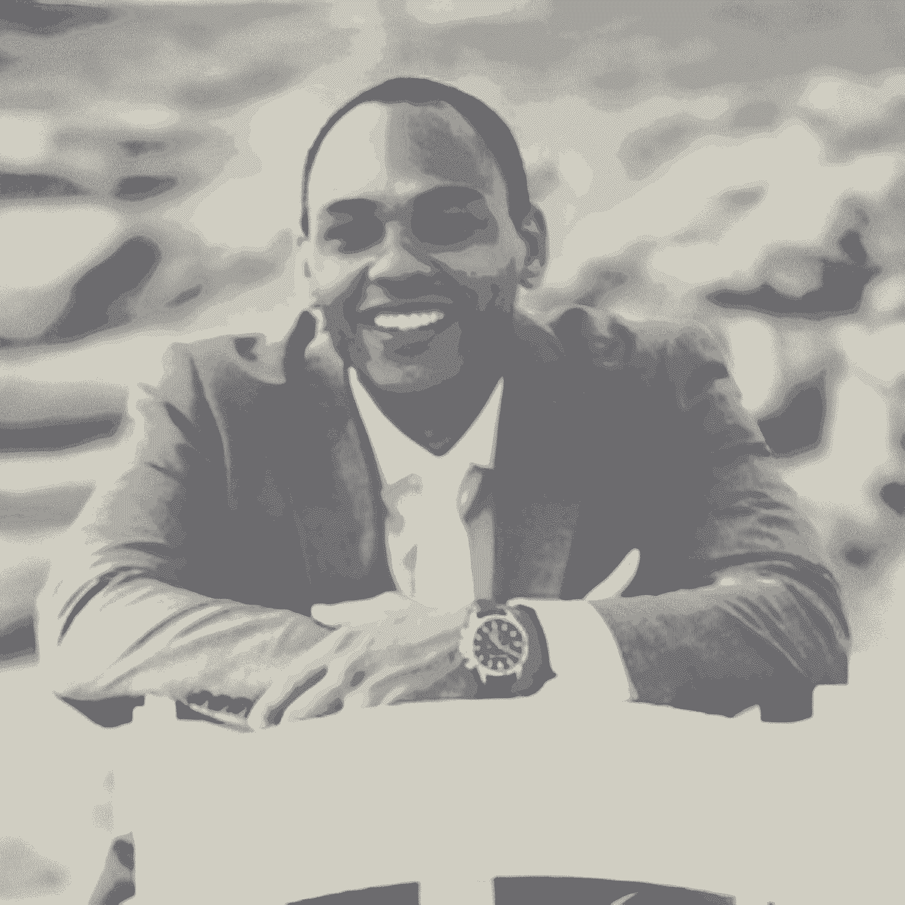
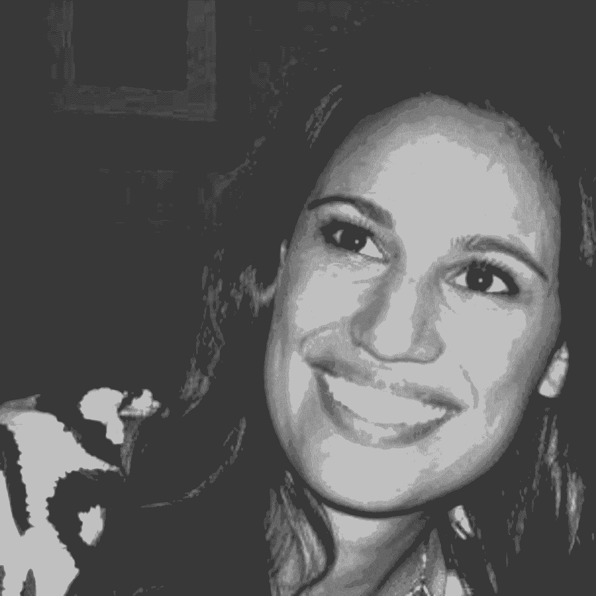
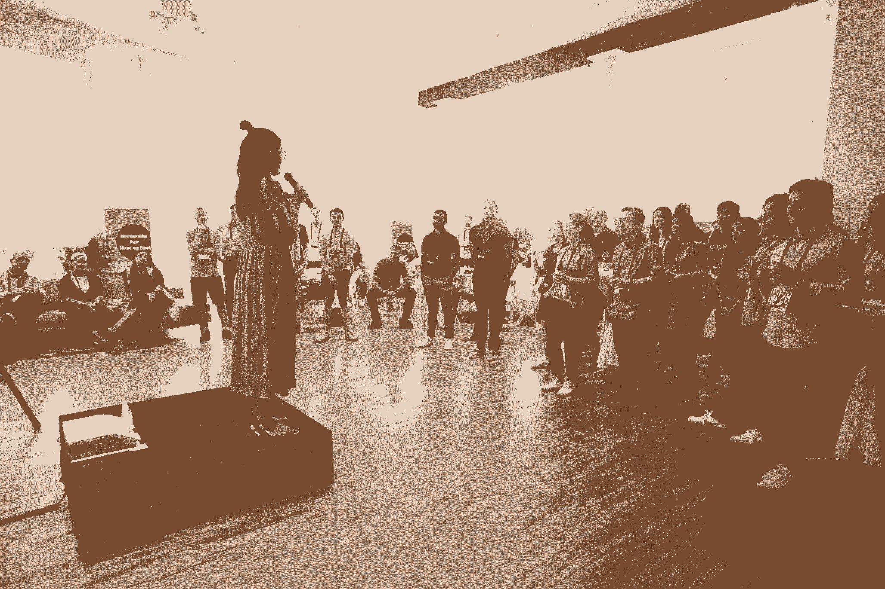
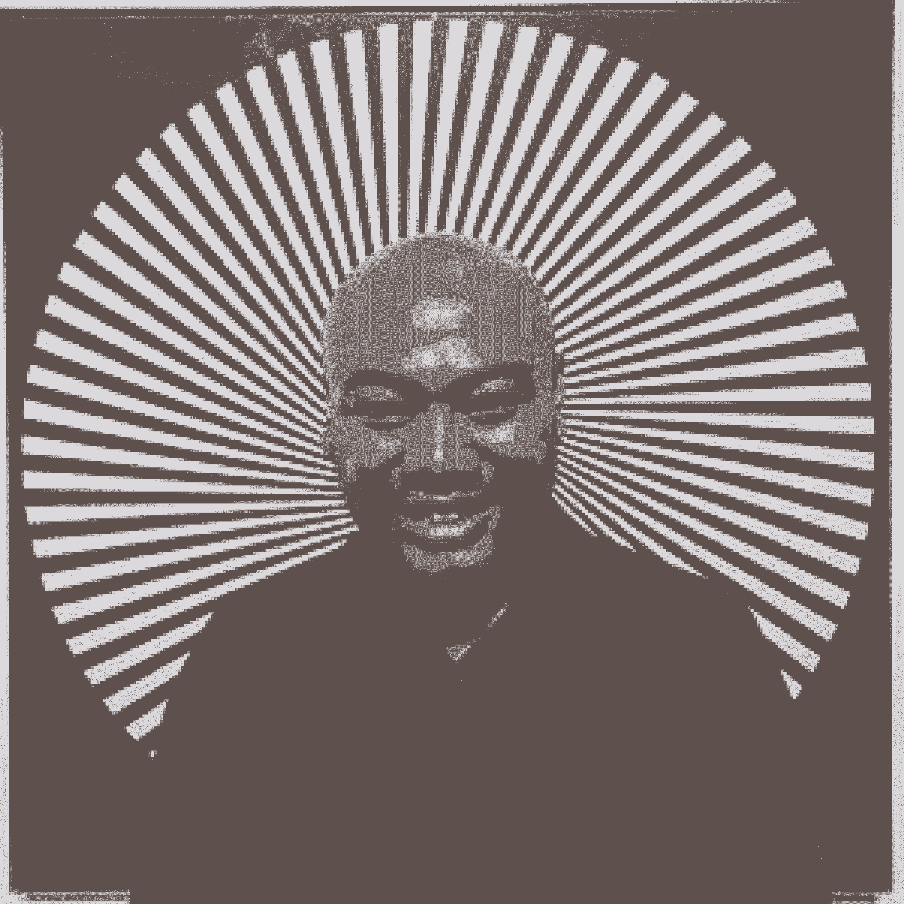

# 如何成为改变职业的导师——来自我们所知的最佳导师的 25 条建议

> 原文：<https://review.firstround.com/how-to-be-a-career-changing-mentor-25-tips-from-the-best-mentors-we-know>

2016 年秋天，第一轮团队启动了我们的第一次导师结对活动，作为一个小实验，只有来自我们社区的几十名导师和学员。快进到三年多后的上周，超过 400 对选手一起结束了他们的最后一次训练。

经过 7 个队列，981 对配对，近 2000 名参与者(以及我们自己的[惠特尼·纳西斯](https://firstround.com/person/whitnie-low/ "null")和[塞丽娜·边](https://firstround.com/person/serena-bian/ "null")的大量辛勤工作)这个我们现在称之为 **[快速通道](https://fasttrack.firstround.com/ "null")** 的导师计划已经成为我们在第一轮所做的最有影响力的事情之一。下面是它的工作方式:这是一个为期 90 天的项目，它将来自我们社区内外的经验丰富的顾问和经营者与我们支持的早期创始人和他们团队中的后起之秀匹配起来。然后，两人见面进行面对面的、结构化的双周会议。

尽管多年来我们对该计划进行了大规模扩展和迭代，但我们的北极星一直保持不变:**我们希望将那些能够改变职业生涯的最强大的“啊哈”导师时刻装瓶，并尽可能多地将它们传递给公司建设者。**

随着我们沿着这条路走下去，我们学到了很多关于什么让导师制发挥作用，以及什么导致它走向歧途。我们之前已经[分享了一些关于评估的经验教训](https://firstround.com/review/we-studied-100-mentor-mentee-matches-heres-what-makes-mentorship-work/ "null")，涵盖了导师和学员共同关心的问题，例如如何找到完美的匹配，建立正确的关系基础，并确保这对每个参与者都有价值。然而，随着项目的发展，导师们为我们提供了另一个值得分享更多建议的领域。这些天我们最常被问到的问题很简单也很严肃:

# **怎样才能成为更好的导师？**

对我们来说，这次调查表明了我们渴望回馈社会，渴望产生真正的影响。每个导师都有丰富的经验和智慧——但如何最有效地分享并不总是一目了然。你怎么知道什么时候分享你自己的观点，什么时候倾听？你如何播下信任的种子，然后随着时间的推移来维护这种关系？

多年的经验和来之不易的教训不是潜移默化就能转移的。当你的学员记下笔记时，发表独白也不起作用。做一名导师需要努力和技巧——而最好的导师会把它提升到一种艺术形式。

为了帮助解决这个问题，我们联系了 Fast Track 中一些最活跃、最成功的导师，听取他们对优秀导师的不同做法的看法。具体来说，我们提出了三个问题:

作为导师，你是如何向你的学员提供建议的？

你认为哪些策略或问题最有助于获得支持？

在这个项目的过程中，你对有效的导师制有什么了解？有哪些事情你会改变做法，或者有哪些策略你不会再尝试？

我们得到的回复绝对值得分享。**下面是我们的指南，让你更好地参与导师游戏**，我们知道一些最好的导师给了我们 25 条成为更好导师的建议。

一些经验丰富的导师提出了一些建议，而其他人则分享了一个简单的真理。我们将他们关于师徒关系的心得归纳为三个部分:有意义的师徒关系的原则、一系列让对话顺畅进行并鼓励自省的问题，以及一套与你的学员一起尝试的小策略。我们希望这本集子是一个丰富的起点，因为你希望自己作为一名导师产生更大的影响。我们开始吧。

The Fast Track mentorship program launch in NYC.

# 实践这些有意义的指导原则:

# 1.请稍后再排除故障。

作为 **Lyft** 的司机体验产品副总裁(也是 Zynga 和 AltSchool 的前产品负责人)， **[Rajiv Bhatia](https://www.linkedin.com/in/bhatiarajiv/ "null")** 拥有丰富的团队建设经验，为初创公司提供建议，并帮助新兴产品明星塑造他们的职业生涯。

如果他要给从事类似工作的导师提一条建议，那就是从一开始就投入额外的跑腿工作来建立关系。“不要马上提出建议和解决问题，”他说。“导师在那里为表达、思考和面对挑战时的脆弱提供一个安全和中立的空间——但只有当你有了信任，你才能接触到真正的东西。先建立起来。”

Dana Mauriello, Small Business Strategy Consultant at Sidewalk Labs

Dana Mauriello 是 **[Sidewalk Labs](https://sidewalklabs.com/ "null")** (之前在 Etsy 领导团队)的一名小企业战略顾问，她还强调了对导师的更广泛看法的必要性。“作为一名快速通道导师，我的第一个收获是**伟大的导师不是关于战术性的问题解决——而是关于全面地支持这个人**，”她说。

# 2.松开你的手，看看怎样才能让导师制“发挥作用”

“一旦你指导了多个人，你会意识到有些伙伴关系自然而然就能运作，因为你们已经有了一个共同的方法，而另一些则需要指导者付出更多的努力。但是以我的经验来看，**导师们需要放下他们对成功是什么样子的想法**,**[Matt Wallaert](https://www.linkedin.com/in/mattwallaert/ "null")**，三叶草健康 **[的首席行为官](https://www.cloverhealth.com/en/ "null")** **说。**换句话说，一段“成功的”导师-学员关系会因每一对而有所不同。

“我有过一段学员关系，在这段关系中，我觉得事情并没有真正‘运转’,因为我很少与他们交谈，但他们最终对这段经历赞不绝口。从他们的角度来看，仅仅是我在“以防万一”这一事实就足以给他们一个自信的安全网来继续前进。我的观点是，如果导师愿意灵活变通，所有的导师-学员关系都可以发挥作用。”

我们需要愿意对导师制的过程和结果有不止一个定义。

Kevin Flores, Director of Product Design at 23andMe

凯文·弗洛雷斯还强调了导师需要如何定制他们的方法。尽管他是**[23 和 Me](https://www.23andme.com/ "null")** 的产品设计总监，但 Flores 的学生来自几个不同的行业和其他职能部门，如工程部门。“这给我提供了一个机会，让我反思如何应对学员面临的不同类型的挑战，甚至是不同的个性，”他说。

“有些学员对流畅的即兴谈话反应良好。其他人可能更喜欢更多的书面信件，这可以让他们深入思考他们的个人目标或挑战——以及你的意见。有些人比较随意，而有些人非常有条理，每次会议都做笔记。直接询问他们的偏好，找出早期对话中的有效方法，为学员而不是你自己提供最有用的反馈、支持和关系。”

# 3.弄清楚你是什么样的导师，并相应地调整你的建议。

作为前总裁和首席运营官在 **UserTesting** 以及一家新创业公司的首席执行官和联合创始人， **[【努夫赛义德】](https://nuffsaid.com/ "null")** ， **[克里斯·希肯](https://www.linkedin.com/in/chrishicken/ "null")** 在导师名单的两边都有经验。这让他相信，导师们需要更加细化他们所提供的指导类型。

希肯说:“我认为人们需要两种不同类型的导师:一种是比你领先三到五年的导师，他正在做你希望在下一年得到的工作；另一种是比你年长得多的导师，他已经达到了你所追求的成功水平。”。

原因如下:“只领先三到五年的导师可以深入到本质策略中，帮助你解决你当前面临的问题。**在职业生涯中遥遥领先的导师在战术上会变得*****。但是它们可以帮助你窥视你甚至看不到的角落。他们会让你高度关注那些会让你坚持长期目标的问题。他们还可以用别人无法用的方式和你说话——他们可以告诉你你在犯傻，让你听话。”***

*这些不同的模式意味着导师需要对他们打算提供的建议持现实态度。“如果你不是在为你的学员填补空白，就不要试图成为那个头发花白的老兵。如果他们在寻找有针对性的市场策略，你不会想提供职业陈词滥调。他说:“想想你能提供哪些建议，然后据此组织你的对话。”。“在我人生的这个阶段，我通常比我的学员领先三到五年，所以我帮助他们思考战术问题。每次会议，他们都必须带来一个我们要一起解决的问题。如果我是一个更有经验的导师，我可能会选择结构更松散、更曲折的对话。*

*

Beth Robertson, Stripe's Startup Partnerships and Growth Lead* 

# *4.一定要听出潜台词。*

*几位导师强调了倾听学员的力量，强调简单的道理是重要的一课，需要反复强调。但是 **[贝斯罗伯森](https://www.linkedin.com/in/beth-robertson-1152a813/ "null")** 加了一个轻微的转折。*

*“导师制就是在学员所在的地方与他们见面。**你必须倾听他们公开告诉你的挑战，同时倾听他们所说的*****说的**， **Stripe** 的创业伙伴关系和增长领导所说的。“倾听我的学员所面临挑战的真正根源，确认我所听到的是否属实，然后通过开放式问题帮助他们找到富有成效的解决方案，这对我至关重要。”**

**我们经常认为我们所阐述的挑战是我们问题的根源——却不了解问题所在的整体情况。**

# **5.请记住，大多数指导都是让你的学员专注于正确的问题。**

**作为增长型营销副总裁， **[米卡·莫罗](https://www.linkedin.com/in/micahmoreau/ "null")** 负责在 **[DoorDash](https://www.doordash.com/ "null")** 消费者、“代购者”和商家的三方市场中推动客户维系和获取。像这样的角色需要高度的专注和敏锐的解决问题的技巧，这些特质在作为导师时会派上用场。**

**“我尽量把 90%的讨论时间花在问题上——如何定义它，如何量化它，以及如何确保它是我和我的学员能够共同解决的最重要、最有影响力的问题，”他说。“根据我的经验，**十有八九，问题不在于找到最佳解决方案，而是确保人们首先关注正确的问题**。”**

**Sidewalk Lab 的 Dana Mauriello 还建议双击以确保你的学员带给你的挑战是真正优先考虑的。“为什么你的学员认为这个问题是一个需要优先考虑的重要挑战？这个挑战对个人有什么影响？她说:“在我和我的学员的会谈中，问这样的问题帮助我们认识到，我们所讨论的挑战实际上并不需要如此优先考虑。**

# **6.把你来之不易的脉络传下来。**

**

Salesforce VP of Sales Dare Olonoh** 

**作为导师， **Salesforce** 销售副总裁 **[Dare Olonoh](https://www.linkedin.com/in/dareolonoh/ "null")** 试图将他的反馈分为三类:**

****他在职业生涯中经历或观察到的广泛信息:**“这提供了背景，因此他们可以了解他们尚未接触的行业规范，”Olonoh 说。“人们很容易忘记，在职业生涯中，当你第一次遇到某些情况时，它们会有多么令人困惑和恐惧。我试着为我的学员将这些事情正常化。以外部雇员填补新职位为例。我和几个学员交谈过，他们的自然反应是开始担心——或者有一点小小的恐慌。现实是，在一家快速发展的公司里，这些事情总是发生，而且不是人身攻击。**

****个人故事:**“当我面临类似的情况时，我会分享我在那些时刻的情绪感受以及我是如何做出决定的，”他说。“尽可能地人性化很重要，这就是为什么个人故事会有冲击力。我们面临的一些挑战纯粹是智力上的，但大多数也是非常情绪化的。[个人故事是一种很好的情感交流方式](https://firstround.com/review/good-leaders-are-great-storytellers-our-6-tips-for-telling-stories-that-resonate/ "null")可以让某人变得更勇敢。**

**他说:“我用了不同的方法来做决策和传达我的要求，这些方法加强了我与领导的关系，而不是削弱了这种关系。”。“我经常使用的一个框架是海军所说的'**舰、队友、自己**'这是一种很好的提出要求的心态。例如，当要求升职时，谈论升职对公司和你的团队意味着什么，而不是只关注你的需求，会有所帮助。这可能看起来像是，“我对我们的发展方向感到兴奋，并希望有机会在未来产生更大的影响。我希望继续做出贡献，并希望得到晋升，担任这一职务，以帮助我们实现这些目标。"**

**为你的学员提供行业规范的背景，这很重要。只是说，“没关系，这种事经常发生，又不是世界末日，”就能产生巨大的镇静效果。**

**

Colin Zima, Chief Data Analytics Officer at Looker** 

# **7.跳过说明，而是讲述故事和分享资源。**

****[科林·马孜](https://www.linkedin.com/in/colinzima/ "null")** 也是个讲故事的爱好者。鉴于他早在 2014 年就加入了 **[Looker](https://looker.com/ "null")** (并在此之前领导了 HotelTonight 的数据工作)，他有很多故事可以利用。([读一些关于 Looker 如何在这里建立的故事](https://firstround.com/review/the-inside-story-of-how-this-startup-turned-a-216-word-pitch-email-into-a-2-6-billion-acquisition/ "null"))。**

**“我不是有针对性地指导或给出指示，而是试图展现类似的情况，并解释我做得对或错的地方，”他说。“我还试图解开我所了解到的我的老板或同事的想法，或者我通过观察我的首席执行官如何以某种方式处理问题而获得的信息。”**

**马孜还认为，导师应该钻研自己的创业工具包，向他们的学员伸出实际的援助之手。“我分享各种文档，无论是工作描述、产品规格还是职业发展。他说:“为了更有策略，可以谈谈这些文件和流程是如何随着时间的推移逐渐演变的，可能与其他人目前所处的阶段不匹配。”**

**时间和经验给予的是对流程和文档的熟悉。花时间与你的学员分享它们是非常宝贵的。**

# **8.分发鱼竿，而不是鱼。**

****[托马斯·巴雷托](https://www.linkedin.com/in/tomasrb/ "null")** 之前曾[分享过他的《为了更好的职业生涯的生物黑客》](https://firstround.com/review/boxs-vp-engineering-on-biohacks-for-a-better-career/ "null")，就在这个评论上。这是 Box 和 Checkr 的前 Eng 副总裁(现任 **[Okay](https://www.okayhq.com/ "null")** 的联合创始人)开始依赖的导师技巧:“作为一名导师，**我通常会尽量避免推荐一个问题的解决方案**，因为导师和学员之间的讨论自然会涉及信息不对称和缺乏完整的背景，”他说。**

**以下是导师可以探索的替代方法:**

**分享与学员经历相似的趣闻，因为这些更容易被记住和重复使用。**

**推荐适用于这种情况的广泛原则，这些原则可以在未来的情况中重用。**

**分享不同可能解决方案的利弊，以建立学员的工具包。**

**他称之为自己的个人 [50/50 法则](https://medium.com/personal-growth/the-50-50-rule-how-to-retain-and-remember-90-of-everything-you-learn-fa5c99d2543d "null"):“我花一半的时间在导师问题上，通过提问来收集背景信息，以缓解不对称的信息不平衡，然后我还确保我的学员用 50%的时间说话，以创造心理安全，并最大限度地采纳建议，”巴雷托说。**

**作为一名导师，我发现有必要教会你的学员通过系统思维来钓鱼，而不仅仅是回答你被问到的问题。**

**

Nina Wilkinson, Lob’s Head of Customer Success** 

**客户成功主管尼娜·威尔金森同样认为导师制是一种授人以渔的练习。“无论是在导师关系还是管理关系中，都是让他们参与寻找答案，而不是给出建议，”她说。**

**为了确保她不偏离正轨，威尔金森要求她的学员带着问题来找她，同时也带着建议的解决方案。“别的不说，这给了我们一个很好的解决问题的出发点。实际上，这鼓励他们先思考问题，并培养一种相信自己直觉的能力，”她说。**

**丽莎·杜索 也提醒人们警惕她所谓的“解决工程”的危险。“我立刻倾向于说‘你应该试试 X！’“ **[Compaas](https://www.compa.as/ "null")** 的首席技术官和联合创始人说我现在试着想出几个主意，并解释为什么每一个都可能更好。她说:“然后，关键是要听听你的学员的反应，看看你是否遗漏了一些细微差别。当你指导聪明的人时，期望他们的挑战是富有挑战性的。”**

****[熨斗健康](https://flatiron.com/ "null")** 的工程总监 **[卡特米勒](https://www.linkedin.com/in/catherine-miller-0177142/ "null")** 针对为你的学员工作的危险，提出了一个重要的细微差别:“有一点我的学员对他们的处境有了顿悟，我*认为*他们已经意识到了这一点，因为这对我来说非常清楚，”她说。“接下来，我更加小心地总结我的想法，并重述我认为从对话中听到的内容。”**

**作为导师，你有很多模式要对照，但你的学员是第一次把这些碎片拼在一起。你必须在确保他们最终看到所有这些是如何组合在一起的，但又不能为他们解决难题之间找到平衡点。**

# **9.送出自信和认可的礼物。**

**当我们向 Jan Chong 询问她最好的指导建议时，她给出了这个深思熟虑的见解:“根据我的经验，人们通常对他们应该做什么来解决挑战有预感，但他们缺乏信心，因为这是一个新的情况。你会听到他们对下一步该做什么犹豫不决，” **Twitter** 的前高级工程总监说。**

**“作为一名导师，我总是试图向我的学员反映我听到他们说的话。有时候，仅仅听一个经历过类似挑战的人重新表述事情，就能提供清晰和自信，让一个不成熟的想法变成一个更完整的计划。或者，也许你会让他们看到他们一直在回避，但内心深处已经知道他们需要面对的真相，”Chong 说。**

**换句话说，被辅导者通常已经知道答案，并正在寻求验证，Andrea Chesleigh 说，他是 **[盒装](https://www.boxed.com/ "null")** 的产品副总裁(也是 One Kings Lane 和 Rent the Runway 的前产品负责人)。“我经常发现人们已经本能地知道他们想要如何处理一种情况，只需要我来验证他们的方法，充当一个探测板，并帮助完善策略，”Chesleigh 说。“我可能还会提供一个框架来帮助组织他们的思维，但归根结底，成为一名好的导师就是要给他们工具，让他们对自己的方法有信心。”**

**

Beth Steinberg, talent leader and founder of Mensch Ventures** 

****[贝斯](https://www.linkedin.com/in/bethsteinberg/ "null")** **[斯坦伯格](https://www.linkedin.com/in/bethsteinberg/ "null")** 采取了类似的方法。我通常发现人们更倾向于正确的方向。“作为一名导师，我发现我最大的价值是提出正确的问题来强化他们已经知道的东西，但如果有必要的话，帮助他们稍微重新定义挑战，”人力和人才咨询公司 Mensch Ventures 的创始人说。**

***查看斯坦伯格关于* *[通过裁员](https://firstround.com/review/how-to-lead-and-rally-a-company-through-a-layoff/ "null")* *领导和凝聚团队的智慧。***

# **10.帮助你的学员练习检查盲点和调查利益相关者。**

**要 **[薇薇安](https://www.linkedin.com/in/viviancromwell/ "null")** **[克伦威尔](https://www.linkedin.com/in/viviancromwell/ "null")** ，取景和透视是关键。在谷歌从事工程工作十多年后，她开始了自己的编辑和旅行摄影业务。她也是一个快速成功的故事:她的学员，Labelbox 的联合创始人丹·拉斯姆森(T21)非常重视她的洞察力，以至于让她成为这家初创公司的顾问。**

**对克伦威尔来说，秘诀在于挑战她的学生，让他们透过多种视角看待自己的处境。“我会问很多问题，尤其是关于它给我的学员和办公室其他人带来的感受。她说:“我想确保我的学员已经做了功课，并对整个团队有了全面的了解。“我有时会为我的学员创造情景，让他们练习困难的口头交流，在这些情景中，我扮演学员的角色，而他们扮演团队成员或同事的角色。像这样的练习可以帮助你的学员培养和练习从他人的角度看问题的习惯。"**

**

First Round's Community Manager, Serena Bian, speaking to a group of Fast Track mentors and mentees.** 

****[米希尔·帕塔克](https://www.linkedin.com/in/pathakmihir/ "null")** 采用了类似的方法。 **[Stack Overflow](https://stackoverflow.com/ "null")** 的战略执行副总裁说:“当指导创始人和高管时，我最喜欢的策略是深入了解其他利益相关者可能如何看待他们的想法或交流。”。“例如，如果这是一个人事问题，我会试着问我的学员，其他相关人员对一个决定会有什么感受。这也适用于建筑外部。如果是战略合作提议，我会问他们对方真正的价值主张是什么，因为最好的合作是双赢的。”**

**自我意识是一个领导者能够拥有的最重要的品质之一。而导师的第三方视角帮你磨练。**

# **11.鼓励情绪，为自我保健创造空间。**

**

Caitlin Collins, COO of Mango Health** 

**作为 **[的首席运营官芒果健康](https://www.mangohealth.com/ "null")** (第一轮获得支持，最近[收购了](https://corp.trialcard.com/trialcard-announces-acquisition-of-mango-health/ "null"))**[凯特琳科林斯](https://www.linkedin.com/in/caitlin-collins-0ba3b95/ "null")** 在 7 年内从 IC 走到了 C-Suite。在那段时间里，她是我们社区的绝对力量，参加活动，在网络(我们内部的 Quora 式平台)上深思熟虑地提供答案，并在多个快速通道团队中担任导师——所以我们很自然地向她寻求如何成为一名更好的导师。**

**“我希望我指导的人能够给我带来他们最大的问题、最深的恐惧和不安全感，”她说。“对于一名学员，我们详细讨论了她工作中最大的压力源。如果你不舒服，没有联系，没有安全感，你很难去那里。**我完全相信导师需要** **[识别情感](https://firstround.com/review/these-seven-emotions-arent-deadly-theyre-your-secret-career-superpowers/ "null")** **并鼓励真实性**。我的目标是帮助我建议的人不要忽视工作场所的这些方面，而是接受它们并向前迈进。”**

****[萨拉·考德威尔](https://www.linkedin.com/in/saramcaldwell/ "null")** ，她是 **[Asana](https://asana.com/ "null")** 的客户运营主管，对此表示赞同。“我注意到，获得指导最重要的一个方面是，它是一种个人关怀。她说:“对于一个在快速增长的初创公司处于职业生涯早期的人来说，平衡眼前的需求、未来的目标和业务需求可能会感到非常困难和难以承受。“作为导师，你为学员创造空间，让他们放下那些紧迫的业务需求，转而拾起自己的目标，谈论自己。这是整体增长和发展的一块重要拼图。”**

**

Ciara Gonzalez-Trinidad, Manager for Inclusion Recruiting at LinkedIn** 

****[希亚拉·冈萨雷斯-特里尼达](https://www.linkedin.com/in/ciaratrinidad/ "null")** **，**领英**包容性招聘经理** [以及运用同理心建立更强大团队的专家](https://firstround.com/review/heres-how-to-wield-empathy-and-data-to-build-an-inclusive-team/ "null")说，同理心是帮助你的学员创造自我关怀空间的关键部分。“最重要的是，要彻底了解存在哪些障碍，同时也要对情况产生共鸣，”她说。“能够理解别人的想法总是很有帮助的。为此，我首先询问学员对他们给我带来的未决问题的想法或感受。**诸如“你感觉如何？”“你认为是什么阻碍了你说出你想说的话？”特别有帮助**。"**

# **12.练习你的管理技能，像对待团队成员一样对待学员。**

**Flatiron 的 Cat Miller 提供了另一个建议，围绕着把导师制看作是一个练习那些管理者需要超越的教练技能的机会的重要性。“我试着把它想象成和我对直接下属做的事情没有什么不同。在某些方面，这实际上更容易，因为当涉及到你正在指导而不是管理的人时，你没有先验知识或偏见，”她说。“这使得询问指导和澄清问题变得更加自然，从而强化良好的经理行为。”**

****[苏](https://www.linkedin.com/in/sue-choe-nyc/ "null")** **[崔](https://www.linkedin.com/in/sue-choe-nyc/ "null")** 在辅导领导者和设计人员系统方面有突出贡献，因此毫不奇怪，她的导师建议也是关于展示那些管理技能，以及像团队中的另一个人一样对待学员。“在他们需要推动的地方，我给他们推动。在他们需要指导的地方，我尽力去指导。在他们有一些知识缺口的地方，我会分享我在这个话题上的一切，”Venmo 前人事主管兼首席人事官说。**

**归根结底，有效的导师关系意味着关心我的学员，就像我关心我雇佣的团队一样。**

# **提出这些有影响力的问题来保持对话的流畅:**

# **13.想象你克隆了自己。你会让你的克隆人做什么，你不会让克隆人做什么？**

**

Matt Wallaert, Chief Behavioral Officer at Clover Health** 

**Clover Health 的 Matt Wallaert(他也给了我们第二条建议)倾向于这个与众不同的问题。背景故事是这样的:“我总是试图从结尾开始。通过了解你的学员想要的结果来开启师徒关系。他说:“这通常是你作为导师承担的大部分工作，因为一旦他们有了终点，前进的道路就会变得更加清晰。”**

**但对沃勒特来说，这不仅仅是问你的学员长大后想成为什么样的人的问题。“我不鼓励人们说‘我想成为 X’，因为这通常是错误的信号，是基于对 X 整天实际做什么的不准确理解，”他说。“我也试图超越‘我想要更多的自主权’这样的笼统陈述。对不同的人来说，自主性看起来和感觉起来确实不同，所以作为导师，你必须深入了解，找出它对你的学员具体意味着什么。"**

**作为导师，我的工作不是告诉别人什么是对的，或者试图影响他们的想法。我的角色是帮助界定这些需求的边界，让它们清晰可见，然后在这个方向上绘制一条路径。**

**现在，回到克隆人。“我发现，关于你的克隆人会做什么的问题对深入了解细节非常有影响，”Wallaert 说。“举个例子:‘我其实喜欢洗碗。这是结束一天的一种很好的温水方式，我觉得这是一种深思和冥想。“但我讨厌扫地，所以克隆人可以吃。”现在你已经确立了你的学员实际上明显想要的是什么，你可以帮助他们找出哪种角色需要更多洗碗，而不是打扫。"**

**

Duo Security's VP of Product Design, Sally Carson** 

# **14.你现在需要什么？**

****[莎莉·卡森](https://www.linkedin.com/in/sally-carson/ "null")** 是一位娴熟的团队建设者和深思熟虑的导师([阅读更多关于她如何从零开始建立和扩展她的产品设计团队](https://firstround.com/review/ready-set-hypergrowth-how-duos-product-design-lead-primed-her-team-for-momentum/ "null") at [Duo Security](https://duo.com/ "null") )。她用这个问题来确保她作为导师提供了正确的建议。**

**“导师提供的支持方式有很大的不同，无论是支持、模仿、指导还是建议。**根据我们自己的经验直接给出建议很容易，但这通常不是你的学员所需要的**。也许她只是需要有人说“继续，你完全可以做到的！””卡森说。**

**当你和你指导的人见面时，花点时间问问他们需要什么来分析差异。他们需要建议吗？他们只是需要一个倡导者来告诉他们，他们正在以正确的方式思考问题吗？**

# **15.你还在想什么？**

****[朱尔斯·瓦尔特](https://www.linkedin.com/in/juleswalter/ "null")** 不知何故抽出时间为**斯莱克**的增长和货币化团队、[天使投资](https://angeltrack.firstround.com/meet-the-angels/jules-walter "null")、担任[CodePath.org](https://angeltrack.firstround.com/meet-the-angels/jules-walter "null")的总裁和联合创始人，并作为快速通道导师贡献自己的时间。当他戴上最后一顶帽子时，他依靠这个简单而有力的问题来深入了解他所指导的人。**

**他说:“当学员提出挑战时，最困扰他们的并不总是什么，而是他们认为应该分享的内容。"鼓励他们提出更棘手的问题。"**

# **16.五年后，你对未来做什么感到兴奋？**

**Keith Cowing 是熨斗健康公司的产品副总裁，但这个问题是他在 LinkedIn 担任项目经理时问的。**

**“当你的学员考虑职业机会时，他们可能会将许多不同的东西混合在一起:他们兴奋的是什么，他们认为现实的是什么，他们的朋友和家人的想法，他们当前角色的期望是什么，以及目前看起来有声望或有利可图的是什么，”考宁说。**

**“通过展望未来五年，专注于让他们兴奋的事情，作为一名导师，你可以帮助他们保持现实，但释放所有其他阻碍他们的约束。然后你就可以了解他们的动机和长期目标的基本原则，即使它们很模糊。之后，帮助他们一次一层地回到约束中，并在考虑最终结果的情况下，掌握应对短期现实的战术。”**

**许多人下意识地走上了既定的道路。作为导师，如果你猛踩刹车一分钟，说“等等，你想要什么？”你会发现自己与学员的对话完全不同。**

# **17.如果你完全放弃这个项目，最坏的情况会是什么？**

**Kathy Porto Chang 曾在 Stripe 和 Twitter 担任产品负责人，管理项目经理团队，负责应对一些最棘手的商业挑战——除此之外，她还是一位新兴的天使投资人。以下是她在职业生涯中注意到的，并试图传递给她指导过的人的东西:**

**

Stripe PM and First Round Angel Track investor, Kathy Porto Chang** 

**“如果人们能够集中注意力，他们会表现得更好，但很多时候他们会因为义务或遗留项目而感到力不从心。作为一名导师，我试图在以下问题上推动他们，以帮助他们发现提高杠杆作用的机会:**

**你现在最重要的目标或项目是什么？**

**你会如何委派你的其他项目？**

**如果你完全放弃这个项目，最坏的情况会是什么？**

# **18.让我们具体一点——背景是什么，你的约束是什么？**

**艾玛·施瓦茨 今年秋天加入了快速通道导师的行列，这是一个受欢迎的新成员。作为 **[Meetup](https://www.meetup.com/ "null")** ( [于 2017 年被 WeWork 收购](https://news.crunchbase.com/news/wework-acquire-meetup/ "null"))的产品副总裁，以及 Shutterstock 和 Axios 的前产品负责人，施瓦茨对建立产品团队和在技术领域指导女性充满热情。**

**她的首要策略是提出问题，帮助她更好地诊断学员面临的挑战，并提供策略支持，确保他们带着一些具体的东西离开，而这些东西在他们到达之前是没有的。“无论是编辑一副牌还是一份战术清单，我都希望他们觉得每次训练都能学到一些可以立即应用的东西，”她说。这个意图需要她做一些前期的调查工作。**

**从一开始就了解你的学员的期望、时间表和限制。否则，很容易陷入讨论中，在你得到他们明天可以实施的战术性的、可操作的策略之前就没有时间了。**

**

Emma Schwartz, Meetup's VP of Product** 

**当学员要求 Schwartz 帮助解决困难情况时，她会向他们提出一些有针对性的问题:**

**在我们进入战术之前，你能以叙述的形式给我快速浏览一下上下文吗？**

**除了表面水平的输出，你真正希望完成的是什么？**

**这个的时间表是什么？**

**你公司的谁参与决策？**

**有没有你控制不了的屏蔽？你有多大的自主权来解决这个问题？**

# **19.什么阻碍了你的学习？**

**“根据我的经验，由于学习的潜力和现实，角色是令人满意的，而挫折与缺乏学习、学习速度缓慢或质量下降有关， **[Ibrahim Bashir](https://www.linkedin.com/in/ibrahimbashir/ "null")** ， **[Box](https://www.box.com/home "null")** **，**的产品副总裁，前亚马逊资深人士([，他在那里磨练了对发布战略的敏锐度](https://firstround.com/review/my-launch-lessons-from-37-minutes-in-an-amazon-war-room/ "null"))和第一轮专家网络的成员。**

**“我试图深入了解人们在接受一个角色时认为他们会从这个角色中获得什么，以及什么改变了他们仍然保持参与。他说:“这是一种尝试，将问题放在背景中，理解它是一个更大问题的症状，是一个反复出现的主题还是一次性的，以及之前已经做出了哪些尝试来解决它。”**

# **20.从外部看，你如何看待这一挑战？**

****[Lumos Labs](https://www.lumosity.com/en/ "null")**CFO**[Tyler Chapman](https://www.linkedin.com/in/tyler-chapman-1422908/ "null")**是一位运营财务专家，他还有一个问题要补充，这个问题的重点是让学员从更客观的角度看待他们面临的挑战。“这个问题改变了他们的思维模式，帮助他们对挑战和潜在的解决方案有更客观的理解，”他说。**

**导师们，把你的学员从他们所面临的挑战的细节和情绪中解救出来，并把他们带到更高的境界。**

# **尝试以下其他策略来提升你的导师水平:**

# **21.脱离剧本**

**

Chewse COO Kash Mathur** 

**虽然结构和意图是保持导师关系的关键因素，但 **[Kash Mathur](https://www.linkedin.com/in/aakashmathur/ "null")** 也喜欢在与他的学员的会议中“偏离议程”。**

**这就是为什么首席运营官在推荐这个策略:“我发现留出一些时间问一个开放式的问题是有效的，比如‘上周你在想什么？’总有一层一般的东西，但我会保持安静，等待真正的挑战出现。通常，它们最终与我们同意讨论的预先计划好的议程项目非常不同，而且更重要，”他说。**

# **22.当你的学员似乎不知道该问什么时，要深入探究。**

**虽然有些学员在每次会议前都准备好了一系列他们需要展望的挑战，但其他人倾向于保持沉默，需要更多的哄劝。**

**Jan Chong 提出了另一个很好的帮助策略:“我经常发现学员不知道该问他们的导师什么，特别是如果他们没有迫切的挑战，他们想立即钻研的话。”。“为了克服这一点，我会举一些例子，说明学员可能希望如何利用我们在一起的时间。我将谈谈当我处在他们的位置时，我曾问过我自己的导师的问题。或者我会提出我真的希望能有一个更资深的人来咨询的时候。”**

# **23.指导项目经理？将您的产品视角应用于学员面临的挑战。**

****[常驻](https://www.residenthome.com/ "null")** 的 **[克里斯马利瓦特](https://www.linkedin.com/in/maliwat/ "null")** 有着严肃的产品印章。从网飞和 Skillshare 到 Warby Parker、Gilt Groupe 和 Artnet，他在许多公司负责产品。在与学员的会谈中，他毫不夸张地运用这些产品技能，即使他们给他带来了人员或管理问题。**

**

Chris Maliwat, VP of Product Management at Resident** 

**“重复快速通道导师说:**用你解决产品问题的方法来解决学员的挑战**。“我首先通过定义他们的目标和成功标准，写出详细的用户案例，然后构建执行路线图，将他们的具体问题分解成组件。”**

****[Romy Macasieb](https://www.linkedin.com/in/macasieb/ "null")** 也把他的产品镜头借给了导师。作为沃克&公司品牌 的产品管理副总裁，他亲眼目睹了项目经理如何容易陷入一个特定的陷阱:认为他们必须独自解决问题。“在快节奏的初创公司，许多项目经理面临着类似的挑战。我经常听到这样的问题，'*我如何让我的经理倾听？我如何让团队集中注意力？*或*我如何向技术主管提供反馈？“Macasieb 说。“在深入探讨想法或给出我对这些特定主题的想法之前，我会停下来请他们告诉我更多关于他们的经理、他们团队中的其他项目经理以及他们与该技术主管关系的健康程度的信息。原因如下:***

**产品领导者拥有许多超能力，但我们最大的弱点可能是我们试图靠自己解决问题。当我们把“我如何……”的问题变成“我们如何……”的问题时，我们会做得更好。"**

**Nik Bonaddio 也喜欢探究环境和其他利益相关者之间的相互作用，尤其是当它产生特定的问题时。“产品世界中的挑战很少是可替代的，”FanDuel 的首席产品官说，该公司收购了 numberFire，这是 Bonaddio 利用他在《谁想成为百万富翁》中的出场所得创立的一家初创公司。**

**“即使我作为产品负责人面临过类似的挑战，**根据我的经验，没有通用扳手可以解决所有问题。他说:“这是因为挑战从来都不是严格意义上的产品** — **它经常渗透到所有其他功能领域。“因此，对于我所指导的年轻项目经理来说，通常首先要做的是解开所有这些联系，并理解与他们一起工作的不同利益相关者的动机。经常发生的情况是，通过向第三方解释情况，学员将发现他们一直缺失的洞察力。”****

# **24.休息一下。**

**

Nik Bonaddio, Chief Product Officer at FanDuel** 

**并不是每个导师会议都会有突破——有时也会出现僵局。这就是为什么我们喜欢 Bonaddio 的这个额外提示。**

**“当你面临挑战时，有时你会陷得太深，以至于无法专注于其他任何事情。他说:“你寻求解决方案的空间被人为地缩小了。“所以我经常建议我们休息一下，而不是坚持下去。我们两人可以有 15 分钟的休息时间来谈论其他事情，或者让学员离开问题一两天，以便获得新的视角。”**

# **25.让你的学员退后一步，看看为什么。**

**这最后一点给导师的建议是一个合适的顶点。对于她的学员带给她的几乎任何情况， **[莉拉·利平科特·帕克索伊](https://www.linkedin.com/in/anabellippincott/ "null")** 都喜欢从头开始。**

**帕克索伊是前首席人事官，现任 **[议会](http://theassembly.com/ "null")** 顾问(她之前曾在 Twitter 和 Opendoor 担任人事运营专员)。“我喜欢花时间在特定问题或情况背后的目的上，”她说。“你为什么从事这个产品或项目？你的公司为什么存在？你觉得创始人为什么这么在意这个问题？诸如此类的问题总是有助于从你周围其他人的角度看待手头的问题，这可以增加同理心，并释放出更多创造性的解决方案和想法。”**

***图片由 Getty Images / Frederick Bass 提供。快速跟踪事件照片由* *[Beleza 创意](https://www.belezacreative.com/ "null")***