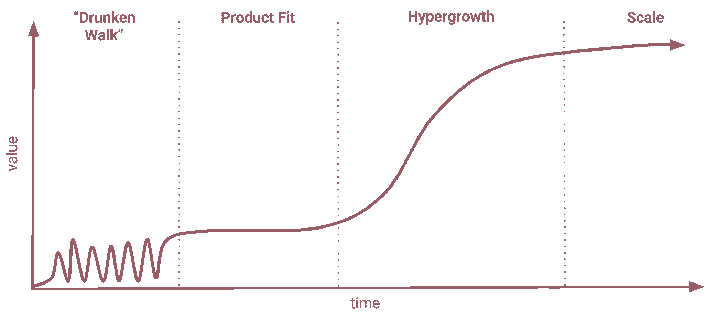
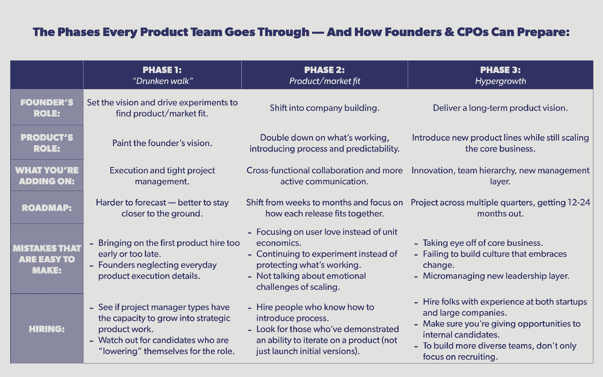

# 如何在每个阶段打造您的产品团队，从产品/市场前适应到快速发展

> 原文：<https://review.firstround.com/how-to-craft-your-product-team-at-every-stage-from-pre-product-market-fit-to-hypergrowth>

自从今年夏天从信贷业首席产品官的职位上离职后，尼克希尔·辛哈尔就一直很忙。除了花时间权衡他下一次冒险的选择(以及急需的与家人的阿拉斯加邮轮假期)，他一直在为初创公司的各个领域提供建议，从斗志昂扬的早期创始人到一些最大的独角兽公司的产品负责人。

这是因为，无论你的公司处于哪个阶段，Singhal 都是一个完美的宣传平台。他共同创立了三家创业公司:一家失败了，一家被 IBM 收购，一家在 2011 年被谷歌收购。然后，他在这家科技巨头工作了一段时间，在执掌 Credit Karma 之前，他推出了视频聊天工具，召集产品团队拍照，在那里，他监督了六个新产品线的推出，并在四年内将产品团队从 10 人扩大到 75 人。

利用这种专长，大大小小公司的创始人和产品负责人都向他提出了最棘手的问题:创始人应该何时移交产品控制权？你应该在 PM 中寻找什么？你如何组织这个团队？你如何平衡战略和创新与执行力和可预测性？

在这些问题的下面是雷区，可能引发许多失误。辛哈尔说:“创始人经常无法采取必要的措施来有意扩大产品功能，然后当超增长来袭时，轮子就开始脱落了。”“其他时候，他们试图过早地雇佣未来的产品团队。驾驶路线图和变得更具战略性是*将来会*存在的重要问题，但在早期阶段，更多的是让火车准时运行。”

这就是为什么 Singhal 总是发现自己给出了同样的建议:**你需要精心打造一个产品团队来匹配你公司的阶段**。换句话说，从[寻找产品/市场契合度的早期斗争](https://firstround.com/review/how-superhuman-built-an-engine-to-find-product-market-fit/ "null")和[雇佣你的第一个项目经理](https://firstround.com/review/find-vet-and-close-the-best-product-managers-heres-how/ "null")，到在混乱的中间阶段优化产品的“青少年时期”和[成长为 10 人的产品组织](https://firstround.com/review/trellos-product-lead-on-the-unique-ramp-to-a-10-person-product-org/ "null")，再到超高速增长，创业公司生命的每个阶段都给产品组织带来一系列独特的挑战。

这种不匹配的后果可能是深远的。过早的产品雇佣可能会被仍然坚持自己产品的创始人排挤。或者，后期高管可能会发现自己的产品团队很擅长带球跑，但却很难自己想出新的产品线。

为应对公司面临的挑战而调整产品团队规模的能力是一个秘密武器。

为了帮助创始人和产品负责人更好地了解这些挑战，以及他们需要的团队来解决这些挑战，Singhal 分享了他认为一个产品组织在创业公司成熟时会经历的阶段。(尽管它们彼此不同，但他指出，公司不会在一夜之间经历这些变化。“它们需要几个月甚至几年的时间或者重新布线，用古老的格言‘让你到这里的不是让你到那里的’作为你的指路明灯，”他说。)

**第一阶段:“醉步。”**公司的目标是尽可能多地进行试验，以找到产品/市场的契合度。产品的任务是描绘创始人的愿景，并且更多的是作为一种服务或项目管理功能来工作。

**第二阶段:产品/市场契合度。**是时候加倍努力了。随着创始人越来越忙于扩展公司，产品的角色是拥有与其他团队的协作并推动沟通，同时可预测地交付版本以改进产品。

**第三阶段:超增长。**这一阶段是在扩展现有产品的同时进行创新。产品团队需要阐明战略路线图，将公司的使命和长期愿景转化为多个季度。这需要引入新产品和支持现有的成功产品相结合，同时开始增加一个新的团队领导层，他们可以自己做出决策。

**第四阶段:规模化。**公司成为市场领导者(想想 FAANG)。“大楼内部”的问题越积越多，焦点转移到维持增长上，创新者的困境变得最为尖锐。

在这次独家采访中，Singhal 分享了产品团队如何在这些阶段之间优雅地过渡。专注于前三个阶段，他将涵盖产品团队需要如何改变，创始人的角色应该是什么，太容易犯的错误以及招聘时应该注意什么。无论你是第一次实施项目管理的早期创始人，还是寻求建立领导骨干和更好地构建团队的后期产品负责人，你都会在他来之不易的智慧中找到经过检验的策略。

# 第一阶段:进行“醉酒散步”

*创始人在这个阶段的常见问题:*

*在我们的初创公司中加入产品功能的合适时机是什么时候？在这个阶段，我应该期望它做出什么贡献？*

*在我们的首次产品招聘中，我应该寻找什么？我是不是应该雇佣一个能成长为产品主管或副总裁的人？或者是一个更初级的玩家，我稍后会在上面分层？*

# 这个阶段是什么样子的:

“我的朋友戴夫·沃顿为这个阶段起了个名字，我很喜欢，”辛哈尔说。“这是关于跌跌撞撞，试图建立人们想要的东西。**这个阶段与“向上并向右”相反它很快就会失败，不确定你要去哪里**。它可以持续数年——而 99%的初创公司永远也不会成功。"

# 产品的角色与创始人的角色:

Singhal 发现，许多创始人在这个阶段往往会对“没有投资于产品团队”感到内疚。但是根据他的经验，不值得为此失眠。“他们正在做完全正确的事情，”他说。“创始人应该拥有[,在融资跑道](https://firstround.com/review/how-superhuman-built-an-engine-to-find-product-market-fit/ "null")结束前找到产品/市场的契合度，这意味着提出产品愿景，并决定生产什么以及生产顺序。早期工程师帮助他们更快地实现目标。”

那么产品功能在哪里呢？“在这个阶段，早期的产品雇佣不会帮助长期规划或创造下一件大事，”Singhal 说。“相反，它是关于快速描绘创始人的愿景，理想情况下是加速找到客户想要的东西。”

简而言之，**产品管理本质上就是现阶段的** ***项目*** **管理**。“我确信一些产品人员会对这个标签感到愤怒，”他说。“但如果你不能可靠地发货，你就不能提前计划。大多数项目经理在开始职业生涯时都专注于执行和策略，新生的产品组织也应该从同一个地方开始。”

一家初创公司的第一个产品雇佣需要专注于理解如何与工程师合作，以及如何可预测地执行。“这是建立时间表，运行站立，发布产品需求和协调发布。一旦你理解了所有这些是如何组合在一起的细节，你就可以优先考虑工作了，”辛哈尔说。“设定目标是这一过程的自然结果。一旦你开始谈论目标，你需要放大到一个更高的层次来说，“嗯，我们需要去哪里？有什么策略？我们如何才能找到实现这一目标的路线图？嘣，你在做产品管理。"

但是你不能期望在醉酒行走阶段进入所有上游工作。“在最开始的时候，你很幸运能够提前计划几个步骤——你没有资源或数据来做更多的事情。你无法预测客户想要什么，也无法预测未来六个月的情况。构建一个详细的路线图没有任何价值，事实上，它的工作方式正好相反。离地面越近越好。”

在“醉步”阶段，它讲的是刺儿头的实验和快速移动。管理、流程和结构是尚未加入的因素，任何早期的产品雇佣都是配角，而不是主角。

# 容易犯的错误:

对 Singhal 来说，创始人在第一阶段的错误都归结于时机。“创始人要么过早或过晚雇佣第一批产品。我当然对这两者都有罪，”他说。在这里，他概述了每种方法的风险:

**为时过早**:“找到合适的产品/市场很难，所以在失败了几个季度之后，引入一个能想出制胜点子的项目经理是很有诱惑力的。辛哈尔说:“我在所有的初创企业中都犯了这个错误。“有时项目经理会试图提出一个宏伟的愿景——但这通常是不知情的或不现实的。其他时候，他们觉得没有权力向早期员工建议新的方向。如果你是一个创始人，认为产品是你固有的身份，你需要找到自己的方式。否则，当你还想上场的时候，你就冒着让自己靠边站的风险。”

**为时已晚:**“创始人往往希望尽可能久地抓住产品不放。但最终，他们不再有时间做日常的产品工作，”辛哈尔说。为什么这是有问题的:“团队中的每个人都需要上下文。否则，工程将会交付不符合要求的功能，或者交付时间太长，因为该功能的关键原因是未知的，”他说。“当大家围坐在一张桌子前时，分享这种背景很容易，但特别是当你有了几名工程师并增加了一名设计师时，这种背景很快就会瓦解。如果你与工程师交谈，他们的反馈是，“我不确定我是否理解我们为什么要建造我们正在建造的东西，以及何时建造，”这是一个迹象，表明细节已经被遗漏了。请一位产品人员来帮助营造这种氛围。”

# 雇佣谁:

“当我开始谈论产品工作在这个阶段如何更像项目管理时，一些创始人立即跳到‘好吧，一旦我们有了产品/市场契合度，我会雇用一个超级初级的人，并在他们之上分层。’“但我不认为必须如此，”辛哈尔说。一个强有力的项目经理可以和组织一起扩展，变得更有战略性。"

他在信贷业亲眼目睹了这一点。“大多数最初的产品团队都是第一次或第二次工作。当我们达到增长阶段时，他们中的大约一半都在努力跟上公司的规模。辛哈尔说:“他们最终转到了早期公司，但职位要高得多。“然而，大约一半的团队成员与组织一样快速地扩展，并且仍然发现自己在今天的 Credit Karma 中处于领导地位。”

很难预测谁能迎接挑战，但那些能与公司一起发展的人将是你最珍惜的雇员。我会在一周中的任何一天带着这些人，而不是更有经验的产品领导者，他们正在“降低”自己，承担一个好斗的早期角色。

以下是他建议在面试中留意的信号:

**探索项目经理是否有能力胜任更多工作。**“项目经理对过程充满热情。“产品人员对客户以及产品如何解决他们的问题充满热情，”辛哈尔说。要分析这种差异，请候选人或他们的推荐人定义他们什么时候完成了 A+的工作。“一个在项目经理这一边走得太远的候选人只会谈论她是如何按时完成任务并确保项目顺利启动的。但是，能够延伸到更具战略性的产品工作的候选人也会提出产品发布对客户和业务的影响。”

听这个短语。“有时你会听到‘我可以为这家公司和你的角色弄脏我的手——目前是*’辛哈尔说:“对于高层领导来说，这要么意味着他们已经为早期阶段做好了准备，并将享受挑战，要么意味着他们将忍受短暂的折磨。后者给创业公司的成长带来了巨大的压力。本质上，你是在候选人的职业期望和企业的增长曲线之间赛跑。要确定是哪一个，可以问这样的问题:“如果公司一年来都在努力寻找适合的产品/市场，而你仍然处于‘较低水平’，你会有什么感觉？”"*

# *阶段 2:达到产品/市场契合度*

**此阶段创始人常见问题:**

*我们如何判断我们的产品/市场是否合适？*

**达成目标后，作为创始人，我应该如何参与产品决策？**

**我的产品团队应该有多大？招聘的时候应该找什么？**

# *这个阶段是什么样子的:*

*对于那些成功找到产品/市场契合点的幸运创业公司来说，第二阶段是关于保持低姿态执行和引入正确的流程水平。*

*“在这一阶段，它变得更少关于实验，更多关于加倍努力以充分捕捉桌面上的所有价值。换句话说，**现在是全速前进的时候，不是捣乱的时候**，”辛哈尔说。*

*寻找产品/市场契合度就像你长时间摩擦两根棍子后突然冒出的烟。现在，一切都是为了保护和煽起那微弱的火焰。*

# *如何判断你何时到达这里:*

*创始人往往会误判他们是否真正清除了产品/市场契合度的障碍 Singhal 认为这一标准应该更高。下面是我对产品/市场契合度的简单定义:每个用户的价值大于将他们带入产品的成本。他说:这意味着有足够多的顾客在那里*和*你可以有效地把他们带进来。*

*根据 Singhal 的说法，很少有声称产品/市场符合这一定义的初创公司实际上达到了这一目标——过早宣布胜利并迅速扩大规模的影响可能是灾难性的。“我在我的上一个创业公司 [SayNow](https://www.crunchbase.com/organization/saynow "null") 学到了这个教训。我们让单位经济为我们的一些客户服务，但实际上这是一个受欢迎的业务。我们不能有效地为我们所有的客户带来利润。他说:“如果我从整体上看待业务，我就不会过早扩大规模。*

*换句话说，将单位经济学排除在产品/市场匹配讨论之外是错误的。“用户的爱是不够的。不仅仅是少数对你的产品充满热情的顾客。他说:“如果你在注入增长汽油之前不把你的集体行动权和 LTV 考虑在内，你就有可能造成这样一种局面:人们喜欢你，但要让他们爱你需要太多的钱。“这种方法在短期内可能行得通，但你不能总是指望廉价资本。如果你的企业只有在不断亏损的情况下才能运转，那就是一颗定时炸弹。”*

*有很多关于产品/市场适合度的定义，关注的是有多少用户喜欢你。但这忽略了一个关键因素:获取这种爱所需的盈利能力和可持续性。*

*以下是 Singhal 对以消费者和企业为中心的创业公司面临的产品/市场匹配挑战的更具体的想法:*

***消费者:**“一个明显的迹象是[病毒式增长循环](https://firstround.com/review/pinterest-and-grubhubs-former-growth-lead-on-building-content-loops/ "null")，你几乎不用支付任何费用就能吸引新用户。这是我在从事 SayNow 这样的社交应用时所追求的。不过，更典型的情况是，你需要花钱来获得这种分销渠道，如果这些渠道枯竭，或者没有办法在一个合理的窗口内赚回这笔支出，那么这就变得更加危险了，”他说。*

***企业:**“我发现对企业来说，产品/市场契合度可能更难发现。对于我的第二家公司 Cast Iron，我们已经有了几个付费客户，并且认为我们已经成功了。但我没有完全意识到我们的产品问题:第一个客户的问题与第二个客户的问题不同，第二个客户的问题抓住了我们第十个客户的痛点，”他说。“如果衡量标准是，‘我们有 10 个付费客户’，但与此同时，在幕后，工程师正淹没在功能请求中，因为他们试图解决不同的痛点，你还没有找到产品/市场契合度。你需要找出一个可重复的动作，找到想要你所做的东西的用户，而不是那些付钱给你去做其他东西的用户。”*

*产品在某些时候必须自立——你不能为每个新客户改变它，但仍然合理地声称产品/市场适合。*

# *产品的角色与创始人的角色:*

*在经历了产品/市场匹配的风口浪尖之后，创始人很快就开始忙于塑造公司的其他部分，包括调整文化、雇佣管理团队以及帮助新职能找到自己的立足点。*

*“从现在开始，创始人不可能参与每一个产品发布的细节。与此同时，工程部门正专注于构建一个更健壮的架构，而营销部门也有话要说。随着团队规模的扩大，每个员工都开始失去对产品和客户的了解。辛格哈尔说:“经前综合症有责任缩小这一差距。*

*换句话说，产品的盘子变得更加拥挤了。“这是一个组合，定义客户及其用例，评估当前产品的竞争力，制定如何变得更好的路线图，就优先事项做出艰难的决定，并确保一切顺利进行，”他说。*

*在这里，Singhal 强调了产品团队在这个阶段要应对的两个具体变化:*

***路线图**。“工程需要确定哪些东西是耐用的。营销和销售需要设定客户的期望，客户需要自己做规划。因此，每个版本如何组合在一起的顺序开始变得更加重要。Singhal 说:“你的规划范围从几周变成了几个月，因为你对客户的需求有了更好的了解，你需要提前告诉其他团队你要去哪里。*

***沟通挑战:**“你需要开始建立更高级的沟通习惯，而不仅仅是每周一次的站立。他说:“在 Credit Karma，我们为整个公司引入了两周一次的产品演示，为产品团队引入了每月一次的异地演示，每月一次的执行产品回顾，以积极提供其他人正在寻找的环境。“这里偏向主动交流。一家公司不能指望所有相关信息都会被动地渗透进来。”*

*

Nikhyl Singhal, former founder of three startups and CPO of Credit Karma* 

# *容易犯的错误:*

*在 Singhal 创办的公司中，他注意到了第二阶段明显的文化转变。“在产品/市场匹配之前，有一种哲学是把东西扔向墙壁，看看什么能坚持下来。但是，当你有了正在发挥作用的东西，你需要稳定和深化它，”他说。“疯狂的牛仔说，‘让我们把一切都炸掉，尝试一些新的东西’，他必须退居二线。**当一家初创公司开始扩大规模，开始关注产品深度和质量时，过程就开始变得非常重要——尽管过程是很多初创公司想要避免的事情***

*更具体地说，他发现早期阶段的团队没有为这个阶段带来的情绪变化做好准备。“这种心态的转变对每个人来说都是心理上的挑战，因为大多数时候它没有被明确地表达出来，”他说。“你开始听到这样的话，‘我们已经失去了优势’，或者‘我们真的需要那次会议吗？’重要的是[谈论缩放的感觉以及为什么很难](https://firstround.com/review/give-away-your-legos-and-other-commandments-for-scaling-startups/ "null")。不要因为想要“快速行动”，就把它藏在地毯下面或推迟引入你需要的结构。"*

# *雇佣谁:*

*“我真的不喜欢项目经理和工程师的比例——他们通常不考虑你产品的细节，”Singhal 说。“例如，从事最终用户功能的团队往往比平台团队拥有更高的比率。但如果有帮助的话，每个产品负责人有 8 到 12 名工程师是很常见的。因此，如果你有 25 名工程师，我希望有两到三名产品经理，而不是一或五名。”*

*至于他在这些项目经理身上寻找什么，以下是第二阶段最重要的两项技能:*

*一些以前看过这部电影的人。"一半的工作是弄清楚成功的执行和可预测的交付是什么样子的。你希望有人进来说，“我们需要开始设定目标，培养正确的沟通习惯，让合适的人坐在桌子旁边。”“通常，能够做到这一点的项目经理是那些在一个更成熟、拥有稳定产品的组织中工作过的人，”辛哈尔说。大公司背景可能会很好，因为这需要大量的跨职能工作，如营销、法律等。但这不是一个笼统的说法。"*

*知道如何引入正确层次结构的人。“知道好的流程是什么样的，以及知道如何将它介绍给一家没有这种流程的公司，这是两种完全不同的技能。辛哈尔说:“你需要具备软技能，以及如何应对随之而来的挑战的意识。“大多数来自成功产品组织的候选人并没有创造过程，他们只是遵循过程。因此**在采访中，我通过询问他们引入流程的时间以及流程在他们的团队中如何进行来寻找这些引入变革的技能**。我希望听到这样的回答，“让我告诉你们我们过去是怎么做的，现在是怎么做的，”或者“我们试图做出这种改变，但它真的适得其反，这就是它出错的原因。”"*

*迭代直到工作的能力被低估了。我更愿意雇佣一个在小型创业公司将产品从第二版升级到第八版的项目经理，而不是一个大规模工作，但只发布初始版本然后继续前进的人。*

# *第三阶段:进入高速增长*

**产品负责人在此阶段的常见问题:**

**我们如何从一个以执行为导向的产品团队转变为一个既能扩展又能创新的团队？**

**我们如何在旗舰产品和新赌注之间分配注意力？**

**在发生如此多变化的时候，我如何保持这种文化？**

**我如何建立产品团队并确保问责制？**

# *这个阶段是什么样子的:*

*“我听到很多创始人说，‘我的产品团队没有达到应有的战略水平。他们擅长把东西运出去，但他们更像是工程和营销团队的助手。“我需要他们提出下一个伟大的想法，”辛哈尔说。*

*事情是这样的:**正如第一阶段的产品思维模式与第二阶段不匹配一样，第三阶段的超增长目标不会被你已经拥有的东西所满足。***

*“当规模化站稳脚跟时，一家初创公司已经打造了一款畅销产品，建立了用户基础，并准备好迎接更多的挑战。你已经做了一件事，所以接下来的问题是:*下一步是什么？*”辛哈尔说。“这是我在 2015 年加入 CPO 时 Credit Karma 所处的阶段。产品管理和设计团队有十几个人。该公司有一个很棒的产品，提供免费的信用评分，这推动了极好的指标。因此，产品团队的工作是从一个免费的评分工具扩展到手机上的完整财务助手。”*

*超增长是指在扩大核心业务的同时扩大你的产品。实现这两者极具挑战性。在新员工、客户和不断增长的期望的汪洋大海中，实现这一目标要困难得多。*

# *产品的角色与创始人的角色:*

*到目前为止，产品团队一直专注于实现创始人的产品愿景，同时建立新的协作、沟通和流程力量。“超增长是产品管理真正成为一项战略职能的阶段，”辛哈尔说。*

*与第二阶段不同，该公司还准备创新。他表示:“挑战更多的是围绕选择合适的机会去追求，并创造文化和流程，以确保在业务扩大的同时，能够创造新事物。”。“如果没有产品纪律，你可能会走向 50 个不同的方向。这就是产品领导者真正能帮助创始人扩大规模的地方。创始人可以告诉你立即要做什么，或者他们可以考虑公司的长期愿景，但如何在几个季度内实现这一愿景的中期点更难。首席采购官需要能够说，“这是我认为我们在未来 12 到 24 个月的发展方向。”"*

# *容易犯的错误:*

*增长越快，机会越大，产品功能也变得越重要。超增长中的错误都来自于未能从一项重要职能转变为一项推动变革、创新和规模的基本职能。在这里，Singhal 列出了三个最常见的问题:*

***1。忽视核心业务。***

*随着公司越来越大，数量也越来越多，也越来越难维持。高管团队的冲动将是推出 moonshots 或进行引人注目的收购。但根据 Singhal 的经验，第三阶段需要进行的投资远没有那么明显和令人兴奋。*

*“我在 Credit Karma 工作大约一年后，在疯狂增长和探索闪亮新事物的过程中，我们意识到我们关注的重心已经偏离核心业务太远了，”他说。“尽管每个人都想开发令人兴奋的新产品系列和功能，但我们需要减少新的投入，投资于我们的组织和技术平台，并确保我们能够更准确地衡量和预测我们的业务。**加强跨职能团队、流程和基础并不性感，但却是创新的关键***

***2。未能改变文化。***

*不引入变革就无法实现创新。“‘当超增长来袭时，你既需要能让事情继续下去的经理人，也需要能在新的赌注上从零到一的企业家。“但是创造一个同质的产品组织来平衡所有这些真的很难，”辛哈尔说。现有员工害怕改变正在起作用的东西。相比之下，新雇佣的员工都是为了改变。然而，他们几乎没有信任，不知道事情是如何曲折完成的。"*

*为了缓解这种转变，辛哈尔建议将变革作为企业文化的一部分。**“把变化变成数值。他说:“庆祝并计划改变，让改变成为预期和正常的事情，这是每个人都在经历的事情。***

*以下是他所依赖的两个快速战术:*

*像年度体检一样安排你的重组。“我们的团队将由 15 名员工组成，而不是 30 名员工，这种想法很愚蠢，但任何重组都会引发恐惧。因此，我们认为最好让每个人每年都为它做计划，并参与它的形成过程。”*

***每六个月回顾一下你的团队面临的挑战。**“我们总是会回顾我们的挑战清单，并将它们与过去六个月进行比较。虽然它们总是很长，但它们也总是不同的。“这有助于让人们明白，当前的挑战往往可以通过时间和努力来克服。”*

*人们觉得今天的问题是以后的问题。你的工作就是证明事实并非如此。尽你所能帮助你的团队找到他们的创业之路，并适应不断变化的潮流。*

***3。待在杂草中太深。***

*“随着产品线从一个增加到多个，首席采购官越来越难以获得清晰的可见性。就像创始人的角色变了，产品负责人也变了。辛哈尔说:“你的团队就是你的产品。*

*“最大的挑战是你被提升到这个职位，因为你擅长理解如何加工产品。现在你需要创造空间，授权他人，放手——避免成为海鸥经理。例如，仔细检查您的组织如何审阅和批准产品变更。他说:“这是一种平衡，既要创造足够的自主权，又要确保产品有凝聚力，避免意外。”。“在 Credit Karma，我想我们尝试了六种方法，从对所有重大变化进行管理层审查到根本不进行审查。最终，我们获得了受众更广泛的月度商业评论，以及规模较小的论坛上的产品评论。”*

*首席采购官们，不要做海鸥——那种飞进来，制造很多噪音，甩给所有人，然后飞出去的领导。*

# *雇佣谁:*

*Singhal 说:“**人们在超高速增长期间加入，这样他们就可以比在初创公司或成规模的公司发展得更快——但这不会自动发生**。“你必须有意识地为个人创造机会，让他们像公司一样快速成长，同时还要寻找能够注入创新血液的新人，这样你才能成功地转向新领域。”*

*以下是他建议在第三阶段学习的三条招聘规则，以保持平衡:*

***1。寻找大规模的企业家。***

*“新加入的人需要对在更大的环境中工作感到兴奋和舒适。有效的个人资料是在大型公司和初创公司工作过的人。辛哈尔说:“你需要那些头脑中能同时掌握两种策略的人。*

*“根据我在 Credit Karma 的经验，没有经历过零到一阶段的人很难与创始人和他们好斗的、没有过程的本能联系起来。相比之下，没有大规模经验的新员工会对所有的利益相关者、变化的速度和并行发生的项目数量感到沮丧。通常，曾经是创始人或在创始团队中扮演重要角色的人非常合适。”*

***2。增强你的内部人才库。***

*确保内部候选人比外部候选人有更好的机会。“在大量空缺职位的情况下，人们很容易选择自己最擅长的角色，并利用它们来引进优秀人才。然而，这向现有团队发出了一个信号，即增长机会越来越少，”Singhal 说。“为了确保你的成长和留住你最好的人才，考虑放慢招聘速度，提高质量标准，利用这段时间来确定你的顶尖人才，并正式制定他们在公司的职业规划。只要看看你的员工在一两年后可能会去哪里，就能极大地改变你的招聘计划，提高员工的忠诚度。”*

*这尤其适用于团队中的高级领导。“如果高层领导的角色更多的是两个级别之间的中间人，那就没有什么吸引力了。经验丰富的产品总监希望开拓出一个所有权领域。他们中的许多人可以在小公司自己负责产品，但选择加入我们，”Singhal 说。“为了赢得这些候选人的支持，要确保团队被分成可以独立拥有的子组织。作为首席采购官，你的工作现在从管理这些组织转变为确保产品团队的协调和凝聚力。”*

***3。请记住，这不是“管道问题”***

*在 Credit Karma 组建的 75 人产品管理和设计团队中，有一半是女性，这在产品界是不寻常的。“这不是一个选择——要为我们多元化的成员群体打造最好的产品，我们需要一个多元化的团队。我们并不是通过在网站上宣扬我们的价值观或者问‘你认识正在寻找角色的女性吗？”他说你需要挑战你自己和你的团队，让他们做得更多，否则你的招聘渠道就没有平衡的希望。你与你试图招募的那类人开了多少次辅导或指导会议，以便更好地了解他们的观点？关于多元化计划有多重要，你向你的团队传达了什么信号？"*

*以下是辛格哈尔所依赖的战术的快速预览:*

*"**从你现有团队的文化** **开始，然后再考虑引进更多的人。**我们经常直接投入到招聘中来促进多元化，结果[低估了包容性](https://firstround.com/review/eight-ways-to-make-your-dandi-efforts-less-talk-and-more-walk/ "null")。我花了很多时间试图营造一个安全的环境，让我们能够包容彼此的差异，真正分享我们的观点。Singhal 说:“举个小例子，在我们每月的员工会议上，我们有一个小组讨论部分，讨论如何应对冒名顶替综合症和作为工作中代表不足的少数群体所面临的挑战等话题。“这种公开讨论让人们练习倾听，从每个人的经历中学习，并有望强化归属感的重要性。”*

*“与此同时，包括我在内的整个团队每个季度都要会见几十个来自不同团队的人，我们希望看到他们在公司中有自己的代表。这些会议的目的不是招募，而是倾听。了解这些未来的候选人会寻找什么帮助我们微调文化。这向每个人表明了我们对建立多元化团队的真正兴趣。”*

*"**我们作为一个小组现场审查了候选人的面试反馈**。这是一个巨大的时间投资，但它标志着无意识的偏见，使之成为有意识的。这让我几乎每天都有机会强化一个平衡团队的价值观。”*

*通过专注于招聘来解决多样性问题，就像通过改进测试流程来保证产品质量一样。测试不会修复一个坏掉的产品，就像招聘不会修复一个坏掉的环境。*

# *总而言之:*

*理解产品组织的不同阶段是关键。“为了应对公司面临的挑战，你需要调整产品团队的规模。辛哈尔说:“尽管我可能会重复很多遍，但让你成功的东西不会让你成功——太多的初创公司没有吸取这个教训。*

*“最终，卓越的产品管理就是通过人员和协作来增加价值。你必须适应创始人和文化，帮助扩大可行的方案，改变不可行的方案，并在公司最有准备和意愿的时候推动创新。”*

**

**摄影由* *[邦妮雷伊米尔斯](http://www.bonnieraemillsphoto.com/ "null")* *。**