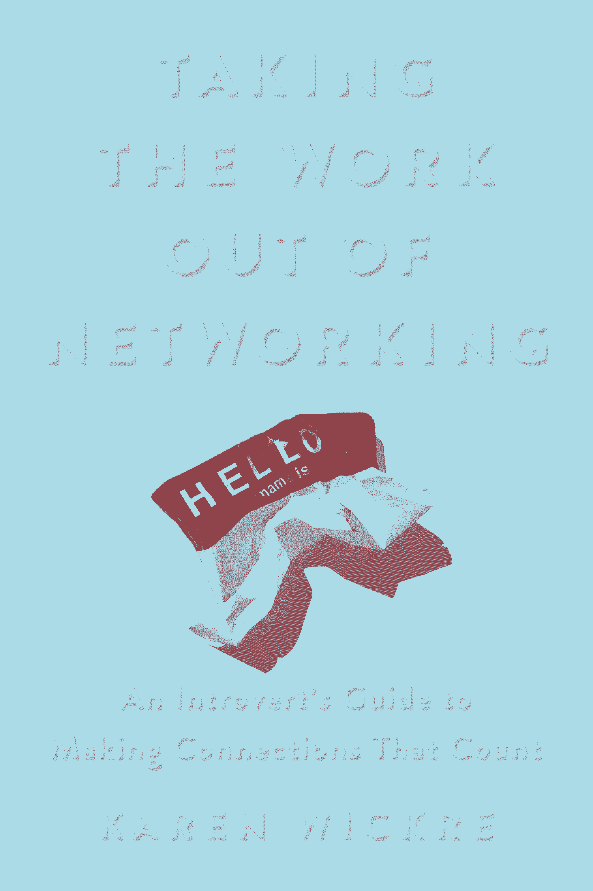

# 如何建立有价值的关系——来自硅谷资深人士(内向者)的建议

> 原文：<https://review.firstround.com/how-to-make-connections-that-count-advice-from-a-silicon-valley-veteran-and-introvert>

凯伦·威克瑞 不是新年决心的一员，她注意到这些决心很少能坚持一个月。在经历了 31 天的里程碑之后，我们大多数人可能都会同意她的观点。随着二月的流逝，我们收集了一系列错误的开始和一堆失去动力的雄心，这已经成为一种陈腐的习惯。

但在 2019 年初，Wickre 抵制了她通常的疑虑，并将目光投向了一个特定的目标。“在今年剩下的日子里，让我们与我们能帮助的人和能帮助我们的人建立重要的联系，”她向她的相当多的粉丝挑战。

作为 Twitter 的前编辑主任，她通常被描述为知道*每个人*的人，这一指控似乎并不令人惊讶——她的令人印象深刻的轨迹建立在强大的关系和松散的联系的基础上。但在她数十年的科技职业生涯中，有一些意想不到的线索:维克瑞自称内向，大器晚成，2002 年她 51 岁时加入了一家名为谷歌的初创公司。

为了揭示她是如何实现这一切的，Wickre 最近写了一本新书。在 *[把工作从人际关系网中拿出来:一个内向的人如何建立有价值的联系的指南](https://www.amazon.com/Taking-Work-Out-Networking-Connections-ebook/dp/B07CL5ZWL9 "null")* 中，她总结了在不偏离你的舒适区太远的情况下培养联系的关键经验。在翻阅了一份副本后，很明显，她的明智建议超越了战术距离，涵盖了从调整你的 LinkedIn 个人资料的细微之处到巧妙驾驭闲聊艺术的所有内容。

我们之前已经在评论中重点介绍了网络建议，从克里斯·弗拉里奇关于[变得人脉广得惊人的建议](https://firstround.com/review/how-to-become-insanely-well-connected/ "null")到迈克·斯泰伯关于[建立一个有意义的网络的见解](https://firstround.com/review/dont-just-network-build-your-meaningful-network-to-maximize-your-impact/ "null")，我们很高兴继续这一传统，展示了精选的、精心挑选的、充满策略的部分，这些部分在维克瑞的新书中脱颖而出。除了她有见地的建议，我们还加入了一些我们自己的快速笔记，以帮助设置场景，并添加了新的评论和 Wickre 本人的离别想法。对于那些正在或打算转行的人来说，请继续阅读来自硅谷最有人脉的资深人士之一的三个无压力社交策略。

# #1:内向的人，鼓起你的力量

*Wickre 指出，虽然内向的人看起来不适合社交，但事实上他们在鸡尾酒会上有很多表现。从强大的倾听和敏锐的观察技能到天生的好奇心和愿意将聚光灯照耀在他人身上，内向的人在建立有意义的联系方面有相当大的优势。下面是她书中关于充分利用这些隐藏才能的章节的预览:*

内向和观察的结合提供了一个伟大的礼物:评估人的艺术。感觉到这些品质意味着你很好地掌握了对你遇到的任何人的要求或期望——这是你继续建立人际网络的一项有用的技能。

倾听、观察、好奇——所有这些都是与人沟通的绝妙工具。事情是这样的:它们都不需要你成为众人瞩目的焦点。

这里有三个练习，可以让你对利用你的能力来帮助扩大你的人际关系网的想法有所了解。我想你会发现，人们会因为你的努力而感觉良好，你会学到一些东西，以后可以和他们或其他人一起借鉴。

**1)先提问。**

下次你和你不太了解的人(或者根本不了解的人——同事、朋友的朋友、参加会议的同事)一起喝咖啡时，让他们先告诉你他们的故事。这在电话中也很有效。你的开场白可以像这些例子一样简单:

“我们会找到我的，但首先我想听听你是如何[喜欢在 X 公司工作]或[在 X 领域或专业或成就上留下了你的印记]。”

“我还在想那个会议/演讲者。那次谈话给你留下了什么？”

尤其是如果你想在他们的公司或行业找工作，接着发出邀请，这是一个问题:“你是如何进入 X 公司的？”“你从事 Y 工作多久了？”“你喜欢 Z 职业吗？”

**发挥你的好奇心。**

好奇心是一种精神技能，无论你是否亲自见到，你都会被激发。当你与来自你感兴趣的公司或领域的人进行信息会议(包括电话或视频聊天)时，做好你的功课，最大限度地利用他们和你的时间，直奔主题。例如，在最初的客套话之后，根据你要探讨的话题来调整你的开场白:

“我想知道的是，你是怎么把猫从烟囱里弄出来的？!"(参考你在他们 Instagram feed 上看到的；打破僵局，表明你在关注他们在做什么。)

"早年在谷歌是什么样的？"(这个你是从 LinkedIn 学的。)

"你喜欢定期写作吗？"(你阅读他们的网站、时事通讯或博客。)

**做一个敏锐的观察者。**

好奇心在很大程度上是精神上的，而观察力更多的是身体上的。当你遇到一个新的人时，这种方式最有效，也最有价值。作为一个敏锐的观察者，一部分是你能在多大程度上让你的新联系人放松(通常不能保证稳固的联系)，一部分是收集你自己对他或她的感觉。你所观察到的会给你一种额外的理解他人的感觉，这可以让你的联系更加顺畅——仅仅基于他们向你展示他们是谁。

在对话中加入观察的一些方法:

“你的眼镜太棒了——你收集它们吗？”(服装可能过于个人化，以至于不能在第一次见面时就说出来，但眼镜或鞋子更值得称赞。)

"你喜欢你的手机套/电池/记事本/笔吗？"(他们放在附近的哪些配件能让你了解他们的一些情况。)

谈话中需要考虑的一些事情:

他们是局促不安、烦躁不安，还是看起来轻松自在？

它们是严格意义上的商业行为，还是透露了一些关于他们自己、他们的偏好或怪癖的信息？

你的观察能力在小组会议中也很有帮助:

有没有注意到一个总是唱反调或打断别人的人？

那个只能事后汇报的“会后会”的人？

谁总是有时间说友好的私人话语，谁没有呢？

Karen Wickre, author of Taking the Work Out of Networking

# #2:为你需要的时候做准备，避免在自动取款机上透支

“宽松接触”的习惯和健康的给予和接受是 Wickre 强大人际网络的关键。请继续阅读她书中关于如何在你需要之前培养孩子的建议集的摘录，建立每天 10 分钟的放松练习——并在你的时间周围划出界限。

没有人喜欢被重复利用的感觉，尤其是在单方面的时候。你能建立的最好的联系是那些你们有共同之处的联系:有时你们中的一个人需要一些东西，有时你们都不需要，不管怎样，你都继续付出你的时间和注意力。

你和你的关系互相帮助没有截止日期。我多年没一起工作(甚至没见过面)的人有时会突然出现，安排会面或打电话交流想法和联系方式；我也一样。在我们这个工作变动频繁的世界里，当你们中的一个人离开后，失去直接联系并不罕见。但如果你已经建立了有意义的联系，那也没关系。即使在写这本书的过程中，我也曾接触过二十年来没有共事过的人。我们的联系还在继续，这要感谢我所谓的“**松散接触**”——随着时间的推移对你的人际网络的照顾和滋养——我认为这是培育你的人际网络的黄金标准。

销售员和业务发展专家经常创造“备忘录”来提醒自己再次与客户或潜在客户联系。松散接触就像一个难题——除了它不固定在销售目标上，也不需要明确的结果。挠痒和放松的时刻都是为了灌输持续的兴趣，抓住任何可能因为这种接触而出现的机会*。*

*这是我对无压力人际关系网的指导原则:在你需要它之前培养它。*

***如何成为一个给予者(而不觉得自己是一个索取者)。***

*很久以前，我自己的松散习惯包括一个破旧的地址簿，其封面总是有一个新的便利贴，上面列有我每天要打的电话。这个列表代表了我需要完成的任务，加上一些我一直在想的人。我会打那些电话(或留言)并把它们从清单上划掉。快进到 21 世纪:今天，拿起电话是我保持联系的最后手段。*

*但是给予和索取的艺术可能是与他人联系的关键:我们如何在不需要的时候给予，在需要的时候索取。人际网络需要这两者，以及你对这两项任务的理解。*

*20 年前，我并没有打算积累大量的人脉或利用一堆人情来赚钱。我对两件事有强烈的渴望:一，与人建立有意义的联系，因为他们让我在这个世界上不那么孤独；第二，与他人分享这些联系，以获得他们需要的建议或答案。*

*所以当有人告诉我，他们没有时间去联系以帮助别人时，我总是想，*你花了多少时间去创造一点时间？*等待你的部分回报是倾听某人的故事，建立美好的联系，而不是与之擦肩而过。它的意外收获可能和其他任何东西一样有价值。连接器大师和西雅图企业家朱莉·施洛瑟说，她认为连接和分享连接“有点像捐钱。它带来了你无法真正解释的快乐。。。这就像一个宗教规则，十诫之类的东西。”我也有同感。*

*正如我经常提醒人们的那样，无论你做什么，你都拥有对他人有用的知识。也许[刘易斯·海德](https://en.wikipedia.org/wiki/Lewis_Hyde "null")在 *[中的开场白《礼物](https://www.amazon.com/Gift-Creativity-Artist-Modern-World/dp/0307279502 "null")* 说得最好:“**善有回报**”*

*采取类似的方式是一门艺术:**当我们需要建议或介绍时，我们常常希望一个简单的接触点就能解决我们的问题**。但是很少有完美的答案在如此简单的一步中来到我们面前。即使你的介绍不成功，或者你得到的指导不准确，简单地对发生的任何事情保持开放的态度似乎有点太超凡脱俗了。永远准备好迎接惊喜是一种伟大的品质。但是我实际的自我，可能也是你的自我，明白我们必须准备好在这个过程中索取和给予。但是最重要的是要能够超越眼前的结果，不要因为尝试而感到内疚。继续努力。*

*如果你把你的人脉当成一种你经常用来取款的个人自动取款机，你很快就会失望(并透支)。*

*关键是每天练习一点——在你不需要特别帮助的时候练习。有了松散的联系，你会不时地接触到你的关系，也接触到新的熟人，而没有任何正式的义务去跟进或亲自去见对方。如果你在不感到需要的时候习惯性地这样做，你会开始把自己视为一个给予者，而不是索取者。*

*以下是你能给予和能接受的快速分类:*

*给予:*

*具体地表扬，而不仅仅是通过喜欢或真心*

*LinkedIn 对他人的推荐*

*主动提出评论演示文稿或写作*

*拿走:*

*优雅地接受赞美(不要轻视它们)*

*提供支持时给予支持*

*你可以从中学习的有意义的反馈*

*尝试一下，从每天花 10 分钟建立你的自由接触习惯开始。这是很小的努力，却可能有很大的回报，即使没有立竿见影的效果，也有很好的感觉。无论你是需要的给予者还是接受者，你都会获得满足感。以下是我如何适应我的一天:*

***把它作为早晨的热身。我早上查看邮件和新闻的习惯是为工作日做准备的一种方式。当我浏览标题时，我会分享一两个故事，我知道那些我没有联系过的人会感兴趣，并附上一个简短的说明:“这让我想起了你。你有什么看法？你好吗？”***

***保持一个连续的待办事项清单。保持联系的一部分就是简单地跟踪你遇到的人。在你的谈话或会议之后，想想你想传递什么，以及你想联系谁。把它们加到你的清单上，然后获得完成任务的满足感。***

*怀着感激之情结束这一天。给你喜欢的人或你想结识的人发几张“想念你”的便条，或者甚至和你刚认识的人开始一段新的对话。这是播下联系种子的好方法，也许第二天就能得到回应*

***为自己的时间划定界限。***

*但是，虽然与许多人保持联系比以往任何时候都容易，但负面影响可能是邀请和问题的扩散以及你不想要的咖啡约会。毕竟，保持松散联系的全部意义在于它不是一个负担。你最终承担的义务越多，你就越没有机会保持宽松，或者保持宽松。*

*举例来说，我曾经遇到过一些熟人，他们渴望加入谷歌，约我一起喝杯咖啡，聊聊这家公司。虽然我很想帮忙，但自从我离开后，已经有近 4 万人加入了。我的信息不是最新的，所以通常我不愿意参加会议。相反，我依赖于一个界限:我会发一封电子邮件，附上几段关于我的总体印象的文字，也许还包括一篇相关的近期文章，并以真诚的“祝你好运”作为结束语*

***留意“向你请教”的请求***

****作者笔记:*** *自这本书出版以来，我收到了一些读者的来信，他们普遍喜欢帮助别人，但不喜欢“我能向你请教一下吗？”这种有时随意或不专注的性质请求。以下是一些解决方法。**

*尽管我很喜欢帮助人们寻求帮助，但不可避免的是，有些人并没有明确的目标，他们更想谈论工作，或者希望你在你有影响力的朋友面前为他们美言几句，以防有事发生。如果你已经这样做了(而且做得太频繁了，你可能会经历很多被拒绝的邀请)，记住人们的时间和注意力是宝贵的资产——也是你的——所以不要轻易提出“征求你的意见”的请求。*

*真正需要知道的可能更好的框架不是一次会议，甚至不是一个电话，而是一个问题:“你建议我读什么，哪个会议最能解决这个问题，除了你之外，谁是值得关注的专家？”这给了你请求中太忙的目标一个相对容易的方法来帮助他们，而不需要强迫他们太多。*

*另一个考虑:问之前先谷歌一下。如果你向不认识的人提出的问题是要让他们解释多样性和包容性，或者听到你绝妙的创业想法，如果你能证明你已经做了功课，你更有可能赢得某种回应。*

**

# *#3:依靠这些电子邮件模板来做介绍、推荐和参考信息*

**让我们回到威克瑞的书中。电子邮件是与他人直接联系的基石。但正如 Wickre 所观察到的，有一种艺术——和一点公式——来制作笔记，使联系变得有意义。在这里，她钻研自己的“已发送”文件夹，找出自己的介绍模板，寻求帮助，并通过快速参考信息保持联系。**

***通过有效的介绍建立联系。***

*为了获得一个流畅的、有效的人际网络，我们需要无止境的介绍。*

*我每周都会写一些这样的笔记，通常我很幸运地得到了肯定的回答。以下是初步记录，用于查看您的联系人是否愿意接受介绍:*

*主题行:你好和介绍*

**你好 ________(仅限被提问者)，很高兴上个月在 XYZ 会议上见到你，虽然太快了。我希望我们有更多的时间去参观。(或者:我们已经很久没有叙旧了。我想听听你的最新消息。)**

*除了问好之外，我还想问你是否愿意和我的朋友 _ _ _ _ _ _ _ _ _ 谈谈。她是一个 ______________(职业或角色)的人，她希望 _____(见面、写信、打电话、听你说)你，因为她正在探索 ___________(一个新的职位、新的公司、新的城市、学校)，当然你会立即想到她(因为你的知识/关系/特定关系)。她是 _____(风趣、独特、聪明、机灵、热情、适合你的公司。。。)我想你会喜欢和她聊天的。*

**如果你告诉我可以做介绍，我会跟进。但是如果你不能，或者来得不是时候，我理解。如果是这样的话，你能推荐其他人和她说话吗？**

*预先感谢——我真的很感激。*

*这张便条做了几件事:*

*在开场白中用一点真诚的闲聊来重新建立你与被提问者的联系，并发出你知道或者想知道他们在做什么的信号。第一个重点是你的联系人，而不是你的要求。*

*提供考虑此介绍的具体原因和背景。*

*为提问的人担保。(如果不能担保，就不要问了。为你自己挽回一些名誉损失。)*

*清楚地表明，没有被要求者的事先同意，什么都不会发生。*

*给对方一个保全面子的机会，把你介绍给更适合或更有空的人。*

*一旦你得到了绿灯，这里有一个例子说明连接 askee 和 asker。*

**主题行:介绍【Askee】和【Asker】**

**抄送:[Asker]**

**又见面了【被邀请人姓名】，**

**非常感谢您同意在此联系【Asker】，抄送:d。正如我提到的，他有兴趣在大公司谋得一个职位，我告诉他你是最好的资源。此外，他和你一样对单口喜剧感兴趣，这会让你们的谈话更加愉快。**

**再次感谢，_____________**

*当你被要求做介绍时，总是倾向于是的。在某些时候你自己也会需要它们。*

***人情清单和构建人情的技巧。***

*帮忙需要的不仅仅是通过简单的交流把一个人交给另一个人。它们更具体，通常有一个截止日期，如果你在联系的话，甚至可能会有一些跟进。帮忙可以是很多事情，比如:*

*要求采访(媒体、研究、信息)*

*寻求学校或工作的推荐*

*支持非营利事业(参加活动、捐赠、传播信息)*

*认可提问者(例如，提名或投票给演讲者、活动或委员会)*

*提议或推荐客户业务或独家活动的联系人*

*虽然我们都喜欢尽可能地帮助别人，但有时要答应别人的请求并不容易。使用此清单来考虑你想要采取哪些行动:*

*你对被提问者有多了解。如果你害怕问，也许答案是“不够好”，你应该建议另一条路线。最近，我遇到了一位前同事，他想要见一位我知之甚少的知名风险投资家。我告诉我的朋友，他最好去问另一个我们共同认识的人，他比我更了解风投。*

***理解提问者想要什么。**你应该有足够的信息和背景来判断这是否是你不介意做的合理要求。如果被问者想谈论某个领域的机会，或者某个特定的工作，确保获得足够的背景信息，这样请求就不仅仅是“你们两个应该见个面”(这会让被问者生气)。例如，解释“Joe 正在寻找他的下一个机会，他对贵公司处理客户服务的方式很感兴趣”或“Monique 告诉我她非常喜欢您最近关于本地企业数字营销的报告，她希望在她的硕士论文中与您进一步讨论。”*

***确保请求是合理的开放式的。**突然要求一个急转弯不是一个让你请求帮助的人喜欢你的好方法。确保有一个合理的时间，或者这是一个永恒的要求，这样你就不会被认为是苛刻的(或粗鲁的)。*

*你对这个人(和他们的工作)足够了解，能够真正推荐他们去工作、董事会席位或其他专业岗位吗？如果没有，直截了当地说出来，并带着歉意解释道:“我很想帮忙，但我对你的工作不是很了解。”如果你愿意提供一些更少的东西，试试“我可以这样做:给 X 发一封信，附上一个总体上积极的认可，说明我不熟悉你的工作，但我喜欢你。”*

***有人找你介绍真正的 VIP 吗？LinkedIn 倾向于让我们相信，我们离宇宙之王只有一步之遥。鉴于我们在谷歌的这些年，我想埃里克·施密特会一眼认出我，但我不认为我们是朋友，也不会伸出手来玷污我的名声。***

***是不是人情离你太远了？**可能是一位热切的家长要求你帮助他们的孩子获得宝贵的实习机会或奖学金，或者是你同事的表弟(你从未见过他)真的想和你公司的招聘经理打成一片。这是说“对不起，我帮不上忙”的时候了。*

*一旦你决定扣动扳机，下面是一张求情的纸条。我把这封信发给了我每隔几年都会见到的专业联系人；她将在我的一个朋友计划参加的研讨会上发言。*

*主题:当你 3 月 23 日在华盛顿时，请帮忙(主题行表示你的具体时间要求。)*

**海伦，我希望这些天你能随心所欲地旅行——尽管我肯定还是很多！至于我，我现在也在做咨询。我喜欢保持自己的时间表，喜欢各种各样的项目。我打赌你能理解。**

**我写信是因为我的好朋友和前同事丽贝卡·杰普森想见见你，你将于 3 月 23 日在华盛顿记者俱乐部发表演讲。在获得分析学硕士学位后，她现在正在她的团队(全球约 250 人)中创建一个新的测量项目。**

*我可以提前介绍你们认识吗？这样你们可以在演讲后聊几分钟。她很讨人喜欢。*

**提前感谢，_ _ _ _ _ _ _ _ _ _ _ _ _ _ _ _ _ _**

***没有议程的时候，用这五条信息打招呼。***

*这类邮件有很多用途:你可以用它来保持联系，重新联系某人，联系新的熟人。“仅供参考”信息的好处是，任何一方都没有真正的义务，你是收件人的首选(这有助于巩固你们正在进行的关系)。*

*除了链接或附件，你的信息基本上是这样的:这证实了我们所谈论的；我想知道你的反应是什么；读到这里让我想起了你。以下是五种“仅供参考”的笔记，可添加到您的轮值表中:*

***1。给面试你但你没有得到的工作的人发一篇相关的文章。即使没有成功，你也喜欢你遇到的那个人，并想保持联系。显示出你是一个优秀的运动员，仍然关注公司和行业。(不要重温求职面试就好。)***

***2。** **带着刚刚公布的今年会议议程，向你去年在一次会议上认识的人问好，询问他们是否会出席。***

***3。和以前的同事分享你以前公司的趣闻。**以前的同事有时是最好的弱关系——你可能不太了解他们，但有一种血缘关系的感觉。一张简单的纸条，询问他们在做什么，并附上一个故事，可以保持联系，甚至加强联系。*

***4。** **通过向他们发送与他们兴趣相关的信息(新闻、事件、评论),显示你对他们薄弱关系的关注。对于你不太熟悉的人来说，这会给你带来片刻的喜悦和感激。你发送的是基于你所知道的:他们是在会议上发言，做研究，对一个项目充满热情，关注一个新兴趋势？***

***5。通过跟进相关信息来巩固你刚刚建立的联系。**如果你刚刚遇到某人，并谈论了手机的使用，发送你在上面发现的新闻故事，并附上简短的说明(“这让我想起了我们的对话”)。*

*这里有一个例子，是我最近发给自动驾驶汽车领域一位友好的专业联系人的一封无义务的“仅供参考”的短信。我在看到一条关于即将举行的关于这个主题的研讨会的推文后想到了他。*

*主题:你知道这个会议吗？(主题行应该挑逗你发送的信息，而不是泛泛的“嗨”。)*

*嗨，吉米，我希望你在这些快乐的时光里一切都好。只是偶然看到这个【链接】就想到了你。*

**周一快乐，**

*凯伦*

*即使这封短信也能完成很多任务:*

*“欢乐时光”是指关于自动驾驶汽车的新闻激增，有时是古怪的，消极的，或不准确的。这一提及传达了对吉米所处理的事情的一点同情。*

*如果你包含一个信息链接，你就不必解释太多。在这种情况下，这是一个即将举行的研讨会的主页，该研讨会是为研究自动驾驶汽车相关问题的政策制定者举办的。请注意，它是活动本身的网站，而不是关于活动的新闻报道——前者更有用、更直接。*

*就连结束语“周一快乐”也是这样说的:“我不想从你那里得到任何东西。用这些信息做你喜欢的事情。”*

*与人建立真诚联系的所有事情，尤其是出于商业和专业原因，都需要用到我们在学校里学不到的东西，但我们应该在生活中了解这些东西:同理心、直觉、慷慨、设限。当我写这本书的时候，最让我吃惊的是看到有多少人没有把他们现实世界的价值观和他们自己的生活经验应用到建立新的联系上。我看到许多人把这种可怕的“网络”概念视为一种外来活动，而不是他们自己希望被对待的方式的延伸。(成年的所有岁月其实都是围绕黄金法则吗？似乎是这样。)*

*如果你还没有准备好一头扎进网络建设的事业，这里有一个建议:试着和你已经认识的四五个人重新联系(你喜欢在你的上一家公司一起工作；你现在利用他们的工作或想法；你们一起经历了公司剧)。咖啡也好，视频聊天也好，甚至打个电话也好。我知道内向的人——事实上，每个讨厌社交的人——可能都想避免这种无足轻重的接触。但我总是发现回报远远大于任何负面影响。我离开时精力充沛，有新的想法，并对联系的简单力量有了新的认识。*

*海伦娜·普莱斯拍摄的凯伦·威克丽的照片。图片由 Pogonici / iStock / Getty Images 提供。*