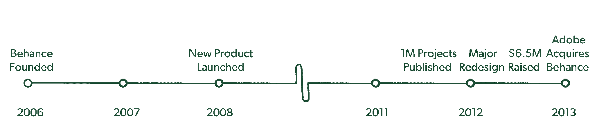
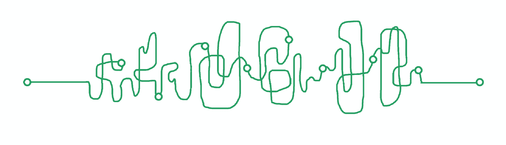
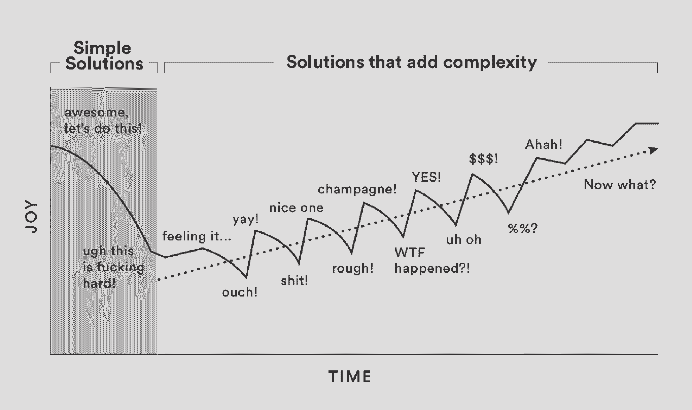
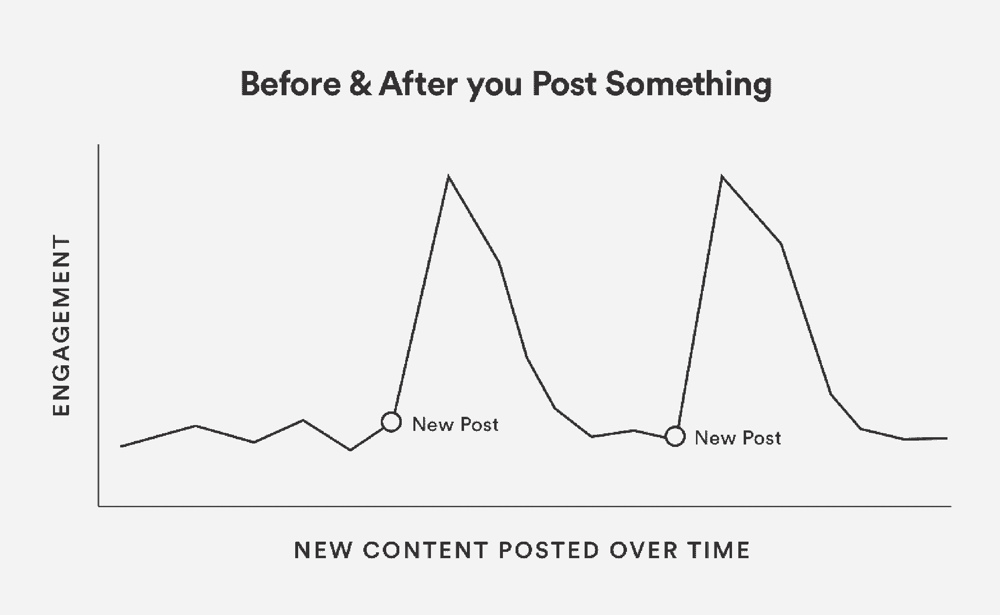

# 如何在创业公司的混乱中塑造卓越的产品

> 原文：<https://review.firstround.com/how-to-shape-remarkable-products-in-the-messy-middle-of-building-startups>

在 Techcrunch 上对社交投资平台 [Behance](https://www.behance.net/ "null") 进行[快速搜索](https://techcrunch.com/search/behance "null")会返回预期结果(其筹资和收购)以及一些里程碑事件(一款新产品、一项重大重新设计及其第 100 万个发布的项目)。但是把这些报道放在一个时间线上，一个趋势出现了:Behance 的中年时期很大程度上被排除在头条之外——报道集中在它的开始和结束。

与 Behance 创始人斯科特贝尔斯基交谈，故事就不同了。中间几年是最复杂的，也是最具创新性的。对该公司来说，他们是最值得注意的——即使不是最有新闻价值的——在定位行为的增长和规模方面。该公司的时间表感觉不像是一个事件的展开。事实上，对贝尔斯基来说，这更准确地反映了 Behance 的发展，以及任何技术公司在这方面的发展:

除了创办 Behance，贝尔斯基还从多个角度生活和研究过科技初创公司——作为顾问(优步、Pinterest、 [sweetgreen](https://www.sweetgreen.com/ "null") )、作者( *[让想法发生](https://www.amazon.com/dp/B003NX75W2/ref=dp-kindle-redirect?_encoding=UTF8&btkr=1 "null")* )、投资者(基准测试者)和 **[Adobe](https://www.adobe.com/ "null")** 的首席产品官——他观察到，初创公司旅程中最关键的部分是最少被讨论和误解的部分:中间部分。我们倾向于赞美努力的第一英里和最后一英里，这不利于终点之间的道路:创业成败的部分。

今天，贝尔斯基发布了他的新书 *[《凌乱的中间](https://www.amazon.com/gp/product/0735218072/ref=dbs_a_def_rwt_bibl_vppi_i0 "null")* 》，在书中，他深入探讨了开始和结束之间的不稳定时期，讲述了创始人和领导者如何忍受和优化他们的团队、产品和自己，以生存和超越。他涵盖了广泛的话题，从构建团队(“如果你避开两极分化的人，你就会避免大胆的结果”)到文化和工具(“除了床、椅子、空间和团队之外，一切都要节俭”)到锚定你的客户(“热情之前的同情和谦逊”)。

**随着** ***凌乱的中间部分*** **的热卖，我们很高兴地呈现贝尔斯基对他的“优化产品”章节的介绍，以及关于简化和迭代产品的三个充满策略的部分。请继续阅读贝尔斯基的新思维和持久建议，他是你在构建产品、团队和公司方面最具洞察力的头脑之一。**

# 优化产品

在我们开始之前有一个简短的说明。下一部分是关于优化你的产品。构建和不断迭代产品或服务的旅程本身就是一个领域，充满了设计、产品管理、客户研究和心理学方面的最佳实践。我把这一节当作书中的一本书，认识到一些深入构建产品过程的读者可能会直接跳到这一节，而其他人则完全跳过。不管你的工作是什么性质，这些原则展示了如何在中间制造出非凡的产品。好吧，我们来谈谈产品。

创业初期的蜜月期不仅因其无限的能量而闻名，也因其异常的清晰而闻名。在您旅程的开始，简单的解决方案来得很容易。但是随着中间变得不稳定和更有问题，我们有增加复杂性的趋势。我们通过给我们的作品增加更多的选择、更多的功能和更多的细微差别来解决问题。

虽然新产品的简单性是一种竞争优势，但它会随着时间的推移而演变并变得更加复杂。不幸的结果是我所称的“产品生命周期”，它适用于你正在创造的任何类型的服务或体验，你的“产品”

**产品生命周期**

1.顾客们涌向一种简单的产品。

2.该产品增加了新功能，以更好地服务客户和发展业务。

3.产品变得复杂。

4.顾客涌向另一种简单的产品。

简单就是黏人。很难让一个产品或者任何客户体验变得简单。保持简单就更难了。一个产品越是显而易见和直观，就越难在不增加复杂性的情况下对其进行优化。

成功地优化你的产品，无论它是什么，都意味着让它更强大，更容易获得。取得这种平衡的关键是基于简单的信念做出决定，绝对最简单的存在，生命只是时间和你如何使用它。

你生活中的每一个产品或服务要么帮助你花费时间，要么节省时间。你观看的新闻频道或节目，你使用的脸书和 Snapchat 等社交应用，你阅读的书籍和你玩的游戏都在争夺你如何度过时间。其他产品，如优步(更快地获得汽车)，Slack(更快地与你的团队沟通)，以及亚马逊的 Alexa(更快地买东西)，都是为了帮助你节省时间。不仅仅是数字企业:像面包店和餐馆这样出售预制食品的企业也属于这一类。唯一的例外是像 Twitter(一种更快地消费更多信息的方式)或 Blue 围裙(一种更快地在家做饭的方式)这样的罕见产品，它们给你的盘子增加了一个耗时的动作，同时也使这种体验比通常情况下更快。

事实是，我们一直在和时间做斗争，无论是节约时间还是花费时间。我们强烈地意识到并保护我们的时间。我们唯一不关注时间的时候是当我们天生的人类倾向——比如想要看起来漂亮，满足好奇心，或者被别人认可——让我们忘记了时间。

人类的自然倾向是以时间为阴阳魔界。当你在开发产品时考虑到这些倾向，你就赢得了客户的时间。

当我反思这些年来给我的生活带来最大改善的新产品时，它们最终消除了一个日常摩擦。我手机上的应用程序，比如谷歌地图，把这个城市带到了我的指尖，并帮助我确保我再也不会迷路了。像优步这样的产品消除了安排运输或寻找出租车的负担。几十年前，像联邦快递和 UPS 这样的公司使人们能够通过填写一张简单的表格将东西运送到世界上的任何地方，而不是与多家承运商打交道。纵观历史，许多最优秀的企业都在寻找并消除摩擦，以节省人们的时间。

优化你正在制造的产品最终是让它更人性化，更符合人类的自然倾向。前面的见解旨在微调你的产品逻辑。你如何改善客户对你产品的第一英里体验？面对新的挑战和适应新类型的客户，您如何保持简单性？你如何让你的产品越来越相关和吸引人？您如何不断优化您的产品和营销，以更好地满足客户的需求？

优化产品体验本身就是一个研究领域。尽管接下来关于优化产品的两个部分偏向于数字产品，但我相信这些见解适用于所有类型的产品、服务和体验。

为你的产品感到自豪，但不要以看不到它的问题为代价。一旦你的产品停止发展，你就输了。你一满足，就变得自满。永远不要真正满足:当你在创作时，你的产品的当前版本应该总是让人感觉索然无味。

在很多方面，你产品的状态就是你团队状态的一面镜子。

当您的客户体验到您创造的东西时，我们谈到的所有关于持续中里程和优化您的团队表现的内容就会浮出水面。追求一个伟大的产品需要纪律，无止境的迭代，以及将你的目标与你的客户的挣扎和心理联系起来。

# 永远不要停止打造你产品体验的第一英里。

无论你是在制造产品、创作艺术还是写书，你都需要记住，你的顾客或赞助人在与你的作品互动的第一次体验中会做出全面的判断——尤其是在最初的三十秒内。我称之为“第一英里”，这是一个产品中最关键但服务不足的部分。

你只有一次机会留下第一印象。在一个快速发展和推出最小可行产品的世界里，用户体验的第一英里几乎总是事后才想到的。对于实体产品来说，可以是包装、说明书的措辞以及帮助新客户定位的标签。对于数字产品，可能是入职流程、说明性文本和产品的默认设置。当我们花了这么多时间专注于让锁着的门背后的东西变得如此辉煌时，我们有时会忘记给用户钥匙。

第一英里的失败会让一个新产品从一开始就陷入瘫痪。你可能会得到大量的下载、预售或注册，但很少有客户会通过入职流程开始实际使用你的产品。即使他们做到了，你的客户也需要很快感受到成功。你需要让你的观众知道三件事:

他们为什么在那里

他们能完成什么

下一步做什么

例如，考虑像 Adobe XD 这样的产品，Adobe XD 是 Adobe 最新和发展最快的体验设计师平台之一(设计各种界面、网站、移动应用程序和任何其他美化屏幕或帮助人们导航体验的人)。当你第一次打开产品时，你应该知道你为什么在那里(设计你有想法的很酷的应用程序)，你可以完成什么(你可以设计的大量体验，以示例和开始的方式列表为代表)，以及下一步该做什么(你的下一步应该是什么，以及你必须采取的成功步骤的顺序总是很清楚)。

一旦新用户知道了这三点，他们就已经在你的产品体验中达到了愿意投入时间和精力与你的产品建立关系的地步。他们不需要一开始就知道如何使用你的整个产品——他们只需要信任你，知道他们的下一步是什么。

我所知道的关于第一英里产品体验的大部分知识，都是在构建 büHance 的产品以及与其他创业公司合作的过程中艰难地学到的。在 Bēhance 的最早版本中，我们在注册过程中有很多步骤和问题。例如，我们要求新成员选择他们最喜欢的三个创意领域，如摄影、新闻摄影或插图。有很多选项，新用户平均需要 120 秒来浏览列表并选择他们最喜欢的字段。知道谁是我们的用户以及用户立即连接到社区对我们双方都很有帮助，但是在注册过程的这个特定步骤中，我们失去了超过 10%的新成员。我们决定删除它，并决心在第一英里后的某个时候，一旦新的 büHance 用户积极使用该产品并愿意给我们带来好处，我们就获取这些信息。我们还减少或完全取消了其他步骤。结果，注册人数上升了大约 14%。

减少和迭代最初一英里的体验对增长的影响比那一年的任何其他新功能都大。

多年来，我与数十家其他公司合作，试图优化他们的客户体验的第一英里——无论是 Pinterest 欢迎新用户的第一个版本，旨在最大限度地增加每个用户关注的“图钉板”数量，优步在首次推出时向新用户描述自己的方式，sweetgreen 订购沙拉的移动应用程序，Periscope 的直播应用程序， 或者 Adobe 的移动创意应用程序——每个产品都面临着同样的挑战:用尽可能少的步骤、语言和时间帮助客户理解他们为什么在那里、他们能完成什么以及下一步做什么。

成熟的产品也不能避免这个问题。以 Twitter 为例，这个产品吸引了数百万人，但却难以优化第一英里。对于一部分用户——可能是前 1.5 亿左右——需要新用户选择要关注的账户的入职体验就足够了。然而，在某个时候，Twitter 遇到了一批新的客户，他们没有耐心或意愿管理自己的订阅。他们只是想要新闻，Twitter 的第一英里体验比打开电视或访问网站要困难得多。即使他们的核心产品有所改进，Twitter 也很难获得新用户来建立与该产品的关系——结果增长停滞。

尤其是对新公司来说，这些最初参与的关键部分通常是在产品发布时匆忙解决的。用你的产品吸引新人的“漏斗顶端”是你最终的增长源，然而产品体验的早期方面，如为你的产品设计一个“旅程”和确定默认体验应该是什么，都是太经常的事后想法。在一些团队中，我甚至看到这些部分被外包或委托给一个人自己解决。

更糟糕的是，产品体验的第一英里随着时间的推移越来越被忽视，尽管随着时间的推移变得越来越重要。随着你的产品超越早期采用者，第一英里将需要更加简单，并考虑到完全不同的“最新用户”群体，而不仅仅是你最初希望吸引的超级用户。随着时间的推移，新客户并不相同；如果是的话，你会在第一轮就把他们拿下。因此，第一英里需要在启动后持续仔细检查。仅仅因为你现在很好地适应了新用户，并不意味着同样的方法在将来你吸引更广泛和不同的受众时也会起作用。如果不经常重新考虑你对新用户需求的假设，你将无法适应那些将你的产品带入主流的人群。随着产品跨越人口统计、世代和国籍，你的第一英里将需要改变。

客户使用产品体验的第一英里不能成为你构建产品体验的最后一英里。

对于任何具有积极增长愿望的产品，我认为**超过 30%的精力应该分配给产品的第一英里**——即使你已经开始了你的旅程。对于新用户来说，它是你的漏斗的最顶端，因此它需要是你产品中最深思熟虑的部分之一，而不是事后的想法。

# 针对懒惰，虚荣，自私，优化前 30 秒。

在第一英里内，冲刺的前 30 秒决定了人们是否会坚持跑完全程。在每一次新体验的前 30 秒，人们都是懒惰、虚荣和自私的。这并不是对人性的嘲讽。这是构建在线和离线的伟大产品和体验的重要见解。令人羞愧的是，你遇到的每个人——以及每个访问你的网站或使用你的产品的人——在他们准备好努力去关心之前，都有着完全不同的心态。

从某种意义上说，我们懒惰是因为我们不想投入时间和精力去解开和理解某些东西是什么。我们没有耐心看说明书。没时间偏离了。没有学习的意愿。生活有如此陡峭的学习曲线，因为很少有足够的时间工作、娱乐、学习和恋爱。所以，当全新的事物需要太多的努力时，我们就让它过去。我们的默认做法是，在确信有好处之前，避免那些需要花费精力的事情。

我们自负是因为我们在乎如何给别人留下印象，至少最初是这样。镜子、护发产品和社交媒体都为我们在他人面前的形象提供了快速的自信回归。出于这个原因，像 Instagram 和 Twitter 这样的产品可以让你尽快获得喜欢和朋友；如果没有人与你分享，没有人想开始使用一个新产品。虽然你在 Instagram 等产品上的大部分时间可能都花在浏览朋友的内容上，但如果你注意自己使用该产品的行为，你会发现在发布新图片后，你会更频繁地立即打开该应用程序。

你想知道人们对你的内容有什么看法，你会继续检查。Instagram 的活动订阅是我称之为“自我分析”的一个例子；它向你展示人们在说什么，并在冒险发表或分享你自己的创作后打击你的自我。其他应用程序也是如此，画廊开幕、新闻报道和新书发布也是如此。如果有机会，我们都会本能地去听别人对我们的评价。

对于产品设计师来说，自我分析是保持用户贡献和参与的关键机制。创意应用更多的是看谁看了你的内容，而不是看别人的内容，这一事实很能说明问题。我们没有打开我们的窗口去浏览和发现世界的创造，而是执着于我们自己的表现。我们的虚荣心习惯性地从任何创造机会中吸取重力。

当然，我们越了解我们的朋友和所爱的人，我们就越不会对他们评头论足，也越不会对他们摆出姿态——但是在他们了解你之前，你会希望自己看起来很好。这些自我分析是一种非常强大的参与形式，因为虚荣心主宰了前 30 秒。

**我们自私是因为我们也必须关心自己。当你接触一种产品或服务时，你希望立即得到超过你最初投资的回报。指导手册、费力的拆包、冗长的注册流程以及其他阻碍从约定中快速获得回报的摩擦点正在疏远。新客户需要快速的东西，不管他们以后会得到什么。**

这种懒惰-虚荣-自私的原则对于各种产品体验都是成立的，线上和线下。

在前 15 秒，你的访客是懒惰的，因为他们没有多余的时间去投资他们不知道的东西。他们是自负的，因为当他们参与你的产品或服务时，他们想从一开始就看起来很好。他们很自私，尽管你的产品代表了大的潜力和目的，但他们想知道它将如何立即使他们受益。

因此，我们周围的每一个新的关系和资源都处于不利地位。只有当我们摆脱了伴随任何新体验而来的最初的懒惰、虚荣和自私时，才会对任何新事物产生有意义的参与。你的工作是找到一种方法来超越每一种新体验的表面，找到它的意义，并向用户表达出来。

让我们度过最初 30 秒的是钩子。不要认为你不需要钩子。没有人是。最重要的是，不要认为你的潜在客户不需要鱼钩。当你看到一个提示“在几秒钟内注册来组织你的生活”，这是一个钩子。报纸的标题很吸引人。书籍封面，以及他们诸如实现“每周 4 小时工作制”的崇高承诺，都是诱饵。交友网站都是鱼钩。

有效的挂钩吸引的是与长期承诺相联系的短期利益。

购买图书时考虑您的流程。不管它写得多么好，多么有趣，它不过是数百页白纸黑字的东西——无论是数字的还是实体的。在这种情况下，挂钩通常是封面和标题。封面弥补了懒惰，因为它描绘了一幅美丽的画面，可能会迫使你伸出手去拿起它。你的虚荣心可能会被这样的前景所打击:通过阅读别人谈论的东西，你会显得更聪明或更熟悉时代精神。标题和副标题通过对你和你自身利益的承诺来迎合你的自私。

或者考虑零售。如果你经营一家商店，你陈列在橱窗里的东西决定了潜在顾客是否会走进来。装饰橱窗的科学与店内销售和产品质量完全不同——但如果你不能先进门，没人会感觉到你床单的线数或陶瓷厨具的光滑度。

你的挑战是为两种不同的心态创造产品体验，一种是为你的潜在客户，另一种是为你的现有客户。最初，如果你想让你的潜在客户参与进来，就认为他们懒惰、虚荣、自私。然后，对于熬过前 30 秒并真正走进门的客户，建立一种有意义的体验和持续一生的关系。

# 执行>显示>解释

当把一个新产品推向市场时，你会忍不住解释它是什么以及它是如何工作的。这种尝试通常会产生大量的文本、操作视频和多序列数字“旅行”,解释产品的用途以及如何充分利用它。对于非数字化的产品和服务，解释的形式是冗长的说明书、餐馆冗长的菜单和新客户冗长的入职会议。

如果你觉得有必要解释如何使用你的产品，而不是让新客户自己跳进去感受成功，你要么没有设计出足够的第一英里体验，要么你的产品太复杂。

不得不解释你的产品是吸引新用户的最低效的方式。当我加入 Adobe 并了解到潜在客户每年下载数百万份 Photoshop，打开一次，然后就再也没有打开过时，这种认识就深深地打动了我。这比你想象的要经常发生。一个新的 Photoshop 文档是一张空白页，大多数人不知道下一步该做什么。没有入职步骤，也没有可供选择的模板。在 YouTube 或谷歌上快速搜索“Photoshop ”,会出现成千上万的教学视频，试图教人们如何使用该产品，这些视频强调了在客户可以使用该产品之前需要进行多少解释。有大量的教程、操作视频和书籍来帮助潜在的 Photoshop 用户浏览产品。Photoshop 是一个令人望而生畏的产品，没有考虑到第一英里。

从那以后的几年里，Photoshop 团队开始设计新的入职体验，比如欢迎页面和启动创意项目的提示。但是这些展示如何使用产品的尝试不足以帮助新客户在投入时间和精力学习如何使用产品的大量功能之前取得一定程度的成功。

用户体验的第一公里中绝对最好的钩子就是主动为你的客户做事。

一旦你让他们感到成功和自豪，你的客户就会更深入地参与进来，并花时间去学习和释放你所创造的更大的潜力。对于 Paperless Post(一种创建和发送数字派对邀请函和生日贺卡的在线工具)等数字应用来说，这意味着向客户提供可供选择和编辑的模板，而不是解释如何从头开始创建数字贺卡。对于 Instagram 或谷歌和苹果的照片产品等照片编辑应用程序，这意味着提供智能滤镜，将一系列效果一次性应用于图像，而不是强迫客户学习如何使用不同的工具来获得对比度、亮度和清晰度。在大多数情况下，完全个性化是可用的，但这不是第一选择。

同样的道理也适用于实体产品和店内体验。在教育客户应该购买哪些产品时，我与之合作的另一家公司，运动服装公司 [Outdoor Voices](https://www.outdoorvoices.com/ "null") ，推出了“套件”来帮助他们的用户节省时间，而且这样做很时髦。套件本质上是一组预先选择的匹配项目，可以帮助新客户获得基本信息，而不必浏览多个产品类别并熟悉新术语。顾客会觉得他们获得了一种简单、个性化的购物体验——该品牌也从一次为他们提供全套服务中受益——他们可能会比平时多买一点。

你不能指望新顾客忍受解释。你甚至不能指望顾客耐心地看着你向他们展示如何使用你的产品。你吸引他们的最好机会是为他们做这件事——至少一开始是这样。只有在你的客户感到成功后，他们才会充分参与，挖掘你产品的全部潜力。

*斯科特·贝尔斯基的书* *[【凌乱的中间:找到任何大胆冒险中最难也是最关键的部分】于 2018 年 10 月 2 日出版。](https://www.amazon.com/gp/product/0735218072/ref=dbs_a_def_rwt_bibl_vppi_i0 "null")*

*图片由 Amith Nag 摄影/ Moment / Getty Images 提供。*