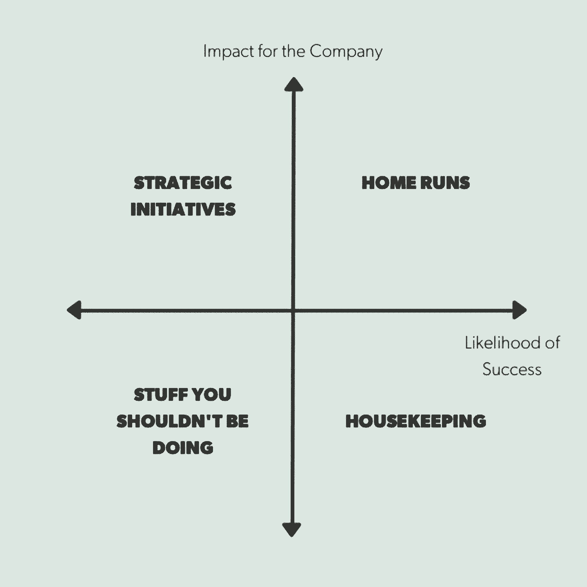
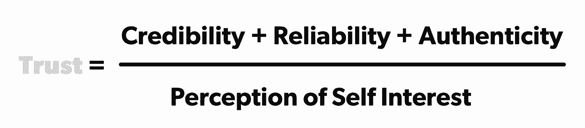

# 如何将个人发展放在次要位置——提升的战术框架

> 原文：<https://review.firstround.com/how-to-take-personal-development-off-the-backburner-tactical-frameworks-for-leveling-up>

我们一直认为，建立更好的团队和公司要从自我做起。但是对于创始人和创业领导者来说，为自我工作腾出时间通常是最后一项——尤其是现在。在一个与外部世界的互动急剧减少的时代，人们很自然地会感到越来越不受束缚，并被所有的不确定性所淹没。

我们在最近几篇评论中注意到的一个主题是，通过留出批判性反思的时间来抵制这些感觉是很重要的。无论是介绍情绪健康的概念，领导员工度过危机的经理指南，还是我们最近关于建立一种在工作中可以真正做自己的脆弱文化的文章，我们一次又一次地发现了挖掘内心力量和韧性的重要性。这项工作取决于一个决心，那就是深刻反省你去过哪里，你要去哪里，你如何寻求自我完善，即使是在暴风雨的天气中。

但很难确切知道如何着手这项至关重要的工作。通常，个人发展和自我完善被归入“自我保健”的范畴但是我们认为这里有一个重要的区别。我们喜欢把自我保健看作是利用健康习惯的实践，这可以提高你的生产力，给你一个竞争优势。个人发展给我们的印象是更广阔的——不断努力提升自己，追求学习，向那些雄心勃勃的目标越来越近。这是关于了解你的触发因素，消除可能阻碍你的障碍，并承担稳定的日复一日的工作，这将使你成为一个更好的领导者，队友和更令人愉快的人。

然而，即使有了这种更具体的框架，关于个人成长的讨论也常常变得杂乱无章、高层次、快速。潜入框架、自助书籍和有抱负的建议的世界，你可能会遇到相当多的 LinkedIn 的“broetry”帖子或 Instagram 上的报价，它们更多的是保险杠贴纸口号，而不是战术指针。弄清楚什么能真正把你引向正确的方向，并帮助你不断进步，这似乎是一项艰巨的任务。

这就是为什么我们梳理了这篇综述的档案，追溯到我们最近的文章之外，以找到一些将个人发展领域融入日常生活的最佳低提升想法。基于你可以在日常生活中运用的策略，这份必读的综述既包括你可能会忽略的更微妙的观点，也包括很难付诸实践的简单事实。

我们的希望是，你可以使用这些有针对性的建议来解开你想要摆脱的习惯，并为你尚未养成的习惯打下基础。无论你是想成为一个更鼓舞人心的沟通者，更好地接受批评，击退倦怠，还是只是觉得更有准备沉着地处理你的待办事项，我们多年来采访的专家都分享了他们的个人行动手册。

有很多关于自助和管理的建议——我们决不会把这些列成一个完整的清单。将此视为将个人发展的更多方面融入日常生活的起点——不仅仅是为了度过接下来的几个月，而是为了长期致力于为自己的学习腾出时间。让我们开始吧。

作为一名 20 年的高管教练， **[克里斯·霍姆伯格](https://www.linkedin.com/in/chris-holmberg-a9042b/ "null")** 曾与小型创业公司和跨国公司的领导人共事过。虽然这项工作似乎需要一些秘方或神奇的领导公式来建立火箭队或增加三倍的投资回报率，但霍姆伯格喜欢将它视为建立可以处理任何事情的思维模式。霍尔姆伯格坚信，辅导不仅仅是解决短期问题，而是训练人们发现自己的自我限制心理习惯，因为只有这样，长期的转变才是可能的。

如果你没有和教练一起工作，你可以自己解决这个问题，从一个简单的日常练习开始——**定期检查你的行为和互动，以确定你如何以及何时阻碍了你的发展**。但这并不一定是不切实际的空想。霍尔姆伯格的处方是令人震惊的低电梯。"**每天花 15 分钟进行反思——真正的反思，在一个安静的地方，关上你的收件箱。**利用这 15 分钟回顾前一天的事情，并为即将到来的事情制定计划，”他说。“无论是看看日历为即将到来的事情做准备，还是记下一些笔记，都要让自己习惯于留意成功、失误和成长机会。”

为了真正提高水平，霍尔姆伯格建议在每周结束时进行一小时同样的锻炼，更彻底地反思过去的一周，并考虑未来一周的挑战和机遇。

对于一个忙碌的领导来说，每周这两小时 15 分钟的代价似乎太高了。但是，忙得焦头烂额的领导人——尤其是那些最近让[从 IC 一跃成为经理](https://books.firstround.com/management/ "null")的人——不能忽略这种反思。“**在压力下，我们都会回到我们熟悉的、感觉舒适的事情上**。霍尔姆伯格说:“这些反思的时刻是你回顾并逐渐将你的思维模式转变为领导力，而不仅仅是执行力的机会。

创业领导者不能有低学习效率。他们必须从每一次经历中汲取最大限度的知识。反思是加速你学习的关键。

但是，即使你准备好并愿意花时间提高你的正念，很少有人知道从哪里开始。作为起点，霍尔姆伯格建议使用这个框架来让这些时间真正发挥作用:“[积分理论](https://en.wikipedia.org/wiki/Integral_theory_(Ken_Wilber) "null")鼓励你通过‘它’、‘我们’和‘我’的镜头来看待世界。 **It** 指的是你的任务和你在工作中的角色:你的目标、成就和你正在完成的事情。**我们**是关于你的人际关系，你互动的*质量*——很少有人想到这一点。他说:“而‘T10’I‘T11’则是你个人每天带来的态度和能量。

以下是他如何鼓励他的客户每天思考这三个支柱:

**It:**你完成了待办事项清单上的工作了吗——你想写的电子邮件，你欠老板的战略文件？然后，建立你打算第二天完成的任务和实现这些目标的日程。

**我们:**你为你交往过的人的生活增添了价值吗？他们带走了更多的知识、精力、善意还是更好的理解？霍尔姆伯格很快澄清了一点:“**这不是问你是否让人们快乐。这并不总是目标。他说:“你要确保自己清楚地传达了信息，为他们增加了价值，也为你实现了目标。预计任何即将到来的挑战性互动，并考虑你想如何出现在对话中。为你如何应对可能的触发因素设定一个意图。**

你是如何管理自己的精力和情绪的？“锻炼身体、吃好、睡足等自我保健措施与你在办公室做的任何事情一样重要。然而，这些往往是大多数领导者首先放弃的东西，然而“我”的支柱是领导力的基础。霍尔姆伯格说:“如果你耗尽了自己，你就无法帮助别人。考虑如何让自己在一天中做出好的选择，并确定什么可能会让你偏离轨道。

也许你已经有了一些日常的做法来回顾“它”——检查你的待办事项和当天的成就。使用这个模板可以使表层审计更深入一些。“15 分钟练习的目标是什么？霍尔姆伯格说:“有意识地反思你一天中发生的事情，利用这些观察来构建学习，并将这些学习应用到明天的下一次迭代中。”

初创公司的高管通常会过度关注“It”，以牺牲“我们”和“我”为代价向前发展

阅读霍姆伯格关于避开常见领导陷阱的更多建议。

有很多关于管理倦怠的建议，这些建议通常说起来容易做起来难，比如“去度假吧！”或者“晚饭后不要再检查邮件了。”但是现在，几乎没有工作和家庭生活的分离，也没有有趣的假期即将来临，这些普通的建议看起来更加遥不可及——结果是，职业倦怠的风险直线上升。初创公司的创始人和领导者可能会发现自己陷入了“我只需要熬过接下来的两周或下个月”的短期思维，而不是试图专注于更可持续的长期解决方案。

在工作中创造更好的界限并认识到倦怠需要技巧——这是我们大多数人都可以改进的。这是花小蕾·萨克森纳吃了苦头才得到的教训。Saxena 在 LinkedIn 一路晋升，负责管理其最大的北美销售部门。她已经习惯了有太多的事情要做——但是即使是最有经验的、一心多用的高管也有他们的极限。

“我仍然记得在 LinkedIn 早期的那一次，当时我的团队在过去两年里从不到 10 人发展到全球 200 人，”Brex 的现任首席客户官说。“我记得看到我们的高级副总裁——实际上我和他是非常好的朋友——沿着大厅向我走来，我实际上藏在浴室里，心想，‘天哪，我已经两个小时没看电子邮件了，如果他问我一些我不知道的事情怎么办？’"

即使在那时，她也没有意识到自己已经精疲力尽了。她只知道她不能谈这个。“不同的人以不同的方式表现出倦怠，但我认为对我们所有人来说，这是某种形式的关机，”她说。“你的部分人格开始收缩。你的表达范围缩小了。你的世界观变窄了。”

倦怠不仅仅是思考，“我太累了……”而是无法进行创造性的思考。

现在，Saxena 已经确定了她接近精疲力竭的两个常见信号。也许这些也能引起你的共鸣:

**过度承诺**:“这不仅仅是有太多的事情要做，而是承诺做比你知道自己有时间做的更多的事情。它是在你无法实现的时候承诺你知道的事情，但你脑海中的另一个声音说，“我会以某种方式让它实现。”"

Saxena 说:“我不再笑，不再微笑，不再享受幽默。“有人会说一些很搞笑的话，但我就是不会。我无法回应。我觉得很多人都知道这种感觉。”

为了在 Saxena 进入躲在浴室阶段之前帮助她停止精疲力竭，她现在配备了处理压力的工具。最重要的主题是:“**做更少的事情，但是做得非常好**”

# 优先级矩阵

你盘子里的所有项目和活动都有价值——它们对公司的理想影响。这可以是量化的(比如活跃用户的增加)，也可以是软性的(比如 Twitter 上更积极的情绪)。他们也都有成功的可能性。有些人会更容易获胜。其他的就来之不易了。使用这些属性，您可以在这个 2×2 矩阵上绘制所有项目:

这是 LinkedIn 高管一直使用的框架，现在，正如 Saxena 所说，“我生活中的一切都围绕着它。”她经常求助于它来决定如何处理她面前的各种任务。

象限 1 :棘手的重要事情，需要创造性的战略思维(作为领导者，你应该花时间去做)。

**象限 2:** 高收益，更直截了当的项目。这是你的全垒打象限。你可以把这些东西外包给表现最好的员工，作为延伸目标，当他们完成时，将会超级有力量。

**象限 3:** 低值，成功的可能性低。这种东西应该被禁止。也许是一个你不需要参加的会议，或者是不值得回复的邮件，或者是与你或公司不太相关的人的咖啡会议。忙的时候是第一个去的。

**象限 4:** 低值，成功可能性高。这些是你的家务。这个象限中的活动最好委托给别人或在一天结束时完成。

“比方说，我们正在考虑推出一个对业务有重大影响的新项目，但我们还处于这一过程的早期，定位会很困难。她说:“这属于象限 1，因为它非常有价值，但以目前的形式不太可能成功。”“此外，我们还有针对新经理的领导力培训项目。投资它们的价值非常高，如果我们投入时间，运行一个好程序的可能性也很高，所以这属于象限 2。”

一旦 Saxena 在矩阵上绘制出她的所有项目，她就开始做决定。她会立即丢弃并取消任何落入象限 3 的内容。然后，她进入象限 4，调查她的团队，寻找愿意享受学习机会和提供更多帮助的稳定的初级员工，并给他们分配家务。

她会将象限 2 中的任何事情外包给团队中表现最好的人，尽她所能帮助他们取得成功。重要的是回答任何问题或在必要时提供意见，但在大多数情况下，如果你是团队领导，你可以让其他人来处理这些任务。如果你没有人可以委托，那么也许你分配给这些事情的时间会更少。

然后是象限 1——为了让你的企业变得伟大，需要完成的真正困难的事情。通常它需要大量的深入思考、合作、修改和解决问题。如果你是一个领导者，这就是你应该关注的地方。这是你比任何人都更有背景的地方，你自己也能对公司产生重大影响。

“任何时候你感到不知所措，就把它抽出来。这是一种治疗，会让你对自己的选择和真正重要的事情有更清晰的认识，”Saxena 说。"**尤其是当你是一名经理时，你会陷入这种感觉，就像你的时间属于你的团队，你永远都不应该说不或不在——但事实并非如此**。她说:“这是一种精神训练，一旦你精疲力尽，就要击退那些你不可能休息的想法，并对自己重复，‘不，我实际上可以。’”。"它需要精神上的重新布线，这只能来自重复的纠正."

*[多读一些萨克森纳的书，积极主动地摆脱倦怠。](https://firstround.com/review/practical-frameworks-for-beating-burnout/ "null")*

许多人将个人发展目标定为成为更好的演讲者或沟通者——无论是在大型主题演讲台上还是在会议室里。人们常常受到年度绩效评估反馈的驱动，报名参加演讲会，在会议上发言，寻找更多的高管面对面交流的机会。但是**[Khalid Halim](https://twitter.com/khalidhalim "null")****，**教练公司创始人 **[重启](https://www.reboot.io/ "null")**——鼓励你更深入地思考，而不仅仅是更舒适地使用自己的声音。沟通不仅仅在于你说了什么，还在于它在听者心中引起的反应。Halim 说:“我们通常认为发送一条信息就足够了，而不需要检查它是否真的被收到了。

Reboot's Khalid Halim

作为一名受欢迎的专业教练和前 turnaround 首席执行官，Halim 专注于解开复杂的沟通，以帮助组织更快地移动和更一致。他的独特方法利用了与 NLPMarin 的 Carl Buchheit 的合作和 T2 的神经语言编程(NLP)的专业知识来改革领导者与团队沟通的方式，反之亦然。在这里，他剖析了两个元模型，这两个模型已被证明对他指导过的领导者特别有效。

对于我们这里的目的来说，[元模型](https://en.wikipedia.org/wiki/Methods_of_neuro-linguistic_programming#Meta-programs "null")是对个人进行分类的有用工具，使你能够更好地理解是什么让他们成功。Halim 概述的元模型对动机特征(一个人如何引发或失去兴趣)以及他最常与客户分享的工作特征(一个人如何对待信息)进行了分类。对于每个元模型，通常有一个问题可以帮助您确定某人可能是哪种类型的人。在你向你的老板或同事传递下一条大新闻之前，考虑一下这些元模型来磨练你的信息，避免迷失在翻译中。

罕见的领导者是能够与所有人沟通并产生共鸣的人。这需要有意识的改变——一种意识和彻底的自我探究。只有到那时，伟大的领导者才会明白，重要的不是说了什么，而是听到了什么。

# 朝向与远离。

这个特定的元模型决定了动机的方向——特别是一个人是否倾向于关注要实现的目标或要避免的问题。这是个人明细。

**“向”人**被激励去实现和达到目标。他们在识别问题上有困难，但擅长管理优先级。他们经常使用“获得”、“获得”和“实现”这样的词。

**“远离”的人**有解决问题的动力。他们关注可能出错的地方。他们经常使用“避免”、“避开”或“排除”这样的词

Halim 举了一个这种二分法的例子，当时他正在辅导一位沮丧的首席财务官。”他告诉首席执行官，公司需要削减 10%的开支，否则就需要裁员。Halim 说:“他不明白为什么没有和首席执行官沟通。他鼓励首席财务官阐明公司*从减少燃烧中得到什么，而不是不这样做的负面后果。首席执行官开始重新考虑这个提议。*

“事实是一样的，除了首席财务官最初说要让*远离*的全面预算，而不是*走向*更多的跑道。首席执行官不倾向于“远离”人们。他们走向未来，”Halim 说。

Halim 提出了一个特殊的银弹问题来发掘某人的潜意识激励因素。"**要解读“朝向”和“远离”人们，可以问以下问题:** ' **为什么这个标准如此重要？"他说:“最多问三次这个问题，就能知道一个人是朝着这个标准前进还是远离这个标准。”。**

任何动作都可以描述为远离某物或向另一处移动。就像一个半满或空的玻璃杯，你如何看待这个运动有不同的结果。

# 特定与一般。

这个元模型是关于范围的，并且告知工作环境人们需要最有生产力。以下是如何识别特定范围或一般范围的个人。

**具体人**用细节和顺序操作。他们看不到概览。他们说“完全正确”，“具体”，并提供细节和年表。

**一般人**关注大局或大局。如果他们处理细节，那是短期的。他们使用的语言包括“本质上”、“重要的是”和“总体上”。

每一个伟大的团队都需要更有主见的人和大局观的人的组合。但是这些不同类型的人在一起工作可能会引起冲突，就像 Halim 遇到的一个 CMO 客户与首席执行官争吵的经历。“自然，CMO 是关于叙事、故事和写作的完整叙述。她会发一封内容详尽的长邮件，然后收到首席执行官简明扼要的回复。她确信首席执行官在生她的气，因为她把自己的心写在纸上，拿回了三个要点，”他说。“CMO 是一个‘特定’的人，而首席执行官是一个‘一般’的人。”

没有特定的“银弹”问题来解码特定或一般的人，但分析过去的书面和口头信件是一个强大的领先指标。

根据 Halim 的说法，阅读更多关于说话的科学和被倾听的艺术。

无论你是在一家全新的、羽翼未丰的初创公司，还是成千上万名员工中的一员，做好你的工作(并把它做好)都依赖于关系。众所周知，人际关系是人际关系网和职业发展的基础。然而，尽管人们通常有围绕职业发展或成为更好的社交者的个人发展目标，但他们往往忽视了在建立这些关系时建立信任的重要性。

所以当你和你的老板，你的直接下属，或者你的同事相处不好的时候， **[安妮·莱蒙迪](https://www.linkedin.com/in/anneraimondi/ "null")******[首席客户官](https://www.getguru.com/ "null")** ，有一个非常简单的解释:**你们不信任对方。当莱蒙迪为她的两个直接下属相处不融洽而感到困惑时，她得到了这个启示。他们不仅彼此意见相左，吹毛求疵，最终还对她的整个团队实现目标的进程产生了负面影响。这是一个简单而深刻的发现，让她想起了几年前读过的一本书《信任方程式》。同名等式分解如下:****

****

**扩展一下——本质上，你对某人的信任度是你认为他们在某个问题上有多可信、他们已经证明自己有多可靠、你认为他们作为一个人有多真实的总和，除以你认为他们在多大程度上是出于自身利益。让我们深入了解信任等式的关键变量。**

**可信度:如果某人看起来拥有知识、经验和熟悉度，能够很好地履行某个特定的角色，你会发现他是可信的。过去的角色、经验教训和他们提供的见解是最好的证明。可信度有许多不同的绊脚石，但一个常见的包括任何人正在做他们以前从未做过的事情，或者想出了前所未有的东西。**

**可靠性:如果某人说到做到，你会发现他是可靠的。你会觉得你分配给他们的任何事情都已经完成了。当事情进展顺利或出错时，他们会对自己负责。在大公司，可靠性通常有更多的缓冲，当你跌倒时，会有更多的人来接住你，收拾残局。在小型团队中，通常不会出现这种情况。**

**真实性:这是一个模糊的术语，经常被过度思考。实际上它真正的意思是:了解一个人有多容易？是否清楚他们关心什么，什么对他们重要，什么激励他们？正宗的人不需要总是被打磨，或者知道答案，或者完美无缺。他们说到做到。**

****自我兴趣感知:**有人看起来是不是只为自己而行动？也许是为了获得荣誉，为了好看，为了赚更多的钱，或者为了得到更多的人数。注意，这个变量更多的是关于光学。对自我利益的感知越大，人与人之间的信任度就越低。或者，某人看起来越是为团队、最终用户或更高的目标而工作，就越容易信任他们。**

**所以，如果你觉得你和同事之间、你和经理之间、或者你和你的直接下属之间有什么不对劲，停下你正在做的事情。坐下来，设身处地地为他人着想，花时间想想上面描述的每一个变量。**

**他们错过了最后期限，现在你觉得你需要微观管理来保持正轨，你对此感到恼火吗？**

**你的同事看起来会因为团队工作而邀功吗？**

**反过来，你的同事在接手一个新团队后，是否在怀疑你的可信度？**

**你是否得到反馈，说你没有充分分享问题，只想突出成绩？**

**反思问题的核心，然后展开(温和的)对话来解决这些障碍。莱蒙迪说:“当你意识到某些事情阻碍了你与他人的良好合作时，第一步就是要认识到这段关系对你来说有多重要。”。“列出所有你们能够积极合作以完成更多工作的方法。想象和这个人一起工作 5-10 年。哪些时间和精力可能会被浪费？这将确保你带着正确的优先事项和观点参加会谈。然后确定你希望围绕等式中的哪一个变量来限制谈话范围。”**

**这里有一个例子:“嘿，我想和你聊聊，因为我最近感觉到我们的动态变化。最近 X 发生了，对我产生了 Y 的影响。我们的关系对我来说非常重要，所以我很想了解你的经历，并了解未来要做哪些不同的事情，因为我认为我们可以一起完成令人惊叹的事情。**

**

Guru's Anne Raimondi** 

**通过这个信任方程式的镜头来观察她的同事们受损的关系，莱蒙迪帮助他们诊断信任何时以及如何被侵蚀，并最终与他们合作来弥合裂痕。理解复杂多变的关系动态似乎是一项艰巨的任务，需要你口袋里装着心理学学位。但是，通过将这些关系分解成一个简单的等式，您可以开始进一步挖掘浮出水面的潜在挑战，并找到前进的道路。**

**关于信任，它是如此的重要，以至于经常被忽视。如果你能训练自己明白它在每一次互动中有多重要，那将是一个很大的优势。**

***[阅读更多关于莱蒙迪诊断和修复破碎信任的第一人称经历。](https://firstround.com/review/use-this-equation-to-determine-diagnose-and-repair-trust/ "null")***

**无论是在谷歌建立职业发展框架，在海军陆战队担任连长，管理 175 名海军陆战队队员，还是共同创办 Candor 公司。拉斯·拉拉维(Russ Laraway)长期以来一直是人才行业的明星。这个战场可能看起来与你所能得到的董事会会议室大相径庭，但拉拉维的领导哲学和指引北极星一直坚定不移——将人才培养视为他最重要的工作。**

**作为一名经理，你希望关注你的直接下属的职业发展轨迹，以及如何帮助他们发展成为更好的领导者和贡献者。但是太多的时候，领导者没有将类似的更广泛的视角应用到他们自己的职业生涯中，让他们的个人发展处于次要地位。我们采用了 Laraway 的框架(最初旨在指导与直接下属的关键对话),并将其翻转过来，以便您可以与自己进行有意义的交流。**

**在深入分析你的职业生涯以及你希望它走向何方之前，拉罗威提醒要注意两个常见的陷阱。**

**这不是即兴发挥的时候。人们有时会断断续续、半生不熟地进行职业规划。“我们计划了很多事情。我们计划我们的家庭，计划我们的周末，计划我们的假期，计划我们的膳食，”拉罗威说。“对我来说有点疯狂的是，我们并不经常在我们的职业生涯中投入大量的精力、意图或责任心。我们需要围绕这一点建立更多的结构。”**

****思想太狭隘。**拉拉维也看到许多人过度关注自己职业生涯的下一步，而不是更广阔的未来。“很多时候，当我们考虑职业生涯时，我们是一张破唱片，卡在:接下来是什么，接下来是什么，接下来是什么。人们渴望知道他们的下一份工作是什么，或者下一次晋升是什么时候。促销，在最好的情况下，代表了范围和增长的递增。在最坏的情况下，它们只不过是头衔和薪酬的变化，是对出色工作的正式认可。这些扩大你的范围或角色的渐进步骤很重要，但是不要因为专注于眼前的事情而忽略了即将发生的事情。“你既需要 18 个月的计划，也需要长远的眼光，”他说。**

**不过，现在还不要开始寻找你的下一个重要角色——拉罗威提出了以下框架，用于制定职业行动计划，投资于你在下一个近期机会之后的长期发展。通过他的三步过程，你可以展现你人生道路上的关键垫脚石:你的过去、现在和未来，以及它们是如何融合在一起的。**

**没有挡书板很难保持书籍直立。你必须了解你的过去和未来，才能知道如何安排现在。**

# **1.回到过去，成为你自己的芭芭拉·沃尔特斯。**

**在他的评论文章中，Laraway 用一个非常规的短语开始了职业对话:“从幼儿园开始，告诉我你的生活。”再加上深思熟虑的后续问题，他亲眼目睹了这是如何切中特定个人动机的核心的。**

**Laraway 对一名记者采用了这种策略，这名记者曾提到他小时候从啦啦队转向游泳。“当我问是什么促使我们做出这个决定时，她说，‘当我们努力工作并在那个游泳池里花了很多时间时，我们在后端有了切实的成果——我们减少了我们的时间。’这种对具体结果的强调更清楚地向我们指出了是什么让她走到了职业生涯的这一步，以及什么将使她实现前进，”Laraway 说。**

**你不需要另一个人来追溯你自己的生活步骤，并揭示指向你的动机的模式。记下一些大大小小的决定，它们对你的生活产生了越来越大的影响。仔细想想你的私人芭芭拉·沃尔特斯可能会问什么样的后续问题，以便更深入地挖掘。无论是在办公室里还是在办公室外，试着找出能照亮你前进方向的模式。**

# **2.找到你的灯塔，从长远考虑。**

**阐明你未来角色的清晰愿景是职业规划的关键一步。但是在你翻白眼之前——这不是关于回答可怕的“你认为自己在 5 年后会怎么样？”问题，这似乎更不可能考虑这些天。**

**“想法是开始谈论你的梦想，或者如果你不是真的想致力于一个想法，就谈论三到五个梦想。这些都不应该有时间限制——没有十年计划。拉拉维说:“问问你自己，在你职业生涯的巅峰——当你感到有挑战、有激情、不想要其他东西的时候，你会做什么。”。**

**这开始拼凑远处朦胧的灯塔。你的目标是通过这三个后续问题让灯塔变得更加清晰:**

**你想象为什么规模的公司工作？**

**你想从事什么行业？**

**你想成为非常高级的个人贡献者类型的角色还是非常高级的管理类型的角色？**

**如果通过这些思考，你发现成为一名企业家的想法让你感到兴奋——同时你在一家大型企业公司——这并不意味着你需要开始走向那扇门。“我在谷歌的一名员工想从零开始创造一些东西。我们一起想出了让她接受培训的主意，这对她作为一名企业家来说是有价值的。她在谷歌呆的时间比我长，并在脸书的数字广告领域继续成长。那种企业家的一面仍然是远处的灯塔，这没关系，”拉罗威说。**

**让你自己的经理加入进来，帮助你发现在你当前职位范围内提升的机会——无论是承担更大的责任、优先考虑培训机会，还是任何数量的选择。"**当你了解自己的长期职业愿景时，它有助于将培训投资放入背景中**。"**

# **3.用一个职业行动计划来阐明现状。**

**这是有原因的第三步——在制定详细的计划之前，你需要对你的主要激励因素和期望的未来有一个清晰的了解。**

**如果你知道你的梦想——是什么点亮了你——以及你如何展望你的未来，这将武装你立即采取相关行动并开始建立职业行动计划所需的一切。**

**在行动计划中，应该有许多具体的要点。无论是调整你目前的角色以培养必要的技能，还是扩大你的人际网络以影响你的目标，或者报名参加额外的培训，每个行动项目都应该回答的关键问题是:谁将在什么时候做什么？“如果这三个问题没有得到回答，你就没有行动计划，”拉罗威说。**

**阅读更多 Laraway 的建议，把你的 A-game 带到你自己的职业发展中。**

**当《纽约时报》畅销书作家亚当·格兰特(Adam Grant)创作了他的播客“ **[工作生活](https://www.ted.com/podcasts/worklife "null")** ”时，他想让自己沉浸在世界上一些最非传统的工作场所中，并发现一些更广泛的工作文化可以借鉴的意想不到的见解。一路上，他和主持人特雷弗·诺亚一起坐在《每日秀》的编剧室里，深入了解了波士顿凯尔特人队的更衣室，甚至和一群宇航员混在一起(其中一人是从国际空间站打来的——谈论一种独特的远程工作情况)。**

**格兰特的研究中一个常见的主线是需要接受批评，无论你是为开场独白建议笑话，在比赛结束时拍摄(有时错过)制胜一球，还是连续几个月住在太空舱里。我们这些犹豫是否要提出疯狂的想法的人经常会因为害怕别人会说什么而停下来。然而，要真正致力于个人成长之旅，你必须超越你自己发现的需要改进的领域。**

**

Professor and bestselling author Adam Grant** 

**格兰特在这方面经历了自己的进化，“在我职业生涯的早期，我希望我的学生和同事喜欢我，”他说。“现在我对人们是否尊重我的观点更感兴趣。如果有人说，“我不同意你的论文，但它确实让我思考了一下”，我其实很兴奋。"**

**对待批评要带着好奇心，而不是好斗。格兰特说:“人们开始意识到，如果他们的目标是受到重视或尊重，那么他们能做的最好的事情就是少关注于证明自己，多关注于提高自己。”。**

**讽刺的是，如果你想给人留下好印象，就少关注给人留下深刻印象。**

**那么，你如何开始不仅忍受咬牙切齿的批评，而且真的喜欢它呢？以下是格兰特从他所研究的工作场所中亲自借鉴的一些策略。**

# **从证明模式转向改进模式。**

**“当我们面临批评时，我们的自我意识就会爆发，设置障碍作为自我防卫。格兰特说:“这就是证明模式——来自大脑底层的原始情感反应。”。“不过谢天谢地还有更高的设置可以解锁:**提升模式。这是你想要变得更好的一面，认识到你总是在进步**。这里有一些策略可以让你更冷静地思考。**

****上市。**“进入改进模式的最好方法之一就是让人们在公共场合批评你或者批评你自己。它可以促使你停止防御。因为如果你对发展自己没有表现出真正的兴趣，房间里的每个人都会知道，”格兰特说。“我认识一位领导，他的公司发展到大约 100 名员工，他觉得人们只是在向上管理，而不是说实话。所以他召集了所有的人说，我要你们都告诉我我做错了什么，我们要呆在这里，直到我们把所有的事情都摆到桌面上来。他从批评自己开始，这让别人更舒服。"**

****获取反馈信息。作为一名从学生那里获得反馈的教授，格兰特对如何回应反馈略知一二。“课程进行到一半时，我会征求反馈意见，然后把这些意见一字不差地打印出来，发给所有学生。但是我想更进一步。格兰特说:“下一堂课，我会站起来分析这些评论，找出主题，列出我要做出的回应。“然后，我会征求他们对我的反馈的意见。给我一些元反馈。有趣的是，他们已经对这门课做出了判断。但是当我上台并给出我的反应时，我会被评估我的表现。在这一点上，你唯一需要证明的就是你愿意改进。"****

# **组建一个挑战网络。**

**“你知道支持网络的价值，但你也需要挑战网络。格兰特说:“过去几年，我有一个核心团队，他们都有一个共同点:他们相信我的工作潜力，但当我的工作潜力不足时，他们会第一个打电话给 BS。**

**对格兰特来说，这一直是一种非正式的安排。但受他自己对工作场所的研究的启发，他决定正式建立这个挑战网络。“现在，每当我收到这个小组中某个人的电子邮件，我都会回信说，‘嘿，我可能应该早点告诉你，但你实际上是我的挑战网络的创始成员。他说:“这就是我非常重视你们给我的建设性批评，请继续让它发挥作用。”**

**这是关于迈出下一步，不仅仅是忍受批评，而是欢迎批评。“在那之后，手套真的脱落了。随着企业家和领导人变得越来越有影响力或资历越来越深，人们越来越不愿意告诉他们真相。你可以通过邀请人们加入你的挑战网络，让他们知道你有多依赖他们来解决这个问题。格兰特说:“这将为更坦率、更有建设性的批评敞开大门。”。**

***[阅读更多格兰特对世界上一些最独特的工作场所的研究发现。](https://firstround.com/review/what-your-startup-can-learn-from-astronauts-the-daily-show-and-the-coach-of-the-boston-celtics/ "null")***