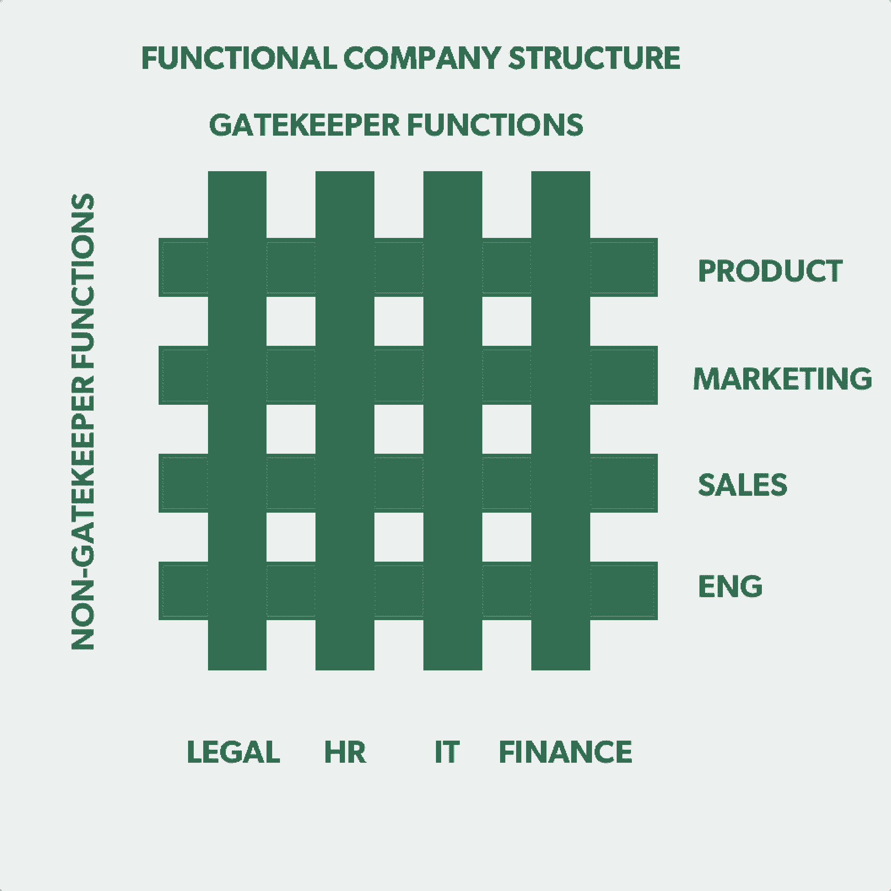

# 精益创业公司的 Eric Ries 讲述如何让“看门人”成为力量和速度的源泉

> 原文：<https://review.firstround.com/lean-startups-eric-ries-on-how-to-make-gatekeepers-a-source-of-power-and-speed>

无论你现在正在经营或工作的初创公司规模有多大，这种场景都即将出现:你想在一个贸易展会上用你的产品原型设立一个展位。当您收到财务人员的 ping 时，您已经将所有这些放在了一起:“您已经超出了本季度分配的营销预算。”接下来，你听到来自法律部门的消息:“你打算让每个与演示互动的人都签署一份 NDA 吗？”不知不觉中，你想做的每一步都像这样——陷入了困境。

创始人兼畅销书作家埃里克·里斯 称法律、财务、IT 和人力资源等职能部门为“看门人”，他对这些部门非常熟悉。在撰写(调查初创公司如何保持快速和敏捷)和他的新书 *[The Startup Way](http://www.thestartupway.com/ "null")* (研究大公司如何变得更加敏捷)之间，他亲眼目睹了这些功能如何减缓初创公司的发展速度，或者给它们带来更多的获胜动力。

在这次独家采访中，Ries 解释了创业公司如何避免陷入每年杀死太多公司的增长陷阱。他描述了**如何以不同的方式创造并与把关者合作**，这样你就可以在扩大公司规模的同时不断扩大创新。

# 定义的看门人

把关者是职能团队，他们的受益者主要是公司本身，而不是最终客户。“看门人为员工服务多于为顾客服务。这并不意味着他们的工作有时不是外部的，但他们的重点是内部的:例如，我们谈论的是财务、法律、人力资源和 It，”里斯说。“他们成为看门人的原因是，这些职能往往会影响产品制造商和销售商接触客户的能力——产品、设计、工程、营销和销售，等等。”

为了说明这种关系，Ries 引用了一个已经存在了一个世纪的矩阵管理结构(如下)——并且仍然影响着公司职能重叠的方式。“一旦他们达到一定规模，大多数公司都会开发这种设计的一些变体，”他说。“有与公司运营相关的面向业务的团队——这些是看门人，由矩阵的竖条表示。然后是围绕产品功能的横条，例如，产品、营销、销售和工程，这与你如何服务客户有关。诚然，有一些不面向客户的性能特征，但归根结底，工程是为了给客户制造产品而存在的。”

垂直导向的团队——看门人——在公司中有强大的作用，因为他们通常对面向客户的团队的工作有批准权。里斯说:“他们被称为看门人，因为如果你想获得按照公司程序运作的许可，你必须得到他们的签字同意。”“金融是最明显、最容易理解的。他们通过所谓的权利资助来“支持”团队，在这种情况下，您可以在某种战略流程中为您的预算进行辩论，以资助项目，并且可以根据绩效调整预算。法律是另一个。产品或营销可能需要征求法律部门的许可，才能发布应用程序或使用特定的副本。”

大多数早期团队忽视了看门人的职能，直到为时已晚。法律、财务、IT —这些团队是被动创建的，被视为执行者，而不是推动者。

# 创业公司的警示故事

初创公司发展得如此之快，如此有机，以至于看门人的职能突然出现，而创始人却没有花太多时间考虑他们应该如何定位，或者如何让他们不成为拖累。“领导者大多是被动地创造它们。他们意识到，没有看门人的功能，人们将承担责任。然后它盘旋:“我们可能有一些流氓单位运行一个非法的竞争监视项目”或“一个区域的 PM 做一个攻击性的广告活动破坏品牌。”解决方案通常是某种形式的集中品牌或出于恐惧或紧迫感对项目进行法律监督。这就是这个功能变得铁板一块的时候——并且在初创公司需要增长最快的时候拖累它们。"

当然，如果你在一家初创公司读到这篇文章，你可能最不希望看到的就是围绕你敏捷团队的结构——也许你会惊讶地听到来自精益初创公司作者本人*的这个建议。因此，这里有一个来自 Ries 的**警示故事来说明尽早定义和构建看门人角色的重要性**:*

“不久前，我与一家早期高度创新的科技公司举办了一场精益创业研讨会，这在很大程度上归功于他们严格迭代的建筑风格。但现在他们有几千名员工，所以他们放慢了速度，并好奇这是为什么，”里斯说。“最终，围绕看门人职能的对话浮出了水面，特别是当该团队即将通过同时以多种语言本地化和发布其产品来进行扩展时。这是你的经典大爆炸，瀑布式的项目。他们计划用 18 个月的时间来开发它，然后在全球几个国家同时推出。”

为了将战略植根于现实，Ries 将对话引向最低可行产品(MVP)——你可以尝试获得重要知识的最低提升。“一个想法是——当时脸书的广告刚刚出现——在目标国家投放一些脸书的广告，公司将在那里招募人员来预订产品。里斯说:“我们的想法是让每个国家的 100 个人接触广告，看看他们中有多少人会给我们信用卡。“该公司将免费向他们提供产品的英文版本，然后当地语言版本将尽快发货。”

这一策略似乎显而易见，但在当时，它还是相对新颖的。“所以我们达成了协议，我们要做这个测试，其中一个工程师说，‘你知道吗？我们做不了这个 MVP。你做梦去吧。法律绝不允许。如果他们的交易基础设施不符合 PCI 标准，我们就不能使用信用卡。“这东西可能不会出货，所以可能会有负债，”里斯说。“我说，‘好吧，谁在法律上？谁告诉你的？工程师说没人需要告诉他——每个人都知道。他不知道谁是他的法律决策者，也不知道谁可以对这个决定提出上诉。这位工程师建议也许可以请工程团队的总法律顾问，因为这家公司规模够大了。"

里斯要求在电话上找到气相色谱。“令我震惊的是，工程团队被吓坏了。就好像他们被叫进了校长办公室。我说，‘听着，你让我来这个车间。让我们开始吧。所以我们打电话给 GC，他接了电话。工程师对他说，‘**先生，你介意我们用别人的信用卡买一些我们可能不会发货的东西而招致无限责任吗？**‘我能听到 GC 要关掉它并教训我们，所以我说，‘对不起。暂停暂停。我能试试吗?**他的意思是，你介意不超过 100 人给我们他们的信用卡吗？GC 问我这要花多少钱，我说，29.95 美元，所以 30 美元。所以他说:‘那么你是在告诉我，即使我们拖欠所有这些债务，最大负债总额也是 3000 美元？“GC 来了个 180 度大转弯，说‘你知道我们已经在这个电话上花了那么多钱吗？你当然能做到。再见。"**

公司已经失去了行动的速度和偏向，因为每个人都在对把关者做出假设。“员工们完全搞错了背景。里斯说:“他们认为 GC 不会同意，所以他们以这样一种方式问这个问题，并得到了他们认为会得到的答案:不会。”“这不仅仅是内部的不一致，从对话中可以看出明显的业务成果。这个团队开始做他们的实验，结果发现印度尼西亚和新加坡非常不同，新加坡和挪威也非常不同。他们从测试中获得了重要的产品和市场情报。”

# 创业公司如何避免守门人陷阱

将这个警示故事乘以每个产品发布、进入的市场和目标客户群，对企业的影响可能是巨大的。那么，创业公司可以做些什么来超越这些关于看门人职能的默认假设呢？Ries 为三个关键利益相关者列出了一个建议清单:把关团队中的人*而不是*，把关者，以及你的初创公司的领导团队。**浏览您所在的部门，阅读他的顶级提示和您今天要采取的行动，以设置您的看门人职能，从而在您扩展时取得成功。**

# 给非看门人的提示

**规则:避免在最后一刻问问题，以防止出现看门人双输的局面。**

“你有多少次在需要答复的下午打电话给法律部或人力资源部，因为你没有为他们的签字做好准备？里斯说:“如果这引起了共鸣，那就难怪你只会经历——并强化了这种信念——看门人总是在阻挡你。”“他们所经历的是，有人在没有准备时间的情况下打电话给他们，提出一个复杂的计划，并要求他们在一天结束前表示赞同或反对。从律师的角度来看，这是一个两败俱伤的主张。要么她不得不接受比她所能接受的更多的责任，要么她不得不拒绝并成为邪恶的一方。没过多久，产品或营销等非把关功能就会说，“那些合规的混蛋讨厌我们。”。他们从不让我们做任何事。"

策略:从一开始就雇佣一个跨职能团队。

当然，跨职能团队的[好处——尤其是在](http://firstround.com/review/the-power-of-the-elastic-product-team-airbnbs-first-pm-on-how-to-build-your-own/ "null")[工程、产品和设计](http://firstround.com/review/defining-product-design-a-dispatch-from-airbnbs-design-chief/ "null")之间——是众所周知的。但是你多久会想到在计划发展的战略点上包括建议或遵从(而不仅仅是在开始和结束时，贡献是有限的)？为了说明这一点，Ries 分享了一个轶事。

“我曾与医疗保健领域的一家公司合作，该公司内部关系紧张。他们的功能是孤立的，每个构建产品的人都讨厌遵从的人。“合规团队不喜欢产品团队，因为它总是推销低投资回报率、不切实际的产品方案，”Ries 说。“不仅两个团队都受到了影响，公司的建设和创新能力也受到了影响。公司让我做精益创业培训。我有一个条件:‘如果你要和我一起工作，我坚持你要建立一个真正的跨职能团队。这意味着你，产品，需要在你的团队中安排一个全职的合规人员。"

产品团队的负责人很不情愿地打电话给合规部，让他们派人过来。合规部说他们不能放过任何人，所以 Ries 告诉产品团队，他们必须从预算中支付合规人员的工资。产品团队吃了一惊。“这不是慈善机构。真正的成员资格意味着跨职能的合作。里斯说:“我不得不打电话给公司的创始人，要求突破政治，进行干预，但最终还是发生了。“当然，合规部派出了其武库中最具挑战性的成员加入这个团队。现在他在生我的气，产品团队也是。”

既然他们的合规同事已经正式成为团队的一员，Ries 告诉 Product 带他参加下一个研讨会。“当我们开始时，合规部的那个家伙——我们姑且称他为凯文——双手交叉，死死地盯着我。原产品团队还在气头上。但是我们遵循 MVP 和精益创业 101 原则。一位首相站了出来。嘿，我有个主意。我们可以提前向医院预售我们的产品。我们可以找三个试点客户，进行一次试验，看看我们是否能更快找到合适的商业模式。一名工程师驳斥了这一说法，称“这是行不通的，因为所有人都知道，没有美国食品和药物管理局的批准，是不允许预售医疗器械的”。"

这时合规部的凯文站了出来。“对不起，我有一个问题:你们当中有人觉得这是美国联邦政府会做的事情吗？发布一个只有一句话的规则？你真的认为美国食品和药物管理局有规定说你不能在没有任何例外或条款的情况下，未经美国食品和药物管理局批准就预售医疗器械吗？”他停顿了一下。“不，相关规则长达 500 页。你们有人读过这 500 页吗？你们都没有吗？我有。在第 168 页，第 B 条，第 3 款，脚注 C，有一条规则适用于这种情况。你刚才描述的完全合法。事实上，美国食品和药物管理局更希望你做这种试点，以确保这个东西的工作。”

里斯看着产品团队的下巴掉在地板上，然后喋喋不休地问了一系列关于其他异常的问题。凯文跳进了其中一打。“他被赋予了权力，这让人印象深刻。在那之后，团队取得了更快的进展。“美国食品和药物管理局认为他们很了不起，而不是超级弱，”里斯说。

“如果你在一家初创公司，看门人的人手有限，让代表们参加你的第一次、中间和最后一次会议。如果他们不在你的团队中，那就在议程中划出一个特定的部分让他们来领导。给他们一些拥有的东西，让他们真正有归属感。

# 给看门人的最高提示

**规则:尊重他人的建设方式，对自己的建设方式保持灵活。**

里斯研究了不同类型的看门人，他看到了那些走上正轨的人中的共性。这些品质与高质量的初创公司员工并没有太大的不同，但对于把关者来说尤为重要。

“表现最好的看门人具有企业家的美德，即使他们从未成为创始人或在初创公司工作过。他们对不确定性和模糊性有容忍度——甚至是舒适感，并且理解为什么创业充满挑战。里斯说:“这就转化为对产品团队经历的感同身受。“这种形象主要体现在对他人构建的东西的尊重和对自己构建方式的灵活性上。当然，这种灵活性带来了学习第一的心态。你想要一个见多识广的看门人，但不总是带着所有的答案进来。她应该能够将自己的专业知识与公司正在做的事情结合起来。”

里斯承认，这是一个很难找到的组合。里斯说:“这些都是罕见的超级明星:克里斯·考克斯是脸书公司的首席产品官，但也曾有一段时间是人力资源主管。”。“有两个关键属性。首先是尊重。如果他们不是创始人或产品领导者，没关系。如果他们没有在 5 人创业公司工作过，没问题。但他们必须对建筑怀有敬畏之心，对创造以及它会变得多么混乱抱有同情心。”

守门人必须是敏捷的思想家。询问他们在工作中的最佳实践。然后询问同样的最佳实践在哪里不合适。敏捷的思考者知道最佳实践并不总是最好的。

二是思维敏捷。“我有一个[招聘启发法，叫做 ABCDEF](http://www.startuplessonslearned.com/2008/11/abcdefs-of-conducting-technical.html "null") ，代表:敏捷、头脑、沟通、动力、同理心和适合度。对于守门人，**我发现敏捷是最重要的属性**。为了验证这一点，我会问他们:“告诉我你工作中的最佳实践。”然后我问:“告诉我一个最佳实践不合适的情况。”里斯说:“只有敏捷的思考者才能证明最佳实践并不总是最好的。对于一名律师来说，这可能是在试探一种情况，在这种情况下，你*不应该*让律师处理所有事情。希望他们不会说“犯罪阴谋”，但你希望有人说这样的话:“你知道吗？如果你是一个两人团队，你只是做一个 MVP，有六个人参与，你不需要律师。这需要一些常识和思维灵活性。"

策略:为你的客户制作一份单页广告。

Ries 建议把关者为他们的内部利益相关者(本质上是他们的用户)创建一个单页页面。守门人做的很多事情都非常复杂，需要很少的知识，但他们可以简单地解释并列出与他们合作的最简单的方法，这样他们就可以更好、更快地完成工作。为了使事情简单，他们应该将该指南限制在一页内，以便利益相关者确切地知道他们何时可以自己处理事情，何时需要交互，以及他们需要提供什么信息。

这就是那个科技公司打电话给他们的总法律顾问却被告知他们的电话是浪费时间的故事的最终结局，因为他们的责任风险太低了。“GC 告诉创始人:‘这不是我的错。你的团队从来不和我商量，他们都是一群混蛋。创始人说:‘听着，恕我直言，这是你的错。这些人是你的客户，如果他们没有尊重你，那实际上是你的问题，所以你能解决它吗？里斯说。总检察长没有明确他的参与条款。换句话说，他没有为客户定义哪些问题值得联系他，哪些不值得。一个初级产品经理怎么知道？此外，他总是对初级产品经理大喊大叫，不管他做什么，所以那个人被烧伤了，不想打电话给 GC。"

最快的方法是一份一页的文件——基本上是一套非常简单的准则，内部利益相关者可以参考。总法律顾问就是这么拟定的。“这很简单，也很有特色。它有大约五个带复选框的要点和简短的短语，如:“你的实验中涉及的客户总数小于 X；里斯说:“他们付给你的钱比你的少，还多一些。如果您能够核对这些要求中的特定数量，那么您就预先获得了运行 MVP 的批准。你*不*也得叫合法。然后，如果你的 MVP 的第一阶段完成了，你想扩大你的实验，有一套新的指导方针，需要你的经理批准。再多，你就要打电话给法律部了。等等，随着制衡的升级。"

这里的陷阱是守门函数很难制作一个一页纸。“GC 认为这是一个很棒的想法，并派他的团队来制作这种单页纸。猜猜我第一次看到这个文档的时候它有多长？10 页长。这是一份 10 页的“一页”文件，因为他们是律师；里斯说:“T4 是他们的‘一页纸’。“有小字和所有这些法律定义和‘您的里程可能会有所不同’免责声明。”那飞不起来。看门人必须考虑他们的顾客。对于产品经理和工程师来说，它必须是可消费的和可理解的。他们不会去阅读一些法律文件，不管你认为你的政策声明有多漂亮。"

# 给 CEOS/创始人的最佳建议

规则:营造一种环境，让看门人能够提供服务，而不仅仅是回应。

需要授权给你的团队是一个创业比喻，但是给看门人实际的代理权经常被忽视。里斯说:“如果你打算聘用一名总法律顾问或一名 IT 主管，让他们负责自己的职能，你就必须让他们成为看门人。”。“作为他们的领导，你必须能够做出这样的声明:**把关职能是为他们的客户服务的，而不仅仅是回应他们。他们能否拥有一种代理模式，为他们的关键利益相关者——员工——带来一个核心流程，或者是在最后一刻把东西扔过来。作为创始人或首席执行官，你需要多长时间干预一次？”**

帮助确定把关功能的独立性和授权的一个关键指标是，他们是否可以随着范围和工作量的增加而扩展他们的团队。“在产品/市场契合的早期，你不会有足够多的看门人。所以实际上你一次能完成的好项目的数量是有限的。里斯说:“大多数初创公司忽略了这一点，以快速行动和构建东西，所以你最终会在 50 个项目团队之间共享一个 GC。“但初创公司的领导者可以预见到这种增长，并采取措施让看门人职能的领导者确定他们自己的人员需求。这可能意味着在一定的人数或项目数量下，确定一个把关团队必须雇佣和发展的临界点。这可能是授权看门人定义和集中他们在组织中的功能的过程的唯一最有力的杠杆。”

有了守门人，就没有了前进的表象。

**策略:根据团队的周期时间，让把关者职能负责人承担责任。**

赋予看门人职能的另一面是让他们负起责任。“如果你是一名首席执行官，你希望看门人在整个组织中获得成功和尊重，那么你必须让你的看门人职能部门负责人对这些结果负责。里斯说:“我认为，这是首席执行官们犯的最大错误。“模糊或宽泛的指标会导致灾难。所以，如果你对一个 GC 说，“你的工作是确保我们在这个公司没有任何责任作为业绩的衡量标准，他们只会对一切说不。那么你的团队将无法运送任何产品。他们会说，'好吧，你告诉我没有责任，所以我交付了。'"

不要告诉看门人职能部门他们对总体业务绩效负责，因为这是高度可变的，不是他们经常可以使用的杠杆。相反，创建与你希望团队扭转局面的速度相关的指标。“作为领导者，你必须说，‘听着，我关心团队的周期时间。因此，我在团队中看到的一个经典案例是——不挑法律部门的毛病，但这是该职能部门的一个常见问题——随着公司变得越来越大，律师根据公司青睐的团队为团队提供服务级别。有一天，我与一个团队进行了交谈，他们提出了一项获得法律协议批准的请求，分配给他们的律师说，“把你的 ROI 商业案例发给我。”这减缓了建筑周期。您需要为您的看门人职能定义这一点。"

**Ries 援引 SLA(服务水平协议)来建立明确的基本规则。**“就像您与 AWS 签订了 SLA 协议一样，法律部门与公司其他部门之间的服务水平协议是什么？当我们给你寄东西的时候，我能得到什么样的回报？发布和获得客户反馈的节奏是怎样的？里斯说:“如果我们不衡量这一点，其他任何东西都不会有影响。”。“但假设我们在衡量这一点，那么我们就可以追踪法律对这一循环的贡献。首席执行官可以对所有看门人副总裁说，“你们是一个委员会，你们的工作是监督响应时间并降低响应时间。所以我希望看到非常高效的团队。你们每个人都需要做一个生产力指标，创建一个仪表板并拥有它。让我们每月复习一次。"

# 将这一切结合在一起

对于许多快速发展的创业公司来说，“看门人”是一个贬义词。它们不是可以保护和揭示团队盲点的同等功能，而是被视为瓶颈。在他的职业生涯和为 *The Startup Way* 所做的研究中，里斯看到太多的初创公司和大公司都是被动地与看门人合作，而不是主动地定义如何与他们合作。其结果是看门人的耻辱和团队内部日益紧张的关系。

相反，告诉你的非看门人职能部门(产品、工程、营销等。)从一开始就建立一个跨职能团队(如果可以的话，正式让看门人成为你团队的一部分)。这会减少那些破坏关系的最后一分钟的要求。看门人应该为团队起草一页通俗易懂的备忘单，这样他们就可以在没有复杂的法律术语或行业术语的情况下设定期望。最后，对于首席执行官或创始人，给出精确的衡量标准——尝试奖励那些为团队创造更快周期时间的看门人，而不是防范所有责任。

“在我合作过的许多公司，我都注意到了创始人的“玻璃透视时刻”。里斯说:“在某个转折点，他们开始不仅仅将自己视为做出决策的企业家，还将自己视为授权并投资于为你工作的企业家的人。“那些负责守门职能的人通常是领导层认可的最后一批‘创始人’，因为他们更关注员工，而不是客户。但是把它们留到最后是错误的。创业公司必须给予看门人适当的支持，并预测他们需要什么——不仅是来自高层，也来自他们周围的非看门人团队。毕竟，他们是在为那些为你的顾客服务的人服务。一切都不可避免地联系在一起，这一点在规模上变得非常明显。”

Travis P Ball/Getty Images Entertainment 提供的图片。