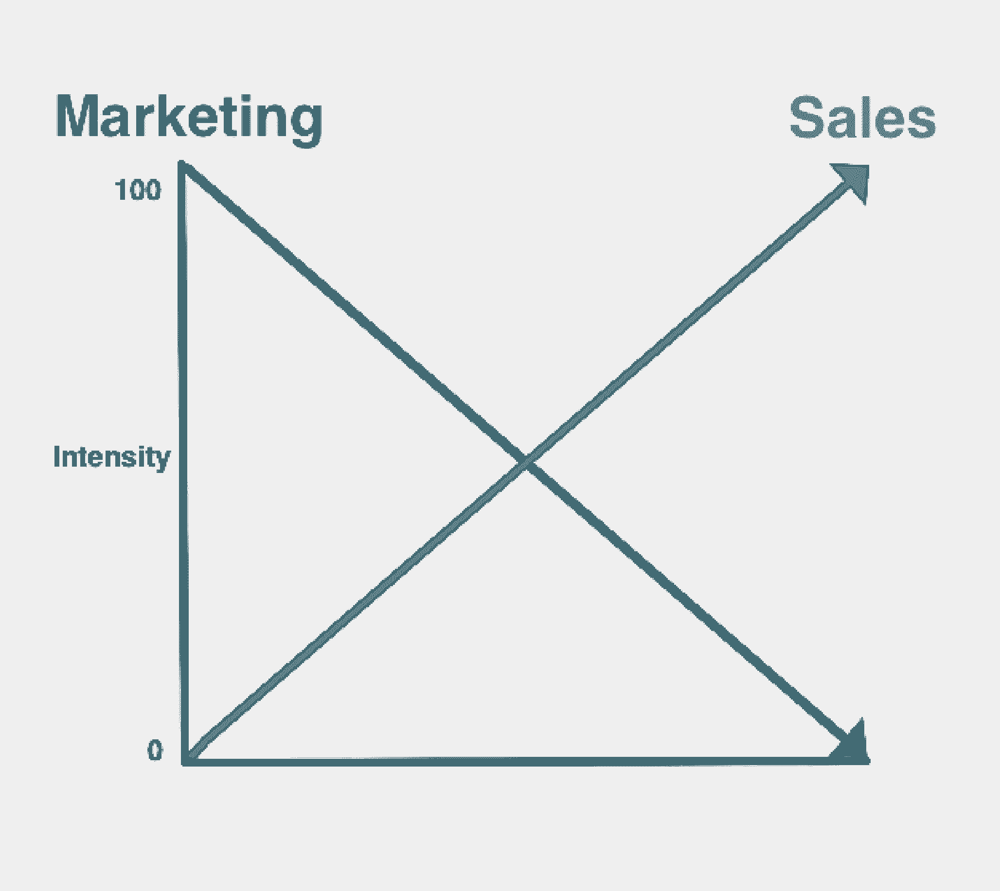
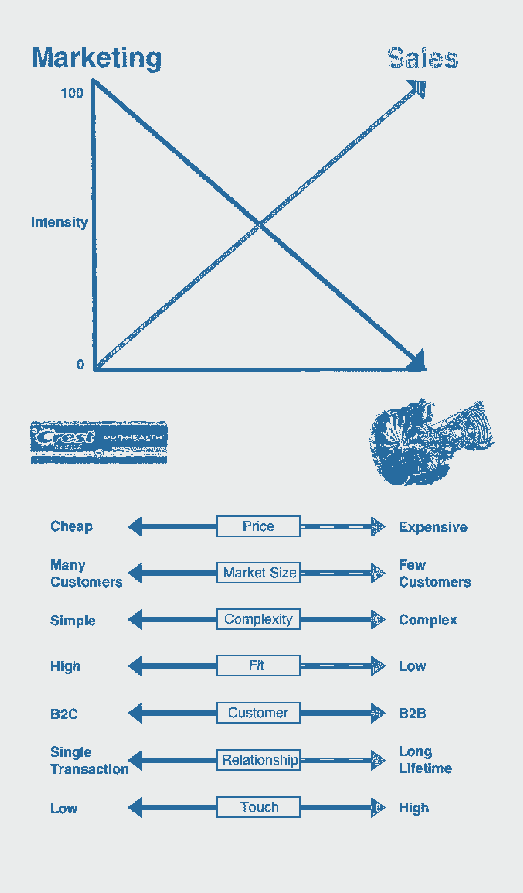
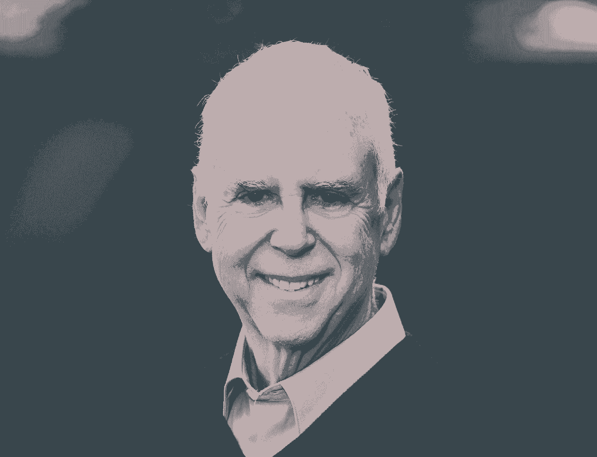
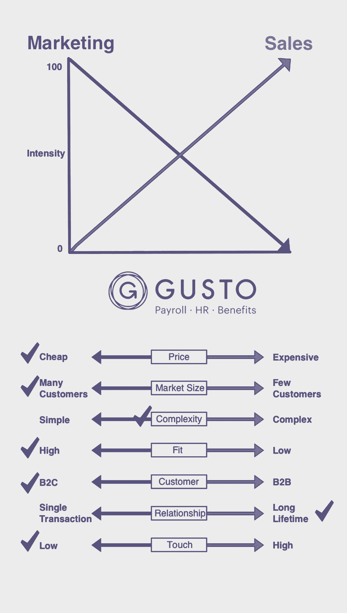
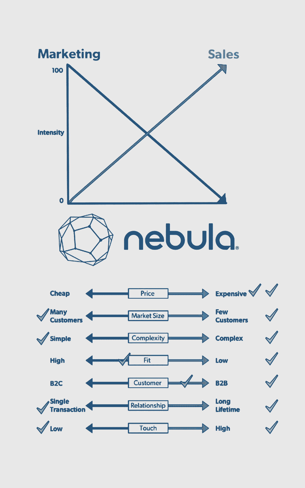
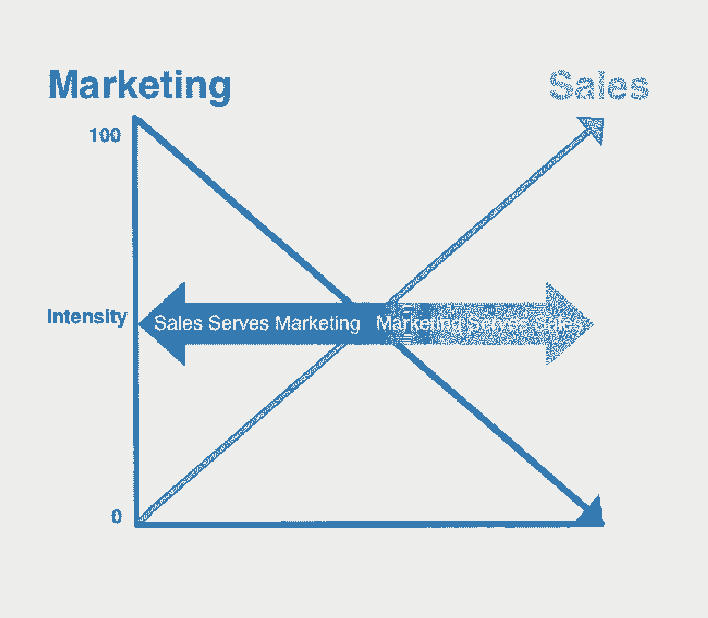

# Leslie 的指南针:走向市场战略的框架

> 原文：<https://review.firstround.com/leslies-compass-a-framework-for-go-to-market-strategy>

暂且把创业的目的简化为一个行动:信念的转移。从创始人到她自己。从创始人到创业。从创业到投资人。从创业到上市。最后一次定罪证明是最脆弱的一次。根据一项为期三年的关于初创公司死亡率的研究，大多数初创公司在筹集了 130 万美元后，也就是在最后一轮融资后大约 20 个月失败。当然，许多因素导致了这些失败，但它表明，对于寻求铺平市场道路的初创公司来说，这是一段多么危险的旅程。

我们需要的是一个简单的测试，可以让走向市场战略成为焦点——一个可以帮助初创公司在产品首次推出时聪明地部署有限资源的测试，一个公司有一次机会留下强烈的第一印象。对于这些拐点，创业公司需要一个指南针，在我与他们共事的几十年中，我认为这个框架为他们指明了正确的方向。

# 框架及其两种力量

2003 年，我和几位教授同事开始游说斯坦福大学商学院(GSB)开发一门新的销售课程。该课程的目标不是面向单个销售人员，而是高管如何定位一家初创公司，将产品推向市场。在所有的教授中，市场部的头头以同样的热情迎接了我。我们把自己锁起来，开始设计课程。但是，我们代表了两个不同的领域——营销和销售——所以我们首先问自己:“营销和销售之间有什么区别？为什么斯坦福·GSB 两个都要教？”

为了回答这个问题，我们走到黑板前，画了一个这样的图表:

这个概念框架展示了在走向市场战略中销售和营销之间的相互作用。当一个产品已经商业化并面向公众时，一个公司有两块关键的肌肉可以灵活地将其推向市场:营销和销售。大多数走到这一步的公司都凭直觉知道这一点。但是这张图表表明营销和销售是相互平衡的。市场营销越不灵活地将产品推向市场，销售就必须介入得越多。如果销售不能推动走向市场战略，那么市场营销就更有必要。几乎在每一种情况下，要么是市场营销，要么是销售人员带头把产品送到顾客手中。

挑战在于知道为您的公司和特定产品激活哪一个。这个答案对创业公司来说尤其重要，他们经常在这两方面投入大量资源来消除猜测，尽管这浪费了大量资源。赌注很高。如果他们选择了错误的道路，他们可能会跌跌撞撞地走出大门。例如，雇佣一个高接触，昂贵的销售队伍来销售低价产品可能是一个游戏结束。在这一失误之后，一家原本潜力巨大的公司可能无法快速发展，无法参与竞争或实现盈利。

因此，这个框架的核心——以及一家初创公司的走向市场战略——是这个问题:

你的产品是营销密集型还是销售密集型？

为了更好地回答这个问题，让我们看看两个极端的例子——宝洁公司的佳洁士牙膏和通用电气公司的喷气发动机——来说明这个框架。这张图表的关键是 x 轴，它有多个变量需要考虑，这些变量在确定你应该如何走向市场时至关重要，但并不详尽。

创业公司要做的第一步是通过检查变量来确定他们在光谱上的位置。检查每一个，并确定你的产品是在左边(营销密集型)还是右边(销售密集型)。要确定答案，就每个变量问自己以下问题。让我们继续用牙膏和喷气发动机来说明这个框架:

**价格**由客户对产品或服务的估价决定。简单地说，就是客户愿意支付多少钱，这与客户实现的投资回报密切相关。例如，你不能“出售”2 美元一管的牙膏。要证明这一点，只要拿业务员的总成本除以一年的推销电话次数就可以了。这就是为什么没有人挨家挨户说，“让我解释一下佳洁士相对于高露洁的优势。”但是，假设你有一个造价 10 万美元的产品，你需要把它卖到 20 万美元。现在，您处于销售密集型的走向市场战略中。

**问自己**:对于买家来说，这是一个大的还是小的经济决策？

**市场规模**由潜在客户数量决定。产品可以卖给数百万甚至数十亿的客户(通过智能手机)，或者只卖给极少数人。例如，数十亿人需要牙膏，但不太可能有 100 多家飞机制造商在寻找喷气发动机的供应商。

VERITAS 最初的产品是一个操作系统组件，该公司将其作为 UNIX 操作系统的一部分出售给系统制造商。维尔软件上市时，有很多人想花钱做营销。但是莱斯利有不同的感觉。当时，大约有 100 家系统制造商，所以在广告或邮件列表上花钱没有意义。相反，该公司投资参加行业展会，但从不购买展位。他们知道谁是顾客，所以去寻找他们，而不是等待。

问问你自己:是他们更容易找到你还是你更容易找到他们？

当涉及到**复杂程度**时，一些产品非常简单，而另一些则需要教育、手册和定制来获得效用。从涡轮到亚音速进气口，喷气发动机由无数部件组成，而操作一管牙膏是完全不言而喻的。

另一个例子是 Oracle ERP，它可能需要数百人数年的时间来实施。作为一种复杂的产品，它总是被销售，而不是被营销。而优步对消费者来说极其简单。我们都记得我们第一次打开应用程序，知道如何呼叫优步，然后一辆小车出现在地图上。

**自问**:客户可以自助使用还是需要培训？

**适应和完成**的范围从现成的解决方案到需要多个步骤或支持点才能运行的东西。当牙膏从盒子里——或管子里出来时，它有很高的适合度和光洁度。然而，当一个喷气发动机被购买，那只是一个开始；它必须与飞机的其他部分相互作用和连接。然而，不要把复杂与适合度和光洁度混为一谈——一些高度复杂的产品有很高的适合度和光洁度。例如，一辆特斯拉——或任何新车——有数百台电脑，但你只需要转动钥匙或按下按钮就能启动它。无论如何，合身和完美是关键。在大多数情况下，当顾客没有更好的选择时，差的贴合和表面处理才会长久。

**扪心自问:**在设计、完成和发货之后，消费者还需要做更多的事情吗？

确定你服务的是**企业还是消费者**是走向市场战略的重要组成部分。产品卖给企业或直接卖给消费者。每个人都需要自己的关系类型。但需要注意的是，这是一个容量指标。消费者比商家多，前者比后者同质化。绝大多数人需要牙膏，但绝大多数企业不需要喷气发动机。

问自己:我主要是直接向人或公司销售吗？

**客户经济寿命**关注与客户互动的节奏和持续时间。尽管存在品牌忠诚度的问题，但消费者一生中会购买数百支牙膏。鉴于喷气式发动机可以使用很多年，而且大约有 100 家制造商，每年的交易不会超过这么多，而且可能会少得多。问题是与客户关系的性质。随着时间的推移，您希望与不断增加的收入建立长期关系，还是希望随着时间的推移，与越来越频繁的更多交易建立长期关系？关系持续的时间越长，我就越会考虑如何交付和销售该产品。

**问自己**:我是用交易量还是寿命来衡量成功的客户关系？

与客户经济寿命相关的是产品是否需要**高接触**或**低接触**销售。销售喷气发动机通常需要“设计取胜”，这是一项非常漫长、复杂的技术活动，会在特定型号长达数年的生命周期内带来大量销售。它需要建立关系，在二三十年内可能价值数十亿美元。低接触式销售不需要“落地和扩张”的能力，也不需要根据关系定制销售。购买相同或不同的牙膏几乎没有历史。

**问自己**:你在发展与客户的关系中发挥了多大的作用？你的努力是复合的还是一次性的？

总之，佳洁士是营销密集型产品的一个极端例子:它的成本非常低，被数百万消费者购买，操作简单，具有很高的“合身性和光洁度”，因为它可以在购买后立即使用。尽管 P&G 希望它的牙膏拥有终生顾客，但它的转换成本非常低，而且购买决定可以受到优惠券的影响。你见过 P&G 销售代表称赞佳洁士相对于高露洁的优点吗？

另一方面，通用电气公司的喷气式发动机是销售密集型产品的代表。该发动机的价格高达数百万美元，出售给大约 100 家飞机制造商，技术极其复杂，配合度和光洁度都很低，因为它总是需要大量的工程设计和售后定制。这是终极销售体验，因为这是设计的胜利。一位客户想要燃油效率、严格的重量阈值、推力、一定程度的噪音和数百种其他规格。喷气发动机制造商不仅在制造产品上花了很长时间，而且在定义和履行合同上也花了很长时间——这是非常高的接触度。出于所有这些原因，我从未见过阿格喷气发动机在沃尔玛出售。

Mark Leslie

# 找到你的目标

作为一个概念框架，关键不在于确定你的公司在光谱上的*确切的*点，而在于知道你的创业公司定位于哪种方法(或者在图表的哪一半)。根据你的新产品是更像佳洁士牙膏还是阿格喷气发动机，这将有助于你了解你的上市策略应该是营销密集型还是销售密集型。

如果你营销密集，产品就有人买。如果是销售密集型的，产品就卖出去了。

也有例外，但是，总的来说，走向市场策略的成功程度取决于在图表的同一半中每个因素的合理匹配程度。这里有两家公司的故事说明了协调的重要性:

在线人力资源服务初创公司 [Gusto](https://gusto.com/ "null") 就是一个良好结盟的例子，这导致了成功的上市战略。gusto——原名 Zen payroll——经营的市场是一个为大公司打造的工资单运行工具，涉及重型接口，需要一点学习曲线或支持团队来排除故障。

当 Gusto 决定为许多小公司提供解决方案时，它必须改变其走向市场的其他方面。例如，它决定采取低调的方式，通过网络销售服务。虽然它的产品是中等复杂，但它有极高的适合度和光洁度，因为它只需要几分钟就可以设置好，而且使用起来很直观。相对于其竞争对手，其价格较低，每月基本价格约为 40 美元，外加名义上的每位员工费用。从技术上来说，它是一家 B2B 公司，但第二个“B”更像是一个“C ”,因为它有许多更小的客户。

如今，Gusto 拥有约 5 万名客户。下面是它的图表:

需要注意的是，并非每个勾号都需要位于图表的一侧，这样才能展开成功的上市策略。然而，创业公司必须意识到错位点，以进行调整，因为 Gusto 在开始时考虑到其许多较小规模的客户，将其 B2B 业务调整为 B2C 方式。

相比之下，一个值得警惕的故事是私人云计算创业公司[星云](https://www.crunchbase.com/organization/nebula "null")的故事。至少在纸面上，它似乎拥有一切。帮助创办 [OpenStack](https://www.openstack.org/ "null") 的联合创始人。一个领导团队，包括帮助发明了第一个浏览器的人和前戴尔执行官。这一杰出的发现吸引了美国宇航局的工程师和顶级投资者的支持。

在第一季度与知名客户(如梦工厂、索尼和基因泰克)和大约 100 万美元的销售额一起跃出大门后，势头放缓了。Nebula 为许多客户提供了希望和计划，但是，凭借 275，000 美元的入门套件，他们为客户提供了相对昂贵的入门级价格，无需漫长而艰苦的销售周期即可注册。

在当时新兴的私有云计算市场和备受期待的 Openstack 运动中，潜在客户寻求像亚马逊的公共云产品一样即插即用的解决方案。Nebula 是作为一种“一体化设备”推出的。在早期的上市努力后，该公司意识到其解决方案需要比任何现成产品都高的销售、服务、支持和教育水平。

Nebula 的销售团队面向企业，但该产品并不完全是为他们设计的。例如，其服务器的异国情调的控制台——它甚至显示克林贡字符——和触摸屏显示器旨在激发 technorati。但严肃的商业计算用户将服务器藏在黑暗的数据中心，那里很少有人与产品互动。

最后，当 Nebula 推出时，它预计即插即用解决方案不需要很高的接触度，但由于 VMWare 的防御措施和 AWS 的易用性，Nebula 的销售宣传失去了影响力，需要更加个性化和细分化才能获得吸引力。

星云从未达到它的速度，并在发射四年后关闭。根据 Leslie 的说法，这是它发布时的图表外观(橙色复选标记)，以及回想起来，它计划发布时的外观(紫色复选标记)。

# 确定是营销还是销售领先

研究这一概念框架不仅是为了增加更成功的走向市场战略的可能性，也是为了确定如何最好地构建销售和营销之间的关系以保持这一势头。

建立有效的走向市场战略的方法是了解是营销还是销售在起主导作用。如果你的框架中关于价格、市场规模、复杂性等问题的答案都在图表的左边，那么市场营销应该在走向市场战略中起主导作用。如果绝大多数答案都是正确的，销售人员应该带头。

**销售服务于营销**

在左边的场景中，营销是首要的。在这种情况下，营销产生需求。通过宣传活动，它创造了足够强大的胃口，让人们自己购买产品。销售通过创造一个“场所”来为这一努力服务这意味着他们将分销商、零售商和销售商联系起来，这样产品就有了存在——本质上是一个可以找到并可以购买的地方。让我们回到牙膏/喷气发动机领域，看看市场驱动的宝洁公司的文化。最有价值的工作之一——具有最大的向上流动性——是产品经理，他负责品牌、广告、公关、发布等工作。

**营销服务销售**

**在右边的场景中，销售是首要的。**在这种模式下，营销部门的职责是创建合格的销售线索并将其交给销售组织。他们通过有组织的渠道结构管理各种销售线索来源。他们提供寻找潜在客户的辅助材料和计划。组织成功的核心是销售部门将合格的销售线索转化为客户成功。

**首要地位如何转移**

值得注意的是，当一家公司位于这些坐标轴上时，营销或销售的首要地位分别在左边和右边的极端位置最为突出。越往中间走，“服”的现象越下降。在中线，营销和销售是平等的。

# 将这一切结合在一起

了解你的上市策略是销售或营销的首要功能，这一点至关重要。使用这个简单的框架来确定你要推向市场的产品是销售密集型还是营销密集型。通过确定你的产品在七个关键变量中的位置来做出决定:价格、市场规模、技术复杂性、适合度和光洁度、客户类型、客户寿命和客户参与度。该框架提供了一个关键问题来帮助确定产品在每个向量中的位置，但更适合帮助初创公司了解它们是否都是一致的。如果是这样的话，这不仅有助于更顺利的上市战略，也有助于营销和销售更好地协调他们的努力，以赢得客户。

不管你是在生产牙膏还是喷气发动机，或者任何介于两者之间的东西。任何产品都可以在正确的联盟和团队结构支持下进行买卖。这个框架提出的问题触及了建设伟大公司的核心，并归结为一个最核心的问题:我们在建设什么，为谁建设？这些问题必须被询问和回答，以便有效地成功进入市场。当然，没有一个框架能保证胜利，但是，随着指南针的移动，这个框架会让你的公司指向正确的方向。这本身就是一种竞争优势。

*[马克·莱斯利](http://www.gsb.stanford.edu/faculty-research/faculty/mark-leslie "null")* *是斯坦福大学商学院的讲师，教授企业家精神、伦理和销售组织方面的课程。他还是私人投资公司 Leslie Ventures 的董事总经理，并在两家上市公司、六家私营公司和三家非营利组织的董事会任职。此前，Leslie 是 VERITAS Software 的创始董事长兼首席执行官。他在**[@ mles lie 45](https://twitter.com/mleslie45 "null")**发微博。*

*马特·海曼(Matt Heiman)对本文有贡献，他曾是马克·莱斯利在斯坦福 GSB 大学的学生，也是 Greylock Partners 的投资专家。*