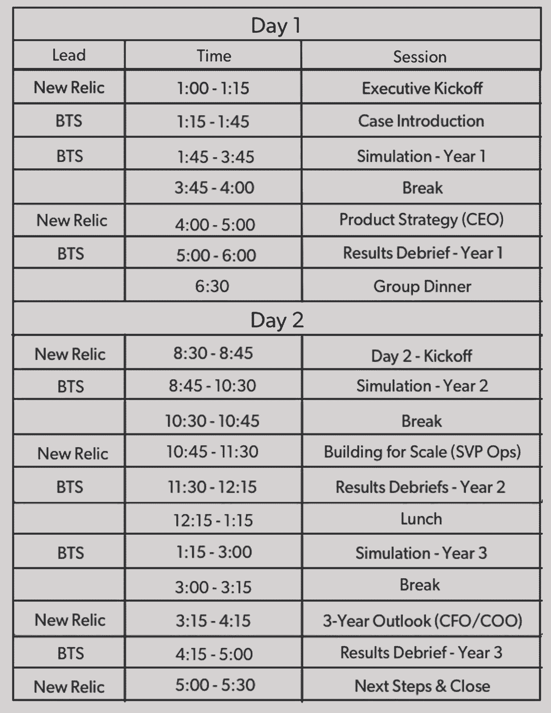

# 更少的工作，更多的娱乐:用模拟改变游戏

> 原文：<https://review.firstround.com/less-work-more-play-change-the-game-with-simulations>

2009 年，虚拟计算公司 **[VMware](http://www.vmware.com/ "null")** 处于转型期。创始人兼首席执行官已经离开，一位新的领导者正在掌舵。虽然服务器虚拟化推动了十年的成功，但该公司需要找到下一个收入增长引擎。首席执行官已经进行了几次收购，但员工们很难理解为什么。该公司决定采取一种非常规的方式来应对快速变化的环境:进行业务模拟。VMware 与咨询公司 **[BTS](http://www.bts.com/ "null")** 合作建立了一个模拟公司面临的挑战的模拟系统。为期两天的“游戏”迫使公司领导人应对融资挑战，并在短期和长期投资之间做出权衡。领导者也交换了角色，比如销售与产品的交换。这个包罗万象的练习达到了目的，在关键时刻提升了同理心、理解和协作。

时任副总裁 **[的伊冯娜·瓦塞纳](https://www.linkedin.com/in/yvonnewassenaar "null")** 亲眼目睹了模拟的成功，并从此成为演习的热情倡导者。她也是成长型公司的专家。在 VMware，瓦塞纳尔帮助公司的收入从 20 亿美元增加到 60 亿美元，并通过模拟帮助 1500 多名销售人员销售更广泛的产品组合。现在，作为 **[New Relic](https://newrelic.com/ "null")** 的首席信息官，她很快在软件分析公司采用了模拟技术，她帮助该公司准备了首次公开募股，并在两年内将年度经常性收入增加了一倍多，达到 2.5 亿美元。在此之前，瓦塞纳尔在埃森哲工作了近 20 年，担任过各种职务，从软件工程师到全球销售运营主管再到合伙人。她在 Bitium、雅典娜联盟和哈维马德学院的董事会任职。瓦塞纳尔被列为 2016 年[最具影响力女性之一、](http://www.bizjournals.com/sanfrancisco/print-edition/2016/04/29/women-leaders-yvonne-wassenaar-new-relic.html "null")[董事会 20 强](http://www.businessinsider.com/theboardlists-20-women-in-tech-for-a-companys-board-seat-2016-10 "null")和*华尔街日报* [著名女性](http://wsjnoted.com/womenofnote/ "null")。

飞行员、军队和灾难应对小组使用模拟来为高度紧张和难以预测的情况做准备，如灾难和袭击。瓦塞纳尔认为，初创公司也可以利用它们来建立更具弹性的团队，并让员工为变化做好准备。在这里，瓦塞纳尔概述了为什么模拟是无价的，什么时候它们最有效，以及如何使用它们来帮助初创公司度过困难的时刻。

# 成功模拟的快照

六岁时，许多人认为 New Relic 是创业社区的宠儿。这家 550 人的公司在一位迷人的首席执行官和软件开发人员的好评如潮的推动下一直处于明星运行状态。但随着该公司准备首次公开募股，高管们意识到他们需要转向继续积极增长。这样做意味着从销售给软件开发商转向瞄准更大的企业买家，这意味着他们需要从头开始建立一个企业销售团队。

做出这些改变并不容易。首先，对进入企业空间的决策有不同程度的认同。第二，围绕产品团队被要求做出的权衡，存在紧张关系。此外，预算的变化让员工感到紧张和沮丧。

为了帮助应对这些挑战，该公司选择进行业务模拟。当时的运营 SVP 瓦塞纳尔设定了一个目标:推动前 30 名公司领导之间的理解和协调，以便他们在向企业转型的过程中能够更有效地执行和相互支持。为了准备模拟，瓦塞纳尔与 BTS 咨询公司合作，并要求财务团队提供信息，在演习前采访了大约 15 人。这个过程大约需要六周时间。

“从一开始，高管参与就至关重要。我们的高层管理人员成立了一个指导委员会，审查模拟的准备工作。瓦塞纳尔说:“在开发过程中，他们和一些重要的董事会成员一起参加了为期半天的测试。“实际模拟包括前 30 名领导——代表销售、营销、产品管理、工程、财务和人力运营等部门。我们在场外运行了一天半的模拟，并将人们分成六人小组——每个小组由不同背景和部门的人组成，我们将每个小组分配给来自 New Relic 高管团队的高管教练。模拟练习混合了团队聚餐和高管会谈，讨论产品战略和规模建设等关键话题。

模拟的设置很简单:团队在三年的时间里互相竞争管理公司。“如果做得好，这是一个生动有趣的过程。我们玩了三轮，每轮代表一年。在每一轮中，团队做出一系列权衡决策和投资，并根据预先制作的预测模型中的预期趋势进行运行和评分，该模型在模拟之前对参与者保密。瓦塞纳尔说:“为了保持趣味性，我们抛出了一些要求团队做出反应的意外事件，比如竞争对手进行了一项热门收购，或者突然出现了安全漏洞。“模拟之后，根据最高收入、盈利能力和客户满意度对团队进行评分和排名。然后各队汇报并检查他们的表现。在“三年”结束时，加权分数最高的团队获胜。

An agenda for a New Relic simulation.

# 为什么模拟如此有效

模拟是公司处理争议和变化的好方法，因为这是让某人当一天 CEO 的低风险方式。“谁会拒绝呢？”瓦塞纳尔问道。“这太不可思议了，因为人们可以通过玩耍和实时练习来学习。戴别人帽子的经历极大地增强了人们的能力。有了管理模拟，我们可以自由地看到更大的竞技场，测试我们的想法，并在比现实生活风险更低的环境中学习。”

虽然模拟是对公司有重要影响的严肃业务，但它也有轻松的成分，可以促进团队合作。“一开始，每个人都对公司和团队的命名很感兴趣。主要公司被称为 Nu-Icon，是 New Relic 的双关语。瓦塞纳尔说:“一个参赛团队为了向这位工程主管致敬，以他的名字命名了他们的公司:Bjorn To Be Wild。”“游戏的一部分被载入史册，例如 Fort Knox play，这是一个极具争议的云安全投资选项。当国外出现安全漏洞，安全成为客户最关心的问题时，那些选择其他投资而不是诺克斯堡的人付出了沉重的代价。赛后，在围绕安全投资的许多真正辩论中，诺克斯堡是一个方便的参考点。

进行模拟有很多原因，其中最重要的是它们对团队凝聚力的强大作用，以及让人们站在同一立场上。瓦塞纳尔在这里阐述了演习的其他好处:

他们在团队中创造共鸣。当公司不同派系之间关系紧张时，尤其如此。瓦塞纳尔在新遗迹看到了这一点。“我们正在从营销驱动型公司转变为销售驱动型公司，并建立企业销售组织。这个新的销售团队主要由营销预算提供资金。人们在与受限制的支出作斗争，并质疑转向企业是否真的有必要。在模拟了该公司未来几年的发展轨迹后，每个人都清楚地认识到，向企业转型是推动未来三到五年增长预测的必要条件，这将为 IPO 提供支持。人们开始明白了。瓦塞纳尔说:“随着时间的推移，他们现在可以更好地连接整个组织的各个点。“关于模拟的事情是，你也可以实际上与*和*人见面。一旦一家公司的员工超过 100 人，你就不认识所有人，你会变得更加孤立。当你了解自己的团队时，就更容易应对挑战和变化。”

**他们发现并培养人才**。留意那些在模拟中随机应变的人。他们可能就是你的下一批公司领导人。“在我们为期两天的模拟中，我们指派了一名高管担任每个团队的教练。这给了我们很大的洞察力，让我们了解那些清晰地、创造性地看待和理解业务的人，不管他们的角色是什么。瓦塞纳尔说:“这些跨职能、跨层级的纽带至今仍在为我们服务，尤其是在高管之间。“通过这次活动，我们发现了一些领导者候选人，他们后来走上了更远的公司岗位。因此，从很多方面来说，这些模拟为那些只需要有机会尝试更多责任的参与者带来了新的现实。”

**他们磨砺和考验战略。**在 New Relic，进行业务模拟对公司传达其战略的能力产生了非常真实的影响。“模拟的准备工作带来了一个非常令人兴奋、意想不到的好处，那就是我们创建的战略悬崖笔记。这些是作为识别关键张力点的一部分而开发的，以便在构建模拟时重点关注。当我和公司总裁一起回顾我们的结果时，我们的书面材料是一份两页的简明扼要的陈述，陈述了我们对市场的看法、我们在市场中的地位以及我们最适合做什么和*不适合*做什么。它非常强大，我们与董事会分享并验证了它，并最终将其分发给整个公司。”

他们培养长期思维。在小公司尤其如此。“大多数初创公司认为 3 到 6 个月就可以完成，但在模拟中，你的时间跨度是 3 到 4 年。它让人们努力思考未来的业务和工作会是什么样子——以及他们个人需要做些什么来让他们的团队到达那里。瓦塞纳尔说:“我们发现，我们的员工会问更大的问题，并且会被公司更广阔的愿景所激励。”。“很容易陷入日常事务中，但模拟可以打开人们的思维，让他们更积极地思考整个业务的未来。”

看孩子玩耍。他们去了很多地方，因为他们玩得很开心。商业模拟再现了那种感觉和能量。

New Relic CIO Yvonne Wassenaar

# 当你需要模拟时

模拟不仅仅在公司转向或扩展到一个新的领域时有效。每当您的组织经历某种结构或战略变化时，它们就会派上用场——在所有成长阶段。以下是考虑进行业务模拟的三个时机:

**拓展新的客户群或销售风格。这种情况很难有效执行。它通常表现为从一种销售风格转变为另一种销售风格，或者可能转变为组织中更高级别的或不同的购买者。瓦塞纳尔说:“重塑员工的思维，让他们以新的方式工作，并考虑新的买家，这是一个挑战。这一领域模拟工作的好处包括进行角色互换，帮助人们从新买家的角度更好地欣赏和深入理解这个世界。它让人们练习如何根据买家的构成和他们的想法更有效地定位他们的产品。"**

收购后的狂欢。瓦塞纳尔的第一次模拟侧重于帮助销售团队理解和销售收购后更广泛的公司产品组合。“销售团队在角色扮演的结构中练习如何向一批新的购买者推销新的、更广泛的价值主张，由其他团队成员扮演。瓦塞纳尔说:“他们还学会了在白板上展示和销售不同产品的价值，而不是从市场营销的角度提供干巴巴的罐装幻灯片。“他们在做这些事情的同时，以一种积极主动的方式学习，研究表明，这是人们保留信息的最佳方式之一。”

**上市前**。“作为新遗迹公司运营部的 SVP，我做的第一件事就是商业模拟。当我们准备上市时，我们刚刚从销售给开发商扩展到销售给企业，这需要公司进行大量的变革。许多人不确定当前的模式出了什么问题。当我们宣布的时候，人们都点了点头，但是公司的大部分人并没有真的买账，”瓦塞纳尔说。“在深入研究市场现实和长期增长需求的模拟之后，这种转变对每个人来说都更有意义。这有助于帮助公司更深入地了解如何转向企业并支持我们 IPO 所需的增长率。”

# 错误管理模拟的五种方式

如果模拟的准备和执行听起来很复杂，那是真的——它们可能是。伟大的模拟是现实生活场景的真实复制品，不会过于复杂。无论是角色互换(比如人员操作和工程互换角色)、情景培训(比如测试危机准备或新产品发布)还是公司模拟(几个人运营一家模拟公司)，他们都很投入。在所有形式中，你都需要高层管理人员的参与，以及其他经理和参与者的认同。在这里，瓦塞纳尔列出了五个错误，以避免增加你运行无缝模拟的机会。

**把事情弄得太复杂。**它不必是当今现实的完美化身。“如果模拟足够真实，参与者可以在日常工作中与它联系起来，而不会陷入细节中，那么这种模拟是最好的。在两天内模拟未来三到五年并不容易，所以专注于重要的事情是关键。瓦塞纳尔说:“分离并选择少数几个真正重要的变量，用几个最重要的因素来衡量结果。“在 New Relic，我们专注于产品和工程等关键投资领域，但删除了许多关于法律和财务的细节，这些细节很重要，但没有争议。我们专注于三个最重要的公司业务成果:收入增长、盈利能力和客户满意度。这样做便于人们将注意力集中在可管理的投资领域，并使模拟的目标非常清晰。”

创建过于同质化的团队。确保你的参与者代表不同的观点，尤其是在你试图创造重大转变的领域。**一个伟大的公司模拟是跨职能的。你不想只让营销人员来承担，也不想让工程师承担太多。瓦塞纳尔说:“关键是要找到来自不同关键团队的领导者的正确组合，他们是高管、经理、销售、工程和营销人员——他们必须代表你的公司整体。”“因此，举例来说，一个伟大的销售转型模拟应该包括解决方案工程师和营销人员，而不仅仅是销售人员。广泛思考你邀请谁参加练习，以及你如何组建特定的竞争团队。代表不同观点的人会制造阻力和紧张，这是有效对话的关键因素。鉴于模拟是发现后起之秀的机会，邀请一系列职能部门参与进来将有助于你在整个公司中发现人才**

*****仅从一个角度构建。因为你需要跨职能的视角来清晰地了解业务的整体情况，所以在业务模拟中要包括并面试全公司的人。“有时，从单个部门的角度来看，这很难表现出来。例如，当您决定打开一个新的地理市场时，销售团队可能只考虑新销售人员的成本。他们可能没有意识到的是，进入一个新市场可能会有重大的财务和法律考虑以及投资，特别是如果是关于国际扩张的话，”瓦塞纳尔说。“在 New Relic，我们将这些增量成本纳入了模拟模型。通过这样做，所有领导都更全面地了解了决策如何影响业务，而不仅仅是他们的部门。我们做了一个类似的模拟，这些收获帮助我们的领导更全面、更周到地考虑随着公司规模的扩大，应该在哪些国家部署销售人员。”*****

*****组建过大或过小的团队。当公司选择错误的团队规模时，模拟可能会失败。“我见过 25 人到 200 人的成功模拟。总体规模没有团队规模重要——理想的团队规模是 4 到 8 人。大到可以有不同的观点，小到每个人都可以发挥作用并被迫参与讨论。对于大型模拟来说，最大的挑战是拥有足够多经验丰富的教练。瓦塞纳尔说:“为了解决这个问题，你可以更多地依赖于建立模拟的人，或者分阶段推广，让已经参与模拟的人成为未来小组的教练。*****

***“对于大型团队，你还必须考虑如何保持汇报练习的互动性。在 VMware，我们将 200 人的团队分成五个 40 人的核心小组，然后分成八个五人小组。汇报由核心小组完成，直到最后的全体总结。瓦塞纳尔说:“因此，不管参与模拟的群体有多大，都要把它分成更小的群体，这样那些参与者才能参与进来，而不会迷失在人群中。”。“如果规模太大，模拟的后勤工作将会不堪重负。太小的话，一个人工作量就太多了。你需要足够大，以至于不是每个人每天都在做每个决定。如果五到十个人都在努力解决模拟过程中出现的每个问题，那么你就找到了最佳时机。”***

***未能让人们参与进来。“你需要高管和员工全身心投入这项工作。如果首席执行官和董事会支持，其他所有人都会同意。它显示出员工没有接受这项练习——那么一切都是徒劳。特别是，管理者必须相信模拟，因为你需要他们提供正确的信息来组织一次现实的练习。让团队认真对待它的最简单的方法是通过话语和参与来表明高层管理人员的认同。瓦塞纳尔说:“人们需要阅读，而不仅仅是查看电子邮件。“让你的首席执行官和其他高管参与业务模拟的最简单方法是，让他们与自己经历过转型的同行交流。在 New Relic，我们让我们的首席执行官加入进来，因为我们的首席收入官和我分别在 Salesforce 和 VMware 与 BTS 一起进行模拟工作，都有很好的经历。我们的首席执行官相信，如果商业模拟可以帮助两家成长中的公司实现重大转型，他们也会帮助 New Relic。”***

***第一个障碍是那些认为没有时间进行商业模拟的人。***

# ***如何整合外卖***

***当模拟完成后，你要确保你的公司整合了从练习中学到的东西。瓦塞纳尔说:“在模拟结束后，保持模拟精神的活力是很重要的。”。"否则你只是在拖延时间。"尝试以下方法，确保练习不会白费:***

*****将课程与日常工具相结合:**使用您用来运营模拟业务的工具。“继续使用相同的管理仪表板、销售流程和熟悉的公司词汇。对于一些创业公司来说，这些领域可能还没有被编纂，我鼓励人们去思考，尽管在模拟过程中创建它们会更划算。你可以继续使用这些工具，”瓦塞纳尔说。“在我们的 New Relic 模拟中，我们创建了季度业务回顾(QBR)记分卡，作为公司模拟的一部分。它强调了在模拟中对我们至关重要的指标，以及我们用来确定获胜者的指标。我们继续将该记分卡用于我们真正的 qbr。这让我们想起了在模拟中吸取的经验教训，也为我们的领导提供了很好的参考点和操作工具。”***

*****让模拟材料成为新员工和经理培训的一部分**。“不管他们的具体角色是什么，新员工和经理都必须了解企业是如何运作的。该模拟让人们有机会看到更大的画面——尤其是从不同的有利位置。这些观点有助于加速新员工和经理的入职。可以简单到把模拟案例纳入必读，帮助新员工快速掌握公司业务。或者它可能涉及做迷你版或完整版的模拟，”瓦塞纳尔说。“有总比没有好。让新人适应整个公司的环境和经历，从而决定公司的运营方式，这将大有帮助。”***

*****设定目标，使用成功记分卡和检查点:**“我的建议是，在开始模拟之前，你要确定你要为人员和业务指标动哪些针。然后创建记分卡和里程碑标记来跟踪进度。瓦塞纳尔说:“在 New Relic 的案例中，我们利用员工调查结果和季度业务回顾等东西来保持我们在正轨上。“我们希望测试新的评估工具来监控员工参与度，以及我们是否达到了企业的收入和生产力目标。将这些工具集成到模拟中，让人们更容易使用它们，并让团队适应在模拟后的日常工作中根据新的目标进行衡量。”***

***模拟很好玩，但不便宜。这是一个很大的时间投资，你付钱去玩。所以让他们有价值。***

# ***模拟你的成功之路***

***当你作为一家公司遇到障碍或艰难的转折点时，模拟可以成为你的秘密武器。它们是时间和精力的投资，但可以产生可观的回报。最好的模拟是现实的，不要过于复杂，并有很高的执行参与度。领导者需要参与计划，并从内容和士气的角度支持计划。当公司尝试新战略、改变业务或任何可能让员工陷入混乱的里程碑时，他们可以从模拟中受益。***

***“对于一家公司来说，模拟可以是高度集中的。我发现在组建更好的团队时，它能创造奇迹。团队内部和团队之间有了更多的共鸣。瓦塞纳尔说:“这是站在别人的立场上走一英里，这是建立跨职能团队的一种有效方式，这种团队可以建立更牢固的关系，增进相互理解。”。“归根结底，我们都想要一个更强大的公司。实现这一目标的方法是一遍又一遍地练习成为一家强大的公司。”***

***照片由新遗迹公司提供。***