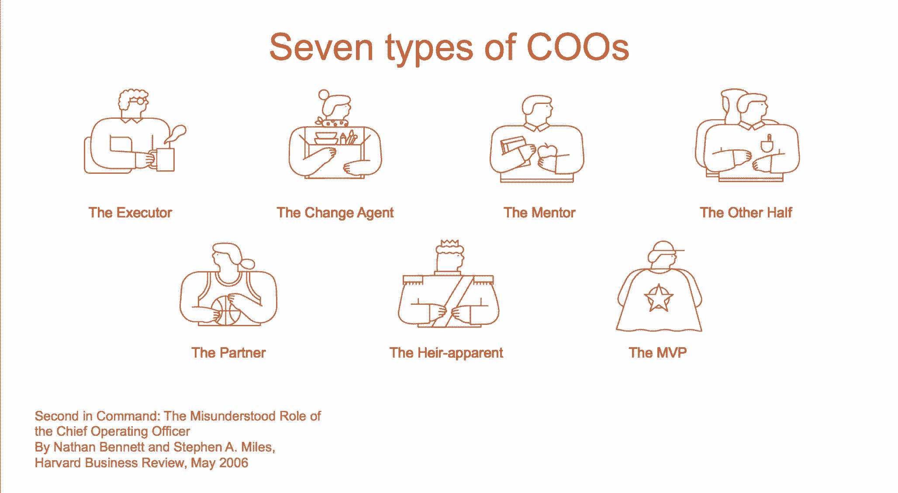

# 让运营成为你的秘密武器——以下是第一轮评估的方法

> 原文：<https://review.firstround.com/make-operations-your-secret-weapon-heres-how>

在 **[Etsy](https://www.etsy.com/ "null")** 、首席运营官 **[琳达·科斯罗斯基](https://www.linkedin.com/in/likozlowski?authType=NAME_SEARCH&authToken=FdCV&locale=en_US&trk=tyah&trkInfo=clickedVertical%3Amynetwork%2CclickedEntityId%3A1634039%2CauthType%3ANAME_SEARCH%2Cidx%3A1-1-1%2CtarId%3A1477922761388%2Ctas%3Alinda%20kozlowski%20etsy "null")** 率先进行国际扩张，统一并开始发展其营销计划，开始重新定义公司品牌，推出新的传播战略，并开始将用户反馈整合到产品开发中——所有这一切都在大约六个月内完成。虽然其他人可能只是称赞她的能力，但她很快引用了首席执行官查德·迪克森提出的计划。他不仅概述了她的具体行为将如何为 Etsy 的客户带来变化，还概述了她的角色将如何与领导团队的其他成员联系起来——尤其是迪克森。这种精确带来了效率。

Kozlowski 是新一批首席运营官中的一员，他们正在利用各种角色的专业知识来创建提升整个公司的系统。在 Evernote 和阿里巴巴等公司，她在全球扩张、市场营销、公共关系、客户体验和业务发展方面担任领导职务。几十年的广泛接触不仅向她展示了每个功能领域的运作杠杆，还展示了如何协调这些杠杆以使初创公司取得成功。

在首轮 CEO 峰会上，科兹洛夫斯基将聚光灯对准了高管层中最神秘的角色。她概述了公司为什么以及如何将运营作为核心，以及如何确定适合你的首席运营官。Kozlowski 分享了什么是运营领导者，什么不是，以便在任何创业公司建立成功的职位。

# 什么是首席运营官，你为什么需要它？

由于角色不明确，初创公司在引入运营领导者之前等待太长时间是很常见的。其他高管职位的职责更直观:CMO 领导营销，首席技术官监督工程。但是对于首席运营官来说就不那么明显了。甚至在谷歌上快速搜索一下定义也有很多不足之处:“负责管理公司日常运营的高级管理人员。”但是职能部门不是都有自己的运营团队吗，比如销售[和销售运营](http://firstround.com/review/the-company-changing-magic-of-sales-operations-done-right/ "null")？

“我们都熟悉技术运营，但首席运营官真正的意思是业务运营:**你如何运营你的业务，思考战略，并推动业务增长，”**科兹洛夫斯基说。“首席运营官的角色是每家公司的定制，需要首席执行官和创始人深刻的自我意识，以概述他们需要的合作伙伴的具体技能和素质。”

【首席运营官的角色完全由其与 CEO 的关系来定义。

**自我评估，找到你的对手。如果你的管理团队是一个电影摄制组，你的 CEO 和首席运营官将是导演和制片人。“如果你想彻底改变你的组织，你的首席运营官必须是首席执行官和其他高管团队的补充，”科兹洛夫斯基说。“每个公司、领导团队和业务阶段所需的技能都是不同的。我的优势领域是通过战略、营销和一致的客户体验来扩展具有重要全球影响力的公司。我与有技术背景的首席执行官合作得最好，我可以帮助他的策略在我们走向市场时发挥作用。但根据所处的阶段和高管团队的构成，每家公司的情况会有所不同，它会随着你的成长而发展。做好接受和适应自己需求的准备。”**

确定合适的候选人需要深刻的自省和 Kozlowski 所谓的**自我意识 301** :这是一门高级课程，旨在指出你的优势和劣势，并认真思考这些属性如何影响你管理企业的方式。问自己这些问题来揭示你需要的首席运营官的特质。

我被什么吸引了？你喜欢、默认并擅长这些任务。写下来。说真的。回到他们身边，注意他们是如何安排你的一天和管理风格的。

我在拖延什么？我们的收件箱或待办事项列表中都有一些挥之不去的事情，我们会推掉它们，或者告诉自己“我明天再做”，但从来不会去做。也许你没有足够的时间，但是你需要承认这其中可能存在技能差距。当它们出现在你脑海中时，列一个清单，确保它们是你首席运营官中的特质和能力。

**我希望自己知道并喜欢什么？**在你拖延或只是浅尝辄止的事情中，你希望对哪些事情有更好的掌握或更大的兴趣？你最终会擅长并被这些领域所吸引，但在短期内，你需要找到发展它们的方法。你的首席运营官应该像一个导师一样指导你。

先自己回答这三个问题。不太可能有另一个联合创始人或同事在你职业生涯的每一步都与你共事。所以你最清楚自己喜欢做什么，哪里需要改进。一旦你有了这些问题的答案，Kozlowski 建议把其他人作为一个共鸣板。这些人可能包括你的高管团队、董事会和投资者、导师、合伙人或高管教练。“不要引导他们的思维或者来太多的前言。科兹洛夫斯基说:“无论是口头还是书面表达，都要鼓励他们考虑你是谁、你擅长的角色以及你需要成长的领域。

“当你向你的高管团队、董事会和投资者征求关于你需要改进的地方的关键反馈时，有一点需要注意。科兹洛夫斯基说:“作为首席执行官，尤其是一家年轻公司的首席执行官，你可能一直在不知疲倦地努力提升自己，证明自己的领导力，这样人们才会对你有所承诺并投资。“现在不是向他们保证你知道如何做所有事情的时候。你要的是坦诚，而不是附和。求反馈，沉默。感谢他们为你播放的任何东西。”

把它想象成一个谜题，你的首席运营官将填补缺失的部分，以完善你的领导团队。

**定制并选择您的平衡块**。现在你知道你需要什么，你可以开始寻找最有能力帮助你扩大公司规模的首席运营官。根据《哈佛商业评论》的一篇文章，有七种类型的运营领导者。鉴于首席运营官必须是首席执行官和创始人的补充，你可能需要结合这些角色来区分适合你的合伙人。

“我是另一半，也是遗嘱执行人，这是相当常见的类型。与我共事过的首席执行官们往往拥有与我互补的技能。科兹洛夫斯基说:“我们的能力合在一起比单独发挥更好。“例如，如果一位首席执行官给公司带来了宏伟的愿景，我就可以让这个计划得到可扩展的执行。对于另一位主要在美国做生意的首席执行官来说，我带来了丰富的全球扩张经验。”

当然，有不同的 CEO-首席运营官组合。“你可能在寻找接班人，一个你正在培养成为下一任首席执行官的人。或者，如果你是一位年轻的创始人，也许最好的选择是一位经验丰富的导师，他可以传授智慧，帮助管理企业，”科兹洛夫斯基说。“没有完美的公式，许多首席运营官都是两三种类型的组合。谁适合你的公司取决于首席执行官缺乏和需要发展的技能——对于年轻的首席执行官来说尤其如此。”

在意想不到的地方寻找候选人。不要只向金融领域的 MBA 或资深人士伸出橄榄枝。科兹洛夫斯基在进入阿里巴巴的营销和运营部门之前，在公关和传播部门工作了近 20 年。“这非常合适，因为我之前培养的技能非常适合这个角色:预见问题、传达清晰的愿景、理解接下来会被问到什么，以及在出现问题时如何摆脱困境，”她说。“作为首席运营官，我每天都依靠这些技能。不要一开始就限制你的搜索参数。”

正确的首席运营官讲的不是血统而是精确的契合。

# 运营冠军的五大特质

不管你需要哪种类型的首席运营官，对于一个运营领导者来说，有些特征是不容置疑的。当你审查这个职位的候选人时，这里有五点需要注意:

**信任。**这个词在商业中经常被提及是有原因的，但它在首席执行官和首席运营官之间尤为重要，因为他们在做决策时必须保持同步。“如果你和本该是你另一半的人没有坦诚的关系，你就无法和他们一起创业。句号。科兹洛夫斯基说:“这不仅仅是要相信他们的直觉和能力，还要发自内心地知道，他们会和你一起步入混乱，解决他们的问题，同时保护你。”。“一开始就要看是否有信任的潜力，这是一个挑战。新首席运营官——和任何新员工一样——会想要展示她是如何指挥新工作的每一部分的。但是不要忘了在早期将首席执行官作为一个特别具有挑战性的选择的顾问。带来选择、智慧和意见，但也有弱点和真诚的要求。这不仅仅是一个在艰难的决定中走到一起的机会，也表明你相信在这段关系的早期，两个人比一个人要好。”

**久经考验的执行力。**最好的经营者是坚持不懈的实干家。 **"** 要求候选人提供具体的例子来展示推进项目的能力。科兹洛夫斯基说:“注意他们引用了多少例子，追溯了多远，以什么样的节奏或间隔。“你不是在寻找一蹴而就的奇迹，而是那些重置为跳过一个又一个障碍的人。考虑问问他们会先为你的公司做些什么以及如何做。寻找植根于成熟战略和战术的明确答案。”

拥有一个首席运营官，你要的是一个泰然自若地领导她的位置的人，而不是一跃而起的人。

**自我检查。**根据科兹洛夫斯基的说法，最好的运营领导者是谦逊的、渴望工作的、随时准备工作的。“首席运营官通常被认为是首席执行官的继承人，但现在还不是时候。科兹洛夫斯基说:“重要的是，你的候选人要控制好自己的自尊心，清楚地了解自己支持企业的责任。“询问他们在过去职位中的进步，以及他们成长的动力是什么？这会帮助你了解他们的职业目标和激励。向推荐人索要候选人如何处理自己犯错时的详细故事。

与首席执行官的化学反应。首席运营官是真正的合作伙伴，而不是同事**。**谚语“不要聘用你喜欢的人，聘用能胜任工作的人”并不完全适用于首席运营官这个角色。科兹洛夫斯基建议创始人和首席执行官们坦率地说出他们设想的与首席运营官的关系。“你们大部分时间都将在一起。她说:“你需要有一种个人关系，在这种关系中，你真正喜欢和他们在一起，互相倾听和交谈，一起工作。”。“不要只想着如何在面试过程中测试自己的个人适合度。**比起失败，我更喜欢问他们对某事感到尴尬或不确定的时候，以及他们是如何应对的。这涉及到解决问题和人性的一面。**我也喜欢谈论其他非常成功的工作关系，因为这真的有助于减少闲聊，有助于更好地评估是否有化学反应。你所寻求的是建立真正关系的基础。”

**多才多艺。** [适应性一定是他们默认的心态](http://firstround.com/review/the-adaptable-leader-is-the-new-holy-grail-become-one-hire-one/ "null")。“你的首席运营官是二把手，当你不在办公室时，他将是你团队的得力助手。科兹洛夫斯基说:“他们应该散发出与你所拥有的相似的领导特质，这样你的团队才会自信地依赖他们，而企业也不会因此而停滞不前。”。“最成功的首席运营官是多面手。在面试过程中识别这种特质的一种方法是，强调一系列广泛的增长挑战——从招聘高管团队到融资——以了解候选人如何在公司发展的转折点转移他们的注意力。”

当您确定这些关键品质时，也要注意以下危险信号。根据 Kozlowski 的说法，你的运营主管是**而不是**:

**CEO。**这又回到了自我检查。你的首席运营官必须接受并内在化他们的工作是管理比赛，而不是叫牌。

**保姆。首席运营官不是首席执行官的保姆或助手。可悲的是，这是一个令人不安的趋势，注定会让这对搭档和公司失望。不要雇佣保姆。**

需要“头衔”才能加入的人。如果你需要在候选人的头衔上加 Chief 来说服他们加入，那就根本不要加。

Linda Kozlowski at the First Round CEO Summit

# 雇佣首席运营官的恰当时机

鉴于首席运营官的职位描述对许多初创公司创始人来说是多么模糊，时间表甚至可能是一个难以破解的谜。然而，每个公司都需要有人来领导运营。关键是在你准备好之前就开始思考和准备。为了找出时机，Kozlowski 分离出一些关键变量，例如，如果你正在创建一个物理或数字产品，或者你如何评估自己的个人领导风格。以下是她的建议:

如果你生产的是实物产品，立即雇佣。首席运营官是生产有形商品的公司的骨干。“物流和运营决定着一家 CPG 或硬件公司的起步和发展。你需要一个有制造实物产品经验的人，他可以从端到端地参与、构建和监督开发、制造和运输。从第一天起就让某人担任这一角色，这是准时交付产品和错过发布会的区别。”

**如果你开发数字产品，当你的产品符合市场需求时，就开始招聘。**首席运营官将数码产品推向新的高度。“如果你正在打造一款数码产品，当你的产品已经适应市场，并准备扩大规模时，是时候雇佣一名运营经理了。“首席运营官习惯于建立和管理快速扩张的业务，”科兹洛夫斯基说。“在你准备好成长之前就雇佣某人——比如你还在测试阶段——会让应聘者感到沮丧，因为缺乏可衡量的变化和进步。这并不意味着你不能早点开始寻找；只是在你吸引到满意的用户之前，不要这么做。”

**如果你是创始人或首席执行官，并且完全投入到技术开发中，那么就立刻聘用他。根据科兹洛夫斯基的说法，这条规则胜过其他两条。“如果你 100%专注于开发你的技术，而不想管理日常事务，那就不要试图离开首席运营官。科兹洛夫斯基说:“聘请一位运营主管来管理企业的物流方面，这样你就可以专注于产品开发。”“我在初创公司中经常看到这种情况。这并不意味着他们的首席执行官或创始人不能或不愿发展这些运营或管理技能。但他们只是需要一个擅长建立和扩展流程的人来引导和发展他们的公司。”**

# 运营领导者的入职培训

如果你已经发现、吸引并雇佣了一名首席运营官，最后一个关键步骤就是整合他们。同样，因为首席运营官是一个经常被误解的角色，它也是最容易失败的角色之一。首席执行官和创始人，要高度警惕如何向团队介绍你的首席运营官。方法如下:

**具体跟公司说一下** ***为什么现在*** **。科兹洛夫斯基认为首席执行官和创始人犯的最大错误是说:“我雇佣首席运营官是因为我需要帮助。”相反，问自己以下问题，以帮助你准备和构思一个强有力的叙述，与你的团队分享:**

我需要什么样的帮助？我为什么需要它？它将如何解决障碍？

这个障碍对公司的影响有多大？

这个人到底会做什么来减轻来自这个障碍的影响？在下一个季度和下一年，这种情况会有什么变化？

“我们已经能够在 Etsy 实施和扩展运营变革，因为 Chad 向我和团队的其他成员清楚地展示了增长机会。科兹洛夫斯基说:“我们从一开始就一致同意我们的目标。“例如，Etsy 面临的一个机会是如何在美国和海外发展和扩大营销规模，以支持海外买家和卖家。鉴于我在 Evernote 和阿里巴巴工作的国际范围，我加入是为了补充高管团队的现有优势，让我们每个人都能利用各个领域实现增长。Chad 定义这些角色并赋予每个角色真正的自主权是快速整合和强大团队的关键。”

一个首席运营官帮你盖双地，以及双降。她应该被视为一个倍增器。

以奥林匹克运动员的精准传递接力棒。作为首席执行官和创始人，你可能已经与你的直接下属建立了深厚的关系。解释他们将向新高管汇报是首席运营官整合过程中最棘手也是最能说明问题的部分。

“尽管更新了组织结构图，团队成员还是希望继续向首席执行官汇报工作。科兹洛夫斯基说:“首席执行官处理这种转变的方式，既可以强调也可以削弱首席运营官的重要性。“大多数创始人会继续指导他们的员工，并与他们进行一对一的会谈——毕竟，他们从一开始就在那里。但这是最危险的陷阱之一。取而代之的是，让首席运营官和你一起慢慢开始领导会议。帮助首席运营官与团队建立关系，并让他们清楚新结构的样子。这既需要时间，也需要警惕，但这是关键的一步。”

这种转变不会在一夜之间发生，如果团队成员不能如愿，他们还是会来找你。首席执行官们必须解释为什么运营中心对公司来说是必要的，并把他们引向首席运营官。这在 Kozlowski 融入 Etsy 的过程中尤为重要。Chad 在开始之前通过全体会议*向公司介绍了 Kozlowski，让每个人都对领导团队的附加技能感到兴奋。他从一开始就清楚她的职责范围，这意味着她上任的第一天，每个人都准备好了和她一起工作。最终，在这一点上，你为寻找和达成合适的合作伙伴所付出的所有努力都将付之东流。用同理心积极管理过程，抵制微观管理的冲动。*

# 把这一切联系在一起

在首席运营官成为首席执行官和初创公司的可能性之前，它必须首先引起人们的注意。首先，对你作为 CEO 或创始人的优势和劣势做一个简短的自我评估。用你现有的管理团队和顾问的观点来补充。定义你的平衡，并把这七种首席运营官作为工具。面试时，寻找任何类型的首席运营官都需要的五个特征，并注意三个最常见的危险信号。如果你正在制作一个实体产品，请立即雇用一名首席运营官；如果你正在制作一个数字产品，请在产品/市场适合之后雇用。像雇佣首席运营官一样认真地整合她。你的方法会推动或驱散她在那里的理由。

“最后，别忘了放手。作为创始人兼首席执行官，你的公司是你的宝贝，你可能抓得太紧了。“是的，你应该随时了解正在发生的事情，但在你真正交出权力之前，你的首席运营官不会有机会做出任何真正的改变，”科兹洛夫斯基说。“专注于*你*需要做的事情。不要微观管理她。你[越早放弃那些职责](http://firstround.com/review/give-away-your-legos-and-other-commandments-for-scaling-startups/ "null")，她就能越快完成她的角色。当你为首席运营官的成功做好准备时，你并没有失去控制权，而是对公司的未来有了更多的控制权。”