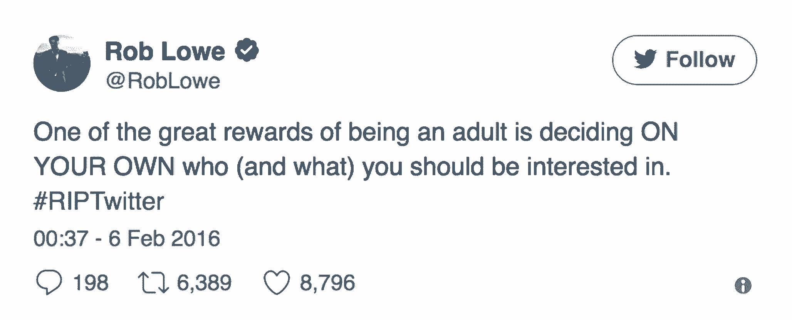

# 毫无疑问地做出产品决策——我从 Twitter 和 Slack 学到的经验

> 原文：<https://review.firstround.com/make-product-decisions-without-doubt-my-lessons-from-twitter-and-slack>

脸书的新闻。LinkedIn 的“谁查看了你的个人资料”功能。现在，Twitter 正朝着每条推文 280 个字符的方向发展。在这些功能问世之前，人们进行了长时间的辩论。让我们从推特小组 PM 和核心产品总监 **[Paul Rosania](https://twitter.com/ptr "null")** 的 **[Slack](https://slack.com/ "null")** 说起，他们以开发数百万人每天使用的界面为职业。即使对于还没有被广泛体验的产品，一个功能变化的暗示经常会在产品团队的支持者和传统主义者之间引发激烈的争论。不管最终的决定如何，在发布的每个特性选择上总会有细微的疑问，让产品团队疑惑:如果我们做了错误的决定呢？

这种感觉对 Rosania 来说并不陌生，他在过去的十年里一直致力于开发软件，希望能拉近人们之间的距离。如今，Rosania 领导着 Slack 的核心产品团队，该团队负责 600 万每日活跃用户和 43%的财富 500 强企业使用的消息、频道、文件和 Slack 的其他部分。此前，他在 Twitter 领导时间线团队，在那里他率先过渡到一个按算法排序的提要。作为一名[产品合作伙伴](http://co-op.vc/product/ "null")，他与一小群其他产品负责人合作，为初创公司的创始人提供建议和投资。

在这次独家采访中，Rosania 剖析了让他汗流浃背的四个关键产品变化，以及他用来战胜伴随这些变化的疑虑的策略。无论你是一个面向数百万人的平台，还是刚刚起步，调整或添加功能可能会让你丧失信心——但它们不必如此。请继续阅读 Rosania 关于如何消除因发布和改变产品功能而产生的疑虑的建议。

# 毫无疑问

围绕产品是否应该与用户行为产生共鸣或改变用户行为，有很多相互矛盾的建议。答案很可能是两者的混合——因此争论激烈。但是，当这种情况发生时，这种钟摆摆动可能会对产品团队产生不利影响，因为他们在寻找弥合客户期望和他们可能想要或需要之间的差距。以下是四个主要的特征变化，以及 Rosania 如何克服他们的疑虑。

并不是每一个产品的变化都会促使山姆·西博恩(Sam Seaborn)和 T2(Chris Traeger)站出来说话。但对罗莎妮亚来说，产品决策背后是经过深思熟虑的——他觉得这是必然会发生的。“不可避免的是，一个排序的时间表会比一个纯粹的时间表更成功，”Rosania 说。“首先，人们在他们的时间线中最多只会阅读十分之一的推文——通常要少得多。第二，质量是按照有规律的逆时间顺序随机分布的。当你每天查看时，你可能不会得到高质量的推文。你得到的是一个随机样本，它更有可能是平均值。那么，我们为什么不到处换一些更有趣的东西呢？即使是最小的调整也必然是一种进步。”

挑战的一部分是消除用户的误解。“一个常见的对位法是:‘时间倒序很重要，因为它让人感觉新鲜。’“人们会说，‘推特是关于现在正在发生的事情的——你给我看一条三天前的推特就毁了它，’”罗萨尼亚说。但问题是，使用算法并不意味着给你看一条三天前的推文。30 分钟前的一条推文呢，如果从那以后已经有 500 条推文了呢？让我们把那个往前拉，把 10 分钟前的东西再往后推。每一次换人都是一个小小的进步，也许通过这样持续的换人，你的参与度会提高十倍。"

如果说罗莎妮亚似乎把这个逻辑挂在嘴边，那是因为在他离开后 Twitter 的排名时间表上线之前的一年半时间里，这个逻辑是数百次对话中的首要问题。在新的时间线推出之前，他用了一些策略来检验自己的直觉，质疑自己的怀疑。

# 量化行刑队。

有了排名时间表，他的一些最狂热的诽谤者每天都和他在一起。“即使在 Twitter 内部，当我们探索这种变化时，人们也抵制它。Rosania 说:“Twitter 上的每个人都敏锐、好奇，并愿意分享他们的观点。“当然，许多人都是超级用户。他们对自己帮助建立的东西感到拥有——包括他们的个人时间表和 Twitter 本身。所以，毫不奇怪，许多人认为时间线是精心制作的东西——并且会告诉我:‘你怎么能进我的房子，重新整理我的东西？’"

冗长的电子邮件导致这些类型的情绪反应恶化，而不是解决。“事实证明，书面形式通常是人类之间争论的一种具有挑战性的媒介——特别是在一家大公司，人们并不总是有个人联系，可能没有预先存在的共同点，”Rosania 说。“因此，我专门拨出时间亲自会面并进行讨论。我欢迎公司里的每个人。如果人们有反馈，我会告诉他们来谈谈。”

你要把行刑队和暴民分开——那些人是在正义的层面上行动，而不是愤怒。

这些行刑队会议并不总是令人舒服——事实上，一想到它们，罗莎妮亚就会感到不安。“显然，以一种开放的态度和倾听的方式与和你意见相左的人交流是非常重要的。但是这些真正聪明的人正在努力使 Twitter 成功，他们认为我是一个十足的白痴。这可能会令人不安，”罗萨尼亚说。“会议对此有所帮助。除了获得反馈，我还量化了有多少人感觉足够强烈，愿意留出时间进行辩论，而不是通过电子邮件快速拍照。办公时间促进了这一点，并作为一个初步的肠道检查。如果你是一个只有十个人的创业公司，希望你不会有五个人认为你的提议很愚蠢。但在更大的公司——Twitter 当时可能有 3000 到 4000 人——你可能会找到 100 个人站出来。”

# 种一棵假设树。

罗莎妮亚对他的想法感觉如此强烈，以至于在与他的内部反对派交谈后，他希望看到它要么不受天气影响，要么枯萎消失。这不仅意味着时间安排，还意味着组织他与同事的会议。“我经常使用但很少听到讨论的一个工具是**假设树**。如果你不熟悉它，它的想法是你有你相信的东西，在它下面，你列出有助于实现它的支持信念，”Rosania 说。

“因此，在这种情况下，我认为机器排序的时间线将是一种更有效的方式来了解世界上正在发生的事情。有助于这种信念的是这样一种观念，即机器学习和人工智能的进步正在产生比过去更好的相关性算法。这种信念还包括这样一种想法，即大多数人不会阅读摆在他们面前的所有东西，有些东西他们很感兴趣，但他们不会通过我的跟踪图看到。这些都是可以独立验证的假设，支持或反对它们的证据会加强或削弱核心理论。”

Example of a Hypothesis Tree

假设树结构的力量在于，它不仅可以在逻辑上削弱或加强你的信念，还可以帮助你将逻辑上的担忧与厌恶改变和围绕你想法的其他恐惧分开。

“所以说，我正在努力解决一个绝对的问题，即我不会阅读摆在我面前的所有东西。罗莎妮亚说:“我可能会说，如果你只打算阅读整个时间线的 10%，我可以给你一个比你通常看到的随机的 10%更好的 10%。“那只是一个简单的数学猜想。但人们经常回答说，“你无法创造出我喜欢的体验。我不认为电脑比我更擅长这个。你正在失去控制。突然间我们开始谈论对失去控制的恐惧。我们从假设转移到关于恐惧的争论上。提问从“这可能吗？”到“我喜欢这个吗？”**假设树帮助你抓住这种替代，并聚焦辩论。**你可以说，‘好吧，那么如果我们能让算法产生良好的体验，那会消除你的恐惧吗？或者这里隐藏着另一种假设？"

罗莎妮亚寻求让自己沿着假设之树向下移动的对话，而不是徘徊在顶端。“如果我的假设是‘我相信机器排序的时间线将是消费正在发生的事情的更有效的方式’，而担心的是‘没有机器能像我了解自己一样了解我’，那么我们就不够深入，”Rosania 说。“在讨论产品变化时，我的目标是超越我们的本能反应，测试假设树中支持点的有效性。关注较低层次的人可以缓和一些情绪，让讨论更有成效。”

一棵假说树有助于解剖疑惑。它只是一个总体论点和支持点的结构。

假设树不仅仅是从一开始就确认你的想法的练习——它们也可以用来迭代和调整现有的产品。例如，他们帮助 Rosania 承认 Twitter 的紧凑性和信息密度实际上是有益的。“关于我们如何处理时间轴中的照片，我们有一个顶级假设，一位队友提出了一个观点，即高照片占据了垂直空间，降低了可滚动性。这是一个新的支持我们的树的假设。我一直认为富媒体是社交媒体的一个非常重要的属性。罗萨尼亚说:“人类是视觉和社交网络，利用了这一点——如 Instagram 和脸书——往往比没有利用这一点的人发展得更快。“我认为这是一个公理，但当时，我们从未证明在 Twitter 上展示更多、更高的照片确实更好。”

通过 A/B 测试和其他实验，Rosania 的团队最终得出结论，较高的推文导致人们较少阅读他们的时间线，并因此更新了他们的顶级假设。但是具体的结果并不是重点。“关键是打破你的信念，找出值得检验的论点。在这种情况下，我的信念更多的是源于信仰，而不是实际的科学，”罗莎妮亚说。“这个潜在特征的转折点是假设树讨论。我们深入到一些具体的、可测试的东西，我们学到的东西改变了我们的世界观。”

# 松弛:请勿打扰

Slack [在 2015 年末推出了其免打扰(DND)功能](https://slackhq.com/knock-knock-introducing-do-not-disturb-b3c91dcb6c8d "null")。Rosania 说:“我们决定在默认情况下为所有用户打开勿扰模式，因此在每个成员声明的时区中，通知将在晚上 10 点至早上 8 点之间关闭。“当时，我们拥有近 200 万 dau(日活跃用户)和超过 5000 万美元的 ARR(年度经常性收入)。总而言之，存在重大的商业风险。将此作为产品第一个版本的一部分是一回事。当你影响到现有客户时，就很难做到了。”

在发布之前，同事们担心这个决定是家长式的。“工程师会告诉我，‘我在随叫随到。如果我在一家公司，不知道这一变化，我可能会错过一个页面，我的网站将离线。人靠懈怠。“我们确定吗，””罗莎妮亚回忆道。像这样的对话在团队内部引发了很多争论。”我们考虑是否祖父现有的团队，所以免打扰是完全默认关闭。我们讨论了如何处理那些将时区设为默认的太平洋时间，但却住在别处的人。我们为许多其他场景和用例感到苦恼。"

但是到了最后，Rosania 和他的团队不得不将他们对该功能的立场与某些东西联系起来——否则它会在所有可能的风险和怀疑下被侵蚀。“我们回到了我们的使命:**让人们的工作生活更简单、更愉快、更有效率**。或者在办公室经常听到的相关的、更非正式的格言:“**努力工作，回家**。“考虑到这一点，这个决定是显而易见的，”Rosania 说。

有一颗清晰的北极星跟随，有助于 Rosania 和他的团队做出最终决定，并更容易地抛弃对该决定的怀疑——因为他们相信，将 DND 设为默认从根本上强化了 Slack 的意义。

**更简单、更愉快、更高效的交流。**“比方说我半夜醒来，脑子里想了些事情。我可以给你发一条消息，知道它会触发推送通知，但那可能会吵醒你，让你紧张，”罗莎妮亚说。“如果我知道这不会打扰你，因为除非你明确决定签到，否则你要到早上才会看到我的消息，那么我会怎么做呢？这难道不会让你不觉得有压力，让我不觉得自己是个混蛋吗？这比许多人试图做的要好得多:出于礼貌的愿望，记住他们的想法，直到第二天他们知道他们不会打扰你。”

**努力工作，回家。**“你能想象在一家所有人都在线的公司工作，并决定‘我要打开一个设置，这样人们就不会在晚上 9:00 后打扰我’吗？你能想象这样做并期望自己和坐在你旁边的人一样有可能得到提升吗？”罗莎妮亚问道。“如果自动免打扰功能默认关闭，我们会要求人们这么做。我们现有客户接受“请勿打扰”的唯一方式是，我们出来说，“我们认为这对大多数团队来说都没问题，顺便说一句，如果你愿意，你可以改变你团队的默认设置。”作为工具制造商，我们有机会为 Slack 的使用方式设定一个标准，而个人不一定能自己定义。"

Slack 为不喜欢或不想要默认设置的用户提供了选项，但不足以损害他们的使命或怀疑他们的世界观。

“我们让每个人一开始就启用它，因为我们知道大多数人只会心存感激。对于那些需要不同东西的人，我们给了他们选择退出的工具。为了简化过渡，我们提前通知了管理员，如果他们愿意，让他们关闭整个团队的默认设置，”Rosania 说。“最终，每个人都得到了他们需要的控制，但你可以清楚地看到我们的使命和信念被编码到产品的设计和默认设置中。为了有一个更愉快、更有效率的工作日，你需要好好休息，不要在半夜感到紧张。在许多方面，这适用于现有客户，甚至超过新客户，因为现有客户在选择 Slack 时购买了这一愿景。”

外卖？当你怀疑自己的产品决策时，**退后一步，问问自己:我对这个世界的信念是什么，它会把我们推向那个方向吗？**

“对于 DND，如果我们对它进行了 A/B 测试，但失败了，我就不会得出结论，无论如何我们应该在半夜叫醒人们，”Rosania 说。“不要被反映你的世界观的产品的 A/B 测试部分所束缚。在 Slack，我们相信以某种方式完成工作，相信那些令人愉快和有趣的产品，它们能帮助你度过工作日，并像对待人类一样对待你。这就是我们决定如何处理 DND 的原因。人类需要八小时睡眠。软件不应该是为不需要睡眠的人设计的。”

有一种谬论让聪明人上当:我们必须 A/B 测试。我们永远无法从工匠的角度来看待某样东西，并知道它是否好。

# 你不在时的 Twitter 和 Slack 的线程

《当你不在的时候》( WYWA)是 Twitter 第一次尝试脱离按时间顺序排列的订阅源，就像 Threads 是 Slack 第一次在频道中脱离详尽、连续的订阅源一样。在当时，这两者对产品的用户来说都是巨大的偏离。

“WYWA 把一大块相关的推文贴在用户订阅的顶部。“这是分级时间表的前身，大约一年后推出，”罗萨尼亚说。类似地，线程给通道带来更多的相关性。如果你在一个 200 人的公司，你可能不需要参加所有的讨论。线程允许人们创建侧边栏，因此主提要中的信噪比更好，用户仍然可以弹出他们感兴趣的线程。"

对于这两个功能，它们都是公司已经在运行的功能的延伸。

“对于 WYWA，我们已经编码了将广告插入我们的时间线的方法，所以我们已经有了将按时间顺序排列的部分放入 feed 的机制。罗萨尼亚说:“从工程角度来说，使用机器学习突然为每个客户大规模生成完全不同的时间表会更加困难，所以我们从插入这个单元开始。”“至于线程，我们多次从客户那里听到各种工作流，他们希望在一个通道中进行多次短暂的讨论，如辩论和批准业务提案，或发布和讨论公告。线程允许人们在这些类型的事情上附和，而不会产生噪音或互相交谈。像 DND 一样，它可以提供更愉快、更高效的体验。”

从根本上改变一切是不是更好？解决这个问题的一个方法是从根本上改变你现有产品中的一切。

这里的外卖在于【Rosania 是如何用这些产品让异议低升，给用户“往返票”。当 WYWA 推出时，*纽约时报*报道说，[没有办法关闭这个功能，但如果用户足够忽视它，它就不会经常出现](http://mashable.com/2015/01/21/while-you-were-away/#Sln5YReNvqqy "null")

“你可以轻易地忽略这个模块的事实非常重要，因为它让我们相信，看起来积极的参与不仅仅是人们不知道如何提供负面反馈。Rosania 说:“如果你能处理好订单量，另一个验证你的愿景或疑虑的策略就是让顾客很容易就能对你唠叨个不停，如果他们不喜欢某样东西的话。“通过线程，我们建立了一个复选框，如果被选中，就会像人们习惯的那样，在频道中播放回复。这样，线程会完整地返回，不在线程中的人可以看到结果。这就像是被动参与者的免费往返机票。”

Rosania

# 没有怀疑的余地

在自己或同事的怀疑蔓延之前，开发产品已经够难了。在推出任何新功能或调整功能之前，在内部正面解决这些犹豫。

从通过电子邮件进行辩论开始，提供直接的人际接触来征求反馈(例如办公时间)。

量化抽出时间提出异议的同事。不要只是罗列它们——在假设树的帮助下获得建设性的批评。

此外，通过问自己来解决任何疑问:我相信这个世界是什么样的，它会把我们推向那个方向吗？这有助于了解该特性是否应该进行 A/B 测试，或者是否应该根据贵公司的世界观进行测试。

最后，让客户的异议不那么明显(比如一两次点击)，让用户回到熟悉的地方。

“对于那些正在开发产品的人来说:如果你还没有，那么当你在开发一个功能时，你会问自己‘我疯了吗？’或者‘我怎么知道我什么时候会远离深渊？罗萨尼亚说:“当你的员工少于你所能指望的人手、几个月的资金和产品上市的最后期限时，这些问题会变得更加沉重。如果你一头扎进来自你的团队和你自己的公开质疑中，你会帮你自己一个忙。这个过程会让你回到产品的目的、公司的世界观，更重要的是，你的直觉。我想不出没有这三者的存在，还有哪一种产品能持久耐用。"

*Getty/日落大道/Corbis Historical 的形象礼仪。*