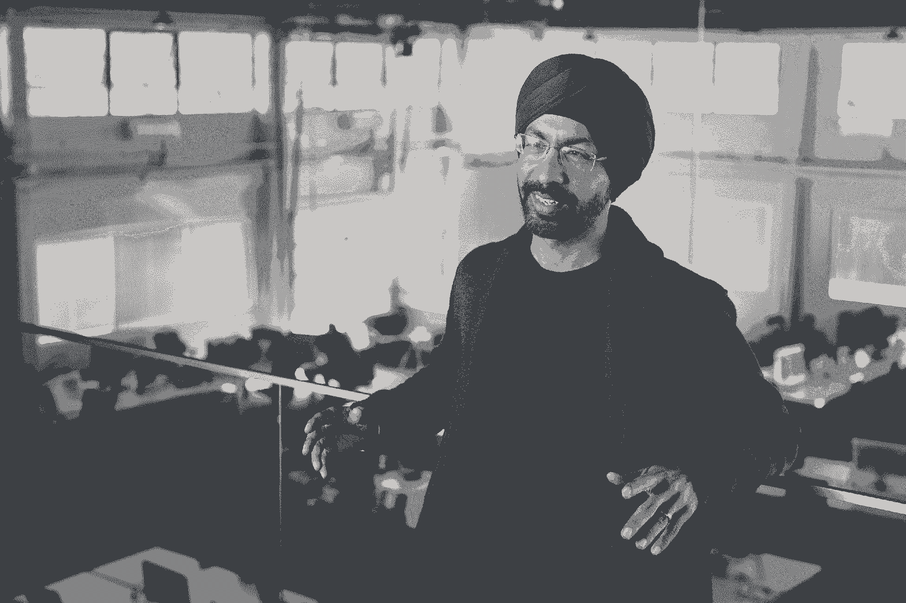

# 导航从大型科技公司到创业公司的飞跃——来自前谷歌和 Flipkart 高管的建议

> 原文：<https://review.firstround.com/navigating-the-leap-from-big-tech-to-startups-advice-from-a-former-google-and-flipkart-exec>

2015 年 10 月 13 日晚上 11 点 58 分， [Flipkart](https://www.flipkart.com/ "null") 的产品和工程团队在一系列作战室集合。这是印度电子商务巨头年度轰动事件“十亿大日子”的前夕。手机即将上市，赌注高得令人难以置信——团队知道这一事件可以在五天内带来几个月的收入。

然而，在午夜钟声敲响的时候，网站立即崩溃了。随着流量急剧下降，每一秒都意味着数千美元的损失。随着压力的飙升和恐慌的出现， **[普尼特·索尼](https://twitter.com/punitsoni "null")** 如谚语所说的那样处境尴尬。作为 Flipkart 的首席产品官，团队指望他和他的工程同事 [Peeyush Ranjan](https://www.linkedin.com/in/peeyushr/ "null") 下达行军命令。

“这是规模悖论最清晰的例证。你有成百上千的人任你处置来解决这个问题。但是你要把它们指向哪里呢？他们实际上应该去做什么？”索尼说。“我的第一反应是告诉高层领导不要插手，这样工程团队就可以埋头工作——我们会听从他们的领导。”

七分钟后，罪魁祸首被确定了——一个来自国外的 DDoS 黑客指挥了一个巨大的流量激增，使服务器过载，扰乱了这个重要的日子。Flipkart 会如何回应？

索尼对在大公司做出艰难的决定并不陌生。在加入 Flipkart 之前，他在谷歌的产品管理学院任职，最终领导了移动应用团队，之后在摩托罗拉担任软件产品管理副总裁。但午夜时分，在 Flipkart 的 Bengaluru 办公室，他意识到大规模领导有时需要从小事做起。

“我们决定做的事情实际上相当疯狂，”索尼说。“我们关闭了所有从印度以外进入 Flipkart 的流量。当然，我们会损失一些收入，但封锁大部分采购将来自的国家是值得的，”他说。“这是当时做出的一个疯狂而重大的决定，但我很高兴我们扣动了扳机，因为如果我们先去找高管们，我们会为此争论一个小时。”

从某种意义上说，这场大胆的赌博可能预示了索尼接下来将扮演的角色:初创公司创始人。在离开 Flipkart 这个庞然大物(现已被沃尔玛收购)后，索尼独自创业，共同创立并领导了 **[【淑熙】](https://www.suki.ai/ "null")** **，**一家医疗保健初创公司，为医生提供人工智能支持的语音数字助理。

在这次独家采访中，索尼反思了他从大公司的掌舵产品规模过渡到创办创业公司的过山车旅程时学到的经验教训。他分享了他对这两种经历之间差异的观察，指出了什么让他感到惊讶，什么让他感到措手不及，以及有抱负的企业家在寻求从大到小的类似飞跃时应该考虑的问题。

# 大规模解决问题的优势和挑战

在索尼离开大型老牌企业建立自己的创业公司之前，他拥有在大型机构工作的前排座位优势。例如，在摩托罗拉领导软件产品时，索尼对他的团队留下巨大而直接影响的能力感到敬畏。

“我们决定实时推送操作系统软件和核心功能更新，而不是每两年推出一次新设备，”他说。“所以当我们扳动开关时，它直接影响了数百万使用手机的人。他们在使用的最私密的设备上发现了一个新功能。这是一个将规模和速度结合在一起的例子，这是在更大的企业中工作令人兴奋的一面。”

大公司是大象——它们行动缓慢，但却能清理丛林。一点小小的改变，突然之间，你就给人们的生活带来了根本性的改变。

当然，纯粹的规模也会带来挫折。“大公司最大的问题是出于自我、不安全感和沟通不畅而产生的随机政治。索尼说:“领导者面临的挑战是如何解决这个问题。

和大多数组织问题一样，他发现解决方案归结于沟通。“无论你是在一家大公司还是一家小型初创公司，领导者的首要工作都是创建一张沟通地图。没有这一点，企业就无法运营——文化会走向没落，会做出糟糕的决定，”他说。

索尼欣然接受了通信制图师的角色，他在摩托罗拉和 Flipkart 公司担任新职位的头几周，采访了从底层到高管套房的所有人，以收集关于什么可行、什么不可行的见解。“和大多数公司一样，会议太多了。决策是在整个组织的 50 个不同的会议室中做出的。为了解决这个问题，我们创建了一个每周四小时的产品决策会议，公司的任何人都可以注册一个时间段来做出决策。如果有人带着数据、背景和几张幻灯片出现，我对他们的承诺是，在他们做出决定之前，我们不会离开房间，”他说。

即使有了新的计划和任务，与初创公司创始人的众多头衔相比，大公司的角色似乎也很有限。为了评估不满情绪是否在正常范围内，或者是时候继续前进了，Soni 推荐了一个关键比率。

# 如何创业:时机、准备和投入工作

到 2016 年春天，索尼觉得创业的警笛声太响了，不容忽视。

“我觉得在我的下一个角色中，我想解决一个对社会有明确和直接价值的问题。我还想活动一下很久没用的肌肉。索尼说:“把这两个因素放在一起，创业听起来是个好主意。“在你职业生涯的那个阶段，你可以继续做某个部门的副总裁，或者在另一家大公司担任高管。所以我觉得如果我要离开去冒很大的风险，那么正确的做法是去做一些真正有雄心的事情。对我来说，**惊人的失败和惊人的成功都比平庸的中间结果好**。

以下是索尼对有抱负的初创企业创始人在投身公司建设之前应该考虑的问题的建议:

**选好时间，准备好你的行李。**

有抱负的企业家经常会纠结于时机问题——在吸取其他公司的经验和趁热打铁进行自己的创业之间，有一个微妙的平衡。

对于职业生涯早期的人，索尼的建议很简单。“如果你是一个 22 岁的刚从学校毕业的年轻人，而且真的没有什么可失去的，那就去打败自己吧，”他说。“因为一旦你在职业生涯中走得更远，即使只有两三年，精神上的风险也会更大。”但对于那些已经在成功职业生涯飞行计划中途的人来说，就像索尼一样，从大到小的转变前景可能会感到更加令人生畏。“老实说，就机会成本而言，对我来说，在职业生涯的这个时候创业，可能需要几百万美元，”他说。

为了让自己走上创业之路，索尼开始计划。“我承诺我会努力给自己一个开办公司的许可，所以我开始有条不紊地完成我需要做的事情，”索尼说。“我知道我需要建立一个良好的网络，这样当我真的离开时，我就能与投资者保持密切联系，并与其他企业家和工程师建立关系，他们会指导我、帮助我并加入我。花时间铺设所有的轨道当然可能是多年的努力，这没关系。即使你的创业想法还不完整，也要继续一点一点来。

在索尼看来，这种固执的实用性是对一开始创办公司时所需要的有点异想天开的想法的一种平衡。

“创业不是一个明智的财务决策。从逻辑上讲，这种情况对你非常不利，没有任何意义。作为创始人投入生活是一个浪漫的决定。他说:“这是你想要冒险时才会采取的行动。“但这并不意味着你必须跳下悬崖。创办一家公司就像爬一座陡峭的山——你需要花时间准备行囊。先把自己的财务搞定。确保你可以在没有任何收入的情况下生存几年。建立这些联系。审查你的想法。让你所爱的人为即将到来的过山车做好准备。”

我能给你的最好建议是从有实力的位置开始创业。你现在投资准备的时间将促进你的创业的可持续性，更不用说你自己的幸福了。

**投入工作寻找思路。**

希望巩固这一优势地位的潜在创始人可以在寻找完美的[想法以追求](https://firstround.com/review/future-founders-heres-how-to-spot-and-build-in-nonobvious-markets/ "null")的同时，无休止地修补和转动他们的轮子。

“有一种错误的说法，认为创始人只是走在街上，他们突然意识到‘就是这样了’。”事实上，你必须投入大量的智力去弄清楚你到底想做什么。索尼说:“你需要通过阅读、勤奋、探索不同的空间，专门为这项任务留出时间。

虽然初露头角的企业家可能会想看看比尔·盖茨和马克·扎克伯格从辍学到成为亿万富翁的故事，但索尼在这里提出了一个警告。“这些都是例外。不要把例外和规则混淆了。我们知道，在生活中，除了天才和聪明，你还需要一些运气。如果你真的想创业，最好不要指望运气。他说:“仔细准备和计划。

更广泛地说，Soni 建议控制你的心态。"**记住，创业是一种特权**。你想要那种特权？努力把它组合起来。这就像进入一所顶级学校或令人惊叹的公司一样。如果你想有机会创办自己的公司，那就努力去做——不要等到灵感来了再去做。”

**担心上市，而不是产品。**

当一个想法终于出现的时候，很可能会先投入到产品制造中。索尼认为，创始人需要抵制一开始就沉迷于产品而不顾其他一切的冲动。“人们很容易陷入‘把它做好，他们就会来’的心态，尤其是如果你对自己的产品实力深信不疑的话。他说:“现在我是一名彻头彻尾的产品经理，但我会第一个告诉你，产品通常不是问题。

取而代之的是解决走向市场的问题，研究谁会购买，为什么购买，他们会支付多少。“产品更具有二元性，要么技术允许你这么做，要么不可能。索尼说:“确保你能围绕该产品建立一个可持续的商业模式是一项艰巨得多的任务。“在你开公司之前，而不是在你发展的过程中，把这些都考虑清楚。一旦你选中了这个框，你就可以成为一家专注于产品的公司。”

创业公司死于市场化的摆布，而不是死于产品之手。

**服务用户，而不是服务自己。**

索尼最终萌生了创办一家医疗保健公司的想法，但除此之外他没有太多的方向。“我在医疗保健方面毫无经验，所以我花了六个月时间跟踪医生，让自己融入大型医疗系统，以了解他们面临的是什么样的问题，”他说。“没有什么能取代面对面的观察，这是一种了解市场和产品的工具。”

有一次，他认为他可能无意中发现了一个成功的想法。“这基本上就是 Slack 为医疗保健行业所做的事情。医院里有太多的交流，似乎迫切需要这种交流。我知道我可以制造出一个伟大的消费品，”索尼说。

在休息室与一群护士共进午餐时，他提出了自己的伟大想法。“他们看着我说，‘普尼特，我用传真机、传呼机、微软 Outlook、电子病历，除此之外还有纸质文档。我不会使用另一种通信协议。事实上，如果我看到其他人使用它，我会积极尝试阻止他们，”索尼说。

批评很伤人，但护士们残酷的诚实令人大开眼界。“这是一个我个人非常兴奋的想法。索尼说:“但这是一个例子，说明当你想出这些硅谷的点子来解决用户的问题时，你需要了解他们在经历什么。

当创始人发现自己执着于一个想法时，他们会冒着拒绝接受任何似乎与这个想法相矛盾或贬低它的信息的风险。“你必须花时间问很多问题，真正倾听，但也要翻译，”索尼说。“大多数用户不一定知道他们想要什么，但他们知道什么在伤害他们。**作为一名企业家，你的工作是把伤害他们的东西转化成产品。**

如果你对自己的想法接受挑战，你将有更大的机会创造出用户真正想要的产品——而不是你认为他们想要的产品。

想象自己写一张支票。

作为准备发布前的最后一项检查，Soni 建议后退一步，真正评估这个想法和你的承诺。

“带上你的净资产，不管它是什么。然后想象自己写了一张支票。如果一个聪明的创始人向你推销同样的想法，你会给她支票吗？“如果你能看到自己在投资，那么你应该去投资那家公司，”索尼说。“当我决定接受风险投资的时候，我觉得我会从自己的个人资金中拿出 100 万美元，投入到我的创业公司，并认为这是一笔不错的投资。”

Punit Soni, co-founder and CEO of Suki

# 创业后的暴跌:来自另一边的领导力观察

有了主意，资金有了保障，创业也在进行中，索尼接下来不得不转向创始人生活中的具体细节:招聘、团队建设和领导。淑熙已经筹集了 2000 万美元的资金，成长为一个近 40 人的团队，并在此过程中取得了一些显著的成功——但这并不意味着索尼觉得他能掌控一切。

当他过渡到一家早期创业公司的联合创始人兼首席执行官的新角色时，Soni 很快意识到他对自己作为领导者角色的理解必须适应。“在很多方面，我确实感到毫无准备。但不一定是大小的问题。如果你和 50 人、500 人或 5000 人的团队一起工作过，那么你就可以处理所有的事情，这是一个常见的谬论。他说:“那是胡说八道。“这与团队的规模无关，而是与他们所经历的状态和背景有关，种子期创业公司面临的一系列考虑因素非常不同。”

在索尼的经历中，这四个挑战是他从大公司的高调职位过渡到初创公司首席执行官时必须做出的最令人惊讶也是最困难的调整。

**1。在文化显微镜下获得舒适。**

许多第一次创业的人报告说，他们低估了担任初创公司首席执行官的重要性。对索尼来说，这并没有什么不同，尽管他并不觉得自己在运营公司所需的专业技能方面力不从心。对他来说，这是更私人的。

“难的是你真的要做最好的自己。他说:“如果你想尝试创建你想要建立的那种组织，你采取的每一步和做出的每一个评论都绝对至关重要。

作为一个早期的创始人，我从来没有感觉到更多的观察。但这也令人振奋——我从未觉得成为一个更好的人有如此大的挑战。

当然，像 Flipkart、谷歌和摩托罗拉这样的公司是另一种类型的高压锅，成千上万的员工关注着领导者的一举一动。但对 Soni 来说，初创公司的不同是显而易见的。

“当你周围有成千上万的人时，你可以走进一个房间，人们知道你是来做什么的。你可以迅速做出决定。你有一把可以挥舞的重锤，”他说。“在谷歌或摩托罗拉，我可以拍着桌子说，‘不，我们不会这么做。我们走吧。这就是我们要去的地方。但是如果我在淑熙这样做了，我就允许我前面的五个人和其他人在同一个房间里这样做。这就是我们的文化。"

对许多人来说，在初创公司塑造文化似乎更容易，因为这是一张白纸；在大公司，变革需要更慢的转变。但根据索尼的经验，各种规模的公司都必然会遇到激流。“无论是在大公司还是小初创公司，文化破裂的原因只有三个:一个糟糕的演员得到了提拔，一个好演员被忽视，或者领导者自己没有成为文化的典范。其他一切都只是副作用，”他说。

**2。不要往下看，这里没有安全网。**

根据 Soni 的说法，领导一个 500 人的组织和建立一个 40 人的团队在强度和压力方面没有太大的不同。但他发现初创公司的风险要高得多。

“在大型科技公司，你只会认为风险真的很高。毫无疑问，会有一些艰难的抉择，但是你有足够的缓冲、支持和技巧来度过难关——灾难降临的几率会更小。如果你做出了错误的产品决策，它很可能是好的。索尼说:“不管怎样，人们会发现这一点，我们会想出办法重振旗鼓。”“但在种子阶段的初创公司，赌注*实际上*高得令人难以置信。如果你在小公司做出错误的产品决策，你就死定了。结束了。”

这也不仅仅是产品的问题，人员方面也存在风险。“公司某个角落的五个人因为你做了一个他们不喜欢的决定而感到沮丧并离开了？索尼说:“如果有 15000 人，这就不那么重要了。”“但在初创企业的早期，这将是灾难性的。每个人都是你整个公司的一个可测量的代表。这对你的影响是不同的。”

**3。喝下反馈的水，吞下谦卑的馅饼。**

领导一家初创公司的转变是一次令人谦卑的经历——索尼并不害怕拉开帷幕。“你这许多天都神经衰弱。他说:“有些日子很难入睡，因为所有的事情看起来都像是一场生存危机，然后你会花一整夜去思考它。”。“你已经做了很多情绪状态管理，除此之外，你还从各个方向获得了强烈的反馈:你的投资者、你的团队、你的客户、你的家人。”

这是因为每个人都对一家尚未成功的初创公司的首席执行官可以做得更好有自己的看法，而且他们也有机会直接当着创始人的面说出来。“对于 Sundar 在谷歌可以做得更好的地方，你可能有 50 个想法，但他是这家成功公司的首席执行官，所以你可能没有告诉别人。或者你连直接告诉他的能力都没有。但是 Punit 还没有证明自己，而我就在这个会议室里和他坐在一起，所以我不妨告诉他，”Soni 笑着说。

作为一个创始人，你没完没了地纠结于所有你没有做好的事情。你还必须多次吞下谦卑的馅饼——没有人比初创公司的首席执行官得到更多的反馈。

**4。雇佣同为创始人的人——成为说服候选人** ***而不是*** **加入创业公司的朋友。**

与传统观点相反，对 Soni 来说，创业招聘最困难的部分不是说服人们加入。最好的候选人——那些拥有技能、动力和信念的神奇组合的人——通常不需要说服。但是很难找到。

“在初创企业招聘员工的困难之处在于，要从出现在你门前的各种人当中筛选出有共同动机的人。索尼说:“在最初的 40 到 50 名雇员中，寻找一种创始人的心态。"**我不需要员工。我需要深切关心公司并致力于让公司运转的创始人伙伴。作为一名早期员工，你需要同样的谦逊、坚韧和激情，以及财务准备——一家初创公司永远无法支付你在其他地方可以获得的那种钱。每当我找到一个扫清这些障碍的人，总比增加 10 个没有这种感觉的员工要好。”**

询问一家初创公司是否适合你——就像你正在创办一家初创公司一样严格。同样的精神健康、财务、网络和对问题的热情的规则也适用于前 40 名员工。

当他面试候选人时，Soni 通常会花一个小时来评估这些品质。(对于更资深的雇员来说，在会议、晚餐和长途散步中的谈话可能会超过五个小时。)在这些聊天中，他使用这些策略来确保双方都合适:

**对你的创业状态保持透明和真实。“我告诉他们，‘这是我们银行里的钱，这是我们的烧钱率。以下是我的理财哲学。这就是我们给人们的，这就是你们要做的。事实上，直到 2018 年夏天，淑熙的每个人都有完全相同的工资，”索尼说。**

试着说服他们不要这样做。在摊牌之后，Soni 开始亲自解释团队正在解决的问题，他为什么关心这个问题，以及他们仍然需要做的事情。然后，他将面试转向候选人。“我问他们，‘你们为什么要这么做？你为什么想创业？他说:“事实上，在面试的大部分时间里，我都在试图说服他们不要这么做。这与我们团队中的这个人是否会成功和快乐无关。主要是这个人跟我们在一起会不会成功和快乐*。在一家初创公司，期望和压力与大公司有着天壤之别——你需要确保候选人会真正成功，这需要非常坦率地说出为什么会很难，并确保他们为自己做出正确的决定。这就好像你是他们的朋友，而不是试图雇佣他们的公司的首席执行官。"*

寻求谦逊。对 Soni 来说，这是与大公司招聘不同的另一个关键点。“在面试中，我必须弄清楚他们是否明白，他们在最后一份工作中可能是工程副总裁，但他们可能是在这里打扫地板，”他说。“在大公司，你要花很多时间来确保你能为你的团队扫清道路，让他们能够运作。在创业公司，问题就完全不一样了。不管你是高年级还是低年级，你都必须到底层去，如果需要的话，做看门人来完成工作。你必须回去做一名初级项目经理[写项目发展报告](https://firstround.com/review/product-leadership-rules-to-live-by-from-my-experience-at-pandora/ "null")，即使你在上一份工作中从未在会议上见过下级。雇佣愿意回归基础的人。”

# 踏下跳板，进入不合理的深水区

从各方面来看，更大的公司是更安全的选择。它提供了稳定性和规模，让羽翼未丰的初创公司很难与之竞争。尽管如此，许多未来的创始人和早期员工一样，都感到从零开始构建某些东西的不可抗拒的吸引力。对于那些希望在创业生态系统中站稳脚跟的人来说，花点时间为这次跋涉做准备吧。通过关注上市和用户需求，而不仅仅是关注你渴望打造的产品，来审查和验证你的想法。推迟筹款，直到你觉得准备好拿起自己的支票簿。意识到文化显微镜的存在，和反馈者成为好朋友。招聘时，通过试图说服候选人不要加入来寻找具有创始人心态的员工。最重要的是，要认识到企业家旅程中的浪漫色彩。

“创业最令人愉快的时刻是当你看到所有的事情开始走到一起的时候，当战略、谨慎的勤奋、谦逊和充满激情的团队以及那一点运气都汇聚到一起的时候。但是在你出发之前，你看不到这一点，你只需要坚定信念，相信一切都会在另一边，”索尼说。

“就像你跳入冰冷的水中之前的那一刻，你的大脑抗拒迈出第一步。这不符合逻辑。你让你自己、你的团队和你的家人承受了更多的压力，换来了非常不确定的结果。当我站在跳板的边缘时，我不断想起萧伯纳的名言，所有的进步都取决于不可理喻的人。所以，如果你正在考虑类似的跳跃，我的建议是:不要害怕，水很好。走出去，开始一些可能会成长并让事情变得更好的事情，一次一个小的不合理的凹痕。”

*摄影由**。*