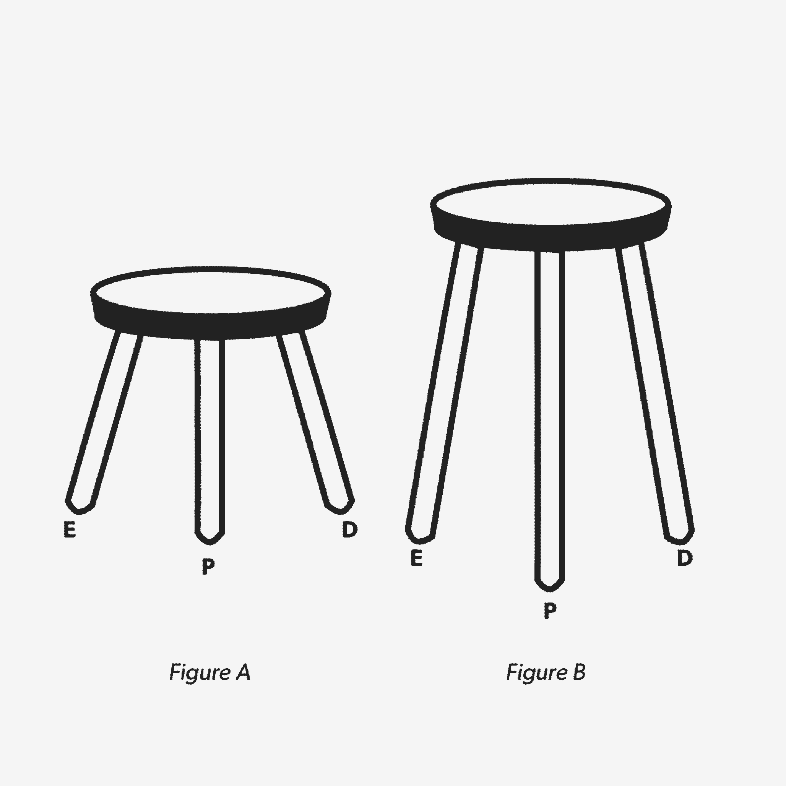
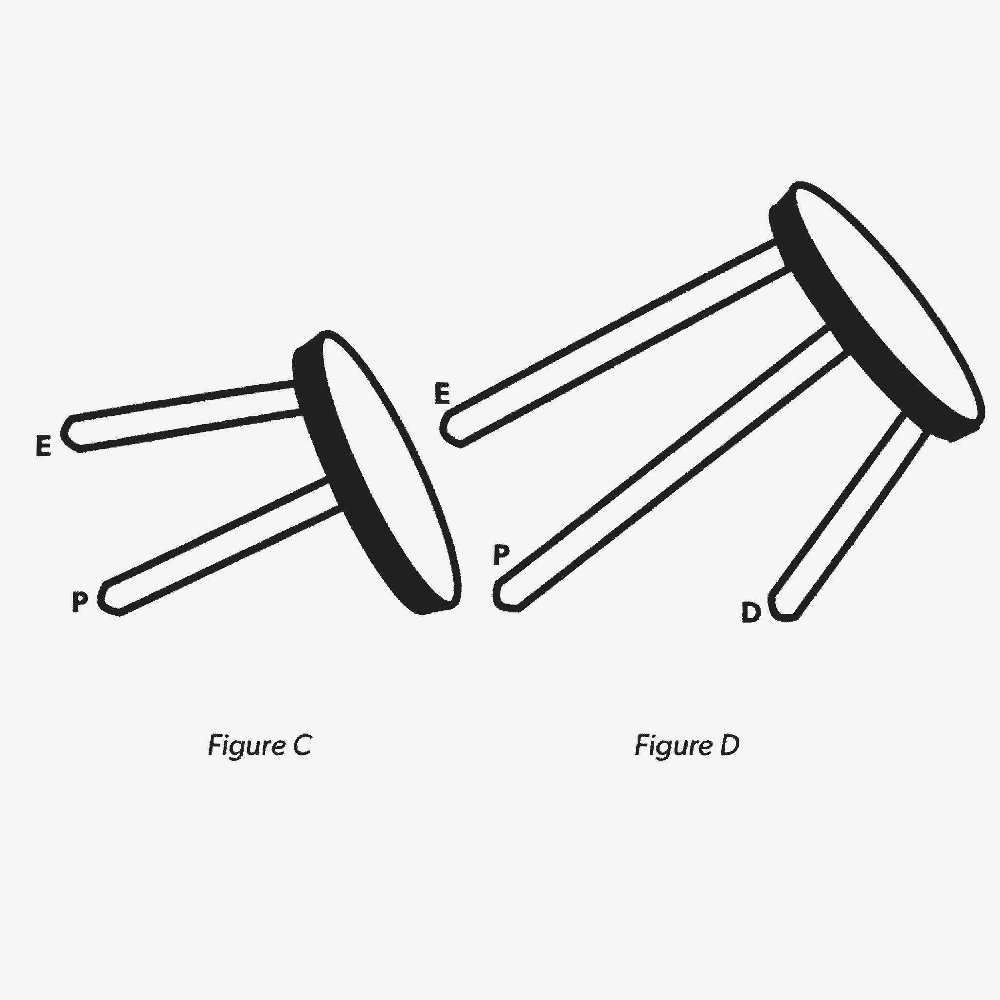

# 建立和领导产品设计团队的 6 个必读书目

> 原文：<https://review.firstround.com/our-6-must-reads-for-building-and-leading-a-product-design-team>

在回顾中，我们与一些鼓舞人心的领导者谈论了技术领域的产品设计。仅举几个例子，就有的朱莉·周、Airbnb 的亚历克斯·施莱弗和的迪迪尔·希尔霍斯特。我们猜想你已经体验过他们至少一个设计选择的结果——但是**如何建立和领导这种类型的设计团队来开发如此经验丰富的产品呢？**

当谈到产品设计团队何时开始以及与谁一起开始时，似乎有很多变化。例如， [Genius 第一次生产时，产品附近没有设计师](http://firstround.com/review/Rap-Genius-Explains-Why-Worse-is-Better/ "null")。但是, [Pocket 的第二个雇员是一名设计师，她从一开始就在产品上留下了印记。一些设计师，比如凯特琳·卡林诺夫斯基，在苹果、脸书和 Oculus 等公司有超过十年的设计经验。但其他公司的设计师来自各种专业背景:Airbnb 的设计团队中有一名前图书管理员、机械师、治疗师和现代舞舞者。](http://firstround.com/review/the-story-behind-how-pocket-hit-20m-users-with-20-people/ "null")

那么，早期创业从哪里开始呢？以下是我们多年来发布的关于建立和领导产品设计团队的关键建议。我们希望它们能对你有所帮助，无论你是初创公司的唯一设计师，还是领导一个数百人的设计组织。

不要成为房间里最聪明——也是唯一——的人。

很难想象 **[杰弗里](https://twitter.com/jeffrey "null")** 会被什么吓倒。在担任优步的产品设计师之前，他是 Betable 的设计主管，既是技术副总裁，也是位置初创公司 SimpleGeo 的唯一设计师，在 [Digg](http://digg.com/ "null") 独自经营设计和 UX，并在 [Threadless](https://www.threadless.com/ "null") 担任首席创意官七年。卡尔米科夫是自主创新方面的专家——他的建议可能有助于那些发现自己是创业公司唯一设计师的人。

他最重要的建议？不要自欺欺人地认为所有最好的想法都是你的。无论你有多优秀，如果你在真空中设计，你将会 a)立刻筋疲力尽，b)最终得到一个非常糟糕的产品。所以，离开你的筒仓，接触你周围的人。

这说起来容易做起来难，因为设计师面临的最大挑战之一就是上下文切换。这也是一个人失去最多时间的地方——作为唯一的设计师，你尤其不能浪费这种资源。卡尔米科夫说:“我们都愿意认为自己是多重任务者，但事实是，结束一个项目，转到其他项目，放松下来，然后跳回其他项目，都需要时间。”“你回头看看你的一周，看看你浪费了多少时间试图变得有效率。挺难过的。”分散你的头脑风暴的力量——你可以让你的想法引擎一直运转，减少失败。

**[找候选人当粉丝。采访他们的作品。](http://firstround.com/review/An-Inside-Look-at-Facebooks-Method-for-Hiring-Designers/ "null")**

朱莉卓(Julie Zhou)10 多年前 22 岁时开始在脸书工作。如今，作为产品设计副总裁，她觉得自己能够与公司一起成长，并因此塑造了几个让脸书独一无二的流程。其中一个决定性的过程是雇佣一些世界上最好的设计人才来思考人们在网上进行的复杂而微妙的互动。卓已经看到了硬币的两面:如何为一个成熟的公司雇佣设计师，以及从一开始就应该寻找什么。

在反思卓如何聘请他们的一些早期设计师时，她建议从整个团队中寻找喜爱的应用程序和产品的列表——不仅仅是商业上成功的应用程序和产品，甚至是具有伟大观点的小应用程序或想法，选择那些展示你正在寻求建立的相同技能和交互的应用程序和产品。“阅读产品上带有你喜欢的元素的小字——比如一个特别有效的 UX，或者一个创新的功能，或者一个非常精致、做得很好的导航系统，然后在谷歌、LinkedIn 和 AngelList 上搜索，直到你找到它们背后的人。”在你这样做之后，不要太害羞而不敢伸出手。不管做什么工作，人们都喜欢收到粉丝的来信。

一旦他们准备好了，就去了解他们，但更重要的是“面试”他们的工作。**至关重要的是，你的招聘团队要仔细审查设计师作为其作品集或之前工作经验的一部分而开发的应用、网站或产品。**候选人和作品都要经得起。为了确保他们看得透彻，卓向她的招聘团队提供了一份清单，以分析所提交工作的质量:

**想法**:“他们为什么从事他们所从事的工作，背后有坚实的理论基础吗？它是否发现了一个真正的问题并试图解决它？”

**可用性**:“好用吗？设计是否考虑周全，是否清楚该产品的工作原理？设计师是否很好地掌握了常见的模式和交互？”

**工艺**:“设计师是否关注了端到端产品的所有细节，无论大小？有没有一种最终产品制作精良的感觉？我们要找的不是功能性的东西。我们希望产品能让人们感觉到它的制造者关心他们和他们的个人体验。高品质和工艺对我们来说极其重要。”

不看作品就谈不上设计。

**[保险丝工程，从产品和设计开始。](http://firstround.com/review/defining-product-design-a-dispatch-from-airbnbs-design-chief/ "null")**

对于增加一个合伙人，然后第三个同事等等的单干设计师来说，不要回到你的筒仓里，因为你已经有了设计兄弟。Airbnb 的设计副总裁 Alex Schleifer 建议从一开始就为 EPD——工程、产品和设计——团队的建立打下基础。一些科技公司已经采用这种方法来增加从产品开始到推出的每个功能的参与度和一致性。

例如，一个新功能、产品营销或用户反馈的工作组将涉及三个团队中的至少一个成员。这个联盟不仅集合了产品的关键构建者，而且作为副产品，它还正式确定了产品、工程和设计方面的专业途径，希望继续创造产品的人可以考虑这些途径。

准确地说，团队应该像一个三条腿的凳子，每条腿代表帮助构建产品的三个领域中的一个。如果从一开始就这样做(图 A)，随着公司的发展，每个功能都可以以适当的比例并行增长(图 B)。

如果从一开始就没有这些策略，你一定会产生一个不稳定的大便，在这种情况下，会导致一个不稳定的产品。这可能是因为没有设计角色在一开始就被开发出来(图 C ),或者是在产品——以及工程和产品管理团队——已经成熟和成长之后添加上去的(图 D)。

**[让设计师拥有自己的最佳方案。](http://firstround.com/review/six-steps-to-superior-product-prototyping-lessons-from-an-apple-and-oculus-engineer/ "null")**

**[凯特琳·卡林诺夫斯基](https://twitter.com/kalinowski007?lang=en "null")** 对设计有着敏锐的头脑，尤其是作为原型制作过程的大师。从第一次迭代到最后一次迭代，她深刻理解应该在哪里、何时以及如何进行变更。这让她成为硅谷非常受欢迎的产品设计工程师。在担任 Oculus 产品设计工程总监之前，她是苹果 MacBook Air 和 Mac Pro 的技术负责人。她还领导和运输了脸书的蓝牙信标，这种信标为用户提供基于位置的提示。

随着你的设计组织的成长，其不同的功能领域将不可避免地发生冲突。以下是 Kalinowski 建议做的事情:**让每个团队拥有他们最好的情况**。

在开发苹果的圆柱形电脑 Mac Pro 时，Kalinowski 不得不考虑多种观点。“工业设计团队希望设备的直径非常小。但这意味着散热器的直径很小...当散热器很小的时候，需要吸入更多的空气来冷却中央处理器(CPU ),从而使它发出更大的声音。然而，我们仍然需要计算机保持安静，”Kalinowski 说。“解决这个问题的方法是让每个团队完全拥有自己的最佳方案。苹果内部有不同的团队专注于优化小直径，专注于降低噪音，担心传热——我们只是让每个人都拥有这一点，并尽可能努力实现他们的目标。对于散热团队来说，由于这是一台高性能的机器，我们需要尽可能解锁 CPU 性能，因此我们让他们为此而战。然后，音频团队确保风扇噪音不会超过某个阈值。**让每个人都致力于他们所负责的功能的最佳可能结果，你很可能最终做出最佳的产品权衡——这意味着更好的产品。**

鼓励愚蠢的副业——欢迎他们加入你的团队。

前 Spotify 产品设计主管 **[托拜厄斯·范·施耐德](https://twitter.com/vanschneider?lang=en "null")** 是副业的粉丝——但他们一定很蠢。范·施耐德说:“副业成功的唯一途径是，如果人们允许自己想得简单，改变想法，失败——基本上，不要太认真。”“当你认为某件事很愚蠢时，你会乐在其中，不会给它设置太多的结构。你可以享受不同类型的成功。”

但是副业有制度效应——特别是对它的创意和设计师来说。范·施耐德说，初创公司要保持其创新优势，并让最有才华的员工继续为公司投资，最好的办法就是为愚蠢的副业留出时间和空间。虽然像谷歌和苹果这样的大公司可以定期将这一点纳入人们的工作中，但越来越多的初创公司以黑客周和黑客日的形式提供时间。“公司低估了给员工时间和空间去倾听他们的心声，探索他们感兴趣的事物的重要性，”他说。“这是一种无法衡量的东西，这让很多人对这个非常数据驱动的行业望而却步。”

运行黑客马拉松，让你的设计师可以追求副业可能是不够的。人们会看到他们的公司已经投资开发员工的想法，他们不会等着下一次黑客马拉松的到来。“当你有这种精力时，你想告诉人们，他们不必等待下一个黑客日的机会。范施奈德说:“允许他们每天抽出一两个小时，在你付钱给他们的地方进行创新，追求他们想做的事情。“建立让人们与同事和经理分享这种工作的方式。让他们觉得得到了回报，否则你可能会失去他们。”

如果人们找到时间并有伟大的想法，他们无论如何都会去做。他们会消失的。

**[为多面手设计师成为设计领导者扫清道路。](http://firstround.com/review/How-Designers-Can-Earn-a-Seat-at-the-Table-2/ "null")**

菲尔·金(Phil King)已经在产品设计上投入了近 20 年，其中大部分时间都在领导岗位上。在他职业生涯的早期，在担任 Flickr 用户体验和设计总监之前，他在易贝公司获得晋升。最近，他在 Bebop.co 公司(已被谷歌收购)、Nextdoor.com 公司和 Udemy 公司担任产品设计主管。

他职业生涯中最显著的转折点之一发生在他加入易贝的时候，此前他在初创公司做了几年设计。在易贝的头 18 个月里，他从一个对交互设计感兴趣的个人贡献者发展成了管理人员。他了解到像易贝这样的大公司有一种鼓励专业化的文化。交互设计师专注于事物如何工作。视觉设计师关注的是事物的外观。作为一个多面手，这是一个艰难的环境，但这是吸引金进入领导角色的品质之一。

他努力将易贝团队中的专家聚集成一个团队，帮助项目团队无缝地形成、理解和解决设计问题。产品设计领导者的底线？作为一名多面手设计师，提高技能，尤其是寻求运用广泛的设计思维来支持你的团队，是作为一名领导级别的设计师的关键步骤。给你的团队提供这些机会。他说:“我认为我作为一名多面手设计师的背景，加上我在交互设计上花费的时间，帮助我更全面地看待产品和设计挑战。”。“建立同理心、将复杂问题联系起来以及帮助团队应用设计思维的能力是设计师能够带给领导团队的关键技能。”

*这只是《评论》在设计上的智慧的开始。查看我们的* *[设计杂志](http://firstround.com/review/design/ "null")* *中引用的完整文章，以及其他关于* *[如何设计产品以消除认知开销](http://firstround.com/review/cognitive-overhead-is-your-products-overlord-topple-it-with-these-tips/ "null")***[如何运行有效的设计评论](http://firstround.com/review/Give-Criticism-that-Makes-a-Difference-With-These-Tips-from-Airbnbs-Head-of-Experience-Design/ "null")* *，以及* *[如何着手并执行产品重新设计](http://firstround.com/review/heres-how-asana-won-with-its-product-redesign/ "null")* *的文章。**

*托马斯·巴维克/斯通/盖蒂图片社拍摄。*