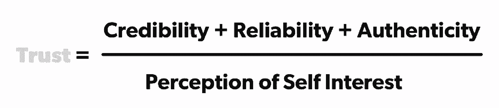

# 创建和增强团队信任的 6 个必读书目

> 原文：<https://review.firstround.com/our-6-must-reads-for-creating-and-accelerating-trust-on-teams>

多年来，我们深入研究了一些复杂的话题，从技术基础设施到 T2 增长方程。我们甚至讨论了[复杂性本身](http://firstround.com/review/wait-but-whys-tim-urban-on-parsing-and-transmitting-complex-ideas/ "null")。但是有一个概念是熟悉的，但仍然是一个解析和制定策略的挑战:信任。

它是无形的，但对公司建设的几乎每个部分都是基础。团队必须对他们的领导者有信心，反之亦然。[客户需要信任的产品](http://firstround.com/review/Urbansitter-Lynn-Perkins/ "null")。创始人会寻找他们有信心能帮助他们长期发展的顾问和投资者。

从评论的角度来看，信任几乎出现在我们做的每一次采访中。不可避免地，无论主题是谈论管理实践、走向市场战略、客户服务还是销售周期，我们都会听到某种版本的重复:“归根结底是信任。”

很多时候，人们会在那里停下来。这篇文章聚焦了那些坚持下去的人，深入挖掘了信任的主题，并分享了如何建立信任，而不仅仅是断言它必须存在。这份综述提供了一些框架、等式和习惯，领导者们已经测试并实际使用了这些框架、等式和习惯来建立和培养对团队的信任。

请继续阅读，寻找快速建立对他人的信心和信念的具体方法，尤其是当他们从陌生人变成候选人，从新员工变成同事的时候。我们希望你发现这些策略可以立即付诸实施，并相信你会尝试一下。

**[1。留下好的](http://firstround.com/review/how-to-become-insanely-well-connected/ "null")** ***[最后的](http://firstround.com/review/how-to-become-insanely-well-connected/ "null")*****[印象。](http://firstround.com/review/how-to-become-insanely-well-connected/ "null")**

合伙人 **[克里斯·弗拉里奇](https://www.linkedin.com/in/chrisfralic "null")** 负责 **[首轮资本](http://firstround.com/ "null")** 对 Warby Parker、Roblox、HotelTonight 和 Adaptly 等公司的投资。当被问及是什么让他的职业生涯成为可能时，他会直截了当地告诉你是关系——多年来刻意培养和建立的关系。Fralic 以帮助推出著名的 [TEDTalks](https://www.ted.com/talks "null") 和[具有里程碑意义的《福布斯》电子邮件介绍文章](https://www.forbes.com/sites/bruceupbin/2013/03/27/the-art-of-the-email-introduction-10-rules-for-emailing-busy-people/#73d9b4d77f7b "null")而闻名，每年仍会认真回复超过 10，000 封电子邮件。

这种沟通能力的核心是，他能够与那些背景或历史有限的人建立信任。这是一项至关重要的技能，因为在某些时候，每个人在成为团队中值得信任的同事之前都是一个未知的实体。

他断言，你如何退出与陌生人的对话最终会为建立信任关系奠定基础，而不仅仅是交易交流。他的策略？**以你希望在下一次与对方对话开始时的心情和乐观来结束每次会议或对话**。

“假设你会再次遇到每个人——这通常是有计划的或偶然发生的，”Fralic 说。“没有封闭的连接。世界太小了。”当你们再次见面时，你希望对方会想，‘哦，太好了，是某某！’不，我想我会想办法挺过去的。如果你设想再次遇到这个人，你希望如何发展，这无疑会影响你如何引导当前的对话——通常是更好的。

例如，Fralic 总是对那些被拒绝的创始人留下深刻的印象，他们会说:“谢谢你看我的简历，即使它并不合适。如果您对我们有其他想法或者有任何变化，请让我知道，”或者，“Chris，当我们见面时，您有一个关于 x 的问题/争议。我只是想向您展示我们对此所做的工作—无需回应。”他说:“这样说的人表明她足够聪明，不会把坏消息往心里去，不会制造义务或尴尬，也不会在你说不后继续坚持自己的观点。我会记住她的这一点。”

还有时间超越这个筹款甚至这个公司。关系需要多年来建立。现在开始。

**2。** **[向最后一轮候选人提供你最近的绩效评估。](http://firstround.com/review/assembling-an-executive-leadership-team-is-daunting-let-thumbtacks-ceo-help/ "null")**

**[图钉](https://www.thumbtack.com/ "null")** 首席执行官兼联合创始人 **[马可·萨帕科斯塔](https://www.linkedin.com/in/marcozappacosta/ "null")** 改变了消费者与当地专业人士的联系方式，自公司 2008 年成立以来，美国各地已完成数百万个项目。

然而，他最自豪的成就之一不是创新，而是实现——花了九年时间才让他满意。“我们已经招聘了工程、产品、市场、财务、人力资源、运营、营销和总法律顾问等部门的负责人。有史以来第一次，我们坐满了所有的座位。萨帕科斯塔说:“他们以自己的方式令人难以置信，并且配合得很好。”。“这花了一点时间，但我已经学会把创新留给我们的产品，而不是它的守护者。我已经意识到拥有一个经验丰富的高管团队是多么有价值。”

在他的[评论文章](http://firstround.com/review/assembling-an-executive-leadership-team-is-daunting-let-thumbtacks-ceo-help/ "null")中，萨帕科斯塔全面概述了他审查和关闭公司中一些最重要和最有影响力的人的过程。他的最佳实践之一是在高管面试过程结束时进行交流，但这是一种令人信服的脆弱和信任的姿态，适用于组织中的任何潜在雇员。

为了让候选人更放心，也为了让评估是双向的，萨帕科斯塔提供了他最新的 360 度评估。“我做的最后一件事是分享我最近的 360 度。我给这个人一份拷贝，这样他们就可以看到我在哪里做了标记，以及我正在做什么。这是我愿意完全开放的一种姿态。我告诉他们问任何问题，”萨帕科斯塔说。“例如，如果他们不这样做，我会提出的一件事是，我如何总能获得反馈，我需要给予更多的赞扬和认可。我做得还不够。我正在努力让它变得更好，但是一个主管不应该对此感到惊讶。更重要的是，那些知道自己需要肯定的话语才能富有成效和快乐的人可能会记下来并大声说出来。”

回答完所有问题后，萨帕科斯塔提出了自己的要求。“然后我问他们，他们目前的团队对他们有什么评价。他说:“这可能会让人们措手不及，感到不舒服，但没有人说不。这确实会影响他们的自我意识和脆弱的能力。”“我们都有长处和短处。在这个过程的这个阶段，事实是我们正在步入一起工作的现实。因此，我们能够在这个层面上分享和交流是至关重要的。”

即使是最有才华的人也有差距。这就是为什么我与高管候选人分享我的 360——并要求他们回报。

**[3。不要错过第一天的机会。](http://firstround.com/review/Employee-Onboarding-at-Startups-Is-Broken-Heres-How-to-Fix-It/ "null")**

在进入科技行业之前， **[卡莉·格思里](https://www.linkedin.com/pub/carly-guthrie/1/348/73 "null")** 曾在[托马斯·凯勒餐饮集团](http://www.thomaskeller.com/ "null")担任人力资源经理，该集团是加州精英餐厅[法国洗衣店](http://www.thomaskeller.com/tfl "null")的所有者——他们的成功早已不是秘密。“他们对客人用餐体验的每个细节都考虑得非常非常周到，”她说。“提前，他们会已经考虑到食物过敏和偏好，甚至是你以前可能尝试过的菜单项目。这是一种在现代经常被遗忘的关心和关注，但它对让事情变得特别、难忘有很大帮助。”

几十年来，格思里一直在初创公司办公室和拥挤的餐厅帮助新员工入职，因此她对一个人从候选人到新员工的转变和机会有着敏锐的眼光。Guthrie 说:“**从纯粹的战术角度来看，你永远不会有像第一天那样影响他人的机会。“每个人都感觉很棒，很兴奋能去那里，他们愿意签字放弃他们的生命。你必须足够有条理，让他们感觉更棒，并重申他们的选择。”**

让入职将激动从签署聘书延伸到某人成为员工的第一个瞬间，让你的创业与众不同。通过让这个拐点无缝衔接，开始建立信任和心理安全。“创造这样一种体验，某人第一天走进来，每个人都已经在期待他们了。每个人都已经知道他们的名字和他们在那里做什么。格思里说:“每个人都非常欢迎并理解认识这么多新朋友是一件令人激动的事情。“不要让他们想知道他们将在哪里以及如何吃午餐。清除所有那些导致第一天紧张的小障碍。所有这些都显示了许多组织未能达到的周到程度。”

她说，你不需要知道关于你的文化的所有答案，甚至不需要知道一名新员工的期望。但是，通过出现并愿意思考和处理小事情，你会让自己与众不同并建立信任。

以下是一些适用于经理的入职规则:

规则 1:永远不要让某人在早上 9 点开始他们的第一天——让他们在 11 点来。“这样你就有机会进去，喝你的咖啡，查看你的电子邮件，并再次确认一切都为他们的到来做好了准备，”她说。“到上午 11 点的时候，你就可以全神贯注地关注他们，帮助他们处理文件，并把他们介绍给团队。”

**规则二**:不要外包欢迎服务。格思里说:“让某人的经理带他们四处逛逛，做做介绍总是更好。”也就是说，每个人都应该知道新人开始了，也应该主动走上前去迎接他们。这些介绍应该是有目的的。每个人都应该知道说，“嗨，我叫乔。我在产品部工作，负责 x”(不只是“我是乔，坐在那边。”)你想给你的新员工一些拼图，让他们很快就能拼在一起，这样他们就能了解这个团队以及他们是如何一起工作的。

**规则三**:保持第一天的阳光。“很少有人能在开始新工作前睡个好觉，所以要尊重这一点。你可以计划一些会议，但是记住这个人有很多信息，这很难。即使是最自信的“我会一头扎进去”的人也仍然在学习一堆新的名字和面孔。设定期望值:“第一周你不应该在下午 5 点以后还在这里。你的工作是做一块大海绵，我们希望你每天回来之前有时间反思和充电。“即使你在面试过程中谈到了漫长而累人的工作时间，而且应聘者也同意了——即使你说，“我们实际上从来不回家，我们没有生活”——也不要在第一周就这样说。“当人们开始一份新工作时，他们会获得许多书面的、口头的和未说出口的暗示。对感官超负荷保持敏感。”

规则#4 :用方言提示他们。每个公司都有自己的暗语，尤其是如果人们已经在一起工作了一段时间。它由内部笑话和速记组成，对新人来说，这些笑话和速记可能会令人生畏，甚至疏远。“当我在 Readyforce 担任人力资源总监时，我们和许多有趣的人一起工作，我们互相开着玩笑。因此，我们入职的一部分就是让人们了解内幕，比如说，“哦，当某某人这么说时，她就是这个意思……”“弄清楚你公司的这些东西是什么，并把它们包含在你的入职计划中。不要让他们让新员工觉得自己是局外人。

第一天是你成为你在招聘过程中所说的那个人的机会。

**[4。编写并分发用户指南。](http://firstround.com/review/the-indispensable-document-for-the-modern-manager/ "null")**

作为健康技术初创公司 **[的首次创始人兼首席执行官，PatientPing](http://www.patientping.com/ "null")** ， **[Jay Desai](https://www.linkedin.com/in/jdesai01/ "null")** 担心与他的 100 多名员工——尤其是直接向他汇报的 7 名员工——发生冲突。在他的职业生涯中，他见过太多才华横溢、富有成效的团队因为对如何最好地相互合作的微妙误解而停滞不前——以及在这些互动中形成或瓦解的信任。

因此，他写了一本**用户指南**——类似于电饭煲或摇篮附带的那种——但这本**解构了他如何最佳操作，何时可能出现故障，以及其他人如何利用他取得最大成功。为了创作和编辑这本指南，他进行了激烈的自我反思，既借鉴了他早期在领导 PatientPing 时的管理失误，也借鉴了他在金融([帕特农资本](https://www.parthenoncapitalpartners.com/ "null")、[雷曼兄弟](https://en.wikipedia.org/wiki/Lehman_Brothers "null"))和医疗保健([医疗保险中心&医疗补助服务](https://www.cms.gov/ "null")、 [CVS 健康](https://cvshealth.com/ "null"))的职业生涯。**

**用户指南的目标是为如何协作设定清晰的预期，而无需额外的事后批评。**现实是，我们都可以使用某种程度的自信，不管我们认为自己有多了解别人。这也是一种信任的传递，因为它宣告了一个人是如何运作和动摇的——本质上是我是如何被建造的。“即使是同意为您的团队创建用户指南这小小的第一步，也有好处。德赛说:“这是一种同理心的表现，是对经理和员工之间隐性权力动态的认可，也是对团队由风格迥异的不同人组成的认可。“然后当你写一个，行为本身就说明了一切。我知道你想让我开心，我也想让你开心，因为我真的希望你成功。让我们通过制定一个关于我们如何联系的社会契约来让彼此更容易相处。“这让我们觉得做自己没问题，不会被误解，也是快速扩展的有力工具。”"

如果德赛的解释仍然不够，这里有一个用户指南如何帮助 PatientPing 和他的快速列表:

向候选人展示透明度，而不是兜售透明度。“招聘过程中，应聘者难免会问到文化。我通常会说，我努力做到透明，我是谁，公司是什么，我们的价值观是什么。德赛说:“当然，他们在职业生涯中已经从经理那里听说过这些了。“然后我给他们预览我的用户指南，作为对我们管理风格的一点了解，并表明我们重视自我意识——以及由此产生的合作。候选人会发现阅读这本书很有启发性，在做出角色选择之前看到这本书也很有帮助。

给新员工一个全面的入职培训。“在入职期间，前四天主要是针对职能和业务的。德赛说:“周五，我将与新员工进行第一次一对一会谈。“为了做好准备，我在周中向他们发送了完整的用户指南，请他们阅读并准备好开始讨论如何建立信任。他们的反应通常是“这太好了”。我将编写自己的配套用户指南。他们将起草他们的指南，并在两周后寄给我。到了第一个月，我们对彼此有了了解，这为开始工作打下了坚实的基础。"

**重新分配基础知识之外的认知开销。**“时间是有限的，尤其是在初创公司。德赛说:“提高我收到的问题的类型意味着在更难的话题上花时间，而这通常是增长更多的地方。”“有了用户指南，人们就不会浪费时间去想，当我转发一封仅供参考的电子邮件时，他们是否应该回复，或者如何分享业务更新等。这些都在指南中，因此我们可以快速进入更有影响力的讨论。”

**实际上把你的弱点摆在桌面上。**“许多‘思想领袖’都拥护弱点，以及将你的弱点公之于众的好处。但这显然很难，否则会有更多人这么做。德赛说:“当它写在纸上时，他们可以异步地学习和消化你的弱点，而不是试图同时吸收和回应他们从你那里听到的东西。”“作为领导者，重要的是我要首先分享我的弱点——我会把它托付给其他人。这就为你作为一名经理的脆弱性定下了基调。表明你并不完美，会犯错误。你的员工会觉得更有能力做同样的事情。”

以下是德赛的用户指南全文，截至 2018 年初。这是一份动态的文件，他会回去修改，因为他对自己和他的团队有了更多的了解。因此，下面的版本是一个快照，但无论如何是一个有用的模板。

人们总是反复强调建立信任和沟通的重要性——但他们很少说如何建立信任和沟通。编写您的用户指南。请你的团队做出回应。就是这样。

**[5。参考这个等式来决定信任谁以及信任多少。](http://firstround.com/review/use-this-equation-to-determine-diagnose-and-repair-trust/ "null")**

安妮·莱蒙迪拥有全明星管理记录，包括易贝的产品总监，SurveyMonkey 的营销副总裁，TaskRabbit 的 CRO，Zendesk 的 SVP 运营，以及 Earnin 的首席运营官。在她的职业生涯中，她看到了在科技初创公司，信任是不可选择的。不仅联合创始人之间的不信任可能是致命的，而且创业公司的环境变化很快，人们会进入新的角色和挑战，到了一定程度就会有新人涌入。

没有时间去怀疑或被怀疑——她发现了一个等式，可以帮助人们诊断和修复信任。它来自史蒂文·德罗兹德克和林恩·费希尔所著的《信任方程式》一书，书中给出了人类如何决定信任谁以及信任多少的方程式:

从本质上说，你对某人的信任度是你认为他们在某个问题上有多可信、他们已经证明自己有多可靠**和你认为他们作为一个人有多真实**的总和，除以你认为他们在多大程度上符合自己的利益**和**。从这个角度看她的同事之间的关系，莱蒙迪帮助他们诊断信任何时以及如何被侵蚀，并最终与他们一起努力弥合裂痕。

[阅读这里的](http://firstround.com/review/use-this-equation-to-determine-diagnose-and-repair-trust/ "null")来了解这些变量在创业公司中是如何打破的，以及莱蒙迪对此有什么建议。她还深入探讨了如何利用这个等式来设计一个好的职业轨迹。

**[6。朝着共同的意识努力。](http://firstround.com/review/what-startups-can-learn-from-general-mcchrystal-about-combining-strategy-and-execution/ "null")**

前国防部长罗伯特·盖茨形容斯坦利·麦克里斯特尔将军“也许是我见过的最优秀的战士和战斗中的领袖”作为麦克里斯特尔集团和 **[CrossLead](http://mcchrystalgroup.com/what-is-crosslead/ "null")** 的联合创始人，这位退休的美国陆军将军建立了一些咨询公司，帮助公司领导人变得更有效率和适应性。许多雇用麦克里斯特尔集团或 CrossLead 的公司可能会这样做，因为他们想象前海豹突击队员空降到他们的公司，用来自高层的严格纪律鞭策他们的员工，正如你对军队的期望。

但这些咨询公司所做的与其说是纪律，不如说是缺乏信任和共同目标——本质上是需要在整个组织中培养共同意识，让领导者能够授权人们更快地自己做出决定。

根据麦克克里斯托的说法，伊拉克的问题不在于操作人员不服从或不够努力。问题是指挥系统太慢，不能像敌人那样快速行动。在这么多的地方发生了这么多的事情，这一小群高层领导没有办法获得足够的信息来自己做出正确的决定。

“最明智的决定是由最接近问题的人做出的——不管他们的资历如何，”麦克克里斯托将军说。

他的部队开始意识到，要想和敌人一样快速行动，唯一的方法就是让前线的人们能够尽可能快地做出决策，因为他们可以了解到新的信息。但是，当领导者仍然认为前线的人们没有足够的信息来做出正确的决策时，你该如何做呢？

这就是信任和共同目标如此重要的原因。领导层必须首先相信员工对组织的背景和目标有足够的理解，能够自己做出决定。但是，如果领导层不自由分享人们做出正确决策所需的信息，不放手让员工证明自己，他们又怎么能信任员工呢？

麦克克里斯托的回答是:通过发展共享意识。这意味着你要相信几乎所有人都能自己做决定，因为你相信他们和你有相同的信息和目标。这是 CrossLead 帮助客户发展的核心组织技能之一。

虽然麦克里斯特尔的咨询公司采用了许多策略来帮助实现这一点，但他将战略和执行相结合的方式是在整个组织中传递信任的最有效方式:

在典型的“战略”会议中，领导者可能会谈论组织的目标、战略、资源、竞争对手等。然后，高层领导希望下一级领导将他们决定的相关部分逐级传达给他们的下级。他们认为对战略的反馈最终会慢慢反馈到高层领导那里...或者不是。

这个过程不仅太慢，而且损耗太大。鉴于接下来通常会有冗长的电话游戏，难怪领导者不相信他们的员工理解战略。通常，每个领导者都有自己的解释，然后根据他们认为他们的员工需要知道多少来进一步过滤。此外，他们可能会根据自己团队的激励来决定哪些部分是最重要的。因此，他们从未得到他们需要的反馈来改善或应用来自前线的关键信息。

麦克里斯特尔对这个问题的解决方案是，将谈论战略的过程与向成百上千的人传达战略的过程结合起来。虽然他在军队中很活跃，但他们每天都与来自军队各个分支的领导人和士兵以及来自国土安全各个分支的人举行大型的 90 分钟的战略会议。

在这个精心安排的会议中，房间里可能有 100 个人，而成千上万的人在监听一个电话。令人震惊的是，拨入电话的数千人中的任何一个人都可以在任何时候讲话！麦克里斯特尔将是第一个承认这是一个漫长的过程，但最终结果是一个蜂群思维，确保每个人都在用相同的信息行动，并可以被信任和授权。

*这远不是关于信任、沟通和透明度的评论的结束，查看上面引用的完整文章以及其他关注* *[这三种对话经理必须与他们的人发展和建立信任](http://firstround.com/review/three-powerful-conversations-managers-must-have-to-develop-their-people/ "null")***[如何驾驭一些最糟糕的创业公司对话](http://firstround.com/review/a-people-ops-veteran-on-navigating-the-gnarliest-conversations/ "null")* *。**

**插图由大卫·麦迪逊/数字视觉/盖蒂图片社提供。**