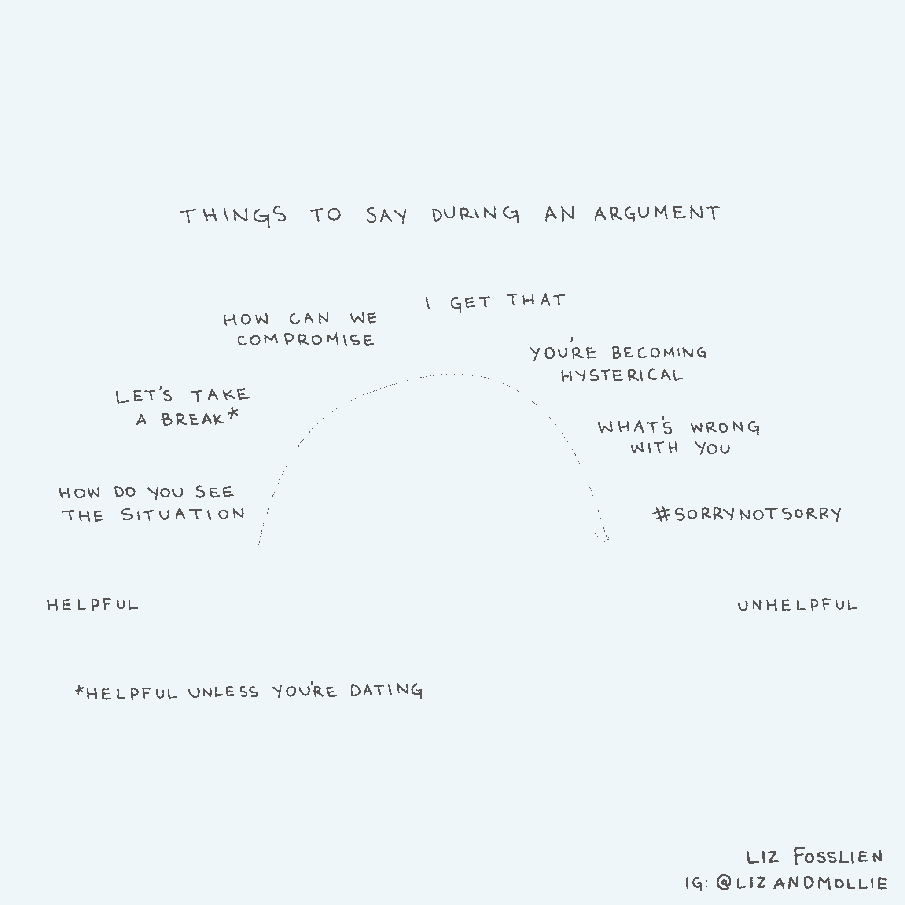

# 我们穿越冲突和艰难对话的 6 个必读书目

> 原文：<https://review.firstround.com/our-6-must-reads-for-cutting-through-conflict-and-tough-conversations>

伟大的想法、意志坚强的人物、不可能的最后期限和近距离——如果你写下一份冲突的配方，它可能会与初创公司的高风险、高压环境有着惊人的相似之处。

当然，任何人聚在一起解决棘手问题的情况都不可避免地会产生分歧。可持续创新的关键是确保分歧是富有成效的而不是抑制性的，铺平前进的道路而不是给进步设置自我强加的障碍。在初创公司情绪紧张的环境中，更重要的是要小心不要让冲突的余烬发展成不可收拾的大火。

多年来，我们与经历过创业生活考验的经营者交流过，他们对冲突有着明智的看法。当我们仔细阅读他们关于创业生活中艰难时刻的建议时，一个清晰的主题浮现出来:**最有效的冲突解决策略是在*****冲突发生之前就准备好了。打好基础始于有意识地创造一个环境，让人们觉得他们的投入得到了尊重，领导者为同理心和冷静的沟通树立了榜样。***

*以下六种策略来自顶级工程师、经验丰富的经理和人类行为专家。对于深陷不和谐的创始人，他们提供了即时冲突调解和管理的策略。他们还深入探讨了领导者可以用来将不和谐消灭在萌芽状态的策略，从主动解决绩效问题到让冲突解决成为公司文化的基石。*

*毕竟，如果你不想忽略代码中的关键错误，你也不应该对错误的人类动力学视而不见。不仅仅是因为这是应该做的事情(确实如此)，还因为团队功能失调对公司构成了生存威胁。当团队可以参与各种想法时，产品会更强大，而[工作只是一个更好的地方](https://firstround.com/review/these-seven-emotions-arent-deadly-theyre-your-secret-career-superpowers/ "null")。*

*当工作场所出现冲突时，人们有两种倾向:要么他们会躲避不适并希望问题消失，要么他们会正面解决冲突，通常不会过滤他们使用的词语。这两种回答都不正确，也没有建设性。回避问题只会让问题恶化并影响更多的人，而草率、非战略性的沟通会让小火变成大火。*

*进入高管教练[安梅尔](https://www.linkedin.com/in/annmehl/ "null")和[杰里科隆纳](https://www.linkedin.com/in/jerry-colonna-reboot/ "null")。在公司建设最艰难的时刻，通过多年在 [Kickstarter](https://www.kickstarter.com/ "null") 、 [Etsy](https://www.etsy.com/ "null") 和 [SoundCloud](https://soundcloud.com/discover "null") 培训高管，他们已经形成了实践**非暴力沟通**的具体策略，这是一种强调意识、责任和同理心的模式。*

*为了帮助客户有意识地通过对抗进行沟通，梅尔推荐了管理冲突的 A-E-I-O-U 模型。它与其他策略的区别在于，它假设任何争论的双方都是善意的——基本上，每个人的行为背后都有积极的原因。*

*天下没有不冲突的环境，所以你最好学会如何应对。*

*A-E-I-O-U 方法代表**承认、表达、认同、结果**和**理解**，可用于解决各种僵局:员工与老板、同事与同事、共同创始人与共同创始人。梅尔说，这对早期创业公司特别有用，因为每个人都互相认识，并且在一起学习。不管你的公司有多老，也不管它的结构如何，员工都应该感到自在地接近经理，并在公平的竞争环境中交流。*

*在任何冲突情况下，找到解决问题的方法是最高目标。为了做到这一点，**你必须把你与之冲突的人和那个问题分开。***

*梅尔建议在开始任何对抗性的讨论之前，提前准备好建设性的声明。这样做有助于你保持专注，减少不连贯或不完整的解释。做好准备也传达了一个信号，那就是你在做正确的事情。这表明了善意。*

*承认:看到积极的意图。假设争论中的另一方是善意的。试着理解他或她的基本原理，并直接向他们大声说出来。宣布你知道他们正在努力做好事，并且你已经理解了他们为什么要这么做。*

***表达:清晰地说出你所看到的。肯定你已经确定的积极意图，并表达你自己的具体关切。使用声明，清楚地表明你的话是你自己的:“我认为/我感觉。”如果你正在调解一场冲突，邀请双方花几分钟时间澄清他们确切的担忧或问题。***

***识别:提出解决方案**。清楚地定义你的目标和建议。你想达到的结果是什么？使用“我希望……”而不是“我想要……”的措辞，非防御性地提出你希望看到的变化。你应该通过展示你的解决方案将如何解决每个人的问题，而不仅仅是你自己的问题，来建立共识。*

***结果:概述益处。如果他们同意迁就你，你反对有什么好处？当人们能够接受改变自己行为的理由时，他们的反应会积极得多。你的提议有什么优点？不要忘记，最强大的激励因素之一就是简单的认可(例如，“谢谢，我很欣赏你在这个问题上的灵活性”，或者“我欠你一个人情”)。这对建立和谐大有帮助。***

***了解:征求反馈。**要么就下一步行动或步骤达成一致，要么合作开发替代方案。问一些类似这样的问题，“我们能不能同意尝试一段时间，看看这对我们双方是否都有效？”给对方选择接受你的提议而不承认失败的机会。*

*在整个 A-E-I-O-U 过程中，保持一个有利于解决问题的环境至关重要。保持冷静是重中之重。运用积极的倾听技巧，实时澄清误解。继续重新措辞，以确保清晰的理解:“我听到你说的是……”“我认为你最关心的是……是正确的吗？”这样，就不会有怀疑人们的目标和意图的空间，并且给每一方一个澄清和说出他们想法的机会。*

*这就像一场网球比赛——你持球的时间越长，你从对方身上学到的就越多。*

*此外，正如网球运动员乐于在三局或五局中获胜一样，**同事们可能需要进行多轮比赛才能达成解决方案**。梅尔说，你不应该指望在一天内解决问题。她和科隆纳都遇到过几乎无法相互交流的联合创始人。运用 A-E-I-O-U 方法给了他们一个说话的理由，并最终转变为健康的、有规律的交流。*

*宾夕法尼亚大学精神病学临床教授乔迪·福斯特博士已经见识了她那份激动人心和乐观的心情。根据她在商业和精神病学交叉领域的研究，以及她的书 *[【我办公室里的笨蛋】](https://www.amazon.com/Schmuck-My-Office-Effectively-Difficult/dp/125007567X "null")* ，她对那些其他人觉得在工作中难以相处的人进行了分类，并分享了公司如何监控和管理他们。她特别关注初创公司最常见的两个原型:水仙花和豆子柜台。*

# *水仙*

*对于许多创业公司来说，这份档案可能既是引擎，也是套索。“我们中许多帮助建立公司的人都符合这种情况——包括我自己——你肯定会和这样的人一起工作。毕竟，有些自恋并没有错。我的意思是，如果我们没有一点额外的自信，就很难迎接挑战，达到我们想要的目标，”福斯特说。但当膨胀的自我、自我表扬和优越感占据了上风，它很快就会变成一个问题。水仙最初很有魅力，激励人们追随他。人们非常相信水仙，相信他有能力实现他们承诺的一切，但往往会失望。”*

*以下是水仙花的其他特征:*

*是“最好”还是“最了解”*

*寻求恭维*

*自言自语*

*姓名下降*

*将他人的工作归功于自己*

*“我的方式或公路”的态度*

*对拒绝很敏感*

*水仙倾向于独白(而不是对话)，经常发现血统的价值(而不是目的)，并要求读心(而不是交流，以便他被理解)。“我曾经认识一家机械工程公司的经理。他和他的团队正在制作一个模型，他向他的一个同事要了一把刀来进行调整，”福斯特说。“她给了他错误的刀，因为她无法读懂他想要哪把刀。结果，他暴跳如雷，尖叫咒骂，踢东西。虽然应该感到丢脸的是他，但她在同龄人面前感到尴尬。”*

*那么水仙到底是怎么回事——他为什么要做这些事情？“自恋是一种二分法的人格。我们看到的可能是一个咄咄逼人，自我传播的人。但我们没有看到的是，这种展示隐藏了深深的自卑，”福斯特说。“把那西塞斯的自我想象成一颗花生。它很脆弱，很容易被压碎。为了保护它，那西塞斯拿起那颗小小的花生，把它放在一个气球里，然后把气球吹得尽可能大，创造出一个“自我诱饵”。他把房间塞满了自己，不惜一切代价让每个人都远离那颗花生。我喜欢这个比喻是因为气球天生脆弱。一杯汽水，它的大小马上就合适了。这就是水仙正在发生的事情。"*

*对于那些与水仙打交道的人来说，请记住这个气球意象。“永远记住，那西塞斯让气球一直是满的。“这是一种非常艰难的生活方式，让气球膨胀起来，并一直守护着它，”福斯特说。“我们可以试着对她所经历的事情有点同情心。在集体的背景下，比如一个团队或公司，找机会友善地给她一些积极的反馈。然后你可能会开始看到那西塞斯能够放松一点，并意识到，“哦，这个人不是来抓我或戳破我的气球的。”"*

*以下是一些策略方法，你可以用它们来重新措辞对水仙的一些评论，以获得更好的回应，发展更健康的工作关系:*

*不要说:“你现在看起来压力很大。你担心自己做不好工作吗？”*

***一定要说:**“我们都对即将到来的最后期限感到紧张。我知道我对自己的表现有点紧张。”*

***不说:**“不要为了让自己更好看而当众砍我。”*

*一定要说:“我知道你不同意我今天的做法，我尊重你的观点，但在所有同事面前公开纠正我让我感到非常尴尬。”*

***不要说:**“你在员工大会上侮辱亚历克斯是很不礼貌的。”*

***一定要说:**“想象一下当你说亚历克斯笨的时候他是什么感觉。想象一下，如果有人说你傻。”*

*不要说:“你能在星期五之前把提案草稿给我吗？”*

*一定要说:“我迫不及待地想在周五看到你的提案草稿。”*

***不要说:**“我不在乎你的工作有多好；你的行为是不可接受的，很明显你有问题。你需要治疗。”*

***一定要说:**“我真的认为你有一天会成为首席执行官，但我担心你做的这件事会让人感觉不好，会妨碍你。也许一个教练可以帮助你实现你的全部潜力。”*

*

Dr. Jody Foster* 

***豆子计数器***

*数豆者人格的根源是执念，一种支配一个人头脑的思想或冲动。对于这种情况，它表现为抓住每一个细节，倾向于以一种特殊的方式组织——即使对他人没有帮助。他们坚持、收集和分类的非凡努力经常会影响他们以及他们周围团队的工作效率。*

*以下是 Bean 计数器的其他标志或属性:*

*不灵活，思想封闭*

*难以做出决策和提高效率*

*变得“卡在杂草中”和“透过树木看不到森林”*

*微观管理他人*

*抓住细节，希望它们以一种非常特别的方式组织起来*

*全神贯注于秩序和控制*

*“我认识一位首席运营官，她把公司金库里的每一分钱都当成了自己的钱。福斯特说:“她会雇佣会计师来调查数百万美元预算中的 8 美元差额。”。“她对自己的流程非常严格，只有她才能执行。当她授权时，她实际上只是从远处控制工作。如果一个团队提交了一份投资回报丰厚的提案，哪怕只需要一美元的公司资金，她都会断然否决。*

*最终，首席运营官的顽固行为侵蚀了利润，一位新任命的首席执行官解雇了她。“首席运营官表现出强烈的责任感，早出晚归——但她一整天都在做诸如公司文件和资料的彩色编码装订之类的工作。福斯特说:“令人惊讶的是她不在的时候他们发现了什么。“在她离开后，她的任务被分配给了其他管理员。以前在首席运营官需要几个小时的事情现在只需要几分钟。但是所有的工作都毫无收获。她被她认为至关重要的事情搞得焦头烂额，以至于公司其他人的责任都被抛到了一边。这些目标的管理者感到沮丧，因为他们在做她的工作，而不能做他们的项目。”*

*如果你和一个数豆员一起工作，什么能帮助你更好地和她联系和合作？“就像水仙试图掩盖他的不安全感一样，数豆人试图隐藏她对失去对自己或环境控制的恐惧。数豆人想在沧桑上叠加法律和规则，但她知道自己真的做不到。所以她固执于她认为自己能控制的东西，”福斯特说。“如果你是一个会计的老板，当他犯错误的时候，把它们正常化。告诉他这不是世界末日。指导他进行有期限和方向的细节导向的活动。如果你为一个会计工作，不要挑战他的控制欲。告诉他你钦佩他的奉献精神——让他知道你也是如此。不要承诺超出你能力范围的东西。当你犯了错误，承认它。不要合理化，也不要防御。”*

*尝试这些重新措辞的回答，以便更好地引起计数器的共鸣:*

***不要说:**“你控制欲这么强，放手吧！”*

***一定要说:**“你的奉献精神让我印象深刻。我对我的工作也有同感，所以你可以依靠我。”*

***不要说:**“是啊，是有一些错误，但有什么大不了的？这不是真正重要的东西。”*

***一定要说:**“你说得对，我确实忽略了几个项目，犯了一些错误。我现在会纠正这一点，下次一定会更加注意。”*

***不要说:**“不，我不同意你的看法，我觉得这样就好了。”*

*请说:“这是我修改过的作品。我记下了您提出建议的地方，并强调了我的相关更改。”*

***不要说:**“你说我拿不到报销是什么意思？”*

***一定要说:**“我知道我们需要勒紧裤腰带，但不幸的是，我正指望这笔报销。你认为我们可以讨论一个折中的办法吗？”*

*注重细节和细节饱和之间只有一线之隔。这就是给出方向的细节和阻碍决策的细节之间的区别。*

**[阅读更多关于福斯特博士对职场麻烦制造者的详细分类。](https://firstround.com/review/a-taxonomy-of-troublemakers-for-those-navigating-difficult-colleagues/ "null")**

*我们大多数人都有过这样的日子:你和你的经理就是无法达成一致。你和你的团队在角力。当工作中的冲突似乎无法解决，负面情绪沸腾时，你可能会认为你唯一的选择是立即辞职，并在离开时摔门而去。但是不要愤怒，现在就退出——还有另一种方法。*

*[Humu](https://humu.com/ "null") 的内容主管 [Liz Fosslien](https://www.linkedin.com/in/liz-fosslien/ "null") 说:“在激烈的创业环境中，我们通常不会放慢脚步，也不会在关系上花时间，所以冲突会被放大。她还是《没有痛苦的感觉:工作中拥抱情感的秘密力量》一书的作者和插图画家。 “如果我们花时间建立关系，更好地了解彼此的工作风格，我们可以避免很多误解和悲伤。”*

*如果你的创业公司的任务是发展壮大，让你的产品尽可能做到最好，你为什么不把同样的紧迫感投入到良好的工作关系中呢？*

*你不应该压抑或忽视你的情绪，但你也不想成为一个感情的救火队员。“当遇到冲突时，创业环境是最不稳定的，”Fosslien 说。*

*“我和合著者莫丽讨厌‘永远不要带着怒气上床’这个建议。**‘生气睡觉！Fosslien 说:“消极情绪，如嫉妒或沮丧，会扭曲你对现实的看法。“如果你知道你将会有一次艰难的谈话，那么事先走五分钟。你可能会认为自己太忙了，但这几分钟不会成就或毁掉你的公司——然而，公开爆发可能会产生深远的影响。”***

**

*有时，冲突源于另一种形式的负面情绪。你可能认识到它们:那些微小的刺激，如果不加以控制，会恶化并感染人际关系。Fosslien 称之为“grump 螺旋”——不幸的是，它们具有传染性。*

*她说:“如果你发现自己在想这些极端的词，比如*总是，从不，灾难*，这通常表明你陷入了消极的思想漩涡，让你把情况搞得不可收拾。”*

*在他们的书中，Fosslien 和 Duffy 创建了一个逐步指导你从螺旋中解脱出来的指南，使用了当你的一个团队成员在截止日期前建议一个大的改变时该怎么做的例子*

***注意困难的情绪。**不要恼怒地斥责你的同事，停下来观察一下这种感觉。*

***给每种情绪贴上标签。**描述复杂感情的能力，区分牛逼与开心、满足、激动的能力，被称为情感粒度。情绪粒度与更好的情绪调节和更低的压力下产生报复心理的可能性有关。有了团队项目的情感粒度，您将能够意识到“我感到恼火”的真正意思是“我担心我们没有时间做出这些改变。”*

*了解每种情绪背后的需求。一旦你给每种情绪贴上标签，转换你的视角，明确说出你想要的感觉。问问自己“我想感受什么？”如果你想感到平静而不是焦虑，想清楚你需要做什么来成功放松。这可能会确保稳定性:您希望项目保持在正轨上。*

***表达你的需求。不要说，“我对这种在最后一刻做出改变的要求感到恼火。”试着说，“你的编辑很好，但是因为我们已经到了最后期限，稳定性和可预测性很重要。我们有时间做什么编辑？我们如何才能做到这一点？”***

*

Author and head of content at Humu, Liz Fosslien* 

*阅读更多关于如何管理我们在工作中都会遇到的七种情绪的 Fosslien 的智慧——并把它们作为秘密的超能力。*

*管理者在建立富有成效的对抗文化中扮演着重要角色。斯坦福大学工程学院的管理专家、《T2》《T3》《无屁眼法则》《T4》《T5》的作者罗伯特·萨顿(Robert Sutton)观察到，领导者会经历一种“放大效应”:当你被授予领导职位时，所有人突然开始密切关注你的所作所为。因此，每个伟大的老板都应该努力培养的技能是对公司动态的洞察力，以及对自己的行为如何在团队中引起有意或无意的连锁反应的敏感性。*

*这是管理冲突的一个特别关键的洞察力。萨顿为管理者提供了一种用洞察力领导的方法，在权威领导和倾听同级员工的意见之间取得平衡。他引用了美国组织理论家卡尔·维克的话:*

*战斗就好像你是对的。听着，就像你错了一样。*

*“有很多证据表明，特别是对于创造性的工作，最有效的团队在相互尊重的氛围中战斗，”萨顿说。他举了布拉德·伯德(T1)的例子，这位皮克斯(T2)公司(T3)的导演将《超人总动员》(T4)和《料理鼠王》(T7)搬上了舞台，以制造建设性冲突而闻名。但是皮克斯想改变现状，所以他们给了他一个机会和他自己的团队。萨顿说，在招聘时，伯德要求所有的害群之马。“给我所有准备离开的人——那些有解决问题的新方法，并不顾一切地尝试这些方法的人，”他说。船员们吵得不可开交，但在人人都称之为“爱的”氛围中，这种氛围根植于对彼此工作的尊重。*

*作为老板，营造这种氛围至关重要。你的目标应该随着时间的推移而变化:在早期，你需要遏制争斗，鼓励自由的想法产生。萨顿说:“在你有足够多的选择之前，不要轻易放弃。*

*然后，当事情最终被决定时，你需要说服人们优雅地接受失败，这样他们就可以努力实现他们不同意的想法。正如安迪·格罗夫所说，如果你不同意一个想法，你应该特别努力去实现它。这样，当它失败时，你知道这是因为它是一个坏主意，而不是一个坏的实施。”将这些想法传达给你的团队会产生真正的影响。*

*阅读萨顿五条规则的其余部分，帮助管理者培养一种“智慧的态度”——所有伟大的老板都掌握的信念和谦逊之间微妙的平衡。*

*在一家初创公司，冲突有多种形式和规模:小冲突、意见分歧、激烈的争吵，这些都会爆发和平息。但是最糟糕的冲突，也是最难解决的冲突，是你让它恶化的冲突。*

*我们在谈论早该进行的性能对话。虽然绩效评估本质上不一定是对抗性的(实际上可能是促进报告增长的有影响力的机会),但当对抗完全避免，直到经理们别无选择只能解雇某人时，麻烦可能会爆发并蔓延成真正的冲突。*

*[Slack 产品工程副总裁迈克尔·洛普](https://twitter.com/rands "null")，苹果和 Palantir 的前领导人，一位多产的博客作者(被科技界称为 Rands)，来帮助经理们避免这种情况。几年前，他在第一轮首席技术官峰会上称他们为“世界杰夫”，他专门识别和引导与创业世界中表现不佳者的对话。他们没有做任何明显错误的事情，但只是偏离了方向。他们工作效率较低，不适应当地的文化，有点混蛋，最重要的是，他们呆的时间越长，就会耗费你越多的时间和金钱——不管他们是不是叫杰夫。虽然没有不痛不痒的方法来干预绩效或解雇员工，但有一种方法可以避免诉讼、永久的伤疤以及(理想情况下)解雇任何人。*

*“如果你晚上躺在床上睡不着觉，想着‘天哪，杰夫让我生气了’，你找到低成本解决方案的机会大概是在三个月前，”Lopp 说。“你有机会改善情况，但你一直坐以待毙，直到事情真的开始变得糟糕。”理想的行动时间是在某人成为杰夫之前。这意味着在需要 PIP 之前实现编程。*

*快速复习:PIP 是最糟糕和最可怕的缩写之一。PIP 代表“绩效改进计划”，通常采取由人力资源部起草并监督的正式书面协议的形式，准确概述员工需要如何快速提高工作表现以保住工作。它们在大公司中可能比初创公司更常见，但即使是新公司也应该熟悉 PIP 原则，以保持员工的正轨，尤其是在他们进入快速增长期的时候。Lopp 认识到了这种需要，但讨厌它们的使用方式:通常是为了挽救某人的工作而做的最后一搏，半心半意的努力。*

*“如何使用 pip 有两个问题。首先，你应该在看到某样东西出错时就想去修复它，而不是在漫长而缓慢的衰退即将结束时。第二，你不能扳动开关就解决所有问题。要让杰夫变得更好，你不能只做一两件事。不仅仅是一次谈话。这是许多需要数月、每天、每小时解决的小事。”*

*如果你在考虑给某人做 PIP，你的第一个问题应该是你能早点做些什么？*

*当经理要求大多数人执行绩效改进计划时，他们会感到惊讶，这是有原因的。当然，人们偏向于否认，反对对抗。但是即使他们怀疑出了问题，也很可能没有人以他们理解并同意解决的方式向他们表达出来。*

*为了在混乱和爆发发生之前消除它们，Lopp 建议部署他所谓的 pre-PIP——本质上是经理和员工之间达成的协议，以提高绩效，而不是签署任何结尾带有心照不宣的“否则”的协议。这在没有正式 PIP 流程的初创公司中更容易实现。以下是 PIP 前路线的样子:*

***反馈需要及时。一旦有人偏离道路或转向危险区域，让他们知道。“理想情况下，在头 90 天，给人们过多的反馈，”Lopp 说。“想想看，你本可以在六个月或九个月前把杰夫拉到一边说，嘿，你在上次会议中真的让人们很沮丧，因为你没有听进去。”***

*目标明确、清晰。举例说明 Jeff 正在犯的错误，以及如果他改变自己的行为，事情会有什么不同。当你告诉杰夫事情不对劲时，让他重复一遍，直到他所说的与你的意思相符。人们常常达不到期望，因为他们误解了对他们的期望。*

***消除威胁。**绩效改进计划最糟糕的事情之一是它们被一种厄运的气氛所包围。这导致人们要么退缩，态度恶劣，要么感到绝望，无法尽最大努力。传达这不是一个生死关头。*

***把事情记下来。**尽管这不是提交给人力资源部的正式 PIP，但它应该被量化和整理。“你应该写一份定义明确的清单，列出你可以衡量的事情。杰夫应该能够亲眼看到他正在成功。您应该能够看到这一过程带来的变化。”即使有些主观的东西 Jeff 应该改进，也要试着用一些可量化的东西围绕它。*

*耐心点。“改变行为是一项艰巨的工作。很多人认为这是不可能的。但通过投资反馈，让你的销售线索有能力进行艰难的对话，你可以做到这一点，而且通常是值得的。”*

***以积极的一面结尾。**始终将对话从关键反馈转移到可能的解决方案。人们自然会抓住消极的一面，所以以积极的语气结尾会让杰夫变得更有动力，或者迫使他放弃。*

*继续阅读 Lopp 的更多建议——从如何让每个经理都有能力进行艰难的谈话，到为什么员工的头 90 天不应该是蜜月期。*

*当然，你永远无法完全避免冲突——你也不想，因为冲突经常会产生新的想法和新的思维方式。保持冲突富有成效而非破坏性的一个方法是确保你每天都保持良好的情绪卫生。*

*高管教练劳拉·盖茨经常听到客户以没有时间处理人际关系问题为借口。但事实是，你没有时间去。“不识别和解决冲突和腐蚀性团队动态的后果总是可怕的，”她说。*

*当领导者不愿意或不能谈论棘手的问题时，联合创始人会吵架，高绩效员工会辞职，同样有才华的人会被不公平地解雇，项目会失败或错过最后期限，文化变得有毒，士气受挫，人们会离开，公司会内爆。*

*盖茨建议，在团队静修期间，每年花一两次时间清理情绪。但是，虽然一两天的促进静修是深入研究人际关系问题和阻碍团队发展的动力的理想环境，但你不应该非得等到一年一度的活动才能解决冲突。毕竟，即时反馈最能引起共鸣。*

*盖茨建议在工作中增加情绪清理的频率:*

# *季度管理务虚会*

*团队或公司中的领导和睦相处至关重要。对这些关系的侵蚀会产生更具破坏性的后果。每季度一次，抽出一天时间专门给经理们休息。把它分成两半，前半部分用来清理情绪，后半部分用来做战略规划和未来的工作。*

# *1:1 秒*

*尽管每周一对一的会议往往更短，更有策略，但如果有必要，你可以留出一半的时间来清理情绪(或者每月一次会议)。经理需要在这里扮演积极主动的角色，接受报告可能会因为各种原因而很难暴露问题。*

*在这些会议之外，尽最大努力扮演促进者的角色，注意你在办公室和他们一起工作时的报告的语气和肢体语言。记下任何暗示紧张、不信任或冲突的事情。下次一对一的时候提出来。*

*[经理们应该变得脆弱](https://firstround.com/review/founder-exposed-opening-up-about-startup-failures-and-vulnerability/ "null")来开始这些会议。谈论一个你认为可能反映你的报告正在经历的过去的冲突。如果你认为你的报告与你有关，试着指出它是关于什么的，并讲述你脆弱的轶事，说明你为什么会那样做。给他们上下文。追溯问题的根源，倒带和重放，然后建立未来的替代方案。*

*最重要的是，向你的报告表明，他们与你分享的内容将被不带任何评判地接受，并且不会进一步深入。区分发泄和八卦(发泄是为了释放负能量和寻求解决方案)，让他们发泄，而不改变你对他们或他们提到的任何人的看法。信守这些承诺。如果你定期做这些事情，你就能防止负面情绪恶化，将令人沮丧的流言消灭在萌芽状态。*

# *验尸后*

*作为团队健康检查，在每个项目的事后检查中添加一个人际动态部分。养成公开谈论项目过程中出现的任何负面行为、内讧、紧张或问题的习惯。弄清楚这些问题从何而来，以及将来如何避免。在同一个团队开始一个新项目之前，将这些发现记录在你会看到的地方。“一般来说，你会问‘我们是如何在这件事上合作的？“怎么会更好呢，”“如果你每次都虔诚地这样做，你会更加了解和信任对方，效率也会越来越高。*

# *公司价值观*

*最后，如果你有一套公司范围的核心价值观或经营原则，把它们作为一个机会，引导每个人进行情绪净化。确立这样的观念:人们应该勇于公开自己的感受以及他们希望如何与他人合作；你应该花时间解决人与人之间的问题；可以带着自己的全部情绪去工作；反馈应该推动持续改进。你如何将这些信念融入到每个人都珍视的核心信条中？值了。*

**[获取盖茨情绪清理过程的细节，以及带领有效团队撤退的分步说明，在此。](https://firstround.com/review/clean-up-corrosive-interpersonal-dynamics-on-your-team-with-this-system/ "null")**

**在预防和处理冲突方面有更多的智慧，例如* *[这些精心开发的问题将帮助你以同情和洞察力处理甚至最棘手的工作场所对话](https://firstround.com/review/these-13-exercises-will-prepare-you-for-works-toughest-situations/ "null")* *和* *[这些来之不易的关于如何发现和调试麻烦制造者的技巧](https://firstround.com/review/reddit-and-facebook-veteran-on-how-to-troubleshoot-troublemakers/ "null")* *。**

**图片由 bbostjan/iStock/Getty Images Plus 提供。**