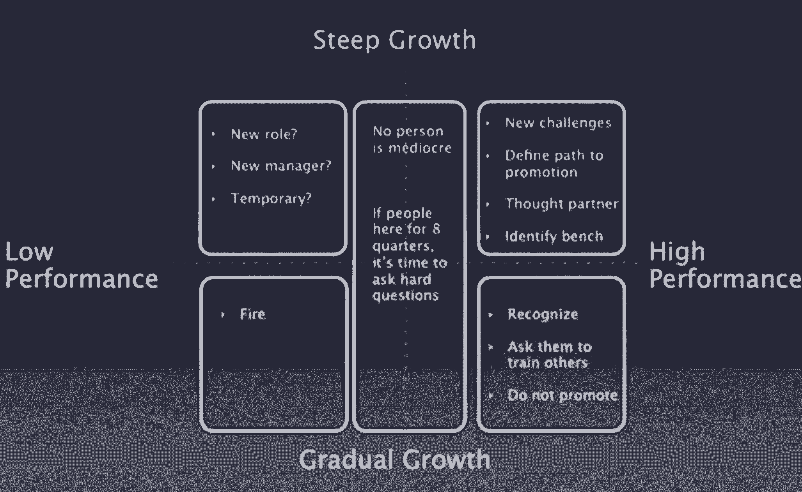
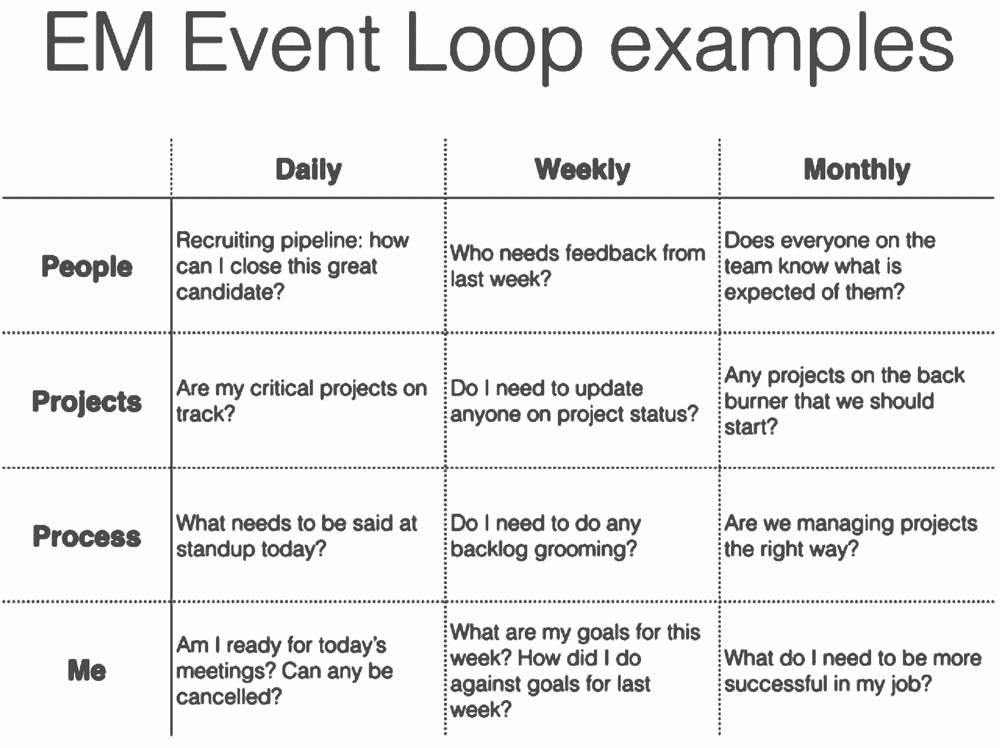

# 初入职场的经理必读的 6 本书

> 原文：<https://review.firstround.com/our-6-must-reads-for-first-time-managers-to-hit-the-ground-running>

被提升到你的第一个管理职位可能是一个苦乐参半的经历。一方面,,你可能会因为在专业领域的出色表现而获得奖励。当权者观察了你，然后决定，“是的，那个人工作非常出色，他们应该得到提升！”这种感觉真好。**另一方面**，成为一名经理需要一套独特的技能，这些技能可能是全新的，与你之前擅长的领域不同。至少可以说，这可能会令人迷惑和畏缩。

我们已经听到一些新的工程领导者说他们突然发现自己很少接触代码库。我们采访过的产品、营销和销售领导表示，花大部分时间解决人们的问题，而不是实际执行他们习惯的工作，这是一种调整。一夜之间，他们的日历上堆满了会议，在这期间，他们需要回答问题并与他们的团队一起排除故障。简而言之，生活变得非常不同非常快，如果没有适当的准备，这种转变会感觉像黑暗中孤独的上山攀登。

这就是为什么我们把这个列表放在一起。我们已经梳理了我们写的所有文章，其中包括给新经理和第一次当经理的人的建议，并且**收集了 6 篇最重要和最有影响力的文章** — ，我们相信这些建议可以让你拥有工具，带着自信和清晰的思路，继续向上爬。

在金·斯科特(Kim Scott)因创造了管理术语“[激进坦诚](http://firstround.com/review/radical-candor-the-surprising-secret-to-being-a-good-boss/ "null")以帮助人们提供更多更好的反馈”而出名之前，她在第一轮中非常坦诚地回顾了自己的过去，以及她从自己在一些行业知名公司担任领导的传奇经历中总结出的策略。她这段时间的关键收获:**好的管理者会在乎。**

这听起来很明显，但你如何在乎才是真正重要的。在这篇文章中，斯科特揭示了作为一名尽职尽责的管理者实际需要的要素——从深刻理解你的直接下属对他们过去和未来的看法，到避免她所说的“残酷的同理心”(即，因为担心伤害感情而不给予急需的反馈)。正如她所说:

严厉的爱是你建立信任最快的方式。

说起来容易做起来难。但她也提供了一些策略，这些策略被证明可以缓解严厉的爱，并获得人们的忠诚和信任。她还谈到了作为经理她确保建立的各种会议，她用它们做什么，以及她如何使它们成为有效的工具和对时间的良好利用。最后，她深入探讨了如何以公平的方式评估员工的表现，并给出了他们实际需要改进的地方。

Scott 以将大型管理理论浓缩成令人难忘的框架而闻名，他提供了一个如何考虑提供反馈的矩阵，以及一个以确保你为每个人提供正确支持的方式对你的报告进行分类的矩阵。这里先睹为快:

**[点击这里查看斯科特的全部建议](http://firstround.com/review/My-Management-Lessons-from-Three-Failed-Startups-Google-Apple-Dropbox-Twitter-and-Square/ "null")** **。**

James Everingham 现在是 Instagram 的工程主管，他长期以来一直是一名技术领导者——从 1995 年到 1999 年，他是网景浏览器的工程主管(给你一个感觉)。他见过各种各样的管理挑战，并利用这一经验设计了关于如何管理 **团队**的新理论——利用他对量子物理的兴趣(听起来很复杂，但一旦你学会了，申请任何类型的经理都很容易)。

他说:“我突然意识到，我可以从解决问题的角度来考虑这个问题，而不是像治疗师一样对待管理层(只是需要处理更多的流程和政治问题)。“我开始设计一个管理系统，就像我设计一个机器或软件系统一样，依赖很少，只有一个所有者，决策点很少。使用这种模式，我们立刻看到了生产率、产量和幸福感的跃升。

在这篇文章中，他解释了如何像组建一台机器一样组建你的团队。然而，关键是要接受机器中的人是多么复杂和不可预测。这就是量子力学(以及他的术语“量子领导力”)发挥作用的地方。作为一门学科，它让不可预测的事情变得可以理解。同样，通过将这些量子原理应用于管理，你可以为你的团队看似无法解决的问题找到解决方案。

Everingham 讲述了你如何管理你的团队来完成对你来说似乎不可能或不可想象的事情(加入了一个非常棒的薛定谔的猫的寓言)，如何理解和引导你对团队情绪和生产力的影响，以及如何以一种实际可行的方式创造激励和问责。对于新经理来说，这绝对值得一读——不仅仅是在工程领域，在任何领域都是如此。

**[阅读 Everingham 的全量子领导理论以及如何应用在这里](http://firstround.com/review/the-principles-of-quantum-team-management/ "null")** 。

我们第一次见到卡莉·格思里(Carly Guthrie)时，我们被她在让员工保持快乐、高效和受到工作激励方面提供的建议惊呆了。作为托马斯·凯勒餐厅(想想纽约的 Se，海湾的法国洗衣店)的前人事运营主管，格思里已经进入了科技世界，他已经观察员工接受和离开工作超过 15 年了。事实证明，不同行业的人喜欢和讨厌自己工作的原因基本上是一样的。**作为一名新经理，很重要的一点是理解这些潜在原因，这样你才能留住、吸引和培养团队中最优秀的人才。**

**留住人才的第一步:**了解失败的原因和方式。在这次独家采访中，格思里分享了她对人们辞职原因的了解，以及在员工第一天上班后你可以做些什么来确保他们保持快乐、投入工作并对你的团队忠诚(并删除他们肯定会从招聘人员那里收到的每封电子邮件)。

**阅读这篇文章，你可以学到:**

尊重人们的时间、**、**并确保他们在生活中整体快乐，这样他们就可以把最好的自己带到工作中，这到底意味着什么，看起来又是什么。

如何建立一个感觉像有目的的社区的团队？你要尽可能地营造一种“我们都在一起”的氛围。格思里提供了指示。

如何与你的下属建立师友关系，这种关系让人感觉是有机的，并由你的下属的兴趣和成长所引导。

这篇文章中有更多的内容可以帮助新领导人围绕鼓舞人心的幸福来定位自己，而不仅仅是生产力。前者会带来长期的成功。 **[从格思里这里读到其余的](http://firstround.com/review/This-is-Why-People-Leave-Your-Company/ "null")** **。**

Fidji Simo 是一个很好的例子，她在自己的职业阶梯上一飞冲天。如今，她是脸书所有视频、新闻和广告业务的产品副总裁，管理着一个拥有 400 名项目经理的组织。当她六年前加入公司时，她是一名产品营销经理。她迅速崛起的原因是什么？她的员工会告诉你，这是她不可思议的专注能力。

专注是任何新经理都必须具备的一项关键技能。这将使你能够在持续和不可预测的与人相关的问题上处理一系列相互竞争和不断发展的优先事项。能够集中注意力是你现在应该努力确定的事情。但是“专注”可能感觉像一个模糊的术语——或者是一种你生来就有的能力。事实并非如此，Simo 说，她已经**非常谨慎地创造了系统和心智模型**来确保她在任何给定的时间总是关注最重要的事情。

在这篇文章中，她分享了这些系统和模型，包括她在团队中启动任何项目之前提出的一系列问题，这些问题确保所有后续决策都符合并符合该项目的目标:

该产品解决的主要问题是什么？

我们在为谁解决这个问题？

我们希望我们的产品创造或唤起的情感/感觉是什么？

这个特定的实现与我们要解决的问题一致吗？

这是最有可能成功解决问题的产品/功能吗？

她还谈到了她如何利用渐进的变化来确保她的工作专注于一个移动的目标，以及她如何利用有意的独处时间来在自己的工作中创造清晰度和意图。Simo 每周一早上在她的日历上划出 30 到 60 分钟，以确保她的行动符合并支持她的意图。

**这些每周一次的清晰会议有一个固定的议程:**

列出更广泛的团队或组织的首要任务。

检查一下你本周的个人优先事项是否与那些优先事项一致。

检查任何需要改变优先级的新信息或数据。

对照你那一周的时间分配、会议和承诺检查优先级。

对你的日历做任何调整，以更好地反映你的优先事项。

记录任何影响或需要与团队沟通的优先级调整。

Simo 说:“我还会查看一周内的大型会议，对于每一次会议，我都会为自己和团队设定一个清晰的议程，列出我在会议中想要达到的目标。“这样，当我在一周内参加一个又一个会议时，就不会那么不和谐，因为我已经知道我的目标是什么。”

对即将到来的会议有了这种清晰的认识——**实际上是她想要带着**离开的清单——以及对她个人优先事项的理解，确保了她的团队的行动和优先事项保持一致。

在这篇文章中，她还深入探讨了她如何创造专注的理想条件，包括她用来委派和取消工作优先级的实际语言，以便她可以专注于真正重要的事情，她如何避免分心，以及她如何有目的地在她的日程安排中建立缓冲时间。

**[从 Simo 这里](http://firstround.com/review/how-facebooks-vp-of-product-finds-focus-and-creates-conditions-for-intentional-work/ "null")** 阅读所有这些建议和更多内容。

五年前，Jessica McKellar 和一群来自麻省理工学院的朋友创办了秘密聊天初创公司 Zulip。不到两年后，被 Dropbox 收购。这不是异常现象。他们以前也做过一次，以同样快的速度将 Ksplice 卖给了甲骨文。如今，她是一家新的秘密创业公司的首席技术官和创始人。这种疯狂的经历给了 McKellar 比一般工程师更多样化的管理机会——她是一个团队的领导者，一个创始人，一个大公司的技术领导者，一个快速发展的全球创业公司的经理。

她还给了我们一次最好的采访，是关于工程师如何从一个艰难的阶段过渡到管理层的。在书中，她讲述了如何真正支持一个团队的组成部分:“当你是一名技术经理时，你的工作主要是与人有关，”McKellar 说。“有两件事你应该一直考虑:人们的日常生活和他们的年复一年。”你应该想象每个人同时在这两条轨道上旅行。作为一名领导者，你可以在这两方面塑造他们的经验，帮助他们找到一条符合他们目标和你需求的轨迹。

McKellar 讲述了她如何安排“专注时间”来**帮助人们思考并专注于他们的职业**，这反过来又让他们在当前的工作中更加投入和快乐。她还描述了**了解你的报告能力的最佳方式**，以及作为一名经理，你如何评估人们的工作方式，以发现可能的效率和调整，帮助他们完成更多工作。其中一个调整是**帮助人们成为特定问题或功能的本地专家**，这样他们就可以回答其他人的问题，同时增加他们在组织中的知名度。其他的与你为人们创造的工作环境有关，了解每个团队成员的具体动机，设计能促进相互理解并让人们感到安全的检查。

但是，也许最重要的是，McKellar 为那些可能感到格格不入的新工程经理们提供了很多同理心。如果你在经历中感到特别孤独，请阅读这个故事。会有帮助的。正如她所说:

当一个人从工程师变成经理时，会有一个转折点，这会让人感觉很不舒服——就像你只是在开会，什么也没做。

**[在这里](http://firstround.com/review/this-is-what-impactful-engineering-leadership-looks-like/ "null")** 获取麦凯乐关于从工程师跃升为经理的所有智慧。

[大卫·洛夫特斯内斯](https://www.linkedin.com/in/dloftesness "null")，Twitter 的前工程总监(也是 [Scaling Teams](https://www.amazon.com/David-Loftesness/e/B01NBFO3EI "null") 的作者)，是第一位在过去 20 年里多次被提拔到初创公司和 6 家科技公司(包括 Xmarks 和 Geoworks)管理层的工程师。在经历了多次从工程师到经理的转变后，他现在正在尽自己的职责带领开发人员进入他们的第一个领导岗位。他将这些知识收集到一个 90 天计划中，以便其他人可以跟随他的领导——学习设定他们的优先事项，站稳脚跟，评估他们自己的表现，以便他们可以快速成长并开始授权他人。

这里有一个不公平的简要概述:

**第 0 天:**意识到你需要提前接受的不可避免的事实(他在这里列出了这些事实，包括告别编码，你的成长现在需要其他人的成长，你必须信任别人才能让他们信任你，等等。).

**第 1-30 天:**拥有你自己的教育，追求你不知道的东西(留出学习的时间，为该主题的最佳书籍创建一个教学大纲，寻找一位管理导师，表明你也在学习)。

**第 31-60 天:**找到自己的节奏(取消无用或不必要的会议，防御性地安排时间，为自己建立一个事件循环，确保每天、每月、每季度都做需要做的事情。).下面的例子。

**第 61-89 天:**评估你自己，决定你是否真的想成为一名经理(确定你的团队是否正在产生你想要的结果，你是否正在培养每个人的独特才能，统计你晚上和周末工作的时间，看看这是否是可持续的，并确定你在哪里增加了最大的价值)。

**第 90 天:**下定决心，要么站出来，要么靠边站(承认自己不适合当经理并不可耻，承认这一点也不丢人——或者，接受这个新角色，你还有多少东西需要学习，以及如何在前进的道路上增强自己的优势，减少自己的劣势)。

更多关于崇高的计划以及如何在你自己的生活和事业中应用的细节。

*这些只是第一轮评估中许多文章中的六篇，其中包含了对新上任和首次上任经理的建议。请继续关注顶级行业领袖，他们非常慷慨地与我们分享他们的经验，这样你就不必犯他们同样的错误。*

Bonnie Rae Mills 摄影。