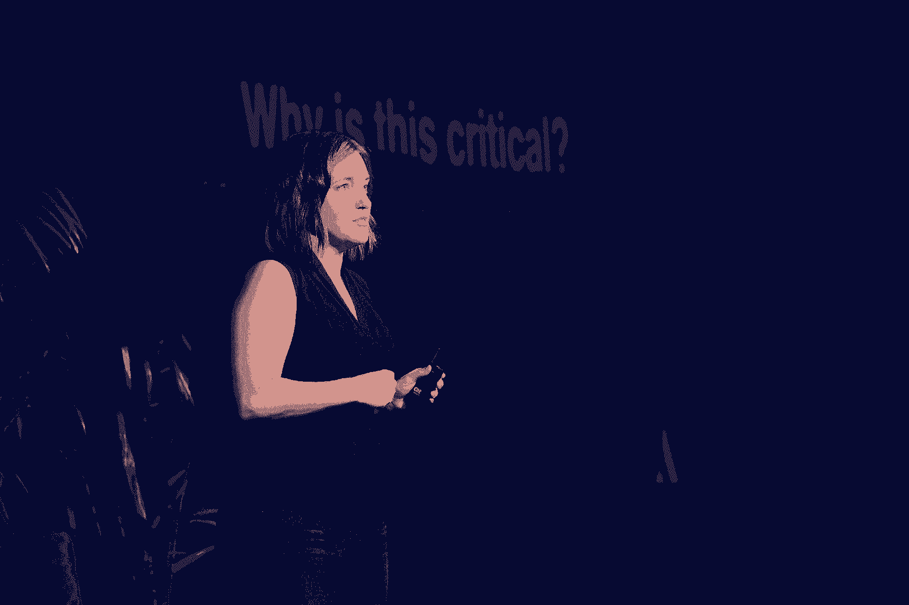
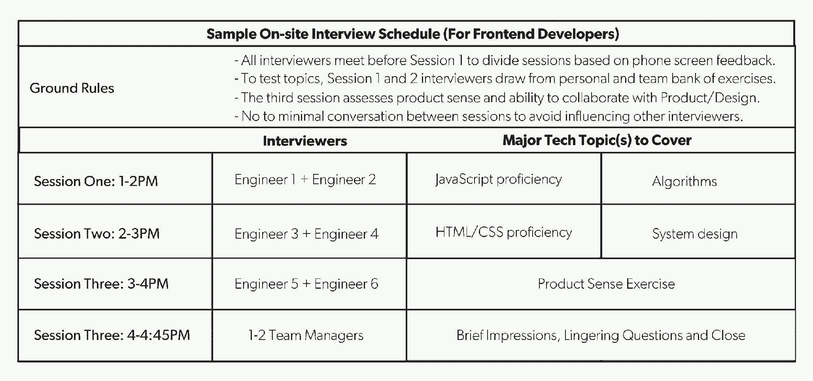
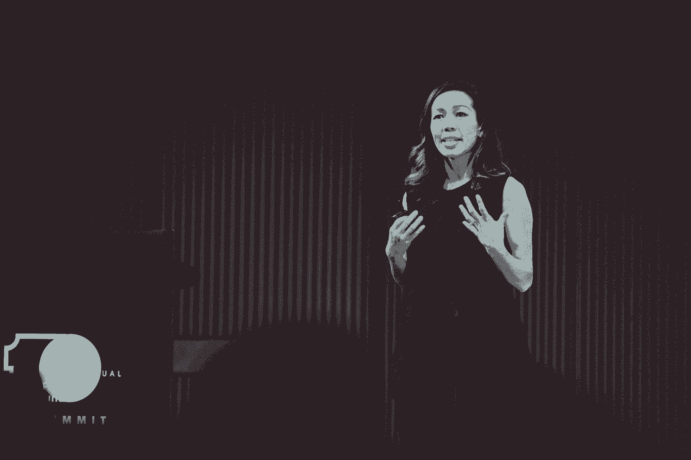

# 打破常规的招聘策略 6 必读

> 原文：<https://review.firstround.com/our-6-must-reads-for-hiring-tactics-that-break-the-mold>

每年年初都会引发一系列狂热的活动，从结束绩效评估到最终确定预算，再到开始为未来几个季度制定计划。值得庆幸的是，争论这些意见的痛苦过程是值得的，因为晋升、增加员工人数和团队建设任务往往就在地平线的边缘。

然而，尽管许多初创企业的领导者在最初几个月里重新关注招聘，但充满新年活力和热情的油箱通常会很快耗尽。新提拔的经理、老员工和新一轮融资的创始人最终都会遇到同样的障碍:在早期创业公司招聘很难。

更确切地说，这是一个耗时的从头到尾的过程。随着冰冷的外联电子邮件飞来飞去，申请蜂拥而至，现场物流成倍增加，运行招聘流程的体验很快从兼职变成了看似全职的工作，占据了所有人的注意力，堵塞了收件箱。从起草职位描述和建立平衡的候选人渠道，到筛选[有影响力的面试问题](https://firstround.com/review/the-best-interview-questions-weve-ever-published/ "null")和打电话咨询，每一步都需要仔细考虑——并为过程的瓦解和梦想中的候选人溜走提供了大量机会。

因此，经理和创始人不断寻找招聘技巧来减轻负担就不足为奇了。为了尽我们所能提供帮助，我们总结了六个必读书目，其中包含了深思熟虑的建议、有意的策略和一些非常规的策略，为招聘过程的每个阶段提供了一整套实践。

继续读下去，从那些在招聘过程中落败的人那里获得智慧，并从另一面带着全新的视角走出来。我们希望你能从他们的习惯中获得灵感，在你修补自己的招聘工作时，并在接下来的几个月里加深你的动力。

丹·普皮乌斯 在继续前进之前在谷歌工作了六年，先是到[中型](http://www.medium.com/ "null")担任工程主管，然后冒险成为 **[系列](https://www.range.co/ "null")** 的联合创始人兼首席执行官。但时至今日，普皮乌斯觉得自己偷偷通过了谷歌的密集面试流程。他招募其他人加入这家科技巨头的经历证实了这种感觉，因为他观察到大量的**假阴性**(本可以做出惊人贡献的人)和**假阳性**(检查了所有学术和精英标准，但终究不是合适人选的候选人)。这就是为什么他和他在 Medium and Range 的同事着手制定细致的招聘标准，并消除各自招聘体系中的盲点。意想不到的是，他们最终依赖于产品开发的原则。

例如，制定一个**清晰且令人信服的愿景**对任何产品的开发都至关重要。对于招聘来说，同样重要。但许多创始人开始时对团队建设的愿景相当薄弱，这导致招聘过程不力。表面的愿望是建立一个“世界级的团队”或列出具有最佳文化的公司名单。但是，即使看起来更详细的陈述，如“我想要一个专注、努力的团队，他们从根本上相信我们的使命”，仍然太模糊了。

为了更进一步，Pupius 建议**为将在你的公司取得成功的人的类型建立一个全面的定义** ***特别是*** 。你的公司和你的使命有什么独特之处？建立这种类型的公司需要什么样的独特品质？问问你自己，这个愿景会排斥那些不合适的人吗？如果是的话，那说明这不是一句空话。最重要的是，Pupius 指出，愿景需要将你的团队作为一个整体来考虑——一个单一的、连贯的产品。

就像构建一个功能集合的产品是行不通的一样，你也不想构建一个只是个人集合的团队，不管他们每个人有多优秀。

在 Range，创始团队一起徒步旅行，打造公司的人才愿景。“我发现体育活动真的有助于激发创造力，在办公室之外可以帮助每个人更客观地看待自己，”普皮斯说。他们以极其诚实的方式列出了团队中已经存在的特质和品质，指出了他们自己和对方的优势和劣势。这让他们能够确定他们需要什么样的人来弥补他们的不足并扩展他们的能力。(例如，他们意识到他们很大程度上是一群直觉内向的人，他们可以从更注重过程的外向者那里受益。)

**他们最终的招聘愿景不是一个声明，而是一份新员工在公司取得成功、巩固现有团队并保持平衡所需的特质、价值观和技能的清单**。现在，每一个招聘过程都从每个人都参与审查这份名单开始，这样他们就会被提醒，他们有责任建立一个全面的、运作顺畅的整体。

要在你的团队中实现这一点，作为一个团队记录你自己的愿景，并思考什么样的规则能让你达到目标。正如你希望拥有价值观、信念和指导方针来塑造你实现产品愿景的方式一样，**你需要有招聘原则来帮助你做出好的决定，同时消除偏见。写下标准的招聘流程，然后问自己:**

偏见可能从哪里引入？

在哪里以及为什么会做出糟糕的决定？

招聘流程中的人可能会有哪些盲点？

你在哪里以及如何可能没有发掘出对你的公司来说很棒的品质？

用你对这些问题的回答来创造并执行一套原则，这将帮助你找到你的愿景所描述的人。例如，在 Medium，Pupius 和他的团队提出了“**为候选人提供几种成功模式**”作为原则之一。在实践中，这意味着为技术候选人提供多种选择来展示他们的相关能力:白板、编程练习、设计练习、在几天内构建一个应用程序并将其展示给招聘团队，或者到办公室给初级员工做一次技术讲座。

更有策略的是，普皮乌斯和他在 Medium 的团队提前把他们的招聘规则发给工程候选人，这样他们就能知道他们是如何被评估的。“人们进来时感觉有所准备，就像他们为考试做了准备，而不是害怕突击测验，”普皮斯说。“这完全改变了谈话的基调和他们的舒适度。你不会从紧张不安的人身上得到任何东西。”

缺乏多样性通常源于创业公司招聘过程中潜藏的无意的、固有的偏见。作为的全球多元化和归属感主管， **[Aubrey Blanche](https://www.linkedin.com/in/adblanche/ "null")** 致力于通过[标准化面试和评估候选人的方式来解决这一问题](https://firstround.com/review/atlassian-boosted-its-female-technical-hires-by-80-percent-heres-how/ "null")，以确保每个人都按照相同的技术标准进行评估。

但是，即使有合适的招聘工具和面试系统，如果代表性不足的候选人没有首先申请空缺职位，也很难产生影响。这是布兰奇在亚特兰蒂斯遇到的事情。“2015 年，我们将所有这些工作投入到重新设计我们研究生项目的招聘流程中，当我们开放工作申请时，我们在最初的几周内收到了零名女性申请人，”她说。为了吸引更均衡的候选人，布兰奇采用了以下三种策略:

**策略 1:阐明你对公平招聘的承诺，避免像瘟疫一样的陈词滥调。**

布兰奇是 Textio 的福音传播者，这是一个增强的写作平台，提供关于性别平衡和招聘广告整体影响的实时反馈。该工具的数据显示，在所有人口统计群体中，机会均等语言强的职位列表平均填充速度快 10%。“在我们的招聘广告中加入平等就业机会(EEO)声明，不仅改善了候选人渠道的平衡，还提高了候选人的实际质量，”Blanche 说。“我们倾向于认为平等机会语言是美国的东西，因为它源于民权法案。但有趣的是，Textio 的数据和我们的经验表明，EEO 声明在美国境外的效果甚至比在美国境内更好。”

然而，敷衍了事的声明是不够的——它实际上比根本没有 EEO 声明的帖子表现更差。“你必须定制它，并用你的品牌语言强调它的重要性。它可以简单到在你的招聘广告上写“我们鼓励来自代表名额不足的群体的人申请”。布兰奇说:“这真的很有效。

除了 EEO 的明确陈述，工作描述中语言的影响还以其他更微妙的方式显现出来。“摇滚明星”或“忍者”等某些词和老掉牙的短语已经成为技术行话的一部分，尽管它们会发出一些危险信号。布兰奇说:“使用高度公司化的语言通常是向有色人种发出的信号，表明他们不会成功，因为这种语言是在白人男性占主导地位的空间里发展起来的。”“去掉它，说出你的意思，具体一点。”以下是一些需要注意的陈词滥调的例子:

*驱使结果。*什么样的结果？激进的，华而不实的还是深思熟虑的，有意义的改变？

*利益相关者或接受者。*如果有人向其利益相关者汇报，这些利益相关者是谁？为什么不是“协议”？

努力工作，尽情玩乐。如果一个出色的申请人承担着外部责任，或者正在你的公司寻求工作与生活的平衡和可持续的影响，该怎么办？

“这很大程度上是因为你在选择用词时更加深思熟虑。布兰奇说:“语言差异极其微妙。“例如，当你把一个职位描述为*管理一个团队*时，你就增加了男性申请者的数量。对于*发展团队*，增加了女性申请者的数量。但是*领导一个团队*在性别上更加中立，帮助你为你的空缺职位获得最大、最平衡和最合格的申请人。她说:“当然，你实际上做到了这三点，但调整信息会改变结果。”。

Atlassian's Aubrey Blanche

**策略 2:发挥创造力(做一些温和的跟踪)。**

除了选择正确的词语，布兰奇还将她自我描述的“怪异”寻人策略归功于某种秘密武器。在 Atlassian 任职期间，她积极寻找代表性不足的群体，并鼓励他们申请。

“我在 Twitter 上关注了与科技领域代表性不足的人相关的标签，我在 Twitter 上向那些参与者发布了招聘广告。听起来很奇怪，但我是认真的。我说‘嗨，你看起来像一个伟大的 UX 设计师，我们有三个空缺职位，你应该看看。’”她说。“我也去了亚马逊，看了科技书籍，读了评论，试图找出是谁写的，因为女性写的评论往往比男性多。没有人会写 Node.js 的书评，除非他们知道自己在说什么。

**策略三:非线性体验中的发现技巧。**

看产品经理候选人的时候，不要自动把没有产品管理经验的辞退。**人们没有职业道路，他们有成长道路。布兰奇说:“我们需要更好地为他人考虑，他们从不寻常的非线性经历中获得了哪些有用的技能。“所以在 Atlassian，我们试图以一种与你的背景无关的方式来了解面试过程中的那些行为。也许你从以前的工作中获得了项目管理技能，或者你从指导和组织孩子的足球队中获得了这种技能。”**

*深入阅读 Blanche 的* *[剧本，以加强多样性和包容性](https://firstround.com/review/eight-ways-to-make-your-dandi-efforts-less-talk-and-more-walk/ "null")* *阅读她对其他主题的更多想法，从交叉性和无意识偏见到数据和推动小实验。* **3。让面试成为一项昂贵的团队运动。**

每个工程领导者都花时间建立和重建团队，但在三叶草健康公司(Clover Health)和 T2 公司【Yammer】、 **[的时候，马尔科·罗杰斯(Marco Rogers)](https://www.linkedin.com/in/marcorogers/ "null")**痴迷于设计和完善完美的面试流程。正是这种技术帮助他在 Yammer 雇佣了十几名开发人员，将 Clover 工程团队从一个人发展到 50 人，并开始扩大 **[杠杆](https://www.lever.co/ "null")** 的技术团队。

我们之前已经强调过罗杰斯使用三人面试来减少偏见和提升更多初级员工观点的策略。但他的方法中最突出的是，他设计了一个系统，让他的技术团队参与进来，并充满活力地面试他们未来的同事。对他来说，面试是团队的头等大事:他团队中经验丰富的工程师每个月可以进行 12-16 次面试。

罗杰斯看到这一面试原则遭到了反对。“对一些人来说，这是一个范围问题，是领导者和招聘人员应该做的事情。对于其他人来说，这归结为一个担忧，即不是每个人都能在面试中代表公司。罗杰斯说:“人们还说，让每个人都接受培训并参与进来成本太高。但是面试是一项重要的商业活动。这会让人觉得代价很高——也应该如此。这就像在说，‘嘿，我们让工程师写了很多代码。感觉代价很高。这就是我们需要他们做的事情，也是我对面试的感觉。我需要团队帮助我了解我们是否带来了合适的人。这些人是你多年来每天都要共事的人。我认为这值得你定期花几个小时的时间。"

你的整个团队都应该进行面试。所有人。如果你不想让某些人面试，问问自己为什么。如果你担心他们如何代表公司，这是一个更大的问题。

作为工程领导者，罗杰斯认为在团队中发展这种技能是他的责任。“我把自己放在一个位置上，来评估我团队中的工程师在面试中表现如何。在早期，我在三人会议中与新的面试官配对。罗杰斯说:“在这种情况下，我不仅要评估候选人，还要观察工程师的面试能力。“当我们对所有面试官进行总结时，我会要求每个人向小组反映会议进行得如何。我可以问更多的问题，探查并帮助他们解开发生了什么。这为提供反馈和建议其他应对面试挑战的方法铺平了道路。

让每个人都接受面试的另一个好处是，更容易确定团队成员是舒适、自信的面试官——工程领导者可以利用这些人作为导师，让经验较少的同事成为更好的面试官。“从综合报道的反馈以及与候选人的面谈中，我可以知道哪位工程师擅长与候选人打交道。罗杰斯说:“例如，我会记下谁擅长进行技术练习，或者我们问的一系列面试问题。“在这种背景下，我了解面试官的优势，以及谁能帮助他们的同事提高面试技巧，因为他们获得了更多的面试机会。"

A sample on-site interview schedule at Lever.

在创业领域，创立公司的最初行为是不随大流的表现。创始人最终必须说服其他人加入他们，将愿景内化，并将其转化为现实。但是，把其他不符合传统的人——他们可能会反对他们的想法——纳入进来，这难道不是违反直觉的吗？

“每个领导者都需要追随者。畅销书作家、 **[沃顿](https://www.wharton.upenn.edu/ "null")** 学院教授亚当·格兰特[说:“我们不可能每时每刻都不墨守成规，但从众是危险的——尤其是对一个正在形成的实体来说。”。“对于初创公司来说，需要太多的旋转，如果你有一群羊，你的情况就很糟糕。”这就是为什么初创公司必须认识并招募格兰特所说的“原创者”](http://www.adamgrant.net/ "null")

例如，在他的研究中，格兰特寻找那些从事过非常明显的不服从行为的人——不服从**。虽然对麻烦制造者进行分类很重要，但你也不想错过你们当中的原创者。格兰特说:“我和一位将军进行了一次有趣的谈话，我向他索要了一份最不服从命令的人的名单。“我说，‘我想知道谁不服从命令，但最终却成为了一名伟大的创新者。’惹恼了中层经理，但得到了上级重视的人。这导致了许多非常好的名字和一些疯狂的人。"**

**在创业环境中，这可能意味着重新思考那些被解雇的人。“以莎拉·罗柏·奥哈根为例。她在维珍和雅达利都担任过高级职位，但都被解雇了。赖账的人对吗？后来，她在耐克找到了一份工作，然后成为佳得乐和 Equinox 的总裁，”格兰特说。“当她在我的课上做客座演讲时，她在开始的五分钟里骂了六次脏话。萨拉不担心取悦他人或融入社会。在佳得乐，她支持许多没人喜欢的想法。首先，她说它不应该只是一个运动饮料，而是一个体育表演公司。每个人都讨厌这些想法，直到他们最终拯救了这个品牌。”**

**但如果你是一个正在组建团队的创始人或经理，你可能没有足够的时间或数据来像格兰特那样找出原创者。此外，很难看出不一致的表面迹象下是否有实质内容。这里有两个非常规的问题和练习来帮助验证原创:**

****揭开他们未走过的路。**原作极其丰富。伦敦爱乐乐团选出了 50 首最伟大的古典音乐作品。这份清单包括莫扎特的六首曲子、贝多芬的五首曲子和巴赫的三首曲子。为了创作这些杰作，莫扎特创作了 600 首，贝多芬创作了 650 首，巴赫创作了 1000 多首。格兰特说:“一项更广泛的研究表明，一个作曲家在五年时间里创作的作品越多，成功的几率就越大。“产生伟大的新想法的一个方法是提出更多的想法。但是，我们在简历和面试中表现出来的是一系列经过过滤的想法和兴趣——很可能是那些导致理想结果的想法和兴趣。问问求职者，'**你尝试过什么但最终放弃了——为什么？**“寻找那些表现出持续好奇心，但愿意在不祥之兆到来时继续前进的人。”**

****让候选人成为文化侦探。Grant 建议评估候选人如何看待你的公司文化。在面试前两周，给候选人三个同事的名字，让他们去了解更多的文化。他说:“告诉她，当她来的时候，你想知道什么在起作用，什么需要改变。“如果候选人在现场待了半天或更长时间，您也可以在当天进行这项练习。你可以从他们建议的调整以及他们向你的同事提出的问题中学到很多东西，而且你可能会在这个过程中获得一些有用的想法。”****

**如果你是 5 人或 500 人，尽可能多地雇佣原创者。是的，雇佣太多原创者是有风险的——但雇佣太少则风险更大。**

**招聘和雇用高管对任何领导者来说都很难，尤其是对首次创业或处于早期阶段的创业者来说，他们可能没有足够的知识来测试候选人在专业领域的技能。 **[图钉](https://www.thumbtack.com/ "null")** 首席执行官 **[马可·萨帕科斯塔](https://www.linkedin.com/in/marcozappacosta/ "null")** 一直在那里，他依靠一个彻底的审查和关闭领导团队的过程度过难关。他评估高级管理人员的最佳实践之一是以推荐人和幕后渠道为中心。**

**突出的一点是，他不会等到招聘过程结束才开始——他也不希望应聘者抛给他一堆名字。但是，即使这些非常规的方法不符合你的风格，他提到的量身定制的问题也会成为你招聘工具的宝贵补充。以下是萨帕科斯塔遵循的流程:**

**在结束了与一名候选人的第二次对话后，萨帕科斯塔通知说，随着面试的进行，他将开始询问其他人关于他们的问题。“这种方法有两个重要部分。首先，我很坦率，我们会小心处理与他们当前雇主和候选人时间表的敏感问题。第二，我不要求推荐信，”萨帕科斯塔说。“我告诉他们，我会接触各种各样的人。最佳答案？太棒了。和每个人交谈。但是许多人闭口不谈或者说每个故事都有两面性，这当然是对的。"**

**然后，萨帕科斯塔会与不是两三个推荐人，而是 10 到 20 个人交谈，这些人是他从高管职业生涯的不同阶段中挑选出来的。从历史上看，他花在面试上的时间和花在推荐信上的时间一样多。所以，如果他花了 15 个小时和一个候选人在一起，他也会花同样多的时间在反向沟通上。“你想要一个全面的视角，所以你希望与同事、经理以及他们职业生涯中最重要时期的报告进行交流。他说:“我希望了解他们到底做出了哪些独特的贡献，以及他们与他人合作得有多好。**

**以下是萨帕科斯塔提出的一些问题，这些问题可以更广泛地应用到你自己的推荐电话中:**

**他们在哪里扣球？他们如何帮助创造业务杠杆？**

**别人是如何看待这个人的？这比问“你觉得这个人怎么样？”因为推荐人更有可能是诚实的，让面试官更容易审核答案。**

**我和这家公司管理团队的其他三名成员谈过，他们都提出了这个问题。你对此有什么看法？这个问题允许推荐人坦诚面对危险信号或错误。**

****我还有什么没问的，如果你是我，你会想了解这个人吗？**这个问题让推荐人可以自由说出他们想要分享的内容。这通常是一个在中间问的好问题——相对于结尾——来“打开”其他对话。**

****如果这个人在你考虑加入的公司的管理团队中，这会让你更兴奋还是更不兴奋？**这个问题有助于在实际的招聘决策中提供参考，并有可能更诚实地回答。**

**高管面试过程的最后也是最个人化的部分发生在最后，萨帕科斯塔向候选人展示了推荐电话中好的、坏的和丑陋的地方，并逐一检查了每个方面。“我对每个部分的问题是:'**你认为我为什么会听到这些？萨帕科斯塔说:“我在听候选人如何回应的同时，也在听答案。“他们是在为自己辩护，试图解释观察结果吗？或者他们会说‘这是我已经努力了很长时间的东西。我不是天生的演说家。“我在小团体中更自在，但我在所有人中扮演着更积极的角色，我已经报名参加了一些会议，”"****

**确定后，我回通道确认考生的技能。我也想知道主管的分成。但最重要的是，我想知道他们在镜子前走得有多舒服。**

**在她与 **[NerdWallet](https://www.nerdwallet.com/ "null")** ， **[Flo Thinh Chialtas](https://www.linkedin.com/in/florencethinh/ "null")** 的采访过程接近尾声时，她礼貌地接受了首席执行官陈永正的晚餐邀请。但陈说，她没有和他一起吃韩国菜，而是和另一个人 Dan Yoo 一起吃。Chialtas 最喜欢的食物的三小时盛宴和公司一样顶级。在宣传 NerdWallet 的同时，Yoo 询问了她的职业和兴趣。在某一点上，Chialtas 被卖掉了，她说她可以看到自己在 NerdWallet 和 Yoo 一起工作，他回答说:“哦，是的，但我还没有签约。”**

**灯泡熄灭了。Yoo 不是 NerdWallet 的(正如她最初所想的那样),而是它的最终候选人——陈将两人配对，因此他们将结合在一起，并有望一起签约。他们做到了。“如果我可以总结我的招聘经历，我会说这是非常真实的，”Chialtas 说。“蒂姆全程陪同我。如果他试图关闭我，他做了一个地狱的工作。”从那个神奇的时刻开始，Chialtas 在 NerdWallet 度过了一段时间，设计和提炼了一种令人眼花缭乱的体验，使候选人接近。**

**

Florence Thinh Chialtas, VP of People Operations at NerdWallet** 

**对于想做同样事情的初创公司，试试她的策略**通过细节展现奉献精神**。例如，NerdWallet 团队在候选人的社交媒体个人资料中寻找细微差别，如他们最喜欢的食物或运动队，以编织到他们的对外信息和未来的沟通中。“我们试图找到尽可能多的接触点，在个人层面建立联系。Chialtas 说:“尽早投入会让结束谈话变得非常容易，因为你从一开始就承认某人是一个人，而不仅仅是招聘名单上的一个名字。**

**对细节的关注也适用于候选人旅程的后勤方面，小小的举动可以产生巨大的影响。例如，NerdWallet 为候选人提供了以下材料，以使他们在公司前后的体验更好:**

****一天面试大纲**。NerdWallet 在每位求职者到达办公室前 48 小时给他们发了一份详细描述他们一天工作的提纲。它包括:他们将会见的团队成员的姓名和角色、采访时间和持续时间，以及他们全天将参加的任何活动。我们的目标是为他们提供所有他们需要的信息，让他们兴奋地来到这里，享受美好的体验。**

****运输提示**。为了帮助人们避免在进入面试时感到疲惫，NerdWallet 提供了交通提示，如最近的公交车站和停车点，这样候选人就可以以积极的态度开始他们的一天。**

****给亲人的文学**。在候选人收到录用通知之前，NerdWallet 会分享他们的福利摘要。“这是一个有用的指南，让人们可以带回家给家人，并说，‘嘿，我正在考虑这个提议。让我们一起来看一看，”Chialtas 说。**

**但是如果她只能给出一条关于招聘的建议，那就是**永远要不怕麻烦。在她近 20 年的招聘生涯中，Chialtas 认为，改变最大的是在候选人面前成功吸引人才变得越来越重要，尤其是当他们没有积极寻找新角色的时候。“除非你投资候选人的经历，否则你赢不了。这必须成为第二天性，”她说。****

**作为这种哲学在实践中的一个例子，Chialtas 回忆起一次特别的搜索，在那次搜索中，她是第三个被请来尝试解决一个具有挑战性的空缺职位的招聘人员。“进展不顺利，招聘经理变得非常不耐烦。我找到了一个候选人，看了他的简历，感觉一切都很同步。我早上给他打了个电话，在他说话的时候，我一直在想，‘就是他。“这就是候选人，”她说。“我们知道下一步和时间表，但我觉得这还不够。所以我问他:'**几个小时后你打算做什么？我可以顺路过来和你一起吃午饭吗？这很大胆，但这是一个不按你的方式行事的连锁反应的例子。这家伙最终在那里找到了一份工作，并在公司呆了几年。”****

**Chialtas 继续说道:“与结婚或买房类似，找新工作真的压力很大。所以，无论何时你认为你已经完成了对招聘过程的磨练，回头问问你自己:我怎样才能减轻候选人的压力，让招聘过程更加顺利？你的团队的未来取决于此。”**

***这仅仅是这篇评论关于运用非传统策略来激励和提升你的招聘过程的智慧的开始。查看上面引用的完整文章以及其他关于* *[扩展招聘传统](https://firstround.com/review/how-gusto-built-scalable-hiring-practices-rooted-in-tradition/ "null")***[建筑工程团队](https://firstround.com/review/How-Stripe-built-one-of-Silicon-Valleys-best-engineering-teams/ "null")***[运行完美的销售招聘流程](https://firstround.com/review/the-anatomy-of-the-perfect-sales-hiring-process/ "null")* *。*****

*****图片由 Filograph / Getty Images 提供。*****