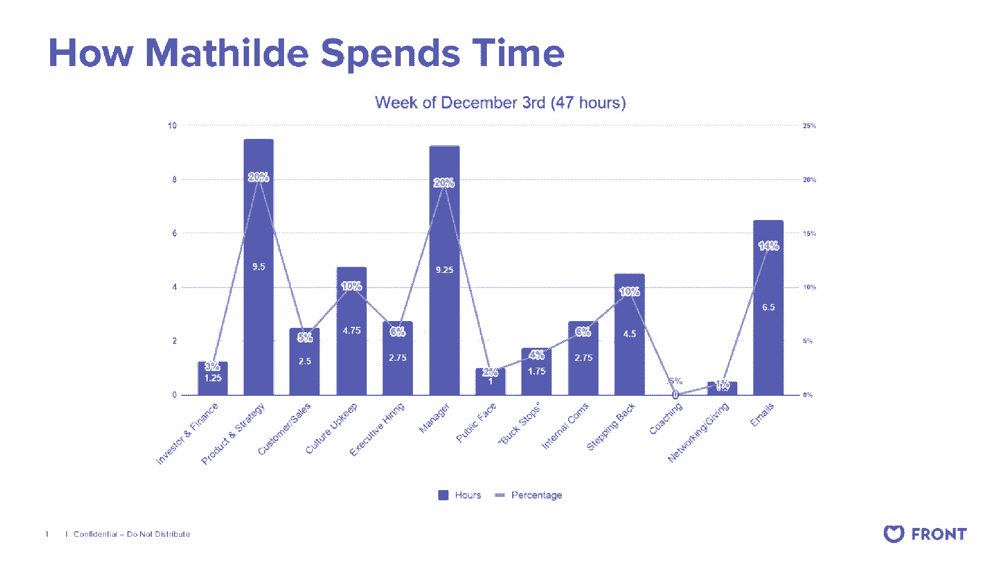
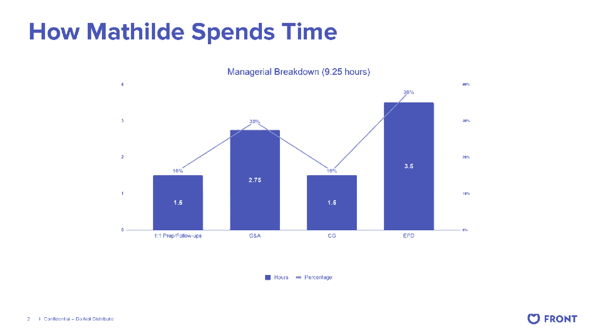

# 我们磨砺注意力和管理时间的 6 篇必读文章

> 原文：<https://review.firstround.com/our-6-must-reads-for-honing-focus-and-managing-your-time>

新季度的前几周带来了一种可预测的模式:我们回顾过去的目标，并着眼于新的、新的雄心。但是，虽然计划是在几个月内预测的，但我们知道真正的进展是在一周、一天和一小时内发生的——所有分散注意力的陷阱都在那里，更容易迷失方向。

正是在这些时间范围内，相互竞争的优先事项占据了我们有限的时间，尽管我们的道路上有绊脚石，但找到焦点变得更加重要。当我们可以在任何给定的时刻处理无数的任务时，我们把什么放在第一位？当我们大多数人的口袋里都装着一个分散注意力的小漩涡时，我们该如何忽略这些噪音呢？这不仅仅是我们能在工作中完成什么。心烦意乱、无所事事的时间还会占用你日历上的宝贵空间，这些时间可以用来建立有价值的[联系](https://firstround.com/review/how-to-make-connections-that-count-advice-from-a-silicon-valley-veteran-and-introvert/ "null")、[满足你的好奇心](https://firstround.com/review/the-secrets-to-designing-a-curiosity-driven-career/ "null")或[投资自我保健](https://firstround.com/review/our-6-must-reads-to-make-self-care-your-competitive-advantage/ "null")。

多年来，审查小组从忙碌的首席执行官、高管教练和经验丰富的领导者那里收集了应对这一问题的最佳实践。当我们仔细研究他们的建议时，一个令人安心的主题出现了:少即是多。真正的高效意味着安排更少的时间，说更多的不，并且尽可能的避免分心。换句话说，最有效率的人并不是那些承担最多义务的人。他们是最有意识的人。

接下来的六个策略告诉你如何在任何情况下重新获得时间和注意力。我们从小事做起，从识别分心诱因和驯服收件箱开始。然后，我们分享更多的工具来应对更大的挑战，对任务进行分类，重新设定动机。

最后，时间管理不仅仅是让你的一天过得最有意义——我们希望这些建议能帮助你让每一分钟都有意义。

容易分心是人类的天性。现在，多亏了我们手边的现代分心机器，这种趋势被放大了。这就是创始人、投资者、行为科学家 **[尼尔·埃亚尔](https://www.nirandfar.com/nireyalbio "null")** 的用武之地。作为畅销书《T4 上瘾:如何打造养成习惯的产品》的作者，埃亚尔已经将注意力转向帮助专业人士在工作时致力于工作——在不工作时拔掉电源插头。

根据他的说法，对重点工作进行优先排序的最佳策略之一是投入更多的精力和注意力来掌握削弱我们注意力的内在触发因素。换句话说，在你战胜分心之前，你需要明白它来自哪里。

“所有的人类行为——包括分心——都始于一个内在的触发因素。身体通过让我们感觉到这些我们试图逃避的不舒服的感觉来让我们行动。这叫做体内平衡。如果你觉得冷，就穿上夹克。如果你觉得暖和，就把它脱下来，”埃亚尔说。我们使用的产品也是如此。你可能会出于无聊查看新闻，出于孤独查看脸书，出于不确定性查看谷歌。“这些即时反应是这些产品如此容易上瘾的原因，”他说。“即使你排除了所有这些干扰，如果你不专注于内部触发因素，你总是会被一些事情转移注意力。”

这里有一些简单的方法，Eyal 建议我们正面应对内部触发因素，以便在分散注意力方面占上风:

**注意感觉。Eyal 建议在你分心的时候记录下来，然后寻找触发它的情绪。“也许是，‘嘿，你知道吗？我正在做这项工作。“我觉得很无聊，就从椅子上站起来，去和对面的史蒂夫聊天，”埃亚尔说。"只要简单地指出原因，我们就可以开始准确定位这种感觉，并解开负面情绪."**

**好奇排挤。对你的内在触发因素保持好奇——而不是批判。“你试图逃避的情绪是什么？是无聊吗？是孤独吗？是不确定性吗？是害怕你不能完成任务吗？埃亚尔说:“只有当我们专注于潜在的情绪时，我们才能开始找到一种不同的方式来处理这种情绪，而不是本能地试图完全逃避它。”**

当你更加关注你的触发因素时，对自己要有同情心。每个人都时不时地逃避任务。但是当你确定模式的时候——比如你不想开始的任务——考虑是否有更大的故事。“在一段时间内，你可以使用所有这些不同的技巧，但最终随着时间的推移，如果你真的不想做这项任务，可能是时候寻找更深层次的原因了，为什么这项任务可能不适合你，”Eyal 说。

即使你已经注意到了内在的触发因素，你仍然需要支持才能坚持下去。Eyal 解释了如何建立契约，让自己对专注负责:

创造一个尤利西斯契约。在《尤利西斯契约》中，你与未来的你做了一笔交易，将自己锁定在一个给定的时间内完成一项给定的任务。正如尤利西斯设置了一系列的约束，这样他就可以听到塞壬的歌声，但仍然活着出去，你可以在面对分心时围绕自己的弱点进行规划。埃亚尔说:“虽然技术可能制造了更多的分心事物，但好消息是，它也产生了一些有趣的工具来帮助实现一种强迫专注。”“例如，当我需要集中写作时间时，我会使用一款名为 Forest 的应用程序，它会在一段特定的时间内关闭我的手机。”

**找一个专注的伙伴。**现代工作场所面临的挑战之一是太多的灵活性，而对你整天所做的事情却缺乏责任感。Eyal 说:“我们今天遇到的远程工作或在办公室工作的人的部分问题是，你并不真正知道每个人都在做什么，偷懒看起来和努力工作是一样的。”因此，找一个同事，并建立这种责任感。面对面或虚拟地坐在一起，告诉对方接下来一个小时你要做什么。然后，让彼此对完成任务负责。

**重新想象任务**。你也可以从不同的角度来看待你的任务，让它变得更有吸引力，更吸引人。“我的朋友伊恩·博格斯是佐治亚理工学院的教授，他研究玩耍。太迷人了。他写了一本书叫*玩什么都行*。他说的是，你可以让任何任务发挥作用，并通过寻找任务内部的可变性来使其变得有趣。即使一项任务一开始看起来很无聊，也要寻找它的可变性。寻找不确定性，”埃亚尔说。“找找可能有什么不同。你可以自己计时。你可能会看到你是否能做得有点不同。你可能会发现自己是否能做得更好。”

点击此处，阅读更多关于 Eyal 的四步模式，以消除注意力分散，为专注的创造性工作创造空间。

虽然时间管理通常是根据微调重点和确保每项任务都得到检查来制定的，但它也是关于防止当你忽视它时往往会出现的负面影响。当 **[花小蕾·萨克森纳](https://www.linkedin.com/in/roli1/ "null")** 加入[聪明](https://clever.com/ "null")领导客户在成长中的初创公司取得成功时，随着她的角色不断扩大，她亲身体验到了这一点。她有太多的事情要做，所以她寻找策略来防止精疲力竭，最终[开发了几个关键框架](https://firstround.com/review/practical-frameworks-for-beating-burnout/ "null")来帮助她在职业生涯中最艰难的时刻优先考虑、集中精力并生存下来。

“不管你有多优秀或多有经验，精疲力竭都是不可避免的。你所能做的就是试图阻止它，并建立一个在更多时间里捕捉它的环境，”她说。这里有一个她用来在混乱的环境中保持头脑清醒的小策略:**把你的任务分成“石头”和“沙子”**

如果你需要做的所有重大而有影响力的事情都是石头，那么所有持续的颗粒物质都是沙子，从电子邮件和不太重要的会议到 Slack 上的一次性问题和消息。Saxena 说，接下来，想象你的一天是一个罐子。如果你整天回复外来的询问，不断地往里面倒沙子，它会很快被填满，不会有任何放石头的空间。你不会有成就感，因为你的影响力有限。

但假设你承诺专注于一两块石头，并划出时间去做这件事。如果你把一块石头放进桶里，你仍然可以把沙子倒进桶里，沙子会绕着它流动。电子邮件也是如此。最重要的信息会得到回复，你会完成更重要的工作。

她说:“你会更严格地安排邮件的优先次序，更快地回复邮件，你不会让邮件拖累你。”。**“你可以在沙子上妥协。你不能在岩石上妥协。**”([这段视频](https://www.youtube.com/watch?v=v5ZvL4as2y0 "null")更详细地阐述了这种想法。)

至于管理沙子的最佳策略之一，Saxena 建议在处理电子邮件时拥抱你内心的懒惰。

“我浏览，看看什么是最重要的，并确保照顾那些，”她说。“其他人也许做不完，但没关系。我不必总是有一个空的收件箱。期望总是 100%的时间立即响应是不现实的。老实说，这可能也不是对方的期望——而是你自己的期望把你束缚在这上面。”

邮件管理回到给自己许可上来。你必须允许自己关闭收件箱，让线程挂起——甚至可能是几天。

为了确保她没有错过任何事情，Saxena **在周五一天结束前安排两个小时来收集和回复任何剩余的非紧急电子邮件**,以便她可以重新开始下周。

“比尔·盖茨曾经说过，他喜欢雇用聪明、懒惰的人，因为他们知道如何以最快的方式解决问题，”她说。“你可以把这种想法运用到自己身上。如果你让自己变得足够“懒惰”，只关注一周中最重要的事情，到时候你会更有效地处理剩下的事情。”

阅读更多 Saxena 的关键策略和框架，让你远离倦怠。

卡蒂亚·韦里森的客户经常向她提出同样的、异想天开的(却又耳熟能详的)请求:帮助他们在排得满满的日程表中找到更多的时间。为了引导她的客户养成高效的习惯，这位广受欢迎的职业教练鼓励人们从内部反思开始，然后努力实现外部变化。她说，成功的执行通常始于最大化身体、情感和精神能量。

大多数人都知道身体能量的核心组成部分:充足的睡眠、合理的饮食、锻炼。但是知道这些规则的人和遵守这些规则的人之间的差距是巨大的。在高压力环境中保持体能尤为重要，因为压力可能会在你不知不觉中耗尽你的能量。

**为了了解你的身体储备，韦里森建议问几个基本问题:**你通常感觉有多警觉？你的睡眠模式是什么样的？你有时间锻炼吗？你经常在会议之间休息吗？或者他们连续不断地开会？你参与会议的程度如何？

然后细化，使用电子表格来绘制每小时你的警觉程度和疲劳程度。韦里森建议持续这样做三天到一周——有足够的时间来观察一个模式的出现。“当你如此近距离地追踪事物时，它就成了一部可以回放的电影。她说:“当我们一起看电影时，我们可以识别出他们通常更清醒的时间段，以及他们不清醒的时间段。

韦里森说，这种练习不仅仅是确定你是否是一个“早起的人”。它是知道一天中的哪些时间你能够进行更高层次的思考。你什么时候能解决最棘手的问题？什么时候你能够把精力投入到不容易或者没有已知解决方案的任务中？

一旦对你每天能量的高峰和低谷有了更好的理解，就可以调整如何利用**日历阻塞**来度过你的时间。在你的日历上找出你精力最充沛的工作时段，在你精力较少的时段插入简单或低强度的任务。

按照你的个人能量模式来设计你的日程表会大大提高你的工作效率。

不要忘记后退一步，看看你是否在日历上做了正确的任务。“许多领导者认为，只要他们积极响应或帮助一群人满足他们的需求，他们就做得很好，”韦里森说。“如果他们把大部分时间花在这上面，通常意味着他们忽略了更大、更重要的优先事项。”

为了给这些优先事项预留时间和空间，韦里森还建议每周划出两个 90 分钟到 2 小时的时段作为**精神空白**。“把它写在你的日历上，确保你在这段时间不会被打断或打扰——理想情况下，你也不应该在那之后马上开会，”她说。

“这段时间必须是不可触及的，并且安排在你最警觉的时候，”她说。“我们的目标是缩小视野，思考当前正在发生的事情，以及未来你想做什么。这是创造性解决方案和好想法的来源。”

人有了空间，就放大了。当他们感到局促时，他们的能力就会收缩。

如果可能的话，韦里森还建议**安排好人们可以打断你并与你互动的时间**。有计划的一对一是显而易见的需要，但办公时间也被证明可以有效地限制干扰和分散注意力。尤其是当一家公司进入成长期，有新人加入的时候，这可以成为救命稻草。它保持了门户开放政策而不浪费时间的形象。

[在这里阅读更多韦里森关于评估和最大化你的身体、情感和精神能量的建议。](https://firstround.com/review/The-Brain-Hacks-Top-Founders-Use-to-Get-Stuff-Done/ "null")

玛蒂尔德·科林 以她安静的专注和对效率的痴迷而闻名，这位表面下的推进者帮助推动了令人印象深刻的轨迹。从她组织闪电般的筹款过程到她令人难以置信的精确的沟通更新，[纪律](https://firstround.com/review/the-founders-guide-to-discipline-lessons-from-fronts-mathilde-collin/ "null")是贯穿她作为 Front 的联合创始人兼首席执行官所做的一切的主题。根据她的经验，时间管理是纪律中最重要的——也是被忽视的——要素之一。

“在高层次上，纪律只关注少数几件事情，这非常具有挑战性，因为你有这么多事情要做，你被拉向这么多方向——所有事情都似乎很重要。科林说:“但纪律归根结底是专注于正确的事情。“这就是为什么我非常警惕地确保我把时间花在最重要的事情上。”

Front CEO and co-founder Mathilde Collin

为了开始确保你的时间花在正确的事情上，科林建议退一步问自己以下问题:

你的日程表真的反映了你每周指导团队的优先事项吗？

有没有一项活动你没有花足够的时间去做？

你有纪律和内在的时间来断开和离开吗？

如果以上任何一个问题的答案是“不”，那就把它当作一个信号，你需要调整如何集中你的时间——利用她下面的四个建议，给拥挤的日程表带来纪律:

**拦截和处理:为电子邮件创建一个窗口，选择退出通知。**

科林说:“在我的日历上，每天有两个 30 分钟的专门时间来查看我的收件箱，我尽最大努力不在这些时间之外看它。”为了有助于保持进度，除了日历提醒之外，她完全放弃了通知。

“我已经禁用了手机和台式机上的电子邮件、聊天和其他工具。她说:“我的日程表是开着的，所以我不会错过任何事情，但是抛开其他事情提高了我的效率，也大大减轻了压力。”。“我发现它非常有用，于是我要求整个前台团队也停止发送通知一周。现在，在周末，我甚至会注销所有的应用程序，这样就不会有诱惑了。”

**加时间退后一步，理清思路。**

在 Collin 的所有日历优化实验中，最有价值的是“**后退时间**”。“每周有半天时间，我只允许自己用笔记本——而不是电脑——来真正专注于一个关键问题，”她说。“我对此做了不少修改，比如一周几次把它分成一个小时，但我发现这让我更难集中注意力。”

**周五和自己定一个日期，来组织下一周。**

“每周五下午，我都有 15 分钟的‘查看日历’时间。我回顾了我们的季度目标和一些首要话题。科林说:“然后，我会查看自己下周的日程表，以确保时间吻合。“例如，招聘现在对我来说是一个巨大的推动力，所以我需要花大约三分之一的时间面试高管。当我看我的日历时，它排满了产品会议，或者我只安排了一次面试，那么我知道我做得不够，无法取得进展，所以我会增加一个采购会议。”

科林发现这个练习是另一个安全措施，可以确保她分配足够的时间做正确的事情。“如果我告诉我的直接下属，我这一周的目标是决定新的销售组织会是什么样子，那么我最好有一些个人工作会议和关键会议专门讨论这个问题，”她说。

**分析你的时间，让意图与现实相匹配。**

在她的推特粉丝中，科林因偶尔分享她如何度过时间的图表而闻名。以下是她每周仔细研读的精确分析的一个例子:

“在每个周末，我都让我的 EA 给我发一份日历分析，”Collin 说。“它是按活动类型划分的，如面试、销售、管理等。这就是我如何表明我需要加大招聘力度的原因。我也会在团队层面上审视这个问题，看看我是否花了太多时间在某个团队上，而忽略了另一个团队。”

点击此处，了解玛蒂尔德·科林关于管理时间和利用纪律推动创业成功的更多策略。

当我们谈论时间管理时，我们经常在日常琐事的背景下谈论它。但更大的“生产力”项目包括优先考虑长期目标，确保我们朝着这些期限稳步前进(这些期限往往比它们看起来更近)。

这就是史黛西·拉 加入[三叶草健康](https://www.cloverhealth.com/en/ "null")的第一位设计师时发现的。作为一名初创公司的早期员工，她不得不无情地区分优先次序，以跟上快速发展的公司的需求。她不仅要关注自己的个人项目和不断壮大的团队，还需要关注自己的目标——即使这些目标时好时坏。“突然间，旋转起来比镀锌更令人头晕，”她说。

为了帮助她在这个快节奏的环境中找到自己的立足点，La 微调了她的时间管理。但她很快意识到，这与其说是提示，不如说是时间表。无论是在你开始一个新的角色时，还是在你变得更稳定时(并接受更雄心勃勃的项目)，在计划涵盖该领域的任务时，找到正确的时间增量是至关重要的，但不要让自己太分散。

为了有效地达到广度和深度的平衡，La 建议保持两周和六个月的时间表来帮助你检查你的进展，并在需要时进行调整:

**前 6 个月:映射两周主题。**

当你进入一个新的角色，开始戴上每个早期创业员工都戴的许多帽子时，避免环境转换，保持多才多艺而又专注是关键。洛杉矶通过围绕一个主题规划两周的冲刺来实现最大的灵活性和专注度。

“我发现两周是有效执行任何关键任务并积累足够专业知识的最佳时间单位，”La 说。“例如，在审查设计机构时，我将自己的规划、研究、会议、评估和决策限制在两周内。**对两周一次的主题进行优先排序可以创造足够的动力，从而在业务的特定领域创造真正的价值，但如果没有达到预期的结果，也不会导致严重的挫折。**

然后，La 根据业务开始时面临的限制堆叠优先级。“当你处于初创阶段时，你的优先事项非常明确。La 说:“必须首先解决最紧迫的制约因素，否则你就会破产。”

“例如，在 Clover，我们受到 CMS、医疗保险中心和医疗补助服务截止日期的驱使。我们必须为开放注册做好准备，从 10 月到 12 月，我们必须有一个品牌和网站。在我们考虑雇佣用户研究人员或开发设计系统之前，这些都需要到位。**两周主题足够灵活，如果需要的话，我可以根据业务需求的变化模块化地更换它们——而且足够紧凑，以至于一旦我决定开始一个主题，我就不会浪费时间去考虑机会成本。**

早期员工:说到时间管理，把你的优先事项叠在两周的主题里。这样你可以平衡可操作性和灵活性。

第 6 个月及以后:规范你如何分配时间。

在一个职位上干了六个多月之后，你可能已经积累了专业知识，并且正在寻找时间从事更具战略性的工作。对洛杉矶来说，是时候规范你如何分配时间了。为了完成她的待办事项和授权，她使用了从她的第一轮导师(Airbnb 的设计负责人)亚历克斯·施莱弗(Alex Schleifer)那里学来的“**关注、动手、视野”**框架。

**眼睛盯着**:“这是我不需要做，但需要被告知的工作，比如设计师的项目进展或组织的设计要求，”La 说。

**动手**:“这些是我需要独立完成的行动。例如，这可能是与候选人会面或开发设计团队的 OKRs，”La 说。

**地平线:**“这是一类一个月到六个月的主题和发展。它即将进入我们团队的视野，但还没有进入我的视野，比如设计系统。”

“在 Clover，我每周初都会自己完成这个框架，但在 Airbnb Design，Alex 每天都会和他的一名员工一起做这个练习，”La 说。他向我强调**持续的优先化——一次又一次地选择在正确的时间做正确的事情——是决定一家企业成败的关键。**我现在更加关注我花时间做的事情，以及这些选择的成本和投资回报率。"

在这里，La 分享了更多来自高增长、高风险的早期创业公司的时间管理和故障排除技巧。

从个人实践到团队目标，建立一个时间管理策略的工具包是很棒的。但是如果你在一天结束的时候仍然感觉被威胁性的待办事项淹没，那你就很难感觉自己有所进步。

为了保持对焦点、生产力和进度的健康把握，[launch darky](https://launchdarkly.com/ "null")的首席执行官伊迪丝·哈博 提出了一个有用的评估未来发展的框架。她是从一个令人惊讶的地方了解到这一点的:在一次横跨太平洋西北部、毗邻加拿大边境的单人越野旅行中，她骑着 Celeste Bianchi 公路车，最后停在华盛顿特区林肯纪念堂的台阶上

Harbaugh 最清楚 3360 英里的旅程始于一次踩踏板。这反映了她对进步的看法，不仅是作为一名自行车手，也是作为一名首席执行官和经验丰富的产品负责人。这就是为什么她鼓励创始人记住每一次创业都是从零开始的。在她越野旅行的每一天，Harbaugh 都会将自行车上的里程表重置为零，这种做法即使在自行车之外也很有效。这帮助了她:

**专注。**“在智能手机出现之前，我骑过越野。当时最先进的东西——我的黑莓珍珠——现在已经很原始了。Harbaugh 说:“我需要知道，通过航位推算，我到底在哪里，以确保我的纸质地图是正确的。“工具来了又去。我们都被我们曾经使用的工具和流程震惊了。有时候，最简单的策略——比如从零开始——也能让你保持在正确的轨道上。”

**获得成就感。**“我发现如果我不重置里程表，每一天都显得那么微不足道。今天，我从 560 英里跑到 610 英里。这并不能激励我，”哈博说。“我更愿意关注 50 英里的差异，而不是 610 英里，这提醒我还有超过 80%的更长的旅程要走。对于循环和软件开发来说，度量是至关重要的，但是很少有人关注度量的动机。如果我午饭前跑了 30 英里，我会想，“太好了！到晚餐时，我能再去 40 次吗？"

**避免自满。重设里程表让我无法满足于现有的成就。很简单，如果我不骑上自行车跑几英里，自行车上就没有英里了。Harbaugh 说:“里程表当天的读数应该是零。“所以你完成了这个月的收入目标？太好了，这就是今天的胜利。明天，我们从零开始。这种心态庆祝胜利，指出不足，但不会扩大它们。”**

对于循环——就像产品开发一样——当你专注地操作时，你就赢了，但当你感觉到进步时，你就想赢。

在 LaunchDarkly 的初期，Harbaugh 支持每周冲刺，每天站立，不仅包括工程，还包括营销和销售等其他职能。“每天，我们谈论昨天做了什么。然后，我们讨论今天要做什么，”她说。她建议在短跑中保持灵活性。“如果你还没有找到自己在初创公司冲刺的节奏，不要一下子就把冲刺的持续时间固定下来。我和凯文·亨里克森(Kevin Henrikson)谈过，他是一位工程领导者，他建立了两周冲刺，但很快就将其改为一周。他注意到所有的工作都是在两周冲刺阶段的最后 3 到 4 天完成的。

不管你的时间框架是什么，Harbaugh 强调每天点击“重置”按钮:每天“重置”可以让一两年的项目不会让人感到畏惧。我还发现，这能带来极大的自豪感和责任感。”

*这还远远不是《评论》关于实现专注和生产力的智慧的终结。查看上面提到的全部文章，以及其他关注* *[的文章，顶级创始人用来完成工作的大脑技巧](https://firstround.com/review/The-Brain-Hacks-Top-Founders-Use-to-Get-Stuff-Done/ "null")* ， *[如何利用优先关注的力量](https://firstround.com/review/team-health-monitors-and-why-your-startup-needs-a-check-up/ "null")* ，以及 *[可以帮助你重置和振兴工作的 15 分钟练习](https://firstround.com/review/the-most-dangerous-leadership-traps-and-the-15-minute-daily-practice-that-will-save-you/ "null")* 。

*图片由 voloshin311/ Getty Images 提供。摄影由* *[【布兰登·史密斯】](http://www.manonstilts.com/ "null")***[邦妮·雷伊米尔斯](http://www.bonnieraemillsphoto.com/ "null")* *。**