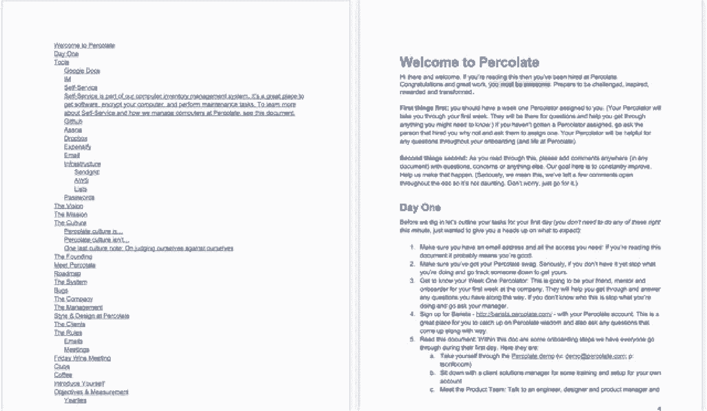

# 帮助新员工成功(并留下来)的入职策略的 6 个必读书目

> 原文：<https://review.firstround.com/our-6-must-reads-for-onboarding-tactics-that-help-new-hires-succeed-and-stay>

招聘经理和创始人花费如此多的时间和精力来招聘、评估和关闭有才华的候选人。虽然让明星候选人在虚线上签字可能需要创造性的招聘策略和延长的时间表，但在许多方面，真正的旅程才刚刚开始。新员工的第一天和第一周将决定他们是否会长期留下来。但很多时候，初创公司对入职投资不足，或者完全忽视它，希望“火的考验”是一个可靠的老师。

我们发现拥有一个支持系统是至关重要的。开始一份新工作带来的情绪旋风在快速扩张的初创公司中[加剧；一个新的团队成员是感到鼓舞和兴奋，还是被创业公司的飞速发展所排斥和迷惑，这在一开始就决定了。**最初的几周为新员工如何融入你的文化、他们的角色以及他们在公司的长期前景奠定了基础。**](https://firstround.com/review/make-friends-with-the-monster-chewing-on-your-leg-and-other-tips-for-surviving-startups/ "null")

换句话说，入职不仅仅是标准的 IT 设置和操作咖啡机的友好指示。为了帮助分解优秀入职流程的基本要素，我们收集了评论中最有经验的操作员对入职的看法，以帮助您最大限度地发挥这些决定性的首次互动的影响。

他们的战术建议涵盖了理想的第一天时间表的模板，以及初创公司如何将文化对话具体化。它还考虑了入职的影响，这种影响在物流的基本任务被检查后很长一段时间内仍然存在，讨论了初创公司如何利用入职作为一个机会，将派系消灭在萌芽状态，并加深新员工对行业的理解。

我们希望他们的智慧能激励你充分利用新员工的最初几天，并帮助你确保你的创业公司仍然是一个令人信服的、紧密的和有益的工作场所。

当人们问有着 15 年人事经验的 Carly Guthrie 如何看待初创公司应该修复他们不完善的员工入职流程时，她喜欢用一个笑话来开场:

你在通往天堂的天国之门受到圣彼得的欢迎，他问你想在哪里度过永生。“嗯，当然是天堂！”你说。彼得回答道:“在你承诺之前，你必须去看看地狱，看看你是怎么想的。”失望，你耸耸肩，但同意。令你惊讶的是，当电梯门打开进入地狱时，你会看到金色的海滩、高尔夫球场、华丽的人和五颜六色的饮料。这不是你所期望的，但也许天堂会更好，你想。所以你乘电梯返回，但你只发现有一堆无聊的竖琴在云端弹奏。好像连好吃的都没有。

你回到彼得身边:“我没想到我会这么说，但我想我宁愿下地狱，”你说。“就这样吧，”他说，然后你就回去开始你新的来世了。只是这一次，当门打开时，你会遇到火，硫磺和流动的岩浆。“这是什么？”你大喊大叫。“海滩在哪里？怎么回事？”你的欢迎委员会茫然地盯着你:“哦，”他们说。昨天我们在招募你。今天，你有了员工。”

格思里现在是 **[希斯陶瓷](https://www.heathceramics.com/ "null")** 的人力资源总监，他说，尽管初创公司的初衷是好的，但这种偷梁换柱的行为在新员工身上时有发生。当它发生时，没有人受益。她分享了两个阻止初创公司投资入职的常见误区，以及初创公司如何克服这些误区，帮助员工走向成功。

误解 1:招聘比入职更重要。

格思里说:“现在科技行业对最优秀的人才展开了暗箱操作的竞争。“每个人都非常专注于获得最优秀的人才，这耗尽了所有的带宽，耗尽了他们的生命，但一旦他们赢得了这场战斗，并获得了某人的签名，他们就放弃了。”

这是一种危险的心态，只是简单地坐在座位上，很少考虑入职过程或新员工的早期经验。“每个人都想感受被珍惜的感觉，尤其是在被如此积极地追求之后，”她说。“有这种天赋的人总是会接到招聘人员的电话，如果他们突然意识到他们现在对你来说只是一个数字或一个齿轮，他们还有其他选择。”

对于早期创业公司来说，考虑人力资源也很重要，即使创始人或招聘经理仍然承担着招聘的主要责任。“你不需要有一个内部人力资源人员或部门，”格思里说。更确切地说，这是关于过程的，应该在你公司的生命周期中尽可能早地开发，并且有人来执行它。她说:“即使你和一位人力资源经理签了合同或做了兼职，你也应该早点开始。”。“当你谈论定义文化和入职时，与人力资源人员建立信任和理解要容易得多。你最不想做的事情就是在你已经身处困境的时候把它们带进来。”

例如，如果一个人刚认识你，而且刚进公司时很冷淡，那么让他帮你找到解雇他的方法是很有挑战性的。没有一家公司不需要进行这样艰难的对话。如果你经营一家公司或管理人员，你将不可避免地需要解决低绩效或解雇某人的可能性。格思里说:“没有一个共鸣板，尤其是一个你可以信任的、能给出诚实意见的共鸣板，独自完成这些事情是非常困难的。”。这是你应该趁早寻找一个建设性的人事关系的主要原因，尽管你还很小。

“如果你在一家真正的初创企业，你肯定不需要全职员工，但公司里应该有人戴上这顶帽子。她说:“我建议找一个有人力资源经验、同时也能做办公室经理工作的人，而不是相反。

Carly Guthrie, Director of Human Resources at Heath Ceramics

**误解 2:你的初创公司太“瘦”了，不适合入职。**

格思里说:“很多公司都用这个借口来掩饰:‘嗯，我们是一家斗志昂扬的初创公司，发展如此之快，以至于我们没有太多时间来做一些事情，比如在新员工的电脑上安装 Chrome，或者给某人布置办公桌。’”“事情可能就这么简单，但它传达的信息是，你不能被打扰，你不关心细节，你喜欢泛泛而谈，最危险的是，他们不应该麻烦你问问题。这告诉人们，当他们看到一个错误或错误时，如何对待你们公司的产品或用户？”

草率的入职变成了草率的文化。

“如果你接受人们太忙而没有时间给新员工好的体验这一事实，这种态度会在你每次雇佣新人时延续下去，”她说。

格思里说，忙于一家小公司不是借口。“你不太忙。你花了这么多时间、精力和金钱让这个新人加入。如果你不得不从头开始招聘过程，搞砸了会让你付出更大的代价。**不要让别人觉得你太忙了，以至于无法让他们对选择在你的公司工作感到满意。”**

你的目标应该永远是让人们相信你的组织是如此的神奇，以至于他们不可能在其他地方工作。一旦录取通知书被签署，建立这种态度就立即开始了。如果你做得好，当电话铃响时，电话那头的招聘人员会提供下一个大项目，他们会说，“对不起，我对我现在的工作很满意。”

第一天是你成为你在招聘过程中所说的那个人的机会。

阅读更多格思里的观察和建议，了解为什么初创公司的员工入职不稳定(以及如何解决这个问题)。)

当在几个月内将员工人数从 30 人增加到 60 人的时候， **[诺亚·布瑞尔](https://www.linkedin.com/in/noahbrier/ "null")** 知道他必须牢牢掌控局面。如果他希望渗滤液可持续发展，他必须设计一种方法来培育公司的增长，同时整合和激励他的最新员工。对他来说，这意味着设计一个深思熟虑的入职战略。

在这里，Brier 分享了他在渗滤液的早期提出的详细蓝图，概述了新员工在办公室至关重要的第一天结束时的入职准备。

**周五抵达前**

在新员工入职前的周五，他们可以查看自己的电子邮件和一份满满的日历。“我知道关于入职时间表有不同的观点。布赖尔说:“一般来说，我们会努力让新员工超额完成工作，而不是低于计划。“以我个人的经验来看，第一天上班却没有任何工作或者不知道该做什么，这种感觉很奇怪。所以我们尽可能地充实那些日子。”

默认填写新员工的日历。不要让他们觉得他们的出现让你很惊讶。

以下是新员工为第一周做准备而收到的更多关键信息:

实用说明，包括电子邮件登录、到达时间和常见问题

通过电子邮件介绍给一位“过滤者”，这位员工会伸出手来欢迎新员工，并作为另一位关键人物来回答问题和提供指导

People Ops onboarding 日历，列出了第一周的头两天会议和体式任务。

**第一天**

新住处渗滤液将新员工的桌子摆好，这样就不需要寻找供应品了。电脑、显示器、笔记本电脑和笔等标准配置的物品摆放整齐。Brier 说:“你一进门，你的桌子上就摆满了你开始工作所需的所有东西。“我见过做得不好的事情之一是，新员工需要等到 2 点钟才能拿到笔记本电脑。显然，这是每个人都想做的第一件事。”

**头像**

不是每个公司都做专业的头像，但这是一个需要过滤的重要细节。“这是我们做的事情，人们似乎真的很欣赏。布赖尔说:“我们有一个摄影师，可以为每个人拍大头照。“成为社区的一部分很重要，而实现这一点的一个关键是表现出是部落的一部分。因此，如果你去查看一些员工的 LinkedIn 页面，你会发现他们有着非常相似的头像。"

**第一天文件**

在 2013 年的六个月里，一半的员工没有听过 Brier 谈论它的价值观和今年的启动计划。他通过写下一切来解决这个问题。没有什么比语言更好或更快。另外，文档是现成的资源，而人们并不总是有空。

创立渗滤液六个月后，布瑞尔写了渗滤液的公司文化的详细文件的原始版本。它存在于谷歌文档中，并在他的员工手中得到发展。“有很多事情正在发生，它由它是什么和它不是什么来定义。这不是你的人力资源通读你的福利，”布赖尔说。“这是我们活生生的文件，涵盖了我们文化的方方面面，从公司的起源到我们对会议的看法。主要是关于我们的文化、理念和方法。我们试图专注于解释，而不是规则。”

该文件本身是一个活生生的人造物的一个渗滤液的创始价值。“第一天的文件是我们把一切都写下来的信念的最好例子，”他说。设计一个能让新员工快速熟悉的全面的入职计划的关键是记录所有的事情。我们发现单词的伸缩性很好。此外，文档是一种现成的资源，新员工可以在询问其他同事之前参考，如果你是创始人，这是必不可少的。有了这样的文档，您的团队可以异步学习和参与。”

**“自我介绍”邮件的活档案。**如第一天文件中所述，员工在第一天结束时发送一封“自我介绍”邮件。这是新员工对公司的问候，分享一些背景和琐事。“公司开头的每个人都发一个。它还包括一张照片和一个链接，链接到咖啡师的三个问题，这是渗滤液的内部 Q & A 平台。Brier 说:“这个想法不仅仅是提供信息，而是开始与你的新团队进行交流。”

“自我介绍”邮件作为新员工每封自我介绍邮件的存档和灵感来源而存在。布瑞尔说:“人们回去读它们，是为了获得指导、观点或纯粹的娱乐。”。“最初，我们鼓励人们分享尴尬的照片来取乐，但当我们接触到大约 150 人时，我们认为明智的做法是取消这一提示。所以，我们告诉人们包括任何快照，但尴尬的照片不断出现。显然，每个人都受到了老方法的启发。这是一种很好的方式，让人们通过这些另类的故事相互了解。”

*[阅读更多关于 Brier 的测试策略，以创建一个紧凑、有影响力的入职时间表，从录取通知书签署之日到第一周结束](https://firstround.com/review/the-only-onboarding-timeline-youll-need-from-offer-to-first-friday/ "null")* *。*

自 2010 年 **[戴夫·吉尔波](https://www.linkedin.com/in/davegilboa/ "null")** 和 **[尼尔·布卢门撒尔](https://www.linkedin.com/in/nblumenthal/ "null")** 为 **[沃比·帕克](https://www.warbyparker.com/ "null")****雇佣第一名正式员工以来，有一个信念一直不变:联合创始人坚信创造非凡的员工生命周期与开发一款杀手级产品一样重要。**

**“有一件事我一直感到惊讶和不幸，那就是**随着公司变得越来越大，越来越有钱，越来越有能力投资于员工体验，它们实际上变成了更糟糕的工作场所**，”Gilboa 说。“这让我们害怕。”**

**在入职之初，新员工应该立刻感觉自己是公司独特文化的一部分。“你必须让人们从第一次踏入你的公司时就感到特别和受欢迎，”Gilboa 说。**

**

Warby Parker co-founders Neil Blumenthal and Dave Gilboa** 

**在这里，Gilboa 分享了三个指导 Warby Parker 有趣的入职方法的策略。**

**把流行的欢迎包放在一起。**

**沃比·帕克的欢迎包包括标准的发行品，比如办公室地图和风格指南，但也有意想不到的东西:一本杰克·凯鲁亚克的*达摩流浪者。“沃比·帕克这个名字来自两个早期凯鲁亚克的角色，”吉尔博说。“我们希望从第一天起，这一传统就成为员工体验的一部分。这对我们来说是完全独特的，将永远脱颖而出。”***

**帮助新员工成为办公室里最平易近人的人。**

**初来乍到可能很糟糕。你觉得你必须马上证明你的价值。你周围的每个人都有某种程度的共同历史、内部笑话和机构知识。为了帮助你的新员工打破僵局，你需要减轻他们肩上的压力，让你现有的团队轻松地将他们融入文化和对话中。**

**沃比·帕克用几种方法做到了这一点。第一种是大公司经常做的事情的古怪变体，但在小公司很少。他们设计了一个定制的氦气球，上面有一幅牛排和一副眼镜的插图。上面写着，“很高兴吃到你！”这些气球在新来的头几周贴在每个人的桌子上。其他员工习惯于把气球当成信标，这样他们就可以介绍自己，和新员工搭讪。**

**新员工也被要求在全体会议上做自我介绍，这样他们就能在公司其他人面前发现共同点和内部笑话。作为这个介绍的一部分，他们被要求分享一个有趣的事实。“他们中有抱着迈克尔·杰克逊婴儿的人，也有宣称自己有着 6 英尺高男人的结肠的 5 英尺高的女人，”吉尔博说。**

**通过让人们分享一些难忘的(偶尔也很奇怪的)事情，你可以帮助他们变得更容易被同事认出来，让每个人都有机会更好地相互了解，并在办公室里开始交谈。人们并不像你认为的那样主动为自己这么做。你需要让他们在工作的第一天就融入这一点，让他们像自己希望的那样平易近人——而不是让他们自己承担建立一堆关系的责任。**

**将培训作为高管的首要任务。**

**太多的公司将新员工的入职和培训委托给初级员工或人力资源团队。有些甚至外包出去。但是 Gilboa 说，好的领导者甚至不会梦想放弃这个重要的任务。他表示:“我们认为，公司最高层人士参与这一过程至关重要，包括我和我的联合创始人。”。**

**过一段时间后，这些演示可能会显得重复，或者低于最高管理层的薪酬级别，但让他们入职会传达一个强烈的信息，即新员工对公司极其重要。除此之外，初创公司的领导团队往往对所有重要的机构知识都了如指掌——从起源故事到治理结构。**

**当公司价值观被创始人清晰地阐述、详细地解释和强调(最好是用例子)时，它们比仅仅写在一张纸上或墙上的海报上更有分量。**

**阅读更多关于 Warby Parker 的联合创始人如何让员工生命周期中的每一点都变得非凡的信息。**

**回到 **[中庭](https://www.atriumhq.com/ "null")** 联合创始人 **[彼得·卡赞吉](https://twitter.com/kazanjy "null")** 为 [TalentBin](https://www.talentbin.com/ "null") 组建最初的销售团队时，他被贫穷员工入职的高机会成本所震惊。这背后的代数是:训练有素的销售代表会产生快乐的顾客。因为快乐的客户会重复出现并推荐给其他人，错过或不满意的客户(无效销售代表的后果)会剥夺公司巨大的未来价值。**

**他认为，一旦你扣动了扳机，雇佣了你喜欢的销售人员，你的全部注意力就需要尽可能快地全面提高生产率。他意识到，应对这些损失的最佳武器是一个铁定的入职计划，该计划将为新员工提供他们获得和完成业务所需的所有资源。**

**在他的[严格的入职框架](https://firstround.com/review/youre-losing-hundreds-of-thousands-of-dollars-because-of-poor-sales-onboarding/ "null")的一小部分中，Kazanjy 强调了在入职过程中具体化文化的重要性。虽然在接下来的部分中他戴着销售的帽子，但他的入职建议对所有角色都有价值，不仅仅是销售。对于 Kazanjy 来说，确保文化不仅仅是一次对话是很重要的。“这是你展示公司执行方式的方式，什么值得庆祝，什么应该受到指责。他说:“在入职初期，就积极明确地讨论你的销售组织重视什么，不重视什么。**

**以下是 Kazanjy 在 TalentBin 入职时提出的三个原则:**

**你不一定要成为一名工程师才能用工程思维来运作。Kazanjy 说:“这是我们希望销售团队和公司的每个人都能够体现和坚持的价值观，鼓励他们找出制约因素，提出解决方案，测试它们，清洗和重复。”。**

****我们都是我们销售机构的产品经理**。“我们希望人们表现得像产品经理一样，这样他们就会不断地思考改进我们工作流程的方法，”他说。“我们实际上将销售流程的不同方面称为‘功能’，并要求人们说出他们的想法，即哪些功能应该重复、删除或添加。”**

****智力诚实至上**。“公司本身诞生于一个最初失败的产品。我们必须转向产品/市场匹配。但是如果我们没有在自我评估中非常诚实的话，那是永远不会发生的。他说:“在你能够改进之前，你必须愿意宣布失败，而我们想要持续改进。”。**

**这些是你想立即传达给新员工的文化试金石，不管他们在公司的角色如何。它们应该被表述为基础的和坚定的。有了这些原则，将有助于你招聘，并且很容易发现哪些新员工真正受到了它们的启发。**

**最后，每门文化课程都应该包括你公司的历史课。Kazanjy 说:“对你公司的发展道路进行一次强有力的回顾对文化入职很重要，并提供了一个关键的机会来强调你希望人们如何工作的主题。”**

**用公司历史来框定你的文化。“这是我们开始的地方，也是我们如何到达这里的。这就是我们现在所在的地方，也是我们将要去的地方。”**

**阅读 Kazanjy 严格的入职流程可以帮助 B2B 初创公司建立准备最充分的销售团队。**

****[大卫·洛夫特斯](https://www.linkedin.com/in/dloftesness/ "null")** 和 **[亚历山大·格罗斯](https://www.linkedin.com/in/alexandergrosse/ "null")** 都经历过缩放团队辉煌和惨淡的时刻。他们两人曾在 Twitter、SoundCloud、Amazon/A9、issuu 和诺基亚担任工程领导职务。(如今，Loftesness 是 **[eero](https://eero.com/ "null")** 的工程主管，Grosse 是**[BCG Digital Ventures](https://www.bcgdv.com/ "null")**的工程副总裁。)在他们的职业生涯中，当热门产品要求他们的公司以新的方式快速扩展时，他们已经带领工程技术走过了这段时期。**

**两人都认为，随着初创企业的快速发展，入职培训发挥了至关重要的作用，帮助新员工感受到支持，并朝着更大的目标前进。实事求是地说，入职就是新员工有时间了解公司，认识他们可能不会遇到的同事。**

**Loftesness 说:“这是向他们介绍每个职能部门的时候了——数据团队、工具团队、销售团队、产品团队，你能想到的都有——*在*他们陷入日常工作之前。**“培养对每个团队的理解，他们的挑战是什么，在一次有意义的互动后将名字贴在脸上的基本行为，是一种避免派系斗争的好方法。”****

**你业务的细节和需求将决定你能在这个跨部门的“了解你”上花多少时间但是，即使是与不同部门的同事开几个半小时的会，也会有很大的不同。另一方面，正式的、为期一周(或更长时间)的不同团队轮换可以建立更强的联系。以下是一些公司如何进行入职培训的:**

**Loftesness 说:“eero 推出了一个‘影子计划’，让其他部门的新同事了解你工作的日常情况。”。“例如，销售团队实际上会带工程师、CX 代表和经理去百思买，指导他们完成零售培训计划。他们亲眼看到端盖以及产品的定位。他们可以真正体验销售团队的生活。”**

**在亚马逊，顾客满意是至高无上的，像所有有一定资历的经理一样，Loftesness 被要求花几天时间作为一名顾客服务代表接受培训。“我不得不说，‘顾客关系’培训令人大开眼界。这也非常鼓舞人心。他说:“当你真正看到真正的客户有什么不满，哪里有机会让他们更开心时，你认为你的团队需要关注的问题就会转移。”**

****Issuu** 比跟随更进了一步。这实际上延迟了工程师的团队任务，直到他们完成了一个健壮的入职流程。首先，新员工在每个团队待一周。“在那五周之后，我通常会和新来的工程师，也许还有两个团队领导坐在一起，我们会为他们的位置决定一个团队。Grosse 说:“这始终是业务需求和工程师个人偏好之间的妥协。“在某种程度上，这种入职流程是我们招聘流程的延伸:它只适合我们想要吸引的工程师——那些愿意接受广泛挑战的人。但不管怎样，它鼓励更深入地参与入职流程。当你在入职前分配团队时，新员工会缺乏耐心。可以理解的是，他们希望为自己的团队做出贡献并获得成功。如果他们不知道自己的团队是谁，他们通常会对公司更好奇，会问:“嘿，这里有什么，那里有什么，有什么有趣的吗？”“我能在哪里做出贡献，”"**

**一旦你发展到超过五六个团队，或者开始以更快的速度雇佣员工，基于轮换的入职流程可能会因为团队数量过多而无法扩展。但是，虽然增长使某些入职实践变得复杂，但它也促进了其他实践。**

****“在一定规模下，你发展得如此之快，以至于你可能在一周内就有 5 到 10 名甚至更多的员工。利用这些新员工，帮助他们像大学新生一样团结起来。**即使没有团队轮换，他们也可以利用这些个人关系来更多地了解其他团队。Loftesness 说:“这是一种非常有效的方式，可以在不牺牲严谨性的情况下正式入职。“此外，这些人可能会在不同的部门结束，他们将形成并促进联系和共鸣。当人们在公司的其他部门有朋友时，随着时间的推移，这可能是一种真正有用的将这些团队团结在一起的方式。”**

**在你的入职过程中，也要为关键文化把关人的信息检查留出空间。**“比如，让新员工和老员工在一个房间里，这样可以保持和你早年的联系。鼓励他们分享故事，包括艰难的失败和鼓舞人心的成功。Loftesness 说:“这可以让新员工了解老员工是如何让公司发展到今天这个地步的。****

**“在 Twitter，一个新手进来，看着单轨铁路上一些粗糙的 Ruby 代码，然后想，‘天哪，这些人在做什么？’但是一旦你听说了那段代码的起源，它是如何在凌晨两点，就在格莱美奖之前，当网站即将崩溃时，拯救了这一天，[你就会对守旧派所经历的事情产生更多的共鸣](https://firstround.com/review/empathy-driven-development-how-engineers-can-tap-into-this-critical-skill/ "null")。他说:“这种共同的理解在不同代的员工之间创造了凝聚力，随着公司的发展，这种联系只会变得更加重要。”**

***[点击此处阅读 Loftesness 和 Grosse，了解创业公司如何在没有派系的情况下持续发展。](https://firstround.com/review/fighting-factions-how-startups-can-scale-without-mutiny/ "null")***

**你可能知道良好入职的基本要素:让新员工融入他们的团队，把他们介绍给拥有有用机构知识的人，分享你公司的价值观。**

**Meg Makalou 挑战初创公司，让他们的入职更进一步。她是大大小小初创公司的人力资源负责人，从在高速增长时期担任 Zynga 人力资源副总裁的四年，到目前担任气候公司的首席人力官，以及首轮公司的常驻人力运营专家。她遇到过各种员工绩效问题，并耐心、清晰、优雅地完成了一些最棘手的人力资源对话。**

**

Meg Makalou, Chief People Officer for The Climate Corporation** 

**在马卡卢看来，入职不仅是将潜在的绩效问题扼杀在萌芽状态的一种方式，也是培养真实性文化的一种方式——这是成功的初创公司所需的敏捷性的一个关键前驱。**

****“不要错过发展的机会，从一开始，每个新员工都要对公司的业务有敏锐的洞察力。她说:“这有助于将其他事情放入上下文中。****

**换句话说，入职不仅仅是确保技术准备就绪。这应该是一个整体的过程，让新员工从宏观层面了解他们在更大的生态系统中的位置。**

**很多时候，初创公司专注于分享机构知识，而不是行业知识。另一方面，如果你给新员工一个行业的背景，你会给他们更大的想象力和影响力。**

**例如，在气候公司(Climate Corporation)，行业级教育采取为期两天的农业基础课的形式。普通的软件工程师对种植作物知之甚少甚至一无所知。但是一旦他们经历了经营一个虚拟农场的练习——从购买拖拉机到应对不合作的天气——他们就能更好地开发终端用户需要的产品。**

**在其他地方，你的训练可能会更简单。马卡卢曾是 Andale 的人力资源经理，该公司为易贝卖家开发拍卖管理工具。"[当时的首席执行官 mun jal Shah](https://www.linkedin.com/in/munjalshah747/ "null")知道人们需要马上了解我们公司正在做的事情，所以他要求每个人都在易贝卖些东西。可能是我们办公室里的东西。你不必去找东西卖，但你必须体验在易贝做卖家的经历。你必须亲身体验那是什么感觉，需要什么。”**

**点击此处阅读更多关于马卡卢处理最棘手的人事对话的策略。**

***摄影由* *[邦妮·雷·米尔斯](http://www.bonnieraemillsphoto.com/ "null")* *。图片由 iStock / Getty Images /Rost-9D 提供。***