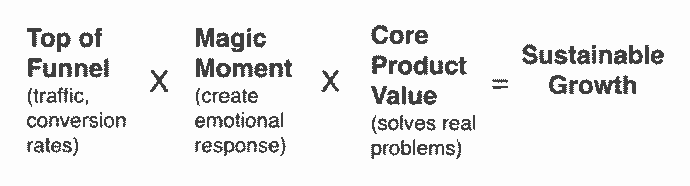

# 如果你要招聘产品经理，我们的 6 个必读内容

> 原文：<https://review.firstround.com/our-6-must-reads-if-youre-hiring-a-product-manager>

**在大多数创业公司，CEO 都是第一产品人。**通常，他们会与技术联合创始人一起设定愿景，然后开始构建。为了帮助他们，他们请来了工程师——也许 12 个，也许 20 个——和一个设计师，他们管理着一个(希望)专注的产品。为了测试产品与市场的契合度，他们可能会雇佣一名营销主管。销售线索。每个人都在努力创造这个东西，或者看看人们是否想要这个东西。

然后，突然之间，管理所有这些人开始感到难以管理。首席执行官不可能成为这些群体之间的渠道，并覆盖他们的其他首席执行官基础——筹款、日常后勤、对外代表公司。他们希望他们可以克隆自己以保持产品正常运行——所以他们雇佣了第一个项目经理([或者他们接受我们的朋友 Gokul Rajaram 的建议，在内部提拔某人](https://medium.com/@gokulrajaram/the-biggest-mistake-ceos-make-when-looking-for-their-first-product-manager-347aaeb15a75 "null"))，如果他们没有选择正确的人，就开始了一个棘手的职责、权力和信任的过渡。

如果进展顺利，那只是开始。随着公司的成长，项目经理必须多次复制自己，以创建一支知道并关心创始人最初和不断变化的愿景的建设者队伍。这听起来很难，因为事实如此。

在这次审查中，我们认为我们的责任不仅仅是展示，而且是**包装**我们能从有经验的专家那里找到的最好的建议。本着这种精神，我们希望总结出创业公司雇佣优秀产品经理的 6 个最有影响力的事情。一如既往，我们的目标是帮助您快速变得聪明，并应用您所学的知识，为您的公司或职业生涯带来立竿见影的效果。让我们开始吧。

# 1.创建项目经理角色，并围绕他们设计您的面试流程。

这个来自 **Dropbox 的产品副总裁托德杰克逊**。[如果你打算雇佣一名项目经理，这篇文章从头到尾都充满了黄金](http://firstround.com/review/find-vet-and-close-the-best-product-managers-heres-how/ "null")。我们建议阅读全文，因为它会带你了解你应该在 PM 中寻找的“必须具备”、“最好具备”和“额外”品质，实际存在的 LinkedIn 个人资料分为你应该注意的类别(无论是好的还是坏的)，面试问题和理想答案，以及结束你选择的候选人的脚本。这是我们见过的对这一过程的最好的整体演练——考虑到 Jackson 在谷歌、脸书、Twitter 和他自己的公司封面上的广泛 PM 经验，这并不奇怪。

# 2.检查厨师和士兵共有的这些品质。

听起来违反直觉，但 **Eaze 首席执行官 Jim Patterson**——他本人是前空军，并有雇用实际前厨师的记录——相信一系列属性也决定了在军队和厨房的成功。作为引子，下面是他建议的清单:

能够在没有权威的情况下领导。

总是在给予信任的同时接受指责。

不完全信息下的强决策。

重视紧张的准备工作。

有条不紊地从错误和危机中恢复。

在极端压力下最佳运行。

阅读这篇文章，了解更多关于如何判断你对面的候选人是否具备这些特质的信息。如果你在简历上看到“快餐厨师”，也许可以考虑把它放在最前面。

# 3.每次问这些问题都是为了雇佣一个优秀的员工。

[这个招聘系统来自](http://firstround.com/review/hire-a-top-performer-every-time-with-these-interview-questions/ "null") **[Koru 的首席执行官克里斯汀·汉密尔顿](http://firstround.com/review/hire-a-top-performer-every-time-with-these-interview-questions/ "null")** [并不是专门针对项目经理的，但它对如何测试优秀员工共有的品质很有见地，因此我们把它列入了必读类别](http://firstround.com/review/hire-a-top-performer-every-time-with-these-interview-questions/ "null")。我们喜欢她如此简单地总结招聘经理们通常认为他们在寻找的特质——勇气、团队合作、严谨、所有权等等。—但不知道如何在一系列长达一小时或 30 分钟的面试中真正衡量。在这篇文章中，她详细介绍了该问什么，你在人们的回答中寻找什么，以及何时该放弃。**它被分享超过 13000 次是有原因的**。

# 4.招募拓荒者、定居者和城镇规划者。

当然，我们知道你在森林里除了一把斧子和一把小刀什么都没有，但是我们也知道作为一个创始人有时会有这种感觉。[这就是为什么我们发现这个来自](http://firstround.com/review/the-power-of-the-elastic-product-team-airbnbs-first-pm-on-how-to-build-your-own/ "null") **[乔纳森·戈尔登](http://firstround.com/review/the-power-of-the-elastic-product-team-airbnbs-first-pm-on-how-to-build-your-own/ "null")****[Airbnb 有史以来第一位产品经理](http://firstround.com/review/the-power-of-the-elastic-product-team-airbnbs-first-pm-on-how-to-build-your-own/ "null")** [的建议，如此引人注目](http://firstround.com/review/the-power-of-the-elastic-product-team-airbnbs-first-pm-on-how-to-build-your-own/ "null")。为了取得长期的成功，他敦促初创企业的领导者要有长远的眼光——不要仅仅依靠项目经理来获得更多的帮助。在公司发展的不同阶段，雇佣特定类型的项目经理——他把他们划分为先锋、定居和城镇规划者——以保持迭代和增长，同时保持稳定(这是一个被低估的优先事项)。他的采访详细介绍了如何识别、聘用和利用这些项目经理类型。

# 5.将这个等式应用于令人惊叹的增长招聘。

现在是 Wealthfront 的产品副总裁，Andy Johns 已经积累了他在脸书、Twitter 和 Quora 的所有经验，成为了一名管理不断增长的创业公司用户群的大师。[所有这些都指向一个等式，他说每个创业公司都应该内化这个等式](http://firstround.com/review/indispensable-growth-frameworks-from-my-years-at-facebook-twitter-and-wealthfront/ "null"):

这和雇佣 PMs 有什么关系？约翰斯说，等式是任何关于增长的谈话的基本出发点——无论是评估产品还是测试潜在雇员的理解和敏锐度。

“所以，当你和一位增长型候选人的主管聊天时，问问她评估公司增长的框架，”约翰斯说。“她至少应该能够从那个成长方程式开始，最好能深入挖掘，展现出你还没有考虑到的体贴程度。让她在白板上模拟并描述出来。两者都是必备技能。”

作为额外收获，[他还深入探讨了项目经理应该具备的强制性成长能力，如何发现这些能力，并确保他们能够进行明智而有价值的实验。](http://firstround.com/review/indispensable-growth-frameworks-from-my-years-at-facebook-twitter-and-wealthfront/ "null")

# 6.带一个交通警察到你的队伍中来。

这是很少有公司做的事情。相反，他们雇佣几个项目经理，分配功能和产品，并让他们一起运行。[根据](http://firstround.com/review/to-build-great-products-build-this-strong-scalable-system-first/ "null") **[Reddit 的产品联合副总裁 Kavin Stewart 和 Alex Le 的说法，](http://firstround.com/review/to-build-great-products-build-this-strong-scalable-system-first/ "null")** [如果你在成长的这个阶段引入一个交通警察 PM(即产品运营专家)，你会走得更快，学得更多，并保持有组织性](http://firstround.com/review/to-build-great-products-build-this-strong-scalable-system-first/ "null")。这个人应该关注两件事:

收集和交流实验数据。

指导每个人构建功能并运行与公司目标相关的测试。

通过充当测试结果的中心枢纽(以一种让每个人都可以看到的方式收集和共享测试结果)，该产品 ops PM 可确保您沿着负责任、理智的轨迹不断改进(即，不要将每个成功的实验都提高到 100)。请继续阅读，寻找这个角色的最佳人选。

*这远远没有结束对产品相关智慧的回顾。欲知更多最佳途径* *[路线图](http://firstround.com/review/to-build-great-products-build-this-strong-scalable-system-first/ "null")***[分清轻重缓急](http://firstround.com/review/This-Product-Prioritization-System-Nabbed-Pandora-More-Than-70-Million-Active-Monthly-Users-with-Just-40-Engineers/ "null")***[计划](http://firstround.com/review/Process-is-Being-Told-What-to-Do-By-Someone-Who-Has-Less-Information-than-You/ "null")***[成长](http://firstround.com/review/answers-to-your-tough-questions-about-growth-learned-while-scaling-eventbrites-5b-growth-engine/ "null")***[衡量](http://firstround.com/review/im-sorry-but-those-are-vanity-metrics/ "null")* *和* *[船](http://firstround.com/review/the-right-way-to-ship-software/ "null")*****

**特瑞娜·达尔泽尔的艺术作品/Ikon 图片/盖蒂图片。**