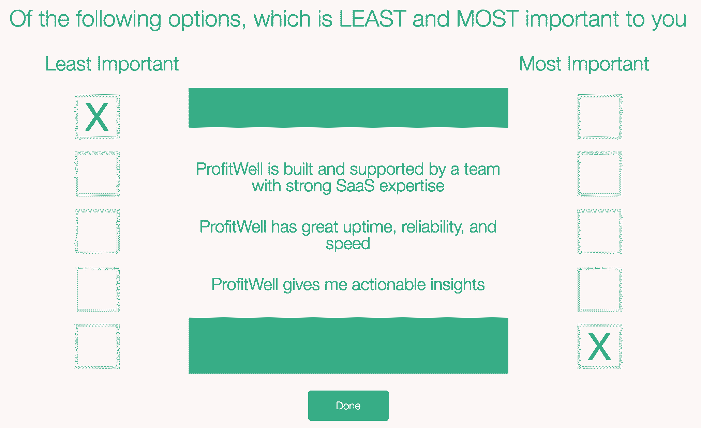
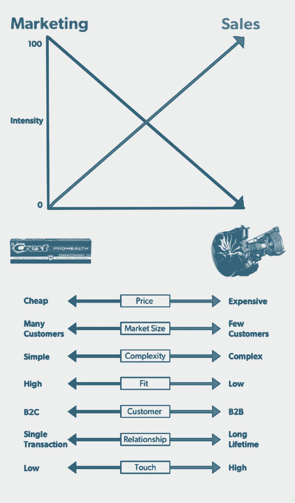

# 产品定价的 6 个必读书目

> 原文：<https://review.firstround.com/our-6-must-reads-on-pricing-a-product>

据说，传奇的《今夜秀》主持人[约翰尼·卡森](https://en.wikipedia.org/wiki/Johnny_Carson "null")曾经采访过著名推销员[金克拉](https://en.wikipedia.org/wiki/Zig_Ziglar "null")。卡森已经准备好考验齐格拉了。

“他们说你是世界上最伟大的推销员，”卡森说。“你卖给我点东西怎么样——比如说这个烟灰缸？”

“在我能做到之前，”齐格拉尔看着烟灰缸回答道。“我必须知道你为什么想要它。”

“我猜它制作精良，看起来相当不错，是个不错的烟灰缸，”脱口秀主持人回答道。

“好吧，”齐格拉回答道，“但你必须告诉我，你认为它对你来说值多少钱。”

“我不知道，”卡森想，“我想 20 美元应该差不多了。”

“成交！”齐格勒笑着喊道。

无论这种交流是寓言还是事实，它都揭示了产品定价的许多含义:从互动方法到分层的事实调查。对于初创公司来说，为产品或服务定价是你必须走过的一道门槛——否则用户可能会在门槛处抛弃你。

在这篇评论中，我们重点介绍了几位敏锐的头脑，他们多年来灵活地驾驭着定价过程，并因此成就了事业和公司。我们没有让你在我们的档案中寻找它们，而是收集了**一家初创公司可以采取的六个最有影响力的行动，以获得正确的定价**。一如既往，我们的目标是帮助您快速变得聪明，并应用您所学的知识，为您的公司或职业生涯带来立竿见影的效果。或者，在这种情况下，帮助你避免购买或出售 20 美元的烟灰缸。开始了。

# 先定价格，后定产品。句号。

根据咨询公司[西蒙-库彻&合伙人](http://www.simon-kucher.com/ "null")董事会成员兼合伙人 **[马德哈万·拉玛努贾姆](https://www.linkedin.com/in/madhavan-ramanujam-1533063 "null")** 的说法，围绕价格展开*是*前进的方向。在该公司，他管理过 125 个以上的定价项目，涉及的公司从新兴的初创公司到财富 500 强，他还调查过这些公司。以下是一些发现:

约 80%的受访者表示他们面临价格压力。

~60%的人甚至说他们在打价格战。

为了生存，公司应对价格压力的最佳方法是发布新产品和服务。

然而，这些创新中有 72%没有达到他们的收入或利润目标，甚至完全失败。

Ramanujam 断言，新产品失败的原因有很多，但问题的根源是没有将客户对新产品的支付意愿(WTP)放在产品设计的核心位置。大多数公司推迟定价决定，直到产品开发完成后，希望他们会赚钱，而不是知道他们会赚钱。以下是如何避免落入陷阱的方法:

询问某人是否喜欢某个产品。然后问他们是否喜欢这个价位，比如 20 美元。整个对话都变了。

在他的评论文章中，Ramanujam 称之为支付意愿谈话，根据西蒙-库彻的研究，大约 80%的公司不这样做。Ramanujam 说:“一开始就要问人们是否会为你打算开发的产品买单。”“提前回答这个问题非常重要，因为客户不会有讨价还价的心态。相反，他们会给你客观的反馈，你可以利用这些反馈来确定你正在构建的东西的优先顺序。”

# 将价格敏感度融入您的功能偏好调查中。

这些年来，帕特里克·坎贝尔(Patrick Campbell)见证了初创公司和跨国公司一样努力完善产品，但在定价时却漫不经心地举手示意。所以他推出了智能定价来帮助 SaaS 的公司，如 Atlassian、Hubspot 和 Insightly，特别是通过调查来提高收入和对用户的了解。

当然，在市场营销的世界里，没有什么比在线调查更令人恐惧或喜爱的了。坎贝尔和他的公司已经发送了超过 1500 万份调查，并研究了这一过程中的可行和不可行之处。这让我们想到了坎贝尔最喜欢的策略，包括他如何设计他的[特征偏好调查](http://www.priceintelligently.com/blog/bid/194853/Lessons-from-Sending-One-Million-Surveys "null"):

首先，使用相对偏好方法集中调查测试两个要素——功能和价格敏感度。

为了测试相对偏好，列出一组特征——包括一个衡量价格敏感度的特征——来评估和研究极端情况。然后，让调查者找出最不重要和最重要的选项。这里有一个例子:

这种方法的美妙之处在于，它有效地提取了问题中人们的偏好。它介于多步骤或多方面的问题(完成起来可能很费时费力)和简单、轻量级的问题(可能得不到你所寻求的深度回答)之间。欲了解金宝汤公司的其他定价策略，请点击阅读更多[。](http://firstround.com/review/the-price-is-right-essential-tips-for-nailing-your-pricing-strategy/ "null")

# 绘制产品价格与营销或销售密集型策略的关系图。

**[Mark Leslie](https://twitter.com/mleslie45 "null")** 对评论并不陌生。斯坦福大学商学院讲师、维尔软件公司创始董事长兼首席执行官分享了他对公司生活的[弧](http://firstround.com/review/The-Arc-of-Company-Life-and-How-to-Prolong-It/ "null")、[挑战现任者](http://firstround.com/review/leslies-law-when-small-meets-large-small-almost-always-wins/ "null")和[销售学习曲线](https://hbr.org/2006/07/the-sales-learning-curve "null")的建议。

在这里，他提供了一个简单的框架，可以使走向市场战略成为焦点——当产品首次推出时，可以帮助初创公司聪明地部署有限的资源，公司有一次机会留下强烈的第一印象。

框架的第一步？价格。

“价格取决于顾客对产品或服务的评价。Leslie 说:“简单来说，就是客户愿意支付多少钱，这与客户实现的投资回报密切相关。“例如，你无法‘出售’一支 2 美元的牙膏。要证明这一点，只要拿业务员的总成本除以一年的推销电话次数就可以了。这就是为什么没有人挨家挨户说，“让我解释一下佳洁士相对于高露洁的优势。”但是，假设你有一个造价 10 万美元的产品，你需要把它卖到 20 万美元。现在，您处于销售密集型的走向市场战略中。"

首先，问问自己:“对于买家来说，这是一个大的还是小的经济决策？”看看你如何在 Leslie 的框架中映射其他因素。

# 了解你的产品价格如何影响你的运输方式和运输内容。

在成为投资者之前，Jocelyn Goldfein 领导着脸书和 VMWare 的工程团队。她向拥有 3 到 10，000 多名员工的公司运送了大量软件。在她的职业生涯中，她开发了免费赠送的软件，并以 5000 万美元的许可费出售——以及介于两者之间的几乎所有价位。在[她的评论文章](http://firstround.com/review/the-right-way-to-ship-software/ "null")中，她主要关注如何构建发布，但敏锐地观察到为什么产品的价格将决定和影响*你的团队如何开发和发布软件。*

如果你以高价出售软件，很有可能你是在卖给那些根据他们的需求购买你的软件的企业。您的软件越贵，它对您的客户来说就越重要，您就越有可能在可靠性、功能和可预测的时间表方面进行优化。

但是随着软件价格的下降——从数百万到数千，到数百，到免费增值和免费——你的市场会变得更大，涉及更小的企业或消费者。对于这些产品，时间表可能不太重要，因为人们通常会接受你的最新改进，无论它们何时实现。单个客户的影响很小，因此您可能会降低只影响少数人的利基平台或 bug 的优先级。

根据经验，昂贵的软件意味着可预测性是运输的关键。客户需要你的产品。如果你有一个较低(或没有)的价格标签，集中在 UX。不需要你产品的用户也得要。

# 对奖励和折扣要有选择性。

众所周知，亚马逊通过为所有超过 25 美元的订单提供免费送货服务(在提高到 35 美元后，2017 年又回落到 25 美元)来提高其购买量。免费送货是一个有吸引力的激励措施，因为它对任何收到邮件的人都有吸引力。但是，对于不提供实体产品的初创公司，免费送货毫无意义，那么同等的优惠是什么呢？

当亚历克斯·兰佩尔(Alex Rampell)担任替代支付初创公司 [TrialPay](https://www.trialpay.com/ "null") 的首席执行官时，他观察并测试了许多关于激励和折扣的不同实验，发现了三种特别有效的策略:

永远不要向别人索要“优惠券”代码。并在结账流程中去掉“优惠券”字段。如果你让他们去谷歌上搜索优惠券代码，你会失去客户和收入。

如果你能得到联系方式，它就有长期价值。为了获得其他客户的更多数据(例如电子邮件地址)，关闭一些用户是值得的，这些数据可以帮助您对他们进行细分。

如果你没有任何东西可以作为奖励，找一个互补的伙伴，你可以和他一起提供一些独特的东西。Rampell 发现，公司会合作，并乐意赠送礼券(如果合格，比如购买了更高价格的商品)来换取新客户。退房率增加了 15%到 25%。

如果他们认为他们可以找到一个只需点击一下的打折机会，他们就会冒险去打猎。玩这个游戏不只是用不必要的折扣来稀释你的收入。它让人们离开你的结账流程，在那里他们可能会分心并完全放弃这个过程。

当你向用户索要优惠券代码时，你基本上是在给他们做一个智商测试，问他们“你是傻到愿意付全价还是宁愿少付一点？”

尽管如此，折扣本质上并不是坏事。如果你把它们放在正确的位置，它们会非常有效。拉姆佩尔在的[一文中分享了他是如何做到的。](http://firstround.com/review/Dont-Leave-Money-on-the-Table-with-this-Crash-Course-in-Pricing/ "null")

# 考虑到国际用户，设计 A/B 价格测试。

当 2009 年 **[Gixo](http://gixo.com/ "null")** 联合创始人**[Selina tobacco wala](https://www.linkedin.com/in/selinat "null")**加入 SurveyMonkey 时，其 85%的业务都是用英语完成的。这是一家稳步向海外扩张的本土公司。五年后，该公司支持 17 种不同的语言和 28 种货币。

为一种产品制定一个价格已经够有挑战性了，更不用说为几个全球市场制定价格了。事实是，世界各地的支付和定价大相径庭。当你开始考虑转换率和国际转换渠道时，你必须做大量的定制工作。对于有全球抱负的科技公司来说，这个障碍是不可避免的。

来自 Tobaccowala 的一个关键建议是设计 A/B 测试，以便对相同的用户来说价格和套餐总是相同的。大多数 A/B 测试平台都是基于 cookie 的。这是一个国际性的问题，越来越多的人通过多种设备访问网站。这意味着他们中的许多人会看到你的定价页面的多个版本——这可能会发出有害的混合信息——而此时你刚刚在一个新的市场建立自己的品牌。

Tobaccowala 提出的解决方案是在用户层面而不是 cookie 层面保持一致和持久。无论如何，如果你打算投资建设价格实验，这是值得考虑的事情，但对国际用户来说尤其重要。更多关于 Tobaccowala 如何帮助 SurveyMonkey 破解定价和国际市场的信息，请继续点击[这里](http://firstround.com/review/the-inside-story-on-how-surveymonkey-cracked-the-international-market/ "null")。

*这还远没有结束，回顾一下定价上的智慧，看看上面引用的完整文章以及其他人关注的* *[定价和渠道合作伙伴冲突](http://firstround.com/review/From-Zero-to-10000-clients-in-Two-Years-Using-Channel-Partners/ "null")***[导航免费增值模式](http://firstround.com/review/WhatsApp-Used-This-Pricing-Strategy-to-Win-and-You-Can-Too/ "null")***[改造定价](http://firstround.com/review/How-to-Do-Retail-Right-from-the-Inventor-of-the-Apple-Store/ "null")* *。***

**约翰·兰姆的艺术作品。**