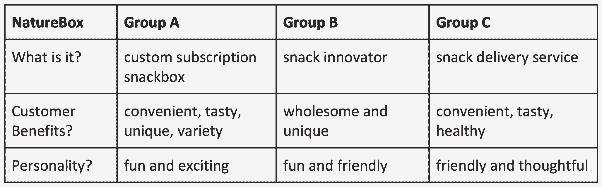

# 我们的 6 个必读书目，打造突破噪音的品牌

> 原文：<https://review.firstround.com/our-6-must-reads-to-build-a-brand-that-breaks-through-the-noise>

*经济学人*的红盒子。IBM 蓝。耐克标志。这些标志性品牌的名字同样被认为是一种色调或标志，并且经受住了时间的考验。哪个公司不想要这种影响力和持久力呢？问题是，大多数初创公司没有 50 年或 100 年的时间像这些品牌一样积累相关性和流行度。他们必须找到一种方法，使早期的努力持久，将客户转化为社区，将考验转化为信任，将嗡嗡声转化为品牌。

我们一次又一次地听到创建一个品牌是多么具有挑战性。其他建立公司的努力很困难，但似乎至少有一些立足点:[筹资](http://firstround.com/review/the-fundraising-wisdom-that-helped-our-founders-raise-18b-in-follow-on-capital/ "null")有它的周期，招聘有它的[问题](http://firstround.com/review/the-best-interview-questions-weve-ever-published/ "null")要问，以及[入职](http://firstround.com/review/the-only-onboarding-timeline-youll-need-from-offer-to-first-friday/ "null")有它的步骤。但是创造一个品牌看起来更像是炼金术。不知何故，像名称、标志和一行公司描述这样的输入变成了一致的声音、合理的市场定位和客户认可。

这就是为什么我们为那些建立自己品牌的公司，尤其是那些跑道有限的初创公司，列出了这个清单。**以下建议来自创始人、经营者和专家** **，他们帮助建立了过去十年推出的一些最大、最值得信赖的品牌**——从 Airbnb 到 Thumbtack，Dropbox 到 Gusto。(唯一的例外是 20 岁的网飞)。我们从评论档案中筛选出六篇最具战术性的文章，因此你可以从今天开始为一个经久不衰的品牌打下基础。

**[开始一本品牌书，让自己看起来比实际大。](http://firstround.com/review/this-brand-strategy-can-make-your-startup-look-bigger-than-it-is/ "null")**

2010 年，当莱斯利·齐格勒 加入 **[Rock Health](https://rockhealth.com/ "null")** 的创始团队时，她面临着一项艰巨的任务:让初创公司的创始人能够接触到医疗机构令人生畏的世界。无论公司下一步做什么，它的品牌都将不得不承担这一重任，作为像麦肯·埃里克森和 DDB 这样的资深艺术总监，这完全落在了齐格勒的手中。为了达到这个目标，她建造的一切都必须是一致的。

对我来说，一致性可以归结为两件事:你的品牌的外观和感觉。

**让你的小品牌看起来很大的最快方法是展示抛光的、连贯的材料。**这意味着要有指导原则——一本品牌手册——让你的品牌感觉一致。这需要搞定最基本的东西，比如品牌化的 PowerPoint 和电子邮件模板，以及最微小的细节，比如你的 404 页复印件或折扣代码。最终，品牌指南应该定义公司的外观和感觉。以下是你创建品牌手册所需的资料(可以从一个简单的共享谷歌文档开始):

**颜色**:3 到 4 种互补色的调色板(如果您还没有 Pantone 等效色，请包括 RGB 或十六进制代码)。

**字体**:定义网页/应用程序的标题、正文和< h1 >到< h4 >标签。

Logo :展示它是如何用彩色、黑白和黑色背景反转出来的。展示如何将图标和文字标记分开，如果合适的话，还有垂直和水平的格式。将这些高分辨率徽标源文件的文件夹作为矢量和栅格放在共享驱动器上，这样人们就有了一个正确的资产库，可以在需要时轻松使用和共享-有许多需求是您无法预料的，您的团队甚至无需询问您就可以满足。

**顶级用语**:一行公司描述；一段公司描述(印刷用的样板或类似材料)；品牌属性(3-5 个描述贵公司的形容词)。

Leslie Ziegler

**[钉你的三个 P。](http://firstround.com/review/three-moves-every-startup-founder-must-make-to-build-a-brand-that-matters/ "null")**

以任何标准来看，Arielle Jackson 都有一份令人羡慕的营销简历。近十年来，她帮助定位了 Gmail、谷歌文档、日历和语音。根据这一经历以及在 Square 的后续角色，杰克逊总结了一套简单而有力的练习，她用这套练习帮助 30 多家初创公司确定了公司的**目标、定位**和**个性**:这是打造令人难忘的品牌的关键一步。

其中一家初创公司是 eero，这是一个家庭 WiFi 系统，它为家庭提供快速、可靠的互联网，并用更好的东西取代过时的路由器。在她的早期支持下，杰克逊通过一场成功的预购活动，帮助埃罗在两周内获得了 250 万美元的销售额。这里有一个她从前谷歌营销和传播主管克里斯托弗·埃舍尔那里采纳的框架。这个练习使 eero 的定位陈述成为焦点，并有助于用尽可能简单的英语解释这家初创公司的产品。

以下是模板:

**针对**(目标客户)

**谁**(需求或机会的陈述)，

(产品名称)是一个(产品类别)

**即**(关键利益声明)。

**不同于**(竞争替代方案)

(产品名称)(主要区别陈述)。

这是埃罗的版本:

**面向**科技进步户

**谁**有死区或缓冲，

eero 是世界上第一个家庭 WiFi 系统

**让您的家覆盖在快速、可靠的无线网络中。**

****不像**单一、丑陋的 Netgear、Belkin 或 Linksys 路由器**

**eero 使用多个设备协同工作来创建无线网状网络。**

**这个练习的额外好处是创建它的环境。“当我第一次见到 eero 的创始人时，他们向我解释了他们的产品和想法，我花了一个多小时才明白。但在阅读这份声明的过程中，大多数人现在都明白了，”杰克逊说。“这就是定位陈述的力量。”**

****[向一个六年级学生描述你的定位语言。](http://firstround.com/review/the-three-tools-netflix-used-to-build-its-world-class-brand/ "null")****

**当前产品管理副总裁 **[Gibson Biddle](https://www.linkedin.com/in/gibsonbiddle "null")** 于 2005 年加入网飞时，产品专家仍然有焦点小组问他:“等等，我不明白。你是说*精简*？”不，流，他会说。没人知道那是什么意思。在早期，建立公司的品牌不仅意味着找到推广和定位网飞“品牌承诺”的方法，还意味着引入——并拥有——对这个令人难以置信的新业务至关重要的语言。除了网飞，Biddle 还领导教育和游戏公司的品牌创建和产品开发并提供建议，包括 Chegg、Sega 和 Mattel。**

**当 Biddle 与创业公司合作时，他采用的方式是同时利用许多人的智慧。在一次与 Naturebox 员工的研讨会上，他将团队分成六个小组，将他的定位模型应用到业务中。所有参与者在一个小时结束时重新聚集在一起分享他们的想法。本练习的目标是捕捉并阐明他人对公司的评价，因此获得多种观点至关重要。跟踪跨团队的共享语言也很有帮助。以下是 Naturebox 三个小组的初步回答:**

**

Selected answers from a Naturebox branding workshop with Gibson Biddle** 

**那么，如何从这样的东西开始，并得出清晰、一致的定位语言呢？给一个六年级学生描述一下。**

**“力求简洁明了。假设你在和一个六年级学生说话。你的客户很忙，所以他们没有时间解析模糊的概念。你的目标不是让它变笨，而是让它变紧。”例如，Biddle 要求 A 组打开“定制订阅 snackbox”。一个人主动提出:“外卖快餐。”对比德尔来说，这太“廉价”了。" Snackbox 订阅服务。"那行得通。一个对你的业务一无所知的人会马上明白什么？就这样吧。**

**Biddle 为团队提供了另外两个建议，帮助他们将定位陈述精简为要点:**

**把你的描述节食。 Biddle 在定位模式上对语言的经济性要求严格。“把事情精简到最多三个字。选择最关键的话。”在 Naturebox，Biddle 要求 A 组从描述他们服务的四个单词中选择三个，这样团队就不会只是列出单词，而是仔细地对它们进行优先排序。该团队选定了“方便”、“健康”和“多样化”。**

****不精确就不要停止。**“这串单词中通常有一个模糊的单词。比德尔说:“找到那个抽象的词，并深入挖掘它。他促使 A 组展开“多样性”，直到团队达成“选择”，然后是“选择”“选择”更适合 Naturebox，因为该公司的目标不仅是提供一系列产品，还包括健康零食的精心策划。比德尔警告说:“不要自动传递跨团队流行的词语。"每个人都有嫌疑。"A 组和 B 组都选择了“独特”“在什么方面独一无二？”他坚持。“味道很棒——很好吃，”该团队回应道，提供了一个更精确的答案。**

**

Julie Supan** 

****[为高期望客户打造。](http://firstround.com/review/what-i-learned-from-developing-branding-for-airbnb-dropbox-and-thumbtack/ "null")****

**对于朱莉·潘素来说，定位和品牌与客户和公司一样重要。自 2009 年离开 Youtube 以来，潘素已经成为最受欢迎的品牌专家之一，帮助 Dropbox、Airbnb 和 Thumbtack 等公司在发布前进行定位。她的第一步？确定他们的目标用户:**高期望客户**。**

**“高期望客户，或者说 HXC，是你的目标人群中最有眼光的人。潘素说:“这个人会认可——并享受——你的产品或服务带来的最大利益。这种洞察力是关键，因为这个客户也是可以帮助创业公司传播信息的人。**

**HXC 需要成为一个别人渴望效仿的人，因为他们认为他们聪明、明智、有洞察力。**

**高期望值的客户是一个好的消费者，不管他是不是早期采用者。他们是可以信赖的了解市场并做出正确决策的人。“他们查东西。他们研究东西。潘素说:“他们对新型产品或服务有想法，可以帮助他们省钱、节省时间、变得更健康或让他们的团队更有效率。”。"如果你的产品超出了他们的预期，它也能满足其他人的需求."**

**考虑一下谁是一些知名公司的客户，然后[点击此处进一步阅读](http://firstround.com/review/what-i-learned-from-developing-branding-for-airbnb-dropbox-and-thumbtack/ "null")深入了解每个示例:**

**Airbnb :这个 HXC 致力于成为一个好的世界公民，她不想简单地去新的地方，而是要有归属感。“客人们想要‘像当地人一样生活’，体验巴黎，就像他们生活在巴黎一样，”潘素说。“住在独特的空间并感受到受欢迎的想法让他们充满活力，但他们也很在意成本。”**

**Dropbox :“这可能会令人惊讶，因为人们过去认为他们只是一家文件共享和同步技术公司。但 Dropbox 的高期望客户实际上是一个希望简化自己生活的人，”潘素说。“他们信任他人，有组织性，精通技术，并在寻找方法找回他们一天中的一些时间。他们希望知道他们受到保护，当涉及到他们一生的工作时，有人会支持他们，这些工作主要在他们的计算机中，包括家庭照片、视频、工作文件、学校文件。”**

**一旦你确定了 HXC，让整个公司了解这些客户，使用他们的语言与他们交流，并不断调查他们，以了解他们不断变化的需求。HXC 是一块宝贵的试金石，可以确保你朝着正确的方向成长，并验证——或否定——你的行动计划。“你的用户会理解这个产品，知道这是为他们准备的。潘素说:“你将削减获得客户的成本，并享受清晰路线图的好处。”。“如果你做了工作，他们会引导你对你的公司是什么和不是什么达成共识。”**

****[追踪并奖励你的冠军。](http://firstround.com/review/credit-karmas-ceo-built-a-sexy-brand-in-an-unsexy-category-with-no-pr-firm-and-a-tiny-budget-heres-how/ "null")****

****[Kenneth Lin](https://www.linkedin.com/in/kennethjlin "null")** 在浏览 Reddit——一个不起眼的日常习惯——时，他发现了一件永远改变了他生活的事情:他的公司 Credit Karma 终于闯入了主流。这就是:一个关于信用监控的帖子由一个怀疑他公司的免费信用检查服务是一个骗局的用户发起——包括一个捍卫和赞美信用因果报应的用户的热情回应。“天啊，”林心里想。“那个人甚至不为我们工作。”这是一个纯粹的有机时刻——预示着口碑传播的趋势，将在未来几个月为这家初创公司赢得数百万用户。**

**十年后，Credit Karma 已经确立了市场主导地位，超过 50%的客户是从其他用户那里听说这个网站的。它被谷歌搜索的次数超过了 Geico——Geico 被认为是成功在明显不性感的行业建立性感、个性驱动的品牌的公司的旗手。这使得 Credit Karma 在早期、关键的品牌建立时期，在只有 Geico 1%的员工、微不足道的预算以及没有公关机构帮助的情况下完成这项工作更加令人惊讶。**

**为了建立你的品牌，有一类用户是你希望随着时间的推移而受到喜爱的——你会认识他们，因为他们的 NPS 分数很高，他们参与分享和推荐工具，他们喜欢在论坛和博客评论中写关于你的精彩文章。他们会告诉很多人你的产品，甚至不用你问。值得努力去寻找他们，并在你找到他们时联系他们。“你的超级促销员为你的企业带来不可替代的价值，”林说。“他们买得更多，不厌其烦地提供反馈，停留更长时间，并推荐他们的朋友。让他们加入你的社区，加深他们的忠诚度。”**

**例如，Credit Karma 追踪了会在评论区为自己辩护的 Reddit 用户。他们伸出手，问他们还想从这项服务中看到什么。他们得到的反馈是，人们对信用报告中的不准确性感到沮丧。解决这些问题既繁琐又昂贵。他们听取并部署了直接争议作为回应，这使得消费者只需点击几下鼠标就可以质疑他们报告中的不准确之处。**

**底线呢？勇敢的一部分是有冠军支持你。不要认为他们是理所当然的。当你下大赌注时，你需要人们支持你。**

**一旦你明确了自己的立场，就要坚持下去。重新定义一个行业需要勇气。**

****[让新品牌深入人心。一波一波建立共识。](http://firstround.com/review/this-is-how-you-design-a-lasting-brand-an-inside-look-at-gustos-reinvention/ "null")****

**秋天的一天，ZenPayroll 的员工涌入他们在旧金山的办公室，不管他们的角色是什么，都在电话中与客户解释刚刚发生的事情:他们现在是 **[Gusto](https://gusto.com/ "null")** 员工。该公司已经更名，这一变化远远超出了名称和标识——除了为企业配备薪资软件之外，他们现在还将追逐竞争激烈的健康福利市场。这可能是疯狂和紧张的。但是他们的声音点亮了电话，反而是明亮的和庆祝的。**

**Gusto 的首席执行官 Joshua Reeves 告诉我们重塑品牌的困难——以及任何形式的品牌努力。“我从这件事情中学到的最重要的一点是，人们不会自动知道他们对一个词或一幅图像的感受。“你必须花一些时间让它适应，”里维斯说。“所以当我们得到任何负面反馈时，我们会给它一些时间。我们不会有任何反应。**我们会注意到人们围着东西转。这是我给创始人的一条很大的建议，即使是在做出重大决定的时候。任其自然**。”**

**重塑品牌的对话始于创始人，出于年度规划的目的，创始人将对话扩大到了高管团队的其他成员。但这并没有保密太久。他们还希望在与公司其他人分享之前，锁定时间表和指导原则。**

**领导团队第一次公开谈论这一转变时，他们在全体会议上正式启动了这一转变——古斯特每月举行两次全体会议。“我们的目标是说，‘看，这里的每个人都是这个过程中的利益相关者。“会议紧紧围绕推动品牌重塑的新产品发布，以及他们希望新外观传达的核心价值观和理念。他们没有马上打开反馈的闸门，而是强调每个人都有机会通过一轮调查提供想法和意见。**

**里夫斯来的准备之一就是被拒绝，他得到了。人们不同意该流程的部分内容，以及更改名称的必要性。他们怀疑花在项目上的时间的投资回报率，或者质疑为什么它现在很重要。最有效的回应是不断解释他们采取行动背后的“原因”,并承认其他人在公司中的所有权。**

**“我们的核心价值观之一是，每个人都应该对 Gusto 有一种主人的心态。“每个人都在建造他们共同拥有的东西，”里维斯说。当我们提醒他们新名字不仅仅是给顾客的，而是给我们所有穿 t 恤的人的，他们谈论我们的工作，并为我们的工作感到自豪。看到他们的员工成为对品牌重塑感到兴奋和充满活力的共同所有者，情况就有所不同。"**

**该公司运行了一个流程——从调查到品牌研讨会，再到更多的全才——来生成一个新名字的短名单。正如你可能猜到的，Gusto 在那份名单上，在与员工的一次普通研讨会上赢得了粉丝。“这个名字是我们自己取的——我们没有请公司来替我们取，”Reeves 说。“我们可以，但这个名字必须代表那些为我们全职工作的人。”**

**对于如何建立一个能引起共鸣且重要的品牌，这只是评论智慧的开始。查看上面引用的完整文章以及其他关于 *[如何让人们信任你的产品](http://firstround.com/review/Urbansitter-Lynn-Perkins/ "null")***[更好地定位你的创业](http://firstround.com/review/Positioning-Your-Startup-is-Vital-Heres-How-to-Do-It-Right/ "null")***[找到打造你的品牌的故事](http://firstround.com/review/the-man-behind-makerbot-on-finding-the-stories-that-build-your-brand/ "null")* *。*****

*****wavipicture/iStock/Getty Images 的英雄形象。照片由* *[邦妮雷伊米尔斯](http://www.bonnieraemillsphoto.com/ "null")* *拍摄。*****