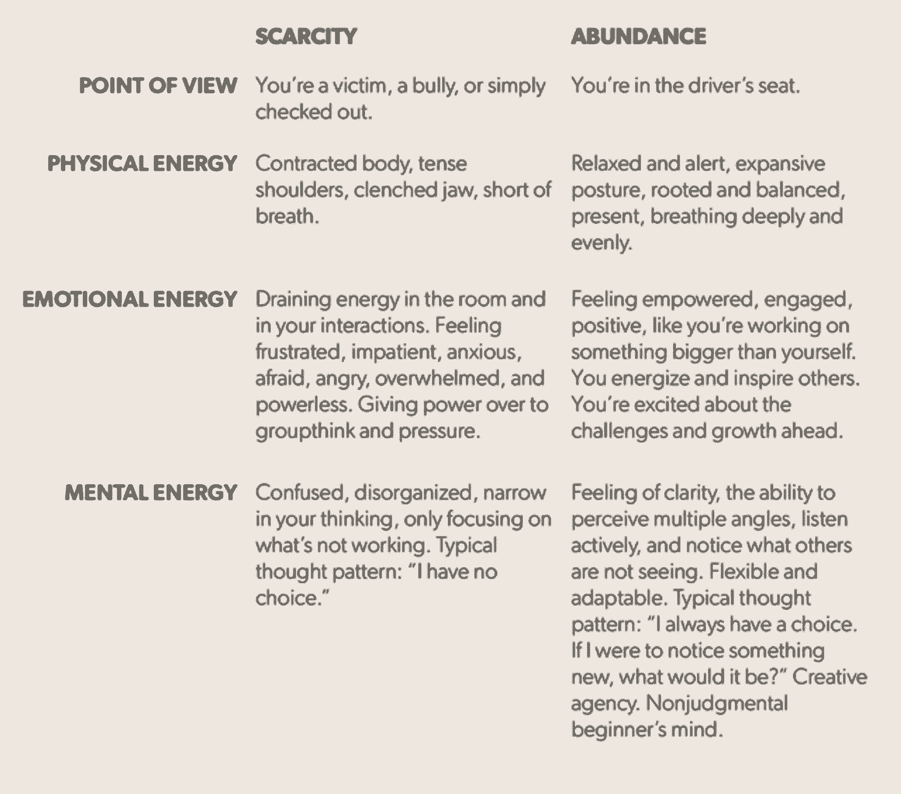

# 让自我保健成为你的竞争优势的 6 篇必读文章

> 原文：<https://review.firstround.com/our-6-must-reads-to-make-self-care-your-competitive-advantage>

八月就要过去了，随着它的过去，我们将离开悠闲的日子和暑假，进入一年中最忙碌的时候。对于技术人员来说，这有点像回到学校，重新投入工作。那么，还有什么更好的时间来提醒我们照顾好自己是多么重要，这样我们就可以避免筋疲力尽，更深入地思考，更好地与他人联系，并提高我们的生产力。

“自我保健”这个词如今被抛来抛去，经常被用来描述充足的睡眠和锻炼，吃得干净，也许还会进行一些冥想。是的，所有这些都有助于保持你的身心健康。但是我们想提供一个更宽泛的定义。自我保健就是利用你的能量做有益的事情。如果是这样的话，那么练习自我保健需要的不仅仅是身体上的保养，而是真正的保持对你每天所做的事情的参与、好奇和强迫。

当我们每天看着成百上千的企业家和创业专业人士建立公司时，我们注意到的一件事是，太多的人为了更努力或更长时间地工作并完成更多的事情而妥协或放弃他们的健康习惯。但是，通常情况下，正是这些健康的习惯给了我们当中最成功的人杠杆、耐力和脑力，让他们在更短的时间内做得更好——让自我保健成为一种独特的竞争优势。以下是我们多年来发表的与自我保健相关的重要建议。我们希望在你接受新的更大的挑战时，它们能在这个秋天派上用场。

高管蔻驰[克里斯·霍姆伯格](https://www.linkedin.com/in/chris-holmberg-a9042b/ "null")怎么强调持续练习的力量都不为过。"表演、运动或音乐的人，他们都看到了实践的价值."但在商界，几乎每个人都想马上变好。他们不想花时间重复已经发生的事情。

心理预演可能看起来相当理性，但霍姆伯格的方法实际上相当具体。他的处方低得惊人:**每天花 15 分钟反思——真正的反思，在一个安静的空间，关上你的收件箱。**

花点时间回顾前一天的事情，并为即将到来的一天制定计划。如果你愿意，你可以把这些观察结果写下来。你可以参考你的日历来思考当天的互动，为明天做准备。无论什么能让你在仪式中立足。

在每周结束时，霍姆伯格要求他的客户进行一个小时的相同锻炼，只是这一次从整体上反思过去的一周，并考虑未来一周的挑战和机遇。

对于一个忙碌的创始人来说，花整整一个小时似乎是一种浪费。但他说，这正是那种不能不花时间的领导。

创业领导者不能有低学习效率。他们必须从每一次经历中汲取最大限度的知识。反思是加速你学习曲线的关键。

为了提供一个起点，Holmberg 开发了一个清单来计算时间。这些是你可以问自己的问题，有条不紊地重温你的一天:

你执行了你的工作吗——你想写的电子邮件，你欠老板的战略文件——你在一天开始时的清单上的东西？你做了重要而不仅仅是紧急的事情吗？

我们:你为你交往过的人的生活增加价值了吗？他们带走了更多的知识、能量、善意、帮助和更好的理解吗？“这不是问你是否让人们快乐，”霍尔姆伯格说。“这并不总是目标。”你要确保你以一种能为他们增加价值并为你实现目标的方式清晰地传达了信息。

你是如何管理自己的精力和情绪的？自我保健措施，比如锻炼、吃好、睡足，和你在办公室做的任何事情一样重要。具有讽刺意味的是，这些是大多数创业领导者首先放弃的东西，然而“我”是领导力的基础。如果你耗尽了自己，你就不能帮助别人。

在你对过去的一天进行反思后(最好在晚上临睡前进行这个练习)，你可以用同样的三个镜头来设定你明天的目标。这里有一个模板:

建立你打算在一天中完成的任务，并现实地承认那些你无法完成的任务。你白天有会议吗？如果是的话，你知道它们各自的用途吗？你知道在这期间你想要完成什么吗？你有实现这些目标的计划吗？

**我们:**你预计会有挑战性的互动吗？例如，你有没有和一个你知道对你或公司感到失望的同事开过会？想想你想如何在那次谈话中表现出来。考虑他或她可能说的话会引发你的不良反应。在心里预演你会如何回应。写下来，内化。让这成为你的意图。

你带来了哪些偏见？你怎么能看穿他们？你如何让自己在一天中做出好的选择(例如，保持精力充沛，身体得到补充，等等)。)?什么可能会让你偏离轨道？什么是正确的行动方针？提前识别它。

从 Holmberg 这里阅读更多关于如何从这个练习和其他常规练习中获得最大收益的信息。

卡蒂亚·韦里森是硅谷最受欢迎的高管教练之一，曾帮助脸书、Airbnb 和 Twitter 的高管晋升。她最重要的论点之一是:“你不会在一连串的糟糕日子里建立起一个十亿美元的企业。它必须是你最好的日子的序列。你的表现百分之百取决于你的态度。”

理想的态度是她所说的**丰富的思维**——一种给你创造力和勇气去实现你的愿景的心态——并且，在每天的基础上，去设计你自己的生活。为了实现自我控制，她的客户必须更多地进入这种心态。为了帮助解决这个问题，她首先给他们一个**匮乏与丰富思维的诊断**。我们的目标是区分和识别当他们处于稀缺驱动心态时和当他们思考丰富时的生理、感觉和想法。这有助于他们真正感受到这两种模式的区别，并注意到它们在日常生活中的临界点。这样，他们可以主动选择更有建设性的态度。

你可以用上面的方法来确定你的感受，并引发不同的反应。但是如果你感觉如此低落，你能做些什么来变得富足呢？韦里森围绕这种转变做了大量的工作。[请继续阅读，深入了解她设计的六个练习，让你进入富足的心态](http://firstround.com/review/the-remarkable-advantage-of-abundant-thinking/ "null"):

**注意到**:“富足实际上是你在生活中看到更多的能力:更多的选择，更多的选择，更多的资源。”

**中立:**有人称之为初学者的思维，但这个概念超越了拥抱无知——它是释放判断和假设的能力

启动:启动是参与一项特定的活动，它能立即提升你的情绪和精神能量。

自我同情:弹性是自我安慰的能力——这个过程有三个步骤或阶段。

**慷慨:**研究表明，最有权力、最快乐的人处于不断给予他们关系的大网络的中心。

**感恩:**根据韦里森的说法，通过感恩的眼光来看待你的世界，你会发现可能就藏在你面前的东西。

这条规则最初是由女演员雪莉·麦克莲恩提出的——硅谷传奇人物、企业家和投资者海蒂·罗伊森(Heidi Roizen)坚持的——“20 岁时，你一直在担心别人对你的看法。40 岁的时候，你醒来说，‘我再也不在乎别人怎么想了。’到了 60 岁，你会意识到根本没人在想你。Roizen 说，最重要的信息是:“(T22)没有人从一开始就考虑到你。”

当然，这是好消息也是坏消息。坏消息是，没有人会一直想知道你是否过得好，你赚了多少钱，你对工作或人际关系是否满意。

“你需要成为自己的倡导者，”罗伊森说。“如果你从事一份你不喜欢的工作，你需要成为改变它的人。你不能坐在办公室里等着别人给你带答案。”

“你的老板不是在想你。你的同龄人没有想到你。你需要考虑你自己。”

苛刻。但是也有不好的一面。人们浪费大量的时间来折磨自己，因为别人对他们的看法——他们这样做是没有必要的。就连罗伊森也曾担心在长途飞行后穿着不合适的鞋子或皱巴巴的西装去参加会议。“如果我不能振作起来，我会非常担心人们会怎么想。但后来我想到，我从来没有在一次会议上中途想到，“尽管这个人很聪明，但他们的夹克上有一条皱纹，所以他们一定不太好。”没有人会这么想。"

人们有巨大的能力为最小的小缺点自责——在会议上说错话，介绍别人时用错名字。几周的时间可能会被浪费，重要的关系可能会被回避，生产力可能会被浪费，这一切都是因为我们害怕别人对我们评头论足。“如果你发现这种情况发生在你身上，请记住，没有人会像你考虑自己一样努力地考虑你。所以不要让这一切让你太担心。”

[在这里可以找到来自 Roizen 的七条更重要的生活和职业经验](http://firstround.com/review/8-Rare-Gems-from-Heidi-Roizen-on-Building-a-Fulfilling-Life-and-Career/ "null")。

Frederique Dame 是那些毫不费力就有影响力且人脉深厚的人之一，他们让硅谷变得更加美好。最近，她是优步的产品负责人，在此之前，她曾在 SmugMug、Photobucket 和 Yahoo！。如今，她是育碧的董事会成员。[在《第一轮评论》有史以来最受欢迎的文章之一](http://firstround.com/review/harnessing-happiness-to-build-your-career-advice-from-an-uber-product-leader/ "null")中，她分享了自己的故事，以及如何在生活中积极创造幸福给她的职业生涯带来了巨大的变化。寻找和保持快乐是自我保健的核心。为了做到这一点，她说你需要从让自己感到安全开始。

“不成功就没事了。”

简单的话。巨大的意义。如果你只是决定无论如何都要过得很好呢？你可能会做很多不同的事情。你会试探自己的底线。你会更加信任自己。诀窍在于，这种感觉只是你做出的一个选择。你决定信不信。这个行业中有太多的人觉得自己被一根绷紧的绳子吊在 50 层楼高的地方。走错一步，他们就会倒下。但事实并非如此。相信自己会反弹的人拥有更大的力量。

Dame 在 24 岁的时候决定去美国工作。她很害怕，但还是努力去联系。她记得在去圣克拉拉大学招聘会的路上，她在斯坦福图书馆打印了自己的简历，真的颤抖了。她最终得到了这次旅行的机会。如果她没去，她就不会去了。

勇敢就是相信自己能处理好结果。数量惊人的技术人员知道自己很聪明，知道自己有能力，但不相信自己知道如果被解雇、遭遇惨败或只想转向更有成就感的道路该怎么办。将你的自信从生活的一个领域转移到另一个领域，会给你一张安全网，让你抓住更多的机会。

除非迫不得已，否则很难预料在这种情况下你会做什么。但是如果你能重新调整你的大脑，知道你会没事的，即使你没有得到这个角色，没有得到晋升，没有筹集到那一轮，你会更加努力，你成功的机会会更大。**每当你发现自己在想，“哦，我不能再去了……”或者“这是一个疯狂的冒险……”马上追加一句:“没成就没事。”**

[Dame 在这里为你创造职业幸福提供了另外六条原则](http://firstround.com/review/harnessing-happiness-to-build-your-career-advice-from-an-uber-product-leader/ "null")。

Frederique Dame in San Francisco.

空白备忘录。空荡荡的甲板。每个人都知道有时候最难做的事情就是开始。这一点在收件箱爆满的情况下尤为明显。这就是为什么 Box 工程副总裁(也是生物黑客/生命黑客专家) [Tomas Barreto](https://www.linkedin.com/in/tomasrb "null") 建议在回复中加入一句话，以快速重新获得对请求及其所有者的控制。

著名的[更聪明更快更好](http://charlesduhigg.com/books/smarter-faster-better/ "null")作者查尔斯·杜希格谈到如何回复他不想参加的会议的邀请。巴雷托说:“他开始回答‘我只能坚持 15 分钟’。"很快，他又控制住了自己."当然，他最终会充实或解释他的反应。但他会有一个立足点。这一页将不再是空白的，在他的收件箱中移动将感觉不那么繁重。"

在特别繁忙的日子里，当他的收件箱爆满时，Barreto 有时会为 20 封电子邮件起草开场白，而不是一次在一封电子邮件中写 20 行。为了鼓励快速行动，他会设定一个五分钟的计时器，并努力完成设定。当警报响起时，他会决定是继续还是继续另一项任务。五分钟一个检查点通过给予更多时间的选项给予他控制。

“在那些日子里，我对每封邮件的回复都不是首要任务。这是我个人回复收件箱的方式，”巴雷托说。“因此，为几十封电子邮件写一行字——我希望收件人理解的要点——在心理上增强了我的力量。我会坐下来，打开部分草稿一分钟，重新获得那种控制感。然后，如果需要的话，我会回到第一个问题并详细说明。令人震惊的是，有多少人可以重读这一行，然后照原样发送。”

对于重复的请求来说，固定的回复或电子邮件模板是非常宝贵的，尤其是那些你说“不”的请求。但是这个一句话的行为不仅仅是关于回答一个请求，而是一种资源的回收——无论是你现在还是未来的时间——以一种你登记所有权转移的方式。所以，这不仅仅是把模板化的笔记从你的盘子里拿走——这可能会导致无休止的电子邮件乒乓。取而代之的是将流程分段，让你在内部记录任务和任务的所有权转移。

[在这里阅读更多来自 Barreto](http://firstround.com/review/boxs-vp-engineering-on-biohacks-for-a-better-career/ "null") 的生物黑客。

要想快乐，不能靠目标达成。快乐脑科学(Happy Brain Science)的创始人[斯科特·克拉布特里(Scott Crabtree)](https://www.linkedin.com/in/sccrabtree/ "null")说，快乐脑科学(Happy Brain Science)是一个致力于展示和分享让人们快乐的科学基础以及如何让他们在工作和生活中更有效率的组织。世界上最有效率的人不仅仅喜欢他们每天所做的事情——他们进入了一种能带给他们持续满足感的**流**或高绩效状态。

**有几种策略可以帮助促进这种“心流”状态:**

构建你的目标:伟大的目标不仅仅是 SMART(具体的、可衡量的、可实现的、与你的兴趣相关的、有时间限制的)。他们有具体的里程碑，有助于提供一种进步感，这对于工作中的快乐至关重要。如果你一开始就有明确的目标，这些目标能让你实现成功，并有多个步骤来达到一个终点，你更有可能喜欢朝着这些目标努力。

让目标变得有意义:“追求一个目标会给你带来内心的快乐吗，因为你在个人层面上与它联系在一起？”克拉布特里问道。作为一名经理，这些建议对分配项目非常有帮助。这可能需要一点额外的时间，但你肯定可以满足第一个要求:你可以创建指标和期限，并解释为什么任务是重要的。第二个问题有点难，但有证据表明，明白自己的工作将如何直接影响团队或公司的成功的人会感觉到更强的联系，并可能表现得更好。

**让目标与优势一致:**在这种情况下，“优势”不仅仅指人们的天赋或技能。优势是你既擅长又喜欢的东西。他说:“如果你的目标能说明你擅长什么，能给你带来能量，你就更有可能快乐。”管理者不仅要关注谁擅长什么，还要关注人们倾向于做什么工作。一个工程师想学习更多的产品管理知识吗？一个作家想更多地参与设计吗？看看你是否能在那些兴趣和他们已经擅长的东西的交叉点上找到任务。

那么，是什么让我们大多数人无法进入心流呢？

**一心多用**。这是很多人都听说过的，但它已经深深地根植于我们的工作文化中，以至于我们无法承认它，或者拒绝相信它对我们的效率有不利影响。很多人认为多任务处理让他们在工作中更有效率。科学以戏剧性的方式展示了另一面。

科学是非常清楚的。你不可能同时关注两件事，同时做到最好。

“最重要的是，多任务处理使得获得心流变得不可能，”克拉布特里说。“这是最快乐、最有效率的精神状态，你可以通过完全专注于一项具有挑战性但可能完成的任务 20 分钟或更长时间来进入这种状态。”

[更多关于从瑰珀翠获得并保持流畅状态性能的信息，请点击此处](http://firstround.com/review/Heres-Why-Founders-Should-Care-about-Happiness/ "null")。

*照片由 CSA Plastock/Getty Images 提供。*