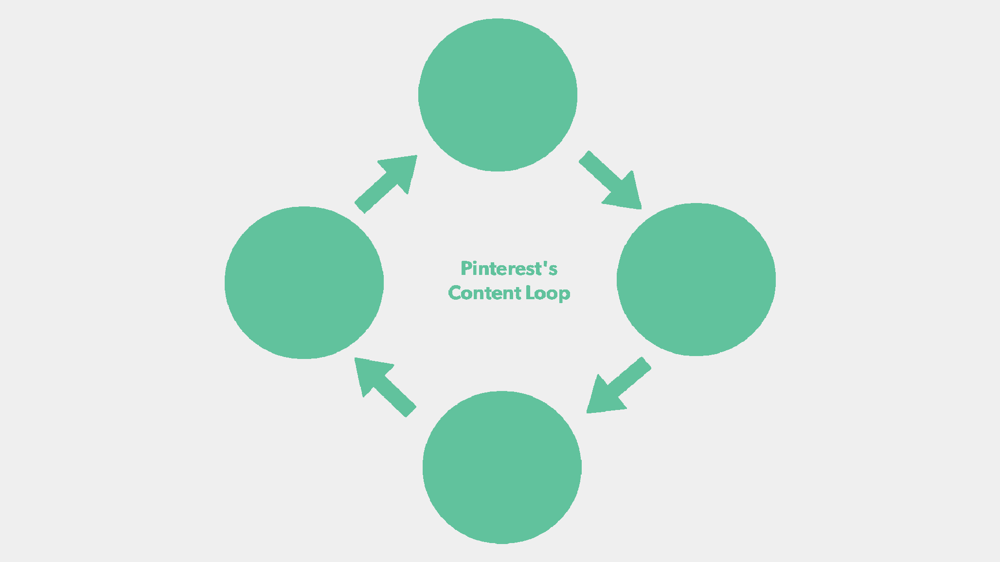
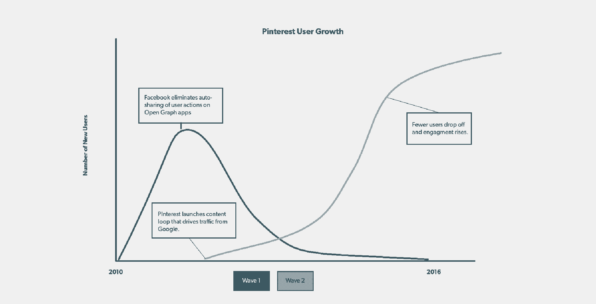
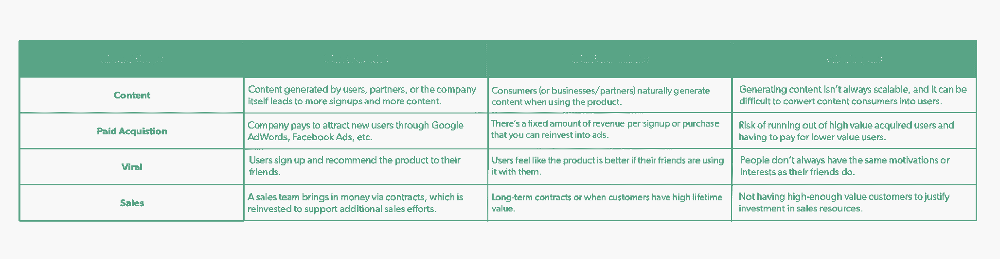

# Pinterest 和 Grubhub 在构建内容循环方面的增长领先

> 原文：<https://review.firstround.com/pinterest-and-grubhubs-former-growth-lead-on-building-content-loops>

曲棍球棒增长。口碑。像病毒一样传播。透过行话，寻找创始人梦想的东西:初创公司渴望的爆炸式增长。最著名的公司因迅速的指数级用户增长而受到称赞——这是大多数初创公司无法复制的现实。但好消息是这不是唯一的途径。根据规模和增长顾问 **[凯西·温特斯](https://www.linkedin.com/in/caseywinters/ "null")** 的说法，它甚至不是最好的一个。

温特斯发现，投资者和初创公司往往无法区分推动产品发展的增长循环类型。选择错误的道路会导致非常不同的结果:用户增长和参与度下降，受欢迎程度急剧下降。相反，温特斯认为创业公司应该探索一种经常被忽视的方法:**建立一个内容循环。**

温特斯在 Grubhub 和 Pinterest 领导增长型营销职能的经验表明，内容循环会带来回报。当他加入 Grubhub 时，它是一家价值百万美元的 A 轮创业公司，在两个市场拥有 3 万名用户和 15 名员工。到他离开时，他围绕内容和 SEO 的战略帮助这家在线食品订购网站成为一家价值 100 亿美元的上市公司，拥有 300 万用户和 1000 名员工。他在 Pinterest 的记录同样令人印象深刻。当 Winters 作为一名增长型营销经理加入时，该公司有 200 名员工和 4000 万活跃用户，但增长逐渐放缓。温特斯和他的团队引入的内容循环和规模 SEO 策略帮助迎来了第二波增长，带来了超过 2 亿用户和 120 亿美元的估值。现在，他利用这些经验为一系列公司担任比例顾问，从 [Eventbrite](https://www.eventbrite.com/ "null") 和 [Reddit](https://www.reddit.com/ "null") 到[图钉](https://www.thumbtack.com/ "null")和 [Hipcamp](https://www.hipcamp.com/ "null") 。

在这次独家采访中，温特斯提出了通过内容循环推动增长的理由，将其与其他模式进行了比较，并讲述了他如何在 GrubHub 和 Pinterest 的早期成功应用这一方法。他概述了什么可行，什么不可行，揭示了他遵循的 5 个步骤，并分享了三个更先进的战略，这些战略适用于寻求建立快速和可持续增长计划的早期初创公司。

# 将内容与增长挂钩:内容循环在行动

内容循环包括发布和共享媒体，然后由企业、用户或合作伙伴共享。这一行为触发了注册、激活和用户参与，从而带来了更多的媒体分享。这就完成了“循环”或周期。

Winters 已经看到了内容循环是如何在几个创业环境中产生的。他在 Apartments.com 做搜索引擎优化专家时，第一次尝到了这种增长策略的成功滋味。在那里，他和他的团队将公寓和房地产列表分为地区和类别特定的登录页面，并将这些精选页面分发给谷歌。当他成为 Grubhub 的第一个营销雇员时，他采取了类似的策略，通过创建登录页面，将餐厅按照地区和菜肴类型进行组织，这样用户可以搜索泰国菜，并在结果中看到当地泰国餐厅的策划页面。

有了从 Grubhub 学到的东西，Winters 在 Pinterest 的下一个职位中再次运用这些技巧来推动增长。在早期，该公司基于脸书的 Open Graph 协议发展起来，这意味着每当用户发布一些东西，内容就会被分发到他们的脸书订阅源，供他们所有的朋友查看。

“Pinterest 在很大程度上是一个社交网络，围绕你朋友保存的内容而建立。但在我 2013 年底加入后不久，脸书改变了规则，取消了默认的“自动分享”功能，许多使用脸书登录 API 的应用和第三方网站都依赖这一功能。温特斯说:“用户现在必须特别授权你才能发布他们的内容。“开放图形的机会一夜之间消失了，这扼杀了许多利用它的初创公司。突然间，Pinterest 再也没有可靠的方法来吸引新用户了。我们不得不彻底反思我们的增长战略。”

温特斯开始工作，运用他过去的经验来调查 SEO 的增长机会，以应对这一挑战。他很高兴地发现，凭借该产品的工作方式，Pinterest 用户已经在做一些跑腿的工作了。用户创建满是图钉的图板，并从其他用户那里复制有价值的内容，从互联网上挑选各种主题的最佳内容。

为了挖掘这些内容黄金，温特斯与 Pinterest 的工程师合作，让用户的留言板在谷歌上更容易被搜索到，识别排名靠前的收藏。他们还通过聚合“最好的”pin 和 repins 创建了新的董事会，使这些新的创造也可以用于谷歌搜索者，在算法的眼中排名甚至更高。这有助于形成第二个产生流量的内容循环。谷歌用户发现了这些板，并成为 Pinterest 用户，他们创建了自己的板。良性循环带来了另一场革命，迅速成为 Pinterest 吸引新用户的主要途径。

当然，内容模型的能力是有限制的。正如温特斯指出的那样，Pinterest 和 Grubhub 的员工都不是推动内容价值或数量的主要责任人，因为他们产品的需求方和供应方负责这一点。“如果你试图自己创造一切，那将很难与像 Pinterest 这样拥有 1000 亿个图钉的公司竞争，”他说。

但对 Pinterest 来说，内容只是正确的组合，这一循环的引入释放了第二波增长，这是第一波增长在脸书的开放图形平台规则变化后趋于平稳后急需的后续发展。该公司后来发现，这一波新用户仍然带来了可观的收入，并且变得更加活跃，很可能是因为他们看到了 Pinterest 在发现内容方面的价值，而不仅仅是作为一个将朋友放在上面的平台。

# 让内容循环运转起来的 DIY 指南

对于寻求建立内容循环的初创公司，温特斯建议了 5 个步骤来评估机会并开始行动:

寻找从用户那里获取内容的方法。毫无疑问，内容是任何内容循环的关键要素，因此，确定将推动您的模型的内容类型，并对用户和非用户都有价值。“问问你自己:‘我是否有某种正在被创造的资产，可以让我利用？“有没有一种自然的方式能让产品创造出这些内容？””温特斯说如果今天没有正在创建的内容，也没关系。有很多唾手可得的水果可以追求。你会惊讶于一个简单的评论有多么强大。或者为地理区域构建特定的页面。这不一定是火箭科学。"

给用户一个分享内容的动机(和机制)。在早期，让分享内容的过程尽可能顺畅。温特斯指出 YouTube 和 [Musical.ly](http://www.musical.ly/ "null") 是无缝分享的典范。YouTube 允许用户将他们的视频嵌入任何网站或应用程序，促使用户注册并鼓励他们的朋友关注他们的内容。在注意到青少年在网上拍摄自己与歌曲对口型同步后，Musical.ly 让在应用内外拍摄和分享视频变得更加容易。“想想你的用户以及他们会在哪里分享。例如，在不同的国家，它可能是 WhatsApp，所以你必须支持它，”温特斯说。“如果你的用户没有分享的动机，看看*你*是否能以一种有意义的方式分享。在 Pinterest，我们向谷歌搜索分发受欢迎的信息板，在 Grubhub，我们向顾客分发从餐馆获得的信息。”

找到你所在的社区，然后加倍下注。在内容和分享工具到位后，初创公司需要确定哪些社区将为他们的内容带来足够的收视率，然后找到一种最大化它们的方法。“你试图找出谁是观众。他们的意图是什么？他们在网上住在哪里？温特斯说。“如果你的观众希望被视为思想领袖，也许他们会去 LinkedIn。如果他们是工程师，他们可能会去[黑客新闻](https://news.ycombinator.com/ "null")。在 Pinterest，我们发现我们的观众会去谷歌，所以我们建立了一个专注于搜索引擎优化的工程师团队。”

追踪流量的源头，改进你的产品。当看到用户涌入时，企业家应该根据来源将流量分解，以使用户意图与产品价值相匹配。如果用户没有从某个特定的来源转换，可能是因为他们不适合这个产品。但稍加改变，它们可能会变得很适合。例如，当 Winters 在 Pinterest 的内容循环活动开始带来更多谷歌搜索用户时，他的团队发现他们的转化率较低。这是因为 Pinterest 的 onboarding 流程侧重于呈现他们已经在网络上的朋友的内容，这与他们的意图不符。“如果用户在谷歌上搜索 Chukka boots，登陆 Pinterest 论坛并注册查看更多内容，他们的订阅源就会聚焦于他们脸书朋友的内容。温特斯说:“但这通常与 Chukka 靴子毫无关系，并不是理想的体验。”“所以我们改变了入职流程，改为显示主题推荐。我们看到了激活率的增加。这也有助于解决我们面临的另一个问题，即日益严重的性别失衡。他说:“我们不认为 Pinterest 平台有任何女性倾向，只是我们早期的上市社区碰巧是中西部的妈妈们。“所以当男性注册时，90%的内容都是针对女性的。但当我们转而采用话题方式时，男性能够立即与他们关心的内容联系起来。”

**转化，激活，增加一些摩擦力来喂循环。**转化那些看到内容的人是这个循环的一个巨大组成部分。“你需要让它变得有粘性。如果人们从谷歌来到 Pinterest，但没有注册，这没什么，但至少他们应该在离开时更好地了解 Pinterest 如何能长期帮助他们。所以我们一直在尝试解开这个谜团的方法，”温特斯说。其中一个实验是引入一个路障。“如果你通过谷歌搜索进入 Pinterest，我们会向你展示一堆相关的 pin 码，但在你开始滚动后，它实际上会阻止你继续滚动，直到你注册。它非常有效。温特斯说:“我们放弃了那个东西，将其作为一个为期两天的黑客实验，但还是保留了下来。“但如果你已经创造了价值，你可以放心地引入一些摩擦，以便展示更多，因为更高质量的用户将承受摩擦，以便参与进来。”

Scaling expert and growth advisor Casey Winters

# 如何更深入地研究内容循环

如果你的成长团队已经掌握了基础知识，温特斯有一些额外的建议，可以帮助初创公司寻求更先进的内容循环技术。在这里，他分享了三条建议，可以帮助公司为内容驱动型增长的更深水域绘制航向。

**实验是为了加速学习，而不是为了寻找银弹。**

如果访问者没有转化为积极参与产品的用户，这个循环就不会有效。根据温特斯的经验，这需要频繁的失败实验。

例如，温特斯和他的团队对谷歌用户进行了一项实验，在入职期间完全跳过了新的主题选择器，而是基于用户最初的谷歌搜索查询构建了一个内容提要。人们的想法是特异性会增加激活率，但事实上恰恰相反。基于查询的 feed 方法有助于用户找到他们想要的东西，但并不鼓励他们回头去看新内容。温特斯说:“他们有很棒的第一次经历，并准确地找到了他们想要的东西——他们只是再也没有回来过。”。

迭代到表面可行的见解是微调内容循环的关键，所以创始团队应该毫不犹豫地投入并开始修补，即使他们资源有限。“你运行的实验量受到学习时间的限制，而不是受到你的工程团队有多大的限制。对搜索引擎流量进行实验可能需要大约一个月的时间来收集见解，测量激活率也可能是一个缓慢的过程。温特斯说:“有时没有办法加快学习速度。“转换优化等其他方面可以在几天后进行测试。如果你的用户数量较少，这也没什么，因为在创业初期，你只是在寻求大的改变。说到实验，不要急于求成。相反，你应该问:“我从这件事中学到了什么，可以帮助我做下一件事？”"

**为内容循环的每个部分制定不同的策略和指标。**

一旦内容循环开始运行，下一步就是衡量它是如何工作的(或者不工作)。根据 Winters 的说法，需要注意的关键指标将根据内容循环的阶段而变化。温特斯说:“当你专注于循环的开始时，你会想增加流量，然后增加新用户的转化率。”“在循环的后期，你的重点应该是提高激活率，以确保这些新用户不会减少。”

内容不仅仅是让人们购买你的产品。你必须阻止人们着陆和离开。

对于不确定从哪里开始的创始人，温特斯建议把时间花在循环中移动最慢的部分，集中精力解决问题，集中火力。“在 Pinterest，内容循环战略最初都是为了提高漏斗顶端的流量，因为我们最初的问题是我们没有获得足够多的新用户。但是一旦我们从谷歌获得了更多的流量，我们意识到人们不会注册，所以我们专注于提高我们的转化率，特别是来自谷歌的转化率。他说:“然后就变成了从这些新用户那里驱动分享行为，所以我们在看谷歌可以索引多少新页面，以及这些新页面收到的流量。”。“但退一步说，关键指标不是注册人数或流量。像 Pinterest 这样的企业的最终目标只是吸引用户。你实际上为多少人提供了价值？我们通过查看列宾比率来衡量这一点，因为它也推动了我们内容循环的质量。”

**向 SEO 倾斜，建立权威，点燃长期增长。**

对于许多刚刚起步的团队来说， [SEO 可能是一种令人生畏的策略](http://firstround.com/review/the-seo-tips-that-helped-tally-20-million-visits-a-month/ "null")。这看起来竞争激烈，就好像你会被更有实力、更有钱的竞争对手淹没一样。但对温特斯来说，这是他杂乱增长战略的重要组成部分。

“许多企业家认为 SEO 是可怕的黑魔法，难以破解。但其实比其他平台更好理解，更可持续。你需要立即为未来的良好 SEO 打下基础，因为你开始得越早，效果就越好，”他说。“我总是告诉我的客户，有一个 kindle 战略和一个 T2 fire 战略。kindle 可以帮助你抓住第一批用户，这样你就可以验证产品/市场的契合度。但是接下来你实际上是怎么把*火成规模*的。人们经常混淆这两者。虽然搜索引擎优化是一个非常棒的策略，但它很难成为 kindle 的策略，所以你需要记住这一点。”

对于温特斯来说，归根结底是要记住 SEO 是一种不同的思维方式。“当你创建内容和搜索引擎优化时，你基本上有两个客户:用户和机器人。这是一个常见的误解，你是纯粹为了 SEO 而构建功能或编写内容，而实际上你应该构建一个功能，因为它对用户有好处，但它也有一个对搜索引擎有好处的副产品，这反过来又使它对新用户有好处。例如，我们在 Grubhub 建立了评论，这样人们就能更好地了解他们从哪家餐厅点餐，但它也是相关的独特内容，有助于我们在搜索引擎上排名。”

更具体地说，温特斯指出，谷歌的算法关心两件事:

**关联性**。内容是否与用户搜索时试图解决的问题相匹配？为了改善这一点，温特斯建议在你的页面上包含足够的文字来解释你的内容是关于什么的。“Pinterest 的页面过去都是图片。谷歌不知道任何给定内容的用途，所以没有对其进行排名，”他说。“我们越来越擅长将 Pinterest 上的所有描述性内容聚合到这些页面上的一个重点区域，包括元数据和页面本身。”

**信任**。要建立对谷歌搜索的信任，你需要通过增加指向你页面的外部链接的数量和质量来建立你的域名的权威。解决信任问题是等式的另一端，因为它主要来自媒体的提及。如果你是一家早期创业公司，通常你会与一家可能有几十年链接指向它的现有公司竞争。“当 Grubhub 在新城市推出时，没有人使用我们，我们也没有权力。而且 [Seamless 实际上从 1999 年就已经上线了。因此，我们必须想出一个可扩展的策略来快速获得链接，”温特斯说。](https://about.grubhub.com/about-us/company-timeline/default.aspx "null")

以下是他给希望在搜索引擎优化上超越自己的初创公司的两个顶级策略:

接触有影响力的人。“当我们在 Grubhub 启动一个新城市时，我去了许多当地的博客和报纸网站，并向他们提供了一个推广代码，以换取他们的读者写一篇文章。温特斯说:“这很快帮助我们树立了威信。“从那以后，谷歌改变了他们的指导方针，所以现在我建议将内容播种给善于接受的作者和浏览网站，让他们了解新产品，如[产品搜索](https://www.producthunt.com/ "null")或[技术迷](https://www.techmeme.com/ "null")。”

**推销你的数据。温特斯说:“初创公司往往没有意识到他们收集的数据对获得媒体报道可能有什么用。“有多少人在你的 app 上做这种诡异的潮流？这应该是一个每月可扩展的故事。在 Pinterest，我们会定期策划围绕 DIY 或婚礼的最流行趋势，并发布这些‘Pinterest 上的热门’趋势故事。”温特斯建议按地理位置扩展数据驱动的故事。例如，一个招聘网站可以写一些不同地区的工作趋势，然后分发给当地的报纸。或者以 [Hipcamp](https://www.hipcamp.com/ "null") 为例。露营地预订网站创建了关于日食的内容，并将这些故事分发给全食路径上的地区，在那里观众和铁杆日食追逐者可以看到完整的表演。这些地区的地方报纸以及全国性的出版物都选择了它们的内容并与之链接。**

这年头连出版社的融资轮都不稳了。每一组数据中都有耐人寻味的东西。找到它，推销新的趋势，让链接回到你的网站。

# 其余的循环:增长的其他途径

温特斯看好内容循环，不仅是因为其在整个职业生涯中的成果，还因为他看到公司在使用其他模型时遇到的问题。

以下是温特斯对其他增长循环的概述，以及它们为什么有效和无效(这是他在参与开发的[增长模型课程](https://www.reforge.com/growth-modeling-series/ "null")中进一步探讨的主题)。

**病毒循环**

病毒循环是爆炸式增长的标志，当初创公司想到什么东西起飞和流行时，首先想到的是什么。从社交媒体平台到 Slack，一些公司能够利用一些先天的东西，这些东西让他们以令人难以置信的速度增长。但是温特斯发现它们是一根很难穿过的针。

“病毒循环很难执行，因为你的产品或内容必须非常吸引人。他说:“注册的人需要感觉到，如果他们的朋友和他们一起使用，产品会变得更好，但这种情况很少发生。”。“Pinterest 起初试图实现这一点，但随着人们开始出于兴趣使用该平台，而不是关注朋友，就没有太多重叠了。不清楚如果我邀请你，Pinterest 会如何对我更好。而对于 Snapchat 和脸书来说，这一点更加明显。”

更重要的是，人们经常将其他类型的增长归因于病毒式增长。“很多人认为公司的用户增长是一个病毒循环。人们会说“Instagram 完全像病毒一样增长。”但真的是这样吗？他们的增长也是因为人们在他们的脸书 feed 上看到了很酷的照片。他们看到了 Instagram 的精彩内容，因为其他人在不同的渠道分发这些内容。温特斯说:“事实上，Instagram 既有内容，也有病毒循环。

即使病毒循环最初似乎推动了增长，它们也很少导致可持续的*增长。正如温特斯指出的，许多社交媒体平台现在正经历用户增长停滞和参与度下降。“Twitter 和 Snapchat 经常被引用作为这方面的例子，”他说。“他们实际上注册了整个互联网，现在他们有了所有这些休眠用户，他们需要想办法重新参与进来。”*

**付费采集循环**

另一个流行的增长策略是从新注册用户那里拿钱，再投资到广告中，以吸引更多的用户。

“付费收购循环可以很好地工作，尤其是对于电子商务网站。当一家企业能够量化从用户注册中获得的收入，并将一定数量的收入再投资于谷歌 AdWords 或脸书广告时，这可能是追求增长的一种有效方式。很大一部分吸引力在于付费收购循环非常容易启动。温特斯说:“只需几分钟的设置，你就可以马上在平台上开始做广告。”“它还可以支持其他循环。例如，在 Grubhub，我们在内容循环上运行付费活动。任何订购食物的新用户都使得餐馆更有可能加入该网站，更多的餐馆意味着更多的用户。广告帮助我们加速了由餐厅内容驱动的跨端网络效应。”

虽然有偿收购似乎是一种有吸引力的快速增长战略，但在构建可持续增长循环时，重要的是要记住没有捷径可走。正如温特斯指出的，许多企业家认为为用户注册付费最终会引发病毒循环。但这种增长可能会掩盖更深层次的保留问题，直到为时已晚才得到解决。

“在过去的五年里，初创公司获得的资本数量和速度掩盖了许多问题。再融资一轮，继续在付费收购上花更多钱，这很有诱惑力。虽然它最初带来了转化良好的用户，但你最终会达到一个极限。温特斯说:“因此，你要为不太合适、也不愿意转化的用户付费。“随着时间的推移，许多交付或订阅模式的企业最终会陷入死亡螺旋，以更高的价格用更差的客户取代高价值客户。除非一个产品内部存在核心网络效应，**付费收购是一场时间赛跑**。它也促使你做得太多太快。当它在开始时如此成功，你就不会被迫从其他角度看它们是否可行。因此，企业发展壮大，超出了它们可持续支撑的能力，然后无法拉动另一个增长杠杆。”

你的初创公司可能不会因为资金耗尽而失败——真正致命的是过早的规模化。

**销售循环**

销售循环是公司另一个受欢迎的增长选择。当与客户签订高价值合同时，利润被再投资于销售团队的发展，其理念是，随着销售团队的扩大和学习如何更有效地销售，更多的合同将以更高的转换率进入，随着时间的推移，客户将变得更有价值。与付费收购类似，销售循环也可以扩大其他循环。在 Grubhub 和 Pinterest，温特斯发现，分别面向餐馆和广告商的销售推广是与餐馆签约以获取其菜单内容的最有效方法，这反过来又带来了新用户。

但是销售循环需要那些能够提供高终身价值的客户来证明雇佣、培训和留住销售人员所需的巨额投资是合理的。这就是为什么销售循环是 B2B 产品的理想选择，这些产品价格高昂，并涉及长期的合同关系。“我见过太多初创公司跳上销售列车，认为这将是他们的增长引擎。但是如果你没有达到某个价格点，那么你就没有足够的现金支付销售人员。温特斯说:“你必须有正确的系统、正确的生命周期价值和正确的订单价值，才能证明这种模式是正确的，但并不是每个人都这样做。

通过问这三个问题来选择你自己的成长之路。

在评估这些模型时，温特斯建议后退一步。“你需要从一开始就将增长战略整合到产品开发中，并有一个长期留住用户的计划，”他说。

对他来说，可持续增长是三个问题的交集:

我们能培养或留住那些不断在我们的产品中发现价值的用户吗？

我们能否以支持业务的方式从这些用户身上赚钱？

对前面问题的回答是否有助于制定**可持续收购战略**？

“成功的企业会同时解决这三个问题。温特斯说:“例如，如果你能在获取和留住用户以及将你的产品货币化的过程中创造一个内容循环，你就处于良好的状态。”“这是我经常认为内容循环是正确答案的原因之一。对于早期的、没有大量资金投资于其他类型循环的创业公司来说，它们也更容易获得。”

# 你的成长循环

快速增长可能是每个早期创业公司的焦点，但病毒式传播或利用资金快速获取用户可能不是正确的举动。为了可持续地扩大规模，采用不同的方法并探索其他模式，根据其帮助您留住用户并长期盈利的能力来评估增长战略。如果内容循环被证明是你的产品的最佳路径，首先确定对你的用户有价值的内容类型，并给他们一个分享它的激励和机制。一旦流量开始流动，找到你最有价值的用户的来源，调整产品以符合他们的意图，并在他们到来时引入一点摩擦以帮助转化。耐心地进行实验以获取早期知识，并在内容循环的每个阶段关注正确的指标。最后，使用 SEO 作为扩大规模的策略，接触有影响力的人，推销你的数据来获得建立权威的链接。最重要的是，请记住，无论你多么有经验，开启正确的增长战略的过程都需要时间和考验。

“即使你是了解某个特定循环的复杂性的专家，每个公司都需要不同的方法。温特斯说:“互联网上的成长型文章经常说，‘我做了这件事，它奏效了，所以每个人都应该这么做。’”“但在我工作过的每一家公司，我尝试的第一个实验都是基于一个在上一家公司行之有效的想法——而这个实验 100%都悲惨地失败了。你不能从一个地方复制一个增长战略，然后粘贴到一个完全不同的业务上。除非你开始最重要的循环:测试、失败、学习、再测试，否则你不会知道什么对*你的*产品有用。”

Dimitri Otis/digital vision/Getty Images 摄影。