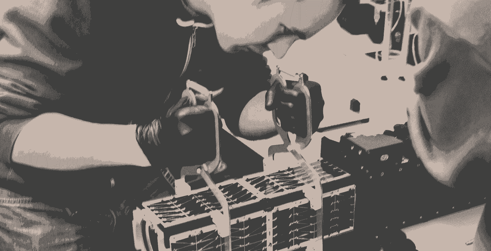

# Planet Labs 通过该计划将实习生培养成了公司领导者

> 原文：<https://review.firstround.com/planet-labs-turned-its-interns-into-company-leaders-with-this-program>

这是一个美丽、阳光明媚的日子——发射手机的完美条件——没错，一个载着智能手机的大气球进入了太空。那天， **[行星实验室](http://www.planet.com "null")** 首席技术官兼联合创始人 **[克里斯·波森](https://www.linkedin.com/in/chrisboshuizen "null")** 微笑着仰望天空，陪同的还有 **[【本·霍华德】](https://www.linkedin.com/pub/benjamin-howard/23/76a/303 "null")** ，他们帮助设计了飞船的结构，以及 **[迈克·萨夫扬](https://www.linkedin.com/in/mikesafyan "null")** ，他们增强了手机的无线电。他们一起证明了手机确实可以充当卫星——美国国家航空航天局从他们停止的地方继续前进。

你可能没有猜到的是，这三位航天先驱中有两位当时是实习生。今天的情况非常不同。霍华德管理着系统工程团队，萨夫扬现在是发射和监管事务主任，负责导航卫星发射所需的复杂无线电频谱许可网络。至于薄水曾，他致力于寻找下一批优秀的实习生，并帮助他们飞起来。

在 First Round 最近的 CTO 峰会上，他描述了 Planet Labs 如何从头开始建立实习计划，为公司培养非凡的人才。在这里，他分享了寻找、培训和留住优秀实习生的技巧，以及最重要的一课。

# 扔掉规则书

首先，抛弃实习生和全职员工之间有固定比例的观念。如果你有有意义的工作要做，并且有时间和能力指导初级员工，不要限制自己。

“有一段时间，实习生占我们员工总数的一半，有时他们是员工总数的 200%，”Boshuizen 说。“实习生是做短期项目、让事情运转起来、开始做一些事情的好方法，当然，也是发现可能成为你公司核心的真正令人惊叹的人才的好方法。”

没有你雇佣的实习生数量重要的是你围绕他们在公司的职位创造的文化。行星实验室的实习生不煮咖啡。他们不会花几天时间在无关紧要的忙碌工作上，或者为员工的突发奇想跑腿。在制造卫星和成为联邦通信委员会政策专家之间，没有时间做这些。

Boshuizen 卓有成效的实习计划的秘密是招募实习生从事关键任务，然后给予他们成功所需的信任、自由和信息。

“当你说‘我们将把公司的核心托付给你’时，人们就能在最高水平上表现，不管他们是实习生还是全职员工，”Boshuizen 说。行星实验室的实习生被视为重要的团队成员，因此他们有潜力产生有价值的结果。

如果我有一个关键信息，那就是:让实习生沉浸在你工作的核心中。

**拍刘彦文**(如上图)**。当行星实验室制造其第一个产品时，该团队面临着在紧张的时间表内建造 30 颗卫星的艰巨任务。当一些关键硬件姗姗来迟时，时间表变得更加紧张。“生产被一次又一次地拖延。我们需要建立一个能帮助我们扩大规模的团队，”Boshuizen 说。**

他毫不气馁，回到了已经让他受益匪浅的实习生队伍中。“我们的技术顾问说这太疯狂了，卫星应该由设计它们的专家来建造，”他说。“我们选择忽略所有这些建议，我们雇佣了亚历克斯和其他几个实习生自己建造所有的卫星。我们安装了一些软件，指导他们如何建造卫星，然后交给了亚历克斯。”他和他的团队完成了前 30 个单元中的 26 个——并让任何进一步的实习生说不。

这种模式将实习生视为内部人员——他们喜欢接触与这种身份相关的所有信息。从全体会议到公司外，行星实验室的实习生去团队去的地方；当他们在做一个产品时，他们知道团队所知道的。

“这无疑是有风险的。当然也有不利的一面，”薄水曾承认。但这种信任会带来丰厚的回报，从长远来看，这是非常值得的——尤其是当你永久聘用一名实习生的时候。“当你分享一切时，实习生会觉得你从一开始就尊重他们，并以极大的信心对待他们。以我的经验来看，他们用自己的信任和愿意付出额外的努力来回报公司，并继续创造惊人的业绩。”

这就引出了一个问题:你如何找到你愿意如此信任的人？你如何找到有能力做到本、迈克和亚历克斯所创造的事情的人？

Ben Howard at work on one of Planet's Dove satellites.

# 撒网的小技巧

像任何形式的招聘一样，实习生招聘是一个既昂贵又耗时的过程。这不可能是事后的想法。如果你想让你的项目有回报，你需要给它足够的关注。去年，Planet Labs 的一名首席工程师管理实习生招聘，Boshuizen 估计这花了她大约三个月三分之二的时间。今年，他们带来了两个专门的人来运行这个过程。

要真正做到规模化实习，需要大量高接触的劳动。

当开始雇佣实习生的时候，Boshuizen 建议将多元化作为首要任务。从位于旧金山的总部来看，行星实验室当然从斯坦福和伯克利大量招聘人才——但他们也重视在全国范围内寻找最广泛、最强大的可用人才库。招聘会可能特别有价值。Boshuizen 估计他在每家公司都会收到 300 到 400 份简历。

但是在你开始大学之旅之前，花些时间构思你的价值主张，并让它变得生动起来。你想搭建一个外观和感觉都与众不同的展台，并想办法吸引潜在的实习生来参观你的产品。例如，行星实验室团队带来了他们的“鸽子”卫星模型。

“当人们来到这里时，看到那里的实际硬件真的让他们兴奋，”Boshuizen 说。你知道你正在研究改变游戏规则的解决方案——现在的诀窍是让聪明的新人才相信，他们也能够并将在这项工作中发挥有意义的作用。你要带着大量的例子和令人信服的故事来，讲述过去的实习生有机会做什么，以及他们能够建立什么。这是你脱颖而出的最佳武器。如果你能在项目期间带来一些工作和生活的视觉效果——展示实践实习生是怎样的——那就更好了。

**另一个亲提示:**

**“不要在你的展位上拿实体简历。这有点太容易了，然后你回到家就有一堆纸要处理。”**

增加一个过滤机制，要求应聘者在招聘会上与你见面后在线提交简历。你需要审查的内容会更少，额外的好处是，你会从你的候选人那里得到一份更连贯的兴趣陈述。通过只考虑那些愿意采取额外措施来引起你注意的人，你也能从噪音中获得更清晰的信号。

最后，对通过意想不到的渠道来找你的实习生保持开放。还记得星球实验室的工程主管本吗？当薄水曾遇到他时，他实际上是硅谷奇点大学的一名电影实习生，负责处理该校录制的讲座。原来他的学位是机械工程，他想利用这一点。现在，他已经发射了 75 颗卫星——几乎比地球上任何人都多——他是行星实验室的一个巨大发现，证明了与尽可能多的人互动和进行有意义的对话是重要的，即使他们不符合预先设定的轮廓。

# 管理是关键——即使只是一个夏天

所以，你在招聘阶段卖出了一个令人兴奋的机会——现在是兑现承诺的时候了。如果你有资源和一个强大的项目，绝对 100%值得雇佣一个实习协调员。如果这是不可能的，你当然可以没有一个。

**请记住，最快乐、表现最好的实习生是那些拥有积极、周到体验的人**——创造这种体验在很大程度上取决于他们有一个极具影响力和组织能力的人可以依靠。稍后会详细介绍。

为了成功加入并管理每年夏天都会突然涌入的人才，Boshuizen 有几个建议:

不要:期待免费的劳动力。“特别是在加州，你必须支付最低工资。“我们一直给实习生发工资，你也应该这样，”Boshuizen 说。事实上，行星实验室的工资远远超过了最低工资，一般在每小时 27 美元左右。“这仍然比全职员工便宜，但你也有不同的期望和不同的产出保证。”

**DO:适当提供实习生。**在这里，你也需要照顾好你的新团队成员，不管他们会和你在一起多久。这意味着他们至少需要一台新的笔记本电脑和一个干净宽敞的工作场所，以及完成日常工作所需的任何其他工具和软件。

**做:欢迎意想不到的文化转变。如果你成批雇佣实习生——比如说，一个暑期实习生班——你的办公室文化很可能受益于他们的共同经历。你无法计划它，但当它被培养时，这种友谊将有助于塑造你公司的文化，远远超过一个夏天。对于行星实验室来说，实习生留下的标记每周二都会展出——Tutu Tuesday，也就是去年夏天班上的创意。大多数实习生现在都走了，但公司里的每个人都有自己的芭蕾舞裙(并派上了用场！).**

“在建立团队和丰富办公环境方面，我们发现引入实习生并像对待家庭成员一样对待他们真的很重要。”

不要:放弃你的承诺。给它时间和精力，你的实习生计划可能是你快速扩大规模的秘密武器，或者是解决一次性项目的秘密武器，这些项目将极大地推动产品开发。作为交换，你应该向实习生提供引导，吸引他们抓住这个机会。

在他们踏进办公室之前，确保你的导师架构已经清晰地勾勒出来，并且全职团队成员了解你的期望。

我见过的一种常见的失败模式是当实习生的导师或主管长期不在时，结果实习生遭殃。

即使你没有看到明显的危险信号，也要保持与实习生的沟通渠道畅通。“定期检查以确保他们的项目进展顺利，并且他们认为这些项目有意义，这非常重要。”

# 如何雇佣你公司的未来

不管有没有说出来，你雇佣的每个实习生都会有一个悬而未决的问题:“当这一切结束时，你会给我一份工作吗？”

Boshuizen 的实习生来自各个领域，从学期中的本科生到在行星实验室完成硕士项目的研究生，从刚毕业的学生到以合同工身份工作的更有经验的专业人士。但最终是后者激发了该公司的实习生招聘理念。“我想说，我们一直在运行的实习生项目更像是每个人的合同工，”Boshuizen 说。

实习是你能得到的最好的技术面试。之后，你会确定你是否还想和那个人一起工作。

你需要相应地小心管理期望。“如果你在一个夏天带 40 名实习生，你实际上不可能把他们都招满，”Boshuizen 说。在这个问题上，他走在了前面，在每堂实习课的一开始就非常明确地指出，不能保证最后能找到工作，并不断地强调这一点。“我们在这方面并不总是完全成功，但非常重要的是，你不要误导人们加入公司的前景。”

然而，如果实习生真的“通过”了实习-技术面试，让他们通过一个修改过的招聘漏斗。“我们进行一次简单的最终实习面试——实际上只是创始人面试，以确保他们符合文化，然后是团队领导面试，以实际查看是否有角色，”Boshuizen 说。

雇佣一名实习生应该和雇佣任何其他候选人很相似。创建一个职位描述，并确保在你的人员配备和财务计划中考虑到这个职位。“当你像这样带人进来时，你实际上有一份真正的工作是非常重要的，”Boshuizen 说。不仅仅是你的新员工需要并且应该得到这种清晰，对你组织的整体士气也很重要，不要仅仅因为你认为他们有趣就雇佣他们。

但最终，无论实习生是否被录用，无论他们在你的公司工作三个月还是三十年，你都有机会给你所在行业的新兴人才提供独一无二的教育。行星实验室的实习生带着他们自己的一张非常棒的快照离开了他们的经历:由于他们建造的一些东西，一张从太空拍摄的图像。当你在你的项目中投入这种程度的思考和关心，你雇佣最好的人的机会就会大大增加，甚至那些没有得到一个位置的人也会像粉丝希望的那样离开。

“我认为拍出这样的照片非常棒，”Boshuizen 说。“如果你让实习生成为你公司的灵魂，你也可以与他们分享类似的史诗般的经历。”