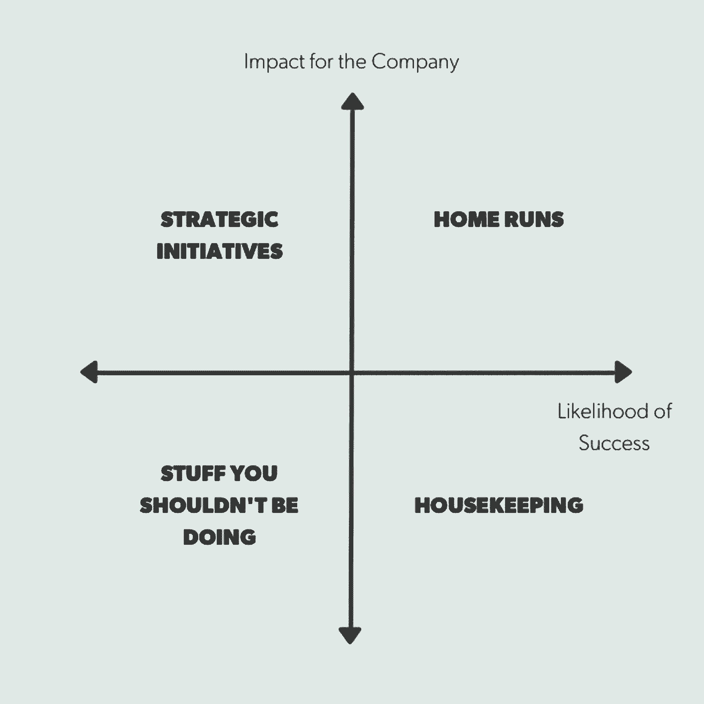

# 战胜倦怠的实用框架

> 原文：<https://review.firstround.com/practical-frameworks-for-beating-burnout>

**[花小蕾萨克森纳](https://www.linkedin.com/in/roli1 "null")** 去年加盟 **[机灵](http://www.clever.com "null")** 带领客户成功。但在成长中的初创公司中，这种事情太常见了，她的角色开始扩大——而且越来越大。如今，她负责所有的销售、战略合作和运营。在 LinkedIn 的一路晋升，最终监管其最大的北美销售部门，她已经习惯了有太多的事情要做。但是，即使是最有经验、一心多用的高管也有他们的极限。**最好的也承认。**

“有时，我会经历一个阶段，如果我不管理好我的重点和优先事项，什么需要发生，什么不需要发生——你知道，同时呼吸——我会筋疲力尽，”她说。“不管你有多优秀或多有经验，这都是不可避免的。你所能做的就是试图阻止它，并建立一个在更多时间捕捉它的环境。”

现在，在一家必须保持精干和竞争力的初创公司，多个团队中有超过 40 人向她报告，她开始认真对待如何防止精疲力竭。在这篇独家文章中，她分享了**关键框架**，这些框架帮助她在职业生涯的最艰难时刻分清轻重缓急、集中精力并生存下来——并建议初创公司如何将它们制度化，以实现更好、更快乐的全面绩效。

# 泄露秘密的迹象

为了在倦怠变坏之前抓住它，把它分成两个部分: **1)** 导致它的因素，和 **2)** 你正在走向它或者已经在它里面的信号。

第一个很难及时发现。“每个人都听说过‘千刀万剐’这种说法，嗯，这也是倦怠的表现，”Saxena 说。“它通常是许多你认为自己可以处理的小事的结果，然后突然袭击了你。”在大多数情况下，您需要追溯找出原因，并从中吸取教训。

**事实证明，如果你已经准备好寻找这些共同的信号，那么第二个更容易识别:**

“这不仅仅是有太多的事情要做，而是承诺做比你知道自己有时间做的更多的事情。它是在你无法实现的时候承诺你知道的事情，但你脑海中的另一个声音说，“我会以某种方式让它实现。”"

“我不再笑，不再微笑，不再享受幽默，”Saxena 说。“有人会说一些很搞笑的话，但我就是不会。我无法回应。我觉得很多人都知道这种感觉。”

“不同的人以不同的方式表现出倦怠，但我认为对我们所有人来说，这是某种形式的关机，”她说。你人格的一部分开始收缩。你的表达范围缩小了。你的世界观变窄了。"倦怠对创业公司来说是致命的，因为它扼杀了洞察力."

倦怠不仅仅是在想，‘我太累了……’这是没有创造性思维的能力。

具有讽刺意味的是，这个问题最困扰 A 型玩家。那些想尽最大努力并取得最大成就的人最终无意中限制了自己。在创业文化中，这通常表现在人们试图在工作中取得最佳表现，同时参加所有社交活动，并对家人好。然后他们会因为没有在每一个方面都取得完美的分数而对自己很苛刻。一旦他们遇到自己的酒吧，他们就提高它。

但是还有第二个，甚至更不可见的原因:科技领域缺乏包容性的环境。这不仅仅与性别、种族甚至社会经济背景有关。这是关于你的个性和工作风格以及你如何专业地操作。每个人在这些方面都是不同的，但科技公司——尤其是初创公司——往往需要一种特定的风格。

想想在工作场所中，你不得不为被倾听而奋斗的内向天才。也许你是一个夜猫子，但所需的时间是为早起的人设计的。也许你的工作需要专注、安静、持续的专注，但你的大多数同事整天听流行音乐、打电话。

“大多数组织还没有进化到创造一个包容员工多样性的环境，”Saxena 说。“这给那些必须努力适应主流文化的人增加了额外的负担——或者你甚至可以把它视为一种税收。他们基本上必须是不在工作中的人，这很累人。”

她记得在 LinkedIn，同样的人在每次会议上提出想法，而其他人保持沉默。这些人已经在努力工作了，而且绝对足够聪明，可以做到这一点，但是他们没有能力一直大声疾呼。他们对此越紧张，参与就越少。

“这个问题在初创公司变得更加突出，因为事情发展得如此之快，而且有如此多的紧迫性。人们和他们的特殊技能被忽略了，”她说。

最近，她停止了某些人保持沉默的讨论，说:“让我听听你的意见。我们需要了解您对此的看法，这一点很重要。”每当她的直接下属在一对一的谈话中提出很棒的想法时，她都会记下来，并尽最大努力在更多的公共论坛上引出这些想法。确保人们能够安全舒适地产生影响将会抵消倦怠。

请记住，这其中的风险并不低。

“现在创业公司面临巨大的人才挑战，”Saxena 说。“所有的公司都想要同样的人，包括谷歌、微软和脸书。他们可以支付两倍或三倍的价格。所以是战争。”

当你无法与金钱竞争时，无形资产就变得更加重要。能够展示和提供一个考虑员工心智健全和心理安全的工作场所是一个相当大的优势。

“我们不仅要找到合适的人才并留住他们，还要让他们参与进来！这真的很难，而倦怠是这三者的能量所在，”她说。“你希望所有人都长期留下来，因为留住人才比雇佣新人要便宜得多。这是一个大多数创业公司都会搞砸的领域，但有机会不搞砸。”

# 触发器和权限

“这是一种精神训练，一旦你精疲力尽，就击退那些你不可能休息的想法，并对自己重复，‘不，我实际上可以。’”她说。它需要精神上的重新布线，这只能来自重复的纠正。

一旦她意识到自己的触发因素，Saxena 就会更加自信地要求时间来减压。在她职业生涯的早期，她从来没有。

“我仍然记得很早以前在 LinkedIn 时的那一次，当时我疯狂地关注着电子邮件，”她说。在过去的两年里，她的团队已经从不足 10 人发展到全球 200 人。“我记得看到我们的高级副总裁——实际上我和他是非常好的朋友——沿着大厅向我走来，我实际上藏在浴室里，心想，‘天哪，我已经两个小时没看电子邮件了，如果他问我一些我不知道的事情怎么办？’"

即使在那时，她也没有意识到自己已经精疲力尽了。她只知道她不能谈这个。

“现在，回想起来，我甚至无法想象我当时的感受或我当时的生活方式。这是错误的，”她说。“最后，我打电话给我以前公司的一位导师，告诉她晚上的情况。她说，你有没有想过允许自己离开跑步机？“为什么不休息一周呢，”"

Saxena 下意识的反应是，“不！我不可能！我们有太多的事情要做，而我是唯一能做这件事的人！”

她的导师平静地建议她迁就自己，写下她休假一周前需要处理的所有必做之事。在同一张清单上，对于每一项，她都被要求写下这项任务对公司的影响，以及在她不在的情况下谁有可能完成这项任务。

“这是我能做的最好的事情，”她说。“我立刻看到了我正在做的对公司没有价值的事情有多少，现在不需要做的事情有多少，我可以委托的事情有多少。最困难的事情是我需要做的所有招聘工作，但如果推迟两周，没有人会死。事实上，什么也不会发生。我感到的紧迫感是人为的。”

在技术领域，紧迫性往往源于一个简单的事实，即所有初创公司都觉得必须以极快的速度前进才能取胜。

事实是，如果你不得不离开一周，你的公司会想出办法，一切可能都会好起来。

所以 Saxena 休了一周的假，她意识到她给自己设置了多少障碍。“我回来后有了更好的想法。我的团队更开心了，因为他们觉得自己有能力做我从不让他们做的事情。”

# 你的抗疲劳工具包

Saxena 从 LinkedIn 离职后，在一家更小、更有竞争力的公司承担了更多工作，现在她拥有了处理压力的工具。事实上，她刚刚和她的团队举行了一次研讨会，分享了一些应对压力的武器。最重要的主题:**“做更少的事情，但是要做得非常好。”**

有两个练习被证明特别有价值。

**优先排序矩阵**

你负责的所有项目和活动都有价值——它们对公司产生了一些理想的影响。这可以是量化的(比如活跃用户的增加)，也可以是软性的(比如 Twitter 上更积极的情绪)。他们也都有成功的可能性。有些人会更容易获胜。其他的来之不易。使用这些属性，您可以在这个 2×2 矩阵上绘制所有项目:

这是 LinkedIn 高管一直使用的框架，现在，正如 Saxena 所说，“我生活中的一切都围绕着它。”这是真的，她甚至用它来帮助她的孩子决定他们想参加哪些活动(你不能玩音乐和曲棍球，做辩论和新闻)。她经常求助于它来决定如何处理她面前的各种任务。

**象限 1:** 棘手的重要事情，需要创造性的战略思维(作为领导者，你应该在这方面花时间)。

**象限 2:** 高收益，更直截了当的项目。这是你的全垒打象限。你可以把这些东西外包给表现最好的员工，作为延伸目标，当他们完成时，将会超级有力量。

**象限 3:** 低值，成功可能性低。这种东西应该被禁止。也许是一个你不需要参加的会议，或者是不值得回复的邮件，或者是与你或公司不太相关的人的咖啡会议。忙的时候是第一个去的。

**象限 4:** 低值，成功可能性高。这些是你的家务。这个象限中的活动最好委托给别人或在一天结束时完成。

“比方说，我们正在考虑推出一个对业务有重大影响的新项目，但我们还处于这一过程的早期，定位会很困难。她说:“这属于象限 1，因为它非常有价值，但以目前的形式不太可能成功。”“此外，我们还有针对新经理的领导力培训项目。投资它们的价值非常高，如果我们投入时间，运行一个好程序的可能性也很高，所以这属于象限 2。”

一旦 Saxena 在矩阵上绘制出她的所有项目，她就开始做决定。她会立即放弃并取消任何落入象限 3 的东西。然后，她进入象限 4，调查她的团队，寻找愿意享受学习机会和提供更多帮助的稳定的初级员工，并给他们分配家务。

她会将象限二中的任何事情外包给团队中表现最好的人，尽她所能帮助他们取得成功。重要的是回答任何问题或在必要时提供意见，但在大多数情况下，如果你是团队领导，你可以让其他人来处理这些任务。成功对他们来说将是一次非常积极的经历。如果你没有人可以委托，那么也许你分配给这些事情的时间会更少。

然后是象限 1——为了让你的企业变得伟大，需要完成的真正困难的事情。通常它需要大量的深入思考、合作、修改和解决问题。如果你是一个领导者，这就是你应该关注的地方。这是你比任何人都更有背景的地方，你自己也能对公司产生重大影响。

“任何时候你感到不知所措，就把它抽出来。这是一种治疗，会让你对自己的选择和真正重要的事情有更清晰的认识，”Saxena 说。

**沟通模板**

完成矩阵评估后，您需要与其他人分享您的决策。有一个系统的方法来做到这一点，这将确保所有的期望是一致的。

**创建三个并排的列:**

**第一栏:**我应该并且可以做的事情。这东西很重要，而且你伸手可及。通常是你在上面象限 1 中确定的项目。

第二栏:我说过要做但没有做的事情。这些项目在你的待办事项清单上已经被搁置了很久。它们可能是象限 2 和象限 4 的组合——轻松的本垒打和你没有机会关注的家务。这往往是很多压力的根源。

第三栏:我不该做的事情。象限 3 中所有你想取消的项目。无论你认为自己有多有效率，你可能都不会意识到你有一些这样的能力，除非你对你正在做的每件事都做一个清单。也许是第四象限的管家。

每一栏代表一种不同的交流方式。第一栏中的一切，你可以告诉人们，“别担心，我有这个。我会抽出时间专注于此。”

第二栏通常要求某种形式的道歉。也许是你告诉你的老板或直接下属，“对不起，我做不到。”在这里接受真相是至关重要的。你必须对自己的能力开诚布公。如果你的老板仍然认为你应该处理其中的一些项目，不要只是说好。Saxena 说，把谈话当成谈判。解释一下为什么你还没有着手这些项目，为什么你认为它们应该被取消或者退居二线或者交给其他人。你可能不会赢得所有的比赛，这没关系。重要的是进行对话。

第三栏可以通过一系列简单的电子邮件来处理，通知相关人员一项任务已经取消，或者已经委托给一个现在是关键人物的新人。即使您正在清除这些项目，您也不希望在这里犯错误。他们都必须去某个地方，每个人都在同一页上是很重要的。

“在我的职业生涯中，有很多事情我承诺过，但经过评估，我就是做不到，”Saxena 说。“这意味着负责任的事情是不断重新评估，并在这种情况下弄清楚。经常沟通是最坦诚的沟通。”

# 界限的好处

为了避免精疲力尽，让你的团队知道他们可以做更少的事情，只要他们真的做好了。

协商是设定界限的关键部分。当你不知所措的时候，你不能害怕去找你的老板说，“嘿，我们需要在这里找到一个折中的办法。”如果你是真实的、讲道理的，那么这样做不会对你的表现或声誉造成任何损失。事实上，它应该对你有很好的影响。想要防止精疲力尽的创业公司会创造一个鼓励这些讨论的环境。

“在我职业生涯的早期，我不认为自己有能力给自己的工作设定界限。在我看来，我是这样的，‘如果他们想让我全天候工作，我当然可以。’”sa xena 说。“我从未设定界限，直到我有了第一个孩子，然后我不得不这样做。我亲眼目睹了我是如何做到不承担任何后果的。反击从来不会伤害我——只会有所帮助。”

如今，她每周三都在家工作。这是她在 Clever 的角色扩大时协商的事情。那一天完全被封锁了，没有电话和会议。“这是我思考大事的日子，思考象限 1 中的事情，”她说。“我需要那种空间，摆脱电子邮件和上下文切换，从各个角度思考问题，制定战略，展望未来。”

太多的人说他们没有发挥创造力的空间。所以他们只是执行，这阻碍了公司的发展。

“尤其是当你是一名经理时，你会陷入这种模式，感觉你的时间属于你的团队，你永远不应该说不或不在——事实并非如此，”Saxena 说。“如果我们的领导者没有创造性的贡献，这是对人力资本的极大浪费。他们才是应该制定战略计划的人，需要在日程表上留出空白来完成这项工作。”

# 像岩石和沙子

“想想你需要做的所有事情。大的有影响力的是岩石。然后是所有持续不断的细节——电子邮件是最重要的，但也有不太重要的会议、一次性问题、闲置的消息，这个列表还在继续。那是沙子。”

萨克塞纳说，想象你的一天是一个罐子。如果你整天回复外来的询问，不断地往里面倒沙子，它会很快被填满，不会有任何放石头的空间。你不会有成就感，因为你的影响力有限。

但是假设你承诺把时间集中在一块或两块石头上，并划出时间去做这件事。如果你把一块石头放进桶里，你仍然可以把沙子倒进桶里，沙子会绕着它流动。电子邮件也是如此。最重要的信息会得到回复，你会完成更重要的工作。

她说:“你会更严格地安排邮件的优先次序，更快地回复邮件，你不会让它们让你陷入困境。”“你可以在沙子上妥协。你不能在岩石上妥协。”这里有一个视频更详细地阐述了这种想法:

她的电子邮件哲学是什么？拥抱你内心的懒惰。

“我浏览，看看什么是最重要的，并确保照顾那些，”她说。“其他人也许做不完，但没关系。我不必总是有一个空的收件箱。期望总是 100%的时间立即响应是不现实的。老实说，这可能也不是对方的期望——而是你自己的期望把你束缚在这上面。”

这又回到了给自己许可。你必须允许自己关闭收件箱，让线程挂起。甚至可能是几天。

为了确保她没有错过任何事情，Saxena 在周五一天结束时安排两个小时来收集和回复任何剩余的非紧急电子邮件，以便她可以重新开始下一周。

“比尔·盖茨曾经说过，他喜欢雇用聪明、懒惰的人，因为他们知道如何以最快的方式解决问题，”她说。“你可以把这种想法运用到自己身上。如果你让自己变得足够“懒惰”，只关注一周中最重要的事情，到时候你会更有效地处理剩下的事情。”

# 建立一个有职业倦怠意识的工作场所

你可以通过雇佣那些以聪明的方式度过艰难时期的人来防止你的组织过度劳累。Saxena 在面试中寻找某种表明适应力的品质，或者至少是良好的应对机制。

“我问问题是为了真正磨练和了解他们如何区分事情的轻重缓急，以及当他们感到不知所措时如何管理。”她问他们这样的问题:

告诉我你上一份工作中的一次经历，当时发生了一场大火灾，有太多事情要做，而且对你的时间有很多要求。

你感觉如何？真的，你当时的情绪状态是怎样的？

你曾经不得不放弃一个项目吗？那次谈话进行得怎么样？

让我们角色扮演一下当你感到筋疲力尽时，你和你的经理的对话。

有时，她会描述一个有很多活动部件的紧张场景，并让这个人按照他们处理事情的顺序走一遍，以及为什么和如何向他们的团队解释。

除了招聘，Clever 还利用其路线图流程，让员工接受更高层次目标的培训。他们使用 OKR 系统，将每个人的个人目标与公司在特定时期的几个重要目标联系起来。这使得他们能够就公司的“大石块”是什么，以及员工个人的“大石块”应该是什么进行过多的交流。

在每一次一对一的 Saxena 会议中，她都会倾听自己的报告所做的事情，并明确回顾他们的活动如何融入大公司的目标。如果她看不到足够紧密的联系，她会问:“这和你的三大目标之一有什么关系？”这也让她可以强调，这个人可能正在做的任何不符合这些目标的事情都是可以商量的，甚至是无关紧要的。基本上，它强调了如果他们开始感到太瘦，他们可以削减的脂肪。

她的另一个重点是为她的团队创造空间和时间，以真正挖掘他们的大岩石目标。“我真的想帮助他们消除生活中的浪费。如果员工被带离工作岗位，我甚至会与同级别的其他经理协商，以保护他们的时间。”

该公司还取消了所有员工的午餐时间，这样他们就不会开会了。他们可以每天享受一个小时，因为他们知道与同龄人相比，他们不会落后或懈怠。它允许人们休息一下，甚至可能通过与同事的随意交谈来提出更好的想法。

这就是以身作则可以产生巨大影响的地方。如果高管们也利用午餐时间，那么每个人都更有可能这么做。Saxena 将同样的逻辑应用于周末工作。她非常清楚人们无论如何都会这么做。但通过将自己周末的工作时间限制在周日晚上两小时，她鼓励其他人也这样做。

她说:“他们会觉得自己周末在工作，而且做得更多，但他们不会做得太过火。”。从下午 6 点到 8 点(在她坐下来吃晚饭之前)，她会让自己处理电子邮件，回顾她下周的日程，准备她需要的任何东西。但仅此而已。

# 红利

这些实践的一些好处是显而易见的:更长期的员工参与、创造力、快乐等。但真正的优势在于它的前瞻性思维。“科技领域的生活方式越来越趋向于一体化，工作永远不会结束，生活也永远不会结束。”它们共存。在这种情况下，平衡至关重要。

“在 LinkedIn 的一年里，我每周去 4 天，因为我想在我儿子申请大学的时候陪在他身边。请记住，我负责北美销售的一个重要部分，而且很有效！”萨克塞纳说。“这迫使我们在流程方面变得非常聪明。当我不在的时候，每个人都知道谁对什么负责，知道决策会如何升级，以及如果他们真的需要，如何联系我。生活和工作围绕着这个界限流动。”

没有东西掉落。“沟通比以往任何时候都更加开放和清晰。Saxena 说:“新人有新机会。“当你关注员工的生活质量、他们的理智、他们如何处理工作负荷时，你会学到更多如何更好地工作的知识。"