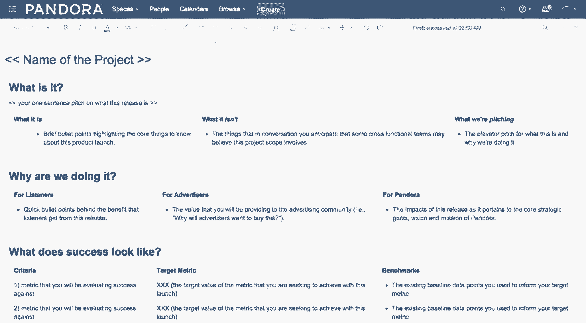

# 从我在 Pandora 的经历来看产品领导法则

> 原文：<https://review.firstround.com/product-leadership-rules-to-live-by-from-my-experience-at-pandora>

2013 年， **[杰克科劳兹克](https://www.linkedin.com/in/thepolishjack "null")** 加入 **[潘多拉](http://pandora.com "null")** 正式组建其首个致力于广告的产品管理团队。凭借他在 StumbleUpon 和谷歌多年的经验，他不仅负责推出能让听众喜欢的智能产品，还负责召集一个快速成长的团队。

对科劳兹克来说，领导一个产品管理团队首先要以身作则。鉴于其团队的规模，他立即投入到产品管理中，负责 Pandora 广告插入逻辑的重建和发布。“这不仅让我更好地了解了产品的工作原理，还让我了解了如何忠实于 Pandora 的开发周期。”

科劳兹克看到了许多已经成长为产品的想法，还有一些从未公开的想法。他的团队的广告产品经常导致创造性的解决方案，但也导致许多死胡同。有了这些经验，科劳兹克在公司稳步上升。**他提出了六个具体的策略，产品负责人不仅可以用它们来打造卓越的产品，还可以用它们来打造有才华的产品经理。**

# 知道你的团队的邓巴号码

20 世纪 90 年代，英国人类学家[罗宾·邓巴提出，人类只能舒适地维持 150 个稳定的社会关系](https://en.wikipedia.org/wiki/Dunbar's_number "null")，这代表了给定人类平均大脑大小的认知极限。对于科劳兹克和他的产品开发团队来说，这个概念在他们的工作中产生了共鸣。他们工作的核心很大程度上依赖于在公司内部广泛而深入地建立真实的关系，同时不过度扩张。

“我认为每个优秀的产品经理天生都是领导者。这是一个有趣的工作职能，因为你是一个绝对没有直接下属的领导者，”科劳兹克说。“例如，产品经理必须激励不向他们汇报的工程师，还要满足其他几个业务利益相关者的需求。”

指导产品经理的人必须是领导者中的领导者，并且了解公司内部业务关系的架构。以下是领导快速扩展的产品管理团队时需要考虑的几个要点:

*与工程师建立关系，让他们知道“为什么”，而不仅仅是“什么”*

“对于早期团队，工程师和产品经理的黄金比例通常是 5:1，”科劳兹克说。“它有助于与开发人员建立足够密切的关系，产品经理本能地知道是什么让每个开发人员成功。这种理解水平有助于产品经理激励、组织他们的沟通，并获得最高产量。”

随着团队的成长和变得更加分散，项目经理和工程师之间的关系比确定一个特定的比例更加重要。工程师不仅要对工作内容有敏锐的理解，还要对每个产品特性背后的决策有敏锐的理解。背景是跨职能团队的王道。“如果产品经理能够清楚地表达出需要完成什么*以及为什么要完成*，一些真正令人惊叹和美丽的东西就能被带到这个世界上来。”

*小的产品团队需要聚集在一起。*

科劳兹克建议，当一个产品团队少于 10 人时，应该利用团队规模小的优势，让所有人尽可能多地呆在同一个房间里。邀请工程师和设计师参加，并将他们纳入规划会议。在 Pandora，这不仅加强了产品工作人员之间的关系，还增加了每位 PM 结束会议时对产品及其端到端状态有全面了解的可能性。

在潘多拉的早期，前首席技术官兼产品执行副总裁[汤姆·康拉德](https://www.linkedin.com/in/tomconrad "null")为所有接触过潘多拉产品的员工建立了一个[金钱决策系统](http://firstround.com/review/This-Product-Prioritization-System-Nabbed-Pandora-More-Than-70-Million-Active-Monthly-Users-with-Just-40-Engineers/ "null")。在每一次季度会议上，来自全公司的与会者都会讨论 Pandora 最重要的产品和计划。为了确保积极参与和优先排序，每位与会者将获得 5 美元，用于投资他们认为最重要的领域。虽然金额很小，但它迫使人们思考他们的赌注。

对于许多创业公司来说，当产品团队足够小以保持对话可控时，这个系统工作得很好。尽管员工人数增加了，Pandora 仍然使用美元决策系统，但是是以分散的方式跨不同的产品管理团队。例如，广告产品组有一个专门的“美元决策”预算来告知其路线图。最终，关键是识别并利用涉及不同职能的密切对话。这是推动公司发展的燃料。

*大型团队需要认真对待流程。*

“我最感兴趣的挑战之一是如何保持潘多拉早期决策过程的协作性质，但使其适应我们不断增长的专业化团队，”科劳兹克说。当潘多拉还不到 500 人的时候，关于产品开发的公开邀请、私密的市政厅运作得很好。但现在，该公司拥有 1600 多名员工，包括超过 25 名产品经理和总监。使用同样的策略会导致混乱、循环对话和相关人员的有限相关性。

一旦你需要一个“溢出”的空间来开产品会议，就该认真对待流程了。

两年前，当科劳兹克在 Pandora 创业时，有三名产品经理专注于广告业务。在他的任期内，已经有 12 名项目经理，其中一些是产品开发新手，另一些则有超过十年的经验。12 名产品经理与超过 55 名工程师一起工作，在一定程度上，这些工程师也在科劳兹克的关注范围之内。

当产品经理的数量接近两位数时，科劳兹克实施了集团产品经理汇报结构。此举不仅是为了扩大他的领导范围，也是为了扩大团队的能力。“如果你有许多直接下属，你就无法在一对一的基础上扩展洞察力和沟通。团队会开始感到脱节。作为经理，你实际上是在设置路障。这项工作的很大一部分是为你的团队清除障碍，而不是制造障碍。”

为了保持团队的集体性和效率，他将他的团队组织成三个功能支柱，涵盖端到端的广告:听众广告体验、广告分发技术和广告购买者体验。科劳兹克为每个支柱指派了一名集团产品经理。每个集团产品经理管理四个项目经理，每个产品有一个指定的领导。这种结构有助于促进快速、集中的垂直会议，并预期 PM 团队的增长。

# 把所有事情都写下来，然后分层

科劳兹克说:“做任何形式的工作，最困难的部分是把单词从你的大脑中取出，把它们写下来，然后谈论它们。”。“很多人似乎倾向于认为写作是重复的工作，或者只是为了抒发感情，但这并不正确。克服这种误解很重要，尤其是当更多的人和声音加入团队时。”

当科劳兹克的项目经理、工程师、销售人员和运营团队带着对所讨论和决定的看似不同的理解离开每周例会时，他真正意识到了这一点。他会在走廊聊天和随后的谈话中听到这些类型的裂痕。如果这种脱节发生在每个人都在一起的情况下，当团队变得太大而无法进行一个房间的聚会时，会发生什么？为了抓住这些情况，作为经理，你必须与足够多的人交谈，以确保手头的工作有统一的清晰性。

在一次毫无结果的会议后，科劳兹克的一位产品经理有了一个想法:将相关信息提取到分层文档中。

一天，科劳兹克团队的一位 PM 注意到，在房间的一边，有工程师在查阅他们的大量产品需求文档(PRD ),上面写满了规格和用户故事，而在另一边，坐着一个来自营销团队的团队在查阅他们的规划文档。为了缩小差距，项目经理决定从珠三角提取相关营销信息，并将其放入一个单独的文档中，但保留其格式，以便可以映射回珠三角。这样，他会创建一个双方都可以使用的有用且熟悉的文档——以及一个易于推广团队操作的计划。

科劳兹克注意到信息分层的概念在他的项目经理的产品领域发挥了很好的作用，并在他的所有团队中应用了这一做法。"**成为强有力的产品领导者的关键不是自己想出点子。他说:“这是关于倾听你的团队，确定什么最有效，并决定如何在整个团队中最好地应用它。现在，科劳兹克的团队在四个关键文件的帮助下运作(按照从基础到扩展的顺序):**

**执行摘要**:产品管理团队整体工作的摘要；最高级别的纲要，也是快速上手的好地方。

**Wiki 页面**:由产品管理支柱组织的中央、内部网页面；每个重点领域的高级快照。它包括工程状态和要达到的运营里程碑。维基有每个支柱的进度图和每个季度的时间表。

**产品需求文档(PRD)** :全面的规划文档，包括标准、产品规格、用户案例研究等。这应该是一个端到端，一站式，详细的产品计划。

**发布计划文档**:所有运营计划文档的组合，用于协调所有团队之间的所有工作，包括产品管理、销售、营销和开发。由于潘多拉的规模，这是两年多前采用的。

An Example of a Pandora Wiki Page

在这四份主要文件中，科劳兹克特别看好维基作为一种工具，帮助他的产品经理在公司保持可见，阐明他们的工作，设定季度目标，并扎根于他们的产品路线图。为了更深入一点，下面是一个有效的 wiki 应该完成的任务，以及实现它的最佳方法:

**透明度和可见度**。“从本质上来说，我们的维基是协作性的，对公司的任何人都是可见的。我们与我们的管理人员进行季度业务回顾。维基让我们能够让我们团队的领导工作变得清晰可见。”

**简洁的总结和简洁的交流**。每个 wiki 都链接到一个执行摘要，这有助于让所有利益相关者保持在同一页面上，即使他们分散在 38 个办公室还有一个部分提示项目经理们存放他们正在做什么以及为什么做的简明扼要的说明——如果与同事、客户或潘多拉的领导层交谈，这是一个有用的练习和参考点。

**季度目标设定**。“我们没有具体说明每个季度会发生什么。当你处于这种增长模式时，可能有些季度我们会引入 5 名开发人员，而有些季度会有 20 名开发人员与我们合作。由于这种多样性和我们的小实验哲学，我鼓励产品经理在一个季度的时间内分阶段进行所有的测试、项目里程碑或发布。当然，产品往往需要三个月以上的工作，但维基的格式推动项目经理将更大的项目分成片段和序列。”

**明确定义什么是什么，什么不是下一个**。“在每个小组的 wiki 中，我们都有一个路线图，其中包含所有要开发和发布的产品功能的堆栈等级。我们认识到，为了消除未来和未来不确定性之间的任何模糊性，为将要开发的内容和不会开发的内容留出一个部分同样重要。”

如果说文档对于一个产品经理来说是至关重要的，那么对于一个产品经理的领导者来说则是必不可少的。

最终，科劳兹克认为自己是产品团队的产品经理。团队本身就是他打造的产品。“无论是价值主张还是为什么我们需要在这里放一个点，我都需要向团队解释我的理由。因为当我们应对更大的挑战时，项目经理理解所做的决定是很重要的，这样他们就可以在记住所有历史和信息的情况下做出艰难的决定。这对我们非常有用。”

# 让沟通成为你获得所有权的途径

对科劳兹克来说，沟通不仅与手头主题的共同理解密切相关，还与获取或给予所有权的机会密切相关。

尽可能多地重复你的沟通方式，让每个人都能理解关键信息。

“作为一名产品经理，你需要时刻意识到人们是否理解你集体达成的共识，这就是为什么沟通是一名有效的产品经理如此重要的一部分。你不仅要充分考虑需要做什么，还要考虑为什么以及如何实现目标。”

如果科劳兹克和他的一位产品经理不同意，他会质疑自己对这个问题的理解。“我发现，如果我不同意某个解决方案，通常是因为我对问题没有清晰的理解。科劳兹克说:“我会向总理承认，也许我不明白。“如果我觉得我发现了问题，但解决方案不正确，我会更深入地探究，以了解项目经理是如何找到答案的，以及我们如何就提议的方向达成一致。最终，我会把精力放在问题上，而不是人。”

但是，如果团队不理解，那就怪你了。“你是沟通流程和团队共享或不共享的共识的所有者，”科劳兹克说。“因此，如果有误解，如果他们与你或彼此意见不同，那是你的错。”

# 不要混淆微观管理和沟通不畅

“这是一种非常常见的趋势，只需提交产品需求，然后说‘我需要你这样做。’必要的下一步是首先考虑为什么需要这样做。"

几个月前，科劳兹克面临一种情况，他想改变他对广告产品管理支柱之一的报告方式。

“我不确定我们是否需要重新发明轮子，而是重新定义我们谈论它的方式，”他说。“我发现自己在这篇文章中制作了一个图表，并为维基页面提出了新的规则，这造成了混乱。支柱的产品经理一脸困惑。我意识到我犯了我指导我的团队要避免的错误。我退后一步，给出了完整的背景。这更容易解释我为什么要做出改变，而不是开出解决方案。当我能够清楚地表达要求时，我们就能够更快地行动。”

# 让团队管理成为你最优先考虑的产品

这种事经常发生。一个成功的产品经理被要求领导一个产品经理团队。尽管她在产品管理方面非常出色，并被创造和运输产品所驱动，但她发现自己大部分时间都花在了管理人员上——与实际的产品管理越来越远。科劳兹克也有同样的感觉，直到他像任何精明的产品经理一样，重新定义了这个挑战。

“我喜欢的产品管理是最初的想法，与利益相关者合作，让人们接受一个概念，从失误中学习，并承担过失。他说:“当然，没有什么比加入我的团队，在山顶上欢呼成功更好的了。“作为一名集团产品经理，我的工作是帮助项目经理拥有自己的想法，与利益相关者合作，让人们参与进来，并扩大他们的见解。我们的产品经理就是我的产品。我在使用同样的技能，但这是一种微妙的应用转变。”

要成为一名优秀的产品团队经理，你首先需要已经是一名成功的产品经理。

那么，如何打造最好的产品经理呢？科劳兹克提供了将团队管理视为一种产品的五种方式:

*建立先进的倾听机制。*

“产品经理往往有一个喜欢听到自己声音的名声，”科劳兹克说。“最好的产品经理是那些花大部分时间倾听的人。我尽量在会议上少说话，只问问题，让人们阐述和表达想法。这是最神奇的感觉，就像作为一个产品经理，你看到你的产品，你对它有这个假设，人们使用它，它开始，它开花。”

**策略:**从问你的产品经理一些开放式问题开始，顾客在第一次与产品互动时可能会问这些问题。一个产品管理团队应该被设计来预测这些问题，并在任何东西发布之前提供答案。您的团队可能会向客户提出什么问题？把那些也列举出来。

鼓励你的产品经理走到客户面前——但要把他们当成消费者来听。为了做到这一点，科劳兹克鼓励项目经理在提问时不要提及潘多拉:“现在你最感兴趣的产品是什么？你试图效仿的品牌有哪些？他们在做什么真的很棒？”

*不惜一切代价保持你的反馈回路健康。*

科劳兹克已经建立了一系列每周一对一的会议和两次团队检查——周一的产品会议和周三的物流会议。这些会议不仅为他的团队提供了明确的机会来表达关注点，而且还帮助他保持知识，因为他更加远离日常开发。他使用仪表板来掌握重要的事情，但这些会议有助于确认或调整他的理解。

“周一上午 9:30 是我一周中最重要的时间，因为超过 25 名产品总监和经理组成的整个产品团队会在这个时候开会。它始于我们的维基页面的预读，所以我们充分利用我们在一起的时间来确定见解和审查更深入的产品发布，”科劳兹克说。

我们的谈话可以包括更全面的更新，但也包括应对未来挑战的建议。有几个已经在我们的路线图中加入了新的特性。科劳兹克说:“在周一的小组会议上，我记下了所有我想与个人产品经理跟进的笔记——要么与他们的小组产品经理分享，要么直接通过 Slack 分享。”。

科劳兹克还在每周三与他的广告产品团队举行 30 分钟的周会。“这次会议讨论了从 PTO 到政策公告的行政细节。在我工作的头六个月，我忽略了为这些话题留出时间，否则它们总是会滑落到议程的底部。然后我想我可以给所有的项目经理发一封邮件。但这些领域很重要，应该亲自去了解——即使很快。”

**策略:**建立一套一致的小组和一对一会议，最好是在一周的早些时候，以帮助确定基调，并让团队达成共识。对它们进行排序，使它们的影响复合；一个是收集信息，另一个是解决出现的问题。改变会议规模，以便参与者可以选择提出问题的地点，并确定何时提出问题最合适或最相关。

*你的团队应该有一个像产品目的一样清晰明了的目的。*

“我要求每个产品经理深入阐述他们正在开发的产品的目的、高目标和抱负，从而理解他们正在开发的产品。科劳兹克说:“我真的希望他们能拥有这一切。“高度关注收入目标非常重要，但对一些人来说，这会导致视野狭窄。我意识到，花时间去理解潜在的原则和动机将会提高客户参与度，也有利于收入目标的实现。”

作为集团产品经理，科劳兹克运用同样的原则。根据丹尼尔·平克(Daniel Pink)的著作《动力》(Drive)，他已经成为产品经理个人动机的研究对象。他们的动力通常来自三种感觉之一:

**自主**——自我导向是内在的动力。自主性驱动的人看重信任，不喜欢微观管理。

掌握能力——能力和职业发展——不仅仅是工作进展——是关键。那些被精通所驱使的人会问:“通过从事这项工作，我在哪些方面变得更好了？”

**目的**–与共同的使命或事业联系起来是最重要的。那些被目标驱动的人会问并且能够回答:“我为什么要做我正在做的事情？”

科劳兹克在整个潘多拉星球上更有效地使用了这个框架。正如他所指出的，“我曾经和某些类型的人一起工作过，他们只对复杂的数学问题或者吞吐量和规模问题感兴趣。其他人真的希望拥有设计最优雅的用户界面。”他的目标之一是帮助他的团队学习如何更好地理解公司员工的行为方式，并利用这些信息来完善他们的风格。

**策略:**在构建和发布产品时，通常会调查用户动机或市场行为。对你的产品经理做同样的事情，让他们明白什么能让他们成功，以及这如何与你的团队和公司的使命相一致。辨别什么能激励你的产品经理，并相应地激励他们。

*提供适量的跑道。*

每个产品开发团队都有时间和资源限制。集团产品经理能够缓解这些问题，她的产品经理成功的机会就越大。以下是科劳兹克已经见到成效的两个策略:

1.**在现实中保持坚定**。特别是如果你正在从头开始构建一个新产品，假设和计划一些不切实际的功能是很容易的。事实上，一个好的产品领导者会从他们管理的项目经理身上挤出尽可能多的创造力。但是，要求某人有远大的想法，却不给他们执行的资源，这是完全令人泄气的。

“当项目经理没有工程师来做的时候，你永远不要把工作委托给他们，”科劳兹克说。确保你产生的想法是基于现实的。如果有些人最终离得更远，用一种合理的方式安排他们。

2.**给你的经前综合症优质时间解决问题**。“为了成为一名真正有效的产品经理，你需要连续两三个季度以上考虑一款产品。需要时间来深入了解重要的指标。在深入研究度量标准后，人们最终可以将信号与噪声分开。”

*沿着成功的标准发展你的团队。*

随着公司规模的扩大，他们的产品管理职能可能会发生巨大变化。团队可能会重组，人员会改变，职责会转移。科劳兹克在潘多拉、StumbleUpon 和谷歌任职期间观察到了这种演变。为了快速适应，他推荐了两个策略:

1.**从基于“火”到基于产品的产品管理**。在创业公司的世界里，一个年轻的公司有三个产品经理并不罕见。一个可能向 CEO 汇报，另外两个可能向创始人汇报，创始人是最初的产品经理。这种缺乏结构和重点的情况经常会产生那些管理很多东西，但却不能从整体上管理任何一个产品的项目经理。“如果你只关注下一个紧迫的问题，你可能会陷入无限期的局部优化，这将导致无定形的产品开发，”科劳兹克说。

2.**重新构建基于洞察力的产品管理方法**。拥有一套见解就像拥有一个产品一样重要，但这需要时间。随着每个功能的推出，我们要求产品经理不仅要展示如何达到指标，还要展示每个功能如何影响人们对 Pandora 的看法。科劳兹克说，“是的，项目经理感受到对产品的所有权是很重要的，但也要尝试围绕对产品有显著影响的洞察(定量和定性)来建立责任。”

定期表扬和公开宣传你的团队正在做的出色工作非常重要。

一旦产品管理的方法集中于拥有洞察力并给予项目经理相应行动的自主权，创建分享成功经验和教训的渠道就变得非常重要。这里有两条来自科劳兹克的建议:

1.**知道聚光灯属于哪里**。如果科劳兹克的团队推出了一个很棒的功能，而 Pandora 被《广告时代》覆盖，他希望非常明确地表明这是由产品经理以及工程、设计和业务团队的同事完成的。此外，如果有一篇关于团队新特性发布的外部博客文章，他不希望有人为他代笔。产品经理是其产品的所有者，因此也应该是产品故事的作者。

2.**分享所有项目的事后分析。然后再分享一下。事后悼念不需要长篇大论。对科劳兹克和他的团队来说，它们简洁而非正式。每次发布或发布后，他们都会在内部维基上附上一句话，简明扼要地抓住要点。更详细的建议将直接构建到未来的集成中，但是他们可以随时返回到 wiki 来查看一路走来所学到的东西的运行日志。“总是回去，”科劳兹克说。“值得重复的是:永远回去。一旦你这样做了，就一遍又一遍地重复你的发现。用它们来指引你的路线图，这样你就可以继续集体前进。”**

# 总是培养新的领导者

当谈到他的团队的人才时，对科劳兹克来说，解决所有权问题很重要。“我真的不喜欢称它为‘我的团队’这听起来很老套，但这是我们的团队。我觉得我有机会了解每个产品经理的工作内容，以及我们如何将它们整合在一起。"

他很少采取主动措施来发现团队中的顶尖人才，并有意将他们培养成榜样和管理者。通常，这个过程在他们上船之前就已经开始了。

在候选人面试的早期阐明任务。对科劳兹克来说，面试中最能说明问题的部分是讨论公司的使命。它不仅揭示了候选人对公司的兴奋和参与，也显示了他是否知道公司为什么存在，以及他可能如何做出贡献。

科劳兹克说:“我希望每个来我们团队工作的产品经理从第一天起就对他们正在做的事情超级兴奋。”优秀的人已经投入到他们将要开发的产品中，最好的人已经和客户谈了他们的想法。做好准备工作意味着你理解任务，并渴望学习如何去完成它。"

**雇佣表现出求知欲的听众。在潘多拉，申请广告产品管理团队的候选人将首先与科劳兹克进行电话面试或面谈。他喜欢问:“你最后自学了什么？”这个问题触及了申请者如何通过挑战自我来思考的核心。**

如果关系融洽，候选人将与一个产品经理小组进行两轮面试，其中一轮来自相关的支柱部门。之后，申请人会与另一个团队的产品经理、营销合作伙伴和一名工程师交谈。在面试过程的最后，科劳兹克要求应聘者复述他们对工作的看法，并根据工作的结构进行评估。

**为优秀的项目经理提供上船**的机会。“随着团队规模的扩大，给产品经理一个机会来教导新加入的人，”科劳兹克说。“这是他们成为董事或集团产品经理的真正原因。如果有些项目经理真的喜欢做个人贡献者，那也没什么。让项目经理参与进来可以帮助你扩大团队规模，同时为公司的日常产品管理提供更多背景信息。”

# 不断以新的方式重新审视你的使命

潘多拉的使命是成为数十亿人的音乐发现和享受的轻松和无尽的来源。科劳兹克从未让他的团队忘记，一切都必须有所作为，并为更大的目标做出贡献。在他的职业生涯中，他被要求回答一些难题:“新产品如何让人们听得越来越久？这会引起人们的共鸣还是只会惹恼他们？”

每天，科劳兹克回到公司的任务是回答这些问题。甚至在今天，他电脑的屏幕保护程序还会循环播放他的使命，就像战斗口号一样伴随着他:“释放音乐的无穷力量，让品牌与听众产生共鸣！”

**作为一名集团产品经理，以下是如何保持使命的前沿和中心:**

用你的使命测试你的指标。在构建产品的特定功能时，很容易将你的直接工作与公司的宏伟使命联系起来，这可能是一项挑战，但这有助于纠正方向。“在广告产品的世界里，当核心目标是通过广告产品与人们建立情感联系时，默认情况很容易变成触及尽可能多的人，”科劳兹克说。“这到底是怎么回事？嗯，我们总是用频率指标来代表与听众的联系，所以很容易看出我们的关注点可能会偏离。我们回到任务，调整我们的衡量方式，以便更接近正确的指标。”

**使命应该是广阔的；偶尔远眺寻找灵感。**要想成为广播行业无可争议的领导者，人们仍然可以从业外的领先公司那里获得灵感。科劳兹克举了一个例子:“在旧金山，我们有很强的‘美食文化’，米其林评级的餐厅遍布旧金山湾区。人们没有意识到的是，最初的米其林指南书是 100 年前由米其林公司制作的，目的是鼓励人们更多地外出就餐。当然，当人们在外面吃得越多，他们通常会开得更多，需要购买更多的轮胎。这恰恰说明，一些最好的广告可能看起来并不是广告。”

在广告业工作很像在中情局工作:当你工作出色时，没人会注意到，但如果你搞砸了，全世界都会知道。

最重要的是，作为一名产品领导者，你必须明白你的角色和目的是与生俱来的——即使它可能看起来不像是立即发生的。

“在我的职业生涯中，我问自己广告的有趣之处在哪里，”科劳兹克说。“我真心相信广告的力量，它能产生共鸣，唤起持久的形象、记忆或情感。我们是有情感的生物。我们凭感情做决定。”

能够挖掘这种更深层次的动机对产品负责人来说尤其重要，因为他们需要能够激发他人的情感。这也许是要体现的最关键的品质。在你找到你面前的任何工作的人性的、有影响力的中心之前，将想法联系起来是必要的。

“在潘多拉，我们制造的产品能捕捉人们内在的情感体验，”科劳兹克说。“无论工作变得多么复杂、遥远或细微，我们都需要将这一点放在第一位，共同努力做到最好。是为了感动人。通过在产品部门工作并成为产品负责人，你可以思考实现这一目标的最佳方式。”