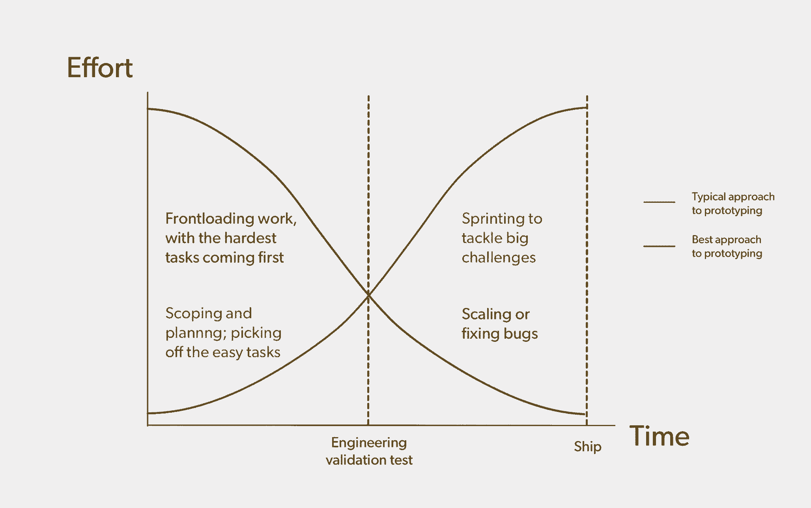
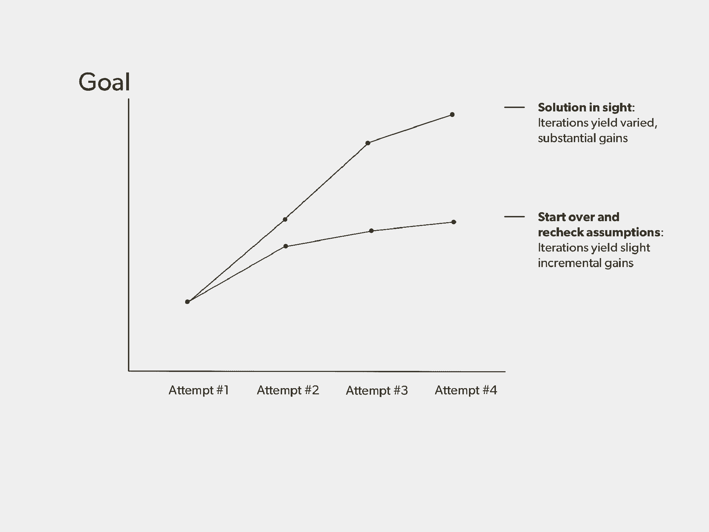

# 卓越产品原型的六个步骤:来自苹果和 Oculus 工程师的教训

> 原文：<https://review.firstround.com/six-steps-to-superior-product-prototyping-lessons-from-an-apple-and-oculus-engineer>

当 2014 年 **[凯特琳·卡林诺夫斯基](https://www.linkedin.com/in/ckalinowski "null")** 加入  **[Oculus](https://www.oculus.com/ "null")** 担任产品设计工程负责人时，她的团队正在为一项挑战而努力:设计将与备受期待的 [Oculus Rift](https://en.wikipedia.org/wiki/Oculus_Rift "null") 虚拟现实耳机配对的控制器。当时，虚拟现实在很大程度上是一个未知的领域，硬件应该看起来或感觉起来是什么样的几乎没有先例。与由 Oculus 工业设计负责人 [Peter Bristol](https://www.linkedin.com/in/peterbristol "null") 领导的设计师合作，Kalinowski 的团队开始权衡将决定产品最终感觉的各种因素。例如，他们想要从女性的第五个百分位数到男性的第九十五个百分位数的宽范围的手形和大小，以便能够舒适地握住[触摸](https://www.oculus.com/rift/ "null")控制器。手必须抓住它，而不干扰红外发光二极管和外部传感器之间的连接。每个新参数都使另一个变得复杂:总重量、按钮数量、控制器上的带子、形状等等。

这就是奇迹发生的地方。团队反复迭代。有些原型太丑了，简直就是一根粘着油灰的塑料管。但最终，他们创造了一个环形控制器，用户可以在游戏中张开和合拢她的手，拇指棒上的传感器允许用户竖起大拇指。更不可思议的是，他们已经迭代了足够多的次数，以至于到了工程验证测试，或者说 [EVT](https://en.wikipedia.org/wiki/Engineering_validation_test "null") 的时候，控制器的物理比例近乎完美。只需要调整外环的直径。

Kalinowski 是原型开发过程的大师，他深刻理解从第一次迭代到最后一次迭代，应该在哪里、何时以及如何进行变更。这让她成为硅谷非常受欢迎的工程师。在 Oculus 工作之前，她是苹果 MacBook Air 和 Mac Pro 的技术负责人。她还领导并销售了脸书的蓝牙信标，该信标为用户提供基于位置的提示。

在这次独家采访中，Kalinowski 讨论了在开始构建原型之前，你必须如何以及为什么定义你的不可协商性。她深入探讨了从过程中挤出最多迭代和改进的具体方法——毕竟，迭代越多，产品越好。Kalinowski 还列出了这个过程的三个熊市中的两个的警告信号:原型制作过程花费太长时间，也有结束太快的。Kalinowski 详细说明了刚刚好的场景是什么样的，并列出了在你点击“船舶”按钮之前要注意的坑洞。这些见解适用于每一个产品开发的情况，无论你是在硬件还是其他方面。让我们开始吧。

# 声明你的不可协商性

在你开始构建你的产品之前，有那么一个时刻，截止日期还没有设定，利益相关者很有耐心，客户也没有吵闹。利用这一时刻弄清楚哪些目标是你不会屈服或让步的。“在开始设计工作之前，决定你的产品在发货之前必须做什么。新公司往往压力很大。他们并不总是在产品流程的开始就明确定义他们的不可协商性。我经常看到这个错误。不幸的是，他们可能会陷入困境，被迫在没有首先达到这些关键基准的情况下提前发货，”Kalinowski 说。”**先选择必备品。**如果你真的被逼到了墙角，而且你还没有完全遇到他们，无论如何，出货都是很有诱惑力的。相反，从“产品必须做这三件事”开始。很高兴接下来的两件事。奖金是这些其他的东西。作为一个团队，你必须同意，如果你没有达到那些必须拥有的，你就不会出货。"

找到你必须拥有的东西通常意味着将产品最关键的元素浓缩成一两个关键特征。在 iPad 的例子中，产品必须足够轻，顾客可以很容易地拿起来。“苹果在 iPad 上工作了多年。史蒂夫·乔布斯总是说它太重了。他们把它变成了 iPhone，工作了很多年，推出了 iPhone，回到了 iPad，工作了很多年，最后推出了 iPad。如果他们没有 iPad 的指导原则，可能就不会有 iPhone 了。他们没有发运早期的 iPad 原型，因为它们太重了。你的手太累了。Kalinowski 说:“坚持开发需要很多很多的训练，直到你找到你的关键特性。“关注产品和消费者体验。在 Oculus Rift 上，如果你没有体验到“在场”，或者你实际上在你的虚拟环境中的感觉，我们就不会发货。如果 Oculus Rift 不能舒适地适应各种成人面孔，我们就不会发货。一开始就决定，为了交付这些关键特性，你必须达到什么目标？只要你实现了这些产品目标，你就可以讨论其他问题，比如次要功能，以及你是否会发货或推迟你的计划。与整个组织分享这些必备的东西。让每个人都参与进来，不要讨价还价，这样你们才能朝着同一个目标前进。”

它是北极星，因为它指路。在产品开发中，这是你的一个关键产品特性。不要动摇。

无论如何，**始终为消费者体验而解决。**“作为一名设计师和工程师，我不断努力为客户着想，根据我们在产品层面做出的决策，产品会变得更好还是更差。这就是你如何确定你的北极星。当我在考虑产品和功能的取舍时，我真正考虑的是客户。我问自己，这种变化会在实质上影响他们使用该产品的体验吗？”卡利诺夫斯基说。“这就是我们在 Oculus 如此关注人体工程学和重量的原因。它们影响软件体验和客户的存在感。如果你能把设备戴得更久，你就能沉浸其中，玩游戏的时间更长，体验更流畅的社交 VR。从我们使用的面料到设备的重量，消费者体验的考量体现在每一个决定中。”

# 滑入原型设计计划

**通过在速度警告滑块上确定你的点来规划你的原型制作方法。**一端是谨慎，另一端是速度。你倾向于哪种方式取决于你的公司、你想要完成的目标以及你在发展周期中的位置。“如果你受时间表的驱使，试图在市场上击败竞争对手，那就不要小心谨慎。如果你生产的是小批量的产品，你可以不小心。例如，生产 10 万件产品和生产 200 万件产品会改变你的风险承受能力。Kalinowski 说:“你不可能像解决几十万件产品的设计问题那样，解决掉两百万件产品的设计问题。“如果我在苹果公司开发 MacBook Air，我会对风险更加谨慎，因为这是一款巨大的高产量产品。从错误中恢复是昂贵的。如果我在设计第一款虚拟现实产品，我会少一些谨慎，多一些雄心，因为我的体积足够可控，我可以在飞行中解决问题。我会试着动作快点。有一个速度警告滑块，你必须明白你在哪里，以便掌握你的权衡。如果我正在制造一个医疗产品，我的警告滑块通常会一直在最左边，因为它们通常需要更长的时间来开发和实现合规性。这归结为与你正在制造的产品相关的风险，以及为了更快上市，你愿意牺牲多少开发时间。”

The speed-caution slider

你对团队的管理也应该随之改变。“如果你非常谨慎，鼓励对所有假设进行检查和反复检查。对团队说，‘互相对抗。’问‘这是真的吗？电池有足够的膨胀空间吗？该零件的火焰等级正确吗？你确定吗？我们测试过吗？我们是否已将零件发送给第三方并进行验证？产品运行三个月后，我们是否会重新验证制造商没有改变我们的材料以降低成本？"卡里诺斯基说。"当速度是最重要的考虑因素时，只需担心最关键的问题。在这种情况下，我会给我的员工一张纸，并对他们说，“按顺序列出你所担心的所有设计问题。”然后，我在他们的前五页下面撕开这一页，把这一页的上半部分交还给他们，并对他们说，‘就把重点放在这些上面吧。’’”

# 原型制作的六步方法

一旦你找到了你在速度警告滑块上的位置，你就可以开始制作原型了。你唯一的目标？在发货日期前尽可能多地迭代。Kalinowski 阐述了她构建强大原型的六步方法，以及如何设计一个尽可能适合多迭代周期的过程。

Kalinowski's recommended approach to prototyping, compared with most typical approaches

**首先，前装。**在旅程开始的时候，就投入精力，集中注意力。“我以前的同事[道格·菲尔德](https://www.linkedin.com/in/dougfield "null")，他是苹果公司的副总裁，现在在特斯拉负责工程，他有一个非常有用的关于如何思考设计工作的图表。随着产品的开发，大多数人会增加他们的努力和关注，他们会发现需要修复或解决的问题，在你发货之前达到顶峰。虽然这有时是不可避免的，但这不是你想做的。Kalinowski 说:“在开发结束时做出改变比开始时要困难、危险和昂贵得多。“通过 EVT[工程验证测试]，你的目标基本上可以实现。通常这很难实现，但这是一个很好的目标。如果你必须在 EVT 之后解决主要的设计问题，你的努力将会有递减的回报。理想情况下，EVT 之后的阶段是硬件的扩展操作或软件的错误修复。在这一点之后，你不会有太多能力在不造成风险的情况下做出大的改变。将您的努力集中在开始，在那里您可以尽可能多地进行迭代和变更。在这里完成大量的工作。派最优秀的人去做。在这里做你所有的研磨。”

迭代越多，产品越好。迭代次数越少，情况就越糟糕。就这么简单。

**从最难的开始。用你的原型一次做一件事，从最棘手的挑战开始。“首先重复最重要、最困难的事情。这看起来真的很简单，但人们往往不会真的去做。看待产品开发的最佳方式是说，“我想把最多的时间花在最难的事情上，并在我进行的过程中开始逐步增加较容易的事情。”通常很容易识别最难的东西。你在做什么别人没做过的事？这是你甚至都不确定自己能做的事情。**这就是你要集中最初的原型能量的地方，“Kalinowski。”动力不是问题。如果你找一个典型的工程师，给他们看一个问题，然后说，‘我不知道这是否可能’，他们通常都会全力以赴。这个原则可以确保你通过把最困难、最耗时的问题放在第一位来进行前期工作，同时通过给你的工程师一个实质性的问题来激励他们。"

随着你的进步，编织其他坚硬的东西。“当你在做原型时，你不需要一次做所有的事情。你只需要把最难的东西的最难的部分做成原型。其余的可能是丑陋和无用的。然后随着你的迭代，画出下一个最难的东西和下一个最难的东西，并将这些方面整合到你的原型中——或者将它们放在一个单独的原型中，然后将它们叉在一起，”Kalinowski 说。“从原型制作中最难的部分开始。对于 Oculus Touch，团队从一个大致的形状开始，一旦接近，就转移到输入周围的细节，将电子内部和传感器分成一组独立的原型。一旦我们充分理解了空间限制，我们就在第一次集成构建中将两个原型编织在一起，证明一切都可以适应。”

**制造极其丑陋的原型。**不，真的，你早期的迭代应该是可怕的。“你首先关注最棘手的工程问题。你还不需要担心它看起来怎么样。但是还有一个隐藏的好处。当一个东西很丑的时候，人们不会爱上它。尤其是对公司内部有影响力的人，如果你给他们看一些有形的东西，他们看到了，他们就会锁定它，”Kalinowski 说。“这种情况实际上在价格方面也经常发生。我们公司有一个内部笑话，因为通常情况下，你会把一个非常早期的产品价格估计放在幻灯片上，然后说，“可能是这个。”接下来的一年，每个人都会说，‘哦，要花这么多钱。不要！**在你完全准备好之前，不要给人们任何可以依靠的东西。人们会这样做，这对过程是有害的。当你卖东西的时候，加点油。保护产品潜力的一个策略是让你的原型和早期想法保持丑陋更久。"**

让每个团队拥有自己的最佳方案。在开发苹果公司的圆柱形电脑 [Mac Pro](https://en.wikipedia.org/wiki/Mac_Pro "null") 时，Kalinowski 不得不权衡众多因素。“工业设计团队希望设备的直径非常小。但这意味着[散热器](https://en.wikipedia.org/wiki/Heat_sink "null")的直径很小——这是个问题，因为我们想要尽可能多的热传递。当散热器很小的时候，需要吸入更多的空气来冷却中央处理器( [CPU](https://en.wikipedia.org/wiki/Central_processing_unit "null") )，使得它的声音更大。然而，我们仍然需要计算机保持安静，”Kalinowski 说。“解决这个问题的方法是让每个团队完全拥有自己的最佳方案。苹果内部有不同的团队专注于优化小直径，专注于降低噪音，担心热传递——我们只是让每个人都拥有这一点，并尽可能努力实现他们的目标。对于散热团队来说，由于这是一台高性能的机器，我们需要尽可能解锁 CPU 性能，因此我们让他们为此而战。然后，音频团队确保风扇噪音不会超过某个阈值。让每个人都致力于他们所负责的功能的最佳结果，你很可能最终做出最佳的产品权衡——这意味着更好的产品。”

在合并最佳方案的同时，使谈判顺利进行。一旦每个团队都提出了他们的理想解决方案，你就必须开始做出权衡——例如，为了让电脑更安静，可能需要调整散热器。“我从来不会在没有预先考虑结果的情况下参加将要做出重大决定的会议。我首先做一个利益相关者分析，去每个团队，让每个人都批准我的提议。我在苹果学到的是，你真的必须四处走动，向每个团队解释你认为正确的事情。例如，如果你没有产品团队对产品决策的认同，你真的不会从会议中得到任何东西。Kalinowski 说:“做大量的前期谈判，这样会议就只是敲定决定并锁定它们。“你还必须了解技术权衡。你不能只是走进一个天线团队，然后说，‘我们不能把天线放在那里。你必须把它们放在这里，并且不明白这是否有用。做一次倾听之旅，从技术角度了解产品权衡。理解为什么一个团队想要某样东西。与团队中的专家建立关系，倾听他们的意见，相信他们，但同时也要以不同的方式推动他们，因为你正试图就这一特性进行谈判。”

建造丑陋的原型。它会阻止人们爱上没有完全成熟的想法。

# 原型的三只熊

当你执行上述方法时，熟悉一下原型制作过程的三个要点:你可以做得太久，也可以做得不够久——但也要恰到好处。下面，Kalinowski 详细介绍了前两者的警告标志，当你在正确的轨道上时会亮起。

**原型制作时间过长。**当迭代开始产生微小的、增量的改进，并且没有朝着你的目标收敛时，你可以感觉到你在错误的轨道上。“如果你对一个问题的第一次、第二次、第三次和第四次尝试的结果非常接近，而你仍然远离你的目标，这意味着你做了错误的假设。你一直在做改变，但你无法实现。每次迭代时，你将不再以显著的方式接近你的目标。在这一点上，你完全弄错了。要么改变你的目标，要么改变你的假设。放弃这个计划。Kalinowski 说:“回到起点，找到一种不同的方法来解决这个问题。

“工程团队通常会永远在一条路径上迭代，永远达不到他们的目标。当你处于一个产品周期，你想出货时，你很难倒退。如果你等得太久，那是最糟糕的。它太贵了，有时你甚至无法回到起点，”Kalinowski 说，“对于 Mac Pro，我们努力让[挤压](https://en.wikipedia.org/wiki/Extrusion "null")正确。两个组件，[散热器](https://en.wikipedia.org/wiki/Heat_sink "null")和内部外壳，本应由一块铝制成。但是太难了。我们最终把它切成了两块，尽管工业设计团队真的希望它是一块。我们走了这么远，试图让它成为一个整体，但最终，它没有工作。这时，马特·凯斯博尔特发出了停止的命令。因为他有那种感觉。我们不可能及时到达那里。我们都想让工业设计师在苹果公司开心，但在某个时候，如果你不收敛，你需要做出决定。他们打了这个电话。这是正确的。”

How to tell if you're converging on the right solution in your prototyping process

原型制作时间太短。同样的，你也可以感觉到你迭代的时间还不够长。“你的工程师会太担心的。你会问他们‘你觉得怎么样？“这将如何解决？”他们会说，‘我觉得很不舒服。不知道这样行不行。有时候，他们[不想告诉你。](http://firstround.com/review/the-principles-of-quantum-team-management/ "null")你必须真正提出正确的问题，比如“你认为我们在哪些方面可以做得更好？”他们会变得很不安。这通常是一个很大的警告信号，他们觉得你走得太快了。问‘你担心什么？你现在担心什么？答案是黄金。“这太有价值了，”卡利诺夫斯基说。**仅仅因为你没有听说并不意味着一切都好。你可以通过改善你的反应来鼓励人们告诉你坏消息。如果你不高兴或拒绝他们，他们就不会再告诉你了。他们为什么要这么做？更糟糕的是，一名工程师直接表达了他的担忧，而你的回答是，“好的，谢谢。”如果你什么都不做，他们不会信任你。你必须像这样，'哦。妈的。这是个问题。你认为我们应该做什么？告诉他们，‘非常感谢，这真的很有帮助。告诉我更多。我想修好它。一定要为此做点什么。这通常意味着联系人们或召开会议，让他们知道你会尽一切努力支持你的团队解决问题。重要的是，这对您的供应商来说是双倍的。"**

**制作原型的时间恰到好处。**产品从来都不是完美的，但在某些时候你不得不叫停。“我们总是可以做更多的迭代，工程师总是会担心一些事情，因为这是他们的工作。你的工程师永远不会觉得产品已经完成。通常团队领导可以接受一些小问题，但是工程师们会很纠结。我的策略是说我们会在后续产品中把它做好。让工程师知道你在乎。你想把它做好。但这种产品需要走出去，”Kalinowski 说。“他们仍然可以做所有这些很酷的工程。他们仍然会解决这个他们不满意的问题。每个工程师都有这样的感觉，“伙计，我希望我做的不一样。这不是我想要的地方。太好了。修复它，但您不必在此产品中立即修复它。你可以在下一个产品和下一个产品中修复它，并确保它永远是好的。那很有帮助。列出你不打算解决的问题。这并不意味着你永远不会处理它。下次修好它。最糟糕的情况是，当你在销售日期前构建一批产品时，你可以在爬坡之后进行修复，或者迭代非构建。"

如果在每一次迭代中，你的改进越来越小，这是一个警告信号，表明你在上面花了太多时间。

# 开始发射

在“恰到好处”的情况下，你必须在适当的时候打电话停止工程。这个时间很可能会更早而不是更晚。“由于所有的相互依赖性，在接近发布日期时结束迭代是非常危险的。准备好争取不解决问题，除非它们是不可协商的。例如，您可以在发货日期前几周决定更改物料。然后你会发现材料的变化意味着产品不再防水，或者它没有通过[跌落测试](https://en.wikipedia.org/wiki/Drop_test "null")，”Kalinowski 说。“你可以搞砸一些你自己都不知道的事情。我在不成熟的公司身上看到的很多情况是，他们试图做出改变，直到最后，最终给自己带来的问题比他们解决的问题还要多。那些小小的变化可能会毁了整个事情。”

# 重复你的成功之路

从确定北极星开始你的原型制作过程。写下你必须拥有的东西，在实现之前不要发货。确定你在速度警告滑块上的位置，从最困难、最棘手的问题开始，优化尽可能多的迭代。提前完成你的工作。制造难看的原型，并根据工程难度增加额外的功能。注意原型制作时间过长或者原型制作时间不够长的警告信号。通过评估你仍然想要解决的缺陷来决定你的停止点。你越晚做出改变，你的决定就越危险。愿意为不做修正而奋斗。

“看看你们工程师的桌子。它们是否散落着丑陋的原型？如果是这样的话，你就做对了。工程师们经常说，他们头脑中已经有了某样东西如何工作的想法。索要零件。要求展示。它经常不像他们认为的那样起作用。推动人们更快地完成原型制作。然后是趋同。你所有的原型应该允许你收敛，合并越来越多的迭代和版本。如果他们不这样做，你可能不会问关于你的原型的正确问题，”Kalinowski 说。“最后——这一点很重要——原型制作应该非常有趣。如果不好玩，那就是你做错了。如果你过度约束你的工程师，而他们无法提出真正酷的解决方案，或者他们提出了，而你却压制了他们，那就糟了。解放你的工程师们，让他们想出新的东西——应该有很多很酷的想法。在你开香槟庆祝成功后，你可以从你的裁剪室地板上拿起下一个伟大的产品。”

Christophe Wu 摄影。