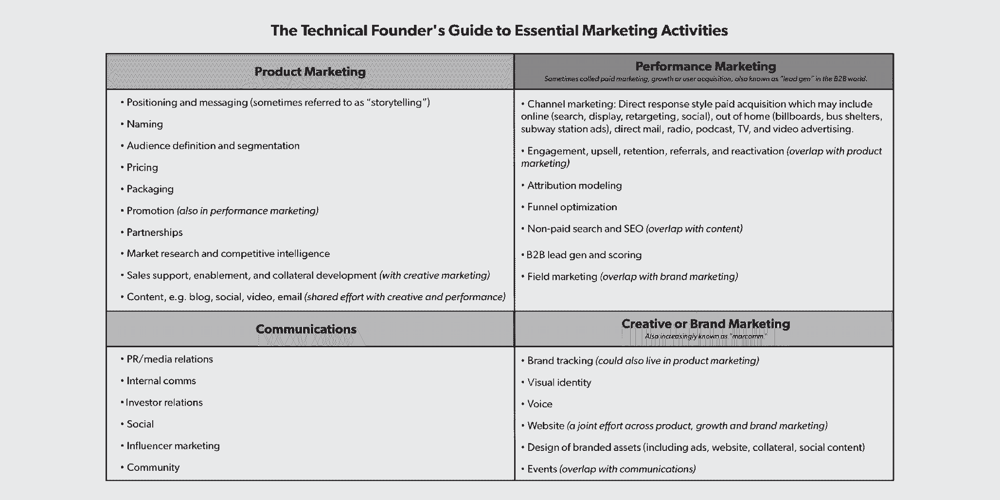

# 所以你认为你已经准备好雇佣营销人员了？先看这个。第一轮评审

> 原文：<https://review.firstround.com/so-you-think-youre-ready-to-hire-a-marketer-read-this-first>

在谷歌、 [Square](https://squareup.com/us/en "null") 和 [Cover](http://blog.coverscreen.com/post/81998756366/cover-is-joining-twitter "null") 、**等公司做了十几年的营销人员后，艾瑞尔·杰克森** 在她的营销工具包中收集了一系列经过测试的策略和基本建议。幸运的是，对于这篇评论的读者来说，她不怕分享商品，无论是简单而强大的定位框架还是重要的品牌建设练习。

作为 First Round 的常驻营销专家，杰克逊直接与早期创始人合作开展广泛的营销项目，从塑造他们如何谈论自己的产品到精心制定有效的发布战略。但随着她的工作会议和交付成果开始堆积，同一个问题最终出现了:*创业公司是时候雇佣自己的全职营销人员了吗？*

即使在进行了比她愿意承认的更多的第一次营销招聘谈话后，杰克逊仍然发现自己对他们如此迅速地偏离轨道感到惊讶。

“我听到创始人说，‘我需要雇一个营销人员来处理我们两周内的发布会。’我读过的职位描述包括从运营社交媒体到主导定价的所有内容，所有这些都包含在一个角色中。杰克逊说:“很多人告诉我，他们正在寻找一名副总裁，当我指出这样的人对于他们需要做的工作来说可能太资深了，他们开始谈论聘用一名实习生。

当她引导这些讨论达到设定的期望值，并帮助更多的技术创业者找到适合他们创业的营销人员时，杰克逊发现她经常重复同样的建议——以至于她在 Gmail 中设置了一个固定的回复——并认为其他人在寻找这个重要角色时可以从类似的指导中受益。

在这次独家采访中，杰克逊为早期创业者提供了一个抓住第一个营销人员的剧本，分享了避开常见时机陷阱的策略，以及更周到地处理招聘过程。她提供了一门关于营销基本要素的速成课程，帮助创始人弄清楚他们需要什么样的营销人员，以及五种候选人简介和有用的审查策略，供招聘过程的后期使用。

# 时间和原因:获得正确的时间(和基本原理)

添加营销人员的合适时机取决于[你的上市策略是营销密集型还是销售密集型](https://firstround.com/review/leslies-compass-a-framework-for-go-to-market-strategy/?utm_content=ShareQuote&utm_medium=social&utm_source=twitter "null")。“如果你试图创建一个消费者品牌，或者你的主要转化途径是一个营销驱动的事件——有机的、付费的、公关的、内容的，等等——那么在你达到 10 人左右的时候，尽快引入营销人员是有意义的，”她说。

这与企业级 SaaS 产品不同。“通常情况下，你会希望先建立一个可重复的销售模式，然后再进行营销，使故事变得生动，并开始使用新的渠道来推动销售，”Jackson 说。“通常与此同时，你已经巩固了走向市场的动议，并开始寻找一位销售主管来接替创始人。”

为了进一步调整时机，在开始寻找营销人员之前，初创公司应该依靠这些指导性问题*:*

# 作为创始人，你是否有多种营销挑战无法很好解决？

首先，考虑是否有足够多的营销问题需要解决——以及*而不是*雇人是否真的是更好的举措。"**创始人对于** ***为什么*** **他们需要一个营销人员**。他们通常会说，这是因为他们想要“成长”，或者是因为董事会成员或投资者的推荐。这可能是下意识的反应，”杰克逊说。"你需要考虑清楚这次招聘要解决的实际问题。"

另一个考虑因素是，这些营销挑战是否值得全职帮助。一般来说，如果你有一个分散的营销活动或一个范围明确的项目，雇佣一个自由职业者或代理机构更有意义，无论是运行在线广告测试还是像[提出公司名称](https://firstround.com/review/this-is-how-you-design-a-lasting-brand-an-inside-look-at-gustos-reinvention/ "null")这样的基本事情。“有些创始人完全习惯于命名，或者他们偶然发现了一个名字，这很好。杰克逊说:“如果你真的需要帮助，你不必像这样为一次性活动雇人，因为专家可以在项目的基础上参与进来。“是的，一家命名公司可能需要 25，000 美元，但这比雇佣一名全职营销人员更便宜，也更划算。”

但是请留意这些项目是如何开始激增的。她说:“管理所有这些自由职业者可能会耗费大量时间，而且可能会接近或超过一些人在内部为你处理的工资。”“此外，你不希望你的营销工作看起来不协调，因为你与五个不同的自由职业者一起工作，他们彼此不说话。”

# 市场营销会在你的产品上市成功中发挥重要作用吗？

无论[发布会是史诗般的](https://firstround.com/review/From-0-to-1B-Slacks-Founder-Shares-Their-Epic-Launch-Strategy/ "null")还是低调的，都有[发布新产品的最佳实践](https://firstround.com/review/the-simple-rules-that-could-transform-how-you-launch-your-product/ "null")，早期团队需要找出营销如何融入等式。

“制造实体产品的公司应该更早地开始考虑这个问题，尤其是如果你正在处理的硬件价格较高，并且在发布前需要分销合作、包装、定价等，”杰克逊说。“专注于把产品做好的创始人没有足够的带宽来管理自己的营销工作。”

作为在发布前让营销人员参与进来的一个主要例子，杰克逊提到了她建议的公司之一 Rylo。“当我在帮助他们传递最初的信息时，我写下了发布前需要做的所有事情的完整列表，当我把它交给创始人时，他们就像这样，“哦，妈的，你是对的。她说:“我们必须尽快雇人。

如果你的消费类硬件产品将在一个月后推出，你昨天就需要一名营销人员。如果你有一家销售驱动的创业公司，那么在雇佣任何人之前，先花时间打好进入市场的基础。

# 你的员工预算和你的营销预算一致吗？

请记住，雇佣一名营销人员不仅仅是员工人数，还包括整体营销预算。确保你计划的营销支出符合候选人的期望是至关重要的。“如果有人习惯于管理一个 15 人的团队和 5000 万美元的营销预算，而你的初创公司没有团队和预算，这充其量是一个硬推销，在最坏的情况下是一个灾难，”杰克逊说。

特别是在付费营销领域，杰克逊鼓励创始人确保他们的钱用得其所。“当一位创始人告诉我，他们想雇人管理价值 1 万美元的脸书广告时，我拒绝了。你要承担全职员工的费用，只是为了花 10，000 美元做几次测试？**想想你的工作收入和非工作收入。她说:“这没有任何意义。一个更好的招聘案例？利用从这些广告测试中获得的早期经验，尝试三到五种其他渠道，如直邮广告和播客广告，并且有足够的预算。**

杰克逊很快指出，小预算并不一定排除聘请全职营销人员的可能性。如果营销工作将围绕内容或 T2 社区展开，那么在你有很多钱可花之前就雇佣员工是有意义的。她以[的不完美产品](https://www.imperfectproduce.com/ "null")为例。

“我没有和他们合作过，我只是一个客户，但他们似乎很早就有了营销人员，在网站上工作，运营他们的社交渠道，参与当地社区活动。这和我在 Gmail 工作时的情况很相似，”杰克逊说。“在我们开放注册后，我们的广告预算非常少。我们专注于吸引高级用户，为博客写作，并与其他谷歌产品进行交叉推广。这些努力需要时间和技巧，但它们不像付费营销那样需要大量预算。”

# 你愿意花时间去寻找合适的人吗？

杰克逊说:“以我的经验来看，除非你找到了一个已经建立了牢固关系的朋友或前同事，否则在初创公司雇佣第一个营销人员大约需要三到六个月的时间。“并不是每个人都考虑到了这一点——我在 11 月份遇到过一些创始人说，他们希望在年底前开始全职营销，这太疯狂了。如果你的营销需求真的那么紧迫，那么找一个自由职业者或中介机构作为权宜之计可能是一条更好的途径。”

# 什么:通过揭示营销人员实际上在做什么来结束对独角兽的搜索

下一步是阐明第一个戴上营销帽子的人会在你的创业中做什么。

“当有人告诉我他们想招聘营销人员时，我总是会问他们，‘你希望他们做什么？’杰克逊说:“很多时候，答案是‘呃，我真的不知道。结果并不是那么好。如果你雇佣了一个非常擅长有偿收购的人，但你真正需要的是品牌战略，那该怎么办？"

很多时候，一家初创公司的第一次营销招聘以失败告终，因为他不是合适的营销人员。你不会雇佣一个专门负责扩展系统的后端工程师来为你构建一个漂亮的前端 UI，所以不要在营销中犯这样的错误。

从[寻找合适的公关公司](https://firstround.com/review/Heres-What-I-Learned-from-Working-with-50-PR-Firms/ "null")和[塑造一个故事](https://firstround.com/review/The-Seven-Deadly-Sins-of-Startup-Storytelling/ "null")到投资[产品营销](https://firstround.com/review/classpass-cmo-on-how-and-when-to-invest-in-product-marketing/ "null")、[制定定价策略](https://firstround.com/review/the-price-is-right-essential-tips-for-nailing-your-pricing-strategy/ "null")和[微调增长漏斗](https://firstround.com/review/answers-to-your-tough-questions-about-growth-learned-while-scaling-eventbrites-5b-growth-engine/ "null")，第一营销人员可能会承担很多工作——但对这一事实没有太多的了解。

“营销人员非常不擅长‘营销’营销，”杰克逊说。“部分问题在于，营销是一个超级广阔的领域，涵盖了如此多不同种类的活动，以至于我们的日常工作可能完全不同。”

**为了提供一个快速速成班，帮助创始人专注于他们的初创企业需要的特定口味，杰克逊将基本营销工作分为四大类(注意重叠的领域):**

杰克逊说:“看到这份清单的创始人可能会意识到他们已经注意到的、可能没有考虑到的营销任务:定义你服务的受众，给潜在客户写一封关于你的产品的电子邮件，聘请设计师制作你的标志，接近合作伙伴。”

但是，即使对市场营销可能覆盖的广阔领域有所了解，但在决定从这份营销菜单上订购什么时，创始人仍有可能落入其他陷阱。

**以下是杰克逊关于发现和避免三种常见错误的建议:**

# 错误 1:寻找独角兽。

“很多时候，当我看一个创始人最初的营销工作描述时，它几乎是一个活动清单上所有事情的清单。我知道很少很少有人在所有这些方面都很强，”杰克逊说。

大多数对该领域并不陌生的营销人员擅长所谓的“软”或“硬”营销，更关注品牌和沟通或增长、分析和渠道优化。“即使是 CMO 级别的候选人通常也更倾向于一个方向，”她说。“我不确定这种将所有功能集于一身的愿望从何而来——你不会期望一名工程师在前端和后端都很出色，但不幸的是，这种期望存在于营销人员中。”

在产品、性能、创意和沟通方面同样精通的营销人才是难得一见的。如果你找到了，很好。但更有可能的是，你需要精简你的工作描述，并开始分清主次。

这就是为什么无情的优先排序是精心制作一份吸引合适的营销人员的工作描述的关键。

“仔细思考职位描述的一个强制功能是‘如果你不得不选择’游戏。“是的，如果你能找到一个真正无所不能的人，你会更有力量，”杰克逊说。“但让我们假设你不能。如果你必须优先考虑一个营销领域，你会如何排列？和 **他们不可能都同等重要** **因为那几乎永远不会是真的。**记住，第一个营销人员总是可以通过最终聘用人员(无论职位高低)以及与外部机构或顾问合作来补充他们在其他领域的技能。”

为了控制营销职位描述，杰克逊建议深入挖掘初创公司需要什么，以及如何设计。“例如，当我与阿尔玛一起工作时，创造性的一面变得更加重要。她说:“这并不意味着其他领域不重要——我们需要会使用电子表格或知道如何运营 Instagram 广告的人。”“但这些技能对于真正重要的东西来说是次要的，真正重要的是讲故事的能力、与设计师合作的经验以及写作能力。”

*对于那些想为自己写一份招聘启事的创始人来说，可以从 Alma* *(一家首轮融资公司)的第一份营销招聘中获得灵感。*

# 错误 2:本末倒置。

杰克逊经常看到的另一个问题是职位描述本末倒置，过早地关注错误的具体职责。“很多时候你认为你需要一些东西，但你真的需要它之前的东西，”杰克逊说。

“如果你说你想要公关，但不能回答你想要的理想标题是什么，什么样的记者会有兴趣讲述你的故事，那么你就不会得到媒体的关注，”她说。“这是因为你还不需要精通媒体关系的人，你需要先进行定位、信息传递和产品营销，这意味着你需要不同类型的营销人员来帮助你在开始与记者交谈之前奠定基础。”

# 错误 3:设置错误的资历级别。

在建议创始人如何决定在职位描述中记下多少年时，杰克逊经常会遇到她之前提到的副总裁与实习生的争论。

“在这两个极端之间有一个选择，”她说。“创始人倾向于雇佣真正资深的人。但初创公司的营销工作经常被搁置，这是一个副总裁级别的候选人很久没有去过的地方——比如，他们并不总是想写文案或参与建立广告活动的机制。”

如果你想知道你的第一份市场招聘是需要副总裁还是实习生，这是你没有对这个职位投入足够心思的一个信号。

在面试中，你可以感受到候选人是否具备创业所需的经验和渴望。“我面试了一位营销主管候选人，他在我最近为之提供咨询的一家初创公司有大约 20 年的经验。在这种情况下，我一定会问一些问题，比如‘你上次做 X 是什么时候？杰克逊说道。“告诉他们你需要他们做一些非常有策略的事情，然后看看他们如何回应，问一些后续问题，比如‘你觉得这样做怎么样？跟我说说你会怎么做。"

另一个标志是，如果一个更资深的候选人过于关注未来的计划，以扩大功能。杰克逊说:“还有一位候选人曾在一家相对较晚成立的公司担任营销副总裁，她在面试中花了很长时间谈论她是如何组建团队的，如果这家初创公司最终非常成功，这肯定是他们最终需要的东西，但这与他们的早期阶段无关。”。

成为初创公司的第一个营销人员并不是要马上建立一个团队——而是一个人。这是一项艰苦的工作。如果候选人是其他地方的第一个营销者，确保她仍然有兴趣从头开始。

雇佣资历太浅的营销人员也有风险。“如果求职者的简历上写着‘利用 Y 渠道推动了 XXY%的增长’，那么再深入挖掘一下，找出他们负责的是哪一部分。因为如果事实证明他们只是写了广告文案，而不知道如何实际运作一个广告活动，那么这个人可能就不是那个能为你拥有端到端渠道的人，”杰克逊说。

一般来说，杰克逊建议初创公司在首次招聘营销人员时，寻找有五到八年经验的人。她说:“毫无疑问，他们仍然会一头扎进杂草中，但他们也可能成为你最需要帮助的一两个营销领域的专家。”。“这个级别的优秀候选人将立即提升你的公司，同时他们也在发展自己的技能，并有可能在未来升至副总裁级别。如果他们最终没有做好这一步的准备，到时候你仍然可以雇佣其他人来接替他们。”

至于分配合适的头衔，杰克逊倾向于用“**营销负责人**”作为开头。“‘导演’也行。她说:“如果你过早给出副总裁的头衔，可能会有点限制。“你想要的是一个崭露头角的人，他现在不会过于执着于获得那个花哨的头衔，但知道如果在未来几年里表现出色，他们仍有机会获得它。”

Arielle Jackson, First Round's marketing Expert In Residence

# 世卫组织:帮助你找到合适的营销概况

在确定了第一个雇员将关注的营销工作的类型和水平后，早期创始人的下一个任务是找到符合要求的确切人选。为了帮助缩小与你的创业公司最匹配的范围，杰克逊根据你对你的第一个营销人员的期望，确定了一些可能很好的角色。

以下五个匿名的简介代表了她个人所了解的营销人员，并提供了一种广泛的技能和背景，可以导致一个成功的创业营销人员的气质。

# 大型科技公司转型为创业营销者

最初在微软的培训项目中担任产品营销经理

成为 Pinterest 的产品营销主管

成为一家初创公司的第二名营销人员

对杰克逊来说，在大公司的小职位上学习诀窍是在小公司晋升到大职位的好方法。“这是我适合的地方。她说:“我从谷歌开始，在那里我完成了产品营销副经理项目，然后去了 Square，然后去了一家小型创业公司。“拥有这种背景的人可能是初创公司第一个营销人员最安全的选择——他们精通技术，知道如何跨职能部门工作，并且在不同规模的公司担任过多重角色。或许最重要的是，他们理解大公司的基本原则，但在‘动手动脚’的创业环境中茁壮成长——否则他们会留在更大的公司。”

杰克逊指出，创始人应该对只在大型科技公司工作过的候选人保持警惕。她说:“你不会想要一个只对自己的领域感到舒适和熟悉的人，所以这是在面试和推荐过程中要梳理出来的东西。”

# 受过传统训练的 CPG 营销人员

开始时是联合利华的副品牌经理

在强生公司担任高级品牌战略家

加入巴塔哥尼亚，担任北美品牌总监

消费品牌、拥有实体产品的公司以及依赖零售和分销合作伙伴的初创公司可能希望直接从希望进军科技领域的消费品(CPG)公司招聘员工。

“我喜欢这种背景，”杰克逊说。“在我职业生涯的早期，作为谷歌赞助的交流项目的一部分，我在宝洁公司参加了一段时间的品牌经理助理培训。杰克逊说:“在那些日子里，我学到的基本品牌战略比我多年从事科技产品营销学到的还要多。

根据她的经验，这些候选人更倾向于品牌而不是收购导向，但他们知道如何使用自己的大脑。“当然，他们将不得不学习技术，这往往比他们去过的地方发展得更快，但如果他们对此充满热情，那么这是一个合理的赌注，”她说。

# 右手

Stripe 早期的营销助理

晋升为受薪营销经理

Gusto 的付费营销主管，向增长副总裁汇报

“我喜欢看到有人学会了为一流营销人员工作的诀窍，现在想去做他们老板的工作，”杰克逊说。

“我在 Square 认识的两位收购营销人员符合这种情况。他们中的一个人一开始是二把手，为在网飞精通该领域的优秀用户获取主管工作。当她离开后，他接替了她的角色，为他工作的那个人晋升为他的得力助手。现在，这两位前得力助手在不同的公司开展付费营销。”

# 银行家/顾问变成了营销人员

高盛投资银行分析师

工商管理硕士

麦肯锡的顾问

Airbnb 的绩效营销经理

“我不会直接从咨询业或银行业招聘一个人作为你的第一个营销人员，”杰克逊说。“寻找那些在职业生涯早期担任这些角色，然后转向科技行业的人。他们更倾向于左脑而不是右脑，所以他们可能更适合专注于营销业绩方面的角色，但这些人通常工作非常努力。”

# 代理转换

从 Oglivy Mather 的客户经理做起

在威登肯尼迪公司当了几年战略家

转入科技行业，在 Spotify 担任品牌营销经理

“代理生活为营销人员提供了很好的训练场地，因为你要为不同的客户做各种各样的项目。杰克森说:“各个机构使用非常不同的头衔，所以基本了解他们的头衔与技术营销角色的对应关系会很有帮助。

“例如，广告界所说的‘战略家’可能最接近品牌或产品营销人员。媒体买家可能会提供与付费营销人员或技术渠道营销人员类似的服务，但并不总是以直接回应为导向。”

# 如何:寻找和审查你的第一个营销人员的策略

有了明确的角色、清晰的工作描述和简介，很容易认为大部分工作已经完成了。但在这个阶段，杰克逊总是提醒创始人，还有很多事情要做。“不要贴一份工作描述，然后希望合适的候选人找到你。她说:“现在是时候依靠你的人际网络，投资购买 LinkedIn 高级订阅服务了。”

以下是她给你的其余搜索增加动力的四条建议:

**通过推荐获得具体信息。**“经常有人伸出手来问我，‘嘿，认识什么好的营销人员吗？’”杰克逊说。相反，在利用你的关系网时，要具体说明你的要求。”“你认识有直销经验的成长型营销人员吗？”是个更有针对性的问题。"

**找到那个和你不是一路人的人。**“找到完美的高级候选人，那个几乎永远不会来为你工作的人。我想看看他们的 LinkedIn 资料。然后翻翻他们之前的角色，找几年前喜欢他们的人。或者试试看能不能挖走他们的右手，”杰克逊说。

**列一个清单。从那里开始，列出你理想的候选人可能工作的公司。“例如，如果你是一个使命驱动的品牌，试图引入一个新的类别，那么就找一个类似的、更成熟的、做得好的公司。你是针对新妈妈的订阅服务吗？她说:“那么来自[诚信公司](https://www.honest.com/ "null")的营销人员可能是一个不错的人选。“如果你在寻找有专业经验的候选人，这也是一种有益的锻炼。例如，如果你是一家处于早期阶段的医疗保健初创公司，像奥斯卡健康公司或一家医疗公司可能会给你一些有希望的线索。**

**要求进行肠道检查。**在你的面试小组中加入另一种视角可以让你更好地评估营销人才。“每位创始人可能都认识他们在营销领域尊敬的人，无论他们是顾问、投资者还是朋友。杰克逊说:“他们不必面试每一个进来的候选人，但他们可以作为对你的顶级竞争者的一次内心检查或最后一次谈话。“我为其提供建议的一位创始人说‘我们喜欢这位候选人，认为她可能就是那个人。’但在与她交谈中，我发现了一些危险信号。她确实有在他们的行业中担任营销副总裁的相关经验，但她实际上并没有开发该公司的品牌——在她加入之前，大部分品牌已经存在，因为他们已经在基本面上与一家机构合作过。所以你要深入挖掘。创始人听起来印象深刻的事情可能会给营销人员敲响警钟。"

我不会信任自己去评估工程人才，那么为什么那么多技术创始人会信任自己去评估营销人才呢？在你提供一份工作之前，找一个顾问或者一个有市场背景的朋友来做一个理智的检查。

“问题的一部分是营销技能，如分析或写作，更容易获得，所以每个人都有自己的观点，无论是在广告文案上还是在特定的营销候选人身上，”杰克逊说。“Javascript 之类的东西更加二进制化。你要么知道，要么不知道，作为一名营销人员，我真的不能在这方面评价一名工程师。**在市场营销中，人们很容易陷入这样一个陷阱，即认为自己知道该寻找什么，但很多时候，创始人都招错了人，而且没有成功。**”

这些不匹配会让首席执行官更容易从整体上低估该职能的价值——这是一个在所有规模和阶段的公司中都存在的问题，因为[研究显示，首席执行官在高管层中的流动率最高](https://hbr.org/2017/07/the-trouble-with-cmos "null")。但是杰克逊更喜欢抓住机会。

她说:“对于一家处于早期阶段的初创公司，你有一个干净的石板，从一开始就为成功建立营销，避免旋转门。”“如果你能准确定位你的营销挑战，定义角色的范围，找到合适的人并对他们进行适当的审查，你就能从令人头疼的问题中解脱出来，并更快地收获营销的价值。”

*摄影由* *[邦妮·雷伊·米尔斯](http://www.bonnieraemillsphoto.com/ "null")* *。*