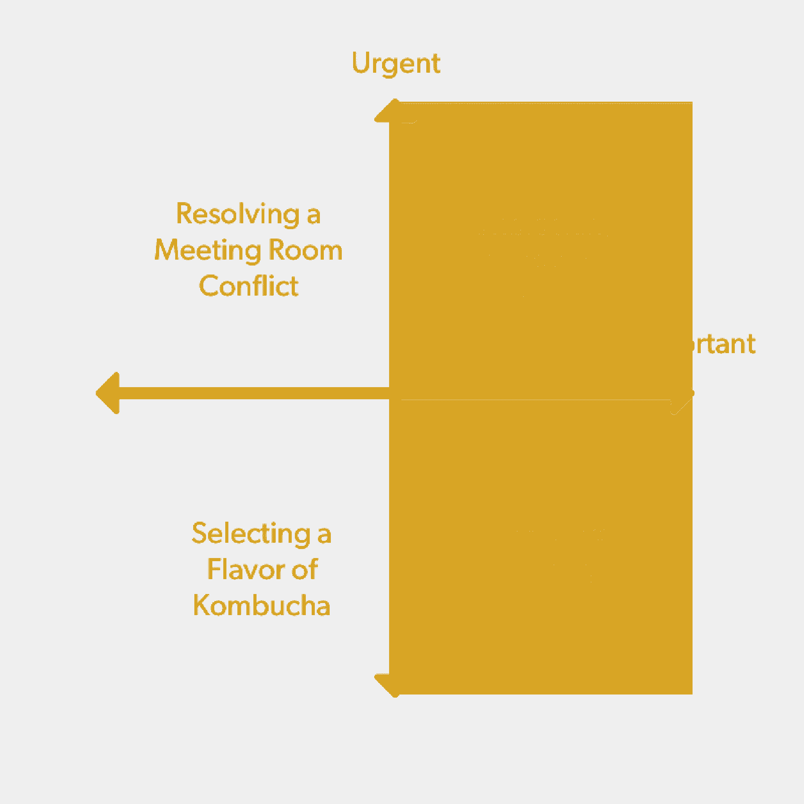

# 平方默认值使用此系统很难做出决定—以下是如何

> 原文：<https://review.firstround.com/square-defangs-difficult-decisions-with-this-system-heres-how>

十年前， **[Gokul Rajaram](https://www.linkedin.com/in/gokulrajaram1 "null")** 从根本上改变了他做决策的方式。时任 [Google AdSense](https://www.google.com/adsense/start/#?modal_active=none "null") 的产品管理总监，他正在向 Google 的 CEO [Eric Schmidt](https://en.wikipedia.org/wiki/Eric_Schmidt "null") 做演示。一个与谷歌显示广告业务相关的棘手挑战浮出水面，讨论变得激烈起来。

施密特的声音低沉，“停下。谁该为这个决定负责？”包括拉贾拉姆在内的三个人同时举起了手。“我要结束这次会议，”施密特说。“在你弄清楚主人是谁之前，我不希望你回到这个房间。三个主人意味着没有主人。”就这样，会议结束，团队解散。

十年过去了，换了三家公司，拉贾拉姆仍然回忆并提及那个时刻。现在在 **[Square](https://squareup.com/ "null")** ，他监管[鱼子酱](https://www.google.com/url?q=http://www.trycaviar.com&sa=D&ust=1451945687504000&usg=AFQjCNF2JeCrZavAhsvrFceqtuHVlsGBow "null")，该公司快速增长的餐厅外送服务。在此之前，Rajaram 在收购语义技术初创公司 [Chai Labs](https://www.crunchbase.com/organization/chailabs#/entity "null") 后，领导了脸书广告产品的战略和执行，他是该公司的联合创始人兼首席执行官。在谷歌，他在将谷歌 AdSense 打造为价值数十亿美元的产品线方面发挥了领导作用。

在他的职业生涯中，拉贾拉姆注意到许多具有前瞻性思维的公司仍然倾向于将共识作为决策的方式。事实证明，对于重要的、困难的选择，这种方法通常是无效的、不切实际的。在第一轮的最后一次首席执行官峰会上，拉贾拉姆分享了一个框架，他在 Square 和 Caviar 使用这个框架来做出最困难的决定，同时分配所有权，包容并协调所有利益相关者的执行。

一致同意意味着没有所有权。重要的不是每个人都同意，而是每个人都被听到，然后由合适的人做决定。

# 为什么困难的决策需要一个框架

拉贾拉姆使用的决策框架假设必须做出艰难的选择。对拉贾拉姆和他的同事来说，这意味着首先要认识到什么时候做决定是困难的。“这可能是一些人熟悉的图表。拉贾拉姆说:“它将决策按照重要性和紧迫性分为四个象限。“作为一个团队或组织，用你自己的描述来代替每一个象限，这样才能引起你的员工的共鸣。我最喜欢的是康普茶象限:非紧急和非重要的决定。当提醒同事考虑一个决定有多重要或紧急时，我们开玩笑地引用 Square 的康普茶量表。

这个基本图表可以帮助建立优先级的共享定义，并理想地将场景划分为大致的类别，这将有助于确定如何投入资源来做出决策。“您希望通过以下框架进行的困难选择是重要的，无论是紧急的还是不紧急的。”对于这个系统来说，正确的决策是那些至关重要的决策，它们可能会影响你的公司，甚至决定你的业务成败。这可能是在公司、集团或业务单位层面。"

对于大多数领导者来说，这种练习是本能的，但这种快速象限排序可以帮助传达这种分类，并让其他人加快手头决策的速度。“一旦你对自己选择的重要性进行了快速评估，并开始反复使用决策框架，就会有所收获。你意识到做决定不需要几天。一两个小时就能搞定。在那段时间里，你可以用这个框架快速做出高质量的选择。拉贾拉姆说:“快速做出决定意味着你可以为做出选择后的重要工作保存精力。

决策框架名为 **SPADE** ，是代表 **S** etting、**P**people、**A**alternations、 **D** ecide 和 **E** xplain 的首字母缩写，由拉贾拉姆和 Square 的同事[杰夫·科洛夫森](https://www.linkedin.com/in/jeffreykolovson "null")创建。

以下是每一步的重要性，以及如何在 Rajaram 不得不打重要电话的公司中应用。(请查看这个新的工具包 Rajaram，它的开发是为了让 SPADE 的实现变得更加容易。)

# 环境

每一个选择都需要一个语境，所以 SPADE 中的“S”代表设置。“‘设定’使你的决定具体化，并确立基调。拉贾拉姆说:“这有助于弄清楚实际决定是什么。"它把它分解成元素，并让参与决策的人行动起来."这个场景有三个部分:什么，什么时候，为什么。以下是拉贾拉姆对每个元素的描述:

**精确定义捕捉“什么”的决策你会惊讶地发现，有多少人无法准确地说出决定是什么。例如，我看到决策是以如下方式表达的:“做什么”是确定下一个要进入的国家。如果你只有一种产品，那没问题。但是，如果你有多种产品，决定不仅仅是在哪个国家推出，而是推出什么产品和在哪个国家推出。这是两个轴，而不仅仅是一个轴——如果你挖掘得更深，可能会有更多方面的决定。对你所做的选择要非常精确。"**

**日历决定**的确切时间线**实现“何时”**它不仅要反映做出选择所需的时间，还要反映为什么要花那么多时间的原因。“一定要批判性地思考‘为什么’如果有人说必须在 2015 年 10 月 15 日之前做出决定，为什么一定要这样？有关系吗？这里有一个例子:产品需要在 2015 年 11 月 15 日发布，因此我需要在 10 月 15 日之前确定名称，这样这个名称就可以在宣传材料、网站和应用程序中流动。为此我需要四周时间。这种逻辑有助于人们理解“何时”以及“何时”的“为什么”"

**从计划中解析目标，分离出“为什么**”阐明“为什么”是建立环境的关键。“为什么决定了选择的价值。它解释了你在优化什么，并揭示了为什么这个决定很重要。我是一家初创公司的顾问，这家公司的产品管理负责人和产品营销负责人大吵了一架。他们对如何给产品定价意见不一。通过工作，我们意识到冲突源于围绕定价目标的根本不一致。产品经理认为这是优化市场份额的一种方式，而产品营销人员认为这是收入最大化的一种方式。他们两人都没有阐明这一点，该公司的创始人也没有。我们一发现这是冲突的根源，就很容易做出决定。”

不知道为什么重要，怎么能做决定呢？这是一个简单、基本的问题，但我很惊讶人们总是不知道答案。

# 人

执行决策的动力是人，代表框架中的“P”。“事实是，我撒谎了。设定不是你做决定首先需要做的事情；是人。但是给一个框架命名为 PSADE 也没那么有趣，”Rajaram 说。“事实是，就像组织中的所有事情一样，人是第一位的。这包括与**协商**并为决策提供意见的人、**批准**决策的人，以及最重要的**负责**最终做出决定的人。”

参与决策的人有三个主要角色:负责人、批准人和顾问。

将问责和责任同义。一些决策框架将负责人和被负责人分开，但是**决策者**(又名**负责人**)应该是两者。“在 Square，负责制定决策的人*就是负责执行和成功的人*。我们认为责任和义务是一回事，”Rajaram 说。原因如下:想想上一次别人给你做了一个决定，但你必须执行并引导它走向成功。那是什么感觉？我猜这让你感到沮丧、无力或无所事事。我们想避免这种情况。这就是为什么决策者是负责任的。这更有成就感，也更有力量。”授权给人意味着将决策权推给负责并拥有决策权的人。

否决决策主要是因为它们的质量，而不一定是它们的结果。决策框架中的一个关键参与者是**批准人**。“批准者是可以否决决定的人。通常，批准者不会否决决策本身，而是否决决策的质量，”拉贾拉姆说。“对负责人来说，这是一种制衡的功能，以确保她没有滥用自己的特权，做出低质量的决定。否决一项决定是一种超级大国，需要非常谨慎地使用，但也不要忘记在需要时灵活运用。”

**正式认可** ***所有*** **活动参与者**的角色。第三个关键角色是决策过程，也就是顾问的角色，他扮演着一个非常重要的角色，但很多人都忘记了——提供意见和反馈。“人们没有意识到，在整个组织中，有更多的人需要被倾听。拉贾拉姆说:“顾问是决策的积极参与者。“这些人会为负责人提供意见、反馈、分析和支持，这样她就能做出高质量的决策。”

在 Square，咨询顾问因其在决策过程中的影响力和洞察力而闻名遐迩。“我记得有一个例子与工程师如何编写软件单元测试的政策变化有关。决策者是一名工程主管，他已经咨询了其他几位工程主管，并对自己的决定感到满意。然后，他给 Square 的所有工程师发了一封电子邮件，告知他们政策更新的决定。不到 30 分钟，十几个人回复了，其中许多人强烈反对这个决定。值得称赞的是，这位领导取得了所有权。他冻结了这一决定，并邀请 Square 的每一位同意或不同意这一决定的工程师在下周与他会面。我想有十几个人接受了他的建议，去了他的办公室。一周后，他通过电子邮件发出了他的新决定。你猜怎么着？这是和上次完全一样的决定。但这一次，没有人抱怨。为什么？因为他们都听到了。”

听力要紧。比你想象的要多得多。人们希望选择附和或插话，即使他们的立场与最终决定相反。他们只是想被倾听。

# 可供选择的事物

一旦你定义了场景并集合了参与者，你的下一步就是列出备选方案。“简单来说，另类就是一种世界观。负责人——决策者——的工作是不带任何偏见地提出一套可供考虑的备选方案。备选方案应该是**可行的**——它们应该是现实的；**多样**——它们不应该都是同一情况的微小变化；拉贾拉姆说:“还有**综合**——它们应该涵盖问题空间。换句话说，决策者需要列出每种选择的利弊，因为它与价值函数有关。在许多情况下，人们还可以定量地模拟每个备选方案的影响，并根据决策的设置对其进行评估，特别是为什么，优化功能。”

对于许多复杂的决策来说，最好是在一个小组环境中，与所有被咨询的人一起制定备选方案。“走进房间，登上白板，进行头脑风暴，”拉贾拉姆说。对于每一种选择，列出利弊，以及定量模型背后的参数。没有捷径可走。尽可能多地进入数字。对于模棱两可的决策，很难找到具体的数字，但这样做是非常有价值的。”

最重要的是，如果做得好，这个头脑风暴练习也将有助于产生你以前可能没有考虑过的新的选择。例如，他说，“当我们与一个重要的潜在合作伙伴进行合作讨论时，整个过程被一个特定的条款卡住了。我们需要做的决定是如何前进。我们最初有两个选择——要么继续合作，要么终止讨论。当我们聚在一起集思广益的时候，小组能够产生第三个令人信服的选择——与第三方签订合同，这将减轻我们围绕这一条款的风险——这是我们以前没有考虑过的。

“我们发现，及时、定量评估做得最好的地方是 M&A 交易。为什么？因为这是一个非常重要的决定，可能会决定公司的成败。“此外，大多数经验丰富的公司开发专业人员在评估销售、购买和合作方案以及五年或十年内给公司带来的相关经济利益方面做得非常出色。他们考虑成功的可能性、投入的资源和机会成本。”

像对待并购交易一样，运用尽职调查、衡量标准和利益相关方参与度。如果这是一个重大的决定，你实际上是在融合你的过去和现在。

Gokul Rajaram presenting at First Round CEO Summit.

# 决定

你的人评估了备选方案，利弊也与你的设置挂钩，是时候做决定了。“你选择的方式很简单。既然你已经想出了所有的替代方案，把所有的顾问人员带回房间，展示所有的东西。这包括列出备选方案，它们的优缺点，以及您运行的模型的值。然后询问他们的反馈，”拉贾拉姆说。

这个过程中最重要的部分是让他们私下把他们的投票发给你。“可以通过电子邮件、Slack 或者我最喜欢的短信——只要是私人发送的，并附有选择的替代方案和为什么选择它，”他说。“私下投票很重要，因为艰难的决定可能会有有争议的解决方案。你的目标是得到诚实的声明，而不是屈服于组织等级或同行压力的答案。征求公正的反馈和不受他人影响的投票非常重要。”

也就是说，在特殊情况下，选择是可以公开表达的。拉贾拉姆记得雪莉·桑德伯格的决策过程是如此彻底，以至于她在团队中建立了前所未有的信任度。“这始于我们选举她为决策者和所有者，这是我们做出的最明智的决定之一。然后她让我们参与每个阶段，坚持让我们参与。当她第三次把我们带到房间里时，她已经在房间里建立了如此高的信任度，以至于每个人，包括谢丽尔的行政主管，都感到完全可以畅所欲言。”

既然决策者拥有所有的选票，他们应该深思熟虑地评估信息，考虑人们的投票，然后**做出**决定。这包括选择其中一个选项，并尽可能详细地写下他们选择它的原因。“写出决定应该不会太难，因为你已经列出了利弊和公式，”拉贾拉姆说。

# 解释

框架的最后一步要求决策者解释决策。简而言之，她必须阐明为什么她选择了她所做的选择，并解释该决定的预期影响。如果决策者一做决定就记录下她的想法，这个过程就容易多了。这个阶段包括三个步骤:

**由审批人运行您的决策和流程。**同样，批准人的默认应该是监控决策过程，而不是结果。“由于决策者主导 SPADE 框架，审批者很可能没有参与其中，因此可以用全新的视角评估决策。如果你对决定负责，与批准者会面，解释决定，并获得认同。如果你创建了一个高质量的决策框架，她不太可能会否决。”

**召开承诺会**。这需要协调，但将所有参与决策的顾问召集在一起也很重要。预订一个会议室或线路，包括迄今为止的所有参与者。然后引导他们做决定。“现在是你解释决策并真正掌握决策权的时候了。可能会有抱怨或分歧，但这是你明确成为决定的主人的时刻，”拉贾拉姆说。

召开承诺会议。做出决定后，最重要的是每个人——不管是支持还是反对结果——都要在会议上大声承诺支持。“在房间里走一圈，要求他们每个人一次支持一个决定，”他说。“承诺会议真的很重要，因为当你在同事面前承诺支持一项决定时，你就更有可能支持它。作为决策者，你负责执行决策，因此你需要他们的支持来帮助你前进。”

决定做出后，每个参与者都必须大声承诺支持。大声承诺支持将你与更大的利益捆绑在一起。

**流传千古**。既然决定已经做出，真正的工作就开始了。“在承诺会议之后，你需要弄清楚下一步将如何授权和执行，”Rajaram 说。“决策者必须在一页纸的文件中总结决策背后的黑桃。这份简报应该由决策者通过电子邮件发送给公司的其他人或尽可能广泛的受众。为什么？因为公司需要了解决策的内容和方式。”

Square 使用电子邮件别名(notes@)向公司发送各种决策和会议记录。“过去几年，我们开始向公司发送 SPADE 摘要，”他说。“看到越来越多的决策使用这一框架做出，并发送给公司，这真是令人欣慰。员工开始记录整个组织内关于重要主题的高质量决策。这就是鼓励更多人面对困难决定并分享他们如何做出决定的方式。”

# 振作起来

SPADE 决策框架可以帮助同步*和*加速协作以做出困难的选择。虽然该系统概述了一步一步的过程，拉贾拉姆强调了几个关键的要点。第一，不要用共识；协议并不等同于所有权。第二，明确‘为什么’；理解做出优化决策的目的和背景是至关重要的。第三，确保决策者对最终的选择负责。不要成为那种没有事先参与就把决策交给别人去执行的公司。第四，最大限度地咨询。比你想象的更多的人想要参与进来。最后，私下获得反馈，但公开记录并获得支持。

“我敢打赌，如果你今天调查你公司的人关于决策和他们的幸福程度，大多数人会说他们不明白决策是如何做出的。他说:“这个框架可以让你向一家公司清晰地阐述这个过程的每个阶段。“我坚信做出高质量的决策可以从根本上改变我们的工作方式。我个人迫不及待地想生活在一个人们和公司以高质量的方式系统地做出艰难决策的世界里。”