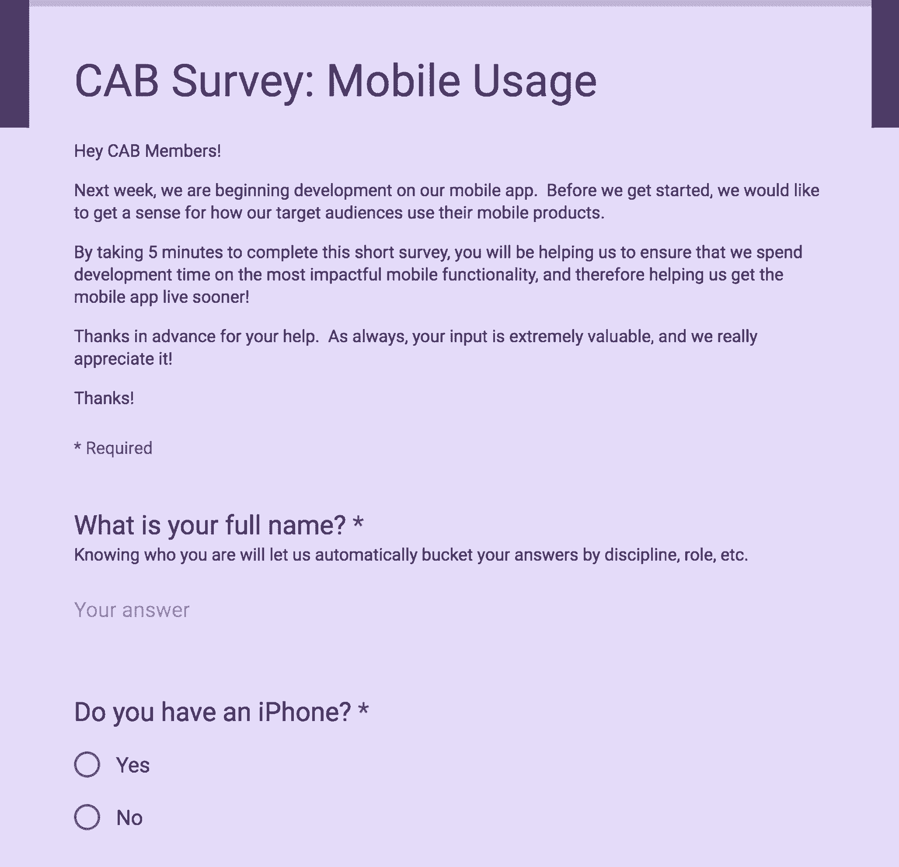

# 良好的开端—建立客户顾问委员会

> 原文：<https://review.firstround.com/start-up-on-the-right-foot-build-a-customer-advisory-board>

“我们能够给我们的 10 位客户顾问委员会成员发电子邮件，给他们新功能的模型，并邀请他们参加一个小时的可用性测试——我们提供了亚马逊礼品卡作为奖励——结果令人惊讶,[彼得·卡赞吉](https://twitter.com/Kazanjy "null")说，他因联合创立招聘初创公司[塔伦特宾](https://techcrunch.com/2014/02/24/monster-acquires-talentbin-and-gozaik/ "null")和他在[久经考验的早期销售智慧](http://foundingsales.com/ "null")而闻名。“有了**客户顾问委员会(CAB)** ，你基本上拥有了一群为你的成功而激动的人，你可以在持续的基础上利用他们来打造尽可能最好的产品。”

这就引出了一个问题:谁不想要这个呢？如果你是一个 B2B 初创公司的创始人，与一群潜在客户保持友好关系是一个理想的选择。但也可能是现实。今天，当 Kazanjy 启动他的第二家公司，势能公司时，他在他们的驾驶室里数着来自 80 家公司的代表。

“你的客户顾问委员会应该是你的客户开发过程的延伸，”他说。“你正在将这些最初的研究对话转变为一种长期的关系，给你一个机会来证明你和你对这个想法的执行有多棒，并为你的成功投资这些人。”一旦你的产品成功了，他们就会成为你的灯塔客户，向他们宣传并招募更多像他们一样的人。

在这次独家采访中，Kazanjy 分享了任何初创公司——无论多小——可以用来建立自己强大的客户顾问委员会的步骤。他讲述了如何招募会员，收集高质量的反馈，保持牢固的关系，以及最终如何将顾问转变为付费客户和倡导者。

# 一个好的客户顾问委员会是什么样的

“一个标准的早期出租车是一群人，他们代表你认为你最终会卖给谁，”Kazanjy 说。“他们对你所做的事情感兴趣，因为这可以帮助他们的业务，帮助他们解决日常或职业中的问题，帮助他们提升个人敏锐度和品牌。这种兴趣可以应用于各种用例，这些用例会随着时间的推移而变化，这取决于您在产品开发周期中所处的位置。”

因此，举例来说，如果你在销售招聘软件，你想聚集招聘人员、经理、主管和人才副总裁。如果你在为体育爱好者销售无人机相机，你会想要一个滑雪者、滑板者和其他经常在网上发布自己视频的人的横截面。这不一定是一个小团体。就像 Kazanjy 的出租车现在可以容纳 80 多人一样，你的出租车不一定要挤在一个房间里。

当你准备出租车时，无论你何时发出快速调查、模型或纸上原型，或者当你邀请人们参加面对面的活动或晚餐以提供反馈，你都希望有足够的法定人数供你支配。你对出租车的目标应该是验证你的下一步是对还是错。有很多方法可以接触到他们——Kazanjy 是季度晚餐的粉丝，例如 taco 和 margarita nights——但关键是能够向潜在用户提出跨部门的问题，并在开发过程中获得他们的意见。建议将现场互动和在线互动结合起来(稍后将详细介绍)。

如果你认为你没有时间做这些，那就忍着吧。另一种选择是建造无用的东西。

“你希望有人能给你坦诚的反馈——告诉你什么时候出了问题。你需要帮助他们做到这一点，因为人们并不总是想这样做。让他们明白，如果他们不告诉你你的想法是愚蠢的，你将会建造一些愚蠢的东西，不会再有墨西哥玉米卷或玛格丽塔酒，每个人都会很难过。”为了明确这一点，你必须不断提醒你的出租车成员，他们不会伤害你的感情。你建造的东西并不脆弱。这是一种需要进行压力测试的直觉。

“理想情况下，这些人会在你的公司周围产生一种光环效应——一群如此热情、如此受欢迎的人，以至于总会有人给你提供很棒的推荐或成功故事。”

随着您公司的前沿发生变化，您的出租车也需要随之变化。在早期，他们应该在早期产品开发中帮助你，指出你的产品解决的问题是否足够强大，以及你提出的产品和功能是否真正解决了问题并创造了你想要的价值。一旦你确认你走在正确的道路上，你就进入规模化，你可能会问他们关于定价、新功能、你的客户支持的有效性，或者打入一个新的市场。

“也许你在追求相当统一的中小型企业客户方面取得了成功，但你看到了追求企业受众的机会。卡赞吉说:“你应该在董事会中增加 10 名企业买家，听取他们的意见。"确保你的驾驶室与你面前的挑战相匹配."

# 如何组装自己的出租车

客户开发面试第一。Kazanjy 说，要以足够的量很好地执行它们。关于如何做好这些采访的详细指南，他建议阅读“[上车”和其他获得有意义的客户反馈的技巧](http://firstround.com/review/the-power-of-interviewing-customers-the-right-way-from-twitters-ex-vp-product/ "null")”——这是 Twitter 前产品副总裁 Michael Sippey 的建议。但是下面是该怎么做的注意事项:

首先，与尽可能多的潜在客户——那些你认为有你正在解决的问题的人——安排会面。确保你涵盖了你认为你的产品会吸引的各种人物角色。你是否在为企业打造一些能打动高管、一线经理或个人贡献者的东西？确保采访每个角色的分类。组织的规模也是如此。准备一个覆盖矩阵，你想用面试来填充它，这样你就知道你没有错过什么。确保所有的人物都被表现出来，可以确保你有可靠的研究，并有助于组装你的出租车。

安排至少 30 次对话，否则你将得不到好的产品。给他们一点小奖励来帮助你——一张 100 美元的亚马逊或 OpenTable 礼品卡就可以了。如果可能的话，亲自去见他们。一旦到了那里，明智地使用时间。

**5 分钟:**快速介绍。

**30 分钟:**刨根问底。

你最大的问题是什么？(我们能否证实我们的目标问题对您来说是头等大事？)

你今天是如何解决这个问题的？

你打算花多少钱来解决这个问题？(如果你的产品没有付费，问问他们有多关心这个问题。)

这个问题如何影响您的业务？

10 分钟:这是我们解决问题的思路。

**10 分钟:**反馈和后续步骤。

你想把这支舞擦得更亮。自信地展示，勤于做笔记(记录对话可能是好的)，跟进他们提出的任何问题的答案，并保持联系，因为他们的反馈会对你的产品产生影响。不要问引导性的问题。你试图理解他们当前的问题、解决方案和真正的痛苦程度。最重要的是，问问他们应该与同行业或其他公司的哪些人交谈。如果你做得很好，他们会想把你和他们的朋友联系起来，因为你和你的产品可能会解决他们的一个大问题。小心地措辞这个问题:**“还有谁在这方面很聪明？”**

“你的客户开发面试对帮助你的人来说应该是一次美妙的经历，”Kazanjy 说。“他们应该感觉非常聪明，就像有人认真倾听他们的想法和问题，就像他们在增加价值和提供帮助。他们应该感到付出的时间得到了回报。他们应该希望自己的朋友也有同样的经历。”他说，如果你做 100 次这样的采访，就要花 10，000 美元在礼品卡上——对于你以后在产品开发和对外销售上节省的所有时间来说，这是一个小小的代价。

**在这个阶段，你要开始在你的 CRM 中记录所有的对话。**记录下每个人的角色和他们工作的公司类型，对他们的反馈质量进行排名，并记录下你们的融洽关系，因为稍后你会想要查询这些信息来形成你的 CAB(以及其他目的)。当你开始邀请这些人正式加入你的出租车时，你可以添加特定的字段来反映你是否提出了请求，他们是否同意，以及他们是否签署了 NDA。一旦这三个都完成了，他们就上船了。

Kazanjy 说:“在我们的客户开发过程中，我们想出了客户咨询委员会的想法。“因此，我们回到所有与我们交谈过的、特别有见解的人那里，询问他们是否想成为这群精英中的一员——不要称他们为潜在客户——帮助我们打造更好的产品。”如果你已经为人们建立了详细的记录，你应该能够在你的客户开发访谈列表中说，“是的，她很聪明，他很好，检查检查检查...哦，不是他，斯基普·斯基普...检查检查检查”来建造你的出租车。

当您有一个好的数据模型时，您可以对您的 CAB 进行分段，以便轻松地进行更有针对性的请求。例如，您可以查询您的 CRM，仅向销售角色的个人贡献者、规模超过 100 人的公司的经理、仅女性或仅副总裁发送调查。

**以下是你申请加入出租车时需要考虑的因素:**

经过几个小时的研究和与许多像您一样的客户交谈，很明显这种类型的产品非常令人兴奋。

我们正在召集一群对这个问题空间感兴趣的精英人士继续参与进来。

您的反馈非常有价值，我们非常希望能够继续联系您。

我们计划不时与该群体接触，以获得反馈并更多地了解他们的需求。我们希望每月联系一次，占用您不到一个小时的时间。

我们将举办独家的季度活动，提供食物，您将有机会与您所在领域的顶尖人士交流，分享您的经验，他们也是我们采访过的最优秀的人。(提供已经加入的知名公司的例子，以展示吸引加入的有价值的团体。)

一旦我们启动，欢迎你在你的 LinkedIn 个人资料、简历等上推销你的 CAB 会员资格。

我们希望你能参与进来。如果你不能，那也没关系，但是让我们知道，这样我们就可以把注意力转移到下一个有潜力的人身上(来制造紧迫感)。

Kazanjy 说:“当你提到以顾问的身份宣传他们的工作时，你会惊讶地发现有多少人会感兴趣。”“你需要喜欢这些东西的人——那些真正对接触新技术和思考新问题感到兴奋的人。”

当他和他的联合创始人创办新公司时，他们做了 150 次客户开发访谈。他们的目标是不同规模的公司和组织中不同职位的人。他们与销售、工程和客户服务等职能领域的人员进行了交谈。每一次，他们都注意到这个人是否验证了他们试图解决的问题。最后，他们可以看到什么类型的人对这个问题感受最强烈。这些是他们为出租车招募的人。

最终，他的产品最能引起销售副总裁、销售经理、客户经理和销售运营主管的共鸣。尽管他们有不同的角色，但他们确保他们都在 CAB 中有代表。这使他们能够适当地细分和解决问题，例如，仅向销售经理或仅向 AE 提问，以了解他们的兴趣和未来的更多需求。

“在不太可能购买你未来产品的公司，你会遇到给你很大反馈的人，在前景非常好的公司，你也会遇到不那么乐于助人的人。卡赞吉说:“你必须找到这些属性之间的平衡，而且要诚实。“不是每个人都需要达到反馈质量的标准，但是他们的总‘价值分数’应该高于标准。如果他们的反馈不是高质量的，他们的公司最好是一个很好的机会，有相当大的成交机会。"

完美的人是那些自己拼凑出解决问题的次优方案的人。

招募那些表现出创造力和热情的人。他们自愿做这样的事情，“你知道什么最酷吗？如果你的产品做了 X，Y 和 z。”也许他们已经自己解决了好几次了。他们会考虑周全的。

# 如何检查你的出租车

调查是联系客户顾问的主要方式。你可以围绕你的疑问或问题让它们变得非常具体，对你的听众来说，它们可以非常简短和快速，而且你可以让它们变得有趣。Kazanjy 和他的联合创始人向他们的 CAB 部门发送了大量调查，以将他们提议的功能列表缩减为可管理的路线图。然后，他们在谷歌幻灯片中模拟了该产品，并将其与附带的调查一起发送给 CAB 成员，然后继续进行更详细的纸上原型和演练。

为了让你感觉到你可以依赖调查，Kazanjy 的公司已经使用 SurveyMonkey 来征求关于不仅仅是功能，而是整体产品设计，甚至是产品名称的意见。关键是，它们不一定要精心制作，也不一定要正式。这只会拖你的后腿，降低反馈速度。在你的调查中，你可以随意和健谈。你只是想了解你的观众对观点的看法。

命名调查已发送给整个小组。然后，他们对照受访者的角色交叉引用他们得到的建议，例如，销售经理、客户经理和销售运营。“看到不同的顾客角色对不同名字的反应是很有趣的，”他说。“这给了我们更多的数据点，让我们了解他们对产品的看法和需求。”这里有一个例子:

“只是不要让你的调查时间太长。仔细想想，‘我们实际上需要知道什么？’”他说。上面的例子包括 7 页，每一页都有一个关于 CAB 成员如何使用手机的问题。

不要回避发送一个问题的调查。他们甚至更容易让人填写，会让你与团队保持有规律的互动，并能告诉你很多。“在我们的案例中，当我们思考我们的移动应用程序时，我们发出了一封电子邮件，只问了一句，‘你能告诉我们你在手机上使用的是什么操作系统吗？’Kazanjy 说:“我们的战略是基于一种猜测，即 iPhone 在我们的目标市场没有实质性的主导地位，我们可能必须先做一个 iPhone 和 android 应用程序，但事实证明 iPhone 占据了很大的比重，所以我们将开发资源集中在那里。”

从那里，他们可以只调查 iOS 用户的体验(上面的例子)。这是一个更长、更复杂的调查，有奖励激励，但也有产品变得更加符合出租车用户需求的想法。

当你有一些简短的问题时，你可以选择调查你的出租车中的一小部分人，他们可能对你的问题有更强烈或更大的兴趣。“我们想问，‘你们销售的平均合同价值是多少？’并得到快速的回应，所以我们选择了 10 位参加过我们所有晚宴的人，以及我们觉得最亲近的人。很容易冲出去，然后马上听到回音。"

当你进行更严肃或正式的调查时，应该有明确的激励措施。“如果你要求某人完成一项 30 分钟的调查，对幻灯片中的 15 个不同功能进行优先排序，可能应该附上一张 50 美元的礼品卡。否则，你不太可能获得好的毕业率，”Kazanjy 说。“我们通常将出租车时间的价值定为每小时 100 美元，并以亚马逊或 OpenTable 礼品卡作为补偿，这让人们觉得我们的出租车会员资格是有价值的。”

# 亲身体验是双重激励

晚餐和聚会是为你的出租车创造连续性的好方法。在每一次活动中，你的顾问都能看到正在取得的进展，以及他们的反馈是如何被利用的。

Kazanjy 的新公司将每季度邀请整个团队参加一次欢乐时光或私人用餐体验。平均来说，只有一小部分人会参加，这使得他们在加深与产品的联系的同时更容易管理。除了查看产品更新和内部信息，他们的邀请还包括与其他 CAB 成员会面和聊天的能力，包括他们所在领域或行业的知名领导者。他们还会邀请和安排与外部有声望的利益相关者的座位，比如他们熟悉的风险投资者、天使投资者和销售主管。

“每天晚上开始大约 30 分钟到 1 小时的无组织网络，”他说。“我们努力让它变得非常好——好的场地、好的食物、好的音乐、漂亮的名牌——**我们关注细节，让人们感觉特别**。然后，一旦他们连续去了几个，他们就开始认识并期待彼此见面。它变成了一个围绕问题和产品的社区。”

每个人坐下来吃饭后，Kazanjy 和他的联合创始人做了一个相对快速的 15 到 30 分钟的介绍。以下是他们分享的内容:

他们在最早的客户开发期间的初始假设，以及在最后一次亲自更新期间对产品所处位置的感觉。

事实上，这一想法是基于房间内所有客户顾问的想法和见解而发展和完善的。

快速总结上一季度活动后他们说要做的事情，以及自那以后从 CAB 成员那里收到的主要反馈。

回顾他们对此所做的改变以及迄今为止所产生的影响。

展望他们计划采取的下一步行动，以解决更多的反馈、弱点或功能请求。

我们将诚实面对失败和改进作为每一次演讲的核心。

“我们希望每个人离开时都清楚地知道我们计划做什么，因为他们说了什么，”Kazanjy 说。“在我们交谈之后，人们可以继续交流，讨论更多我们可以无意中听到和使用的素材。人们总是乐于看到自己的一点点努力带来的巨大影响。”

只要有可能，他喜欢将具体功能或变化与驾驶室中的个人联系起来。“我们可能会说，‘今晚我们将推出 Kelly 功能，因为她与我们分享了这个伟大的想法，我们一起破解了它，’”他说。“这鼓励了房间里的每个人提供更多的反馈，因为人们不仅可以和一群令人印象深刻的重要人物坐在一起，他们还可以出现在屏幕上，在一屋子令人印象深刻的重要人物面前大声喊出来。”

Kazanjy 花了几个小时组装和抛光这些演示的甲板。产值传达了他的公司对驾驶室的关心和重视。很明显，他们正在为一个惊人的反馈回路提供动力。与此同时，投资这些活动向参加活动的风投和天使投资者表明，该公司已经准备好了，正在前进，并且已经有了很多热情的兴趣。这是飞轮的开始。

“你的潜在客户开始想，‘好吧，这是一件真正的事情，正在接近实现。我在这里很有价值。我想继续下去，看看会发生什么，这些人肯定是我想与之合作的人。"

像这样的活动会产生更多的社会资本，你可以花在发送调查和要求原型反馈上。你开始看到谁来参加每一个活动，他们成为你可以要求一对一的用户访谈或可用性测试的人。出席情况应该记录在你的 CRM 中，这样你就可以知道每个人对你的成功投入了多少，以及他们喜欢如何参与。

卡赞吉说:“这样，你就可以在给一些人的邮件中这样开头，‘嘿，我们很高兴你参加了我们的前四次晚宴，现在我们希望你能在 x 方面提供帮助。’个性化真的很重要。”。“如果人们养成了面对面聚会的习惯，想想以后录制一堆真实的推荐视频会有多容易。”

# 如果你的出租车不在一起...

Kazanjy 说，如果你在加入你的出租车的人中没有获得很高的点击率，或者没有对你的调查和邀请做出回应，可能的原因是他们不完全相信你正在解决的问题存在。“您需要回顾您的客户开发访谈，看看他们对这个问题的感受有多强烈。他们真的因此感到很痛苦吗？我的猜测是否定的。你可能需要重新考虑你要解决的问题，或者你是如何表达的。”

如果人们说他们确实因为这个问题感到很痛苦，但他们仍然没有加入你的出租车，那么你可能在公司里找错了人或角色。

“你可能会去找那些职位太高的人，”他说。“许多初创公司都有一个错误的信念，认为最高层的人应该是他们的主要客户——大公司的 SVP 或其他地方没空理你的副总裁。但这并不是你想要的出租车上的人。你必须说服的一位高层人士会想要股权。你不想给他们股权——你想给他们玛格丽塔酒和墨西哥玉米卷。改变你的方法，从主管、经理或集成电路层面招聘每天都会使用该产品的人员。你会得到更好的结果。他们很乐意参与，你甚至可以暗示，与你合作会让他们更快成为 BFD 的副总裁。”

# 当你接近发射时展开你的出租车

现在 Kazanjy 的产品不再是纸上原型，而是一个工作版本，他与 CAB 的关系已经发生了变化。他和他的联合创始人越来越多地将该产品同时部署到五家公司，进行实际的客户成功访谈，并验证他们的问题确实得到了解决。

他们还询问了按人物角色划分的小型团队有关定价的问题。他们愿意为该解决方案支付多少钱？在什么条件下？他们有权购买吗？他们首先需要做什么？

在发布和推广之后，他们计划询问实现规模化的最佳方式:我们是否需要更多营销宣传材料？广告可以有效地放在哪里？我们应该考虑哪些附加功能？入职体验如何？还有很多。

“你想进入这种真正可预测的节奏，你在**向你的出租车提供更新，就像你在公司董事会会议上向公司董事会提供更新一样**，”Kazanjy 说。“即使人们不能来参加你的季度活动，你也要给每个人发一张卡片，告诉他们，‘嘿，这是我们说过要做的事情。我们要么做了，就在这里，要么我们没有做，因为新的数据出现了，我们决定走不同的路线。这就是阻碍我们成功的原因。有人有什么想法或反馈吗？"

如果人们错过了活动，要接受预约电话。一对一的反馈几乎总是比在小组中分享的反馈更有帮助。如果有人想见你，去找他们。你越接近发布，你就越希望与 CAB 成员的联系更紧密。

如果你反应灵敏、勤奋，并且不掉链子，人们就会开始信任你——这将转化为 beta 测试人员、准备在发布时签名的客户，以及从第一天开始的传道者。稍后，这些人将成为您的案例研究对象，甚至是您最终用户会议的发言人。

建立一个强大的核心支持者会在你公司的每个阶段与你同行。

Kazanjy 说:“你希望为你的出租车成员创造尽可能多的与你交流的空间。“他们应该觉得自己可以随时随地参与进来，他们的反馈或帮助不仅会得到认可，还会被采纳。对他们来说，贡献或获取有用的信息绝不应该是什么大而复杂的事情。”

目前，他的公司正在研究如何实现某个功能。他能够快速地给 10 个潜在客户发送密件抄送邮件，这些客户从一开始就被吸引住了。“其中五封在 15 分钟内回复了我，第二天早上又有三封，”他说。“我没有收到其他人的来信，但这并不重要，因为我能够得到我需要的东西。我们能够做到这一点，并且每周都能学到更多。”