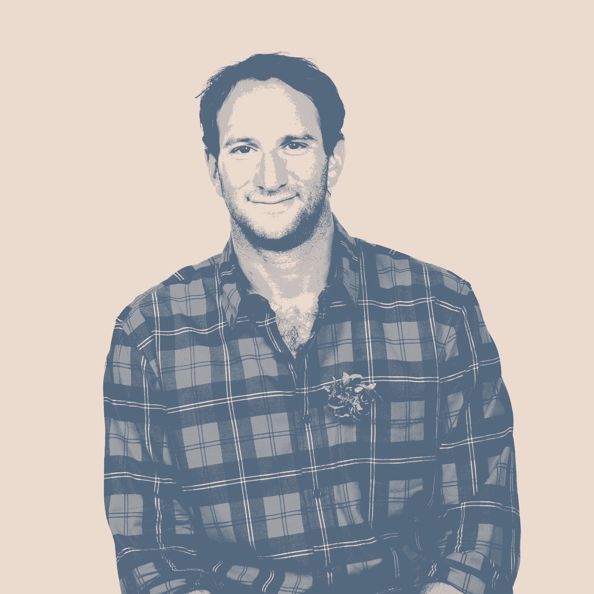

# 在你不擅长的领域创业——这位创始人分享了 6 条经验

> 原文：<https://review.firstround.com/starting-a-company-in-a-space-you>

## 介绍

我们听说过关于创业初期的各种类比——这类似于[在你驾驶飞机的时候建造飞机](https://review.firstround.com/30-tips-for-new-startup-employees "null")，或者类似于[学习分享你的乐高玩具](https://review.firstround.com/give-away-your-legos-and-other-commandments-for-scaling-startups "null")，或者感觉就像[怪兽在啃你的腿](https://review.firstround.com/make-friends-with-the-monster-chewing-on-your-leg-and-other-tips-for-surviving-startups "null")。

**[欧文费恩](https://www.linkedin.com/in/irvingfain/ "null")** 向列表中添加一个新的。“这就像一个视频游戏，只有当你在不同的地区走动时，游戏地图才会发光，”他说。“**创建一家初创公司在某种程度上就像盯着这张几乎一片黑暗的地图——所以你不知道自己是否正驶下悬崖。”**

作为 Bowery Farming的创始人兼首席执行官，Fain 很感激他没有将公司带离悬崖——恰恰相反。就在本周，Bowery Farming [宣布进行 3 亿美元的 C 轮融资](https://techcrunch.com/2021/05/25/indoor-farming-company-bowery-raises-300m/amp/ "null")，这是迄今为止室内农业公司最大的一轮私人融资。作为 Bowery Farming 种子轮的投资者，第一轮团队是在杂草中，因为 Bowery 从一个想法的幼苗成长为一个蓬勃发展的企业，迄今为止已经开设了三个农场([加上一个创新中心](https://www.thepacker.com/news/packer-tech/nycs-bowery-farming-unveils-farm-x-science-breeding-hub "null"))，并与 Whole Foods 和 Albertsons 等顶级杂货商合作。

虽然不是第一次创办 (Fain 共同创办了全渠道忠诚度和分析解决方案公司 [CrowdTwist](https://www.linkedin.com/company/crowdtwist-inc-/ "null") )，但建造 Bowery 的漫长攀登始于一个令人难以置信的陡坡。鲍威利的室内农场的使命是普及新鲜的当地种植的食物，在模拟太阳光谱的灯光下，农作物从地板到天花板堆叠在一起，全年都可以种植各种各样的产品，不管季节如何。这是一项非常棘手的工作，更为复杂的是，费恩在 2014 年创办包厘之前从未从事过农业。

学习曲线是陡峭的，但费恩认为这是迄今为止鲍威利成功秘诀的必要成分。“天真是企业家应该具备的重要品质——没有什么是可能的、什么是不可能的假设。**不知道每个角落都有什么实际上是一种优势，因为它迫使你去寻找你通常永远不会去的角落。**

我们在这里做什么没有剧本。这既是令人难以置信的兴奋和振奋的原因，也是有时非常困难的原因。

在这次独家采访中，费恩带我们回顾了他在公司早期是如何不合理地深入公司的，以及一直伴随着他的最重要的教训。有些是他作为初创公司创始人第一次创业时学到的，有些是他在包厘意外发现的——有大量的智慧，尤其是对那些仍在考虑创办公司的人来说。从锁定一个有持久力的想法，到说服投资者加入并组建一个早期团队，这些都是 Fain 从零到一的故事中有抱负的创始人不想错过的内容。让我们开始吧。

# 第一课:如果运用得当，天真在创始人的武器库中是一种不受重视的工具。

在创业知识的行列中，有许多著名的创始人在深厚的行业专业知识的基础上建立了繁荣的企业。例如， [Looker's Lloyd Tabb](https://review.firstround.com/the-inside-story-of-how-this-startup-turned-a-216-word-pitch-email-into-a-2-6-billion-acquisition "null") 发现公司缺乏对数据的实时理解是一个反复出现的问题，而 super human 的 [Rahul Vohra 之前已经在电子邮件领域创办了一家公司。费恩不是这些创始人之一。](https://review.firstround.com/how-superhuman-built-an-engine-to-find-product-market-fit "null")

“我从小就被新鲜食物的重要性所包围。我喜欢说，我母亲去了农贸市场，关心抗氧化剂，这远远超越了她的时代。但我并不是来自一个长期务农的家庭，也没有在 Bowery 工作过，”他说。在评估任何想法时，总会有一定程度的天真。也就是说，你必须将这一点与对你要进入的行业和业务的真正知识和理解结合起来。”

具体来说，费恩希望了解行业面临的挑战，以及他希望建立的公司可以填补的最大漏洞。他并没有特别的想法，相反，他被农业和科技领域的空白所吸引——以及其独特的挑战。“在那之前，世界上只有比特、字节和代码——这是很容易预测的。你有时会有错误和问题，但你可以修复它们。植物并不总是按照你期望的方式行动。我认为这种不稳定性和不确定性很有趣，但天生具有挑战性，”他说。

对费恩来说，建立基线知识始于一个难以置信的大光圈。“我和任何我能交谈的人交谈。我读我能读的任何东西，看我能看的任何东西。当时还没有一大堆农业科技在进行，气候公司被人们奉为农业科技的典范。所以我会见了气候公司的一些人，试图了解他们在这个领域看到了什么，”他说。

这种广阔的视角开辟了各种各样的公司建设途径——从农场的 SaaS 到农业和精准农业的无人机和卫星图像，不一而足。“我真的允许自己去探索和理解一切——随着时间的推移，我走得更远，我的关注点越来越集中在城市农业上。更具体地说，你如何将新鲜食物送到城市环境中，你如何更可持续、更高效地做到这一点？”费恩说。

当你打算建立一家公司时，你开始时有一个非常大的光圈，然后随着你沿着这条路走下去，你必须进一步缩小这个光圈，既违背你想要建立的想法，也违背你想要建立的最终业务。

他的经验不足转化为一种开放的思维和不偏不倚的方法，这种方法植根于待完成的工作，而不是待构建的解决方案。“**我在比赛中没有马——对我来说，我们建造哪种系统并不重要。我不喜欢水培法，也不喜欢气培法、水培法、建造温室或拥有集装箱农场。他说:“我真正在寻找的是解决这个问题的最具扩展性和最有效的方法。**

# **第二课:平衡来自福音传道者和怀疑者的意见。**

在这次探险中，费恩遇到了一些人，他们让他的创始人之轮在超光速引擎中转动。“我记得很清楚的一个故事是与哥伦比亚大学教授迪克森·德斯波密耶的会面，他被认为是室内农业和垂直农业的早期传播者和信徒之一。我向他伸出手，说，“嘿，我很想和你谈谈，听听你的想法。”费恩说:“最后，我们在上西区的一家爱尔兰酒吧吃了布法罗鸡翅，聊了一个半小时，谈论垂直农业不可避免地会取得巨大成功，成为下一个最大、最伟大的事情。

然而，尽管这些探索性的谈话让费恩充满活力，但他渴望平衡两者之间的关系——尤其是在围绕尚未成为主流的创新建立一家公司的时候。“你必须非常小心，不要成为确认偏见的受害者。费恩说:“当你与那些既兴奋又普遍相信你所做的事情的人交谈时，**找到那些不相信你所做的事情、认为你走错了路并最终认为你在做这件事上犯了一个错误的人也同样重要。**

它始于框架的微妙变化。“我对 Bowery 采取的策略是不相信这个想法是可能的，并证明这个想法是错误的，但事实恰恰相反。他说:“我从最基本的假设出发，认为这是不可能的，并试图证明 T21 是错的。”。

这意味着每次与德斯波密耶这样的人交谈时，费恩都会向反对者伸出手。费恩说:“我将这一观点与康奈尔大学的一组教授配对，他们做了大量研究，认为这是不可能的，我花了同样多的时间与他们交谈，以了解他们为什么相信他们所相信的东西。”“应该有成百上千个理由[来解释为什么这种方法行不通](https://review.firstround.com/ask-why-it-won't-work-and-other-lessons-this-founder-relies-on-while-building-from-0-to-1 "null")——没关系。不代表你不做。但最好提前了解他们。”

重要的是要看等式的各个面。考虑所有可能好的事情，但同样，也许更重要的是，所有可能出错的事情。如果你作为一个企业家没有这样做，你就没有问足够多的难题，也没有足够认真地思考你的想法。

# 第三课:严格评估创始人/市场是否适合长期坚持一个想法。

作为一名农业新手，费恩对担任首席执行官和创始人的曲折经历并不陌生。在帮助建立 iHeartRadio 后，他在 2009 年开始联合创立 CrowdTwist 集合了百事可乐、索尼音乐和迈阿密海豚等创始人梦寐以求的大 logos。但该公司的成功不足以让 Fain 继续受到企业软件的激励，他在 2014 年离开了首席执行官的职位(CrowdTwist 最终将在 2019 年被甲骨文收购)。

因此，在创建 Bowery 的早期，他特别严格地用长远眼光来评估想法。“SaaS 农场是一项伟大的事业。精准农业是另一个伟大的产业。但是他们没有抓住我的激情，我的想象力和我的热情。费恩说:“当你创办任何一家企业时，这个组成部分都非常重要，因为创建一家公司是一个漫长而艰难的过程。

他不是唯一一个感受到创始人精疲力竭的痛苦的人。“我见过朋友们对一个想法异常兴奋。他们出去筹集一些钱，然后兴奋感很快就消失了。现在你却被困在创建这家你并不感兴趣的公司。当我在观察和评估不同的想法时，即使我越来越兴奋，我也会调整自己的节奏。费恩说:“不断翻转其他岩石至关重要。

我想确定的是，随着时间的推移，人们对鲍威利的兴奋与日俱增。无论是在伟大的时代，还是在困难的时代，我对问题和事业的激情、热情和真正的热爱将会持续下去。

虽然菜鸟创始人可能会过度关注起跑线——从寻找[产品/市场契合度](https://review.firstround.com/how-to-craft-your-product-team-at-every-stage-from-pre-product-market-fit-to-hypergrowth "null")，获得[你的最早客户](https://review.firstround.com/drive-growth-by-picking-the-right-lane-a-customer-acquisition-playbook-for-consumer-startups "null")，以及组建你的团队——但在匆忙起跑的过程中，很容易忘记这是一场马拉松，而不是短跑。

“你应该问的核心问题是，’**三年后，五年后，七年后，我会对此感到兴奋吗？因为我知道我即将踏上的旅程并不短。我们在波威里建立的是一代人的事业。它是下一个伟大的食品和农业公司。费恩说:“这不是几年就能完成的事情。**

Irving Fain, founder and CEO of Bowery Farming

# 第四课:你可以降低你跳崖的比率，但你还是要跳。

虽然费恩非常相信严谨研究的力量，但他意识到不要在地下室花太多时间。“我们在早期做了很多工作，甚至在我们筹集到一美元资本之前，试图尽最大努力去理解批评者是对的还是乐观者是对的。我们达到了收益递减点——研究、测试、构建增长系统、分析和电子表格不会产生同等价值。我们的下一步是建立一个有一定物质和规模的农场，”费恩说。

这是他第一次涉足创始人水域时养成的心态。“在我创办第一家公司之前，我花了大量时间评估、评估、评估、说不，评估、评估、评估、说不。现在回想起来，我会说，‘哇，我对一些伟大的想法说不。’费恩说:“我花了太多时间去寻找错误的答案。

是时候上场了。“我可以坐在椅子上，用十年的时间来思考这个问题，但在创建一家公司时，你永远无法避免不得不跳下悬崖的那一刻。在某些方面，你要尽量让崖地比尽可能的小。但无论多少工作和研究都无法避免这样一个事实，即在某个时刻，你正[跳入深渊](https://review.firstround.com/navigating-the-leap-from-big-tech-to-startups-advice-from-a-former-google-and-flipkart-exec "null")，”他说。

对于大多数创始人来说，迈出这一步意味着从建立一个 MVP 开始。但是与其他想法相比，鲍威利农场需要一个非常复杂的 MVP。

“Bowery 是一个特别有趣的案例研究，因为它是一个非常复杂的行业，有很多组成部分。Fain 说:“从某些方面来说，软件公司的 MVP 最终会比我们在 Bowery 建立的 MVP 要简单得多。“我所做的，我认为任何企业家在早期都需要做的，是在最早期阶段确定什么是最重要的。对你来说，向自己证明、向市场证明、向投资界证明(如果你要筹资的话)，最重要的是什么？”

下一步是确定达到这些早期指标的最有效途径。“你需要建造什么？需要创造什么？你需要雇佣谁来实现这些证据？不会太多，但也不会太少，”他说。

费恩建立了一个极其简单的框架，将业务分割成易于管理的部分:建设、发展、出售。“这意味着，我们真的能用我们创造的技术和方法建造一个室内农场吗？那么我们能以我们期望的方式种植食物吗？一旦我们种植了这种产品，它会有什么好处吗？会有人真的想买吗？当你以这种方式展示这些概念时，它们看起来是如此简单。但每一层下面的工作和执行都是巨大的，”他说。“这个框架至少给了我们指引，让我们集中精力决定在早期做什么和不做什么，尽可能高效地建设和发展。”

这意味着为 Bowery 的第一个室内农场寻找仓库空间，并制作一个后来被称为 BoweryOS 的轻型版本。“它是业务增长方面的中枢神经系统和大脑，也是整个运营和供应链。他说:“我的核心信念是，操作系统是产生最大可扩展性的关键，它与增长系统本身一样重要。BoweryOS 测量了室内农场传感器网络的数百万个数据点，包括湿度和温度，这些数据对最终味道有着巨大的影响。

但是，尽管 Bowery 的 MVP 可能已经考虑到了种植作物的复杂性，但 Fain 很清楚，它仍然是更宏伟愿景的缩小版。“当然，我们多年前构建的操作系统只是我们今天拥有的一小部分。今天的农场看起来与我们当年建造的农场截然不同。他说:“这一切都是为了专注于每一个业务支柱中最重要的东西。该公司于 2017 年从 stealth 中脱颖而出，推出了六种不同的产品——芝麻菜、羽衣甘蓝、butterhead、罗勒和两种混合物。

# 第五课:成为如何做的传播者，而不仅仅是为什么做。

除了复杂的 MVP 之外，从筹款的角度来看，费恩面临着一场艰苦的战斗。他表示:“投资者没有现成的表格可以拿出来说，‘以下是我过去向其他 100 家做你这种工作的公司提出的 8 个问题，它们有助于我理解如何看待你的业务、你的进步和你的机会。’”

除非人们在这个行业工作，农业技术有各种各样的细微差别，很容易被掩盖。“当人们宽泛地看待室内农业时，有时会犯的一个错误是将这一类别归为一类。当然，所有的东西最终都会落入受控环境农业的保护伞之下，无论是温室、水培种植还是垂直农场或集装箱农场中的雾培种植。但事实是，每一种种植方法都各不相同，”费恩说。“你选择的系统本身和你建造农场的方式对你最终能种植什么品种、你种植这些作物的效率以及最终你实际能建立的模式的经济性有着非常大的影响。”

任何[创始人都需要成为一个讲故事的人](https://review.firstround.com/your-marketing-org-is-slow-heres-a-framework-to-move-faster "null")——说服各种各样的人，从投资者到员工再到顾客，相信这个愿景及其重要性。但是 Fain 增加了一个附加层。“我的一项重要工作不仅是有效地宣传我们正在建设的*和*为什么*它很重要。但同样重要的是，作为一名非常有效的教师，向学生解释我们在包厘的做法是解决这个问题最有效的方法。*

*但面对投资伙伴的时间有限，迅速抓住他们的想象力至关重要。“我需要告诉某人为什么我们正在做的事情令人兴奋和有趣的高层次故事。他说:“我还需要解释为什么我们要以我们选择的方式来解决这个问题，以及为什么他们应该相信这可以成为一家非常大、成功的公司。”。“你必须能够双击或双击鼠标。这有助于那些对农业知之甚少的人，更不用说对城市农业了如指掌，对我们正在建设的东西和建设方式感到放心和自信。”*

*最终，如何和为什么结合成了 Bowery 的品牌故事，而 Fain 将他的信息从 Sand Hill Road 带给了最终消费者。“这很有趣，因为有人问我，‘你为什么要建立一个品牌？那是愚蠢的，你还不需要建立一个品牌。没人知道你们是。不要花那笔钱，”他说。*

*但费恩确信，即使在最早的时候，投资也是值得的。原因如下:“食物在变化。人们在问他们的食物来自哪里。是怎么种出来的？它是怎么做的，成分是什么？我的产品中含有哪些化学物质？谁在种植它？他说:“这类问题比以往任何时候都被问得更激烈、更有活力，它们正在导致食品体系发生真正的结构性转变。”。*

*“而且在很多情况下，从结构上来说，这个系统并没有适应这种变化。你有一个非常复杂的供应链，涉及许多不同的参与者。因此，要回答这些问题，我的食物从哪里来，谁种植的？他们是和什么一起成长的？这非常困难，”费恩说。*

*他举了一个例子。“当你看到一些已经发生的召回事件时，比如生菜，他们已经召回了整个国家的所有生菜，因为他们不知道问题出在供应链的哪里。他表示:追溯几乎是不可能的，当然也不可能很快做到。*

*因此，尽管有堆积如山的工作要做——从建造农场到创建管理生长周期的操作系统——将消费者与那个故事联系起来是 Fain 的首要任务。“我们在 Bowery 可以提供的好处是，我们控制了从种子到储存的整个过程，因此我们可以告诉你你手中产品的一切。向消费者讲述这个故事的能力是我们的竞争优势，”费恩说。*

# ***第六课:专注赢得胜利，所以故意保持小规模。***

*尽管前面的工作很复杂，但在组建鲍威利早期创始团队的时候，费恩有意坚持组建一个五人小组。“这是一个非常大的问题，有太多的兔子洞可以掉进去了，这很有趣，很刺激，也很重要。**但当每个业务领域基本上都由一个人负责时，这迫使每个人只关注最重要的事情。***

*我非常相信，在建立企业时，专注是致胜之道。当然，在最初的阶段，专注是至关重要的，因为你的资源有限，时间有限，需要证明的东西很多。因此，作为创始人，你最早的工作之一就是评估对你正在创建的企业最重要的是什么。*

*他首先使用一个非常简单的矩阵来确定差距。“我哪里强了？说实话，我哪里不强大？我的技能和最重要的东西在哪里重叠？在我没有重叠的领域，我的工作就是去寻找能够覆盖这些领域的人。我来自一个营销和业务发展背景，所以我知道如何讲述一个令人信服的故事和建立伙伴关系。我当然不是农业科学家，也不是机械工程师，更不是软件工程师。因此，这是三个关键领域，我们在早期就引进了可以提供专业知识的人，”费恩说。*

*严格的关注是至关重要的，但通过保持低员工人数，Fain 还着眼于清除他预计将成为 Bowery 最大的障碍之一。“从我们业务的财务部分来看，我们从最早的时候就开始真正关注单位经济。这是因为当你在建立一个软件企业时，没有人会质疑你是否能通过构建软件赚钱——这是一个非常可靠的原则。问题是会有人想买你制作的软件吗，”他说。*

*“以我们在包厘的例子来说，事实正好相反。毫无疑问，对更好的质量、更好的口味和更可持续的产品有着巨大的需求。问题是，你能以一种经济上可行的方式去做吗？这正是我们早期投入全部精力和精力的地方，”Fain 说。*

## *要挑战现状，你必须明白它为什么存在。*

*你会注意到天真主题的回归——在他的第一次雇佣中，费恩并没有寻找那些已经积累了几十年农业经验的人。“我们的机械工程师 Brian 曾在农业和温室中工作过一段时间，他掌握了一些非常有价值的领域知识。但是你不能看着我们说，‘哦，哇，他们有一群专家。’我们没有一个 20 年的温室种植者。这确实是有目的的。这就是等式中幼稚成分的来源，”他说。*

*我觉得在团队中拥有足够的工作知识是非常重要的，但不要有太多的知识，否则会让我们走上许多前人走过的长期规定的道路。*

*为了引入深厚的行业专业知识，他将注意力转向组建鲍威利的顾问团队。“同样重要的是，通过真正强有力的顾问来增加团队的理解和专业知识(或缺乏这些知识),这些顾问通常在现有的食品公司或室内种植或运营或食品杂货和零售方面拥有数十年的经验。这以一种非常有效的方式为我自己和团队提供了巨大的杠杆作用，”Fain 说。*

*他列举了一个例子:“我一直相信，我们在 Bowery 建立的不仅仅是一个 CPG 品牌，而是一个更大更广的组织。所以我不愿意让一个有丰富 CPG 经验的人单独加入。然而，我也知道，不管喜欢与否，我们是在零售店销售消费品。因此，我们正在做的一些事情模仿了传统 CPG 已经做了几十年的事情，忽视这一点是愚蠢的，”他说。*

*早些时候，他被介绍给作为投资者和顾问的莎莉·罗伯林。“在她整个职业生涯的大部分时间里，她一直在创建和经营食品企业。费恩说:“她是一个很棒的思想伙伴，能够帮助我们理解一直以来的做法和原因，同时也愿意认识到，我们不会因为一直以来都是这样做的，就仅仅按照某种方式去做。”。“**她愿意和我们一起挑战现状，但也愿意帮助我们做到这一点，至少要理解** ***为什么*** **当时的做事方式就是这样的**。”*

## ***高管招聘不需要创业经验就能带来创业心态。***

*最近，Fain 一直专注于建立 Bowery 的管理团队。虽然行业专长不是 Fain 新员工愿望清单的核心，但他非常关注一个关键特征。“如果你想用你已经用过一百次的传统策略，你就不能来包厘工作——那是行不通的。最成功的人是那些拥有一套可靠的原则、经验和框架的人，他们可以将这些应用到我们在 Bowery 解决的问题上。但他们也同样愿意和开放地适应(或在某些情况下完全抛弃)这些框架，因为它们可能不适用于我们的问题，”他说。*

*因此，得知鲍威利最近的高管招聘并非来自快速增长的初创公司，而是来自沃尔玛、沃尔格林和其他大牌公司，可能会令人惊讶。我们的首席商务官 Katie Seawell 在星巴克工作了超过 15 年，在纽约、米兰和东京建立了完整的烘焙业务。费恩说:“她是一个充满活力、快速发展、快速变化的组织的一员，在这个组织中，品牌和价值观非常重要。*

*星巴克远非一家初创公司——但费恩看到了与他在包厘街早期培养的第一原则思维模式相当多的相似之处。“他们已经建立了自己的剧本。费恩说:“他们至少重塑了自己，让凯蒂有了一些经验，接触到了这样一种理念，即理解前方的道路，然后不断修改和调整。*

*“寻找人们可以分享他们必须发明、创造和应对未知或不可量化的事物并取得成功的例子。在其他情况下，也许不成功，但有尝试的意愿。你不想要 100%的成功率——这意味着我们没有做足够的努力，没有承担足够的风险，”他说。*

*他建议用某种反推销的方式来结束面试过程。“我毫不犹豫地告诉人们这是什么，不是什么。费恩说:“通过非常明确地描述我们正在进行的旅程，在某种程度上，我们进行了自我选择。“有些人对走进未知世界没有真正的吸引力和兴趣。但是有些人说，‘太棒了——我加入了。“我们什么时候可以出发去旅行，”这就是我们雇佣的人。"*

**这篇文章是对我们的新播客《深度》中* *[欧文·费恩的出场](https://review.firstround.com/podcast/episode-24 "null")* *的简要编辑如果你还没有听过我们的节目，* *[一定要来这里看看](https://review.firstround.com/podcast "null")* *。**