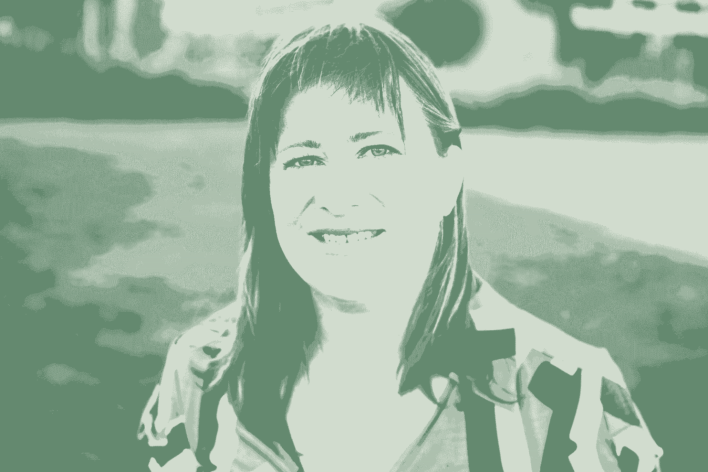

# 初创公司、软件开发和自行车维修艺术

> 原文：<https://review.firstround.com/startups-software-development-and-the-art-of-bicycle-maintenance>

如果你是哲学家老子，千里之行始于足下。但是如果你是伊迪丝·哈博 ，那就从一辆塞莱斯特·比安奇公路车开始——行程是 3360 英里。它始于太平洋西北部，毗邻加拿大边境，穿过国家公园，穿过伟大的阿勒格尼通道，终止于华盛顿特区林肯纪念堂的台阶。这样的旅程充满了教训，但 Harbaugh 没有想到她两个月的越野骑行会对如何构建软件和领导团队产生多大影响。

哈伯是功能标志管理平台**[launch darky](https://launchdarkly.com/ "null")**的首席执行官和联合创始人。这家初创公司使公司的工程团队——包括 CircleCI 和 AppDirect 等客户——能够持续大规模部署功能，并允许业务用户控制代码。在开始黑暗发射之前，Harbaugh 在工程和产品管理职位上进行了晋升，先后任职于 [Vignette](http://www.vignette.com/ "null") 、 [Monster](http://www.monster.com "null") 、Plantsense 和 [TripIt](http://www.tripit.com/ "null") 。她还是 [ReadWrite](http://readwrite.com/author/edith-harbaugh/ "null") 的特约撰稿人和 [To Be Continuous Podcast](http://www.heavybit.com/library/podcasts/to-be-continuous/ "null") 的共同主持人。

在这次独家采访中，Harbaugh 分享了她如何从创业之路中吸取经验教训，作为创业和有效软件开发的策略。她分享了长距离磨砺的技巧，在岔路口做出选择，并培养一种心态，让你有足够的时间越过终点线。任何寻求长期装备和领导团队的创始人或工程领导者都将从 Harbaugh 的建议中受益。让我们开始吧。

# 将坐骑分解成腿。

当哈博决定尝试骑自行车越野时，她犹豫了。Harbaugh 说:“我读了很多博客，我不想蒙受这样的耻辱:两周之后，发现自己很痛苦，放弃了，然后失败了。”。“但我知道我真的很想去看看冰川国家公园。所以我把我的骑马日记命名为“去冰川”一旦这样做了，我的心态就改变了。我想，‘好吧，这是一次为期两周的旅行，这是可行的，也是值得的。一到冰川国家公园，我就停下来问:“我还开心吗？”好吧，我会再花一周时间穿越蒙大拿。"

Harbaugh 把那一周(以及接下来的几周)分成了几天，每一天都分成了几个关卡:早餐去加油站买牛奶，午餐去小餐馆，晚餐去地铁。“每个中转站相距约 40 英里。这让我可以锁定我的速度和到达时间。她说:“我知道我是在进行一次越野旅行，但只在 40 英里的路段体验了这一旅程的辉煌和艰辛。“当你构建软件时，用同样的方式解构一个特性。把它分成更小的步骤，或者最小的组成部分，来帮助你保持你的速度和时间表。”

这个概念对于软件团队来说并不陌生，但是每个组件和检查点应该包含什么。“我认为有一种观点认为软件只是原始代码。不是的！Harbaugh 说:“这是与它相关的一切:文档、营销材料等等。“只关注原始代码相当于只关注我的自行车，就像在加油站检查轮胎或在骑车时调整后视镜一样。如果我不注意我系统的整体健康状况:我的疲劳、在十字路口向汽车发出信号或阅读天气预报，我就有麻烦了。这不仅仅是经营公司的比喻，而是构建软件。这一切都是紧密相连的。如果你开发了一个功能，但没有人知道，那么这个功能就不存在。”

软件不仅仅是代码，而是所有与产品相关的东西。就像骑行的每一段都需要自行车和它所经过的一切。

Harbaugh 并不主张软件团队中的每个人都必须编码、营销产品、销售产品——从头到尾都要做。但他们必须认为这是有效的构建。Harbaugh 说:“最重要的是，对一个工程师来说，没有什么比努力开发没人用的东西更痛苦的了。”“但是人们怎么知道使用它呢？这就是营销。”

同样的“把大步分成小步”的原则也适用于创业。“当我招募我的第一个工程师时，他很犹豫。Harbaugh 说:“这家公司是预盈利的，看起来风险很大。“我告诉他，在我努力筹集资金的时候，我们有足够的钱支付他一个月的合同。在这一个月里，他可以去任何他想去的地方采访。一个月后，他要么留下，要么接受任何他想要的永久性工作。这给了我和他足够的时间做出更好的决定。他留了下来。”

# 每次乘坐都从零开始。

作为自行车手、首席执行官和经验丰富的产品负责人，Harbaugh 哲学的一个组成部分是每次骑行从零开始。她的自行车上有一个里程表，每天，她都会把它归零。这帮助了她:

**聚焦**。“在智能手机出现之前，我骑过越野自行车。当时最先进的东西——我的黑莓珍珠——现在已经很原始了。Harbaugh 说:“我需要知道，通过航位推算，我到底在哪里，以确保我的纸质地图是正确的。“工具来了又去。我们都被我们曾经使用的工具和流程震惊了。有时候，最简单的策略——比如从零开始——也能让你保持在正确的轨道上。”

获得成就感。“我发现，如果我不重置里程表，每一天都显得无足轻重。今天，我从 560 英里跑到 610 英里。这并不能激励我，”哈博说。“我更愿意关注 50 英里的差异，而不是 610 英里，这提醒我还有超过 80%的更长的旅程要走。对于循环和软件开发来说，度量是至关重要的，但是对于度量激励的*关注太少。如果我午饭前跑了 30 英里，我会想，“太好了！到晚餐时，我能再去 40 次吗？"*

**避免自满**。“重设里程表让我无法满足于现有的成就。很简单，如果我不骑上自行车跑几英里，自行车上就没有英里了。Harbaugh 说:“里程表当天的读数应该是零。“所以你完成了这个月的收入目标？太好了，这就是今天的胜利。明天，我们从零开始。这种心态庆祝胜利，指出不足，但不会扩大它们。”

对于循环——就像产品开发一样——当你专注地操作时，你就赢了，但当你感觉到进步时，你就想赢。

在 LaunchDarkly 的初期，Harbaugh 通过每日站立支持每周冲刺，不仅包括工程，还包括营销和销售等其他职能。“每天，我们谈论昨天做了什么。然后，我们讨论今天要做什么。它让一两年的项目不会让人感到畏惧。Harbaugh 说:“我还发现，这能带来极大的自豪感和责任感。“如果你还没有找到自己在初创公司冲刺的节奏，不要一下子就把冲刺的持续时间固定下来。我与 Kevin Henrikson 交谈过，他是一位工程领导者，建立了两周冲刺，但很快就将它们改为一周。他注意到所有的工作都是在两周冲刺阶段的最后 3 到 4 天完成的。

Edith Harbaugh

# 写下来。你可以随时改变你的路线。

Harbaugh 在骑自行车穿越这个国家的过程中，一直记着 T2 在线日志。“我知道这次旅行很特别，所以我当然想记录下发生了什么。Harbaugh 说:“在旅途中的几个月里，我会拍照和写日志。“然而，我现在意识到我也在做日常的单口相声——只是独唱。我着迷地反思我的游乐设施什么是有效的，什么是无效的。我很快注意到疲倦和暴躁之间的区别，后者意味着——几乎总是——我需要吃东西。这些想法很多人都忽略了，但当你把它们写下来时，你会更快地实现和改变。”

在 launch crystally，每个团队都有自己的任务列表，它用待办事项列表来衡量能力。“正如我所说，我们每周都会进行一次冲刺，确定我们要做的事情，但在此之前，我们会回顾一下我们说过要做的事情。Harbaugh 说:“我试图给自己定下一个基调，即如果我们没有达到每一个目标，那也没什么，只要我们深究其中的原因。“重要的是把它写下来。当它被写出来的时候，大脑只是以不同的方式处理它，团队成员可以异步地、频繁地返回它。此外，作为一个团队，我们可以感觉到我们是否过于乐观或不够雄心勃勃。然后我们可以在一周内调整。”

当新员工在 LaunchDarkly 开始工作时，哈博告诉他们:在你的第一周结束时，你必须在公司博客 **的** **[上发表一篇文章。“去你的公司试试吧。我告诉他们，他们可以写任何他们想写的东西，我们会编辑它的语法和拼写，但没有别的。它未经过滤，令人着迷，”她说。“我们不可告人的动机是，我们想了解人们的感受、我们的表现以及他们对文化的看法。公共部分是我们内容营销策略的重要组成部分。我们公司的每个人都写博客——产品、销售、运营，每个人。我希望他们能跟上节奏。我要求工程师每月写一篇文章。这有助于明确他们正在学习的东西，是很好的营销方式。”](http://blog.launchdarkly.com/ "null")**

# 你不能总是 A/B 测试前进的方向。

从很小的时候起，哈博就一直喜欢骑自行车。十几岁的时候，她会冒险跑 10 英里去弗吉尼亚她家附近的华盛顿环城公路。很快，离莱斯顿 18 英里，离阿什福德 24 英里，离利斯堡 30 英里，我们试图到达 45 英里路程的终点。“我对 90 英里没有把握，所以我让我的父母在 45 英里外的终点让我下车，然后骑车回来，”Harbaugh 说。" 16 岁时，我建立了足够的信心和耐力来完成整个 90 英里的骑行。"

关键是在某些场景中比其他场景更容易测试。“如果你的主要目标是学习，那就去测试吧。Harbaugh 说:“当你把项目分解成更小的任务或组织一次实验时，要创造性地思考。

但是如果你有一个很远的目的地需要去，那就不一样了。在越野骑行中——就像在创业生活中一样——总会有岔路。“全是叉子——全是叉子。在任何一天，前进的道路上都有如此多的决定。在某些情况下，像蒙大拿州，有一条前进的道路，但它是例外，而不是规则，”哈伯勒说。“在每个州，我都会买一张纸质地图，找出最佳路线。我想避开荒凉的道路和繁忙的道路——都是出于安全考虑。我找了一条有宽阔路肩的路，沿着它走。有时肩膀会逐渐消失，我不得不进行多次路线修正。”

虽然 Harbaugh 可以 A/B 测试她旅程的某些部分——比如哪个酒店让她睡得最好，或者加油站有最好的小吃选择——但她不能测试其他人。"如果我按照我的日常步调，在每个检查站吃一顿饭，并在黄昏前到达住宿点，我负担不起折回来走另一条路，"她说。“我在策划阶段进入一个状态就全力推进。关键是要相信你的模式识别能力，然后逆来顺受。”

在 Harbaugh 的职业生涯中，这种现象在招聘中最为真实。“你不能组成 A/B 测试小组。重新运行雇佣一个人的场景不是一个有用的过程。你不能。。她说:“初创公司的小团队尤其如此。“这是样本大小的问题。如果你正在微调电子邮件营销，如果你要发送 10，000 封电子邮件，你可以做一些复杂的 A/B 测试。你永远不可能在一个工作周期内雇佣或面试 10，000 人。我来解释一下乔斯林·戈尔茨坦的话:

你不能 A/B 测试你的成功之路。你必须找到你的指导线。

# 你是自我推进和自我支持的。

问问任何负责建立公司、客户群或应用的创始人、销售主管或工程主管，好的都指向他们自己。骑自行车也是一样。你是你的引擎。这是你的两条腿在旋转，推动自行车和你的身体向前。这是显而易见的，但下面是 Harbaugh 从这条路上学到的东西，它帮助她更好地进行自我驱动的向前运动:

**选择您的差异化设备。**当你要长途跋涉时——骑自行车或创业——明智地选择你的装备。不要廉价出售。找出对你的表现有巨大影响的因素。“我每天都骑自行车，所以我投资了它。它不是顶级的，但也不是“首发车”。我每天都需要依靠它。“我的手套保护我的手免受恶劣天气的影响，我的带衬垫的自行车短裤让我骑在马鞍上，以增加额外的里程，”哈博说。早期，当我们用自己的钱启动 launch black 时，我的联合创始人约翰问他是否可以买第二台显示器。他说他已经习惯了，这让他更有效率。我问他为什么要问。买吧！"

其余的都放弃了。当哈博出发时，她背着 30 磅的装备；当她完成时，她只带了 12 磅的必需品。“随着日子一天天过去，我会想我的自行车到底有多重——我到底要带多少东西。我把帆布背袋换成了更轻的，体重下降了 5 磅。我从 3 件泳衣开始——为什么？Harbaugh 说。“在工作中，我是那个没有站立式办公桌的人。我知道我不会用，所以我没有买，省了 800 美元。”

**但是继续试验你的差异化设备。**当哈博买下她的自行车时，她知道这将是她重要的工具之一。但是她只有在跑了几百英里后才确切地了解到*它是如何产生影响的。“成为——并保持——专家的一部分就是允许自己成为新手。我的自行车踏板被剥得很厉害，我无法使用夹式踏板。Harbaugh 说:“在去爱达荷州之前，我让一家自行车店在轴上钻了一个洞，这样我就可以戴上夹子了。“最初，情况很糟糕。我摔倒了，因为我不知道如何脱下它们，否则我会忘记它们是开着的，并在停车标志处翻倒。但是，一旦我对夹式踏板有了更多的了解，我的速度增加了 1 到 1.5 英里/小时——这比 3000 英里的行程有了很大的提高。类似地，当我开始创办 launch crystally 时，我不知道如何推销风投。我很糟糕。投资者真的抛弃了我。我不断迭代，现在已经通过多轮资本筹集了超过 1100 万美元。”*

**保存体力。哈勃在中西部袭击了一些阴险的风。“这是一段相当平坦的旅程，但这意味着无法抵御巨大的逆风。有时候，我觉得我几乎没有踩踏板，但仍有许多英里要走。Harbaugh 说:“这并不总是可能的，但把车停在一边，吃点零食，伸伸腿，考虑一下:我是应该等得更久，还是应该报复。“我们采用这种方法来评估我们的内部会议。每个员工每天都有不连续的时间和精力。我们会说:‘嘿，贾斯汀，我不认为你需要参与进来。“你感觉不一样吗，”通过一开始就解释为什么它很重要，并经常问对方，我们已经使它变得很平常，而不是对抗性的。这是尊重的表现，关心他人的时间和精力。"**

如果你没有固定齿轮或单速自行车，你有额外的齿轮-你会需要它们。“齿轮意味着你能更好地应对你周围的世界。你是推动自行车前进的重要因素，但外部因素——顺风、逆风、道路坡度——都很重要。Harbaugh 说:“如果你已经跑得很快，没有耐力，如果你需要加快速度，你就完了。“项目也是如此。我认识一些开发人员，他们说一次冲刺需要四周时间，但是他们说他们会在两周内完成。你知道会发生什么吗？两周内完成不了，你的团队就会因为尝试而筋疲力尽。前方还有更多。”

额外的齿轮意味着有能力做更多的事情，而不是 T2 要求做更多的事情。“我在失败的越野骑行中看到的第二大错误是一个家伙在旅行中预订了他所有的酒店。你可能会认为拥有这样的结构是一种解放，但他最终还是为它服务了。他被锁在里面了。他不能落后。更糟糕的是，他无法前进，因为他晚上的酒店必须是他当天的终点，”Harbaugh 说。“Extra gears 是拥有合适的工具来对环境做出反应，而不是被环境所束缚。在创业过程中，从一开始就做好调整和灵活的准备比保持准确更有力量。如果发生这种情况，那当然好，但有太多的变数和意外事件在等待着我们。”

# 好好休息吧。

有时会遇到逆风，成群的狗追逐她的自行车，或者龙卷风的残余在她附近盘旋。“那些日子没有什么真正有帮助的。我们都有过这样的日子——不管你是不是创业公司的一员。Harbaugh 说:“我之所以能够坚持下去，走得更远，是因为我有休息日。“如果你研究失败的越野骑行，人们停下来的共同原因通常是疲劳。那个每天拼命跑 200 英里的家伙。”

哈博让自己每七天休息一次。“即使我住在一个我不喜欢的城镇——这种情况经常发生——我也会停下来，彻底休息一天。我洗衣服，看电影，写作或者看书。但我没有骑自行车，”哈博说。“休假让我的身心得到了休息和丰富，更重要的是，重新骑上自行车让我兴奋不已。分配和利用这些有意识的休息时间可以让每天 8 小时变成每天 12 小时，其中只有 6 小时——如果有的话——可以完成工作。休息日或休息日有助于防止这种情况。”

休息日不必是一周中的同一天，也不必与他人共享。“一些初创公司基本上要求员工在周末工作——或者禁止他们这样做。Harbaugh 说:“当我骑车时，我知道哪一天——和环境——会给我最多的休息。“例如，我会选择周日，因为我真的喜欢坐着工作，看完周日的《纽约时报》。我也有我最喜欢的快餐店，或者连锁酒店:假日酒店。这种熟悉感和我休息的时间一样重要。我在新的地方感觉到了联系。”

# 从来没有糟糕的一天可以骑。

在哈博成功通过冰川国家公园后，她将自己的日记重新命名为:“这一天骑行总是不错的。”这提醒她，每个人都有糟糕的日子，继续骑行，因为它会变得更好。“我遇到了一些严重的问题。我记得我的手机在威斯康星完全没电的时候。那是星期五晚上，所以有很多酒后驾车，我只是路过这些点缀在人们被撞和被杀的道路上的白色十字。Harbaugh 说:“当你独自一人，接近黄昏，没有手机时，这不是最令人鼓舞的。“我最终找到了一个上面有一些房间的酒吧，但这并不容易。但是那天我还是玩得很开心。我认为人们经常把暂时的不好的地方误认为是永久的。生产部着火了。你的一个大客户脾气暴躁。但也有对节省客户时间的功能或新闻的积极反馈。很简单，在 Slack 或 HipChat 上建立一个频道，你可以为每个人展示和记录这些时刻。”

当你取得重大胜利时，用它来填满每个人的水库。“让人们为*真正的*庆祝成功而感到振奋。Harbaugh 说:“当 launch crystally 拿到第一张六位数的支票时，我把会议室里的每个人都叫来，把支票的图像投射到墙上。“我希望每个人不仅能听到我有多激动，还能看到支票并聚集在一起，作为帮助实现这一目标的团队。”

# 将这一切结合在一起

Harbaugh 在骑车穿越美国之前是一名经验丰富的技术专家，但正是这一运动壮举给了她开发软件和更好地领导 LaunchDarkly 的策略。其中包括:将工作分成更小的任务。每天从零开始。把它写下来——你随时可以改变你的计划。你不能什么都 A/B 测试。你需要额外的齿轮。好好休息吧。最后，尽管会有困难，但总会有好的一天。

“我记得回家的路程。我刚刚在匹兹堡的一条噩梦般的道路上行驶，路肩狭窄，坑坑洼洼，布满丘陵，笼罩在浓雾中。当我到达镇上时，由于一场乡村音乐会，大多数旅馆都卖完了，所以我的选择余地很小。Harbaugh 说:“虽然我就要成功了，但我还是想放弃。“但我出去了三天——这是最后关头。我问自己:‘你能再坚持 72 小时吗？’我开始思考那些把我带到那里的人。我姐姐骑过越野自行车。我的继父，他教会了我如何骑自行车。我父亲自己骑了 90 英里。我的母亲，她正等着和我一起骑完最后的五英里。那是你从单骑者到珀洛东的时候。从创始人到创业。你跨上马鞍，为自己和他人而骑。这就是你做任何有持久价值的事情的方法。"

*摄影由* *[邦妮雷伊米尔斯](http://www.bonnieraemillsphoto.com/ "null")* *。*