# 我们认识的最聪明的人推荐的夏季书籍

> 原文：<https://review.firstround.com/summer-book-recommendations-from-the-smartest-people-we-know>

我们第一轮评审的目标一直是给你一个难得的、[前所未有的机会接触塑造科技行业的人](http://firstround.com/review/manifesto/ "null")——具体来说，就是他们通过经验获得的建议，或者是他们用来达到今天的位置的建议。因此，当我们今年早些时候坐下来加倍努力完成这项任务时，我们想知道这些杰出的人——包括像**[Slack](http://www.slack.com "null")****[Warby Parker](http://www.warbyparker.com "null")**等公司的领导人——崇拜谁并从他们那里汲取智慧。当他们遇到棘手的问题或新的挑战时，他们会向谁求助？我们怎样才能与我们的观众分享这个更大、更广的知识宝库？

**事实证明，技术先锋往往是如饥似渴的读者**，他们喜欢学以致用。因此，在许多人的暑假即将到来之际，我们认为分享那些启发我们寻找最佳策略和解决方案的人的阅读材料是有意义的。**以下是一些最敏锐的人给我们发来的顶级书籍推荐**,我们已经写了这些书，并与之合作，让首轮创业公司获得优势。额外收获:我们不仅询问了他们去年的最佳商业书籍，还询问了最近跨流派的最佳书籍，以及他们一直以来的最爱——这导致了一个有趣的、违反直觉的“喜欢这本书的人也喜欢……”建议。(就像我们提供的大多数建议一样，我们试图给予不寻常和原创的建议最高的账单。人们喜欢零比一，但是你已经知道了。)我们希望你喜欢！暑假快乐，读书快乐！

各位友好的评论编辑，[卡米尔·里基茨](http://www.twitter.com/camillericketts "null") & [肖恩·扬](http://www.twitter.com/shaunyou "null")

附注:我们为那些与我们分享他们的选择的不可思议的人们感到谦卑。这真的让我们有这样的感觉:

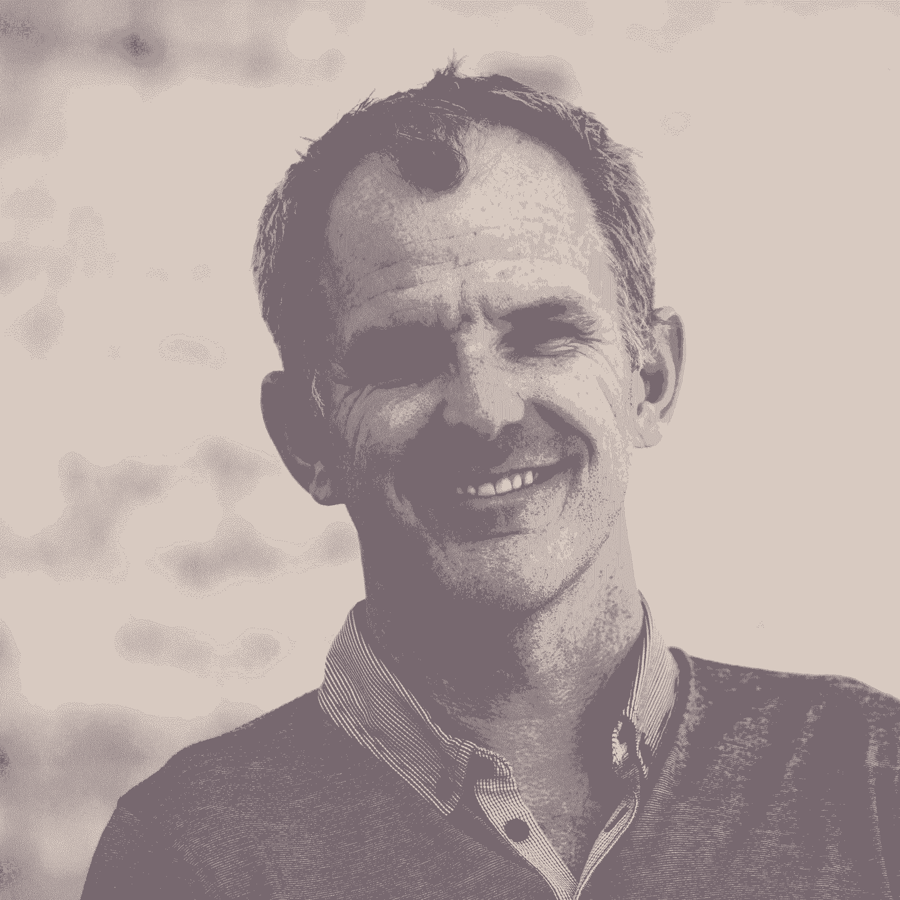

迈克尔·洛普 的夏天有了一个有趣的开始，他[被任命为 Slack](http://www.forbes.com/sites/kathleenchaykowski/2016/05/05/slack-hires-michael-lopp-as-engineering-chief-sources-say/#723baa1b484c "null") 的工程副总裁。在此之前，这位知名的[博客作者](http://randsinrepose.com/ "null")曾在 **Pinterest** 和 **Palantir** 领导过工程，他说他去年读过的最好的书是罗伯特·科勒姆写的 ***[博伊德:改变战争艺术的战斗机飞行员](https://www.goodreads.com/book/show/38840.Boyd "null")****——一本关于约翰·伯伊德的传记，许多人认为他是美国历史上最好的战斗机飞行员“这是对人类如何更有效地做决定的惊人探索，”Lopp 说。*

***他的其他简历:** ***[大桥](https://www.goodreads.com/book/show/2369.The_Great_Bridge "null")*****——**“这是一部关于桥梁仍处于测试阶段的精彩读物。”还有他一直以来最喜欢的作品 ***[【亥伯龙】](https://www.goodreads.com/book/show/77566.Hyperion "null")*** ，这是一部现代版的《坎特伯雷故事集》，以其对世界构建细节的惊人关注而闻名。*

*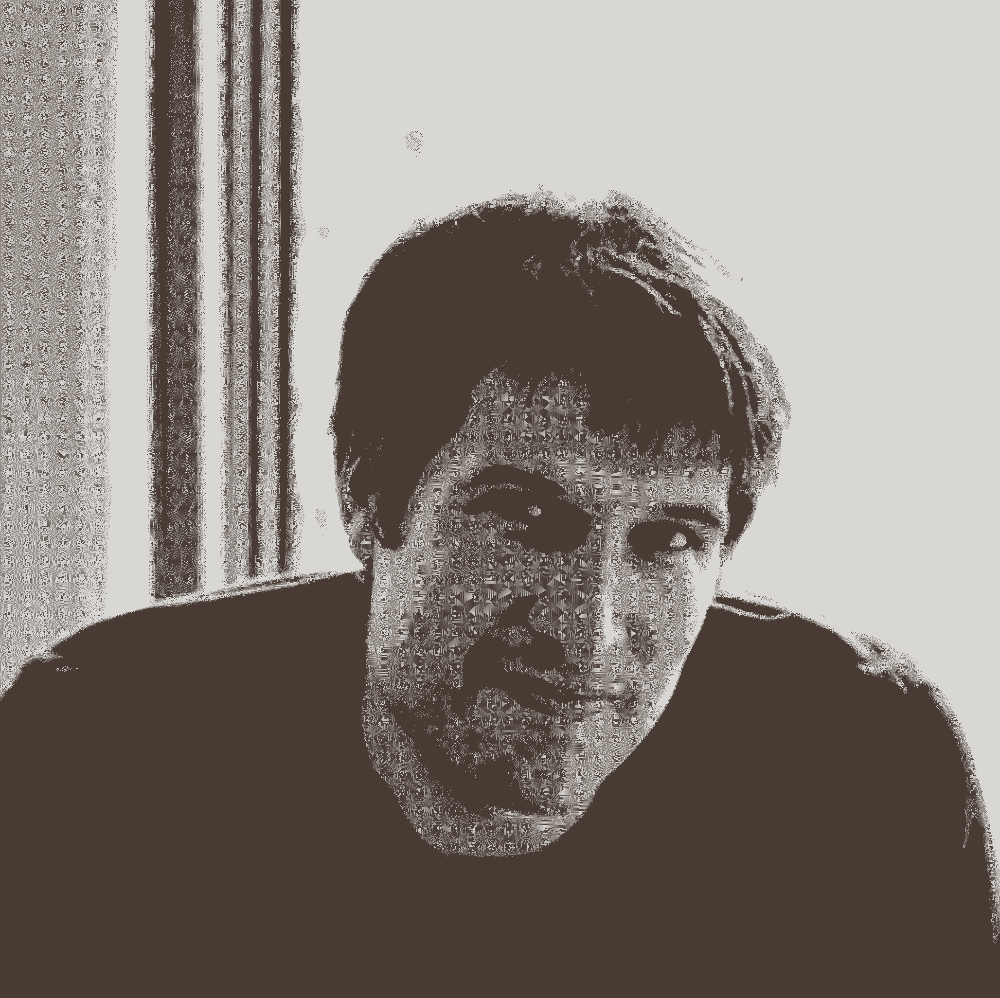*

***[布莱恩·奥凯利](https://www.linkedin.com/in/brianokelley "null")** ，在线广告平台 **[AppNexus](http://www.appnexus.com "null")** 的创始人兼 CEO 也很看重好的决策。他今年的最佳选择:迈克尔·麦格拉斯的《高科技公司的产品战略》，这是有史以来最详细的产品战略指南之一，借鉴了苹果、IBM 等公司形成时期的 250 多个故事。“这只是关于如何做出战略决策的出色的、结构化的思考，”奥凯利说。**他的其他履历:** ***[狼厅](https://www.goodreads.com/book/show/6101138-wolf-hall "null")*** ，身临其境、洞察历史的纪实文学剖析亨利八世宫廷中的忧怨政治，以及他的《有史以来最好的》 ***[云图册](https://www.goodreads.com/book/show/49628.Cloud_Atlas "null")*** ，一个跨越千年讲述的环环相扣的故事与谜团的编织。*

**

***[朱](https://twitter.com/joulee "null")****【脸书】**产品设计副总裁，也因[在媒体](https://medium.com/@joulee "null")上关于设计和管理的真知灼见而声名鹊起。她今年的首选是安迪·格罗夫的 ***[高产出管理](https://www.goodreads.com/book/show/324750.High_Output_Management "null")*** ，这位英特尔前董事长兼首席执行官在书中分享了他对建立高生产率团队和激励人才的观点。“今年格罗夫去世后，我拿起这本书，发现它如此简洁、清晰，充满了易于理解的类比，”卓说。“这确实触及了什么是良好管理的核心。”*

*卡罗尔·德韦克的《她的其他经历: ***[心态](https://www.goodreads.com/book/show/40745.Mindset "null")*** 》，近距离观察如果采取正确的方法，人类如何在一生中学习和成长。“快乐和富有成效在很大程度上与外部发生的事情无关，而是取决于我们自己的想法。我喜欢这本书，因为它清楚地说明了这一点。”然后就是她长期的 1 号， ***[幻影收费站](https://www.goodreads.com/book/show/378.The_Phantom_Tollbooth "null")*** 。“时至今日，我想不出还有比这本书更好的了，它抓住了孩子们如此直观地抓住的生活中的想象力、奇迹和冒险。”*

**

*2009 年，戴夫·吉尔波 与人共同创立了**沃比·帕克**，自那以后，它已经发展到 30 多个零售点，销售其标志性的眼镜。当我们给他发邮件询问他的夏季阅读建议时，他得到了普遍的回应。他的顶级商业相关建议:关于艰难事物的艰难事物，本·霍洛维茨(Ben Horowitz)非常诚实地讲述了通过管理、筹资和扩大规模的创业之旅是多么艰苦(包括他来之不易的生存建议)。我们询问的其他五位领导人也说了同样的话，尽管事实上它已经存在两年多了，证明了一些严重的持久力。*

*他的其他记录: ***[智人](https://www.goodreads.com/book/show/23692271-sapiens "null")***[今年也被比尔·盖茨选中](https://www.gatesnotes.com/About-Bill-Gates/Summer-Books-2016 "null"))由尤瓦尔·诺亚·哈拉里(Yuval Noah Harari)撰写，这是一个令人震惊的简短回顾——考虑到主题——早期人类历史以及它如何解释我们今天的方式。他的最爱？ ***[【枪支、病菌与钢铁](https://www.goodreads.com/book/show/1842.Guns_Germs_and_Steel "null")*** 】，贾雷德·戴蒙德普利策奖得主，研究地缘政治如何以及为何偏爱某些文明而不偏爱其他文明。*

**

***Airbnb**的联合创始人兼首席产品官乔·格比亚(Joe geb bia)[在书中写道，他的年度最佳选择是](https://www.goodreads.com/book/show/7108725-start-with-why "null")***[从 2009 年西蒙·西内克(Simon Sinek)的论文《为什么](https://www.goodreads.com/book/show/7108725-start-with-why "null")*** 开始，该论文论述了为什么一些人和组织往往比其他人更有创造力和更成功，以及这与真实、激励人心的目的有多么紧密的联系。通过大量的案例研究，这本书一次又一次地展示了当人们真正受到鼓舞时是什么样子，以及他们如何在这种感觉的基础上做出真正的改变，并把其他人聚集到他们的召唤中。*

***他的另一部 rec:** ***[【爱的历程】](https://www.goodreads.com/book/show/27845690-the-course-of-love "null")*** ，这部来自阿兰·德波顿的小说密切而细致地跟踪了一段长期婚姻的起起落落，设定了爱情在每个阶段的样子，以及坠入、恋爱和维持爱情的经历如何融入并重塑了人们的其余生活。*

**

***[Bethanye McKinney Blount](https://www.linkedin.com/in/bethanye "null")**最近掀起了波澜——与其他七位杰出的技术女性一起——发起了 **[项目，包括](http://projectinclude.org/ "null")** ，致力于以全面、可衡量的方式提高行业的多样性。作为一名创始人，她曾是 Reddit 的工程副总裁和脸书颇具影响力的技术领导者。她今年的最佳作品是莎拉·郑的《垃圾互联网》，解决网上骚扰的问题(以及潜在的解决方案)。布朗特说:“这是对网络上系统性虐待——尤其是女性虐待——的历史和影响的一个很好的概述。*

*她的其他记录片 : ***[【死灵】](https://www.goodreads.com/book/show/22551730-dead-wake "null")*** 由埃里克·拉尔森(因*白城恶魔*而出名)拍摄，着眼于卢西塔尼亚号悲惨沉没的原因和后果。“这本书有太多关于领导力、失败以及成功者如何书写历史的内容，”她说。她一直以来最喜欢的是稍微轻松一点的:斯蒂芬·金的 ***[塞勒姆的](https://www.goodreads.com/book/show/11590._Salem_s_Lot "null")***——与邪恶的摊牌，其中的恐怖片范·布朗特说，“我 10 岁时第一次读这本书——伟大的父母在工作——但作为一个成年人重读它几乎更可怕。”*

**

*就在三年前， **[克里斯汀·汉密尔顿](https://www.linkedin.com/in/kristenm "null")** 共同创立了 **Koru** 公司，为才华横溢的大学毕业生提供他们实际开创成功且有意义的职业所需的技能。如今，作为首席执行官，她是创业公司如何通过面试聘用最佳人才的专家。同样，她对 2016 年的推荐是丹·夏皮罗的《热门职位:初创公司 CEO 指南》。这是对创始人可能犯的最严重错误的深入探究，以及他们如何避开最严重的错误成为最好的。汉密尔顿说:“这是一个非常清楚自己在说什么的人给出的可靠、现实的建议。”。*

*她的其他经历: ***[【夜马戏团】](https://www.goodreads.com/book/show/9361589-the-night-circus?ac=1&from_search=true "null")*** **，**一场幻术师在交替现实中的奇幻生死战，汉密尔顿称之为“惊人而奇幻——一种伟大的、创造性的逃离商业阅读的方式。”她一直以来最喜欢的是玛丽·多里亚·拉塞尔写的《麻雀》(The Sparrow)，小说分析了如果与外星人接触会发生什么，以及宗教和科学可能会如何交叉。*

***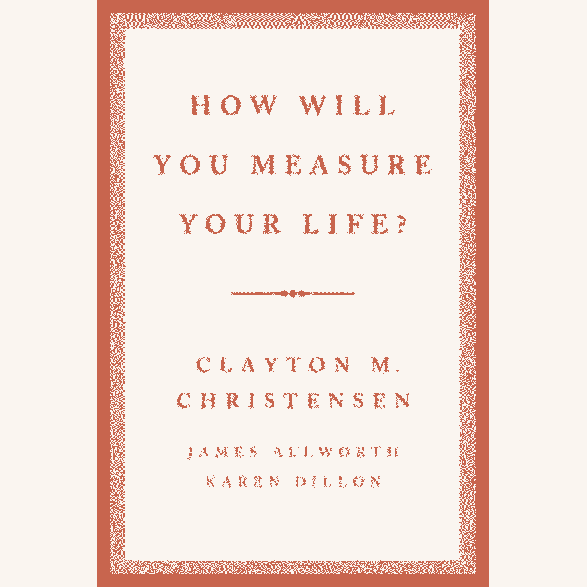*

***[Olivia Teich](https://www.linkedin.com/in/oteich "null")****Dropbox**的产品管理总监，推荐 ***[你将如何衡量你的人生](https://www.goodreads.com/book/show/13425570-how-will-you-measure-your-life "null")*** ，作者:Clayton Christensen。这本书取材于他对哈佛商学院毕业生的一次演讲，内容是什么让生活变得有意义，以及你如何才能深思熟虑、积极主动地创造自己的幸福。“它充满了伟大的见解和轶事，引发了关于什么是真正重要的正确问题，”泰奇说。**她的其他履历** : ***[创意 Inc](https://www.goodreads.com/book/show/18077903-creativity-inc "null")*** ***。皮克斯联合创始人艾德·卡姆尔的*** ， ***[，【哈利·奥古斯特的前十五个生命】](https://www.goodreads.com/book/show/20706317-the-first-fifteen-lives-of-harry-august? "null")*** (“引人入胜、发人深省的历史小说”，以及尼尔·斯蒂芬森最喜欢的反乌托邦科技作品 ***[【雪灾】](https://www.goodreads.com/book/show/830.Snow_Crash "null")*** 。*

*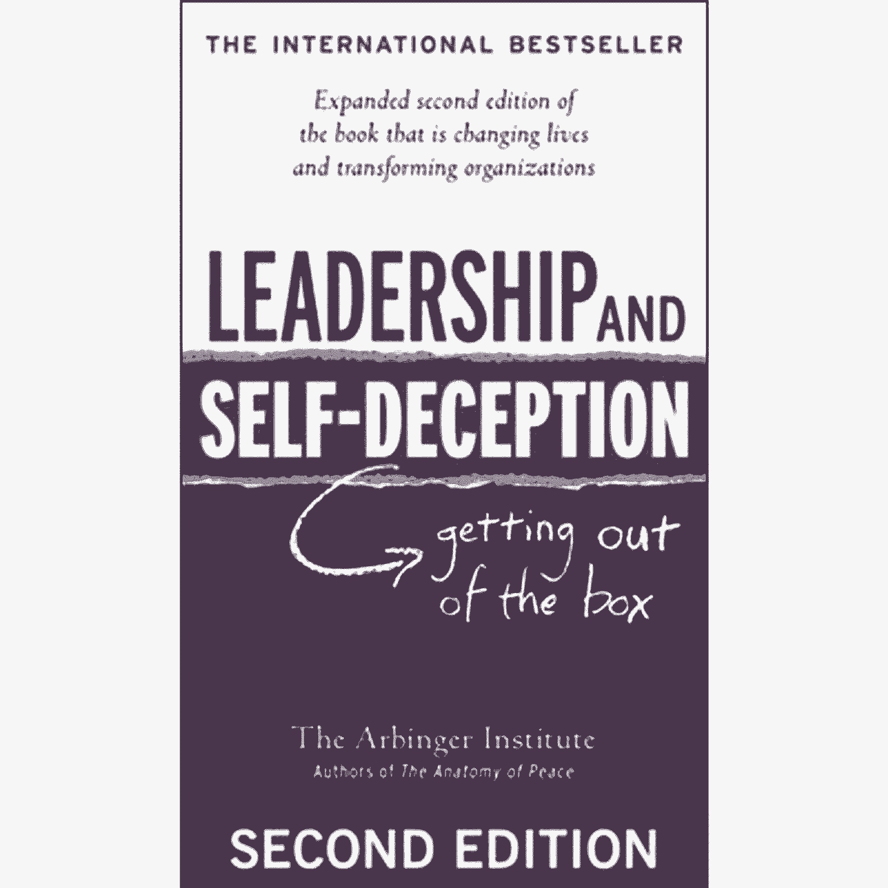*

***Credit Karma**的首席产品官尼克希尔·辛哈尔(Nikhyl sing Hal)*[建议阿宾格研究所(Arbinger Institute)出版的《领导力与自欺欺人](https://www.goodreads.com/book/show/180463.Leadership_and_Self_Deception? "null")* 》一书:“这是一本较好的书，它讨论了工作场所的情商，并触及了人们在相互合作中面临的核心挑战，尤其是在成长型公司。”简而言之，公司领导经常失败，因为他们无意中对自己撒谎。这本书是一套逃离这种自我毁灭行为模式的工具。**辛哈尔的其他 rec:*****[我是朝圣者](https://www.goodreads.com/book/show/18144124-i-am-pilgrim "null")*** ，他说的心理犯罪惊悚片考虑到时事再贴切不过了。*

*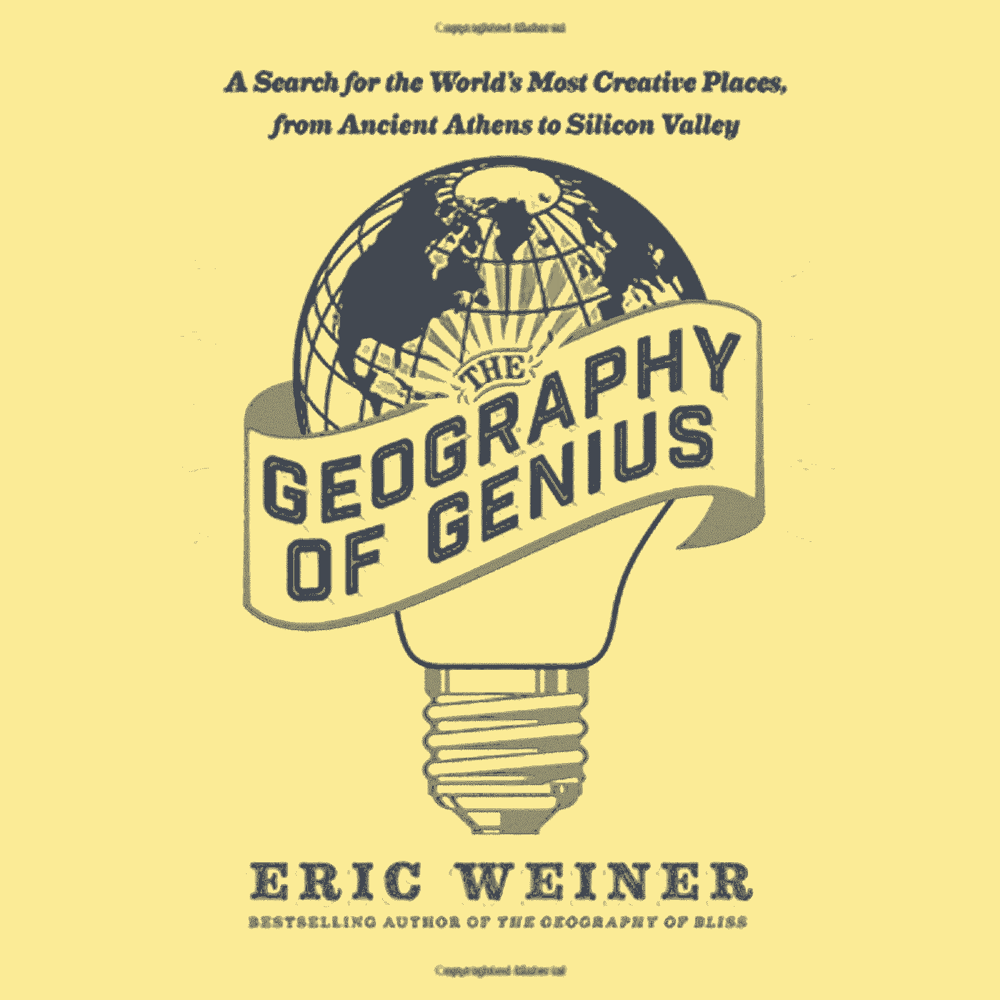*

*备受推崇的创业咨询公司**CCP partners**的首席执行官科琳·麦克里里 ，专注于帮助新企业确定他们的运营、产品和战略。她今年的热门推荐是埃里克·韦纳的《天才的地理》,他环游世界，在不同的时间段进行短暂停留，以确定天才如何以及为什么会茁壮成长。“这本书很好地描述了世界和历史上的社区是如何比其他社区更具创新性的。它也包含一些大惊喜，”她说。**她的其他记录片** : ***[【水的颜色】](https://www.goodreads.com/book/show/29209.The_Color_of_Water "null")******——一个黑人向他的白人母亲致敬*** ，麦克里说，“通过一个家庭的历史抓住了种族的情感和新的理解”，以及她一直最喜欢的， ***[一棵树生长在布鲁克林](https://www.goodreads.com/book/show/14891.A_Tree_Grows_in_Brooklyn "null")*** ，关于牢固的家庭纽带、母亲压力和内在*

*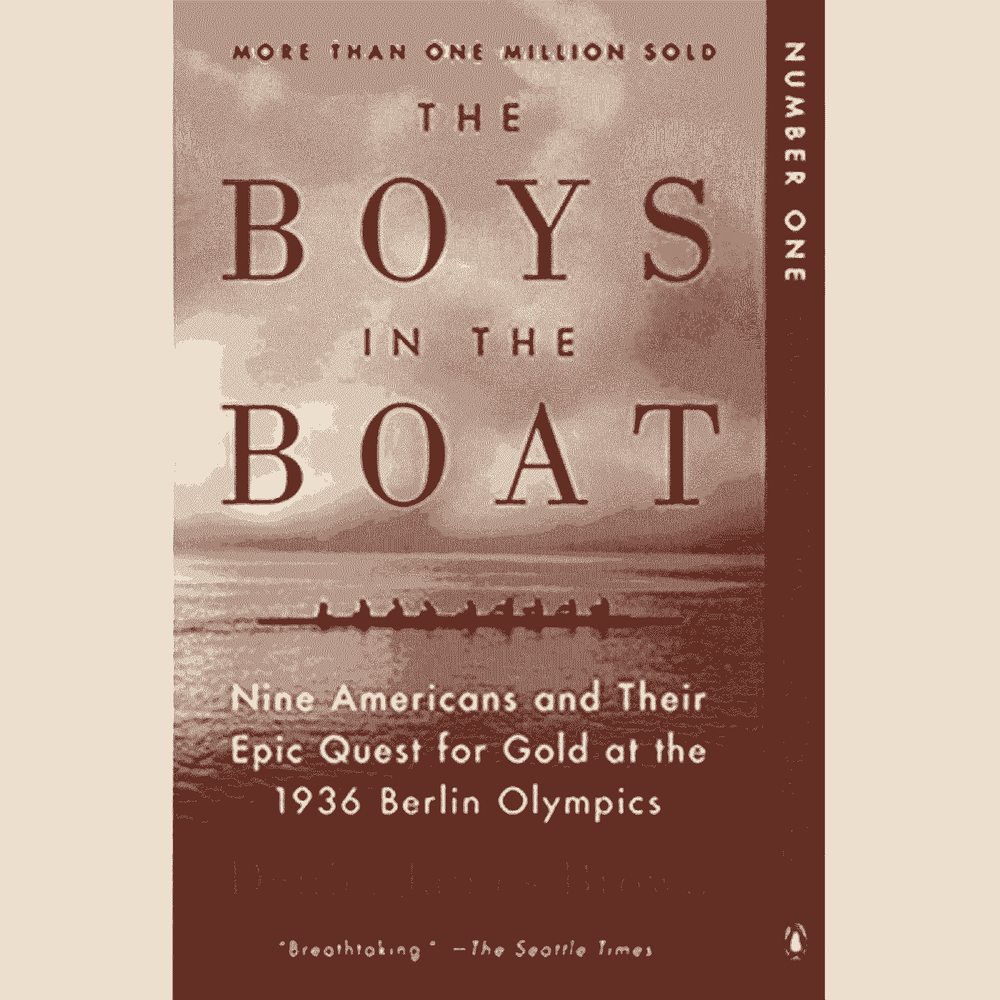*

***[Bre Pettis](https://www.linkedin.com/in/brepettis "null")** 因联合创办 3d 打印公司 **Markerbot** 并担任首席执行官而闻名。如今，他是自己创业公司 Bre & Co .的创始人。今年，他推荐丹尼尔·詹姆斯·布朗的《船上的男孩》，以令人难以置信的细节讲述了美国船员团队在 1936 年柏林奥运会上夺金的故事。充满了古怪，这是对决心和团队合作的庆祝，或者正如佩蒂斯所说:“如果你不一起划船，你就不能在奥运会上打败纳粹。”**他的其他履历** : ***[性对象](https://www.goodreads.com/book/show/26795372-sex-object "null")*** ，女权主义创始人杰西卡·瓦伦蒂的回忆录。“在这个世界上，有无数的评论家穿着内衣坐在互联网上成为可怕的人，瓦伦蒂超越了这一点，说出了它的名字，并将所有的丑陋暴露在光天化日之下。”还有 ***[琥珀眼睛的兔子](https://www.goodreads.com/book/show/7821828-the-hare-with-amber-eyes "null")*** ，讲的是“一批微型日本雕塑的超然之美”和他们走过一个家族的历史，真实而悲壮。*

*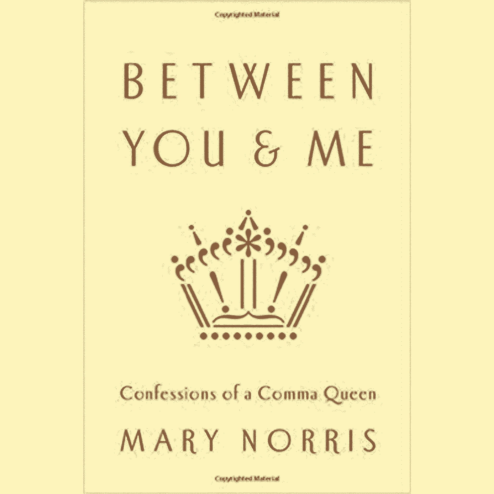*

*乔·多尔西 是一位广受欢迎的媒体培训师和演讲教练，为即将走上聚光灯下的初创企业创始人提供培训。他的夏季推荐是玛丽·诺里斯的《你我之间的 ***[】一个逗号女王的自白](https://www.goodreads.com/book/show/25622752-between-you-me "null")***——一本独一无二的语言指南。多尔斯说:“在我的一生中，我从来没有读过一本关于语法的书，并且笑出声来。**他的其他简历** : ***[罗萨蒙德和本杰明·詹德的《可能性的艺术](https://www.goodreads.com/book/show/85697.The_Art_of_Possibility "null")*** 》，介绍了读者可以在工作和生活中变得更有创造力的 12 种做法；和的《一个小生命》，他说，“它并不短，也不痛，但它带你深入到你永远不会忘记的角色的生活中。和别人一起读。你需要谈论它。很多。”*

*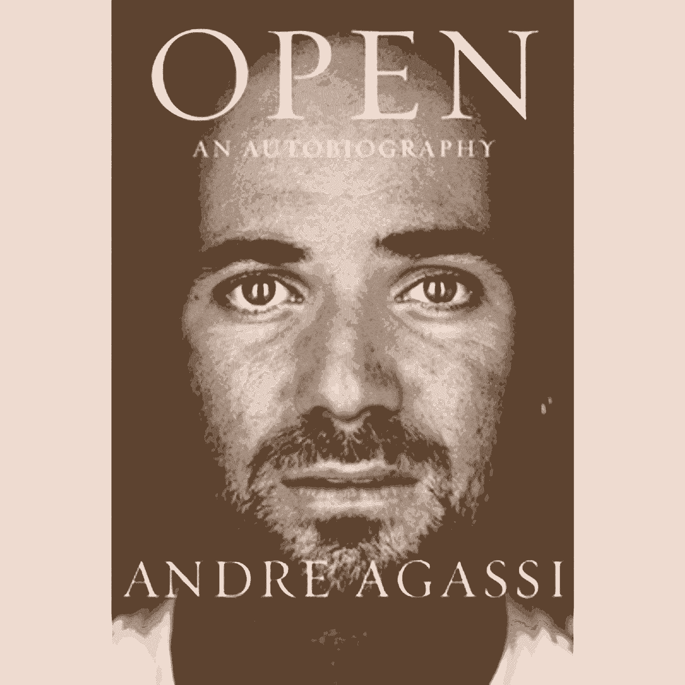*

***[彼得·莱因哈特](https://www.linkedin.com/in/peterreinhardt "null")** 是**部门**的联合创始人兼首席执行官，帮助公司将所有客户数据收集在一个地方，以便他们能够做出更好的决策。他的年度最佳作品是网球传奇人物安德烈·阿加西不同寻常的自传 ***[公开赛](https://www.goodreads.com/book/show/6480781-open "null")*** 。“令人惊讶的是，他对自己的生活如此透明——关于他使用冰毒的次数和他达到这项运动最高水平的时间；”莱因哈特说，他一路上情绪激动。“这是一个关于当你玩一个孤独的游戏时你需要的精神毅力的故事。它让你感觉更有自我意识，适应自己的情绪和自我管理。这是我读过的关于处理压力和紧张的最好的书之一。”**他的其他记录:** ***[萨姆·沃尔顿——美国制造](https://www.goodreads.com/book/show/10631.Sam_Walton "null")*** ，它“让你感受到沃尔玛创始人对学习和改善顾客体验的不断追求。”*

**

***[马修·贝洛斯](http://firstround.com/review/the-case-for-startups-to-make-radical-transparency-the-top-priority/ "null")** 是销售电子邮件工具 **Yesware** 的创始人兼 CEO。他的建议是最有趣的。我们在这里展示的精选作品是乔杰姆·特朗巴的《香巴拉:战士的神圣之路》——一本通过温和的勇气和自知之明来启迪现代生活和自我控制的实用指南。贝洛斯响亮的支持:“在我过去 20 年的职业生涯中，这是唯一对我始终有效的生活指南。”**他的其他履历:**即将出版的 ***创业之旅的诗*** ，即将从 **[reboot.io](http://reboot.io "null")** 出版。“我得到了一个出版前的版本，我一直很喜欢它，”他说。最后，我们本性中的善良天使，史蒂芬·平克的统计调查显示，随着人类变得更加人道，人均暴力事件正在减少。可能很慢，但它正在发生。*

*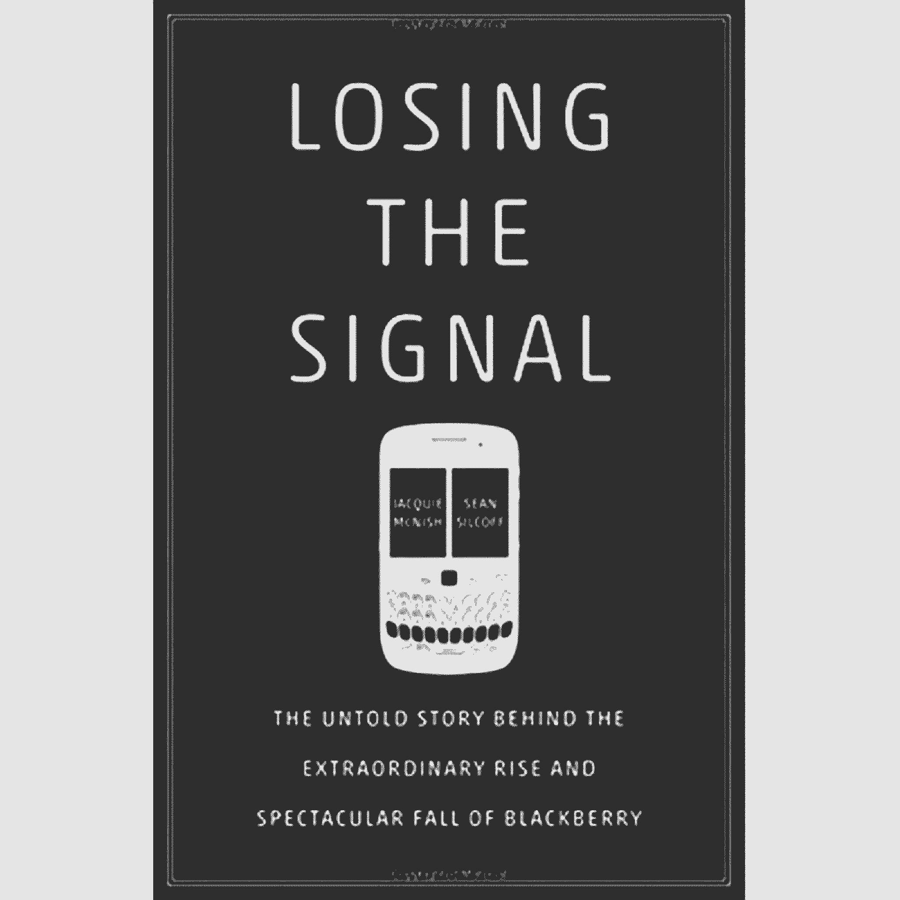*

***[埃里克·马丁](http://firstround.com/review/What-to-Learn-from-the-Man-Who-Managed-Reddits-Community-of-Millions/ "null")** 是 **WeWork** 的会员参与副总裁，他可能是第一个被任命为 **Reddit** 社区经理的人。他推荐了《失去信号:黑莓 的非凡崛起和惊人衰落背后的不为人知的故事》，称之为“一个扣人心弦的生动提醒，提醒人们习惯和技术的变化有多快，尤其是对处于顶端的公司而言。”**他有史以来最喜欢的书** : ***[八月的枪炮](https://www.goodreads.com/book/show/11366.The_Guns_of_August?ac=1&from_search=true "null")*** 历史大师芭芭拉·塔奇曼著。“这本书开始了我对一战的痴迷，它展示了世界是如何从相互关联的君主制和骑兵冲锋转变为现代民族国家之间的化学战的。如果你想看看破坏是什么样子，人类历史上没有比这更伟大的时期了。”*

*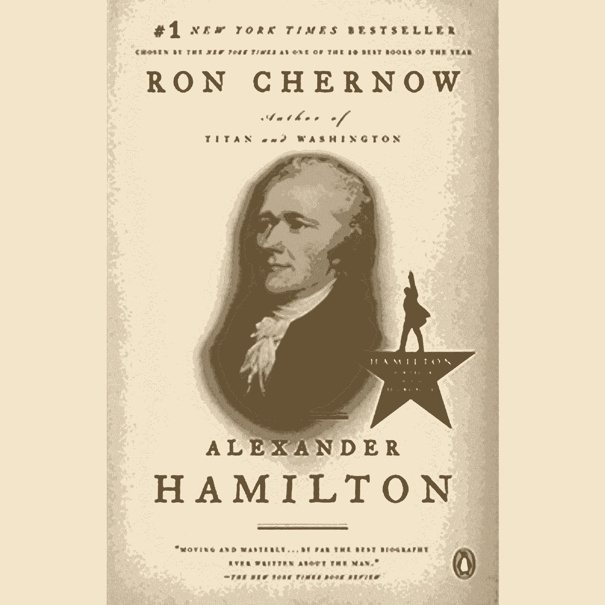*

***[约翰·钱库提](http://firstround.com/review/this-is-how-coursera-competes-against-google-and-facebook-for-the-best-talent/ "null")** ，**微型车库实验室**的联合创始人——前 **Coursera** 首席产品官、**脸书**工程总监——推荐 ***[亚历山大·汉密尔顿](https://www.goodreads.com/book/show/16130.Alexander_Hamilton?ac=1&from_search=true "null")*** 罗恩·切诺。“这是我去年读过的关于创业的最好的书，”钱库提说。“这是关于世界上最伟大的创业公司:美国。以及一个除了努力工作和聪明才智之外一无所有的年轻移民如何克服巨大的逆境成为一名重要的创始人。非常鼓舞人心，有许多关于领导力、说服力、人类政治和管理的课程。”*

*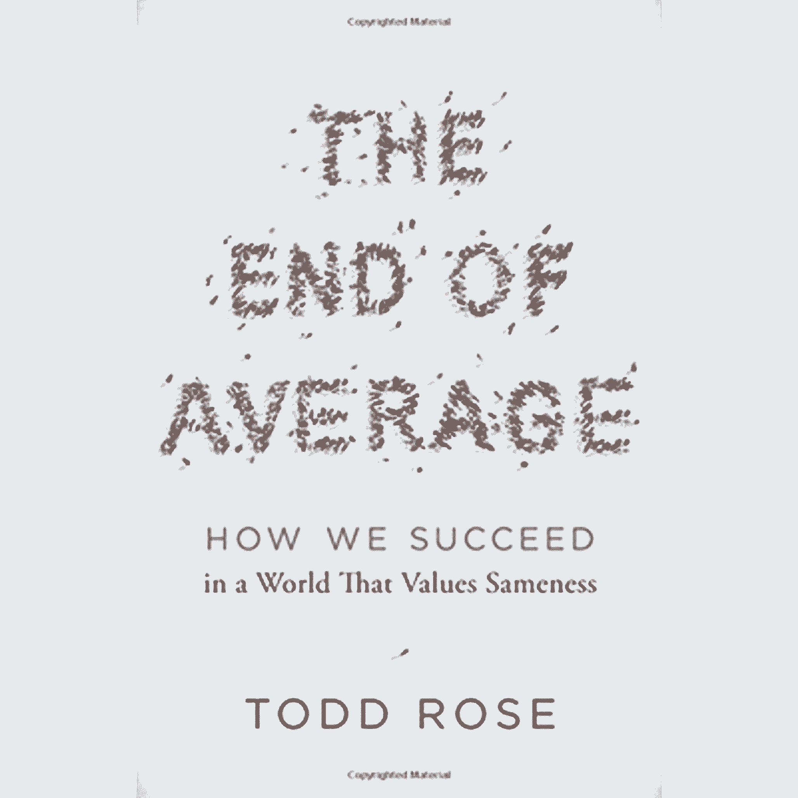*

*最近， **[安妮·德万](http://firstround.com/review/the-adaptable-leader-is-the-new-holy-grail-become-one-hire-one/ "null")** 辞去了**齐格**首席商务官的职位，创办了 **GSV 加速**，这是一家支持企业家积累人力资本以改善学习和职业成果的风险投资公司。她推荐了哈佛科学家托德·罗斯的《平均的终结:我们如何在重视相同性的世界中取得成功》。Dwane 说，它在探索“教育、医学和无数其他领域的个性化机会方面做得很好，这有望推动无数其他机会”。这本书并没有就此打住，而是剖析了对平均水平的强调是如何破坏了社会的方方面面，以及我们能为此做些什么。Dwane，[一个适应性领导](http://firstround.com/review/the-adaptable-leader-is-the-new-holy-grail-become-one-hire-one/ "null")的信徒，会被这种观点所吸引，这是有道理的。*

*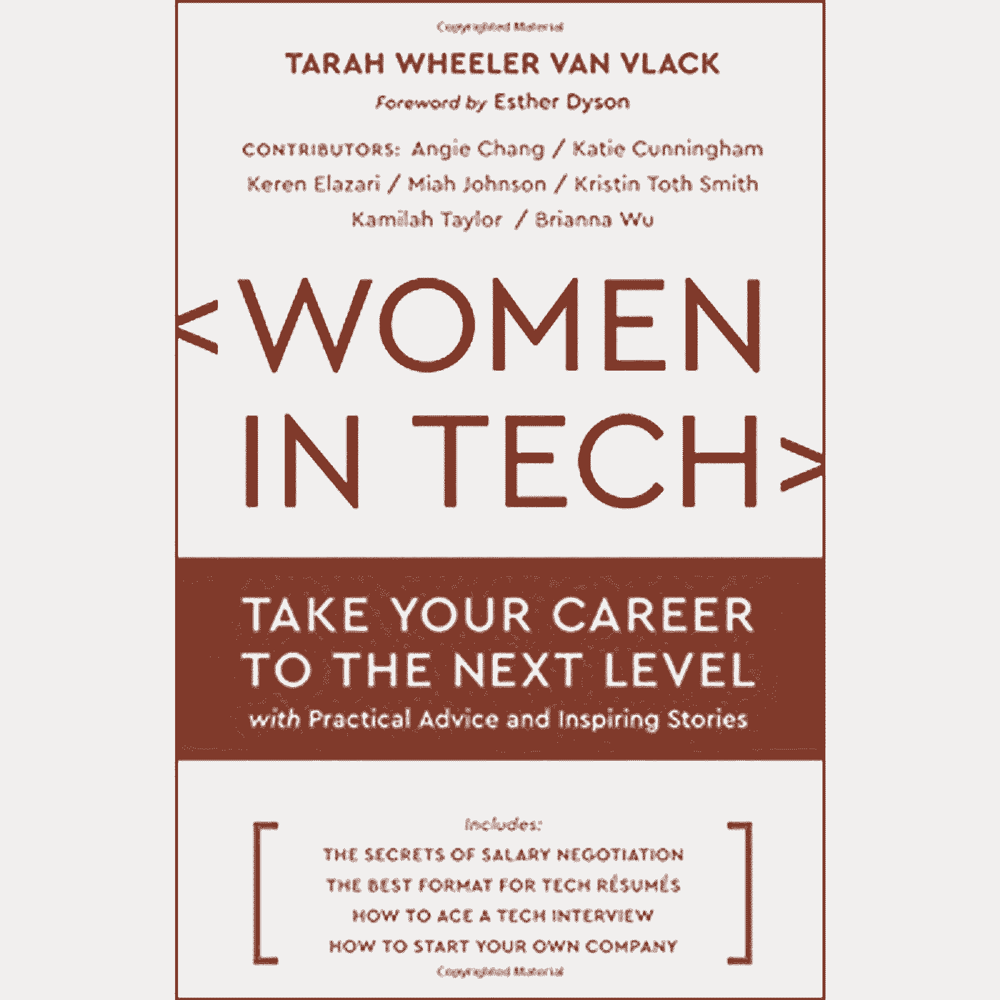*

***Hackbright Academy** 副总裁和 **Women 2.0** 创始人 **[Angie Chang](http://www.twitter.com/thisgirlangie "null")** 建议 ***[技术领域的女性:通过实用建议和鼓舞人心的故事](https://www.goodreads.com/book/show/25852961-women-in-tech?ac=1&from_search=true "null")*** 让你的职业生涯更上一层楼，其中包含针对女性的真实、细致的建议，帮助她们找到合适的工作、协商薪资、寻找晋升机会、创办公司等等。“它实际上是由初创公司高管、开发人员和技术人员撰写的——他们都是女性，”Chang 说。**她的其他简历:** ***[未竟事业——女性男性工作家庭](https://www.goodreads.com/book/show/25614228-unfinished-business?ac=1&from_search=true "null")*** ，看看社会的性别偏见如何阻止我们在工作场所实现平等，以及如果这种平等存在，我们会拥有的 GDP 以及 ***[【获取更多:如何在现实世界中谈判达成目标](https://www.goodreads.com/book/show/8095067-getting-more?ac=1&from_search=true "null")***——常读过的关于在工作和生活中赢得谈判的最有用的书。*

*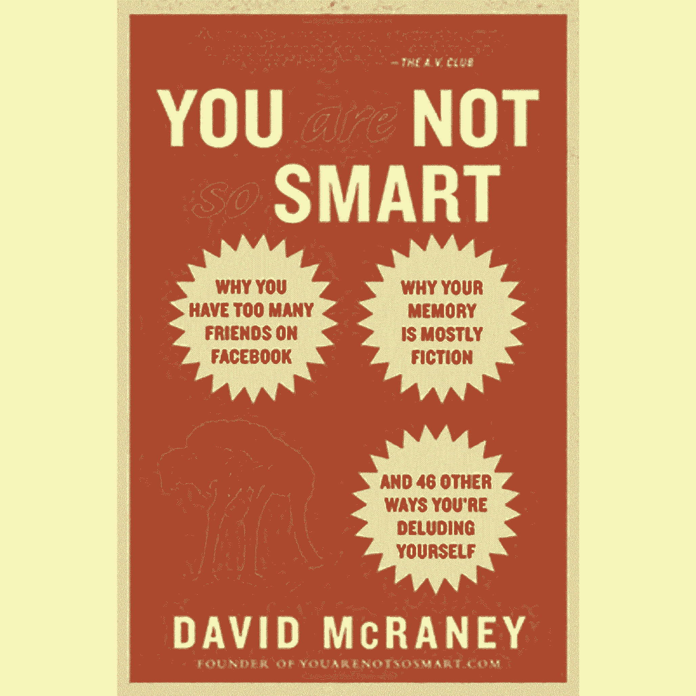*

***[辛迪·阿尔瓦雷斯](http://firstround.com/review/build-your-user-base-with-these-human-behavior-hacks/ "null")** 是业内最敏锐的客户开发和用户体验专家之一，目前在微软内部指导 Yammer 的 UX。她对 ***[竖起两个大拇指:你没那么聪明:为什么你在脸书有太多朋友，为什么你的记忆大部分是虚构的，还有 46 种你在欺骗自己的方式](https://www.goodreads.com/book/show/11709037-you-are-not-so-smart?ac=1&from_search=true "null")*** 。拆开基本的人类心理学，它揭示了我们的逻辑可以是多么的非理性和超脱。阿尔瓦雷斯说:“这是一个很好的速成班，它讲述了许多阻止我们做出最佳决策的认知偏见。”。"大量的例子，引用和提示，以避免落入这些陷阱."[关于这个话题，你可以在这里读到更多她的智慧。](http://firstround.com/review/build-your-user-base-with-these-human-behavior-hacks/ "null")*

*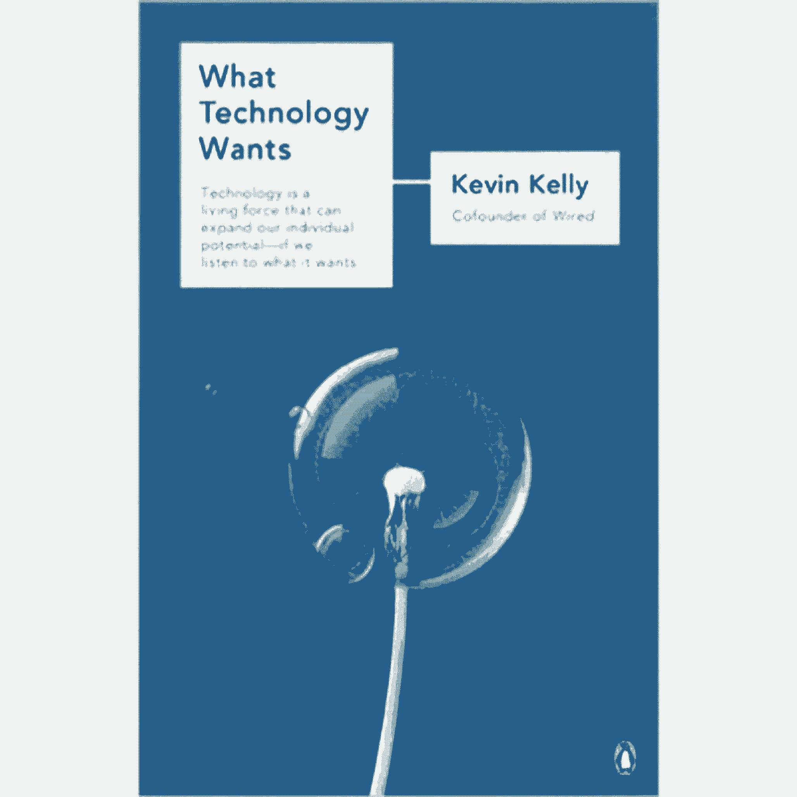*

***[Soleio Cuervo](http://firstround.com/review/Dropboxs-Head-of-Design-on-the-Dawn-of-Personalized-Products/ "null")** ，因在 **Dropbox** 继续领导设计之前创造**脸书**的‘喜欢’按钮而出名，推荐 ***[什么技术想要凯文·凯利](https://www.goodreads.com/book/show/7954936-what-technology-wants?ac=1&from_search=true "null")*** 。“从任何特定的意义上来说，这与技术无关，但它是生物生命的延伸，”Cuervo 说。作者创造了“technium”这个词来指代技术发展的巨大互联状态，并着眼于它如何影响人类生活的质量，那些接受它的人，那些拒绝它的人，以及它对我们共同的未来意味着什么。他的另一本 rec 是 ***[好策略，坏策略](https://www.goodreads.com/book/show/11721966-good-strategy-bad-strategy?from_search=true&search_version=service "null")*** ，他称之为“我读过的关于设计的最好的书”——这是相当高的评价。*

*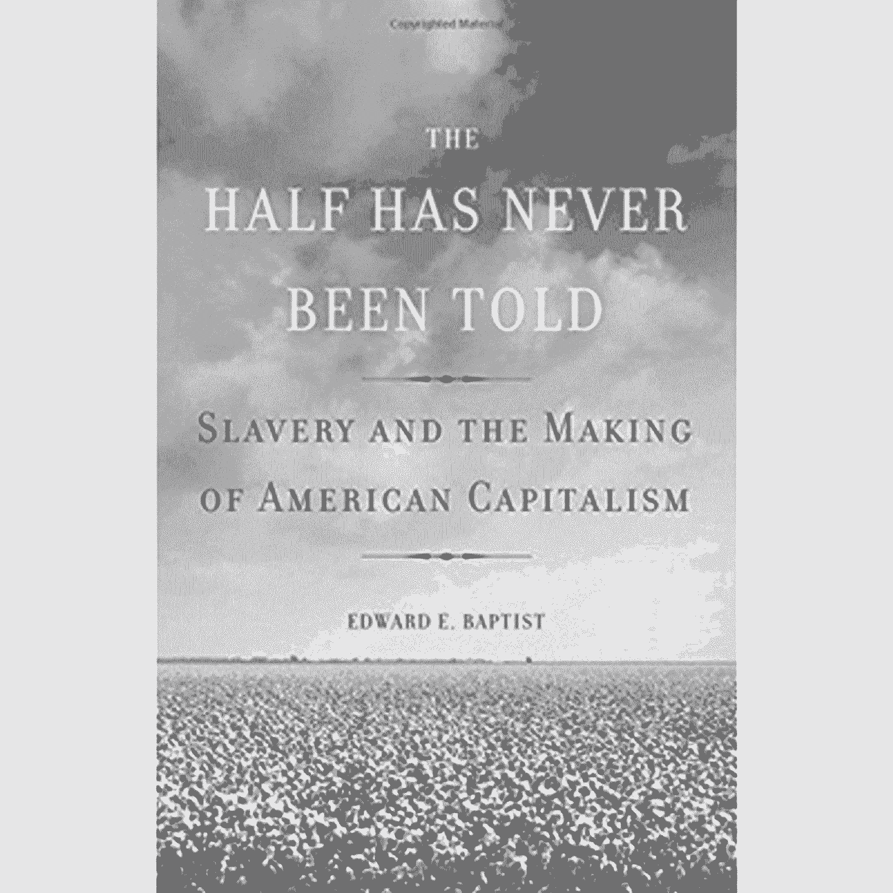*

***[科里·翁德雷卡](http://firstround.com/review/Facebook-VP-of-Engineering-on-Solving-Hard-Things-Early/ "null")** 带领**脸书**冲锋陷阵进入移动担任工程副总裁，在此之前担任《第二人生》制作人**林登实验室**CTO。他今年推荐的是爱德华·施洗者的《一半从未被讲述:奴隶制和美国资本主义的形成》。翁德雷卡说:“这是一部令人心痛但令人大开眼界的电影，讲述了美国回顾奴隶制及其对现代资本主义的影响的安全方式。”。“在一个聚焦于民粹主义和愤怒的选举周期，这是每一个美国人都应该读的书。”简而言之，我们需要停止将我们认为在一个更现代的时代已经取得的任何成功与这一遗产割裂开来。它仍然是我们建国以来的基石。*

*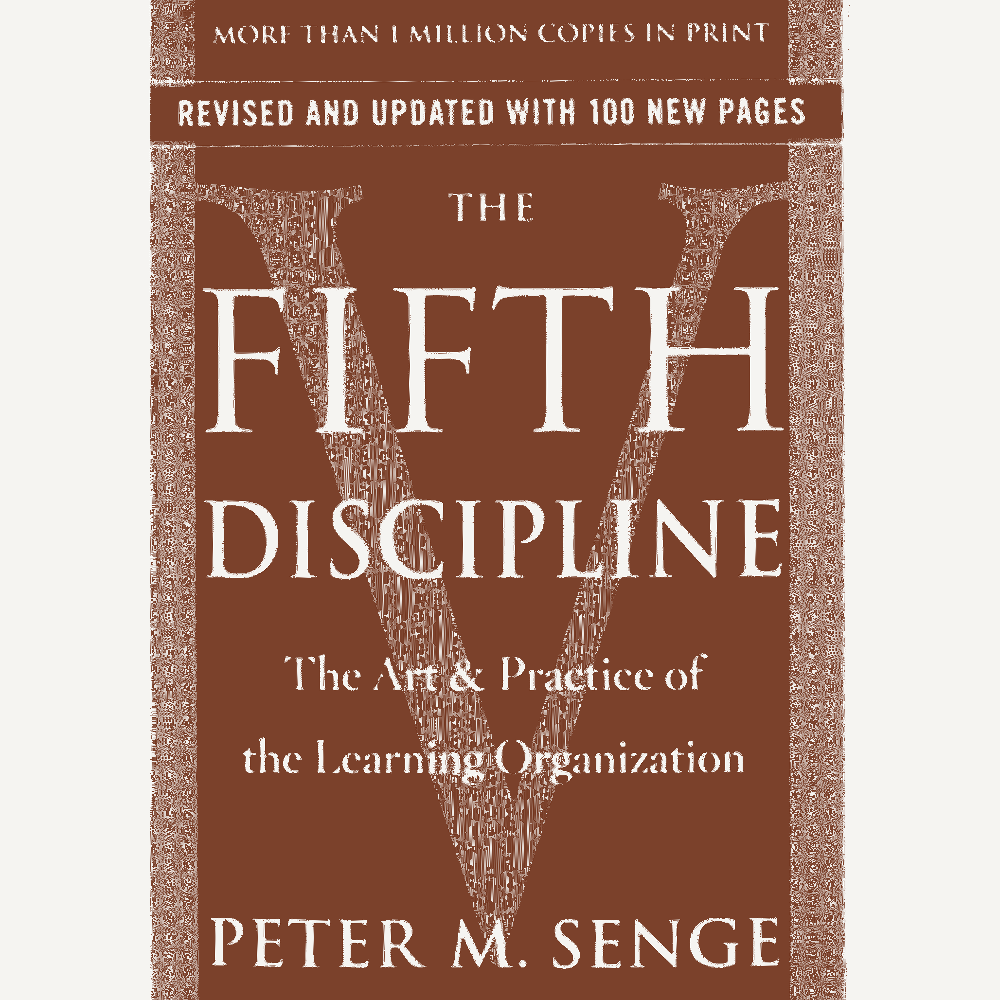*

***[Josh Brewer](http://jbrewer.me/ "null")** 身兼多职，他是来自 **Twitter** 的知名设计校友，后来创建并领导**摘要**和**栖息地**，以及**设计师基金**的导师。他选择的是彼得·圣吉的《第五项修炼》——一个关于如何比你的竞争对手学得更快从而更好地执行量级的极具战术性的叙述。布鲁尔说:“在许多初创公司工作过，现在经营着自己的公司，我观察到好公司和伟大公司(以及产品)之间的一个区别是组织如何面向学习。”。“组织中的人学习得越多，他们为整个公司创造的价值就越多。”*

*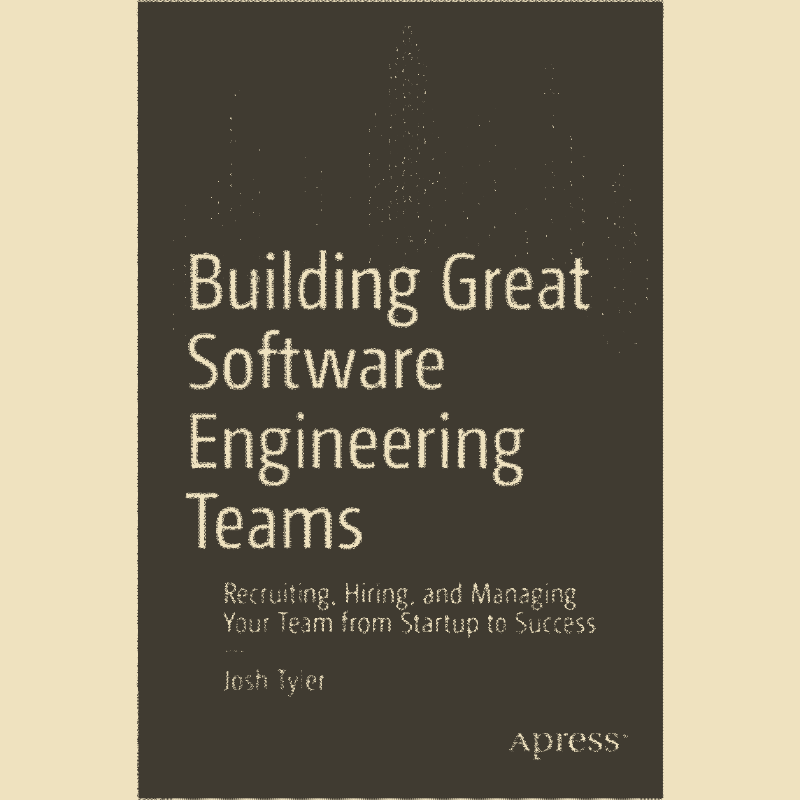*

***[戈登·里奥斯](http://firstround.com/review/What-I-Learned-As-Pandoras-First-Data-Scientist/ "null")** 因成为第一个加入**潘多拉**的数据科学家而闻名，在那里，他仍在努力用机器学习解决关于推荐、品味和音乐的难以置信的难题。他的建议是 ***[建立伟大的软件工程团队](https://www.goodreads.com/book/show/26341904-building-great-software-engineering-teams?ac=1&from_search=true "null")***——这是一本从招聘策略到日常管理的手册。里奥斯说:“作者乔希·泰勒(Josh Tyler)为建设硅谷的济贫院——高功能软件团队——精心编写了一本简明扼要、重点突出的指南。他的亚军 rec: ***[《骰子与人——龙与地下城的故事》和玩它的人](https://www.goodreads.com/book/show/15803047-of-dice-and-men?ac=1&from_search=true "null")*** 。“它追溯了角色扮演游戏的历史，以及围绕想象游戏创造了整个行业的企业家，”他说。*

*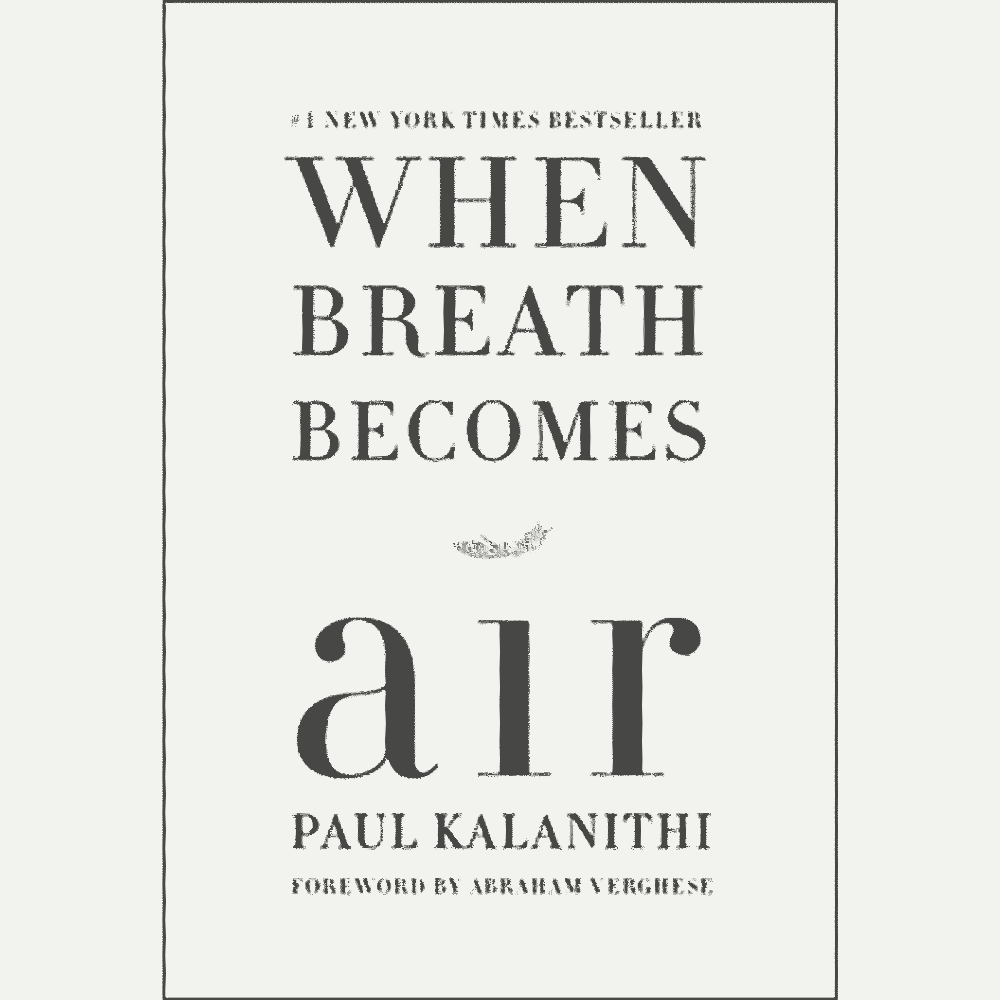*

*塔玛拉·斯特芬斯 加速了许多初创公司的发展，其中就有康普和 Path chief。在前者被收购后，她现在负责微软的移动业务开发。她向我推荐保罗·卡兰尼蒂写的感人至深的回忆录《当呼吸变成空气时》。在这本书里，我们要面对一个大问题:面对死亡，是什么让生命变得有价值。“它让人们重新审视生活——这在硅谷非常重要，”斯蒂芬斯说。她的亚军作品是 ***[【优雅地领导:自信、真实和有效领导的女性指南](https://www.goodreads.com/book/show/29474100-leading-gracefully?ac=1&from_search=true "null")*** ，她称之为“女性发挥其天生优势以产生重大影响的伟大方法。”*

*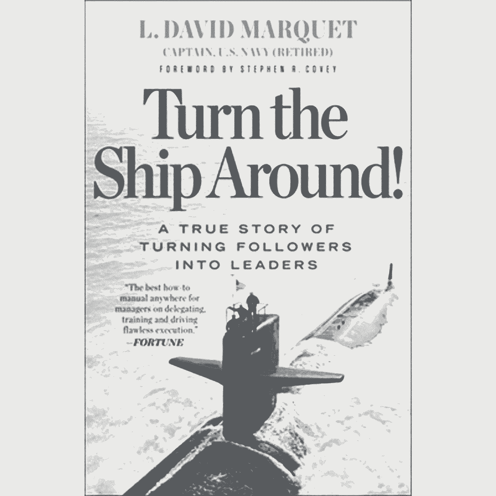*

***[林恩·帕金斯](http://firstround.com/review/Urbansitter-Lynn-Perkins/ "null")****urban sitter**CEO 提交 ***[扭转乾坤:把追随者变成领导者](https://www.goodreads.com/book/show/16158601-turn-the-ship-around?ac=1&from_search=true "null")*** 的真实故事。一艘核动力潜艇的舰长必须找到一种方法来克服不良的士气、表现和保留，以完成一项极其重要的工作，没有出错的余地。“我获得了很多在组织的各个层面教授领导力的技巧，”珀金斯说。“当你正处于成长阶段，当你的年轻员工拥有巨大潜力但缺乏经验时，这是一本很好的书。”这一年，她还是《魔女:倾城之恋 中的结界、恐怖、解脱》的 ***[季粉丝。“如果你住在旧金山，或者对这座城市感兴趣，你必须读一读这本书，”她说。“这是一部读起来像小说的非小说作品，涵盖了这座城市在 20 世纪 60 年代和 70 年代最激进的变革时期。”](https://www.goodreads.com/book/show/20601441-season-of-the-witch?ac=1&from_search=true "null")****

*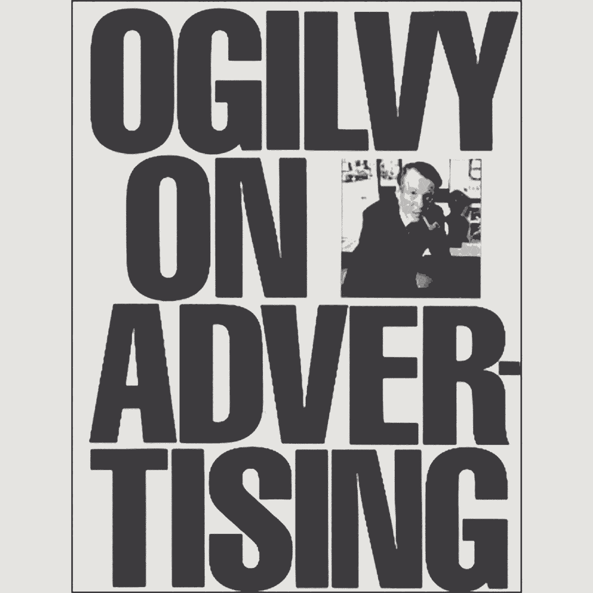*

*品牌专家 **[Arielle Jackson](http://firstround.com/review/Positioning-Your-Startup-is-Vital-Heres-How-to-Do-It-Right/ "null")** 接触过很多标志性的科技产品。特别是，她在**谷歌**工作了 9 年，为 **Gmail** 定义产品营销，随后为 **Square** 领导零售合作伙伴关系。如今，她为许多初创公司的信息、外观、感觉和上市策略提供建议。她的选票投给了奥美广告上的*大卫·奥格威本人。“对营销界的任何人来说，这都是真正的经典。这本书已经有 30 多年的历史了，但它的指导几乎完全适用于今天——在历史和所有那些精美的经典广告的背景下学习这些概念很有趣。”她的其他 rec: ***[全脑子](https://www.goodreads.com/book/show/10353369-the-whole-brain-child?from_search=true&search_version=service "null")*** 。“我喜欢心理学和神经生物学的交叉，”她说。“这本书将它与如何成为一个更好的父母的策略建议结合起来，并帮助你的孩子学会谈论他们的情绪。”**

# **二等奖；荣誉奖；H 奖**

*****[向谷歌巴士扔石头](https://www.goodreads.com/book/show/25734304-throwing-rocks-at-the-google-bus "null")*** 道格拉斯·拉什科夫。“这促使我思考为什么旧的公司结构模式是不可持续的，”Abl 创始人兼前 Yammer 首席技术官亚当皮索尼说。**

**由阿尔伯特-巴拉巴斯联系起来。“新的网络科学渗透到我们现在做的每一件事，”凯西创始人兼首席执行官比尔·巴尔海德说。"写于脸书之前，这本书以惊人的精确度预测了世界将会是什么样子。"**

*****[重塑组织](https://www.goodreads.com/book/show/20787425-reinventing-organizations "null")*** 弗雷德里克·拉鲁著。Meebo 的联合创始人和 CXO**[伊莱恩·韦里](http://firstround.com/review/The-inside-story-of-how-382-recruiters-pursued-an-imaginary-engineer/ "null")** 说:“这是过去几年里写的为数不多的几本全面的组织理论书籍之一，虽然发人深省，但并不自我推销。**

*****[所有单身女士](https://www.goodreads.com/book/show/25814394-all-the-single-ladies?ac=1&from_search=true "null")*** 丽贝卡·特莱斯特。“如果你想了解今天在美国作为一个成年女性是什么样的，你必须读这本书，”产品经理萨曼莎·戈特勒说。**

*****[你的大脑在工作](https://www.goodreads.com/book/show/6899290-your-brain-at-work?ac=1&from_search=true "null")*** 大卫·洛克著。“了解我们的大脑如何在一天的工作中运作对我来说真的很有启发，特别是因为我管理其他有大脑的人，”杰森·施蒂曼说，， **Lucid** 的首席执行官，著名的前**媒体**和**推特**高管。**

*****[埃隆马斯克:特斯拉、SpaceX 和对梦幻未来的追求](https://www.goodreads.com/book/show/22535480-elon-musk?ac=1&from_search=true "null")*** 阿什利万斯著。“不仅是马斯克，还有 PayPal、特斯拉、SpaceX 以及这些公司实际运营方式的背景资料，”Slack 工程总监 Julia Grace 说道。**

*****[事情交代者](https://www.goodreads.com/book/show/25329850-thing-explainer?ac=1&from_search=true "null")*** 兰道尔·门罗。“这很有趣也很有用，”尼尔·罗斯曼 说，他是亚马逊**和 Zynga**的前工程副总裁。"他只用普通词汇的手法是一种巧妙的限制，将复杂的主题向所有人开放。"******

*****[狂言粉丝](https://www.goodreads.com/book/show/56501.Raving_Fans?ac=1&from_search=true "null")*** 肯尼斯·布兰查德库尔特。“简短、简单、高效，”Clover Health 创始人兼首席执行官 Vivek Garipalli 说。**

*****[鲁皮亚斯小姐](https://www.goodreads.com/book/show/334818.Miss_Rumphius?ac=1&from_search=true "null")*** 作者芭芭拉·库尼。“这是一本儿童读物，但它讲述了寻找一个使命，以及我们并不总是知道那是什么的事实，”推特**前工程总监 **[大卫·洛夫特斯尼斯](http://firstround.com/review/this-90-day-plan-turns-engineers-into-remarkable-managers/ "null")****说。“你只需要敞开心扉，睁大眼睛。”******