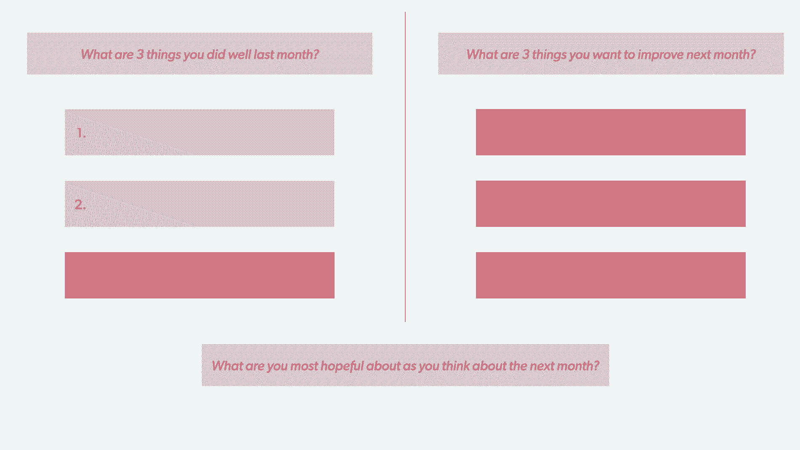
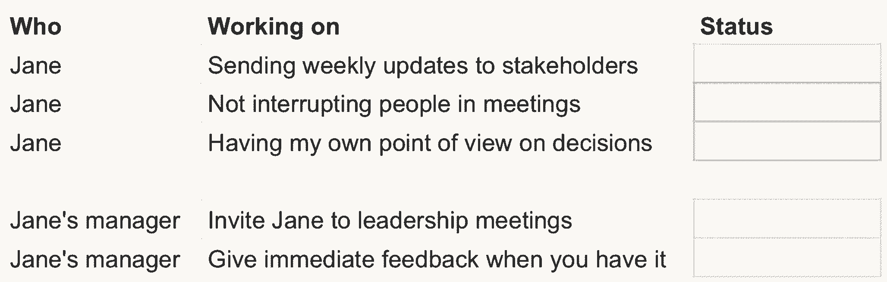

# 高影响力经理的 25 个微习惯

> 原文：<https://review.firstround.com/the-25-micro-habits-of-high-impact-managers>

## 介绍

管理有时看起来就像盯着一大块大理石——这是一项需要正确工具的艰巨任务。根据我们的经验，大多数管理建议往往专注于解决最大的问题:通过招聘组建高绩效团队、提供强硬的反馈以及定期检查。当然，定期举行一对一的会议和诚实的绩效评估是你的经理清单上的关键项目，但雕刻一件宏伟的艺术品也依赖于更精细的雕刻工作，一点一点地塑造这块石头。毕竟，正是最小的动作和复杂的细节工作使得一尊雕像值得在博物馆里展示。然而，这往往被忽视了。

"**你拥有一个伟大经理的标志是你直到后来才想到的行动。**每周谈话的一部分，他们停下来倾听团队的意见，直到每个人都有机会分享他们的想法。或者他们拉你参加支持对话的方式，知道你可能会冒风险，但他们总是支持你。哪怕只是偶尔过度分享自己的生活，以显示你也是人，”**[Corvus 保险公司的高级产品经理迈克尔·凯拉](https://www.linkedin.com/in/michael-kellar/ "null")** 说。

这引发了我们的思考——有哪些日常小习惯经常不被注意，但当它们联系在一起时，就会在经理和直接下属之间形成一个难以置信的强大链条？为此，我们在过去几周联系了第一轮社区的所有人，征求他们对这个问题的看法:

在你的职业生涯中，一个伟大的经理做过哪些让你印象深刻的小事？

接下来是一份不容错过的清单，列出了 25 个有针对性的策略来提升你的管理水平——不需要死记硬背的训练。一些人讲述了他们作为职业生涯中最喜欢的经理的直接下属的经历。我们钦佩的其他拥有丰富人事管理经验的初创企业领导人也打开了他们自己的剧本。无论你是一名全新的经理，一名经验丰富的兽医，还是有在未来担任管理角色的目标，都有大量的领导力发展策略供你记下。

为了让这个庞大的列表更容易理解，我们把它分成了八个类别——使用左边的大纲导航到每个部分。每个类别都由一项软技能定义，如脆弱性和建立信任，然后是一些将这些无形的特质付诸实践的技巧，如每月反思或谨慎提供反馈的策略。我们整理了这个列表，希望你能找到至少几个你很想尝试的想法——以及对那些让杰出经理脱颖而出的微观行动的更多赞赏。

# 让你的团队像老板一样行事。

大多数人不打算进行微观管理——但是当优先事项堆积如山，你自己的老板催促你在临近的截止日期前更新时，从你的团队中接管的冲动是很难忽视的。但是打破这个习惯是至关重要的，让人们有机会伸展肌肉，否则肌肉会萎缩，并阻止他们发挥全部潜力。

## **1。不要回避辩论。**

“回顾我的职业生涯，我最喜欢的经理允许我拥有决策权，即使他们不同意我的观点。他们不能对每一个决定都这样做——有些决定代价太高或者很难改变。但是如果他们发现了一个让我拥有决定权的机会，他们会让我去做。这之前通常会有激烈的辩论，他们挑战我的假设，迫使我思考各种结果。然后他们给了我做决定的空间，给了我失败和学习的空间(有时还会给他们惊喜)， **Tally** 的工程副总裁**Jan Chong**说。

UserLeap 的运营副总裁肖恩·特沃斯基(Sean Twersky )建议经理们记住一个特定的短语——并随意使用。

“我相信你，打电话吧”可能是你能从主管那里听到的最有力的六个字。

## **2。不要吝惜你的想法。**

Camille Ricketts, Head of Marketing, Notion

“我遇到过的最好的经理擅长提出伟大的想法。他看到了不可思议的市场机会，并不断思考可以改善我们产品的计划。但是使他成为最优秀的人的是他如何将这些想法传递给团队，并将其付诸实践。与他们一起，他会分享他最大的信心，我们会让他们比他想象的更好。这使我能够从事职业生涯中最具创造性的工作，我在前进的道路上感受到了支持和信任。

## **3。把自己当成球队队长，而不是主教练。**

“我相信健康的成年人不会从‘瀑布式’权力结构中获得任何快乐。

**启迪实验室**的数据库管理员 **[迈克尔·帕皮特](https://www.linkedin.com/in/michaelpapet/ "null")** 说:“当经理明白他们的角色是优先事项的协调者，而不是从权威的角度采取行动时，他们通常会接受更广泛的概念，即成为团队的一部分，每个团队成员都对成功负有同等责任，被信任像成年人一样完成他们的工作。

**[**Outlier**公司的高级客户成功经理克莱尔·伯恩](https://www.linkedin.com/in/claire-byrne-2136231b/ "null")** 简单地说:

最好的管理者“问”的比他们“说”的多

## **4。与跨职能合作伙伴定下基调。**

给予直接下属以所有者身份运营的自由超出了你的直接团队——在整个公司架构中编织这条线。“通常，公司的其他领导可能会找我作为合作伙伴来推动决策或计划。我尽量建议他们直接去找我的一位直接下属，而不是直接进入正题。我会与合作伙伴和我的直接下属沟通，告诉他们如果需要的话我可以随时提供帮助，但我相信我的直接下属有充分的决策能力，”Edwin ChauEdwin Chau 说道，他是 **Brex** 的工程总监。

# **脆弱而有自知之明。**

多年来，在管理界，一直有关于把我们整个人带到工作中的更大的对话，一旦我们都开始从厨房的桌子上远程工作(孩子、宠物和一堆要洗的衣服都在 Zoom 上处于前沿和中心)，这种对话就变得更加频繁。我们正在摆脱我们更加坚忍的“工作角色”，并为之前不在办公室展示的  更混乱的情绪腾出空间。

正如**[Humu](https://www.linkedin.com/in/liz-fosslien/ "null")**[的内容负责人 Liz Fosslien](https://review.firstround.com/these-seven-emotions-arent-deadly-theyre-your-secret-career-superpowers "null") 之前在评论中写道的那样——这是一个早就应该进行的清算，高影响力的领导者需要通过向他们的团队展示真实性来设定基调，而不是总是假装勇敢。“情绪之所以名声如此之差，部分原因是我们长期以来一直试图将情绪排除在工作场所之外。**我们压抑我们感觉到的一切，这意味着我们不会在问题还可以控制的时候解决它们。相反，我们的感情恶化了，”她说。**

## **5。写下让你心动的东西。**

Dennis Yu, Chief of Staff and VP of Program Management, Chime

“优秀的经理通过分享他们的工作方式偏好和发展领域来展示自我意识和同理心。我一直很欣赏经理们提供入职指南，介绍他们是怎样的一个人和一名经理。这应该包括他们的工作风格、对其领导的期望、价值观和动机、他们正在处理的反馈领域以及决策偏好，”**Chime**的参谋长兼项目管理副总裁余允抗说。(如果你想将这一点付诸实践 **PatientPing** 联合创始人兼首席执行官**[Jay Desai](https://www.linkedin.com/in/jdesai01/ "null")****[在这篇评论中概述了创建用户指南](https://review.firstround.com/the-indispensable-document-for-the-modern-manager "null")的重要性，并提供了大量例子来帮助你开始创建自己的用户指南。)**

**作为脸书****[新产品实验团队的产品负责人，苏妮塔·莫汉蒂](https://www.linkedin.com/in/sunita-mohanty/ "null")** 甚至尝试在与顶尖候选人的面试过程中分享她的团队的用户手册。“这能建立心理上的安全感和信任感，并能为透明和诚实的自省设置一个清晰的标杆。她说:“当人们在考虑你的团队时，我发现这是与潜在团队成员达成一致的一个好方法。****

## ****6。照亮失败。****

****除了分享她的工作指南，Mohanty 还实施了一个每周习惯，让她的团队成员更加稳定，即使在磕磕绊绊中。“当你树立了一个脆弱的榜样时，这就为团队更大的心理安全创造了空间。随着我职业生涯的发展，我明白了表现出一些脆弱是可以的——无论是关于个人挑战还是我在工作中遇到的困难。因此，它与我的报告建立了更深层次的关系，让我觉得表达疲惫感或其他糟糕的感觉没有问题，”她说。为了掌握策略，莫汉蒂建议经理们每周分享一次高潮和一次低谷，无论是在团队会议上还是在每周的电子邮件中，以创造一个反思和透明的氛围。****

****对任何人来说，谈论失败都不容易——尤其是对那些觉得人们指望他们把事情做好的经理来说。但是没有人是一贯正确的，在一家快节奏的初创公司工作依赖于人们感觉他们可以尝试新的想法并很快失败。“分享一个你在个人或职业上失败的故事，以及你从中学到了什么。它揭示了我们都是人，都处于同一水平。万神殿货币化和定价策略高级总监 **[Trish Leung](https://www.linkedin.com/in/trishleung/ "null")** 说:“这让团队成员可以分享他们的担忧，觉得失败也没什么。****

## ******7。拉开窗帘。******

****不要犹豫，也要敞开心扉谈论有趣的事情——尤其是当工作压力越来越大的时候。“分享你个人的最新进展，或者只是你办公室之外的一件趣闻——不需要太大、太重要或者太详细。甚至像这样简单的事情，“我儿子今天第一次这么做，太可爱了！”这让员工也觉得他们可以把整个自我带到工作中，并与团队成员分享。这在一个偏远的世界里尤其重要，在那里人们更容易感到孤立和不联系，”运营主管**下标**李霄云说。****

# ******成为值得信赖的思想伙伴******

****当一家初创公司开始上升并且[越过 MVP 阶段](https://review.firstround.com/dont-serve-burnt-pizza-and-other-lessons-in-building-minimum-lovable-products "null")时，有许多功能、营销活动或销售策略需要处理。为了保持敏捷，影响力大的经理们必须在擅长基础知识和玩弄新点子之间找到平衡。****

## ******8。留出思考的空间。******

****

Jaleh Rezaei, Co-Founder & CEO, Mutiny**** 

****“一家初创公司不只是发展得快，它的发展速度也很快。[我们的工作变化太快](https://review.firstround.com/give-away-your-legos-and-other-commandments-for-scaling-startups "null")，需要不断调整我们的运作方式以保持高效。每月反思是我发现的在责任不断增加的快节奏环境中衡量自己的唯一最有价值的工具。这也是我们建立信任的地方，我对每个团队成员都表现出关怀，这反过来让我每天都能更努力地推动团队，而不会受到侵蚀，”**哗变**的联合创始人兼首席执行官 **[Jaleh Rezaei](https://www.linkedin.com/in/jalehr/ "null")** 说。([她提出的加速营销引擎的框架](https://review.firstround.com/your-marketing-org-is-slow-heres-a-framework-to-move-faster "null")是营销领导者的必读回顾。)****

****她建议每月与每个团队成员召开一对一的会议，在会上汇报上个月进展顺利的三件事，以及他们希望下个月有所不同的三件事。然后 Rezaei 分享了她自己的 3x3。对话以乐观的语调结束:当你考虑下个月的时候，你最有希望的是什么？[要入门，可以借用她的模板。](https://docs.google.com/document/d/1X1EM39j_dda2I6sDZdiK9DwJwdE_hlJ3apFpdGszT_o/edit# "null")****

********

****当我们走得太快时，我们的发展领域往往会被放大，我们会掩盖自己的优势和影响。没有花时间定期反思，我们就不能足够快地调整我们的行为——坏的模式开始出现，我们忘记庆祝我们的胜利。****

## ******9。预留时间跳出框框思考。******

****

Jeannie Chun, People Business Partner, Sift**** 

****虽然你可能已经与直接下属建立了某种定期的每周检查，但这些会议块会很快被基本的状态更新吞噬，而不是更大的想法。专门抽出时间来变得有创造力。Sift 的商业伙伴 Jeannie Chun 建议留出时间来构思新的想法:“为集体头脑风暴和构思提供固定的时间段非常有助于将不紧急的事情带到一起讨论和处理，并消除启动新项目的‘思考或规划’障碍”****

## ******10。找到结缔组织。******

****随着组织的成长，将公司的重要机构联系在一起的负担越来越重。影响力大的经理会发现机会，将团队的工作与组织结构图中更广泛的目标联系起来。****

****“最好的经理提供执行决策的背景和理由，使我能够以跨职能的视角优先考虑，”**忠诚**兽医翻译医学主管 **[Frances Chen](https://www.linkedin.com/in/franceslchen/ "null")** 说。****

****顶级经理人[重视环境](https://review.firstround.com/advice-is-cheap-context-is-priceless "null")。“我的经理从一开始就在百忙之中抽出时间来全面回答问题，寻找教学机会。他不只是回答我的具体问题，他还将它与更广泛的主题联系起来，有时甚至走到白板前，用图表说明事情。Ossium Health 的业务运营副总裁 **[玛吉·马修森](https://www.linkedin.com/in/margiemathewson/ "null")** 说:“有一位首席执行官花时间帮助我个人发展，让我感到受到了重视和支持。”。****

## ******11。抵制一心多用的冲动。******

****随着创业公司的成长(伴随着你盘子里堆积如山的工作),定期的 1:1 可能看起来更像是机械的仪式，而不是有效的会议。但是[最优秀的经理非常小心地接近 1:1。“我的经理总是倾听，无论是关于工作中的问题，关于宠物的有趣故事，还是我很想知道的事情。Truveris 公司的劳拉·珀西说:“在我们一对一的工作中，他们总是在场，不会因为在一旁执行其他任务而分心。](https://review.firstround.com/managers-take-your-1-1s-to-the-next-level-with-these-6-must-reads "null")****

****除了 1:1 之外，还有很多问题会突然出现，有时是在感觉最糟糕的时候。“我共事过的最好的经理总是会抽出时间和你交谈，不管他们有多忙。他们意识到立即投入 5 到 10 分钟的时间不仅能解决问题，还能向员工表明他们的需求是优先考虑的，”Simplifeye 产品设计总监凯文·卡西迪说。****

## ******12。跟进并坚持到底。******

****

Rachel Lary, Director of Professional Services, Seismic**** 

****作为一名个人贡献者，坚持完成可交付成果是成功履行职责的核心。但是当你进入管理轨道，日历被无数的会议填满时，这些好习惯就开始消失了。**地震**专业服务总监[雷切尔·拉里](https://www.linkedin.com/in/rachel-lary/ "null") 说:“一个小的行动会产生大的影响，只要坚持不懈地跟进就行了。”。****

******[**Sift**的人力运营副总裁利兹·科辛斯基](https://www.linkedin.com/in/lizyoungkosinski/ "null")** 也认为这一点经常被低估。****

**最优秀的经理总是令人难以置信的一致——他们几乎总是准时、跟进并结束未完成的项目。勤奋和一致性看似简单，但在一个领导者身上却很少见。**

# ****始终以同理心为主导。****

**无论你是第一次当经理，还是有一份充满领导职位的简历，就像厨师工具箱里最喜欢的刀一样，你的人事管理工具经常需要磨一磨。也许[你的团队成员之间出现了一个棘手的问题](https://review.firstround.com/our-6-must-reads-for-cutting-through-conflict-and-tough-conversations "null")，或者你的初创公司正在大步前进(伴随着成长的烦恼)，或者你第一次[远程管理](https://review.firstround.com/struggling-to-thrive-as-a-large-team-working-remotely-this-exec-has-the-field-guide-you-need "null")。利用你的移情储备来清除这些障碍。**

## ****13。不要忘记公司目标背后的人类。****

**“当我的经理表现出色时，他们会带着高于他们(或公司)对我的需求的同情心看待我的处境。当我作为一名经理竭尽全力时也是如此。这并不意味着公司的优先事项不占优势——这只是意味着无论在什么情况下，我都觉得自己是一个被认可的人，”T4 Elevate Labs 的产品德万·戈尔茨坦(Devan Goldstein)说。**

**“这不是小事，因为从一个团队中获取价值(用最冷的话来说)的压力太大了。从人性的角度来考虑这些团队成员通常没有那么大的压力。我很幸运能为那些尽可能让体验人性化的经理工作。我尽我所能把这种经历传递给我的导演。”**

## **14。鼓励人们把自己放在第一位。**

**一些报告可能会把他们的心穿在袖子上，当有什么不对劲的时候，你可以很快解码。其他人可能面无表情——但同样值得关注。**

**

Rafael Fonseca, Engineering Manager, Vital** 

****[Rafael Fonseca](https://www.linkedin.com/in/rafaelmagu/ "null")****Vital**的工程经理建议，当你注意到一份报告举步维艰时，私下检查一下。Warby Parker 公司的 CX 副经理劳伦·琼斯已经见证了伟大的经理们更进一步，温和地将人们推向急需的休息。“如果我感到不堪重负，我的经理会鼓励我休假，并主动询问她如何减轻我的负担。这些行为让我感到被关心和支持，”她说。**

**当你的报告不在办公室的时候，抑制住想问一个关于时差的简短问题的冲动。“如果我生病或正在处理个人事务，在短时间内外出，并且有紧急情况，我的经理会处理。句号。Oculus VR 的产品经理****[廷-周婷](https://www.linkedin.com/in/tingtingzhouqy/ "null")** 说:“我的经理不需要问我或者问很多问题，让我分心——他们能够处理好这件事。”。****

# ****向善良的人们挑战。****

****定期、坦诚的反馈对任何经理来说都是至关重要的，也是最难做对的。有各种各样的地雷会在没有警告的情况下爆炸——即使是“反馈”这个词也会让人们捂住耳朵，因为很少有人做对了。但是，当你小心翼翼地接近他们时，反馈会让报告更接近他们的职业目标。****

## ******15。减轻打击。******

****当道路铺得很好时，成为一名支持型经理会更容易——你交付了你的可交付成果，没有错过最后期限，跨职能合作伙伴也很高兴。但是任何创业的道路都布满了坑坑洼洼和减速带，会很快让你偏离轨道。****

****“早些时候，我的经理告诉我，‘我不希望你搞砸。但如果你搞砸了，我会支持你的。这让我意识到，我的经理信任我的决定，愿意帮助我度过潜在的失败，并巧妙地施加压力来实现这种信任。他说了一次，但它的影响足够大，以至于当我面对我的角色的新决定时，我仍然会想起它，” **[梅德琳·威利特](https://www.linkedin.com/in/madeline-willett-673445a6/ "null")** 说，她是 **Verto Education** 的部门运营副主任。****

****错误是会发生的——如果没有，那可能意味着你不够雄心勃勃。这就是为什么[无可指责的事后证明](https://review.firstround.com/this-is-how-effective-leaders-move-beyond-blame "null")已经成为创业的中流砥柱。“我的经理总是支持我。即使我犯了一个错误，他们也会解释是哪里出了问题，我们一起设计一个计划来防止它再次发生，然后毫无责备地继续前进。这可能是我的错误，但我的经理总是让我知道我并不孤单，”Truveris 的客户成功经理劳拉·珀西说。****

## ******16。制定月度绩效评估行动计划。******

****《回顾》前情提要， **[莱尼·拉奇斯基](https://www.linkedin.com/in/lennyrachitsky/ "null")** [分享了他的绩效评估系统](https://review.firstround.com/the-power-of-performance-reviews-use-this-system-to-become-a-better-manager "null")，里面满是让可怕的过程变得更有影响力而不是痛苦的建议。他的方法的关键？通过每月接触点跟进这些年度评估。“在绩效评估对话之后，将每个反馈项目转化为你的报告可以具体实施的战术行动计划。然后，像任何项目一样，检查他们的进展情况，并在过程中分享建议、辅导和指导。”这里有一个你可以使用的模板:****

********

## ******17。强化好习惯。******

****“当我去找我的经理，请她就某项资源提供反馈或只是看一看某样东西时，我很感激她鼓励我分享我的意图，并阐明我希望得到什么样的回应。Warby Parker 的劳伦·琼斯说:“这有助于简化沟通，防止任何误解，这种清晰的思路是我在提出要求时一直记得的。”。****

## ******18。在提供反馈之前先打个拍子。******

****

Jean Borno, Founder & CEO, 1787fp**** 

******[Jean Borno](https://www.linkedin.com/in/jeanbornopwcfo/ "null")****1787 FP**的创始人兼首席执行官说:“我认为“[一分钟经理](https://www.amazon.com/New-One-Minute-Manager-Manager-updated/dp/8172234996/ref=sr_1_1?qid=1622759212&refinements=p_27%3AKenneth+Blanchard+Ph.D.&s=books&sr=1-1&text=Kenneth+Blanchard+Ph.D. "null")”可能说得最好:一个伟大的经理会公开表扬，私下斥责。****

****为了给一份新的报告定下基调，**[Mandy Poling](https://www.linkedin.com/in/mandypoling/ "null")****Crossbeam**的人力运营主管强烈建议询问员工，他们更喜欢在入职过程的早期接受反馈。****

****脸书的 Sunita Mohanty 建议用一个简单的框架作为反馈的开头。“我的前任经理知道，如果能马上给出反馈，告诉我如何在评估中做得更好，或者如何更有效地主持会议，那将是最有影响力的。但是也有不在我真正听到反馈的精神空间的风险。她说:“他会很好地停下来，先问我是否愿意听取反馈，然后再继续，这让我更容易接受接下来发生的事情。****

# ****庆祝并提升这些小时刻。****

****在寻找[产品/市场契合度](https://review.firstround.com/how-superhuman-built-an-engine-to-find-product-market-fit "null")，进军高端市场，或者[经历新一轮融资](https://review.firstround.com/the-fundraising-wisdom-that-helped-our-founders-raise-18b-in-follow-on-capital "null")的过程中，有各种各样的重大里程碑事件受到关注。但是对于每一个大的成就，都有许多小的接触点值得欢呼。****

## ****19。在当下寻找赞美的机会。****

****

Daniel Scott, Digital Marketing Manager, Kandji**** 

****“在通往更大目标的道路上，一个认可并庆祝较小里程碑的领导者有助于保持动力和动机。这可以通过一些非正式的渠道来实现，比如松弛渠道——直接下属可以分享取得的重大成就，甚至是微小的成功，并获得反馈、问题、鼓励，或者只是竖起大拇指。****

****哗变的首席执行官 Jaleh Rezaei 是另一个依靠 Slack 快速获得积极效果的粉丝。“当我看到我真的喜欢的东西时，我通常会给那个人发一条简短的发自内心的信息，比如，‘看到你在会议上大放异彩，我太不可思议了。“干得好，”她说。****

****而 Sunita Mohanty 看到了一种更响亮的方法:“敲鼓——字面意思。我的一个朋友喜欢用道具让她的团队充满激情，就像当她对某人说的话感到兴奋时她会摇动的铃鼓一样。她说:“优秀的经理会做一些小事，帮助他们的团队获得乐趣，认真对待工作，同时又不会把自己看得太重。****

****每一个人的长处都是通向全明星团队的超能力。找机会认识到每个人的超能力闪耀的具体方式，并鼓励团队练习分享对彼此的感激。****

## ******二十。发现机会把荣誉送上链。******

****“工作做得好”可以走很长的路——如果这一点被组织结构图中更高层的人发现，这将是一个额外的奖励。 **Cricket Health** 的人力副总裁 Shannon Armbruster 说:“我永远记得经理竭尽全力提升你的级别，并对你取得的成功给予所有的荣誉的时刻。****

****Brex 的 Edwin Chau 建议将这一点明确纳入高层的议事日程。“我的经理(首席技术官)在每周与他的直接下属开会时，会让我们每个人分享我们团队成员最近完成的一些令人惊叹的事情。他说:“这些团队成员可能比我的经理低 4 级以上。下一步很关键:“然后，我的经理会给所有被提到认可他们成就的人发一封简短但极具影响力的电子邮件。人们通常会感到惊讶的是，隔了很多层的人对自己的工作有如此高的能见度，并意识到自己的贡献。”****

## ******21。也庆祝办公室以外的时刻。******

****“我的经理已经两次出乎意料地送我一份贴心的礼物——一次是在假期，一次是在我儿子出生的时候。 **Lob** 公司战略合作伙伴关系主管 **[米基·西斯克](https://www.linkedin.com/in/miranmikicisic/ "null")** 说:“这两件事都与工作无关，但它很好地提醒了我们，他足够关心我们生活中的重要时刻，这让我们更加亲密。”。****

# ****关注长期发展。****

****[在最近一次关于《评论》的采访中， **Persona** 联合创始人兼首席执行官](http://der-relies-on-while-building-from-0-to-1 "null")**[Rick Song](https://www.linkedin.com/in/rick-song-25198b24/ "null")** 谈到了他如何用一个我们一直坚持的独特标准来衡量自己团队建设的成功:“作为一名创始人，我真正想指出的是，10 年后，如果我们突然出去说，‘嘿，会有一次聚会的’，所有 Persona 校友都会真的期待彼此见面。如果这是真的，我会认为我做得很好。”****

****最优秀的领导者明白，优秀的人会离开你的团队或公司，寻找不同的机会——并采取关键措施，让那些模糊的长期目标变得更加清晰。****

## ******22。投资他们的事业。******

****

Vanessa Williams, PMM, Square**** 

****“我的经理会小心翼翼地提名我参与适合我的优势并符合我个人目标的新项目。Warby Parker 的劳伦·琼斯表示:“这向我表明，她很关注我寻求增长的领域，并根据这些增长领域寻找机会。”****

****对于 **Square** 的产品营销经理 **[温妮莎·威廉姆斯](https://www.linkedin.com/in/vanessawilliams218/ "null")** 来说，她职业生涯中最好的经理不仅仅是啦啦队员——他们帮助制定游戏计划。****

****伟大的管理者公开承认这个角色只是你旅程中的一站，并且清楚地想帮助你找出下一步该做什么。****

## ******23。引入导师和跳级。******

****指导下属实现职业目标是一项艰巨的任务——增援有助于分担工作。UserLeap 的肖恩·特沃斯基(Sean Twersky)建议说:“优秀的经理会将员工与导师联系起来，导师不仅会帮助他们今天想做的事情，还会帮助他们五年后想做的事情。****

****对于经理对经理的人来说，在你的越级报告中要记住这一点。“我遇到过一个很棒的越级经理，他花时间和我一起缩小视野，设想可能的职业轨迹。这可以很好地表明，除了你的直接经理之外，他们也关心你在公司的未来和发展，”淑熙产品总监莫娜·谢赫说。****

## ******24。为成长创造空间。******

****

Sunita Mohanty, Product Lead, Facebook**** 

****“优秀的经理会主动而不是被动地追求他们下属的幸福。他们不仅会问‘事情进展如何？’？问问这份工作最好和最差的方面是什么。熨斗健康中心的副总裁凯瑟琳·米勒说:“他们使变化正常化，并为变化创造空间，这样就没有人感到被卡住或束缚了。”。****

****Sunita Mohanty 建议每个月留出时间来掌握职业机会。“由于每周 1:1 可以更专注于直接解决问题，我尝试每月留出时间与我的直接下属谈论个人和职业发展。她说:“当你能够指导某人找到个人目标和团队目标相一致的区域时，你就有了魔力。”****

## ******25。磨快你的箭。******

****“我从经理那里得到的最好的建议之一是‘定期磨亮你箭筒里的箭’这意味着检查那些让你这个职位的人出类拔萃的技能，并考虑他们如何成长，无论是内部还是通过外部培训，**Dooly**的产品副总裁说。这可能意味着让报告花时间去参加一个会议，建立一个团队范围的辅导会议，或者为个人发展工作留出时间。****