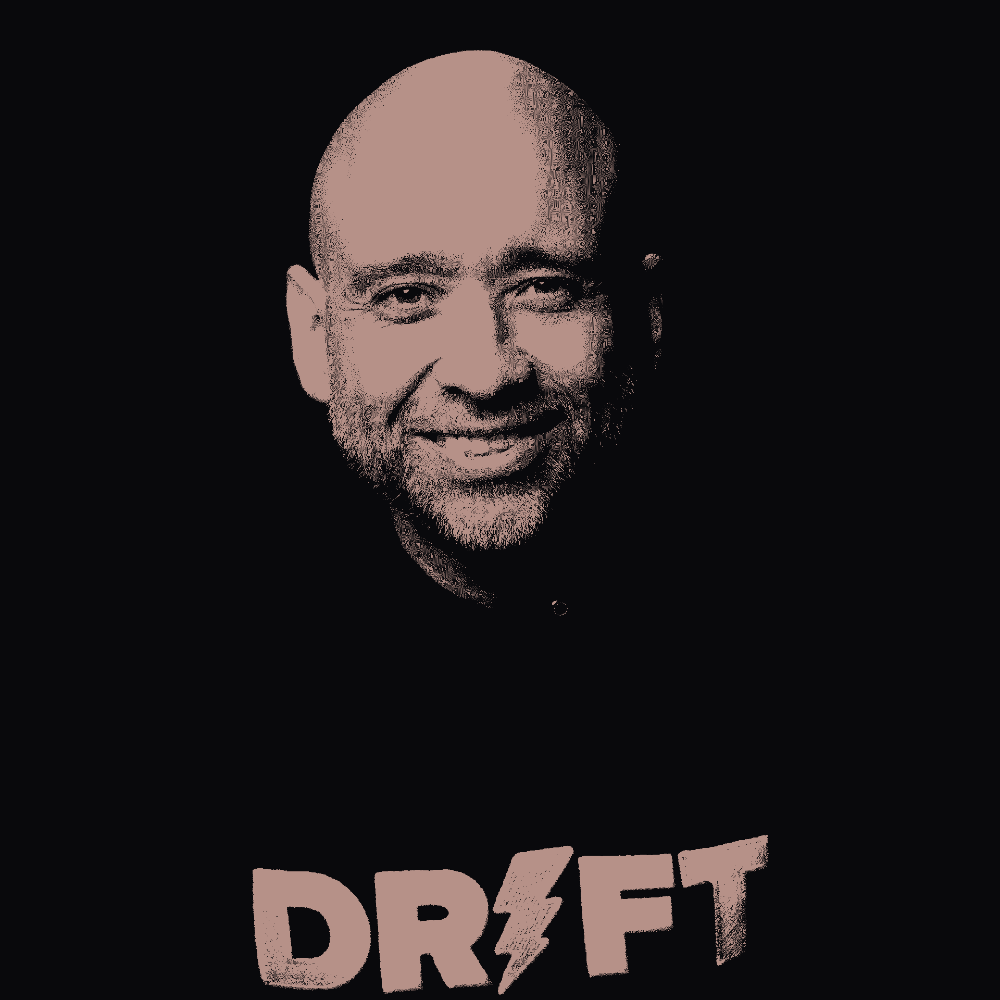
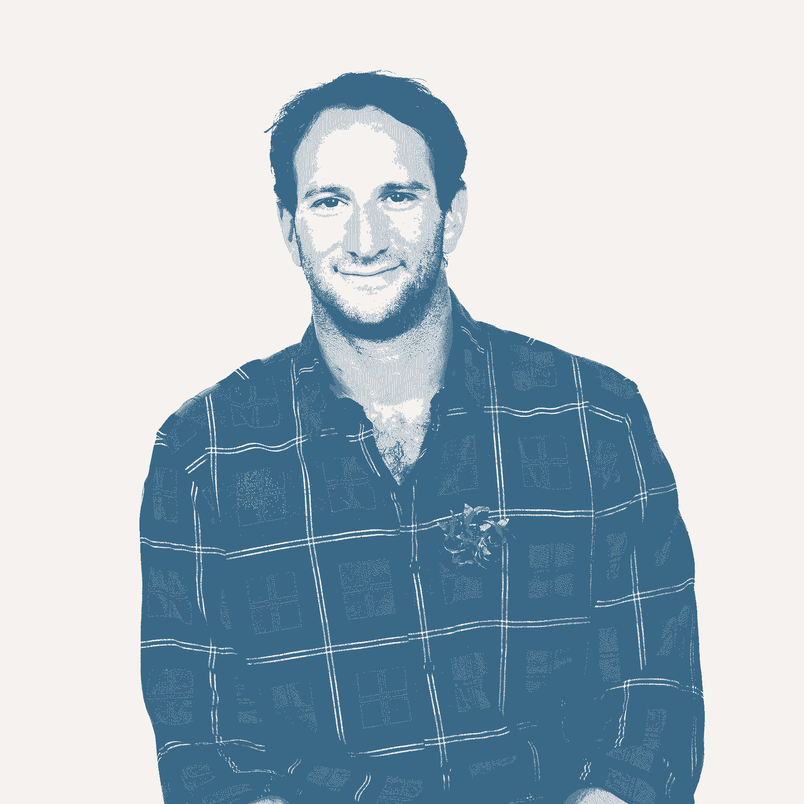
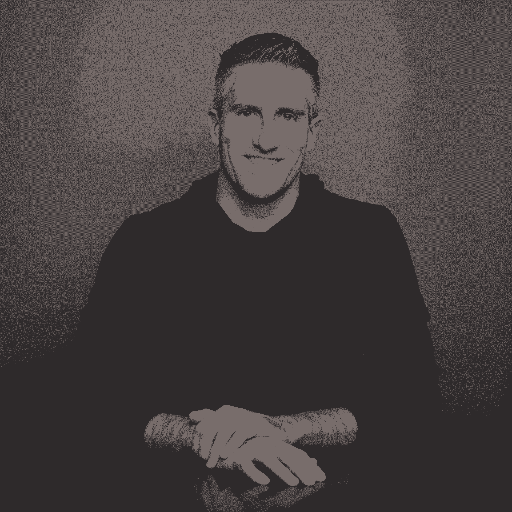

# 我们在播客中听到的 30 条最佳建议(目前为止)

> 原文：<https://review.firstround.com/the-30-best-bits-of-advice-we>

## 介绍

早在 2013 年，我们就带着一个崇高的目标开始了这项审查——与值得信赖的导师进行一对一的咖啡聊天，开启改变职业生涯的途径。八年过去了，在将近 500 份简介之后，我们有机会采访了一大批人，他们给了我们各种各样的公司建设建议。一路走来，我们学到了很多关于什么是令人信服的谈话。无论是对大名鼎鼎的首席执行官的采访，还是对你从未听说过的副总裁的采访，我们所有最受欢迎的故事都有一个共同的主线——愿意深入探讨，渴望分享不仅仅是做什么，还有 T2 如何做。

虽然书面文字永远是我们的最爱，但去年我们将这种深度访谈式的评论引入了音频形式——让你有机会亲自收听我们的新播客 **[深度](https://review.firstround.com/podcast "null")** 。最初的实验已经变成了 30 集(还在继续！)的组织结构图中，到处都是不可思议的初创企业领导者，比如 idea、Lambda School、Plaid、Segment 等等。

为了庆祝这一里程碑，我们回顾了迄今为止制作的每一集，并从这些采访中挑选出我们最喜欢的建议。如果你已经是深度订户，我们希望这能让你想起迄今为止你最喜欢的几集，或者激励你去听那些你可能已经跳过的。如果你还不是一个听众，让这作为一个引子——我们鼓励你选择这些策略中的一个，激起你的兴趣，插上你的耳机，听完整集。

事不宜迟，从大的、发人深省的想法，到立即付诸实施的策略，这里是我们在新播客的前 30 集中听到的 30 条最佳建议。

## **1。绝不创造第二个病人。**

兰姆达商学院的首席运营官 **[莫莉·格拉汉姆](https://www.linkedin.com/in/mograham/ "null")** 因其坦率和创造性的管理格言而长期以来一直是书评的最爱，包括“[放弃你的乐高玩具](https://firstround.com/review/give-away-your-legos-and-other-commandments-for-scaling-startups/ "null")”和“[与啃你腿的怪物交朋友](https://firstround.com/review/make-friends-with-the-monster-chewing-on-your-leg-and-other-tips-for-surviving-startups/ "null")”难怪她为自己最好的管理课程之一指出了另一个不太可能的来源。“我大学毕业后的第一份工作是为一所名为 NOLS 的学校带领去巴塔哥尼亚和阿拉斯加等地的野外旅行。格雷厄姆说:“把 16 个陌生人带到树林里，让他们相处 75 天，这是我参加过的最好的管理培训。

成为一名讲师的部分准备工作包括野外第一反应课程——在那里她学到了第一条规则是评估现场。假设你看到有人躺在小路中间。“你需要首先环顾四周，看看是否有对你危险的东西，因为如果有，你实际上不应该参与。说你不去帮助他们听起来很疯狂，因为那个人可能快死了，但灰熊或其他什么可能还在那里。关键是，如果你也成了病人，你就帮不了任何人，”她说。“通常你能做的最基本的事情之一就是转身离开去寻求帮助。”

那么，管理课在哪里？“作为一名经理，如果你精疲力竭，几乎不可能帮助任何人。Graham 说:**作为经理，我们经常认为我们是第二位的，我们必须首先确保团队一切正常。“所以我们推迟休假，或者工作更长时间，因为我们‘必须为团队服务’但是这样做，你最终只会耗尽自己的精力，伤害自己的健康，变得一团糟，而没有意识到你把自己变成一个病人是在伤害你的团队成员，”格雷厄姆说。**

作为一名管理者，最难的管理技能之一就是先学会照顾自己。这会让人觉得很自私，尤其是如果你是一个乐于奉献的人。但是请相信我，除非你是最好的自己，否则你不可能让别人成为最好的自己。

*[在这里听莫莉·格雷厄姆的那一集](https://review.firstround.com/podcast/episode-1 "null")* *或者在这里**阅读我们的完整报道。*

## **2。离开球场，提升你的领导力。**

Nick Caldwell, VP of Engineering at Twitter

在他漫长的工程职业生涯中， **[尼克·考德威尔](https://www.linkedin.com/in/nickcaldwell/ "null")** 从一名个人贡献者一路晋升到目前在 **Twitter** 担任工程副总裁。但是他指出在微软从工程经理到主管的飞跃是最艰难的转变之一。

“我喜欢生产线级的 EM 管理。尽管作为一名导演，我现在有 30 个人向我汇报，但我做了你作为一个小得多的团队成员会做的所有事情。我认识了每一个人，并在一对一的基础上激励和鼓舞人们。他表示:“作为新兴市场的所有好处，我都试图融入到我作为导演的角色中，但我很难做到这一点。

当时这引起了他的经理的注意，经理给了他一些至理名言:你必须学会如何离开球场。“这意味着，如果你把工程团队想象成一个仓库，你有你的直线经理，然后你有你的主管。“董事们必须离开现场，监督多条生产线，”考德威尔说。

为了更有效地授权，Caldwell 的经理采取了严厉的措施，阻止他直接与团队坐在一起。随着时间的推移，考德威尔不断增强他的董事肌肉，而不是回到他的管理舒适区。他说:“当你离开会场时，你可以系统地看到你的团队是如何一起工作的，并了解瓶颈在哪里。

*[这里听尼克·考德威尔的一集](https://review.firstround.com/podcast/episode-30 "null")* *。*

## **3。打个不受欢迎的电话来拯救这艘船。**

我们对 **[Drop](https://drop.com/ "null")** 联合创始人兼首席执行官 **[史蒂夫埃尔-哈格](https://www.linkedin.com/in/elhage/ "null")** 的采访充满了策略，很难在这里只选择一个人。有这样一个故事，艾尔哈格和他的联合创始人一天要参加 80-90 场面试。或者他是如何在与 30 多名优秀人才会面后才提供高管职位的——当你谈论高管级候选人时，这是一个相当大的挑战。或者他是如何依靠三个外部顾问，每周与他们会面约 20 小时，持续一年，以充分利用他们的建议。

但是，也许我们最喜欢的金玉良言不是来自这些有针对性的例子，而是来自一个大胆的大故事。近年来，Drop 的领导团队对商业模式有所担忧，尽管收入翻了一番，

对于他们的一个带来绝大部分收入的业务部门，KPI 是稳定的，但单位经济没有改善。“我们决定不再打折销售任何第三方产品，因为我们认为能够长期生存是一项挑战。埃尔哈格说:“我们脱离了 35 个类别，专注于我们自己的消费电子产品，这需要与公司的许多人分道扬镳。

这个决定至少不受用户、投资者和员工的欢迎。“短期影响是可怕的。他说:“前三到六个月，我们的收入在第一季度缩水了 30%，下一季度又缩水了 30%。

坚持己见得到了回报。“到第六个月，我们的收入开始反弹，到第八个月，我们的收入回到了以前的水平。我们的毛利很高，如果不是更高的话。他说:“到第 10 个月，我们实现了盈利，息税折旧及摊销前利润为正。”

许多走下坡路的公司，尤其是消费类公司，知道他们需要做什么。但这很难，因为你必须在保持船漂浮的同时更换船上的面板。

*[在这里听史蒂夫埃尔-哈格的插曲](https://review.firstround.com/podcast/episode-3 "null")* *或者在这里**阅读我们关于它的完整报道。*

## **4。深入研究这些指标。**

**[科林·布亚尔](https://www.linkedin.com/in/colinbryar/ "null")** 和 **[比尔·卡尔](https://www.linkedin.com/in/bill-carr/ "null")** 共同在亚马逊担任了 28 年的高管，因此他们的新书《[逆向工作](https://www.amazon.com/Working-Backwards-Insights-Stories-Secrets/dp/1250267595 "null")》提供了大量幕后故事和独特的策略——超越了你可能已经听说过的杰夫·贝索斯的“两个披萨规则”或该公司的备忘录写作文化。

我们最喜欢的一条建议来自亚马逊的 14 条领导原则之一:深入探索。“一个普通的操作员和一个伟大的操作员的区别在于，最好的操作员真正深入这些指标的细节并把它们分开，”卡尔说。Bryar 分享了一个亚马逊领导者潜得多深的例子。“以 2010 年的年度计划流程为例。领导团队设定他们所谓的 S-team 目标，这些目标对他们来说足够重要，可以监控。那一年有 452 个，都是非常非常详细的目标。我们要为这个类别增加多少选择？我们会把 AWS 服务的延迟从 X 降低到 Y 吗？他说:“这就是贝佐斯和他的直接下属所达到的详细程度。

有些人可能会认为，这种深入这些输入指标的水域的做法接近微观管理。随着一些组织的成长，领导者会想，‘我的工作就是关注大局。’在亚马逊，领导者被期望以难以置信的详细程度了解他们的业务发生了什么。Bryar 说:所以深度潜水不是微观管理——而是掌握你的业务细节。

你不可能到达一个地方，在那里你不知道你这个星期的生意是否比上周好，或者这个季度比上个季度好——否则，它会继续变得更糟，而不被发现。

*[在这里听科林·布亚尔和比尔·卡尔的插曲](https://review.firstround.com/podcast/episode-10 "null")* *或者在这里**阅读我们的完整报道。*

## **5。当你加入一个团队时，不要忽略所有的优点。**

Anne Raimondi, board member at Asana, Gusto, Guru & Patreon.

**[安妮·莱蒙迪](https://www.linkedin.com/in/anneraimondi/ "null")** 的科技轨迹包括在一些最有趣的公司停留——包括在易贝、SurveyMonkey、TaskRabbit、Zendesk 和 Guru 的领导职位。她见过各个高度的初创公司——从项目经理到副总裁，从创始人到董事会成员，在每个初创阶段应对消费者和企业的挑战。就连她的职能专长也很难确定——她负责产品、营销、收入和运营。

莱蒙迪有很多担任高管的经验，也有很多至理名言可以分享给处于类似处境的人。她在渴望产生影响的新高管身上看到的一个常见失误？跳过所有好的东西，专注于需要改进的地方。“你正在加入一个现有的团队，每个团队都有自己的优势和机会——有些人会比其他人更健康。对于许多高管来说，你被请来是因为团队中有需要改进的地方。在下一段旅程中，有些动态需要改进。她说:“我们需要将标准设定在一个不同的水平上。

如果公司领导层运作一个透明的面试过程，这些挑战中的大部分将会浮出水面。“如果你是一名初来乍到的高管，你肯定已经和首席执行官以及董事会成员相处过了。在这个过程中，人们通常会非常坦率地分享面临的挑战。关键是继续保持清醒的头脑，并为自己看到一些。要避免的陷阱本质上是流言蜚语。她说，以‘嗯，我听说过这个关于某某人的事’——这没有帮助。

如果你忽略了所有的美好，你很快就会失去信任，或者被认为是一个只看到一切破碎的人。

## **6。通过雇佣可信的自信在你的交响乐中制造杂音。**

**[大卫·利布](https://twitter.com/dflieb "null")** 于 2013 年通过收购照片分享初创公司 Bump 来到**谷歌**。虽然他和他的团队继续开发谷歌照片，该照片于 2015 年推出，并于 2019 年突破 10 亿用户大关，但他在这家科技巨头的起步有点坎坷。

一次意外的重组让他进入了 Google Plus 组织——这个组织对他想要开发的产品并不感兴趣。“我不得不坚持自己的观点，说，‘不，我很确定这个产品会是赢家，’”Lieb 说。这段经历让他成为了一名倡导者，他称之为“故意雇佣与你的愿景不一致或有不同想法的人。”(当然，价值观和使命的一致是不容商量的。)

下面是利布在招聘时如何制造一些不和谐的声音:“我想看到自信。我希望他们有一个观点，一个世界观，关于我们应该改变什么来使我们的产品或服务成功，”他说。“但是这种自信必须是可信的——而且你经常会看到一个而不是另一个。对我来说，这是一个危险地带，”他说。

“我讨厌看到人们对某件事非常自信，但它实际上并没有一系列可信的知识来支持我相信它是真实的。反之亦然——我经常看到一些人有很多知识，但并不真正知道他们想用这些知识做什么，或者对建立什么有信心的计划。”下面是 Lieb 如何在候选人面试中发现这些信号:

**你会改变什么？**“有时他们会被这个问题搞糊涂。他们会说，‘哇，我是说很多都很好。’这意味着他们实际上没有强烈的观点，我认为这些观点没那么有用。所以我把他们放在那些假设的情境中，我说，‘告诉我你会怎么做。你说了算。"

**你为什么相信？你为什么对此如此自信？**“危险的雇佣对象是那些说不清自己为什么自信的人，但他们确实很自信，”他说。“所以我只是试着深入一层。哦，你说你在那个产品里试过了。“你具体学到了什么让你有这种感觉？”你可以把那些胡说八道的人和那些真正用心学习的人区分开来。"

*[在这里听大卫·利布的一集](https://review.firstround.com/podcast/episode-11 "null")* *。*

## **7。成为你直接下属的重力辅助弹弓。**

我们之前在评论中介绍过 **[拉斯·拉罗威](https://www.linkedin.com/in/russlaraway/ "null")**[敏锐的职业对话智慧](https://review.firstround.com/three-powerful-conversations-managers-must-have-to-develop-their-people "null")，这就是为什么我们知道我们必须让他作为嘉宾出现在播客上。Laraway 又一次兑现了承诺，向我们展示了他对 OKRs 和培养高素质经理的方法。

我们尤其喜欢领导者对经理工作的简洁描述:1)交付一致的结果，2)让团队成员取得成功。“成功有两个不同的部分。一个是短期成功，即在本周、本季度或今年在组织内实现目标或一致的结果。但也有长期的成功——比如考虑我的长期职业生涯，顺便说一下，这可能不在这家公司。

“我认为许多经理说服自己，坐在他们对面的人是一名员工，我们的共同利益是我们今天和明天在公司做什么。他说:“我认为我学到的是，最好的经理会说‘不，不，不，坐在我对面的那个人是个人，我需要发挥作用，不仅要帮助他们取得我们在公司定义的成功，还要帮助他们在更长的职业生涯中为自己设想的任何事情。”。

为了进一步说明这一点，Laraway 使用了一个可靠的比喻。“如果你看过太空电影，总会有重力辅助发射到遥远的地方，比如‘我们没有足够的燃料到达火星，所以我们最好绕着地球做一个弹弓。’我对经理们说，这是你们的工作。在这个人的整个职业生涯中，你只能在很短的时间内拥有他。你的工作——除了其他事情之外——是确保你是那个重力辅助弹弓，把他们发射到职业生涯的更远的地方。"

*[这里听听拉斯·拉腊维的插曲](https://review.firstround.com/podcast/episode-15 "null")* *。*

## **8。在你批准一个新项目之前，要求看到令人兴奋的事情。**

作为一名工程负责人， **[蒂多·卡里罗](https://www.linkedin.com/in/thomascarriero/ "null")** 在脸书、Dropbox 和 Segment 组建了团队，目前他是首席产品官。如果我们必须从他分享的建议中选择一个最喜欢的花絮，它将是他的团队在他批准新项目之前必须达到的简单里程碑。

“当我们探索一些新的绿地空间时，通常你有四分之一的时间去建造一些原型，建造一些模型，做一些研究，”他说。“最后我真正想看到的是你在 Slack 上与客户交谈的 3-5 个截屏，或者他们允许的视频或音频记录。”

更具体地说，Carriero 正在寻找“疯狂的兴奋程度”，他说。“我希望看到某种购买承诺，或者‘嘿，如果这种产品存在，这将为我们节省三名工程师的内部时间。’或者是他们问你下周是否准备好的截图。"

证明所述兴奋的源材料是关键的组成部分。"**通常，产品/市场契合度的经典陷阱是，每个人都对你的想法非常客气，他们会说，‘哦，是的，那可能真的很有趣。’但是那不算什么**。"

这似乎是一个简单的里程碑，但 Carriero 发现这是一个非常有效的里程碑。“这是一种说，‘嘿，在我们真正看到这种疯狂的拉动之前，我们不会疯狂地建立一个由 5、10 或 15 名工程师组成的团队。’"

我见过 30、40、50 名工程师投入 6、9、12 个月的项目。它从来没有真正起飞，因为我们从来没有很好地理解这个问题，以至于一个客户可以带着极度的兴奋向我们背诵它。

*[在这里听蒂多·卡列罗的插曲](https://review.firstround.com/podcast/episode-16 "null")* *。*

## **9。训练你的团队讲故事。**

David Cancel, co-founder and CEO of Drift

**[漂移](https://www.drift.com/ "null")** 联合创始人兼首席执行官 **[大卫·卡塞](https://twitter.com/dcancel "null")** 告诉我们，他最近特别关注一件事:“我们如何才能更好地讲故事——不仅仅是故事本身，还有讲故事的行为和内部培训？”他说。

这项工作是我和组织最容易忽视的。但它是最强大的。因为当我们在公司内部或与我们的客户和潜在客户有沟通问题时，这一切都归结于这样一个事实，即我们没有花足够的时间去理解这个故事。

“在入职期间，每个人——不仅仅是营销人员——都要接受培训，不仅要了解我们的故事是什么，还要了解如何讲述故事？你如何做演讲？你怎么写文案？什么是认知偏差？人是怎么做决定的？”

为了说明他的意思，Cancel 向我们展示了一个内部漂移过程，该过程分解了亚马逊产品详细信息页面——乍一看似乎非常混乱。“但如果你开始从人们如何做决定的角度来看，你会看到评论、照片和视频上传等元素，这些元素从社会偏见的角度打击了你，让你想归属，想和别人一样，”他说。

“还有一些人想要立即做出决定，他们想要立刻得到一切。Cancel 说，“比如，‘我们只有四个这样的库存’，或者‘如果你现在买，我们会在明天下午 1 点前给你发货’这样的话就会触发这种情况。”。(同时引发多重偏见是有意的——参见[查理·芒格](https://en.wikipedia.org/wiki/Charlie_Munger "null")曾经说过的[的棒棒糖效应](https://finance.yahoo.com/news/charlie-munger-lollapalooza-effect-affects-164928621.html "null")。)

*[在这里听大卫取消的一集](https://review.firstround.com/podcast/episode-4 "null")* *或者在这里阅读我们的完整报道**。*

## **10。成为昙花一现的奇迹。**

“编码很容易。人很难。”这句来自 **[信用因缘](https://www.creditkarma.com/ "null")** 的 **[科琳·麦克里](https://www.linkedin.com/in/colleenmccrearychiefpplofficer/ "null")** 的简单老生常谈一直伴随着我们。为了让管理困难的事情变得更容易，McCreary 依赖于她所谓的 3 C:清晰、上下文和一致性。“人们不仅会对他们听到的做出反应，还会对他们实际看到的做出反应。所以你必须清楚地说明你想做什么。然后是你做出这个决定的背景。然后你必须一遍又一遍地重复，”她说。

“一开始，你必须专注于你为什么在这里，你在做什么，以及为什么它很重要。首席执行官基本上必须像一炮走红的流行歌星一样。你必须一遍又一遍地唱同一首歌。因为人们不记得了，而且有新加入的人没有听过你唱那首歌，”麦克里里说。

“尤其是创始人，他们总是在寻找下一个目标，但人们不会这么快就踏上征程。所以你必须放慢速度，保持一致，抓住信息，告诉员工他们将如何定义成功。因为如果你不专注于真正重要的事情，人们就会把首次公开募股或股价视为成功的决定因素，这很难放松。”

*[在这里听科琳·麦克里的插曲](https://review.firstround.com/podcast/episode-25 "null")* *。*

## 11。把招聘看作是一种细分练习。

Rick Song, co-founder & CEO of Persona

在 2018 年联合创办 **[Persona](https://withpersona.com/ "null")** 之前， **[Rick Song](https://www.linkedin.com/in/rick-song-25198b24/ "null")** 在 Square 待了五年。正如他在播客中所述，公司建设的 0 到 1 阶段带来了许多新的经验——尤其是在招聘方面。

一个突出的早期错误是，他们试图创建一个完整的面试循环——包括电话屏幕、面试问题和现场——以使初创公司看起来更成熟。“从 Square 这样的大公司出来，当应聘者申请时，他们很有可能会加入你。但当你是一家小型创业公司时，情况就大不一样了，”宋说。

创业公司的招聘不仅仅是考察这个人是否合格，而是要记住每一次面试都是一次推销。

他完善销售的建议？“找出贵公司独特的吸引力。它不一定是传统上有吸引力的东西——总会有一部分市场没有得到充分开发，”宋说。“我尽量把招聘看作是一种细分练习。今天，似乎每个创业公司都在谈论为使命而招聘，或者他们将如何成为世界上最大的公司。因此，招聘信息中“你坐在火箭船上”这一部分非常拥挤。所以我们采取了几乎完全相反的方法。我经常对候选人说这样的话:

我们并不想改变世界，我们只是希望让世界变得更好。希望如果我们成功了，人们再也不会想到他们的个人信息会丢失或被错误处理。不管是不是火箭飞船，我都不能向你保证。我不知道 10 年后 Persona 会在哪里——如果我们很大，那绝对是惊人的，如果我们还活着，坦率地说，那也仍然是惊人的。我们只是试着一步一步来，确保这里每天都是每个人的天堂。作为一名创始人，我真正想指出的是，10 年后，如果我们出去说，‘嘿，会有一次聚会的’，我们都会非常期待彼此相见。如果那是真的，我会认为我做得很好。

*[在这里听瑞克宋的一集](https://review.firstround.com/podcast/episode-22 "null")* *或者在这里读我们的完整报道**。*

## **12。注意不要从谷歌复制粘贴。**

麦肯纳·金特 称自己是一个惩罚的饕餮者——她尤其被那些处于混乱、雄心勃勃的公司扩张阶段的初创公司所吸引。最近，她是 Plaid 的人力资源主管，之前还在自动驾驶汽车公司 Cruise Automation 建立并领导了人力资源团队。

在她从事人力资源工作的过程中，她回答过许多初创公司创始人的问题，也见过太多直接从谷歌剧本中毫无章法或理由地照搬过来的东西。

她草拟了一个例子。“我无法告诉你，在我交谈过的初创公司创始人中，有多少人会说，‘我们的[绩效评估](https://review.firstround.com/the-power-of-performance-reviews-use-this-system-to-become-a-better-manager "null")有一个五分制评分系统。’我就想，为什么？你的天赋有那么与众不同吗？你的公司有 50 个人，从一到五，你如何给他们打分？”她说对你复制粘贴的东西保持警惕，想想谷歌创建这些东西的背景——不要只是模仿它，因为你认为这是 T2 应该做的事情。"

相反，无论是绩效评估还是平衡系统，金特的建议是一开始就偏向简单:“如果你是一家小公司，就保持简单。她说:“从更少的层次开始，随着时间的推移，你可以增加更多的层次，但要取消它们要困难得多。”

*[这里听麦凯纳·金特的一集](https://review.firstround.com/podcast/episode-28 "null")* *。*

## **13。平衡来自福音传道者和怀疑者的意见。**

Irving Fain, founder of Bowery Farming

当欧文·费恩(Irving Fain)探索最终成为鲍威利农场(Bowery Farming)的想法时，他遇到了许多让他的创始人之轮超高速运转的人——包括，正如他所说的，与一位垂直农业布道者就一盘水牛翅交换了几个小时的想法。

虽然这些探索性的谈话让费恩充满活力，但他渴望平衡。“你必须非常小心，不要成为确认偏见的受害者。费恩说:“当你与那些既兴奋又普遍相信你所做的事情的人交谈时，找到那些不相信你所做的事情、认为你走错了路并最终认为你在这个行业犯了一个错误的人也同样重要。

它始于框架的微妙变化。“我对 Bowery 采取的策略是不相信这个想法是可能的，并证明这种想法是错误的，但实际上恰恰相反。我从基本的假设出发，认为这是不可能的，并试图证明这是错误的，”他说。

每一次与福音传道者深入交谈，费恩都会接触到一个反对者。“我和一些做过大量研究的教授交谈，他们觉得我的想法是不可能的，我花了同样多的时间和他们交谈，以了解他们为什么相信他们所相信的东西，”费恩说。应该有成百上千个理由来解释为什么这种方法行不通——没关系。不代表你不做。但最好提前了解他们。”

*[在这里听欧文·费恩的插曲](https://review.firstround.com/podcast/episode-24 "null")* *或者在这里阅读我们关于它的完整报道**。*

## **14。扔掉剧本——即使这意味着拒绝顾客。**

Jay Simons 早在 2008 年就加入了 Atlassian ，在他长期担任总裁期间，公司从 AAR 的 2000 万美元增长到今天的 20 亿美元。在我们的谈话中，他提供了大量关于该公司非常规举措和对第一原则思维的承诺的内幕故事(在我们看来，这值得大大增加专栏篇幅)。

“对我们来说，只是做一些在其他地方有效的事情真的很少见。在文化上，我们总是从这样一个问题开始，“为什么要这样做？””西蒙斯说。这个小例子是一个突出的例子:早期，Atlassian 团队避免就担保、赔偿条款或支付条款等问题进行谈判。我们基本上只是说不——很难对想给你钱的人说不。

当时的想法是，Atlassian 对该产品的收费如此之低，从而将不用律师或销售人员的节省转化为更便宜的软件。“我们会说，‘如果谈判赔偿条款对你来说真的很重要，我们的竞争对手可能会这么做，但他们会向你收取 10 倍的费用，’”西蒙斯说。(Atlassian 在没有一辆改装过的 ULA 的情况下就拥有了 50000 名客户，并在雇佣第一位律师之前经营了 8 年。)

我总是提醒人们，没有什么生意是你能获得 100%的顾客的。你会因为各种原因失去一些。我们很容易在早期失去那些想要不同于我们所能提供的东西的顾客。

*[在这里听 Jay Simons 的那一集](https://review.firstround.com/podcast/episode-6 "null")* *或者在这里**阅读我们的完整报道。*

## **15。例外管理，走出自我。**

Dave Girouard, co-founder and CEO of Upstart

戴夫·吉鲁阿德(Dave Girouard)**[新贵](https://www.upstart.com/ "null")** 首次公开募股后，大方地抽出时间在播客上停下来，盘点他们的旅程，分享从创立理念到筹资斗争和组建高管团队的秘诀等方方面面的内幕。

一个突出的部分是他对管理的思考。“我的哲学是例外管理。对于 Upstart，我有这样一个观点，我试图建立一个在我死后还会存在很久的东西。所以我觉得应该尽可能在公司最底层做出决定，”他说。“作为首席执行官，如果有人向我提出问题，我当然会急于解决，”他说。“但我总是会想，‘这个问题是怎么产生的？它是怎么来到我身边的？“那我应该得到它吗？”"

Girouard 指出，这也需要对你自己的行为进行严格的管理。“我能做的最好的事情就是努力给自己创造一些距离，这样我就能成为一个更中立的观察者，并防止自己做一些可能没有太大帮助的事情。并不总是管用。他说:“有时候，情绪会占上风，你的本能会表现出来，你就是你。“成为首席执行官的艺术在于能够在事情发生之前走出自我，看清自己。”

他有一个快速的技巧来强化这种外部视角:“每当我和某人进行一对一的谈话时，如果我对某件事感到愤怒，我会想起我过去的老板或导师，我会想他们会如何处理这件事。”

我认为每一个有思想的领导者都可以先尽力管理好自己。如果你真的试着发挥自己最好的一面，你会意识到任何情况下都有另一种方法。

*[在这里听戴夫·吉鲁阿德的那一集](https://review.firstround.com/podcast/episode-7 "null")* *或者在这里**阅读我们的完整报道。*

## **16。更加关注你的系统。**

作为**[哈希公司的幕僚长，凯文·菲什纳](https://www.linkedin.com/in/kevinfishner/ "null")** 的任务是像对待产品一样对待公司。除了向我们介绍他们如何设定和跟踪目标，并通过在 HashiCorp 的写作做出决策，Fishner 还概述了一个有说服力的案例，说明为什么你应该像关心你的前 10 名雇员一样关心你的前 10 个系统。

正如他正确指出的那样，许多创业建议都集中在雇佣最优秀的人才上。“早期员工帮助建立隐性规范，而在公司生命周期的早期建立系统则建立显性规范。决策是如何做出的？会议是如何组织的？目标是如何设定的？他表示:“当公司规模较小时，这些系统更容易建立，但随着公司的发展，建立起来却非常困难。”。

“这就像忒修斯之船思想实验:想象你有一艘大型木制海盗船，100 多年来，你更换每一块木头。在这个过程结束时，它还是同一艘船吗？没有明确的答案，但以类似的方式思考一家公司是有启发性的。员工可能会在 30 年的时间里来来去去，直到不再有相同的员工。是同一家公司吗？”他问道。“我认为是的。”

公司是人和系统的集合。随着时间的推移，人们可以来来去去，但他们建立并随着时间的推移逐渐完善的系统成为了公司的一部分——公司最终的竞争是基于这些系统是否强大。

*[在这里听凯文·菲什纳的那一集](https://review.firstround.com/podcast/episode-12 "null")* *或者在这里读我们关于它的完整报道**。*

## **17。像投资者一样评估工作机会。**

在成为初创公司 **[从 0 到 1 的创始人之前，阿诺马罗](https://www.anomalo.com/ "null")****[埃利奥特·施穆克勒](https://www.linkedin.com/in/eshmu/ "null")** 在挑选高增长公司方面有着令人难以置信的记录 Instacart、Wealthfront、LinkedIn 和易贝的领先产品和增长。

“我的流程是像投资者一样对待决策。我将把我的时间投资在这家公司，而不是像风险投资家那样投资我的钱。每个人的时间都很宝贵。我的下一步会不会因为我在这里度过的时光而变得更加神奇？”他说。

虽然许多候选人都专注于评估这个职位是否适合他们的特殊优势，或者一个团队是否符合良好的文化，但什姆克勒认为，没有足够多的潜在候选人评估公司取得突破性成功的机会。

“选择一家优秀的公司对你和你的职业生涯都有巨大的好处。选择下一个 1000 亿美元的公司和下一个 1000 亿美元的公司之间的差别是巨大的。当然是在经济上，但也包括当你考虑下一个机会时，人们会如何看待你。“在其他条件相同的情况下，他们更有可能雇佣在更成功的地方工作过的人，因为他们觉得你更了解真正成功的公司是什么样的。”

以下是他从投资者的角度评估的几个关键领域:

市场规模:产品是小众产品，还是每个人都可以使用的产品？

**执行力:**公司有什么紧迫感？

**进入壁垒:**公司的护城河是什么，防御竞争对手的难度如何？

**收入弹性:**这是人们一次性购买的产品，还是持续不断地购买该公司的产品？有多种收入来源吗？

这是我从扑克中学到的:你赢一手牌的概率总是取决于你有多种赢牌的方法。

*[在这里听埃利奥特·什姆克勒的插曲](https://review.firstround.com/podcast/episode-20 "null")* *。*

## **18。邀请顾客打开前门。**

Kate Taylor, Head of Customer Experience at Notion

的客户体验负责人 **[凯特·泰勒](https://www.linkedin.com/in/kateptaylor/ "null")** 分享了许多发人深省的想法，从打造更紧密的产品反馈循环，到定价和包装实验。但我们最感兴趣的是她称之为顾客“前门体验”的概念。

“顾客走进我们的客厅，坐下来与我们交谈，我们如何让与我们交谈变得如此轻松？”泰勒说。“这意味着要用更多的方法去接触和听到更多的人，而不是更少，”她说。

这就是为什么这种方法对我们来说很突出:每家公司都声称以客户为中心，但在现实中并不总是如此。传统的客户服务思维通常围绕着减少平均处理时间。“我们的客户服务目标不是让他们停止与我们交谈——实际上是转移话题，了解更多信息，”她说。Taylor 依靠这些问题从这些客户对话中获得更多信息:

你为什么问这个？

告诉我为什么这个特性对你很重要。

请告诉我更多关于您的业务以及您希望实现的目标

请告诉我更多关于您的工作流程的信息，这会导致您提出这个问题。

*[在这里听凯特·泰勒的插曲](https://review.firstround.com/podcast/episode-19 "null")* *或者在这里**阅读我们的完整报道。*

## 19。雇佣和培训同理心。

在创建一个新的人物功能时，Lambda School 的 **[Mark Frein](https://www.linkedin.com/in/mark-frein-886148/ "null")** 有一个独特的焦点。“领导者如何塑造同理心？领导者如何创造一个地方，让他们的团队感到他们是真正的自己？”他说

在播客上，Frein 分享了两个将此付诸实践的重要技巧。首先，从雇佣善解人意的领导者开始——忽略求职者对普遍存在的“告诉我你失败的一次”面试问题的回答。“一些真正能帮助你更深入了解的后续问题是:‘跟我说说这件事对你有什么影响。你感觉如何？”他说。

我发现相对容易看到有人有一个关于失败的现成故事，但他们并不真的认为这是一次失败——当你问他们的情感历程时，他们不会带着感觉谈论它。

一旦经理们进门，练习这些换位思考技巧就很重要——这是弗莱恩经营的任何经理培训的重点。“我真正做的是，一旦他们想要做出判断，就集中精力阻止他们。因为有一些伟大的经理仍然无法抗拒开始诊断和修复的冲动，一种“哦，我完全知道如何处理这个人，他需要做 XYZ”的反应。但这是在我们还没搞清楚问题是什么之前就试图解决问题。”

这就是 Frein 引出一个可信的比喻的地方。"**经理读懂情绪的能力有点像训练自己成为一名侍酒师。那是愤怒吗？那只是挫折吗？他说:“通过培训，你会积累一些词汇，这些词汇会帮助你在制定行动计划之前后退一步，而不是判断和倾听。**

*[在这里听 Mark Frein 的那一集](https://review.firstround.com/podcast/episode-18 "null")* *或者在这里**阅读我们关于它的完整报道。*

## **20。年度计划时，多争论，少关注指标。**

**[杰夫·劳森](https://twitter.com/jeffiel "null")** 在过去的 13 年里一直在打造和运营 **Twilio** ，包括在 2016 年成功完成 IPO。劳森在我们的播客中挖掘了这段旅程中的几个有趣的故事，但也许最有趣的是一位新聘高管阅读年度计划后的“啊哈”时刻，并指出不清楚这些目标是必须做的，最好有，还是只是想法。

这一见解引发了一个启示。“作为一个管理团队，我们实际上从来没有争论过——这是一件困扰首席执行官的奇怪事情。但事实上，当我们总是达成一致时，我总觉得有些事情不太对劲。他说:“很明显，如果我们一直都意见一致，那我们一定没有做出足够好的决策。”。

劳森意识到团队没有争吵是因为他们没有分清主次。“一个人说，‘我喜欢想法 A’，另一个人说，‘我喜欢想法 B’，然后你说，‘太好了，把它们都放下，我们全都做！’”他说。

年度计划中还有一个领域会出现优先级问题。“关于 OKRs，我注意到的一点是，在大多数公司，目标并没有得到优先考虑，精力实际上围绕着关键结果。“每个人都非常关注指标，”劳森说。

在 Twilio，每个团队都制作了他们称之为 BPM 的东西——代表全局、优先级和度量。“实际上，我认为我们的 BPM 最重要的部分不是衡量标准，而是优先级。他说:“这些衡量标准只是一个标记，告诉我们是否正在朝着这些优先事项取得我们想要的进展。”。

在我看来，指标是年度计划中最不重要的部分，因为它们不具有战略意义。这些指标告诉我们是否在正确的道路上。但绘制正确的路径实际上是一项艰巨的工作。

*[在这里听杰夫·劳森的那一集](https://review.firstround.com/podcast/episode-14 "null")* *或者在这里阅读我们的完整报道**。*

## **21。写一份每周摘要来定下基调。**

Kelly Watkins, CEO of Abstract

摘要 **，** **[凯利·沃特金斯](https://www.linkedin.com/in/kcwatkins/ "null")** 加入了坐在首席执行官位子上的营销领导者的小俱乐部。但 Slack 的前全球营销副总裁继续依靠她的营销能力。

“故事的力量是我生命中的一道强有力的弧线。她说:“人类是通过叙事来理解世界的动物，我把这种技能带到了首席执行官的工作中。为此，她坚持的一个习惯是每周五给全公司写一封信。“有时是关于我们抽象看到的数据和我对它的理解。沃特金斯说:“我还写过关于冒名顶替综合征的文章，以及我在自己的生活中是如何努力解决这个问题的。

她发现这是一个重要的工具，可以加强抽象的叙述和故事。“作为一名领导者，我很早就学到的一件事是，内部叙事是通过重复发生的。我们的目标是什么？公司的目的是什么？她说:“重复真的很重要。

她还注意到这些每周信件中的涓滴效应。人们可能认为首席执行官的工作是做很多决策，但我认为我的工作是为公司定下基调。人们依靠领导者来判断自己在某种情况下的反应。因此，如果我像无头鸡一样跑来跑去，或者我的音调非常高，人们就会从我的音调中吸取营养，”她说。“所以我一直试图在压力下表现出平易近人和优雅的语气，因为我认为那会渗透到组织中。”

*[这里听听凯莉·沃特金斯的插曲](https://review.firstround.com/podcast/episode-23 "null")* *。*

## **22。抢购前创始人。**

在担任 **[Carbon Health](https://carbonhealth.com/ "null")** 、 **[的产品副总裁时，Ayo Omojola](https://www.linkedin.com/in/omojola/ "null")** 喜欢说一句对一家快速增长的初创公司的副总裁来说可能有点违反直觉的话:“我想让自己过时。”现在很多人说他们想雇佣比他们更聪明的人，但是根据我们的经验，很少有人真的这么做。以下是前创始人、YC 校友奥莫霍拉将这一原则付诸实践的方法。

他说:“我寻找那些正从上一家公司转型、并在思考下一步该做什么的创始人。”。原因如下:“**我认为没有大规模退出的创始人确实被就业市场低估了。你不必担心他们是否能发货。你有可用的证据和他们工作的公共物品，你可以独立地尝试。”**

尽管有这些明显的优势，但他注意到这些人通常被视为风险较高的雇员。“我所有的这些朋友都是令人难以置信的创始人，他们会去脸书、谷歌或亚马逊面试，但总是被淘汰。我对这个问题的看法是，许多公司都在寻找一个非常特殊的形象。但前创始人拥有令人难以置信的技能，而这些技能对于某个特定的角色来说更难适应。

但是，不仅仅是公司害怕雇佣前创始人——创始人可能会怀疑加入一家他们没有掌控权的公司。“他们在寻找一个使命，就像我一样，他们会有一个想法，他们会想要建立一些新的东西。他说:“我完全理解他们会对一些想法产生兴趣，我想支持这一点。

Omojola 在面试过程的早期就设定了期望，一旦被录用，就会给这位前创始人留下施展魔法的空间。“我会提前说明我招聘的目的，以及我们希望为这个职位做些什么，但我也会努力创造一种环境，让他们拥有最大的创造力和灵活性。我只要求他们对我透明，告诉我他们是如何以及何时考虑下一步的，”他说。

*[在这里听 Ayo Omojola 的那一集](https://review.firstround.com/podcast/episode-2 "null")* *或者在这里读我们的完整报道**。*

## **23。创建与你的价值观一致的标志。**

Jean-Denis Grèze, CTO of Plaid

作为金融科技初创公司 **[格子](https://plaid.com/ "null")****[的一名工程负责人，让-丹尼斯·格雷兹](https://www.linkedin.com/in/jeandenisgreze/ "null")** 花了很多时间思考激励和调整工程团队。他发现，在一家快速发展、待办事项越来越多的初创公司，人们很容易陷入处理下一个重大里程碑的困境，而不是庆祝推动事情进展的微小时刻。

为了培养这种习惯，Grèze 一次又一次地发现，小小的动作可以产生巨大的影响。“我非常相信符合文化和价值观的激励措施。他说:“有趣的是，人们没有意识到创造代币是非常有用的，代币是你奖励特定行为的物品。“你可以围绕一种新的价值观创造一种亚文化。人类——我们爱一个物体，我们爱一个象征。”

他举了一个以前团队的例子。“我们有一个丁丁漫画中的[火箭飞船模型。这是 20 世纪 20 年代或 30 年代对未来宇宙飞船的构想，有红白相间的方格图案。每两周一次的经理会议上，我们会分享两个亮点和两个不足。然后我们投票，把飞船给最有影响力的团队。作为一个团队被授予那艘宇宙飞船是一种巨大的骄傲，奇怪的是，作为一种象征，这艘宇宙飞船有了自己的生命。格雷兹说:“当一个团队要推出一个新功能时，他们会试图引起轰动并产生影响，这样他们就可以获得宇宙飞船。”](https://en.wikipedia.org/wiki/Destination_Moon_(comics) "null")

*[在这里听让-丹尼斯·格雷泽的那一集](https://review.firstround.com/podcast/episode-8 "null")* *或者在这里读我们的完整报道**。*

## **24。双击您的通信策略。**

Shannon bray ton**是一位名副其实的硅谷老手，拥有超过 20 年的经验，在 LinkedIn、OpenTable、易贝和现在的 Bessemer 等公司塑造企业故事和领导团队，是风险投资公司的第一位 CMO。**

**“沟通是公司内部最不受重视的职能之一。布雷顿说:“多年来，它在某种程度上是营销的继子。“当人们做得非常好的时候，你几乎不知道，因为这意味着他们已经扼杀了大量人们不想看到的故事。”**

**然而，在账本的另一边，布雷顿指出，一个通信团队往往很快就能抓住 flack。“我不喜欢人们指着通讯设备说，‘这是个公关问题。’人们总是问我对脸书通讯团队的看法。她说:“我的回答总是，脸书的问题不在于沟通，而是他们的业务问题，沟通团队一直在努力解决这个问题。”。**

**除了没有给予该功能应有的重视，布雷顿还经常看到第一次创业者的另一个错误。“当创始人达到产品/市场契合度时，许多人会自然而然地认为他们需要企业公关——关于资金和他们自己的故事。她说:“他们不一定关注什么是真正的*驱动的业务，这是一个消费者新闻故事，或者如果是 B2B 的话，是一个贸易渠道。***

***“你必须知道你的目标，如果是为了获得更多的用户，答案不仅仅是任何出版物上的标题‘看着我，我们筹到了这笔钱！’你必须讲述公司的故事和它的工作。布雷顿说:“我认为人们在这方面并不擅长。***

***你在干什么？你的目标是谁？你是怎么赚钱的？你如何在 10 分钟内讲述这个故事？你对这个故事了解得越多，你的公关就越成功。***

****[这里听听香农·布雷顿的插曲](https://review.firstround.com/podcast/episode-26 "null")* *。****

## *****25。在门口检查你的自我。*****

*****[山姆·泰勒](https://www.linkedin.com/in/staylor31/ "null")** 是一位创业销售巨星。他目前是 **[织机](https://www.loom.com/ "null")** 的销售和成功副总裁，此前曾担任 Dropbox 的第一位企业销售代表，以及 Quip 的第一位销售主管。但在我们与泰勒的交谈过程中，让我们印象深刻的是，他的最佳销售技巧是如何广泛应用于各种学科的。无论你坐在组织结构图的哪个位置，记住检查你的自我和带着好奇心去发掘关键见解的力量。***

***“说你不明白某件事是很有力量的。愿意问一些愚蠢的问题，比如，‘嘿，你提到了 X，Y，Z 的事情。“我不知道那是什么，那是什么意思，”“非常强大，”泰勒说。我认为，最成功的销售人员会以一种真诚好奇的方式问下一层问题，而不是带着问题清单上的一个方框打勾。"***

****[这里听听山姆·泰勒的插曲](https://review.firstround.com/podcast/episode-29 "null")* *。****

## *****26。像考虑你的想法一样仔细地考虑你的联合创始人。*****

***

Waseem Daher, co-founder and CEO of Pilot*** 

*****[领航员](https://pilot.com/ "null")** 联合创始人兼首席执行官**[Waseem Daher](https://www.linkedin.com/in/wdaher/ "null")****作为三任创始人，他带来了大量的创业经验。但他也带来了更罕见的东西——三家初创公司的联合创始人都是同一批人。在 Pilot 之前，Daher 与他以前的麻省理工同学 Jeff Arnold 和 Jessica McKellar 一起创立了 Ksplice 和 Zulip。*****

*****在成功退出创始三人组的前两家公司(通过甲骨文和 Dropbox 收购)后，达赫坚定地表示，只有在他的联合创始人也在的情况下，他才会开始另一家创业公司。这意味着在 Pilot 的早期，他们不仅要找到一个伟大的想法来开始构建，还要找到一个让三个人都感到兴奋的想法。*****

*****“在对这个想法工作了六个月后，你可能会得出结论，这个想法是错误的，人们实际上并不想要这个东西。也许你想追求一些邻近的东西。但是，如果你做出这样的选择，你剩下的就是这个团队。”*****

*****人们认为创业非常讲究创意。但从某些方面来说，这个想法是公司最容易处理或最灵活的部分。*****

*****以下是他给其他创始人的建议:“你的公司在早期可能的死亡原因是什么？最有可能的一个原因是创始人戏剧或创始人关系紧张以及创始团队无法合作。Daher 说:“我认为，能够从一开始就解决这个问题，对于增加公司成功的可能性非常有价值。*****

******[这里听 Waseem Daher 的一集](https://review.firstround.com/podcast/episode-27 "null")* *。******

## *******27。尊重停顿。*******

*****作为开源软件公司**[Elastic](https://www.elastic.co/ "null")****[的人力资源 SVP，Leah Sutton](https://www.linkedin.com/in/leahsutton/ "null")** 的任务是为该公司遍布 40 个国家的 2000 名员工提供领先的员工体验。在跨越几种不同文化的工作中，萨顿发现有很多坑坑洼洼会让人偏离正轨。*****

*****“我们有一个关于权力和特权的会议，我们的一位工程领导人说，‘我鼓励人们尊重暂停。因为在我的脑海中，我正在用我的母语阐述我要说的话，然后我必须把它翻译成英语，所以这可能需要一点时间。“当我停顿的时候，并不是我没有重要的事情要说，我只是需要多一点时间，”萨顿回忆道。*****

*****“尊重暂停”已经成为 Elastic 的一句口头禅——即使在没有跨文化的公司，这也是对经理们的一个尖锐的提醒。“注意团队中不同的人想要如何交流。她说:“给人们时间，呼吁那些可能会保持沉默的人——他们也有想法可以分享。”*****

******[这里听听莉亚·萨顿的插曲](https://review.firstround.com/podcast/episode-13 "null")* *。******

## *****28。为许多人而不是一个人建造。*****

*****在加入 **[动物群](https://fauna.com/ "null")** 担任首席执行官之前， **[埃里克·伯格](https://www.linkedin.com/in/epberg/ "null")** 担任 Okta 的首席产品官，将公司从 10 名员工和零客户扩展到 2017 年的 IPO。在我们与 Berg 的谈话中，他深入探讨了发展 Okta 的 ICP 的细节——这依赖于无情的优先化，以及说不的痛苦行为。*****

*****这里有一个例子。“有一家非常大的社交网络公司找到我们，对我们正在做的事情非常感兴趣。但是他们的主要用例可能是我们路线图上的 18-24 个月。从走向市场的角度来看，这不是我们其他 ICP 关注的领域，也不是我们认为可以获得更大规模的领域。所以我们不得不拒绝他们，这在当时作为一家小公司是很难做到的，”Berg 说。*****

*****当客户的要求相差太远，而你又觉得它们不能代表你从更大的市场角度所看到的情况时，那么仅仅为了一个大客户的标志而做出这样的取舍是没有意义的。*****

*****他的建议？与其专注于一个客户北极星，不如撒开更大的网。“在很早的时候，会有一些东西你要专门为客户打造，让他们活起来。但只要你通过你的销售渠道或营销或客户咨询委员会不断互动，你就会很好地了解你的 ICP 的更大代表需要什么，以及这些具体功能是否符合路线图，”他说。*****

******[这里听听埃里克·伯格的插曲](https://review.firstround.com/podcast/episode-21 "null")* *。******

## *******29。从你愿望清单的底部开始——保持一张扑克脸。*******

*****

Cristina Cordova, Head of Platform & Partnerships at Notion***** 

*****经过十年的合作(先是在 Stripe，现在在 inconce)， **[克里斯蒂娜](https://www.linkedin.com/in/cristinajcordova/ "null")** **[科尔多瓦](https://www.linkedin.com/in/cristinajcordova/ "null")** 已经获得了大笔交易，磨练了她的谈判技巧。在播客上，她分享了这个经常被忽视的角色的内幕，从常见的陷阱和双赢策略，到具有巨大影响或失败的交易的故事。我们最欣赏的是，她是如何迅速切入正题，成功成为初创公司的第一位业务拓展或合伙人。以下是她分享的两个亮点:*****

*******从底层做起。科尔多瓦说:“也许你对什么样的伙伴关系会对你的组织有效有一些初步的想法，但你不知道它们是否是正确的——在一家新公司的新职能部门，你不太了解这个领域。”“当你与最初的几个潜在合作伙伴交谈时，你会发现他们并不真正了解你的公司。作为一家初创公司，他们以前从未听说过你，在与你建立关系时往往会有些犹豫。这就是为什么我最大的建议是不要从你可能合作的最重要的伙伴开始，而是从名单上的第三、第四或第五名开始。在你去找你在某个领域最突出的潜在合作伙伴之前，先和这些人建立一个案例。通过这种方式，你可以真正了解可能存在的异议，并找出他们喜欢或不喜欢的部分，在你转向越来越大的合作伙伴之前不断重复。”*******

*******确保你的团队对合作伙伴感到兴奋。**“作为一名业务拓展人员，无论交易进行得有多糟糕，谈判压力有多大，你的工作都是在与合作伙伴打交道时保持良好的内在形象。你不希望你的内部团队——无论是工程、产品、其他业务开发人员还是财务人员——在这个过程中与其他对手对抗。”*****

******[这里听听克里斯蒂娜·科尔多瓦的插曲](https://review.firstround.com/podcast/episode-5 "null")* *。******

## *****三十岁。通过检查你的日程表来坚持你的优先事项。*****

*****作为图钉**的创始人兼 CEO，在 **[马可萨帕科斯塔](https://www.linkedin.com/in/marcozappacosta/ "null")** **的**时间里有看似无穷无尽的需求。作为第一次创办图钉公司的人，在过去的十年里，他依靠一种特殊的仪式来让自己不负债。*******

*****他首先明确列出未来六个月的首要任务，并在领导团队中传阅该列表——无论是专注于招聘新高管，还是接近即将推出的金属。“任何感觉像是存在风险或我们长期成功的关键抑制因素的事情都会排在列表的首位，”萨帕科斯塔说。*****

*****接下来，他用这个镜头来检查他的日历。“我真的浏览并标记东西，这样我就可以看到一天、一周或一个月中各种主题所占的百分比，”他说。*****

*****如果你真的投资了你想投资的领域，日历是最好的审核方式。*****

*****这也意味着他可以更清楚地知道什么时候该说“不”，当你看着日历，意识到‘哇，我已经报名参加的太多了’时，这总是一个惊喜。萨帕科斯塔说:“当你抽象地答应一个请求时，这是一回事，但是一旦你在你的日历上看到它和它所需要的投资，你就可以更明智地使用你的时间。”。*****

******[这里听听马可·萨帕科斯塔的插曲](https://review.firstround.com/podcast/episode-17 "null")* *。******

*****盖蒂图片社/索尔格兰达的封面图片。*****