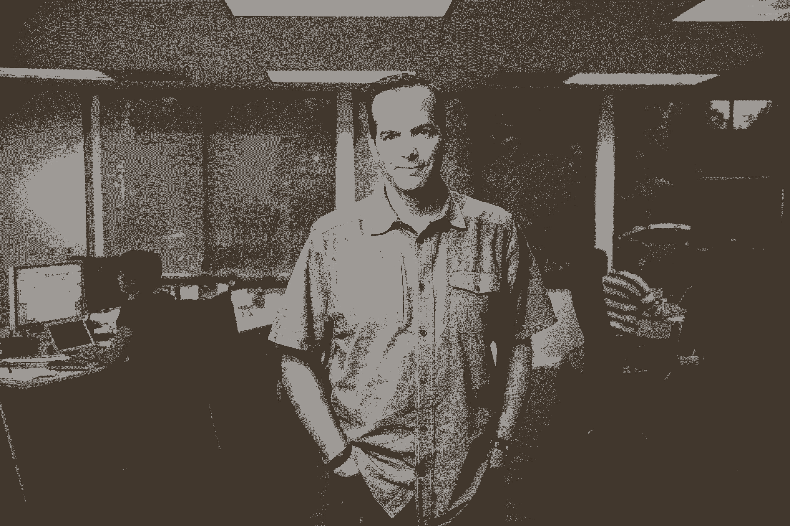

# 2015 年给创业者的 30 条最佳建议

> 原文：<https://review.firstround.com/the-30-best-pieces-of-advice-for-entrepreneurs-in-2015>

去年秋天，我们无意中听到 Twitter 工程总监 David Loftesness 关于培训新的工程经理的一些可靠的智慧——这通常是一个不稳定的过渡。所以我们和他坐在一起，看看他有什么建议，我们被震撼了。大卫不仅有可操作的见解要分享，他还为工程师们制定了一个具体的 90 天计划，以实现向领导层的飞跃。对于[发表这篇文章](http://firstround.com/review/this-90-day-plan-turns-engineers-into-remarkable-managers/ "null")，我们再兴奋不过了——它代表了《第一轮评估》的使命，即让原创的、非显而易见的建议浮出水面。反响令人振奋。它不仅登上了黑客新闻的榜首，还被数千人广泛阅读。显然有些事情引起了共鸣。我们看着它在旧金山最大的工程团队中传递。我们热情地邀请大卫为我们社区的菜鸟工程经理举办了一次晚宴，这次晚宴非常成功。现在我们正在等待他的[新书](https://medium.com/scaling-teams/why-we-are-writing-scaling-teams-32ab68603a21#.k5h31enyj "null")。分享这种类型的知识所能做的事情令人惊讶。我们已经看到它为提供它的人和阅读它的人创造了奇迹。

《评论》现在已经有两年多的历史了，有几十个故事引起了共鸣，并产生了像大卫一样的影响。仅在 2015 年，我们就增加了近 100 篇新文章，为设计师、产品经理、营销人员、招聘人员、销售主管、高管等提供了详尽的指导。**以下是我们去年发布的 30 条最有影响力、最能带来改变的建议。**

但是，当我们回顾和展望未来时，真正令人兴奋的是我们已经了解了多少我们的观众实际上想要和需要的东西，以及我们如何尽我们的力量使整个技术生态系统变得更强大。这将促使我们在 2016 年与更杰出的人交谈，尝试新事物，讲述伟大的故事。加入我们吧。你不会吗？

**1。** **[实行激进的坦白。](http://firstround.com/review/radical-candor-the-surprising-secret-to-being-a-good-boss/ "null")**

金·斯科特的职业生涯围绕着创造一个没有废话的区域，在那里人们热爱他们的工作并一起工作。现在，她是 Twitter、Shyp 和 Qualtrics 等网站广受好评的教练，她把一个简单的工具作为自己教学的基石:**激进坦诚**。基本上，老板需要告诉他们的员工他们什么时候搞砸了，但这很少发生。斯科特提出了一个框架来简化这一过程:

如果垂直的轴是**亲自关心**，水平的轴是**直接挑战**，您希望您的反馈落在右上象限。这就是极端坦率的所在。斯科特说，这是非常关心和愿意提供困难反馈的结合。“彻底的坦诚是谦逊的、有益的、直接的，是面对面的——如果是批评就私下里说，如果是表扬就公开说——而且不带有个人色彩。”

“我认为，当你的员工搞砸了，批评他们不仅仅是你的工作，实际上这是你的道德义务。”

**2。** **[像懈怠一样使用反馈。](http://firstround.com/review/From-0-to-1B-Slacks-Founder-Shares-Their-Epic-Launch-Strategy/ "null")**

Slack 可能会因为拥有有史以来最好的上市体验而被载入史册。一出大门，它就被冠以独角兽的称号，受到用户的普遍喜爱。首席执行官[斯图尔特·巴特菲尔德](https://twitter.com/stewart "null")和他的团队是如何做到这一点的？首先，他们将产品测试了几个月，以深入了解他们的用户，收集数据，并用它来推动开发。巴特菲尔德说:“我们非常注重标记所有通过渠道传入的信息，整理、输入和保留人们分享或发送给我们的数据。”这使他们能够满足客户的优先需求，优化他们最关心的功能(例如搜索、同步和简单的文件共享)。在数量方面，它也给了公司一个成功的基准。他们发现，一旦一个团队在 Slack 上交换 2000 条消息，他们就会上瘾。该公司接受了这一暗示，并在用户体验中融入了新的机制，以让客户达到 2000 条消息的黄金关口。剧透:成功了。

**3。** **[赠送你的乐高玩具。](http://firstround.com/review/give-away-your-legos-and-other-commandments-for-scaling-startups/ "null")**

“我对扩大公司规模的最佳比喻是用乐高建造一座巨大而复杂的塔，”Quip 公司的首席运营官、前脸书文化建筑师莫莉·格拉汉姆说。创业初期，每个人都很兴奋，有很多事情要做。但是当你开始成长时，有趣的事情发生了:人们变得紧张。“随着新角色的加入，你会经历‘等等，那个新人是在抢我的工作吗？如果他们做的方法不对呢？“我现在该怎么办，”“当新人来接手你的工作时，你的感受——这和一个孩子不得不分享他们的乐高玩具时的感受没什么不同。在一家规模化公司，放弃责任——放弃你开始建造的乐高塔——是继续建造更大更好的东西的唯一途径。

**4。** **[让速度成为习惯。](http://firstround.com/review/speed-as-a-habit/ "null")**

“在其他条件相同的情况下，任何市场中速度最快的公司都会胜出，”[新贵](http://www.upstart.com "null")的首席执行官、前谷歌企业应用主管[戴夫·吉鲁阿德](https://www.linkedin.com/in/davegirouard "null")说。“速度是一个决定性的特征——如果不是*的话，是*的决定性特征——几乎在你看到的每一个行业的领导者身上，”他说。

“我相信速度和运动、饮食健康一样，是可以习惯的。”

关键要点:**何时**做出决定比**做出什么**决定重要得多。你需要始终如一地开始每一个决策过程，考虑这个选择值多少时间和精力。有些决定需要几天的辩论和分析，但绝大多数不超过 10 分钟。而且，当你执行的时候，总是问这样一个问题:“为什么不能早点完成？”有条不紊地、可靠地、习惯性地问这个问题会对你的组织的速度产生深远的影响。正如 Girouard 所言:“一个现在被粗暴执行的好计划胜过下周的完美计划。”

Dave Girouard at Upstart's Palo Alto headquarters.

**5。** **[留心这一系列嘎吱声。](http://firstround.com/review/what-the-seed-funding-boom-means-for-raising-a-series-a/ "null")**

去年，首轮合伙人乔希·科佩尔曼(Josh Kopelman)对首轮融资做了这样的观察:种子基金公司的数量最近翻了两番，其中大多数公司都计划进行比平均规模更大的首轮融资。这无意中加剧了**的首轮融资危机**——对于那些认为获得更多资本会很容易的公司来说，这是一次突然的觉醒。科佩尔曼的观点是:这应该从根本上改变早期创始人对融资的想法。例如，他合作过的一些最聪明的创始人已经筹集了更多的种子资金，在他们再次投资之前为自己赢得了更多的时间。他还建议放弃聚会，只与那些愿意卷起袖子为你开门、做自我介绍，并为你的下一轮投资提供具体帮助的投资者合作。然后，一旦钱到了银行，保持低消耗率，直到你找到适合市场的产品。“这是你建立一个重要的大公司的最好机会，”科佩尔曼说。

**6。** **[你的团队能力=你的执行能力。](http://firstround.com/review/this-is-what-impactful-engineering-leadership-looks-like/ "null")**

在与甲骨文(Oracle)和 Dropbox 等公司联合创办并出售了两家初创公司后，[杰西卡·麦克凯勒](https://www.linkedin.com/in/jesstess "null")已经成为科技领域上升最快的工程明星之一。特别是，她以有效的工程管理技能而闻名——考虑到她多年来对代码的执着，这并不是一件容易的事。她不得不在工作中学习的一件事现在被奉为真理:

“你需要一直提升你团队中的每个人。执行力随之而来。”

如果你正步入技术管理领域，你需要走出代码库，平静地接受你什么都没完成的感觉。因为你是。“记住这个事实:如果你能帮助你团队中的人提高他们的个人能力，你就能成倍地完成更多的工作，”McKellar 说。“这就是为他们牵线搭桥，推出与他们的兴趣、他们想要创造的价值以及他们想要的发展方式相一致的高影响力项目。这就是动力变得有机的时候。”你能做的另一件重要的事？在经验丰富和经验不足的工程师之间保持平衡，共同工作并定期分享知识。创造机会让这些对话真正双向进行。

Jessica McKellar at Dropbox, where she now works as Director of Engineering.

**7。** **[忘记 GPA。寻找这些候选人的品质。](http://firstround.com/review/hire-a-top-performer-every-time-with-these-interview-questions/ "null")**

如何招聘的不成文规则往往是完全错误的。随着越来越多“纸上谈兵”的候选人在创业公司苦苦挣扎，是时候重新思考到底是什么特质让一个人成为优秀的员工了。作为为新求职者设计的商业培训项目 [Koru](http://www.joinkoru.com/ "null") 的联合创始人兼首席执行官，[克里斯汀·汉密尔顿](https://www.linkedin.com/in/kristenm "null")致力于让人们在工作中发挥出色。她现在对使人们成为伟大的表演者的技能和特质有着清晰的认识。它们是:**勇气、严谨、影响力、团队合作、所有权、好奇心和抛光**——她开发了面试问题和策略来测试每种特质。寻找优秀员工的创业公司的秘诀是什么？确定对你的公司来说最有价值的品质和能力，并深思熟虑地找出它们。如果你发现你的和汉密尔顿提出的七个有一些重叠，不要惊讶。

**8。** **[按照这些步骤进行持续成长。](http://firstround.com/review/heres-what-a-real-growth-strategy-looks-like-road-tested-by-facebook-and-remind/ "null")**

增长不仅仅是获取用户，事实上，这只是真正有意义的扩张的四个步骤中的第一步。以下是每家公司都应该寻求的发展 [Meenal Balar](https://www.linkedin.com/profile/view?id=ADEAAAB-dx0Bf41wPw8ca1uyCbZKhNWyMi_MSnY&authType=NAME_SEARCH&authToken=9zEU&locale=en_US&srchid=87031101451974071077&srchindex=1&srchtotal=1&trk=vsrp_people_res_name&trkInfo=VSRPsearchId%3A87031101451974071077%2CVSRPtargetId%3A8288029%2CVSRPcmpt%3Aprimary%2CVSRPnm%3Atrue%2CauthType%3ANAME_SEARCH "null") 说，脸书早期的增长领导者在[提醒](http://www.remind.com "null")时成为营销副总裁:

**收购:**怎么把人弄进门？

**激活:**如何让他们开始使用你的产品？

**敬业度:**你如何让他们继续使用产品，并让他们愿意回来？

**病毒式传播:**你如何将参与转化为人们邀请其他人使用你的产品加入他们？

这些步骤中的每一步都是多维的。例如，当你分解收购时，你需要考虑产品发现、应用程序安装、定价等问题。Balar 说:“收购在很大程度上是关于理解人们如何发现和分享，并映射你的产品策略，以匹配你想要推动的特定行为。”类似地，激活需要广泛的可用性测试和对产品内外用户摩擦的调查。为什么有人会第二次或第三次回来？利用这些属性来留住更多的新用户。你激活的用户越多，你能参与的就越多——这就是事情真正开始腾飞的时候。

**9。** **[为新管理者运行这个 90 天计划。](http://firstround.com/review/this-90-day-plan-turns-engineers-into-remarkable-managers/ "null")**

在经历了多次工程师到经理的转变后，David Loftesness 开始带领其他开发人员进入他们的第一个领导岗位。最近，他将自己在这个问题上的智慧汇集到一份针对新工程经理的 90 天计划中。该框架分为三个不同的阶段:**拥有你的教育(第 1-30 天)，找到你的节奏(第 31-60 天)和评估你自己(第 61-90 天)**。Loftesness 在前进的道路上设置了检查点，以帮助所有职能领域(不仅仅是工程)的菜鸟经理衡量他们对职业道路的承诺，这比大多数人想象的要大得多(有更大的权衡)。“这是一份全新的工作。他说:“不要指望随便找些管理工作，然后自称为经理。“现在，你的员工的幸福和工作效率在很大程度上取决于你。你要对结果负责，但不能一个人做所有的事情。”依靠崇高的计划开始。

**10。** **[现在就把绩效放在首位，而不是以后。](http://firstround.com/review/altschools-ceo-rebuilt-googles-performance-review-system-to-work-for-startups-here-it-is/ "null")**

自 2013 年以来， [AltSchool](http://www.altschool.com "null") 首席执行官 [Max Ventilla](https://www.linkedin.com/in/ventilla "null") 一直致力于重塑教育。为此，他领导谷歌的个性化工作多年，在那里他也看到了业内最受效仿和尊敬的绩效评估系统之一。这一经历给他灌输了一个坚定的信念:所有公司都可以从每个阶段的正式绩效评估中受益。因此，Ventilla 承担了将谷歌的“perf”系统移植到启动环境的艰巨任务。他最大的教训？年度评估对初创公司不起作用——你需要为智能迭代提供并获得持续的反馈。“在一家初创公司，事情变化如此频繁，以至于做年度绩效评估似乎毫无用处，”他说。“开始时，我们可能使 AltSchool 的流程过于复杂，但我们知道我们会在这方面努力一段时间，它太重要了，不能没有。关键是要开始。”抱着这种态度，Ventilla 主持了 10 个绩效周期，收集了关于体验的严格数据，并不断缩短时间，以使流程与公司的增长保持同步。

**11。** **[用原则代替政策。](http://firstround.com/review/bureaucracy-isnt-inevitable-heres-how-airbnb-beat-it/ "null")**

Airbnb 工程副总裁 Mike Curtis 说，在一家初创公司中击败官僚主义的最好方法之一是让人们遵循原则，而不是政策。每一个想要逃避不断增加的结构所决定的命运的创业公司都可以从这条建议中受益。这里有一个 Airbnb 的例子:

**旧政策:**所有费用都需要预先批准。

新原则:如果你想从自己的账户上花这么多钱，要三思而后行，和你的经理核实一下。

“我无法告诉你我的生活中有多少痛苦来自费用报告，”柯蒂斯说。Airbnb 的旧政策很麻烦:费用无论大小都需要得到批准才能提交。所以他试图用一个简单的好的判断原则来代替它，用 500 美元作为何时进行内脏检查的经验法则。结果呢？可自由支配的支出没有增加(但节省了大量时间)。原则创造了社会动力，让每个人都保持在对公司有益的界限内。

“你能影响一个组织的文化变革的唯一方式就是通过积极的强化和社会压力。”

Mike Curtis speaking at First Round's CTO Summit at the Exploratorium.

**12。** **[放开效率加速你的公司。](http://firstround.com/review/Responsiveness-New-Efficiency/ "null")**

[Yammer 的前联合创始人兼首席技术官亚当·皮索尼](https://www.linkedin.com/in/adam-pisoni-12340b1 "null")(现任[永远学习](http://www.alwaysbelearning.com/ "null")的首席执行官)与许多技术领导者谈论建立更具响应性的组织。你如何才能摆脱僵化的计划，对客户的真实需求做出实时反应？它需要这种违反直觉的信念:“一旦未来变得不可预测，效率就会成为你的敌人，”他说，并断言你的公司属于这三个范围中的某个范围:

要建立一个反应更灵敏的公司，你需要将三个钉子都向右滑动，记住它们都是相互联系、相互影响的(想象一下它们周围有一根橡皮筋)。皮索尼说:“首先，我总是让人们选择一个问题，然后拿一张纸:在左边，想象你可能如何以最大限度的保密、规划和控制来解决一个问题。”“然后在右边，想象推动透明度、实验和授权的边界来解决同样的问题。创造持久的变化就是改变日常决策。”

13。 **[用这 15 分钟的日常练习避开领导陷阱。](http://firstround.com/review/the-most-dangerous-leadership-traps-and-the-15-minute-daily-practice-that-will-save-you/ "null")**

克里斯霍尔姆伯格(Chris Holmberg)担任高管教练近 20 年，曾与小型创业公司和跨国公司的领导人共事。正如他所说，他的工作是建立可以处理任何事情的心态。他的哲学的核心是一个可行的练习:**每天花 15 分钟反思——真正的反思，在一个安静的空间，关上你的收件箱。他也为如何度过这段时间提出了一个结构:“通过‘它’、‘我们’和‘我’的透镜来看这个世界，”然后问自己这些问题来系统地回顾你的一天:**

你在一天开始的时候执行了你清单上的事情了吗？你做了重要而不仅仅是紧急的事情吗？

**我们:**你为你交往过的人的生活增添了价值吗？他们带走了更多的知识、能量、善意、帮助和更好的理解吗？你要确保你以一种能为他们增加价值并为你实现目标的方式清晰地传达了信息。

你是如何管理自己的精力和情绪的？自我保健措施，比如锻炼、吃好、睡足，和你在办公室做的任何事情一样重要。如果你耗尽了自己，你就不能帮助别人。

在一周结束时，霍姆伯格要求他的客户进行一个小时的相同练习，只是这次要反思过去的一周，并展望未来一周的挑战和机遇。

**14。** **[不断测试新消息。永不停止。](http://firstround.com/review/the-three-tools-netflix-used-to-build-its-world-class-brand/ "null")**

产品管理专家 Gibson Biddle 曾为 Chegg *、* Sega 和 Mattel 等公司领导和指导品牌创建。但可以说，他对网飞的影响最大。在早期，建立该公司的品牌不仅意味着找到推广和定位网飞“品牌承诺”的方法，还意味着引入——并拥有——对一种令人难以置信的新商业模式至关重要的语言(人们最初没有听说过“流媒体”)。Biddle 通过不断的校准帮助该公司实现了这一曝光率。“事实是，你正在成长为一家公司。你变得更聪明，更好，更快。你在学习。比德尔说:“在网飞，我们每两周一次，永远不停地测试非会员登录页面——这个页面的工作是将潜在客户转化为客户。改变你的形象、语言、陈述和 A/B 测试，直到顾客更熟悉你的品牌。你总会学到一些你以前不知道的东西。

15。 **[画猫头鹰。](http://firstround.com/review/draw-the-owl-and-other-company-values-you-didnt-know-you-should-have/ "null")**

[Twilio](http://www.twilio.com "null") 联合创始人兼首席执行官杰夫·劳森已经成为公司价值观的直言不讳的老师和学生。他将这些价值观解构为三个阶段:阐明、生活和改变它们，从而为一个众所周知的模棱两可的话题带来了粒度。Twilio 有九个精确表达的值。它们是戒律，几乎每一条都以动词开头。它们包含五个或更少的单词，其中没有一个是 10 美元的单词。劳森发现，简洁、可操作的语言更容易引起共鸣，也更容易实施。也许最好的价值观的例子是使用人性化的、可操作的词语:“画猫头鹰”最初作为互联网迷因的东西在公司早期像野火一样蔓延开来。“这是我们工作的最好体现。没有指导手册，也没有人会告诉我们如何工作，”劳森说。“它现在已经融入了我们的文化，并提醒人们他们有权自己寻找答案。”

**16。找到你的三个 P。**

以任何标准来看，阿里埃勒·杰克逊都有一份令人羡慕的营销简历。近十年来，她帮助定位了 Gmail、谷歌文档、日历和语音。根据这段经历和在 Square 的后续角色，Jackson 勾勒出了一个简单而强大的框架，她用这个框架帮助 30 多家初创公司确定了公司的**目标、定位**和**个性**(这是建立一个令人难忘的品牌至关重要的第一步)。回答:“对你的公司来说，如果 ________，世界将会变得更好。”相对于你的目标受众已经知道的东西来说，你的立场是让你独一无二的。“你的个性真的很像你。这部分不是你说什么，而是你如何说。它嵌入在你的声音里，或者你写出来的声音里，”杰克逊说。“问问你自己:‘如果你在聚会上遇到你的公司，你会如何描述他或她？’“你的品牌将是对你公司的宗旨、地位和个性的深入考虑的产物。浏览一下这三个 P，尽早找到它。

17。 **[定义你的一个主要指标。](http://firstround.com/review/this-is-how-you-design-your-app-for-maximum-growth/ "null")**

Kamo Asatryan 很可能是创业生态系统中保守得最好的秘密之一。他是为数不多的几个观察过数百个移动应用程序的人之一，对它们的机制进行了深入而科学的思考，并确定了它们可以改变什么以实现更快的增长。**在他的高增长移动应用清单上，关键是追求一个主要指标**。他鼓励开发者在下面两句话中用同一个单词填空:

如果我们只增加了 _____ 的销量，其他一切都停滞不前，我们公司仍然会做得很好。

每个采取 _____ 行动的用户基本上都将永远使用我们的产品。

如果这个动作被设计成在用户第一次使用你的应用时发生，你会得到加分。您看到的所有其他数字都应该成为这一指标的子集或组成部分。最重要的衡量标准不是你拥有多少潜在用户，即使这似乎是最终增长的最佳指标。你最重要的指标几乎总是更深层的东西，比如收入。围绕*和*建立你的战略。

**18。** **[上车。](http://firstround.com/review/the-power-of-interviewing-customers-the-right-way-from-twitters-ex-vp-product/ "null")**

Michael Sippey 一直在运送软件，因为这意味着字面上运送软件。在 90 年代初，他会注意他的客户需要 5 英寸软盘还是 3 英寸软盘。但当谈到收集客户反馈时，他在十多年前学到的经验仍然与今天的创始人和产品负责人密切相关。**第一条也是最重要的一条规则是，你必须每天和你的客户通话。**在职业生涯的初期，Sippey 学会了召集所有关键人物——你的首席工程师、首席 QA 人员、首席支持人员和销售人员——与客户面对面交流，直接听取他们需要解决的问题。Sippey 仍然将这种做法称为“上车”“我们真的租了一辆客货两用车，”他说，回忆起他在[降临节](https://www.advent.com/ "null")的新秀任期。因为正如他的一位导师弗兰克·罗宾逊*，*解释的那样，你无法独自构建一个创新的解决方案。同样重要的是——无论是字面上还是隐喻上——在会议结束后让同一个团队回到货车上。根据你自己的重要标准，立即给每一次会议打分，并在下次会议前做出调整。

**19。** **[识别你的工程超级英雄。](http://firstround.com/review/how-to-spot-and-magnify-the-powers-of-your-engineering-superheroes/ "null")**

Looker 创始人 [Lloyd Tabb](https://www.linkedin.com/in/lloydtabb "null") 根据超级英雄角色对开发者进行分类和组织，从而组建工程团队。他采取这种策略是因为这有助于他将明星工程师的能力与他们的实力区分开来。“技术在变化。创业公司来来去去。对于工程师和我的长期成功，我更感兴趣的是是什么激励了这个人，而不是他们最后的成就，”塔布说。“这是你身份的一部分，也是你喜欢的工作方式。这是超级英雄的根源，也是让你变得强大的原因。”**每个工程师都有被增强的能力和被滥用的场景。** Aquaman 可以深入 API 层修复一个 bug。闪电侠的超能力是速度。牧师永远是正义的，他是受秩序和代码质量启发的工程师。然后是斯皮尔伯格，他能让软件不用语言交流。为了最大限度地利用你的精英工程师，尝试 Tabb 的超级英雄分类系统，并为他们创造最佳环境来发挥他们的能力。

20。 **[求解这个基本的成长方程。](http://firstround.com/review/indispensable-growth-frameworks-from-my-years-at-facebook-twitter-and-wealthfront/ "null")**

增长副总裁安迪·约翰斯的职业生涯一直在帮助脸书、推特和 Quora 等公司增加活跃用户。他部署了超过 1000 万美元的在线广告支出，建立了每月发送超过 5000 万封邮件的电子邮件系统，并执行了 400 多次产品 A/B 测试，以获取和保留用户。无论你是像约翰斯这样的成长老手，还是营销新手，都要把这个基本的成长方程式作为你的口头禅:

“漏斗顶端”是你的产品捕捉流量并将其转化为有意义的使用的能力。“神奇的时刻”是你的产品在用户中产生积极的情感反应的能力。最后，“核心产品价值”包括你的市场规模、你正在解决的问题的合法性，以及你对产品-市场匹配假设的正确程度。约翰斯从他的前老板查马斯·帕里哈皮蒂亚那里学到了这个基本的增长方程式，查马斯·帕里哈皮蒂亚在脸书负责增长。“Chamath 在最高层次上使用这个等式来评估一个产品或一个企业是否有能力通过几乎完全的有机增长来实现长期的规模增长，”Johns 说。“在思考我每天工作的产品时，我可以说我虔诚地遵循这个等式。”

**21。** **[船舶软件适合你的方式。](http://firstround.com/review/the-right-way-to-ship-software/ "null")**

Jocelyn Goldfein 是天使投资人，曾在脸书和 VMware 担任工程主管。她因帮助工程团队在高速增长时期扩大运营规模而闻名。**当被问及发布软件的最佳方式时，她恳求她的工程师同事不要再问一个过程是好是坏，而要开始问它是否非常适合他们的情况。**为了确定最佳的发布过程，将您的行动锚定在这些方面:您的客户(反映您的软件的价格标签)、您的风险偏好(依赖于您是否在优化可靠性、效率或设计质量)以及您的文化(尤其是如果您的公司中有多种“运输哲学”)。不管你是为消费者还是为企业而建，Goldfein 的精确定位软件发布最佳方式的框架都会有所帮助。“在这个行业，我们为标签宽度和大小写进行了长达十年的圣战，人们对他们的开发和发布习惯产生依恋也就不足为奇了，”她说。“但如果说发布这么多软件教会了我一件事，那就是成为一个不可知论者。”

**22。** **[在扩大产品规模的同时保持公司的小规模。](http://firstround.com/review/the-story-behind-how-pocket-hit-20m-users-with-20-people/ "null")**

如果留着以后用的服务口袋里有一种精神动物，那就是美国田野蚂蚁。像昆虫一样，这家初创公司支撑的重量是其体型的许多倍。它为其 2000 万注册用户提供服务，这些用户保存了超过 20 亿篇文章和视频供以后使用，而它的团队只有 20 名员工。这种超凡能力和效率的核心是创始人兼首席执行官[内特·韦纳](https://www.linkedin.com/in/nateweiner "null")。一家小型创业公司可以利用其规模来迫使专注，并在成长过程中更好地保存文化，但这些好处只是团队必须做的工作的燃料。它的产出——实际产品——也可以在不增加员工人数的情况下扩大规模，但只能通过两个渠道。韦纳说:“**一个产品在一个小团队中成长的唯一方式是，你的平台载着你，或者你的用户载着你。要在不增加员工人数的情况下扩大公司规模，请使用调查和测试渠道等工具来吸引用户，并为合作伙伴创建简单易行的方式来扩展和构建您的平台。韦纳说:“规模小的好处是，你可以想办法让你公司之外的人成为你公司的一部分。”**

Nate Weiner at Pocket's office in San Francisco.

23。谨记:当小的遇上大的，小的总是赢。

作为 VERITAS Software 的长期董事长兼首席执行官、创业顾问和投资人， [Mark Leslie](https://www.gsb.stanford.edu/faculty-research/faculty/mark-leslie "null") 见证了硅谷发生的许多事情。他看到 IBM 的午餐被惠普、UNIX 和 Sun Microsystems 吃掉——还有许多其他巨头以类似的方式被拖垮。这些观察导致了他所谓的**莱斯利定律:**小而简单的廉价技术总是会取代大而复杂昂贵的解决方案。这是一个久经考验的真实周期，它定义了该行业的兴衰。**那么这对创业公司意味着什么呢？Leslie 说:“总有诱惑让你的产品功能过于强大，内置一些花哨的功能，因为服务器空间很便宜，而且你有资金和人才来做这件事。"抵制这种冲动是你真正的竞争优势."你的目标应该是为低端市场打造真正伟大的产品，用简单、低摩擦的产品解决现有公司服务不足的细分市场中的重要问题。**

一旦你有了牵引力，你就可以一点一点往上爬，直到和重量级人物竞争。但是要时刻关注那些在你身后出现的新进入者，他们希望不久的某一天吃掉你的市场份额。

**24。** **[土地你的“棚竿人”](http://firstround.com/review/the-total-talent-reboot-how-this-startup-overhauled-its-workforce/ "null")**

两年前， [Nerdwallet](http://www.nerdwallet.com "null") 首席执行官[陈永正](https://www.linkedin.com/in/tim-chen-1722b9 "null")做出了在他的公司彻底重新启动人才的决定。但在他建立起普通员工队伍之前，他需要招聘高层人员，这将有助于他吸引合适的人才。他知道这并不容易——自举的 Nerdwallet 从未被黄金时段的科技媒体报道过，也没有值得一提的知名投资者。“为了让资深人士加入，我不得不考虑我必须利用什么样的社会证明，”陈说。经过广泛的搜索，他最终同时找到了未来的人力资源副总裁[弗洛伦斯·辛](https://www.linkedin.com/in/florencethinh "null")和未来的业务运营副总裁[丹·柳](https://www.linkedin.com/in/danyoo "null")。他知道他必须雇用他们，但不知道如何雇用。他最后利用他们的明星效应，送他们去吃饭。他们都很好奇为什么对方会对一家相对不知名的公司感兴趣，让对方对这个机会感到兴奋，并最终签约。从那以后，他们利用自己的关系网和声誉，培养了一大批渴望成为和他们一样的优秀员工。“拥有一个让人们尊敬的高层领导会让在公司工作成为一种渴望，”陈说。“这就是帐篷杆员工为您的长期成功创造的可能性。”

**25。** **[不一定要大声说话才有影响。](http://firstround.com/review/influencers-arent-born-theyre-built-heres-how/ "null")**

早些时候，Hackbright Academy **'** 的战略伙伴关系副总裁 [Angie Chang](https://www.linkedin.com/in/thisgirlangie "null") 发现提问实际上是影响他人的最佳方式。在问了一位会议组织者为什么没有女性上台后，她决定共同创建 [Women 2.0](http://women2.com/ "null") ，这是全球最大的科技女性社区之一。Chang 建立了她强大的个人品牌，进行私人的、个人的调整，而不是大声直言不讳。根据定义，影响力包括其他人对改变的认同——从说服自己开始。她建议，要有“创始人的自信”，精确地处理你的人际关系，默认“说是”。这些都是帮助你一点一点建立个人品牌的小决定和习惯。运用你的影响力来推进一项事业或公司需要更加勤奋、持续的工作。这里的关键是选择一个非常雄心勃勃、专注的任务，以一种真实的方式来支持和表达你的观点。对常来说，这就是写博客，并通过电子邮件传播。你的影响力不必看起来像其他人一样。事实上，如果不是这样，会更有说服力。

Angie Chang on the Embarcadero.

26。 **[用数据开始一场招聘革命。](http://firstround.com/review/how-to-consistently-hire-remarkable-data-scientists/ "null")**

[Instacart](http://www.instacart.com "null") 数据科学副总裁 [Jeremy Stanley](https://www.linkedin.com/in/jeremystanley "null") 的任务并不轻松:除了利用大量复杂的数据存储，他还必须找到最优秀的人才来完成这项工作。因此，以真正的数据科学家的方式，他开发了一个系统，颠覆和重新想象任何职能领域的招聘，希望从根本上改善招聘。它从定义可衡量的目标开始:

**准确性**:最大化新员工成为优秀员工的机会。

**损失**:尽量减少优秀人才提前离开招聘渠道的可能性。

成功:最大化工作机会被接受。

**努力**:尽量减少对招聘团队的长期干扰。

接下来，设定你想要实现的数字目标(提醒你，要超过行业平均水平)。这是斯坦利在 Sailthru 监督数据招聘时的情况:

**准确性**:事实上，90%的雇员应该是优秀的员工。

**损失**:我们应该向进入我们漏斗的 80%的优秀候选人发出邀请。

成功 : 65%的报价应该被接受。

**努力**:招聘应该消耗团队不到 10%的时间。

通过设计一个更聪明的招聘流程——既能发现优秀的候选人，又能降低失去他们的风险——就有可能同时实现前三个目标。此外，通过前期的大量投资(随着时间的推移会有丰厚的回报)，对团队的持续努力和干扰可以被最小化。

**27。** **[对失败保持透明。](http://firstround.com/review/the-company-changing-magic-of-sales-operations-done-right/ "null")**

今年早些时候，当 Don Otvos 加入 Datahug 时，他负责改革和精简所有的销售业务。他很快将重点从配额转移到交易完成率，这说明了哪些销售代表正在努力但仍未成功。这给团队带来了巨大的变化。奥特沃斯说:“在我以前的工作中，有一些成交率低的销售代表被立即列入了绩效改进计划。“这不对。你可能会看到他们实际上正在做大量的工作，但仍未达成交易。一点点不会改变任何事情。”这一新战略的核心是 Datahug 首席执行官雷·史密斯所珍视的一个信念:“你对失败的反应应该尽可能透明，”他说。“当人们看到有人失败，然后看到我们的反应不是解雇他们，而是为他们提供改进所需的帮助时，每个人都被赋予了权力。每个人都觉得提问和承认错误更舒服。这也是组织最终变得更好的原因——当人们觉得他们可以主动寻求帮助而不会显得软弱。我们现在有很多这样的例子，当他们仍有机会成功时，他们会举手求助。”

**28。** **[把你的销售叙述放到驾驶座上](http://firstround.com/review/To-Build-An-Amazing-Sales-Team-Start-Here-First/ "null")** **。**

在三年时间里获得了脸书、微软和 UPS 等客户后， [TalentBin](http://www.talentbin.com "null") 被 Monster 收购，其联合创始人 [Peter Kazanjy](http://www.twitter.com/kazanjy "null") 展现出了从零开始建立有效销售战略的成熟智慧。第一步？创建一个有说服力的、防弹的叙述，抓住人们的注意力，让他们质疑现有的解决方案，并最终说服他们不使用你的产品会让他们付出巨大的代价。首先，Kazanjy 认可了**问题-解决方案-细节**框架:

**明确你的问题:**你想解决的痛点是什么？谁有？它们目前是如何解决的？

**解决方案:**做了哪些改变，为您的问题提供了新的解决方案？你的新解决方案如何解决问题？

**细节**:证实你论点的定量和定性证据是什么？

这三个步骤将构成你叙述的框架。但是大多数公司都没有意识到这有多么强大。一旦你有了满意的叙述，你就赢得了创造其余销售(甚至营销)资源的战斗的 70%:你的[招聘](http://firstround.com/review/the-anatomy-of-the-perfect-sales-hiring-process/#rt_e=eyJjYW1wYWlnbiI6InNlYXJjaCIsImNvbXBvbmVudCI6IkVudHJ5Q2FyZCIsIm9yZGVyIjozfQ%3D%3D "null")和[入职](http://firstround.com/review/youre-losing-hundreds-of-thousands-of-dollars-because-of-poor-sales-onboarding/#rt_e=eyJjYW1wYWlnbiI6InNlYXJjaCIsImNvbXBvbmVudCI6IkVudHJ5Q2FyZCIsIm9yZGVyIjoxfQ%3D%3D "null")实践，你的[最佳销售平台](http://firstround.com/review/building-your-best-sales-deck-starts-here/#rt_e=eyJjYW1wYWlnbiI6InNlYXJjaCIsImNvbXBvbmVudCI6IkVudHJ5Q2FyZCIsIm9yZGVyIjo0fQ%3D%3D "null")，甚至你发送的[电子邮件，你打的电话，你展示的演示](http://firstround.com/review/here-are-the-scripts-for-sales-success-emails-calls-and-demos-that-close-deals/#rt_e=eyJjYW1wYWlnbiI6InNlYXJjaCIsImNvbXBvbmVudCI6IkVudHJ5Q2FyZCIsIm9yZGVyIjo3fQ%3D%3D "null")。

**29。** **[给你的用户一种主人翁的感觉。](http://firstround.com/review/what-startups-can-learn-from-watsis-wildly-successful-email-campaign/ "null")**

Grace Garey 是科技界的非营利宠儿，因将健康捐赠组织 [Watsi](http://www.watsi.org "null") 转变为电子邮件营销巨头而闻名。但她在这一过程中学到的原则远远不止电子邮件，可以帮助任何寻求吸引和留住高价值用户的初创公司。特别是，Garey 成功地让用户感到如此特别，以至于他们不得不公开分享他们的热情。去年，她发现了在 Watsi 捐赠者中培养更大的社区意识的机会，但她没有推出复杂的社区产品或工具，而是做了一些更简单的事情:她开始根据他们向该组织新的[通用基金](https://watsi.org/universal-fund "null")捐款的时间给他们分配号码——这是他们自己的一小块 Watsi street cred。用户对新系统非常狂热，自豪地宣称自己是 8 号、12 号、31 号等捐赠者。在黑客新闻和其他论坛上，Garey 说。

人们希望成为某样独一无二的东西的主人，一小片虚拟财产。

为了让这些数字更有意义，Watsi 团队决定重视早期进入基金的重要性。这激起了一种排外和竞争的意识，促使更多的人加入。现在已经有超过 1700 人承诺每月捐款。

Grace Garey of Watsi.

三十岁。 **[把它运出去——重做通常比第一次做对更容易。](http://firstround.com/review/everything-we-wish-wed-known-about-building-data-products/ "null")**

美国首席数据科学家 [DJ Patil](https://www.linkedin.com/profile/view?id=4933865&authType=NAME_SEARCH&authToken=ogiJ&locale=en_US&trk=tyah&trkInfo=clickedVertical%3Amynetwork%2Cidx%3A1-1-1%2CtarId%3A1428587147639%2Ctas%3Adj+patil "null") 和 [MetaMind](https://www.metamind.io/ "null") 工程副总裁 [Ruslan Belkin](https://www.linkedin.com/in/rbelkin "null") 一起开发了许多数据产品。回顾过去的大部分错误和教训，贝尔金想起了一句名言:“我们没有时间把事情做好，但我们有时间重新做一遍。”换句话说，人们应该强调把东西拿出来，尝试它们，一旦有了更多的可用信息，就进行迭代。帕蒂尔和贝尔金提到了 Linkedin 的“你可能认识的人”功能和 Twitter 搜索，这两项功能都需要数年的迭代才能推动合理的增长、流量和参与度。“事实证明，我们必须对所有这些系统进行迭代，直到我们能够理解正确的功能组合和正确的评估框架。帕蒂尔说:“在我们找到合适的材料之前，我们不知道如何大规模生产。”认识到许多产品(数据或其他)需要时间来成熟，并产生使它们变得更好所需的信息。不仅要对产品进行实验和迭代，还要对如何构建产品进行实验和迭代。你不可能一下子解决你的工作方式。

*摄影由* *[迈克尔·乔治](http://home.michaelgeorgephoto.com/ "null")***[邦妮·雷伊·米尔斯](http://www.bonnieraemillsphoto.com/ "null")* *。**