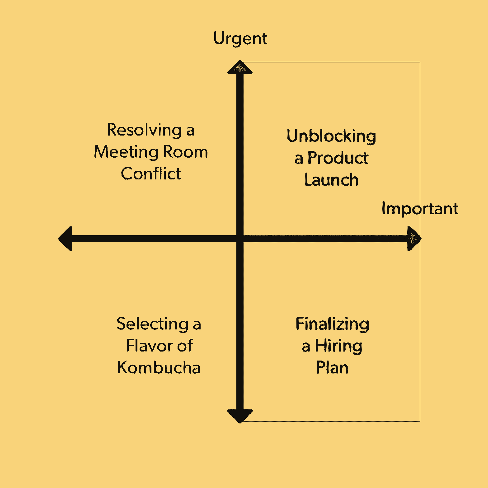
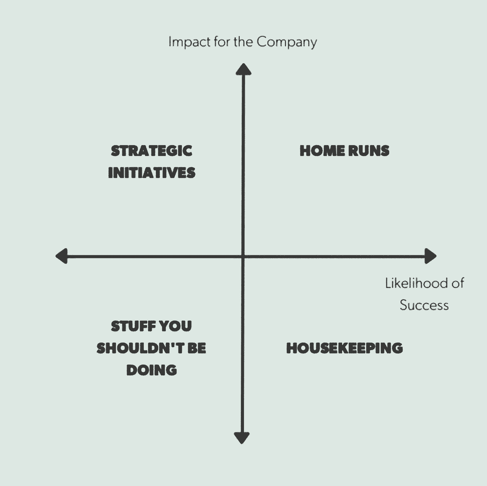
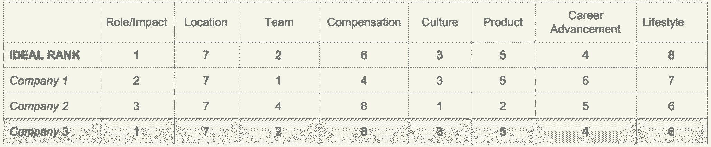
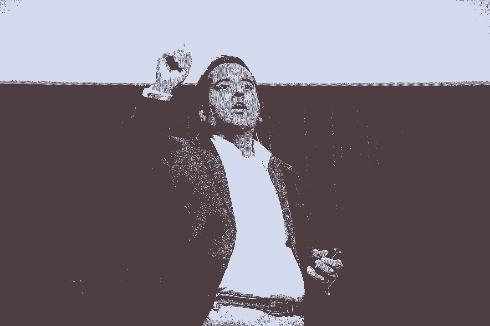
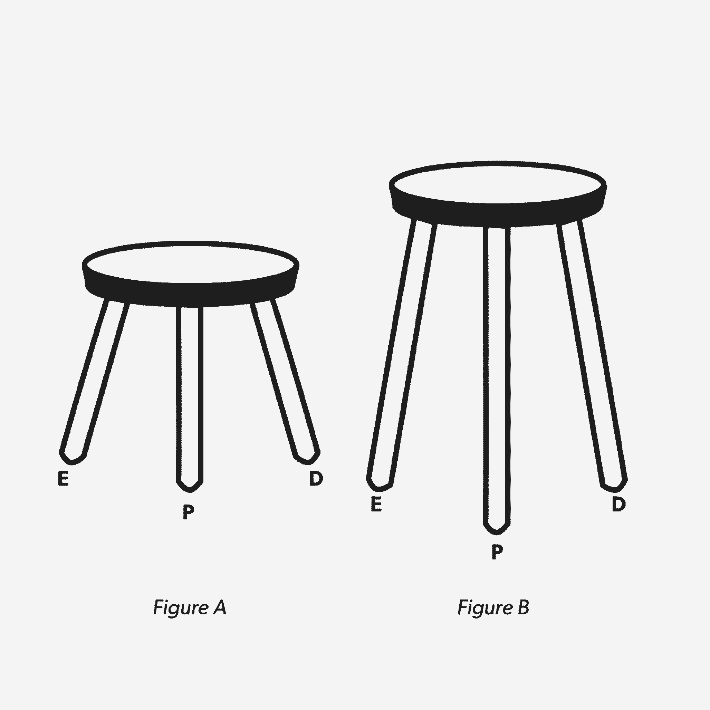
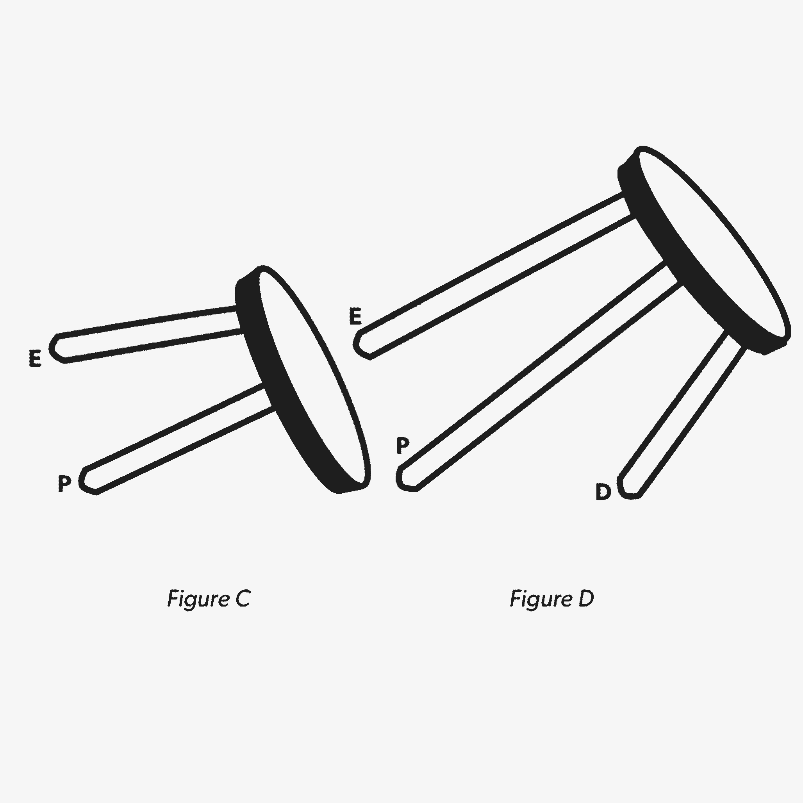

# 2016 年给创业者的 30 条最佳建议

> 原文：<https://review.firstround.com/the-30-best-pieces-of-advice-for-entrepreneurs-in-2016>

在这个时候，回顾传统上反映了我们采访的非凡的人和我们在过去一年里发表的长篇文章。在之前的中，我们向你讲述了前 Twitter 工程总监[大卫·洛夫特斯尼斯](http://firstround.com/review/this-90-day-plan-turns-engineers-into-remarkable-managers/ "null")和 Candor 联合创始人[金·斯科特](http://firstround.com/review/radical-candor-the-surprising-secret-to-being-a-good-boss/ "null")——他们都有非常受欢迎的文章，被广泛分享，导致即将出版的书籍，并在一个案例中，启动了一家新的创业公司。

但是作为今年的复习主题之一，Khalid Halim 提醒我们:[不仅仅是说了什么，还有听到了什么](http://firstround.com/review/the-science-of-speaking-is-the-art-of-being-heard/ "null")。我们寻求帮助领导者释放的强大、未开发的知识，也是通过它如何帮助人们转变他们建立和发展公司的方式来衡量的。

因此，当我们的一位读者去年给我们发来以下信息时，我们非常高兴。这是对 Expensify 首席执行官大卫·巴雷特关于用户获取的文章的回应，特别是关于新用户欢迎导向流的策略。读者是这样写的:

*我们通常在注册后发送电子邮件，但在阅读了戴夫·巴雷特的文章后，我们做了两个关键的改变:* *-我们将注册后的电子邮件改为在注册后 20 分钟发出，而不是立即发出。**——我们更新了内容，以模仿戴夫在他的电子邮件中所写的内容，因此看起来更人性化而不是自动化。* *这使得我们的注册邮件得到了大约 12%的回复，而以前只有 5%左右。这也导致我们与我们最大的竞争对手之一的大客户聊天，因为他们回复了电子邮件，这使我们现在处于与他们的销售周期中！所以我可以说，这一变化对我们的销售漏斗有直接影响！*

我们感谢所有对评论文章的反馈，但我们尤其感谢他的说明。就像巴雷特在分享他的策略时一样，他对这个建议的影响说得很具体。更重要的是，他找到了那篇文章，测试了策略，并在文章发表后*个月*给我们写信——这正是我们继续寻找并展示持久、常青的建议的原因。

因此，当我们开始新的一年时，**我们希望你能在下面的列表中找到相关性和共鸣，这些列表是从我们去年的文章中精选出来的 30 条最有影响力和最深刻的建议。**我们还希望您也能在未来的一年中检验我们已经发布或将要分享的策略。[让我们知道](https://twitter.com/firstround "null")他们是否以及如何帮助你。我们很期待！

1. **[从 CVs 底部开始雇佣原件](http://firstround.com/review/adam-grant-on-interviewing-to-hire-trailblazers-nonconformists-and-originals/ "null")** **。**

畅销书作者兼 **[沃顿](https://www.wharton.upenn.edu/ "null")** 教授 **[亚当·格兰特](http://www.adamgrant.net/ "null")** 花了数年时间研究和采访原著。在他的书《T21 原件》中，格兰特展示了如何识别、培养和培养不墨守成规的人——他认为这是初创公司的领导者必须掌握的技能。一个小技巧是倒着看简历，从最后一页的底部空白处开始，这里通常有一行是关于候选人的爱好、旅行或兴趣的。“寻找具有多功能背景、多元文化经历和广泛兴趣的人。格兰特说:“大多数招聘经理关注的是经验的深度，但广度对创造力至关重要。“一项研究将所有 21 世纪的诺贝尔奖获得者与他们同时代的同事进行了比较，发现突破性进展的科学家参与艺术的可能性明显高于后者:演奏乐器的可能性是后者的两倍，画画的可能性是后者的七倍，写小说或诗歌的可能性是后者的十二倍，表演舞蹈、演员或魔术师的可能性是后者的二十二倍...原创是他们不同兴趣的融合。他们是多学科的制造者、思想家和实干家。”

原件都是建设性的逆势者。他们不仅仅指出皇帝没有衣服；他们也是裁缝。

2. **[加粗。要优雅。](http://firstround.com/review/harnessing-happiness-to-build-your-career-advice-from-an-uber-product-leader/ "null")**

**[弗雷德里克贵妇人](https://www.linkedin.com/in/frederiquedame "null")** 如果不是能屈能伸就什么都不是。她 24 岁时来到美国工作，在一场招聘会上分发简历时，她害怕得发抖。她后来被解雇，被迫想方设法留在这个国家。现在，她已经是[优步](http://www.uber.com/ "null")、 [Photobucket](http://photobucket.com/mobile "null") 和[雅虎的产品负责人](http://www.yahoo.com/ "null")。她对规划你的生活和职业轨迹的建议是:首先，承认这两者密切相关。第二，优化能让你快乐的事情，而不仅仅是地位。做到这一点的一个方法是选择能够很好合作的团队和经理——不管这家公司是不是名牌公司。最后，**练得雄浑******飘逸**。“如果你只是决定无论如何都要好好的，那会怎么样？达姆说:“勇敢就是相信自己能处理好结果。“在科技界，人们不会考虑优雅地表演。优雅意味着深思熟虑，优雅地回应，轻松地对待事情——带着积极的目的在这个世界上行走。它同时具有柔软的触感和坚韧的弹性。而且，根据我的经验，这是一个不可思议的秘密武器。”**

**当你发现自己在想，“哦我以后不能去了……”或者“这是一个疯狂的冒险……”马上追加一句:“没成就没事。”**

**3. **[分诊这四类麻烦制造者。](http://firstround.com/review/reddit-and-facebook-veteran-on-how-to-troubleshoot-troublemakers/ "null")****

**在过去的 20 年里，**[bethanye McKinney Blount](https://www.linkedin.com/in/bethanye "null")**领导了一系列公司的技术团队，从科技巨头脸书到[Second Life](https://en.wikipedia.org/wiki/Second_Life "null")creator[Linden Lab](http://www.lindenlab.com/ "null")到音乐唱片公司 [EMI](https://en.wikipedia.org/wiki/EMI "null") 。她最近是 reddit 的工程副总裁，并创办了两家公司:**[凯茜实验室](https://angel.co/cathy-labs "null")** 和[梅兰克](https://techcrunch.com/2011/11/15/founders-of-email-sorting-startup-mailrank-head-to-facebook/ "null")，后者已被脸书收购。在她的职业生涯中，布朗特看到了麻烦制造者的两面性:才华横溢、固执己见的人也可能傲慢而固执。他们大体上分为四种类型:隐士、怀旧迷、潮流追逐者和房间里最聪明的人。不要忘记你的创始人是第一个麻烦制造者——他们经常不得不把事情搞砸，以推动他们的创业公司走向世界。因此，当你管理麻烦制造者时，记住他们的精神是创业公司 DNA 的一部分，但必须根据公司的阶段进行调整。很少有人故意制造麻烦。有时您可能无法解码它们，但是知道如何识别它们并对它们进行故障排除将会挽救组织并使其受益，理想情况下是两者都受益。能够识别四种类型的麻烦制造者。与他们交谈，寻找他们的相关性和救赎。**

**4. **[对观察者效应保持高度警觉。](http://firstround.com/review/the-principles-of-quantum-team-management/ "null")****

**在量子力学和薛定谔的猫的一个新颖应用中， **[Instagram](https://www.instagram.com/ "null")** 的工程主管 **[James Everingham](https://www.linkedin.com/in/jevering "null")** 鼓励“量子经理”不要将自己插入到她的团队项目中——这相当于打开盒子来观察薛定谔的猫的状态——以允许尽可能多的成功路径。“作为公司的创始人，我不希望我们失败。作为一个人，我想肯定我的想法是好的。作为一个量子管理者，我咬了自己的舌头。最终，我没有参与头脑风暴的过程，因为我知道我的团队会抓住我提供的任何东西。相反，我只是告诉他们获胜会是什么样子:用户参与度增加 300%似乎是一个崇高的目标，但我还是提出了这个目标。几天后，我的团队带着一个我从未想过的解决方案回来了，结果令人震惊，”Everingham 说。“尽管从工程师的角度来看，他们的策略很了不起，但作为一名经理，我从交易所学到的东西更有价值。通过不提供我自己的想法，我创造了一个更好的想法。由于没有建议目的地，我们最终都去了一个不同寻常的地方——一个我甚至不知道我们要去的地方。”**

**成为一名优秀的管理者并不是为了避免失败，而是为了尽可能长久地实现尽可能多的前进道路。**

**5. **[为高期望客户打造。](http://firstround.com/review/what-i-learned-from-developing-branding-for-airbnb-dropbox-and-thumbtack/ "null")****

**这里有一个创始人经常陷入的陷阱:不惜一切代价获得用户。你必须在 DAU 的数据中显示增长，对吗？再想想。所以往往创始人追逐的是日活跃用户，月活跃用户，留存数。“他们认为吸引每一个顾客是解决这些问题的一种方式，”朱莉·潘素说，她曾为 T4 的 Airbnb、Dropbox 和图钉提供品牌咨询。潘素警告说，这是错误的方法。相反，要把注意力放在高期望客户(HXC)身上。她是你的理想用户，“你的目标人群中最有眼光的人。潘素说:“这个人会认可——并享受——你的产品或服务带来的最大利益。”。“如果你的产品超出了她的预期，它就能满足其他所有人的预期。”潘素对 Airbnb 采取了这种方式，Airbnb 的 HXC 是一个好的全球公民，他想像当地人一样旅行。一旦你确定了 HXC，让整个公司了解这些客户，使用他们的语言与他们交流，并不断调查他们，以了解他们不断变化的需求。HXC 是一块宝贵的试金石，可以确保你朝着正确的方向成长，并验证——或否定——你的行动计划。“你的用户会理解这个产品，知道这是为他们准备的。潘素说:“你将削减获得客户的成本，并享受清晰路线图的好处。”。“如果你做了工作，他们会引导你对你的公司是什么和不是什么达成共识。”**

**

Julie Supan** 

**6. **[围绕结果而不是特性来设计产品团队。](http://firstround.com/review/the-power-of-the-elastic-product-team-airbnbs-first-pm-on-how-to-build-your-own/ "null")****

**乔纳森·戈尔登 、 **[Airbnb](http://www.airbnb.com "null")** 的第一任产品经理和现任产品总监都知道，在他的工作中，灵活性可以让你走得更远。当与古巴重建外交关系时，Airbnb 渴望在该国开展业务。在戈尔登的领导下，Airbnb 创建了一个由项目经理、设计师、工程师和数据科学家组成的跨职能团队，该团队将引领 Airbnb 向古巴的扩张。两个月后，Airbnb 的基础设施建立并运行起来——团队几乎一成立就解散了。钥匙？弹性产品团队:由明确的公司目标驱动的模块化单位，与职能领域相对。“很多人打电话给我，问他们应该如何构建他们的产品组织。我总是告诉他们要根据结果来做。如果你是基于特性来做的，那么不管这些特性是否有用，你都要让它们永存。”召集和解散模块化、有弹性的团队，这些团队可以扩展和收缩，以服务于预先确定的结果。**

**7. **[练习丰富的思维。这六个概念会有帮助。](http://firstround.com/review/the-remarkable-advantage-of-abundant-thinking/ "null")****

**你需要的不仅仅是技能，而是心态。广受欢迎的高管教练 **[卡蒂亚·韦里森](https://www.linkedin.com/in/katia-verresen-574251 "null")** 说，你的表现 100%取决于你的态度，她为[【脸书】](https://www.facebook.com/ "null")[【斯坦福】](https://www.stanford.edu/ "null")[【Airbnb】](https://www.airbnb.com/ "null")[Twitter](https://twitter.com/?lang=en "null")[和一些知名初创公司](http://www.kvaleadership.com/ "null")的领导人提供咨询。理想的态度是她所说的**丰富的思维**——一种给你创造力和勇气去实现你的愿景的心态——并且，在每天的基础上，去设计你自己的生活。你可以通过韦里森的六步过程做到这一点:**注意、中立、启动、自悲、慷慨和感恩**。大脑只能吸收这么多。当你过度专注于一项任务或一个想法时，你会错过一些东西。“你没疯，其他人也不傻。只是我们的大脑被设计成能看到它已经在寻找和相信的东西。例如，如果你的信念是‘这是不可能的’或‘我做不到’，那么任何与你相矛盾的东西都会被抛弃，”韦里森说。所以，想想如果你能打破大脑的默认设置，等待你的是什么:显著的创造力和竞争优势。“当你投入时间和精力去注意时，新的大门就会打开。她说:“意外之喜加速了。“你觉得整个宇宙都在支持你。但实际上，你并没有限制自己。”**

**8. **[用 SPADE 框架做困难的决策。](http://firstround.com/review/square-defangs-difficult-decisions-with-this-system-heres-how/ "null")****

****[戈库尔·拉贾拉姆](https://www.linkedin.com/in/gokulrajaram1 "null")** 监督 **[鱼子酱](http://www.trycaviar.com "null")** 在 **[广场](https://squareup.com/ "null")** 现在，但是与谷歌首席执行官[埃里克·施密特](https://en.wikipedia.org/wiki/Eric_Schmidt "null")的一次邂逅从根本上改变了他的决策方式。时任谷歌 AdSense 产品管理总监的拉贾拉姆在一次会议上，施密特问谁应该为一个引起激烈争论的决定负责。三个人举起了手。施密特很快结束了会议，告诉他们一旦弄清楚谁是负责人就回来。拉贾拉姆已经为所有权和做出艰难选择建立了一个框架。当你面对一个对手时，首先要认识到这一点。为此，使用他的图表(下面的*)，该图表根据重要性和紧迫性对决策进行排序。然后应用 SPADE 框架:确定决策的**设置**什么，什么时候，为什么，然后集合合适的**人**。接下来，概述**备选方案**。最后，**决定**和**解释**你的决定。“我敢打赌，如果你今天调查你公司的人关于决策和他们的幸福程度，大多数人会说他们不明白决策是如何做出的。他说:“这个框架可以让你向一家公司清晰地阐述这个过程的每个阶段。“我坚信做出高质量的决策可以从根本上改变我们的工作方式。”***

******

***9. **[先雇为 CX 才有顾客。](http://firstround.com/review/the-case-for-startups-to-put-cx-at-their-core/ "null")*****

***WiFi 系统初创公司 **[eero](https://eero.com/ "null")** 将 CX 置于其核心地位，这要感谢其首席执行官兼联合创始人 **[尼克·韦弗](https://www.linkedin.com/in/nsweaver "null")** 和客户体验主管(CX) **[达纳·林赛](https://www.linkedin.com/in/dana-lindsay-04051461 "null")** 。两人都密切合作以了解和取悦客户:韦弗共同创立了孵化器 [StartX](http://startx.com/ "null") 并在 [Menlo Ventures](https://www.menlovc.com/ "null") 与初创公司一起工作，而林赛为数字出版平台[培训和扩展远程团队](https://www.inkling.com/ "null")。在 eero 的发布会上，他们脑子里只有一个问题:技术支持是每个人最糟糕的噩梦。我们如何以不同的方式重新设定期望？虽然大多数创始人把客户支持作为事后的想法，但 Weaver 从一开始就有意地整合了它。初创公司应该考虑效仿 eero，建立一个专门的团队来收集测试版的反馈，并在大多数初创公司只专注于工程的阶段雇佣第一个 CX 员工。“收据是第一张支持票，”韦弗说。“客户可能还没有寻求帮助，但关系已经开始了。”***

***10. **[从这五个档案中寻找、审查并关闭顶级项目经理。](http://firstround.com/review/find-vet-and-close-the-best-product-managers-heres-how/ "null")*****

*****[托德杰克逊](https://www.linkedin.com/in/toddj0 "null")** 一直是硅谷一些最优秀公司的产品组织的一部分，从谷歌到脸书到 Twitter，在它收购了自己的初创公司后，[封面](http://blog.coverscreen.com/ "null")。现在，他是 **[Dropbox](https://www.dropbox.com/ "null")** 的产品和设计副总裁，在他的职业生涯中，他与数百名产品经理合作过，并雇佣了数十名产品经理。**他发现，最好的产品经理会做三件事:清楚地说明一份成功的简介是什么样的，能够召集团队来构建它，并不断重复，直到他们做对为止。**尽管所有高绩效的项目经理都必须在这三个方面达到目标，但他们并不都有相同的特征。杰克逊已经确定了他个人所知道的五个主要项目经理原型，这些原型显示了可以成为伟大项目经理的不同背景的广度:经典选择、新秀前景、管理咨询难民、工程师/设计师转型的项目经理和营销/商业开发转型的项目经理。“寻找不同的经历和背景很重要，”杰克逊说。“你的用户和顾客可能是不同的人群，所以你的员工也应该如此。这实际上可能是相对于其他公司的一大竞争优势，这些公司在招聘方面过于僵化或千篇一律。”***

***

Todd Jackson*** 

***11. **[语境越深，建议越好。](http://firstround.com/review/advice-is-cheap-context-is-priceless/ "null")*****

*****[希滕·沙阿](https://twitter.com/hnshah "null")** 是三家 SaaS 公司的联合创始人:[【kiss metrics】](https://www.kissmetrics.com/ "null")[疯蛋](http://www.crazyegg.com/ "null")以及最近的[快萌](https://www.quicksprout.com/ "null")。他还是 50 多家公司的天使投资人和顾问。鉴于他的众多角色，他经常被征求意见，平均每天三次，最多一天八次。在讲述他收到的最有影响力的建议时，他意识到 90%的建议之所以如此有效，并不是因为建议本身，而是他表达建议的背景。建议提供者应该总是围绕建议寻求者重新组织问题，而不是他们自己的专长。并且，在提供一系列数据点作为背景之后，建议寻求者应该总是问他们下一步应该做什么。沙阿说:“所有好的建议都是让人们采取行动，而不是做出选择。“你可能认为你需要的只是建议。实践才是你需要的。”***

***12. **[用这些框架打败倦怠。](http://firstround.com/review/practical-frameworks-for-beating-burnout/ "null")*****

***为了与科技巨头提供的高薪竞争，初创公司可以有一张底牌:一个优先考虑员工健康的工作场所， **[花小蕾·萨克森纳](https://www.linkedin.com/in/roli1 "null")** 说，他对铺天盖地的待办事项清单并不陌生。去年，她从 LinkedIn 加入 **[Clever](http://www.clever.com/ "null")** ，领导客户取得成功，但该职位很快扩大到销售、战略合作伙伴关系和运营主管。大工作，大需求——每个人都很熟悉。Saxena 说，但是如果你想吸引并留住合适的人，你需要在倦怠影响到你的团队之前避免它。她概述了一个象限系统(下面的*)，用于根据成功的可能性和影响快速排序待办事项列表，并规定了每一类任务要做什么。例如，以你说过要做但没有做的事情为例。“[它]通常需要某种形式的道歉。也许是你告诉你的老板或直接下属，‘对不起，我做不到。’“在这里拥抱真理至关重要。Saxena 说:“你必须对自己的能力开诚布公。“为了避免精疲力尽，让你的团队知道，只要他们做得很好，他们可以做更少的事情。”****

********

****13.通过引入陌生感来击败竞争对手——再好的捕鼠器也没用。****

****布雷特·泰勒 帮助领导了共同创建谷歌地图的团队，并在脸书收购 FriendFeed 后担任首席技术官。他现在是 Twitter 的董事会成员，也是 Salesforce 最近收购的初创公司 **[Quip](https://quip.com/ "null")** 的联合创始人兼首席执行官。尽管他有创业的血统，泰勒敏锐地认识到自己是一个失败者，他分享了这条重要的建议:建造一个更好的捕鼠器并不足以让你与众不同。事实上，现有的竞争对手有很多优势可以扼杀你的创业，包括根深蒂固的分销渠道和消费者熟悉度。举例来说，谷歌地图在 2005 年推出时，曾奋力超越 MapQuest。消费者只是看不到做出改变的理由。MapQuest 已经做了他们想要的一切，尽管谷歌地图是一个更好的产品。通过让用户感到不舒服来让“更好”变得重要，开始废黜现有者——而用户在乎。“在很多方面，你最安静、最坚定的竞争对手是冷漠，”他说。“底线是你必须建立一个镜头，让用户看到一个新的世界，而不是帮助他们更好地看到一个旧世界的功能。”****

****14.  **[让招聘成为一种资格行为，而不是一种取消资格的行为。](http://firstround.com/review/a-primer-for-startups-and-job-seekers-to-both-win-the-talent-war/ "null")******

****在 **[首轮](http://firstround.com/ "null")** 的 2016 年[创业公司状态](http://stateofstartups.firstround.com/2016/ "null")报告中的一个发现是，雇佣合适的人是创始人关注的首要问题。这并不令第一轮的 Tammy Han 感到惊讶，她与希望招聘的初创公司创始人和希望——或者在大多数情况下实际上没有——被聘用的候选人一起工作。她警告求职者要小心品牌偏见，现实地衡量他们的搜索，永远不要拒绝一份你没有得到的工作。创建并返回决策矩阵(下的*模板)。对于正在招聘的初创公司，她建议他们直接询问候选人的动机，不要害怕提前谈钱，当然，要对他们面试的候选人保持警惕。在今天的市场上，早期创业公司面试来自谷歌和脸书这样的大公司的人并不罕见——这些候选人可能收入不菲，享受着丰厚的头衔和工作场所的便利设施。“你不应该仅凭简历就做出草率的判断和取消资格，也不应该被他们最近在大公司的经历吓倒，”韩说。“如果你退后一步，不再竞争，那是你需要解决的另一个问题。”*****

********

****15. **[在生产产品之前先确定价格。](http://firstround.com/review/its-price-before-product-period/ "null")******

****咨询公司 **[西蒙-库彻&合伙人](https://www.simon-kucher.com/ "null")** 的董事会成员 **[马德哈万·拉曼努贾姆](https://www.linkedin.com/in/madhavan-ramanujam-1533063 "null")** 是价格密语者，为财富 500 强公司和热门创业公司等咨询过这个话题。他的建议是:在你决定到底要生产什么产品之前，从保时捷的剧本中吸取一页，明确人们愿意为它支付多少钱。在测试客户为产品功能付费的意愿方面要积极，就像波尔琪在特大号杯架或六速赛车变速器上所做的那样。就热销的 Cayenne SUV 而言，消费者想要前者，却对后者望而却步。保时捷通过严格剔除客户不愿意花钱购买的功能，避免了无用产品。虽然新产品失败的原因很多，但 Ramanujam 阐述了产品创新失败的四个类别以及如何避免它们——并警告不要把产品定价放在次要位置。Ramanujam 说:“大多数公司推迟定价决定，直到产品开发出来之后。“他们踏上了一段漫长而昂贵的旅程，希望自己能赚钱，而不是知道自己会赚钱。”****

****

Madhavan Ramanujam**** 

****16. **[在三种学习心态之间灵活转换，成为适应性强的领导者。](http://firstround.com/review/the-adaptable-leader-is-the-new-holy-grail-become-one-hire-one/ "null")******

****安妮·德万(Anne Dwane)经历了她的转变——先是加入大学配对服务公司 Zinch 担任首席执行官，然后在公司被收购后成为 Chegg的首席商务官。她适应快速变化的情况的诀窍是不断学习，她磨练了三种学习心态，你需要知道这三种心态:**玩家、初学者和成长**。举例来说，游戏玩家能够专注并形成伙伴关系，而新手则充满童心和好奇心。你应该能够雇佣到能够适应这些风格的人，Dwane 为不断学习的人详细说明了她面试的流程。“知道已经过时了，”德万说。“学习已经成为我们真正的货币。我们不是知识工作者。我们是学习工作者。如果你不积极尝试学习，没人能帮助你。如果你把它作为职业生活的核心，没人能阻止你。”****

****适应性就是专注于一个目标，但在细节上灵活变通。****

****17.像冲浪者一样筹集资金——计划与投资者合作。****

******[第一轮](http://firstround.com/ "null")** 通过见证其公司筹集超过 1000 轮资金和 180 亿美元的后续资金，积累了丰富的知识，建立了自己的投球辅助计划。合作伙伴 **[比尔·特伦查德](http://firstround.com/person/bill-trenchard/#mystory "null")** 和 **[布雷特·贝尔松](http://firstround.com/person/brett-berson/ "null")** 已经收集了各种见解，从如何调整一个人的时间表到如何创造一种比赛动态，再到投球的许多胜败。成功筹资的一个关键策略是制造稀缺。根据经验，在给定的时间内，与不超过五家公司交谈。没有什么比过度交易的感觉更糟糕了，因为风投们喜欢获得一家令人兴奋的公司的内幕消息。将投资者分批分组，以便更好地评估和选择他们，就像冲浪者扫描向岸边移动的海浪一样。“假设你在公司有十几个合伙人，他们可能非常合适。不要把你所有的首选放在第一组的五个里。挑选两到三家排名靠前的风投公司，然后选择排名靠后的公司。特伦查德说:“即使你已经预演过你的推销，你也会继续完善它，所以要让你的时间表多样化，以适应这个学习曲线。”“完善实际宣传需要一些时间。也就是说，不要把你所有的首选留到最后，因为如果在后面的集合中，它们将与你的过程非常不同步。这是一种平衡行为。”****

****18. **[大师讲这三类创业故事。](http://firstround.com/review/the-pivotal-stories-every-startup-leader-should-be-able-to-tell/ "null")******

******[唐·福尔](https://www.linkedin.com/in/donfaul "null")****首席运营官为表演运动装制造商  **[阿索斯](https://www.liveathos.com/ "null")** ，曾在[Pinterest](https://www.pinterest.com/ "null")[脸书](https://www.facebook.com/ "null")和[谷歌](https://www.google.com/ "null")——更不用说指挥一个美国海军陆战队排了。但他成功的秘诀是一个明显不可操作的东西:讲故事。“每当我遇到新的领导者，我总是谈论他们激励人们的责任——挖掘内在动力，努力工作，”Faul 说。“我们很幸运能在一个有意义的工作被完成的行业工作，人们非常希望他们的工作有意义。故事将两者联系起来。这是每个领导者都需要学习的技能。”特别是，Faul 规定掌握三种类型的故事:**失败故事、好榜样故事(鼓励良好行为)和励志故事**。好的故事需要深刻的诚实。“脆弱不会削弱你的权威，”Faul 说。“它让你身边的每个人都变得强大。”******

******恰当的话语可以如此有力。他们能让你觉得一切皆有可能。******

******19. **[忘记技术债。建立技术财富。](http://firstround.com/review/forget-technical-debt-heres-how-to-build-technical-wealth/ "null")********

******作为**[Corgibytes](http://corgibytes.com/ "null")****[的首席执行官，Andrea Goulet](https://www.linkedin.com/in/andreamgoulet "null")** 帮助公司重新架构和现代化应用。她见过各种各样的破损系统、遗留代码，以及技术债务如此极端，基本上就是数字囤积。当谈到技术债务时，大多数 CTOS 看到了问题的到来，但发现很难说服他们的同事，值得花钱来修复已经存在的问题。这似乎是回溯，没有令人兴奋的或新的输出。许多公司直到技术债务开始严重影响日常工作效率时才着手解决技术债务，而到那时，偿还技术债务可能会非常昂贵。**如果你将技术债务重新定义为积累技术财富的机会，你更有可能让你的首席执行官、投资者和其他利益相关者加入进来**——这是敏捷开发教练 Declan Whelan 最近创造的一个术语。“我们需要停止将债务视为罪恶。“当你处于设计和制造产品的早期阶段时，技术债务会非常有用，”古利特说。“当你解决了一些债务，你就给了自己动力。当你在家里安装新窗户时，是的，你花了一大笔钱，但是你每个月在电费上节省了一百美元。同样的事情也发生在代码上。只是你获得的不是效率，而是随着时间的推移而增长的生产力。”******

******停止把你的软件当成一个项目来考虑。开始把它当成一个你会长期居住的房子。******

******20. **[从工程、产品和设计开始融合。](http://firstround.com/review/defining-product-design-a-dispatch-from-airbnbs-design-chief/ "null")********

******Airbnb 的设计团队包括一名前图书管理员、机械师、人寿保险代理人、治疗师和现代舞舞者。Airbnb的设计副总裁亚历克斯·施莱弗(Alex Schleifer)呼吁为设计专业人士提供一个更容易接受的创业环境和明确的行业职业道路。前进的一个方向是从一开始就建立一个工程、产品和设计团队。一些科技公司已经采用了这种方法，因为它涉及并调整了从产品开始到推出的每个功能。例如，一个新功能、产品营销或用户反馈的工作组将涉及三个团队中的至少一个成员。这个联盟不仅集合了产品的关键构建者，而且作为副产品，它还正式确定了想要创造产品的人可以考虑的专业途径。团队应该像一个三条腿的凳子，其中每条腿代表帮助构建产品的三个领域之一。如果从一开始就这样做(图 A)，随着更广泛的组织的扩展，每个功能可以以平行和适当的比例增长(图 B)。******

************

******如果从一开始就没有这些策略，你注定会产生一个不稳定的大便，在这种情况下，这是一个不稳定的产品。这可能是因为没有设计角色在一开始就被开发出来(图 C ),或者是在产品——以及工程和产品管理团队——已经成熟和成长之后添加上去的(图 D)。******

************

******设计师们，如果我们组成一个国家，我们会把谁放在我们的货币上？******

******21. **[写下你从顾客那里听到的任何问题两次以上。这将满足你的内容营销。](http://firstround.com/review/content-is-eating-the-world-contentlys-ceo-on-winning-at-marketings-fastest-growing-trend/ "null")********

******尽管如今“内容营销”如此时髦和热门，首席执行官 **[乔·科尔曼](https://www.linkedin.com/in/joe-coleman-4351b5b "null")** 表示，他不断感到惊讶的是，许多大大小小的公司(包括《财富》500 强)不知道写什么、跟踪什么或他们的目标是什么，即使他们在内容制作上投入了数百万美元。在许多情况下，涉足内容领域的公司在学会走路之前就想跑了。“他们认为，‘好吧...内容策略。我们需要一个博客，社交媒体，一个电子邮件列表，所有这些都同时需要。走吧！”他说。相反，你的第一步应该是和现有的公司谈谈。”让您的销售团队参与进来。让他们不断分享他们得到的问题或他们遇到的挑战，并绘制热图。科尔曼说:“真正挖掘这些数据，找出你应该写些什么。科尔曼说:“在这个阶段，你必须对自己非常诚实。不仅仅是你要不要和能不能生产内容。而是你能不能做到不半斤八两。否则，你会对你的品牌造成真正的损害。“这个过程的一部分可能是发现你根本不需要内容，或者现在不是时候。受众分析应该先于让某人全职运营内容营销。******

******如果你不痴迷于创造真正伟大的优质内容，你就是在浪费时间。******

******22. **[不要试图 10x 各队的输出。将许多 1x 团队放在一起。](http://firstround.com/review/to-build-great-products-build-this-strong-scalable-system-first/ "null")********

********[Reddit](http://www.reddit.com/ "null")****[的产品联合副总裁 Alex Le](https://www.linkedin.com/in/lealex "null")** 和 **[Kavin Stewart](https://www.linkedin.com/in/kavin "null")** 分享在公司生命的每个阶段打造产品的丰富经验。他们都经历了很多成功和失败。一个关键时刻是从产品/市场适应到增长的彻底转变——这是一个让太多有前途的初创公司破产的拐点。“随着公司变得越来越大，看到大多数公司陷入越来越长的迭代周期是很可怕的，”乐说。“需要有人关注这件事。比如，收集每次发布需要多长时间的数据。相似特性的发布需要多长时间。每个 sprint、每个季度等推出多少功能。你必须知道完成一件事情需要多长时间，这样即使你增加了更多的人员和项目，你也能确保它保持相对不变。我们的目标应该是并行处理更多同时发生的迭代。”像脸书这样的公司在缩短迭代周期方面做得非常出色。“他们不是通过在一个项目中增加一群人来做到这一点的。斯图尔特说:“你希望许多小项目都能同时产生学习成果。“为此，你需要健康的沟通，这种沟通来自对产品运营的关注。”******

******23. **[用这些行为经济学的招数解码你的客户。](http://firstround.com/review/build-your-user-base-with-these-human-behavior-hacks/ "null")********

******人们非常不可预测。他们会支付 30 美元的出租车费，但不会支付 2 美元的应用程序费。你可以建立或摧毁整个公司，这取决于你是否正确地执行了客户开发——建立一个愿意购买你产品的市场的科学。要真正了解客户想要什么，你需要钻研行为经济学，这是辛迪·阿尔瓦雷斯 在 **[Yammer](http://www.yammer.com/ "null")** 和现在的微软公司作为客户基础呼风唤雨者的秘方。“对于几乎所有的初创公司来说，最大的风险不是技术上的。阿尔瓦雷斯说:“关键在于是否有人会关心和购买。“你必须意识到大多数人的固有偏见，并设计[调查]问题来抵消它们。否则，人们会认为他们在诚实地回答。如果你信以为真，你最终会创建一家错误的公司。”阿尔瓦雷斯列出了公司面临的四种偏见，以及如何捕捉有洞察力的定量客户数据——即使结果很痛苦，也要接受。******

******对于一个创始人来说，他们的公司就是他们的宝贝。没有人愿意听到自己的宝宝长得丑。******

******24. **[裁员不偷袭你。学习他们的四个阶段。](http://firstround.com/review/how-to-lead-and-rally-a-company-through-a-layoff/ "null")********

******贝丝·斯坦伯格 已经为从时尚零售商诺德斯特龙到脸书**的每个人带来了大约 1 万人。**她显然是一名招聘专家——但在她工作过的几乎每家公司，她都不得不裁员，在她的职业生涯中裁掉了近 2000 个职位。她对永久性裁员(或者更准确地说是 RIFs 或裁员)的建议是什么？为 RIF 的四个阶段做好准备:在你知道它要来之前，当你知道它要来的时候，当它正在发生的时候和它发生之后。她建议与你所有的经理分享预算数字，而不仅仅是高管。斯坦伯格还详细说明了一旦你的最高层知道了裁员的消息，该如何、何时以及与谁分享。一旦你准备好发布重大公告，斯坦伯格认为有两种方式最有效:一种是公司全体员工，由首席执行官发布公告；另一种是直接经理向团队宣布，然后公司召集全体员工，让首席执行官详细说明。“裁员改变了所有创始人，并让一些人成为了领导者，”她说。“当裁员进行得尽善尽美时，你最终会看到前员工回来工作。”******

******

Beth Steinberg****** 

******25.使用这四个元模型来确保你不只是在说话，而是被人听到。******

********[哈立德·哈利姆](https://twitter.com/khalidhalim "null")** 是 **[Reboot](https://www.reboot.io/ "null")** 的联合创始人，这是一家教练公司，在诸如[比特币基地](https://www.coinbase.com/?locale=en "null")、 [Lyft](https://www.lyft.com/ "null") 、 [Kickstarter](https://www.kickstarter.com/ "null") 和 [Etsy](https://www.etsy.com/ "null") 等公司的早期成长道路上与这些公司的领导人合作过。作为一名受欢迎的专业教练和前 turnaround 首席执行官，Halim 擅长理清复杂的公司沟通，以帮助组织建立在一个故事之上。Halim 利用他在神经语言编程(NLP)方面的培训和专业知识来改革领导者与团队沟通的方式，反之亦然。四个元模型——或者说人们如何看待世界的过滤器——已被证明是他指导过的领导者的特别有效的工具:**朝向与远离、内部参照与外部参照、特定与一般以及看/听/读/做。**【创业者】和所有人一样，只使用他们拥有的最佳策略——年轻时就已经连线好的交流预设。哈利姆说:“当创始人能够与所有人沟通并产生共鸣时，她就成为了一名罕见的领导者。“这需要在交流中有意识地改变——一种觉察、一种正念、彻底的自我探究。只有到那时，领导者才会明白，说什么不重要，重要的是听到了什么。”******

******26. **[逃出云牢。](http://firstround.com/review/the-three-infrastructure-mistakes-your-company-must-not-make/ "null")********

******1992 年，当阿维·弗里德曼 准备大学毕业时，在费城根本买不到互联网服务——所以他创立了这座城市的第一家互联网服务提供商。他还在全球主干网提供商 AboveNet、 [Akamai](https://www.akamai.com/ "null") 和 ServerCentral 担任领导职务。他最近成立了 Kentik，让公司全面了解他们的网络流量、性能和安全性。简而言之，Freeman 对技术基础设施略知一二。**他见过的创业公司最大的错误之一——也是经常导致公司倒闭的错误——是不知不觉地把自己送进了云监狱。**许多初创公司在兑现了将基础设施放在云上的慷慨信贷后，在方向盘上睡着了——醒来后却发现这已成为他们最大的成本，而且很少有轻松优化的长期解决方案。相反，他们应该从运行多云开始，最终建立一个小型基础设施，与云提供商交叉连接。弗里德曼还警告读者，不要被“潮人工具”所吸引，不要为可监控性而设计，而是要保守地玩，建立制衡制度，不要向趋势低头。创业公司有足够多的挑战；对基础设施的一点深谋远虑可以帮助你控制公司的大部分命运。******

******27. **[绩效点评≠职业对话。](http://firstround.com/review/three-powerful-conversations-managers-must-have-to-develop-their-people/ "null")********

********[Candor，Inc.](http://www.radicalcandor.com/ "null")** 联合创始人 **[Russ Laraway](https://www.linkedin.com/in/russlaraway "null")** 是一位受欢迎的人才顾问，他在谷歌的职业发展框架提高了数百名员工的敬业度。他培养和留住人才的万全之策？帮助员工阐明他们职业生涯的长期愿景。你可以通过优先考虑三次职业对话来做到这一点，这三次对话是旨在了解员工过去和他们未来发展方向的深度对话，而不是绩效评估。然后超越并让他们走上预定的道路，从帮助他们与他们想要的领域的顶尖人物建立关系网到投资相关的课程。“让你员工知道你有多支持他们，以及你愿意为确保他们实现理想工作付出多大努力，这一点非常重要。这是最能激发忠诚的方式，”拉罗威说。确保您的员工正在获得——并且知道他们正在获得——他们需要的工具和经验，以他们渴望的方式前进。**没有空洞的晋升或仪式性的绩效考核。相反，选择真正的对话——和真正的行动。********

******28. **[只有在验证了你的 MVP 之后，才投资数据科学。](http://firstround.com/review/doing-data-science-right-your-most-common-questions-answered/ "null")********

******很难相信“数据科学家”在 2008 年才成为一个名副其实的职位。脸书大学的杰夫·哈默巴赫尔和 LinkedIn 的[DJ·帕蒂尔](https://www.linkedin.com/in/dpatil "null")创造了这个术语，以捕捉对分析、工程和产品跨学科技能的新兴需求。如今，对数据科学家的需求激增，随之而来的是需要更好地了解如何发展这些团队以取得成功。但根据 **[Instacart](https://www.instacart.com/ "null")** VP 数据科学 **[Jeremy Stanley](https://twitter.com/jeremystan "null")** 以及技术顾问、前 LinkedIn 数据负责人**[Daniel Tunkelang](https://twitter.com/dtunkelang "null")**的说法，不要因为数据科学性感就贸然招聘。如果他们要抛出一个最重要的建议，那就是:在你验证了你的 MVP 之后，是时候考虑投资数据科学了。一个成功的产品发布应该产生足够多的数据来学习，你需要让那些能从中提取价值和洞察力的人参与进来，从而跟上数据流。否则，过早建立团队是一种昂贵的分心，会挫伤你的天赋，并可能有持久的负面文化影响。******

******数据科学需要数据来科学，大部分公司第一天都没有多少数据。******

******29. **[通过深思熟虑的入职流程建立创始人关系。](http://firstround.com/review/the-only-onboarding-timeline-youll-need-from-offer-to-first-friday/ "null")********

********[渗滤液](https://percolate.com/ "null")** 联合创始人 **[诺亚布瑞尔](https://www.linkedin.com/in/noahbrier "null")** 建立了一个营销平台，超过 400 家客户使用该平台，包括联合利华、通用电气和万事达等全球品牌。他在渗滤液的核心原则是创始人联系——保持创始人和团队之间的亲切感。他设计了一个深思熟虑的详细入职流程来巩固这种联系。他详细描述了这个多步骤的过程，从签署聘书到新员工到达前的周五，再到新员工的第一天及以后。这个过程以首席执行官的时间结束。遵循渗滤液的模板，让你的员工从一开始就参与进来。布瑞尔说:“你在一家公司的第一周对你对这家公司的感觉、你如何让自己振作起来以及你会有多有效率有着巨大的影响。”"这是你工作经验、能力和情感联系的基础."******

******30. **[颁发斯巴达之盾奖。](http://firstround.com/review/this-company-retains-95-percent-of-its-employees-heres-its-secret/ "null")********

******当人们加入**[地点实验室](http://locationlabs.com/ "null")** 时，他们就留了下来。该公司拥有 95%的员工保留率，从未解雇过一个员工。乔尔·格罗斯曼(Joel Grossman)从十多年前开始当实习生到现在的角色首席运营官，他一直都坐在前排。自从这家公司获得风险投资支持并深陷亏损，直到 2014 年被网络安全公司 [AVG](http://free.avg.com/gb-en/homepage "null") 成功收购，他一直在这家公司工作。他和他的同事们保持记忆力的秘诀是什么？Grossman shares 有几个观察结果，从较少关注流失(更多关注员工如何与管理层和其他人互动)到跟踪推荐率作为保留的主要指标(60%的 Location Labs 员工进行了推荐；40%的新员工是推荐人)。一个策略是颁发斯巴达盾奖，Location Labs 用它来表彰合作良好的人。“我不是军事专家，但据我所知，斯巴达盾实际上是一面大盾，它不是为了保护你而设计的，而是为了保护你旁边的人。他们会组成一个方阵——不是个人，而是一个比个人的总和更强大的团队。每个人都依赖于他旁边的人的保护。你在保护你身边的人的安全。”该奖项颁发给任何竭尽全力帮助他人的员工。赢家通常会花额外的时间帮助另一个团队完成与他们没有直接责任的项目。******

*******亚历杭德罗·加西亚·依班娜的插图。照片由* *[邦妮·雷·米尔斯](http://www.bonnieraemillsphoto.com/ "null")* *和李凯文拍摄。*******