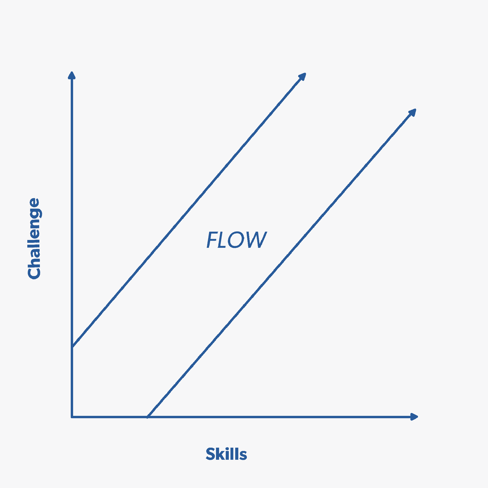
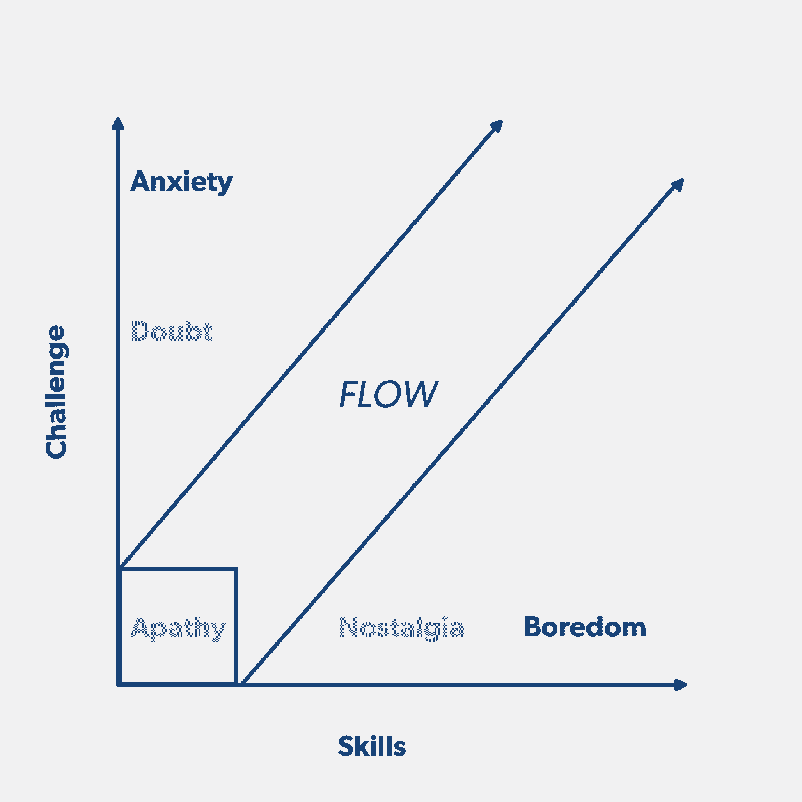
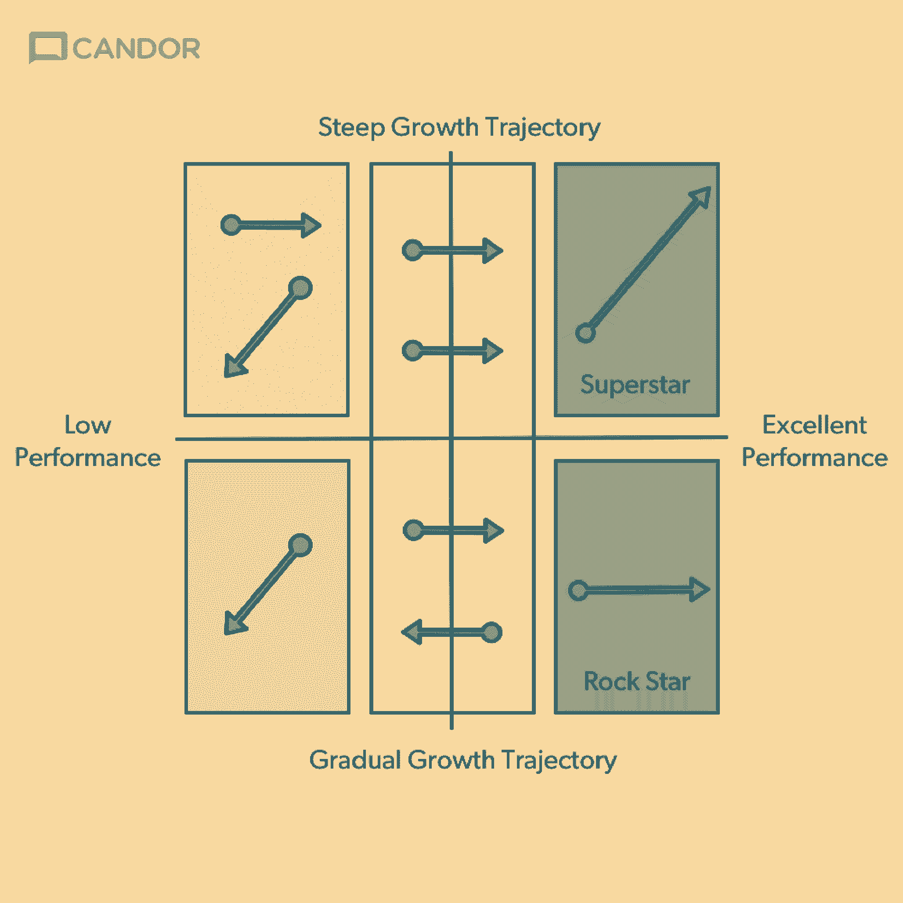
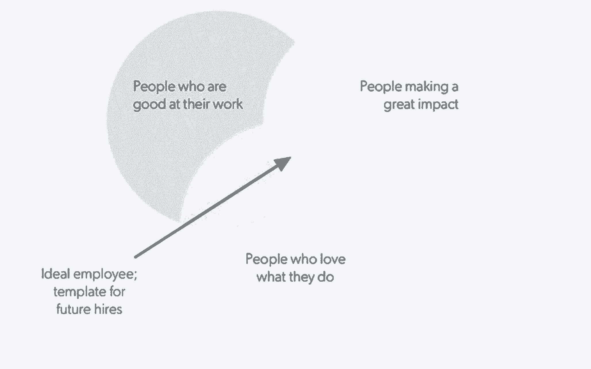
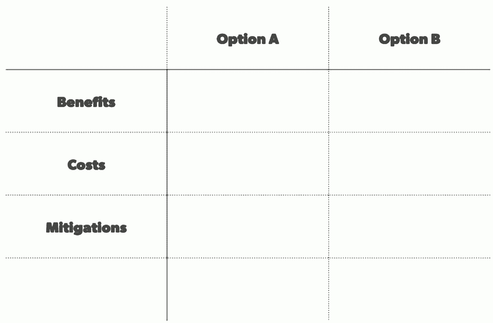
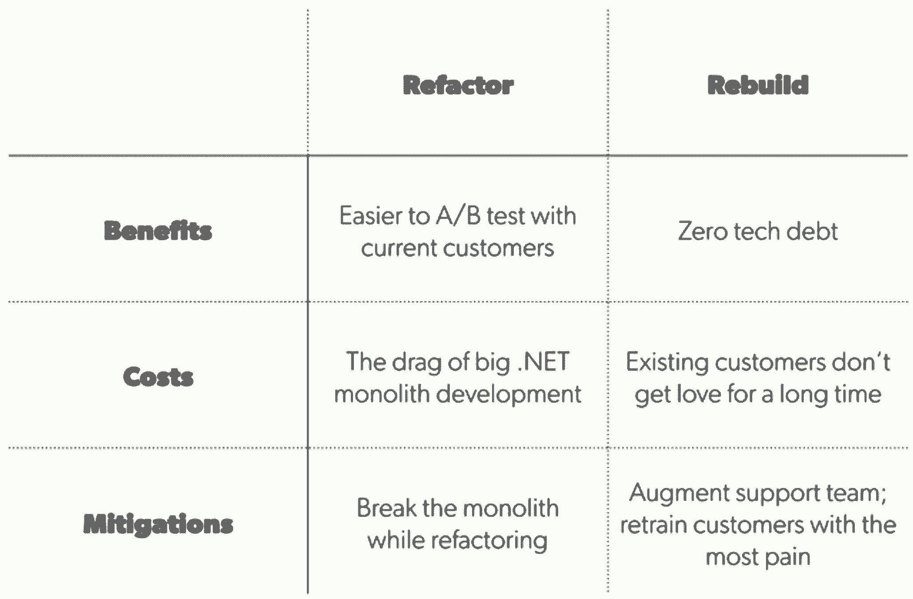
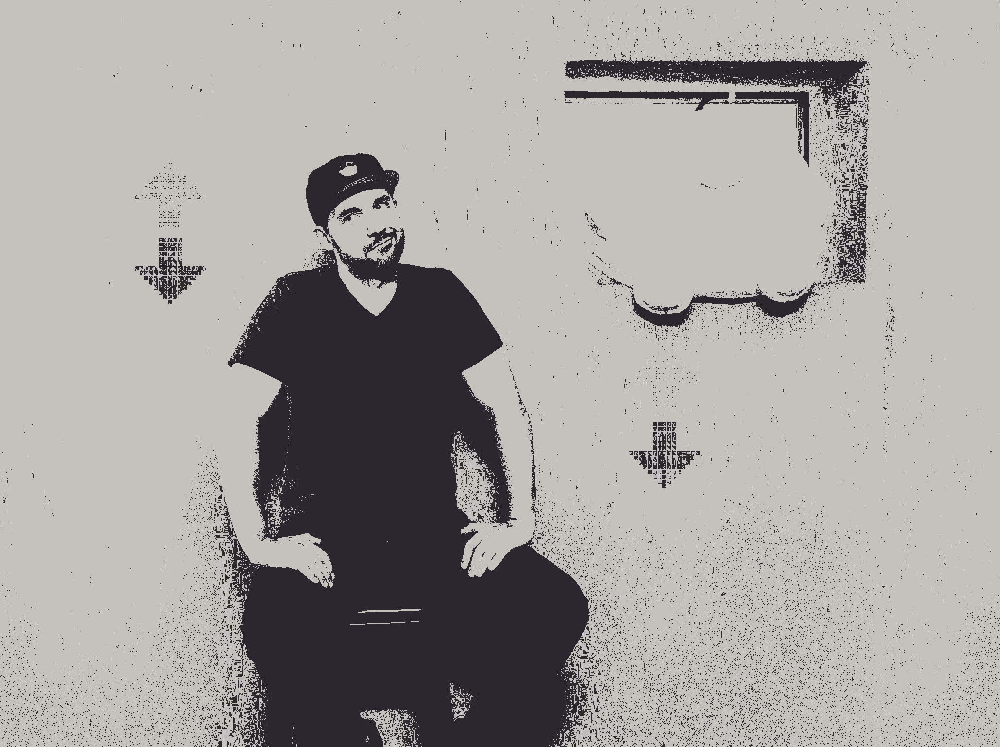
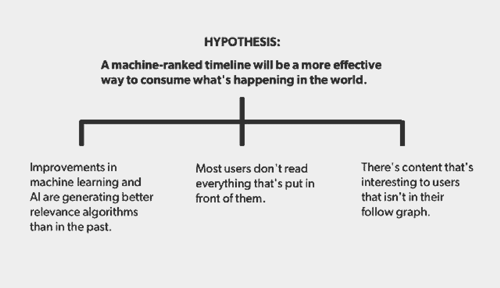
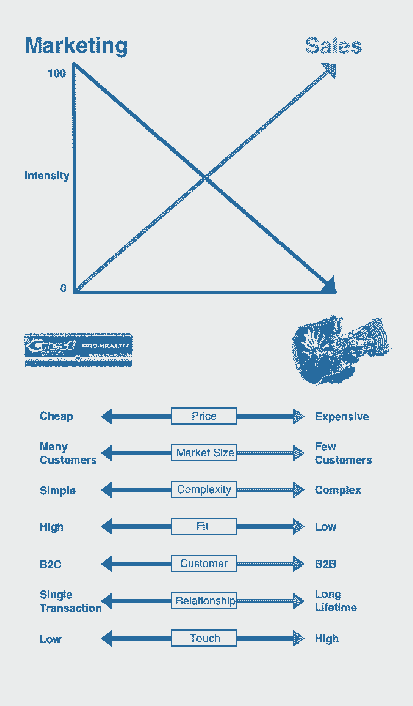
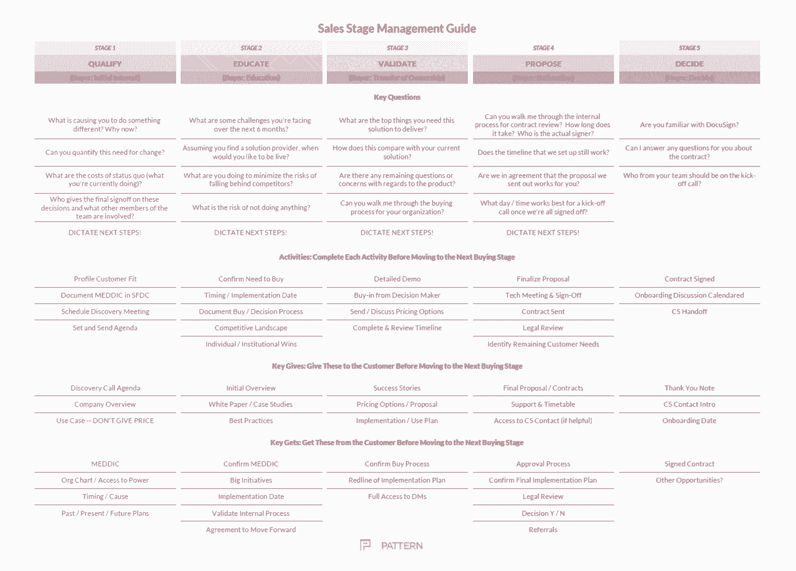

# 2017 年给创业者的 30 条最佳建议

> 原文：<https://review.firstround.com/the-30-best-pieces-of-advice-for-entrepreneurs-in-2017>

当我们浏览我们在 2017 年发布的内容以突出分享的最佳知识时，有两件事引起了我们的注意。**首先是**，我们非常兴奋地推出了一个众星云集的非凡运营商阵容——包括但不限于 [Instagram 首席技术官迈克·克里格](http://firstround.com/review/how-instagram-co-founder-mike-krieger-took-its-engineering-org-from-0-to-300-people/ "null")、[脸书产品副总裁 Fidji Simo](http://firstround.com/review/how-facebooks-vp-of-product-finds-focus-and-creates-conditions-for-intentional-work/ "null") 、 [Reddit 联合创始人亚历克西斯·奥哈尼](http://firstround.com/review/the-donts-that-turned-alexis-ohanian-into-the-leader-he-is-today/ "null")、 [Foursquare 首席执行官丹尼斯·克劳利](http://firstround.com/review/lessons-in-tenacity-from-the-co-founder-of-foursquare/ "null")和 [Stripe 首席运营官·克莱尔·休斯·约翰逊](http://firstround.com/review/to-grow-faster-hit-pause-and-ask-these-questions-from-stripes-coo/ "null")。第二，也是更重要的一点:**我们以将近 50-50 名女性和男性领导者结束了这一年**(确切地说是 46%的女性)。在这个行业中，知名度和榜样可以产生巨大的影响，我们很高兴尽自己的一份力量，并有动力在明年做得更好。

我们在这里收集的建议是一幅织锦，展示了技术精英们认为人们现在应该知道的最重要的事情。在我们每次采访之前，我们都会和我们的采访对象一起选择一个他们认为真正及时和紧急的话题——比如他们经常被问到的问题，或者他们知道让太多人夜不能寐的事情。为了编写这份年终总结，我们重读了一遍，以集中他们分享的最紧迫和最有影响力的智慧——他们自己发明或应用的战术、行动、系统和框架，以在关键时刻取得成功，失败不是一个选项。

现在这一切也是你的了。带着它，让 2018 成为你的一年。我们会支持你的(因为我们会写得更多)。

Edith Harbaugh 领导产品和工程团队近二十年。但她并非所有的管理知识都来自编码。这位[的首席执行官经常骑 3360 英里的自行车去冰川国家公园，在此期间，她学会了](https://launchdarkly.com/ "null")[监控自己的精力](http://firstround.com/review/The-Brain-Hacks-Top-Founders-Use-to-Get-Stuff-Done/ "null")、[适应变化](http://firstround.com/review/the-adaptable-leader-is-the-new-holy-grail-become-one-hire-one/ "null")，并在岔路口做出决定。

她给创业公司和软件行业上的最重要的一课是什么？**每次乘坐都从零开始**。每天她都把自行车上的里程表设为零，计划达到每天的目标，比如 50 英里。对于循环和软件开发来说，度量是至关重要的——观察可见的进展是激励。感觉自己有 80%的工作要做，会让一个人每天对目标的贡献变得微不足道。一旦你确定了方向，就从一张白纸开始每一天。每天从零开始增加团队的关注，产生具体的成就感和前进动力，并有助于防止自满。

EazeCEO[Jim Patterson](https://www.linkedin.com/in/jimp79/ "null")——他是前空军，有雇用前厨师做项目经理的记录(包括一个后来成为 Clover Health 的首席运营官[)——信誓旦旦地列出了项目经理的理想品质，这些品质也决定了他在军队和厨房的成功。作为引子，下面是他建议的清单:](https://www.linkedin.com/in/wkeenan/ "null")

能够在没有权威的情况下领导。

总是在给予信任的同时接受指责。

不完全信息下的强决策。

重视紧张的准备工作。

有条不紊地从错误和危机中恢复。

在极端压力下最佳运行。

虽然你遇到的项目经理中很少有人可能是前厨师或士兵，但这份名单可以作为招聘产品经理的标准，这些经理拥有成功胜任这一职位的原始技能。所以，如果你在简历上看到“快餐厨师”，也许可以考虑把它放在最前面。

产品是一项艰苦的工作，没有人真正为你工作。工程团队不向你汇报。他们不一定非要按你说的做，但无论如何你都要做他们的领导。

作为 Slack 的工程总监，[辛西娅·麦克斯韦](https://www.linkedin.com/in/cynthiamaxwell/ "null")向她的团队发出了一份敬业度调查，其中一项指标让她感到最自豪:100%的员工表示，他们觉得自己参与了工作决策。什么是苹果，雅虎！，还有 Pinterest 老手的秘密？她开发了一个框架来帮助她的团队达到并保持心流状态。

下面的简单图表是为直接下属设计的，让他们快速而坦率地描绘出自己的工作满意度，同时给经理们一个讨论如何让他们参与进来的切入点。

**图一**

**图 B**

在 1:1s 中，向您的报告展示标有**的图表图 A** 。这是一个简单的图表，由一个“流动光束”贯穿，这是一个技能和挑战相遇的期望目标区域。**图 B** 是经理版本的图表，可作为有用的参考。它包括当有人不在状态时的指示牌，这样经理可以帮助他们的团队回到正轨。

这不是绩效评价。这是一个执行评估。问题是:我怎样才能让你更投入工作，而不是让你做更多的工作？

二十年前，[克里斯·弗拉里奇](https://www.linkedin.com/in/chrisfralic "null")只是甲骨文公司的一名软件销售员。如今，他是负责对 Warby Parker、Roblox、HotelTonight 和 Adaptly 等公司进行首轮投资的合伙人。当被问及是什么让他的职业生涯成为可能时，他会直截了当地告诉你是他的关系——他被公认为是一个拥有丰富专业知识的世界级超级联系人。今年，他解开了他所遵守的 **7 条规则，以在每次互动中传递能量，并建立令人难忘的联系:**

传达真诚的感激:积极表现出热情和活力。据观察，当人们感到被你喜欢时，他们就会喜欢你。

**用心倾听:做一个好的倾听者有两点:** 1)证明你确实听到了对方所说的话，2)鼓励他们继续听下去。询问与您刚刚获得的信息相关的后续问题。

**使用谦逊标记:**承认你自己的易犯错误和人性的不完美可以让你变得更有亲和力。“我经常会在谈话开始时说，‘我一直都是错的，我很可能就在这里，’”fra lic 说。

提供不加修饰的诚实:你可以尽可能的诚实，让自己与众不同。请记住，你的诚实要建立在对另一方真正有用的基础上。

**天马行空的头脑风暴:**也许你不能提供某人正在寻找的东西。但是，如果你能通过与他们进行公开的头脑风暴来改变他们思考问题的角度或方式，你会让他们觉得他们得到了一些特别和意想不到的东西。

给予之前想着自己会得到什么。在期待或要求回报之前，总是提供一些有价值的东西。关键不在于互惠。

**在你希望下次开始的地方结束每次会议:**假设你会再次遇到每个人，当你遇到时，你希望那个人认为，“哦，太好了，是某某！”不，我想我会想办法挺过去的。如果你设想你希望事情如何发展，这无疑会影响你如何驾驭当前的对话——通常是朝着更好的方向。

如果你想和某人建立联系以推进你的目标，你需要确切地知道你为什么关心那个人或他们的公司。当你的真诚来自勤奋的准备时，奇迹就会发生。

众所周知，金·斯科特在谷歌、苹果、Dropbox 和 Twitter 等公司帮助建立团队。因此，当这位[激进坦诚的先锋](http://firstround.com/review/radical-candor-the-surprising-secret-to-being-a-good-boss/ "null")得知她多年来一直错误地衡量团队的表现*时，人们感到惊讶。她犯了什么大错？根据“潜力”评估她的团队，但没有承认人们不同的成长道路。两个最不同的轨迹是**巨星模式**和**摇滚明星模式**:*

超级明星是那些在地位和表现上飞跃的人。他们是你团队成长的力量和源泉。

**摇滚明星**才华横溢，多年来满足于自己的角色。他们提供卓越、教育和稳定。

Scott 强调说**这两种模式下的人都需要找到合适的机会，并且应该在你的公司有同样陡峭和受尊重的成长轨迹**。她设计了一个框架(见下图)来帮助识别人们正处于哪种模式，向哪种模式靠近或远离哪种模式——并敦促经理们与他们的团队进行讨论，以确定每个成员每年在图表上的位置。

Kim Scott

多年来，Stripe 一直在以极快的速度增长，但据首席运营官称，最大的挑战是如何将新员工融入如此复杂的组织。为了快速而认真地成长，她建议初创公司定期暂停，并回答以下六个问题:

**我们是否记录了我们的运营原则？你需要记录描述你工作方式的核心原则。它们应该足够清晰明了，以至于咨询它们的人会做出和你的公司创始人一样的决定。**

**什么样的结构能帮助我们实现目标？**你想经营一个扁平化的组织吗？有层次？你需要决定什么是最有效的。您还希望预见到任何给定桌子周围的人的大小、形状和数量肯定会发生变化。

迄今为止，谁在我们公司取得了成功？“花时间问:好吧，我们雇佣了什么样的人？谁做得很好？谁在以与公司相同的速度扩展？那些人有什么特点？”约翰逊说。你想雇佣更多的人，他们不仅拥有合适的技能，而且过得很愉快。

我们有五年计划吗？约翰逊坚信公司应该写下长期计划。但重点是:**应该不长**。它应该简单到三到五段，简要描述公司希望确保在未来五年左右追求的最大的宏观目标。在做出产品决策时，你希望人们参考这个计划——“这个新想法或新功能服务于我们的总体目标吗？”或者‘即使它不符合我们的任何一个 5 年目标，我们也应该推出它吗？'

我们有办法衡量员工体验吗？例如，Stripe 每六个月对其员工进行一次调查。对于约翰逊来说，调查中最重要的问题是:“我觉得我每天做的工作和公司的成功有直接关系吗？”查看您收集的数据，并尝试诊断您看到的任何问题。

**我们正在下放决策权吗？**为了确保你能做到，约翰逊开出了与住院医师培训项目相同的方法:见一个，做一个，教一个。

[更多关于这些以及如何在你自己的公司实施的信息，请点击这里](http://firstround.com/review/to-grow-faster-hit-pause-and-ask-these-questions-from-stripes-coo/ "null")。

Foursquare 的联合创始人丹尼斯克劳利说，最微妙的决心形式之一是作为私人真理的坚韧。也就是说，不经意的观察者可能不知道 Foursquare 团队一直将自己定义为一家与 Snap、Twitter 或苹果地图有合作关系的位置智能公司，而是继续通过其消费者应用的使用指标来评估它。

作为一名创始人，你可能会发现自己在早年，坐在你还不能分享的商业数据或战略上。克劳利说，现在是时候加倍努力，坚持你的伟大想法了。“每周在公司会议上重复你正在做的事情。互相提醒。解释你如何定义成功，并在内部强化这一点。”

Gil Shklarski 的职业生涯致力于解决极其复杂的问题。无论是让脸书变得更安全，还是为微软的地图建设基础设施，抑或是如今作为熨斗健康公司的首席技术官领导着一个庞大的技术团队，他经常需要帮助一大群人在做出高风险决策时保持一致。事实上，他在这方面做得太多了，以至于他创建了一个关于如何做的具体框架。

它从一个基本图表开始，顶部是你正在决定的两个(或更多)选项。在左栏中，您有收益、成本和独特的缓解措施。

列出成本和收益是简单明了的，但当你开始缓解时，神奇的事情发生了，“这是主持人应该引导团队如何软化、减轻或分配与每个选项相关的风险的地方，”Shklarski 说。“如果你还没有这样做，这个练习将迫使你和每个人仔细思考如果选择了这个选项会是什么样子。”

例如，Flatiron 最近不得不决定是否重构一小部分用户使用的计费软件，另一个选择是从头开始重建一个类似的产品。这是他们的矩阵结果:

达明·胡珀-坎贝尔在 T2、易贝、谷歌和优步领导了多元化和包容性的工作。他的第一个目标不是转向正式的 D & I 训练，而是将排斥的经历人性化和正常化。

方法如下:将团队成员分成两人一组，给他们这样的提示:**回想一下你自己生活中感到被排斥的一件个人事件——不管是什么时候或为什么。**要求每一组诚实地详述这次经历，并找出他们当时感受到的几个形容词。重新分组，找几个勇敢的志愿者。让他们分享，不要容忍被打断。

Hooper-Campbell 解释道:**关键是，现在为你工作或试图为你的公司工作的人都有这种感觉。“在不到一个小时的时间里，你可以通过联系我们所有人的共同点来快速跳过政治正确和表面层面的对话:感觉被排除在外。”看看他在第一轮 CEO 峰会上如何运用这一练习:**

在 2006 年将 Reddit 出售给 Conde Nast 后，Alexis Ohanian 现在全职重返公司，他有很多时间进行反思。今年早些时候，他坦率地分享了他在为其他一些创业公司提供咨询的长期工作中所学到的东西。特别是，**他专注于他没有做的对他的职业生涯产生重大影响的事情，其中一个重要的问题是没有选择看起来完全反对风险的导师或榜样**。

理想情况下，你希望身边的人能让你放弃冒险的欲望，如果这是必须发生的。选择导师、投资者、顾问，他们有广阔的视角和长期观察公司兴衰的历史。你希望那些已经看够了的人知道他们已经看得太多了，并最终说服你去推动自己。

奥哈尼安最先体验到这一点的是 YC 的联合创始人杰西卡·利文斯顿，她建议他在 22 岁时去纽约进行一次虚假的记者之旅——或者更确切地说，试图凭空制造一堆记者对话。起初，他被吓住了，犹豫不决。但是，自己经历了很多，利文斯顿能够把它放在正确的角度，使它听起来不那么重要。他完成了这件事——如果不是这样，他永远也不会联系到 Reddit 的出售。

Alexis Ohanian

在 [Looker](https://looker.com/ "null") 、LiveOps、Netscape 和 ReadyForce 等公司领导技术团队几十年后， [Lloyd Tabb](https://www.linkedin.com/in/lloydtabb/ "null") 最大的教训不是你所期望的——或者你想听到的:**你衡量了错误的指标。我们都是。**

科技公司内部经常被抬高的数字——从每日活跃用户到收入增长——有效地比较了公司，但不一定有助于它们更好地运营。他将这些测量描述为**虚荣度量**。相反，他敦促公司跟踪清晰度指标:运营指标，如推动增长的活跃参与时间。

为了不陷入虚荣度量陷阱，Tabb 建议将用户活动和里程碑集中到一个事件流中。事件流显示了人们如何在您的产品中移动的综合视图，使您能够分析他们的行为，并跟踪您的指标如何相互影响。

一旦你创建了你的事件流，他建议尝试一个简单的练习:“**计算你的用户一天中与你一起度过的活跃的五分钟时间段的数量，并在他们的行为中寻找行动的集群——以及不行动的差距。这是一种了解客户实际行为的廉价方式。他们在一个页面上花费大量时间是因为他们感兴趣还是他们感到困惑？如果他们正在购买，他们在购买前会浏览多少页面？”塔布问道。“如果您没有在事件流中按时间排列数据，您将永远无法回答这些问题。”**

Fidji Simo 是一个很好的例子，她在自己的职业阶梯上飞黄腾达。如今，她是脸书所有视频、新闻和广告业务的产品副总裁，管理着一个拥有 400 名项目经理的组织。当她六年前加入公司时，她是一名产品营销经理。她迅速崛起的原因是什么？**她的员工会告诉你，这是她不可思议的专注能力。**

这其中的一个关键部分是主动安排独处时间，以在她的工作中创造清晰度和意向性。 **Simo 每周一**早上在她的日历上划出 30 到 60 分钟来确保她的行动符合并支持她的意图。

**这些每周的清晰会议有一个固定的议程:**

列出更广泛的团队或组织的首要任务。

检查一下你本周的个人优先事项是否与那些优先事项一致。

检查任何需要改变优先级的新信息或数据。

对照你那一周的时间分配、会议和承诺检查优先级。

对你的日历做任何调整，以更好地反映你的优先事项。

记录任何影响或需要与团队沟通的优先级调整。

专注其实就是与你的目标保持一致——无论是你在某个特定项目上的目标，还是你人生中更高的目标。当行动反映意图时，你就与你的个人使命保持一致。只有这样，你才能真正发光。

如果你曾经在开发一个产品时感到疑惑的痛苦——这种痛苦甚至会持续到产品发布——你并不孤单。Slack 的核心产品总监和 Twitter 的前集团项目经理保罗·罗萨尼亚(Paul Rosania)一直在努力克服不确定性，同时致力于 Twitter 的排名时间线和 Slack 的线程等备受争议的功能。

他消除疑虑的最佳建议是什么？通过沿着**假设树**(见下文)解构特征。在顶部建立你的假设，并在下面列出支持它的信念。每个分支都应该是一个独立可验证的假设，支持或反对它的证据会加强或削弱你的主要假设。假设树将集中与批评者的辩论，并回避膝跳反应。

[Instagram](http://www.instagram.com "null") 联合创始人兼首席技术官[迈克·克里格](https://en.wikipedia.org/wiki/Mike_Krieger "null")清楚地记得，在脸书收购该公司时，只有 6 名多面手开发人员。如今，他领导着一个 300 多人的工程团队，迅速推出新功能和产品。在这两种现实之间，他成功地引导他的全才团队进入了一个专业化的时代，而没有失去伟大的人才或削弱文化。

第一，他没有等太久。他阅读了他建议其他创业公司也要注意的迹象:

你正在发明一些超越你正在工作的平台通常所提供的能力的东西。

你开始进入需要高度调整代码的新市场。在 Instagram 的案例中，这使得视频在新兴市场表现良好。

您的代码库已经扩展，需要技术来引导未来的增长。

第二，他帮助他的多面手找到他们觉得不错的方向。他让他们找出自己倾向于什么(iOS、Android、Web 等)。)，然后他与他们每个人进行了交谈，强调为什么他需要他们非常独特的思维全职从事该领域的工作，以及这对整个公司有什么好处。

第三，他确保专业化并不意味着放弃所有的灵活性。睁大你的眼睛，寻找机会让你的多面手在其他领域再展身手。

由于角色不清晰，大多数初创公司在引入运营领导者之前会等待太长时间。所以，在你需要雇佣一个首席运营官之前，就开始起草一份职位描述吧。首席运营官[琳达·科斯罗斯基](https://www.linkedin.com/in/likozlowski/ "null")说，这也将为任何一位首席执行官开启一个自我检查的过程。

她建议进行[自我意识 301 评估](http://firstround.com/review/make-operations-your-secret-weapon-heres-how/ "null")，并指出[运营领导者的七个侧面](https://hbr.org/2006/05/second-in-command-the-misunderstood-role-of-the-chief-operating-officer "null")来定制最佳的 CEO/首席运营官组合。什么时候开始定义和填补首席运营官的职位空缺最合适？根据经验，如果你正在制造一个实体产品，你应该立即雇佣一个首席运营官。数字创业公司可以等到产品适应市场之后。

虽然每对组合都将基于首席执行官、公司所处的阶段以及高管团队的构成，但科兹洛夫斯基概述了所有首席运营官都必须具备的五个不容置疑的特质:**信任、久经考验的执行力、自我控制、与首席执行官的默契以及多才多艺**。

[Aubrey Blanche](https://www.linkedin.com/in/adblanche "null") ， [Atlassian](https://www.atlassian.com/ "null") 的多元化包容全球负责人，在他的监督下，加入技术团队的女性人数大幅增加了 80%。在一个充满不确定性和运行实验的领域，布兰奇的方法显然奏效了。**她最成功的举措之一是将现有和潜在员工的评估方式标准化**。

人们在组织中晋升的主要方式之一是通过在大型项目中获得可见性。为了确保每个人都有这个机会，你应该标准化为高知名度项目选择人员的方式——这通常是非常主观或临时的。

布兰奇说:“写下你希望理想人物身上体现的品质。”“不要和首先想到的人一起去，只根据某人与那些理想品质的匹配程度来挑选。”

同样的心态也应该适用于求职者。注重技能而不是具体经验。当你真正指的是“构建高质量软件的经验”时，为什么要说“计算机科学学士学位”？或者不是“创业经验优先”，也许你真正的意思是“在模糊和快节奏的环境中与团队密切合作的能力”？布兰奇建议围绕一组特定的问题来规范所有的面试，这些问题表明了在你的公司成功的行为，然后生成一个合适的答案列表。

领导[谷歌照片](https://photos.google.com/ "null")的[大卫·利布](https://www.linkedin.com/in/davidlieb "null")说，当涉及到构建产品时，有一个最重要的简单元素:认知简单。认知简单性是通过你的产品有多容易理解来衡量的。但它的克星是**认知开销**，这是你的大脑必须进行的逻辑连接的数量，以联系上下文并理解它所看到的。利布断言，认知开销的最佳探测器是年轻人、老年人和醉汉。

为了测试认知的简单性，把你的产品给年轻人、老年人或醉汉使用——没有你的前言或解释。然后问:*这个产品是干什么用的？你如何使用它？每个子集对认知开销都非常敏感——他们对认知开销的反应会给你一个其他人如何反应的预览。如果你的设计足够直观，让他们能够导航和解释，那么你的情况就很好。如果没有，[请继续阅读 Lieb 的反直觉建议](http://firstround.com/review/cognitive-overhead-is-your-products-overlord-topple-it-with-these-tips/ "null")，让你的用户更多地参与到这个过程中，让你的产品慢下来，或者让它更熟悉。*

打造能引发似曾相识感觉的产品瞬间。后者很快就会消失。前者与记忆或背景相联系和同步。

好的内容改变生活。问问安德玛、MyFitnessPal 和 Trulia 的前副总裁兼营销主管就知道了，Tara-Nicholle Nelson 曾经写过一篇博客，挽救了一个人的婚姻。她对创建可扩展内容程序的最佳建议是什么？将参与置于增长之上——后者将紧随其后。

第一步是创建一个**客户地图**。从字面上勾勒出你的客户的日常斗争的每个部分，以更好地解决你的公司存在的问题。圈出他们一路上遇到的每个摩擦点。

“你的客户地图应该指出你的客户经历的几乎普遍的阶段，以他们的行为为特征:他们的感觉如何，他们想要什么，他们认为他们在每个阶段需要什么。她建议，要特别注意两大类模式:**是什么让人们陷入困境，是什么让他们摆脱困境**。针对这些话题的内容将会被阅读和分享。你本质上是在寻找人们生活中非常具体的问题，并提出一个实际可行的解决方案。这并不容易，但它一次又一次地奏效了。”

很简单。如果你向人们承诺他们想要的东西，那就兑现吧。尽可能少的障碍给他们。

Tara-Nicholle Nelson

斯坦福 GSB 大学讲师、维尔软件公司前创始董事长兼首席执行官 Mark Leslie 四十年来一直是科技公司的创始人、顾问、董事会成员和投资者。他认为创业公司最常犯的导致公司倒闭的错误是什么？**他们未能确定他们的上市战略应该由市场营销还是销售来领导**。他创造了一套简单的问题来帮助初创公司将有限的资源部署到正确的方向，并给予他们成功启动的最佳机会:

**价格**:对于买家来说，这是一个大的还是小的经济决策？

**市场规模**:是他们更容易找到你还是你更容易找到他们？

**复杂程度:**客户可以自助使用还是需要培训？

**装配和完成:**在设计、完成和运输之后，消费者还需要做更多的事情吗？

顾客:我主要是直接销售给个人还是公司？

**关系**:我是用交易量还是寿命来衡量成功的客户关系？

**Touch** :你在发展与客户的关系中发挥了多大的作用？你的努力是复合的还是一次性的？

审视一个人的走向市场战略的更深刻的方式是确定你的公司在这七个变量中的每一个上的位置(见下图)。每一个极端都可以用一种产品来说明:牙膏是一种重在营销的产品，而喷气发动机是一种重在销售的产品。

**如果你的答案大部分集中在左边**，营销应该起带头作用。活动将产生足够的需求，促使客户自己购买产品。**如果你的答案偏向右边**，这表明你采用的是销售为主的方法，你的成功依赖于销售人员将营销的线索转化为客户。这个练习将帮助你发现不一致的地方，做出调整，并确定如何让你的纪律相互作用，以赢得客户的最佳机会。

不能只跟用户对话。**为了打造他们需要的功能，你必须整天观察他们的工作**。不只是一天。好几周了。Plangrid 的首席执行官兼联合创始人 Tracy Young 说，去有工作的地方，无所不在。这是你识别模式和机会的唯一途径。她会知道——她公司的成功源于她和她的团队在建筑工地度过的时光。

她说:“**写下大材小用的人正在手工做的每一件事，在这些成熟的领域，某项功能可能会为某人节省大量时间。“如果您一次不观察工作几天，您可能会构建一个过于狭隘的解决方案，或者优化对您的公司来说最容易的地方，但不会为您的客户带来最大的变化。”**

这些剧烈疼痛的时刻是你的突破口。对杨来说，这是看着项目工程师在混乱的环境中疯狂地翻阅数百份蓝图，只为了找到一份数据。对于她团队中的其他人来说，这是看到蓝图在现场丢失、损坏或销毁。这些激动人心的时刻——那种你只有亲自看着别人才能体会到的时刻——通常会成为你的产品最能引起共鸣的特征。

当 Caitlin Kalinowski 领导苹果的圆柱形电脑 Mac Pro 的开发时，她不得不兼顾许多相互冲突的观点。“工业设计团队希望设备的直径非常小。但这意味着散热器的直径很小...当散热器很小的时候，需要吸入更多的空气来冷却中央处理器(CPU ),从而使它发出更大的声音。然而，我们仍然需要电脑保持安静，”Oculus 现任产品设计工程总监说道。

“解决这个问题的方法是让每个团队完全拥有自己的最佳方案。苹果内部有不同的团队专注于优化小直径，专注于降低噪音，担心传热——我们只是让每个人都拥有这一点，并尽可能努力实现他们的目标。对于散热团队来说，由于这是一台高性能的机器，我们需要尽可能解锁 CPU 性能，因此我们让他们为此而战。然后，音频团队确保风扇噪音不会超过某个阈值。**让每个人都致力于他们所负责的功能的最佳可能结果，你很可能最终做出最佳的产品权衡——这意味着更好的产品**

Caitlin Kalinowski

简单来说:太多的产品领导者试图使用消费者应用剧本来开发企业软件。[奥吉·卡瓦佐维奇](https://www.linkedin.com/in/ogi-kavazovic-9ab68/ "null")，CMO 和 SVP 在[熨斗健康](http://www.flatironhealth.com "null")的产品策略已经看了一遍又一遍。问题是，客户期望和开发周期很少一致，敏捷开发方法没有考虑到这一点。

要解决这个问题，**关键是采取双管齐下的方法:** 1)清晰地阐述长期的产品愿景，但 2)在涉及细节时建立灵活的文化。

作为一名企业产品经理，你应该创建两个交付成果来使这种混合方法成为可能:“一个是**高级路线图**——健康的时间线是 18 到 24 个月，”Kavazovic 说。"叫做'**愿景路线图**，'它应该包括大的、有方向的巨石."

对于日常执行，你还需要一个**短期**、**发展路线图**。“这一条才是真正的重点。这是你接下来的一到三个月，按功能细分，并详细说明工程师将执行的承诺的‘准备就绪’计划。”

关键是在您的产品愿景中留有足够的灵活性，以便在您制定开发路线图的细节时，适应不可避免的变化和功能级别的范围调整。

对内与客户沟通，说明你的愿景路线图是有方向性的。

作为增长和营销副总裁，Gina Gotthilf 帮助 Duolingo 在四年内从 300 万用户增长到 2 亿用户。她是怎么做到的？通过运行 70 多项 A/B 测试来增加注册人数并促使客户重复购买。

一项测试提出了一个问题:**是什么导致了漏斗顶部的泄漏——我们如何才能阻止它？**为了取得巨大的成功，他们通过引入**软墙**对延迟注册进行了 A/B 测试:要求用户注册的页面，但允许他们解散并继续，以便他们可以发现更多的产品。

在用户高兴的时刻介绍你的第一面软墙。在更多的参与实例之后添加另一个。然后，试试硬墙。分析每面墙的漏洞，并相应地前后移动。在几年前推迟注册后，Duolingo 的 dau 增加了 20%。

作为 Nerdwallet 的内容副总裁， [Maggie Leung](https://www.linkedin.com/in/maggieleung1/ "null") 管理着一个分散在全国各地的大型作家和编辑团队。现在，在她的职业生涯中，她利用自己独特的能力去理解和发现她周围的人需要什么才能成功，以及如何建设性地解决各种工作情况。这有助于她与她的直接下属进行一对一的会谈，让他们感到精神焕发和充满力量，并在小问题变成大问题之前阻止它们。

她的主要建议:**问一些具体的、开放式的问题**。“你让他们引导一下对话，看看他们是否能触及问题的核心。如果没有，那你就轻推他们。”

这个问题我问了很多次:‘有什么比应该更难的？’它帮助你以一种无可指责的方式展现事物。

你的目标应该是激发并正常化人类的情感——而不是转向指责。“如果你说，‘嘿，你压力大吗？’试图以一种尴尬的方式强迫认罪。相反，你可以说，“我知道你现在忙于很多工作。我知道你在做 X 和 y，如果我在你的位置，我可能会有点压力。你好吗？"

她在一对一谈话中问的其他问题包括:“我能帮上什么忙？”或者“你有什么想问或强调的吗？”“是时候让事情浮出水面了，”梁说。“有时他们需要从我们这些管理者那里明确听到这一点。”

Maggie Leung

首席执行官兼联合创始人[山姆·尚克](https://www.linkedin.com/in/samshank?authType=NAME_SEARCH&authToken=tAb-&locale=en_US&trk=tyah&trkInfo=clickedVertical%3Amynetwork%2CclickedEntityId%3A417196%2CauthType%3ANAME_SEARCH%2Cidx%3A1-1-1%2CtarId%3A1479577285797%2Ctas%3Asam%20shank "null")说 [HotelTonight](http://www.hoteltonight.com "null") 每位领导者都会回忆起他们宣布公司变更决定的那一刻。对他来说，这一天是他通知他的团队，相反他们将变得有利可图。从那时起，该公司踏上了一条从每年燃烧 3000 万美元的**到拥有自己命运的道路——只用了 7 个月**。

减少消耗的最有效的方法之一是让[EBITDA](https://en.wikipedia.org/wiki/Earnings_before_interest,_taxes,_depreciation,_and_amortization "null")——净收入减去你的非现金支出和现金消耗——成为你的指南针。**如果你的目标是盈利，你所做的每一个决定、你所追踪的指标和你所部署的策略都应该基于 EBITDA 影响进行评估。**

对于大多数高增长的创业公司来说，盈利之路是一个新领域——所以让它一眼就能引起共鸣。**通过向整个团队发送与 EBITDA 相关的每日、每周和每月彩色协调数据报告，使 EBITDA 无处不在**。如果数字是绿色的，你知道你正在达到你的目标。Shank 说:“盈利能力是一条明亮的绿线，我们一直在关注它。每一个决定都是朝着这个方向迈出的一步。”

众所周知，帕蒂·麦考德在领导公司人力运营时，创建了臭名昭著的网飞文化文件。它展示了让网飞建立这样一个高绩效组织的原则和信念。现在，麦考德带着她的新书[强势归来:建立自由和责任的文化](https://www.amazon.com/Powerful-Building-Culture-Freedom-Responsibility/dp/1939714095 "null")，该书阐述了建立这种类型公司的方方面面——包括如何以负责任的、建设性的方式收集反馈和员工情绪。特别是，她反对匿名。

传统的想法是，如果你允许人们匿名，他们就会更加真实。根据我的经验，事实并非如此。

麦考德说:“诚实的人做任何事都诚实。”。如果你不知道谁在给你反馈，你怎么能把他们的评论放到他们正在做的工作的背景中，他们的经理是谁，他们是什么样的员工？也许匿名调查最大的问题是，当人们不知道你是谁的时候，他们传达了一个信息:最好是最诚实的。

如果你依靠匿名调查和规定的问题，你不会得到高质量的信息。如果你想知道人们在想什么，没有什么比直接问他们更好的方法了，最好是面对面地问。麦考德曾经为一家有 70 名员工的公司提供建议。她建议他们将人们分成 7 组，每组 10 人，并请他们分享自己的想法。

Kintan Brahmbhatt 的职业生涯建立在消除技术摩擦的基础上。最近，他帮助开发和定义了亚马逊音乐订阅服务和 Alexa 音乐的产品战略。他将消除摩擦描述为为你的用户创造一种最简单的方式去获得她想去的地方，并且[提供了四种策略来增加你的产品的采用率](http://firstround.com/review/amazons-friction-killing-tactics-to-make-products-more-seamless/ "null")。

目标是让人们注册并执行一项有意义的任务。“你不要太复杂。关注你希望顾客重复的行为。”布拉姆巴特说。“选择有助于用户反复重复任务的动作。就医疗保健应用而言，它是预约或向医生提问。在银行业，这是第一次登录查看你的余额。在音乐方面，就是播放第一首歌——这样你就可以获得下一首歌的建议。”

[Amanda Richardson](https://www.linkedin.com/in/amandahartrichardson "null") 、 [HotelTonight](http://www.hoteltonight.com "null") 的首席数据和战略官讨厌数据科学领域的时尚。她说，他们时常出现，把团队引入歧途。在我们的采访中，她指出了她认为应该不惜一切代价避免的四种方法:

她说:“你需要从一个要回答的特定问题或要调查的假设开始。

**猖獗的个性化:**“告诉我你的产品有什么不好的地方。理查森说:“也许个性化是一个解决方案。"但通常情况下并非如此，而且伴随着巨大的机会成本."太多的团队陷入了这个陷阱。

**雇佣一名专门的数据科学家**:很多时候，公司雇佣一名没有商业头脑的统计专家。然后他们把那个人孤立起来，这样他们就不知道公司是如何运作的。这使得他们的结果和建议是理论性的，而且常常是不相关的。

**追求最新的工具集**:你所需要的只是简单的工具，它们能给你清晰的结果。新奇的解决方案闪亮而有趣，但如果你输入的是糟糕或不一致的数据，它们就帮不了你。“垃圾进来，垃圾出去，”理查森说。

Amanda Richardson

前 Wildfire 销售副总裁和 Google[x]运营经理， [Derek Draper](https://www.linkedin.com/in/derekdraper/ "null") 管理过数百名销售代表的团队，亲眼目睹了有效销售流程的变革力量。特别是，他将一个模板付诸实践，将每个阶段分为你应该问的问题、必须完成的活动、需要向客户提供什么以及需要从他们那里获得什么。这不是一个放之四海而皆准的解决方案，但是可以调整:

这一销售流程的主要优势在于，它为您的整个团队创造了一种通用语言，围绕您如何确认、管理和达成交易。这也使得经理更容易询问交易的进度和状态，经理或更有经验的销售代表也更容易在需要时介入并提供帮助。

德雷珀认为，拥有这样的模板可以强化一种更具咨询性的销售文化。这使得指导新销售代表、评估和纠正他们的早期表现变得更加容易。预测变得标准化，销售代表自始至终都感到更有力量和支持。

当谈到建立一个人们觉得可以信任的品牌时——这感觉像是一个可信、合法的公司在背后支持——一致性就是一切， [Leslie Ziegler](https://www.linkedin.com/in/lesliejziegler "null") 说，她是 [Rock Health](http://www.rockhealth.com "null") 的创始人之一(她在那里帮助数十家数字健康初创公司找到了他们的品牌)，现任 [Bitty Foods](http://www.bittyfoods.com "null") 的首席执行官。

为了加强一致性，创建一个与整个团队共享的文档(甚至只是一个 Google 文档)，称为**品牌手册，**包含您使用的所有标准语言和视觉效果，从以下内容开始:

**颜色**:3 到 4 种互补色的调色板(包括 RGB 或十六进制代码，如果您还没有 Pantone 等效色的话)。

**字体**:为 web/app 定义标题、正文和< h1 >到< h4 >标签。

**Logo** :展示如何用彩色、黑白和黑色背景反转。展示如何将图标和文字标记分开，如果合适的话，还有垂直和水平的格式。

**顶行文字**:单行公司描述；一段公司描述(印刷用的样板或类似材料)；品牌属性(3-5 个描述贵公司的形容词)。

这些元素的使用应该随时随地保持一致。记住无处不在和重复的重要性。没有替代品。

*摄影由* *[邦妮·雷伊米尔斯](http://www.bonnieraemillsphoto.com/ "null")***[迈克尔·乔治](http://home.michaelgeorgephoto.com/ "null")***[克利斯朵夫·吴](http://www.christophewu.com/ "null")* *。上图由* *[亚历杭德罗·加西亚·依班娜](http://craniodsgn.es/ "null")* *绘制，由(左起)吉娜·戈蒂夫、塔拉-尼科尔·纳尔逊、特雷西·杨、劳埃德·塔布和亚历克西斯·奥哈尼安绘制。***