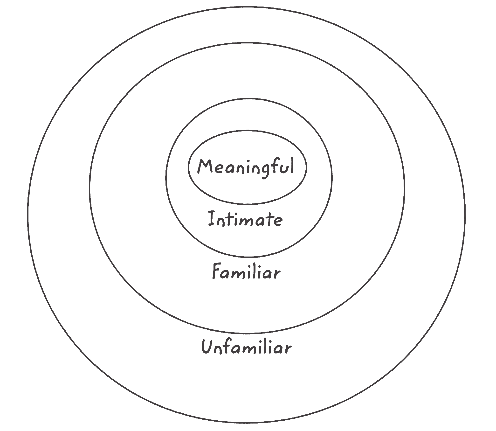
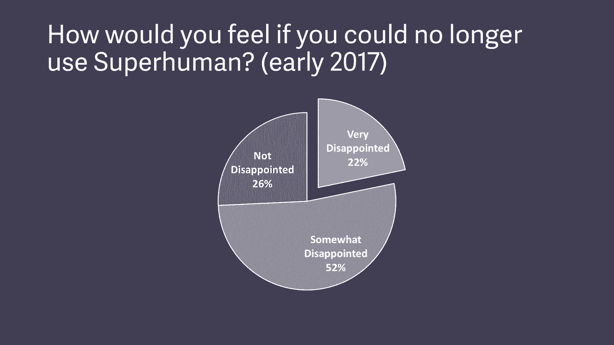
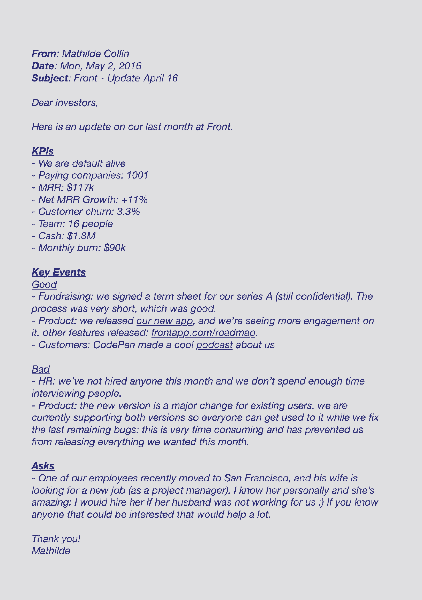
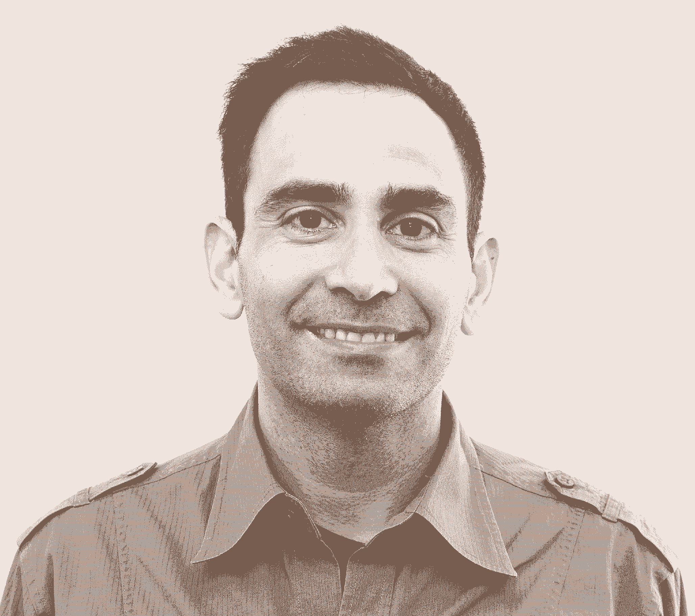
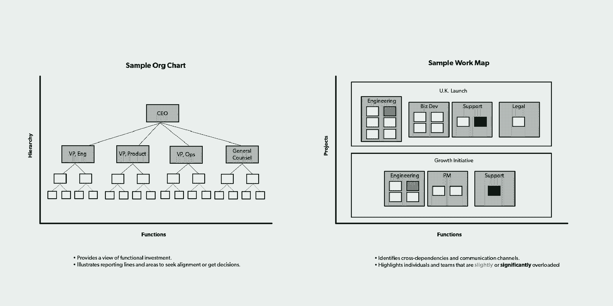
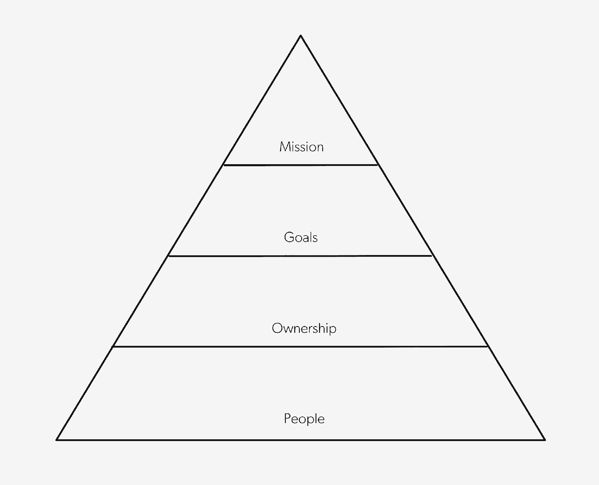
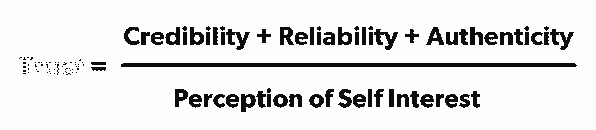
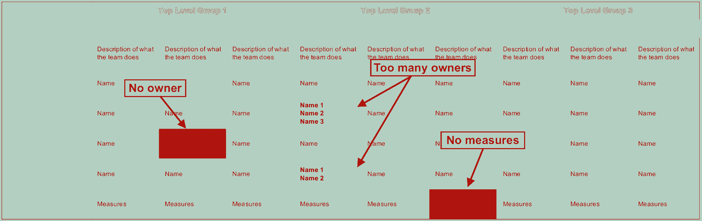
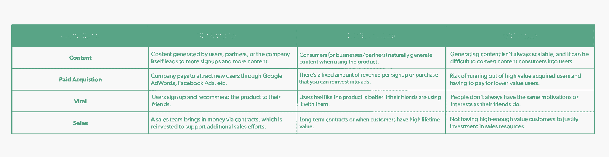

# 2018 年给创业者的 30 条最佳建议

> 原文：<https://review.firstround.com/the-30-best-pieces-of-advice-for-entrepreneurs-in-2018>

每年的这个时候都是回顾会的一个熟悉的传统，一个花时间编制清单的传统。这不是一个普通的列表，(至少在我们看来是这样，但希望我们的读者同意)。相反，它试图通过组装一个类似时间胶囊的工具包来告别过去的一年，这个工具包充满了经验丰富的公司建设者在过去一年中必须提供的最佳战术智慧。为此，我们仔细分析了我们在 1 月和 12 月之间发表的每一篇文章，寻找那些与科技领域的传统思维逆流而上、脱颖而出的建议。

在考虑如何构建今年的洞察星座时，我们不断回到这样一个事实，即这是我们年度清单的第六部分。(为了快速翻看复习档案，修改卷[一](https://firstround.com/review/30-Best-Pieces/ "null")、[二](https://firstround.com/review/The-30-Best-Pieces-of-Advice-for-Entrepreneurs-in-2014/ "null")、[三](https://firstround.com/review/the-30-best-pieces-of-advice-for-entrepreneurs-in-2015/ "null")、[四](https://firstround.com/review/the-30-best-pieces-of-advice-for-entrepreneurs-in-2016/ "null")和[五](https://firstround.com/review/the-30-best-pieces-of-advice-for-entrepreneurs-in-2017/ "null")。)当我们坐在撰写第 400 篇文章的边缘时，我们不禁停下来反思我们从哪里开始的[和我们打算实现的](https://firstround.com/review/Not-another-VC-blog-First-Round-Review/ "null")[。](https://firstround.com/review/manifesto/ "null")

虽然自 2013 年我们第一次拿起笔以来，技术世界发生了很大变化，但我们仍然很高兴能够成为一种工具，帮助令人难以置信的企业家从他们的经历中挖掘洞察力，并将其传递给目前的经营者和未来的创始人，他们肯定会站在他们的智慧的肩膀上。从经典到新增，这些故事涵盖了从[实践激进的坦诚](https://firstround.com/review/radical-candor-the-surprising-secret-to-being-a-good-boss/ "null")和[赠送乐高](https://firstround.com/review/give-away-your-legos-and-other-commandments-for-scaling-startups/ "null")到[寻找产品/市场契合度的引擎](https://firstround.com/review/how-superhuman-built-an-engine-to-find-product-market-fit/ "null")和[编写员工/经理关系手册](https://firstround.com/review/the-indispensable-document-for-the-modern-manager/ "null")等主题。

但是现在回到手头的任务。和往常一样，我们希望你能在下面我们去年文章中总结的 30 条最佳建议中找到相关性和共鸣。我们已经在期待 2019 年的榜单会有什么。

如果你喜欢克里斯·弗拉里奇的[如何变得疯狂人脉](https://firstround.com/review/how-to-become-insanely-well-connected/ "null")，这是一部值得一看的续集。它来自迈克·斯泰伯，他依靠自己的关系网建立了快速发展的职业生涯。他的方法在于将我们生活中的陌生人转变为有价值的珍贵联系，通过四个嵌套的同心网络向上移动:

目标是欢迎更多的人加入你有意义的网络。例如，在熟悉和亲密之间跳跃，打破对话怯懦的习惯。这是指我们倾向于保持讨论的安全性，并将其限制在表面上，因为害怕看起来无知。为了进入实质性的对话，使用 Steib 的一套通用问题来鼓励他人更多地谈论他们的工作:

告诉我商业模式——谁付钱给谁，谁给谁提供价值？

与竞争对手相比，你有什么优势能让客户选择你？

是什么吸引你在这个特殊的行业工作？

你的部门在整体业务中占多大份额？

有新技术影响您的业务吗？

听起来你很成功？是什么让一个人在这个角色上不成功？

你工作中最喜欢的部分是什么，为什么？

在她担任产品经理的早期，**[尼基塔·戴尔·米勒](https://www.linkedin.com/in/nikitadyer/ "null")** 采用了一种惯例来开始每一个新的角色:她通过一系列内部访谈来记录产品原则，通过拼凑产品的历史来预测产品的未来。她通常会花两周时间采访各个层级的人，包括创始人、首席执行官和产品开发三人组(工程、产品和设计)的成员，以及销售和支持等其他团队。对话围绕这些关键问题展开:

产品中你最不喜欢的部分是什么——你认为我们为什么会这样，又是如何做到的？

产品的哪一部分是你最引以为豪的？

你认为顾客对产品的哪个特点/方面最感兴趣？你认为这是为什么？

随后，米勒翻阅她的笔记，寻找重复出现的主题和异常值，汇编了一个最初的 10-12 个拟议产品原则的列表，整个产品团队最终将其缩减为 5 个。

产品原理和产品功能一样，都会要求取舍。你不想要一个不是通过艰难的选择打造出来的产品或产品团队。

作为健康技术初创公司 **[的首次创始人兼首席执行官，PatientPing](https://www.patientping.com/ "null")** 、 **[杰伊·德赛](https://www.linkedin.com/in/jdesai01/ "null")** 见过太多团队因为对如何最好地相互合作的微妙误解而停滞不前。所以他写了一本用户指南——类似于电饭锅或摇篮里的那种——但这本书解构了他如何最佳操作，何时可能出现故障，以及其他人如何利用他取得最大成功。目标是帮助设定关于如何合作的非常明确的期望，而没有额外的第二次猜测，这是建立关系时不可避免的。为了深入了解他的用户指南的十几个类别中的默认设置、指令和警告，Desai 在评论中完整地分享了它。为了更深入地了解他的方法，[通读](https://firstround.com/review/the-indispensable-document-for-the-modern-manager/ "null")每一节的旁注:他对为什么这些主题很重要的思考，以及如果你编写自己的用户指南应该记住的注意事项。

硅谷为数不多的普遍真理之一是，每个早期创业公司都着眼于实现产品/市场的契合。但当谈到如何实现这一目标时，大多数创始人都在黑暗中苦苦挣扎。

进入 **[拉胡尔·沃赫拉](https://www.linkedin.com/in/rahulvohra/ "null")** ， **[超人](https://superhuman.com/?utm_source=first-round-review&utm_medium=blog&utm_campaign=product-market-fit "null")**CEO 兼联合创始人。在花了两年多的时间努力让他的创业公司起步后，沃拉被困在十字路口，寻找指南针。遇到的只是事后的、不可操作的描述，他开始建立自己的方法来寻找产品/市场的契合度——并慷慨地同意与我们分享他在评论中的经验。这篇文章获得了成千上万的浏览量，并在社交网站上被创始人和投资者热烈分享，很明显，沃拉的方法引起了共鸣(甚至可能[发现产品/市场适合自己](https://twitter.com/dbeyer123/status/1062765925970014208 "null"))。以下是他的框架内的一个浓缩的一瞥——确保[完整阅读他的文章](https://firstround.com/review/how-superhuman-built-an-engine-to-find-product-market-fit/ "null")以沉浸在每一个阶段为这个引擎提供燃料的细致思考中。

为了评估 Superhuman 的产品/市场适合度，Vohra 调查了用户，询问了以下问题:

1.如果不能再用超人，你会有什么感受？a)非常失望 B)有点失望 C)不失望

2.你认为什么类型的人会从超人中受益最多？

3.你从超人那里得到的主要好处是什么？

4.我们怎样才能为你改善超人？

目标？**确保至少 40%的用户会因为生活中没有产品而失望。但是在第一次调查中，Superhuman 的结果远低于这个阈值。**

为了提高产品/市场契合度“得分”，Vohra 使用了其他三个调查问题:细分数据以找到支持者，建立 Superhuman 高期望客户的档案，确定主要产品优势，突出需要改进的高影响力领域，并建立产品路线图，该路线图分为两部分，一部分是用户已经喜欢的产品，另一部分是解决阻碍他人发展的问题。通过让产品/市场契合度得分成为最明显的指标，并继续调查新用户和调整产品，Superhuman 能够在短短三个季度内将“非常失望”的用户比例增加近一倍，达到 58%。

创始人不只是想要建议——他们想要有用的东西，因为他们没有时间让它不起作用。但是在技术领域，有无穷无尽的会议和鸡尾酒会，充斥着闲聊和表面的推荐。为了举办一个能产生行动并留下印象的活动， **[安妮塔·侯赛因](https://www.linkedin.com/in/anitahossain/ "null")** (第一轮知识的前负责人)建议把**的弱点**作为中心。

当我们都在说事情很棒的时候，我们并没有抓住困难的核心，或者找到我们需要的帮助。它只是制造了更多的距离。最好的赛事缩小了这个差距。

侯赛因提出了一个让人们尽早敞开心扉的练习:让每个人在索引卡上匿名写下一件让他们担心工作或导致他们焦虑的事情——他们觉得不能与许多人分享的事情。彻底洗牌，在桌子的每个座位上放一张牌。最理想的情况是，每个人都收到别人的卡片，看到其他人都有和他们一样的恐惧和脆弱。侯赛因以前见过强有力的回应，如“我觉得我是其他人的啦啦队长，但没有人是我的。”“每次我投得不好，我都觉得我让整个团队失望了。”

Anita Hossain

在不到六年的时间里，从帕洛阿尔托一间房子里的三个人发展到两个办公室里的 600 多名员工。据联合创始人兼首席执行官 **[乔希·里维斯](https://www.linkedin.com/in/joshuareeves/ "null")** 称，招聘传统有助于扩大规模。以该公司提供电话的方式为例。当只有五个人的时候，整个团队面试了所有人。“我们都在一个房间里工作，所以当我们打电话时，我们没有任何会议室可躲，”Reeves 解释说。“所以我们都参加了电话邀约，欢呼庆祝，因为我们真的很兴奋能找到与我们价值观相关的人——我们今天仍然这样做。”

要自己尝试这种策略，从招聘小组中找三到四个人加入招聘电话。当候选人打电话进来时，解释说其他人也在房间里，因为你们都很乐意提供工作机会。(那是欢呼和鼓掌的信号。)让房间里的每一个人走来走去，分享候选人在面试中给他们留下的印象。这些细节在表明你发现了强一致性方面有很大的不同。然后与候选人更私下地讨论实际的录用细节。

你应该为你雇佣的每一个人感到振奋和兴奋——以至于你会这么做。

报告正日益成为科技领域多元化和包容性努力的核心组成部分。但是根据**[Atlassian](https://www.atlassian.com/ "null")****[Aubrey Blanche](https://www.linkedin.com/in/adblanche/ "null")**的说法，你需要通过观察团队的多样性来改变你处理 D & I 数据的方式，而不仅仅是整个公司。“重要的是每个团队都是多样化的，代表人数不足的团队不会被困在刻板的小圈子里。她说:“在团队层面，你将真正感受到体验不同视角的影响，这些视角是你在日常工作中做出更好决策、获得更好结果所必需的。

使用团队级别的洞察力也可以更容易地以更有意义的方式影响变革。例如，在企业层面，Atlassian 在 2017 年看到 14.6%的技术员工是女性。但是当布兰奇查看团队数据时，她了解到三分之二开发软件的小团队只有一名女性。这种广泛的分布可能会导致孤独感，因此布兰奇开始努力为女性创造跨团队联系的方式，如非正式的咖啡约会计划和更结构化的同事导师环。

大多数公司范围内的综合统计数据实际上并不衡量多样性——它们衡量的是代表性。如果你的公司有 30%是女性，如果她们都在人力资源部门，而男性都在工程部门，这没关系。

**[Front](https://frontapp.com/ "null")****[Mathilde Collin](https://www.linkedin.com/in/mathilde-collin-bb59492a/ "null")**亲身体会到，虽然很容易陷入经营一家初创公司的日常混乱中，但将自律的心态应用到你所做的每一件事情中，是一种看似简单而有效的提升创始人水平的方法。科林著名的自律行为的一个例子来自她自 Front 早期以来以几乎令人恐惧的频率发送的一封精心制作的电子邮件:她每月向投资者更新的信息。下面您将从 Collin 的“已发送”文件夹中找到一个真实的例子:

自从科林开始天使投资以来，她对向投资者展示专注的力量的信心只增不减。她说:“在一位创始人给我发了两三封更新邮件后，我马上就能感觉到这家公司是否会成功。

常规的交流是不可思议的强大。如果你不能给你的投资者发送集中一致的更新，你可能会成为那些失败的创业公司之一。

作为一名经营者和天使投资人， **[埃拉德·吉尔](https://www.linkedin.com/in/eladgil/ "null")** 观察、领导或建议了许多公司，因为他们在一个不明显的想法之后迅速扩大了规模。根据自己的经验，吉尔提出了一些原型，这些原型是那些渴望被创始人抓住的人应该追寻的。有一个经典的案例，市场起初看起来很拥挤，但仔细一看，实际上是空的，因为缺乏一个伟大的产品或许多玩家几乎没有差异化。然后是看似小众的，吉尔把它分成四种口味:太小，太无聊，太高端，太个人不熟悉。最后是新技术，隐藏在增长率或外推技术曲线中的创新口袋，而不是当前的数字。

但是吉尔最大的建议是拿起铲子挖吧。“当你认为自己可能偶然发现了什么时，抛开怀疑，想象一个看似疯狂的想法可以起飞的世界。因为如果你不这样做，其他人肯定会这样做，而且他们会在没有你的情况下建造它，”他说。

Elad Gil

**[重启](https://www.reboot.io/ "null")** 创始人兼职业教练 **[Khalid Halim](https://twitter.com/khalidhalim "null")** 曾带领比特币基地、Lyft 和 [Checkr](https://checkr.com/ "null") 的领导层走过了他们成长曲线中最陡峭的部分。通过这些经历，他推断出一条创业物理学定律:**人类线性增长，公司指数增长**。这意味着，如果公司按预期发展，它将超越许多领导者。这一现实提出了两种选择:解雇或聘用高管。这两者在许多方面都是痛苦的，这就是为什么 Halim 敦促创始人在第一天就向高层领导人做出承诺，围绕他们最后一天可能会是什么样子。通过设定期望值、建立信任和提供职业定义，展示出你从一开始就有一个计划。下面是 Halim 的一个松散的脚本来指导你:

“如果你看看最新的就业数据，很可能你会离开，或者我们会在未来三年内分道扬镳。因此，在我们所拥有的时间里，我向你们承诺，我们将致力于你们的成长。我对该公司及其投资者的承诺是让它继续增长。只有两者保持联系，我才能信守承诺。如果我们开始呈指数级增长，我们将会达到一个你可能无法胜任的点。我们可能需要给你安排一个不同的角色。如果你能处理好的话，也可以雇佣比你高的人。或者分道扬镳。无论如何，到时候我会和你坦诚地讨论下一步该怎么做。”

Khalid Halim

许多创始人感到快速提高销售额以达到增长目标的压力，但经验丰富的销售领导者卡伦·罗勒(Karen Rhorer)亲身体会到这种不可持续的战略可能会导致未来痛苦的裁员。“不惜一切代价追求增长的心态是失控燃烧和颠倒的单位经济学的处方，”她警告说。从基本到高级的 CAC 和 CLV 到回收期比率，在扩大销售人员招聘之前需要了解大量的计算，以避免未来出现烧钱的颠倒指标的痛苦。为了让所有这些数字运算变得更容易，罗勒创造了一个简单的度量计算器**[。(我们建议花时间了解她](https://docs.google.com/spreadsheets/d/1UFpU6xQ9dP66JJDZZ7kFL4KqyizKEX22a4ToFGeVCho/edit?ts=5b7ddb2e#gid=0 "null")[方法](https://firstround.com/review/growth-at-all-costs-is-perilous-this-is-how-to-scale-sales-sustainably/ "null")中的所有智慧和细节，然后转向她的模板。)插入您自己的数字来计算 CAC 和 CLV，以及确认比率和回收期都在正轨上。**

工程领导者 **[瓦隆·斯里尼瓦桑](https://www.linkedin.com/in/varunsrinivasan/ "null")** 占据了前排席位 **[比特币基地](https://www.coinbase.com/ "null")** 被缩放以满足过去几年对加密货币需求的爆炸式增长。一路走来，他带头改变组织设计，帮助工程团队为超增长做好准备。有一点很清楚:如果你仅仅通过查看组织结构图来设计你的组织，你将会犯错误。为了支持这一论断，斯里尼瓦桑指出了制图界一个意想不到的相似之处。虽然地图更方便，但这些 2D 表示法提供了全球 3D 现实的不完整视角，正如组织结构图的功能和层次错过了团队实际上如何合作的细微差别。为了创造一个不同的视角来看待 3D 组织，Srinivasan 依靠**工作地图**来捕捉每一个重大的战略目标以及需要共同努力才能实现的团队或个人。这使他能够发现超负荷工作的人，识别交叉依赖，或者标记出没有紧密合作的团队。

“我一直感到惊讶和不幸的一件事是，随着公司变得越来越大，越来越有钱，它们实际上成了更糟糕的工作场所。这太可怕了。”这就是****[Warby Parker](https://www.warbyparker.com/ "null")**的联合创始人戴夫·吉尔博** 在第一轮最近的纽约创始人峰会上开始演讲的方式，这也是为什么他和他的联合创始人一直坚持他们的**信念，即创造非凡的员工生命周期与开发杀手级产品一样重要**。

为了建立防御机制，并为员工尝试新事物和发展技能创造系统的方法，Warby Parker 每年都会召开一次内部会议。在“WarbyCon”上，人们可以通过 TED 风格的演讲来教授一群同事他们想谈论的任何事情。有关于流行音乐的历史和如何制作完美的杜松子酒和滋补品的慷慨激昂的演讲，也有与人们日常工作相关的片段。Warby Parker 还提供一个“特殊项目”项目**、**，类似于实习，但针对的是员工。各部门可以提出一个有影响力的项目，他们需要几个月的支持(或完全监督)，并发布一份内部申请，其他员工可以申请。

在研究团队如何继续将创意带到桌面上时，沃顿商学院教授兼畅销书作家 **[亚当·格兰特](http://www.adamgrant.net/ "null")** 在**的《每日秀》编剧室找到了令人惊讶的灵感来源**对创业公司最有借鉴意义的课程？建立心理安全。主持人特雷弗·诺亚创造的环境给格兰特留下了深刻的印象，在这个环境中，作家们不怕抛出一个可能会出岔子的笑话。虽然心理安全需要时间和脆弱性，格兰特注意到诺亚也做了一些更渐进和微妙的事情:快速插话，给予应有的信任。在快速发展的创意团队中，很容易忘记谁说了什么，而所有的表扬和责备都归于领导者，所以一定要通过快速的口头表扬来传递荣誉。为了进一步加强心理安全，格兰特建议从更广阔的视角来看待创造力是如何被削弱的，把责任想象成一个 2x2 的图表，描绘出结果与过程的彻底性。奖励幸运的成功和惩罚有良好过程的失败结果的倾向，是格兰特不喜欢硅谷关于冒险或快速失败的咒语的原因之一。“你不想庆祝失败，你想让失败正常化，”他说。

Reddit**[的泰勒·奥迪恩](https://www.linkedin.com/in/tylerodean/ "null")** 说，如果创始人真的想获得资金、赢得人才和建立势头，他们需要少关注公司愿景的提炼，多关注说服背后的神经科学。他的意思是:在一个全是改变游戏规则的创新和戏剧性揭示的技术世界的背景下，你应该尽可能多地从你的信息中获取惊喜以让他人放松，这可能是出乎意料的。奥迪恩说:“如果你真的想让某人接受你所说的或提供的东西——而且你没有像苹果那样的巨大可信度——在分享新东西的演示中，你能做的最好的事情之一就是说，‘在这个演讲过程中，我打算在实际向他们展示任何东西之前，向你展示 X’。

作为一个额外的诱惑，以下是他在发送任何信息之前要问的问题清单:

我的投球会在哪里绊倒一个孩子？

我想让观众记住的一件事是什么？它也是我的论点、信息或推销中最突出的东西吗？

我可以从我的推销中删去哪些词？

我喜欢的结果是默认的吗？

我能做些什么来提高人们对我的想法的熟悉度呢？

Tyler Odean

毫无疑问，ClassPass 已经找到了立足之地，并开始了比赛。但它经历了多年的转变、品牌重塑和良好的老式信念。创始人 **[Payal Kadakia](https://www.linkedin.com/in/payalkadakia/ "null")** 一路走来学到的最大的一课是，对你想要解决的问题应用激光聚焦的重要性。忽略她所谓的成功的虚假信号——筹集的资金、媒体、社交媒体追随者——支持更有意义的信号:客户行为。“如果你把注意力放在所有其他事情上，你就不会推动你的公司。你只是在借助其他来源提供的顺风滑行。卡达基亚说:“你依赖于你没有创造的能量。“这可能会持续一段时间，但不会永远。这样很难扩大规模。相反，回到你创办公司的原因——当你启动引擎时，这些行动会产生蒸汽。”

作为第一轮的常驻销售专家， **[泰勒·加夫尼](https://www.linkedin.com/in/tylergaffney/ "null")** 在过去两年与 30 多家种子或首轮融资阶段的初创公司合作后，对早期 B2B 定价和上市战略的形成有了独特的看法。虽然他坚信定价是艺术而不是科学，但每个人都必须从某个地方开始，立足点是关键。这就是为什么他建议进行实验——并避免他看到初创公司一再犯下的这些非受迫性错误:

**错误 1:价格是在没有顾客的情况下凭空想象出来的。**所有的答案都在你的客户头脑中，这就是为什么加夫尼建议每天召开 3-5 次客户会议。

错误 2: 价格是一成不变的，不是动态的。当谈到设定产品的介绍价格时，许多创始人陷入了这样一个陷阱:选择应该是定价起点的东西，但坚持认为这是一个永久的解决方案。

**错误三:价格太低。“我很少遇到早期创始人把他们的产品定价过高的情况，”加夫尼说。“当这种本能与认为很难提价的普遍看法结合在一起时，就特别成问题了。如果你已经从低价起步，却犹豫着是否要逐步提高价格，那你的增长就到了极限。”**

**错误 4:定价结构被过度设计**。许多客户习惯于以某种方式购买，如按月付费或按交易付费。Gaffney 警告不要尝试任何太远的东西，例如按 API 调用收费或按位置收费而不是按员工收费，因为这对理解和适应来说可能是一个很高的障碍。

与客户谈论定价可能会有压力。但我向你保证，不与他们交谈并试图解释他们的沉默是更痛苦的。

Stacy La 作为第四名员工加入了 Clover Health，当时公司还没有筹集到任何资金，她是唯一的设计师。看似有趣的一跃很快变得令人望而生畏。但从解决糟糕的招聘到建立新行业的知识，洛杉矶带来了大量来之不易的技巧。她最重要的一条建议是，在你成为早期员工的第一年，严格按照这些时间管理里程碑进行优先排序:

**第 1-6 个月:**围绕一个主题(比如选择一家设计公司)规划两周的冲刺，避免身兼数职带来的环境转换。这将帮助你平衡广度和深度，以达到最大的灵活性和重点。

**第 6-9 个月:**使用 La 从她的导师，Airbnb 的设计主管 Alex Schleifer 那里学到的“亲眼所见，亲自动手，视野”框架，标准化你的分类。“关注”是你不需要做，但需要被告知的工作。“动手”是你需要独立工作的行动，而“地平线”是一个月到六个月的主题和发展类别。

**第 9-12 个月**:将你的关注点从构建你的产品部分转移到你的组织角落。记录下你所有的机构知识，并与团队的其他成员分享，从而开始向组织设计的转变。

一家创业公司的要求令人目不暇接。为了锚定自己，你必须安排时间把事情写下来。

Stacy La

“几十年前，我考虑过离开医学，去读商学院。几乎是同时，我意识到我能为商业世界做的最好的事情就是继续从事精神病学，”宾夕法尼亚大学临床教授乔迪·福斯特博士说。这种认识使她发展了八种不同性格类型的分类法，这是其他人在工作中很难发现的。让我们聚焦第一个:豆子计数器。

这种类型控制质量，专注、持久、投入，但很容易陷入阻碍进展的瓶颈。抓住每一个细节是一个关键的行为标记，这是一种微观管理的倾向，陷入杂草中，慢慢做决定。福斯特说:“如果你是一个算账的老板，把错误正常化，引导到有期限和方向的注重细节的活动中去。”“如果你在为一个会计工作，不要挑战控制的天性。不要承诺超出你能力范围的东西。当你犯了错误，承认它。不要合理化或防御。试试类似“你的奉献精神给我留下了深刻的印象”这样的句子。我对我的工作也有同感，所以你可以信赖我。"

**[Eventbrite](https://www.eventbrite.com/ "null")** 旗下 **[Terra Carmichael](https://www.linkedin.com/in/terracarmichael/ "null")** 拥有数十年的 comms 经验。她给进入宣传领域的领导者的最大建议是，记住面试的目的不是回答问题，而是传递你的信息。

为了不偏离主题，**通过确认并简要回答被问到的问题，转移回你实际想要传达的信息，从而阻断并桥接**。通过列出前三条信息进行练习，并进行练习，在练习中，您可以回答任何问题，并将其带回到您的信息中，使用以下起始语句来帮助:

“这是一个有趣的观察...但问题的核心是……”

“你对我们当今行业的一个关键问题提出了一个很好的观点…我们如何看待 XYZ…”

虽然记者可能会试图让你走上一条黑暗的道路，成为一个好的标题，但千万不要重复负面的内容。相反，从你的角度重新开始，使用以下陈述来引导对话:

“另一种思考方式是…”

“我认为你真正想问的是……”

“这说明了一个更大的问题，那就是……”

导师可以是一个令人难以置信的职业加速器，但它需要勤奋和准备。这就是为什么我们很高兴在 2018 年底启动我们的第一轮[快速通道](https://fasttrack.firstround.com/ "null")导师计划，这是两年实验、五个团队和数百名参与者的高潮——所有这些都由第一轮人才&社区资源副总裁**[Whitnie Low Narcisse](https://www.linkedin.com/in/whitnie/ "null")**监督。

下面是她让导师工作的 10 条戒律中的一个例子:学员需要投入时间了解他们导师的职业道路、目标和生活方式，以确保这种关系不会开始让人觉得是单方面的交易。带着准备好的问题出现，提前发送讨论要点，把会议当成和老板的一对一会谈。为了避免每次会议都沸沸扬扬，挑选 2-3 个能在一小时内解决的问题。至于导师，纳西斯指出，虽然学员可能会问 X，但他们真正想要的是 Y——一种思考工作的新方式。这就是为什么查看议程和会议记录以发现模式和批量主题是至关重要的。

Whitnie Narcisse

在 Pinterest 和 LinkedIn，产品负责人杰克·周(Jack Chou)亲身体会到，随着公司规模的扩大，保持员工的积极性是多么重要。现在 **[的产品负责人肯定](https://www.affirm.com/business/ "null")** ，他靠在一个他作为工具开发的金字塔上。对于 Chou 来说，人与人之间的化学反应是拥有感的前兆，而拥有感是有效测量和度量的先决条件。为了保持激励员工长寿，团队必须逐步实现坚定的使命和目标。

为了保持金字塔的四个层次都很强大，要留意落后的产出和行动缓慢的团队。一定要注意谈话中出现的警告短语，或者更糟糕的是，一个完全停止提问的人。诊断动机衰退的最简单的方法是创造更多的机会让人们与你交谈，对你的团队常规进行简单的改变，以打开坦诚的大门。“我想是安迪·格罗夫说一对一的时间应该是 45 分钟而不是 30 分钟，因为所有有趣的事情都发生在 25 或 30 分钟内，”周说。“找出一个人不想告诉你什么的方法通常是坐在房间里足够长的时间，只是说话。”

随着创业领域的快速变化，人们开始扮演新的角色，接受新的挑战，带来了大量新人。然而，如果你是那些新人中的一员，就没有时间去怀疑了。安妮·莱蒙迪曾在科技界的知名公司担任产品、营销和运营主管，有一种工具可以帮助她胜任每一个新角色:信任方程式。

为了提高你作为一名新员工的可信度，莱蒙迪建议向你周围的人问一些开放式的问题，以了解对他们来说什么是重要的，他们希望如何与你合作，他们对你有什么期望，以及他们希望实现什么。这会让人们对你能力的怀疑变成对你将要做的新事物的兴奋。为了提高可靠性，要找到切入点，并以一种有用的方式产生影响。莱蒙迪建议问别人“你最想做但又最不想做的一件事是什么？”然后把它从他们的盘子里拿出来，迅速完成。

**[Food52](https://food52.com/ "null")** 联合创始人 **[Amanda Hesser](https://twitter.com/amandahesser?lang=en "null")** 和 **[Merrill Stubbs](https://twitter.com/merrillstubbs?lang=en "null")** 的假设是，如果你以高质量的内容打头阵——为你的读者提供价值——那么销量就会随之而来。他们没有错。作为一个小小的证明，想想精心制作的德国鸡蛋 coddler 电子邮件活动，它带来了 20，000 美元的月销售额。在收到一些客户不了解该产品的反馈后，该团队制作了一套内容，包括一个视频和一个关于 coddler 如何工作的 gif，以及如何使用它的食谱和想法。虽然许多品牌不愿在顾客和销售之间放置一次以上的点击，但该团队决定利用每一条内容来创造丰富的教育体验。“我们没有从电子邮件链接到可以买到鸡蛋布丁的产品页面，而是链接到了社论。“人们必须首先打开我们的电子邮件，阅读我们的电子邮件，点击进入 egg coddler 文章，然后点击进入 egg coddler 产品页面，才能购买它，”Hesser 说。"这个过程没有吓退感兴趣的读者，而是让他们更深入地参与进来."

Amanda Hesser and Merrill Stubbs

在过去的七年里， **[杠杆](https://www.lever.co/ "null")** 的 **[马可·罗杰斯](https://www.linkedin.com/in/marcorogers/ "null")** 面试了至少 400 名工程师，一路发展出自己独特的招聘方法。例如，他注意到一对一的面试创造了一个反复冲洗的循环，让应聘者感觉紧张，让面试官感觉僵硬。以下是他推荐三人面试的原因:

这有助于减少偏见。"假设你派了两个面试官:一个是男的，一个是女的。罗杰斯说:“你会惊讶地发现，即使是女性提出问题，求职者也只会和男性交谈。”。

它把参与和观察的行为分开。罗杰斯说:“当你是一名面试官，同时做着吸引人、观察和把握时机的工作时，在场并把工作做好是一项挑战。”。

它同时训练你更环保的面试官，提升缺乏经验的员工的视角。没有什么可以替代面试经验，所以让更多人参与进来是很好的实践。罗杰斯指出，虽然只让你的高层来面试候选人很有诱惑力，但缺乏经验的人会得到不同的信号——也就是说，如果他们认为自己可以向候选人学习，并被候选人领导。

大多数创始人努力将透明度注入他们创业公司的 DNA 中。但当薪酬透明度这个更具体的话题出现时，一些人开始不自在地改变立场。在**[bethanye McKinney Blount](https://www.linkedin.com/in/bethanye/ "null")**的经历中，这是因为从黑盒到缓冲区，在竞争透明光谱中有一系列要考虑的点——以及一种健康的担忧，即任何将更多卡片放在桌面上的努力都将被搞糟。布朗特建议，从小处着手，从一开始就捕捉水平和范围，即使它们在创始人看来只是对你最终薪酬战略的洞察。“这也是与未来的自己交流并保持诚实的一种方式。她说:“这就像是记录你当时想法的日记条目或面包屑痕迹。“例如，如果你雇佣了一个自认为资历很高的人，但你快进了六个月，他仍然没有表现出来，那么你写下这一点的事实意味着‘未来的你’必须诚实面对这一点。”

James Everingham 在 insta gram****[领导工程时发现了一个问题:随着团队规模的扩大，透明决策和沟通不可避免地会下降。为了揭开决策过程的帷幕，他的工程团队采用了 RACI 框架作为决策过程。为了让这种模式在实际层面上发挥作用，Everingham 求助于另一个缩写:RAM，或一种有助于确保只有一个人打电话的责任分配矩阵。](https://www.linkedin.com/in/jevering/ "null")****

**你可以拥有比决策者更多的决策，但如果决策者比决策更多，那你就遇到问题了。**

**“这个练习让我想起了艾森豪威尔的经典名言，**‘计划是无用的，但计划是必不可少的’，’”Everingham 说。“就其本身而言，RAM 是相当无用的，但构建它并明确所有者的过程对于调整你的公司至关重要。”查看与 Instagram 工程团队使用的 RAM 相似的样本:****

****

**从激烈的竞争和冒名顶替综合症到缺乏反馈，每个团队的表面下都潜伏着许多动态——关键是在裂缝变成鸿沟之前抓住它们。作为一名高管教练， **[劳拉·盖茨](https://www.linkedin.com/in/lauragates/ "null")** 曾为 NASA、壳牌石油、军方等组织修复人际关系动力学。所以她直接知道不解决冲突的代价太高了。这就是为什么盖茨建议在团队静修或异地会议上，开诚布公地讨论。事先，发送一份关于人际关系问题的匿名调查，询问团队成员之间的关系如何。**

**让主持人大声朗读所有回答(匿名和概括)，或从某个特定的回答开始，为该问题提供一个可能的解释，以引发小组讨论。接下来，作为一个团队，列出关键冲突，写下来让所有人都看到，这样他们就可以单独处理。针对每个问题，使用以下问题找出冲突的根源:**

**你第一次注意到这个问题是什么时候？发生了什么让你感到消极？**

**你从那个例子中得出什么结论？你还看到了哪些支持这一结论的证据？**

**盖茨强调，主持人有责任确保对话不会过早中断。“和沈默坐在一起。她说:“如果人们过早地开始安抚某人，让他们感觉更好，或者试图改变话题以避免不适，他们最终只会解决表面问题，而不是根本问题。”**

**任何时候都突出的压力都会引发战斗或逃跑。就好像我们都被困在生存模式中，只因为一些无关痛痒的事情，比如电子邮件往来。**

**最著名的公司因迅速的指数级用户增长而受到称赞——这是大多数初创公司无法复制的现实。但好消息是这不是唯一的途径。根据规模和增长顾问 **[Casey Winters](https://www.linkedin.com/in/caseywinters/ "null")** 的说法，这甚至不是最好的一个。在 Pinterest 和 Grubhub 时，他成功地依赖于**内容循环**，这涉及发布和共享媒体，然后由其他人以触发额外注册、激活和用户参与的方式共享。**

**对于寻求可持续发展的初创公司，温特斯建议采用不同的方法并探索其他模式。(查看下面的图表，了解他对所有增长循环的看法，以及为什么它们行得通和行不通)。通过评估每种增长策略在长期内帮助留住用户和盈利的能力，为你的初创公司找到正确的循环。对温特斯来说，可持续增长是三个问题的交集:**

**我们能培养或留住那些不断从我们的产品中发现价值的用户吗？**

**我们能以一种支持业务的方式将这些用户货币化吗？**

**对前面问题的回答是否有助于可持续收购战略？**

****

**顾客在与产品互动的第一次体验中会做出全面的判断。斯科特·贝尔斯基 称之为“第一英里”——他认为这是产品中最关键但却被忽视的部分。“这几乎是事后的想法。**当我们花这么多时间专注于让锁着的门背后的东西变得如此精彩时，我们有时会忘记给用户钥匙**，”他说。**

**特别是前 30 秒是一次冲刺，它决定了人们是否会坚持跑完全程。客户需要很快感受到成功，所以他们知道三件事很重要:他们为什么在那里，他们能完成什么，下一步做什么。他们不需要一开始就知道如何使用你的整个产品——任务是创造一个钩子把他们拉进来，让他们摆脱懒惰、虚荣和自私的倾向。“别以为你不需要钩子。贝尔斯基说:“没有人是这样的。当你的产品超越早期用户时，请记住，第一英里将需要更加简单，以考虑到完全不同的“最新用户”群体，而不仅仅是你最初希望吸引的超级用户。**

**客户使用产品体验的第一英里不能成为您构建产品体验的最后一英里。**

***摄影由* *[邦妮雷伊米尔斯](http://www.bonnieraemillsphoto.com/ "null")* *和* *[迈克尔乔治。](https://www.michaelgeorgephoto.com/ "null")* *顶级插画由* *[亚历杭德罗·加西亚·依班娜](https://craniodsgn.es/ "null")* *担任，主角(左起)拉胡尔·沃赫拉、玛蒂尔德·科林、马尔科·罗杰斯和斯泰西·拉。***