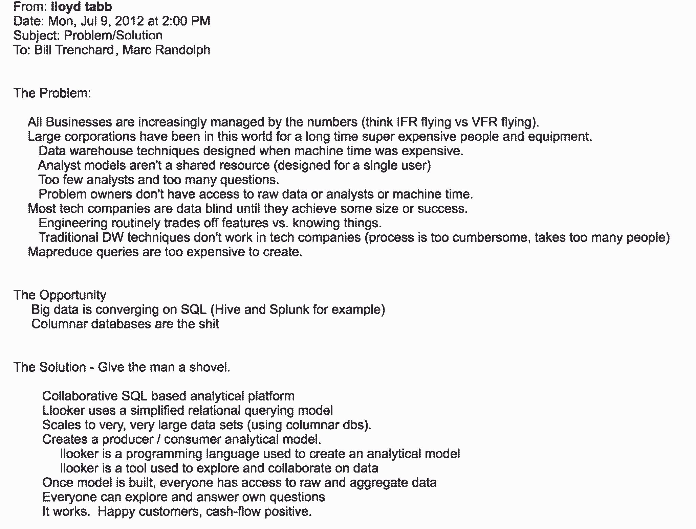
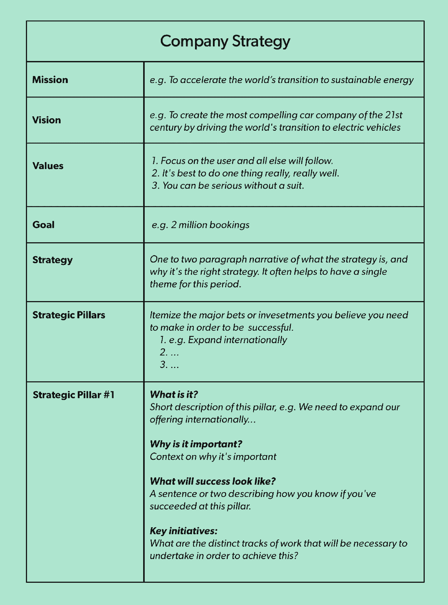
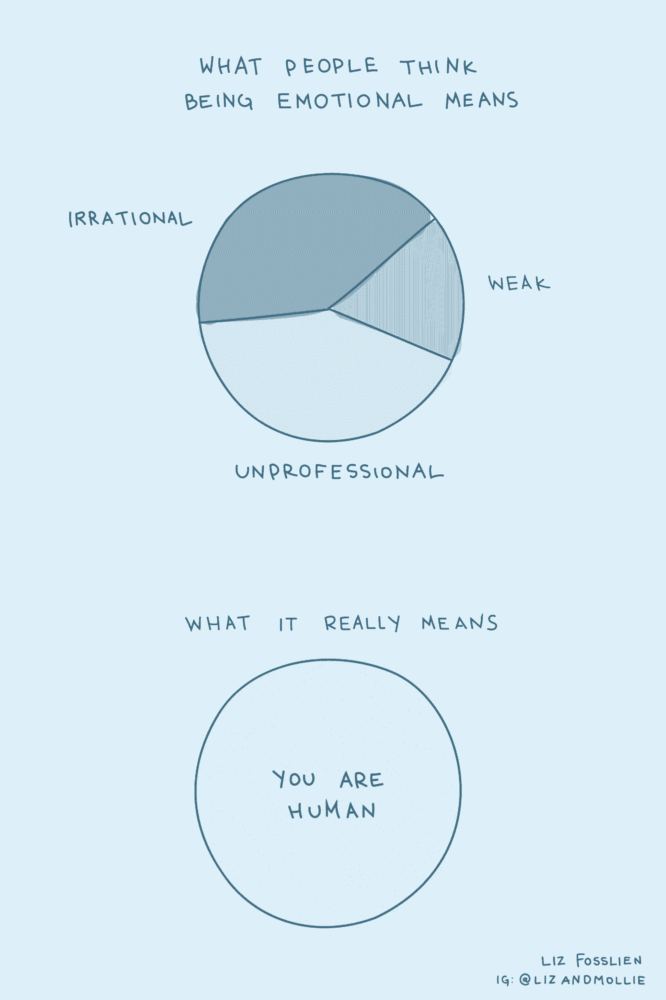
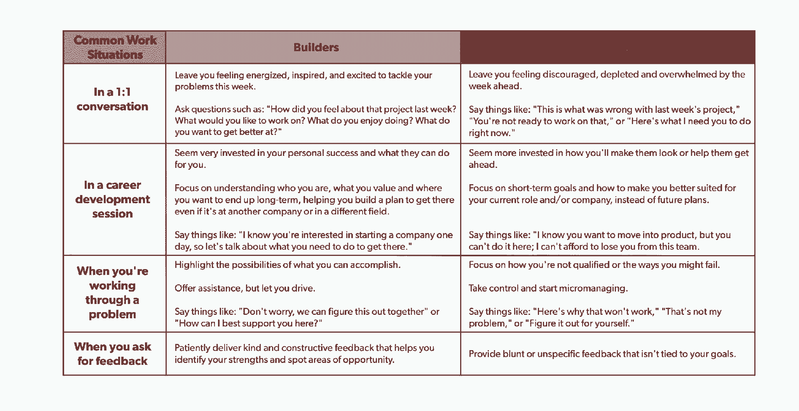
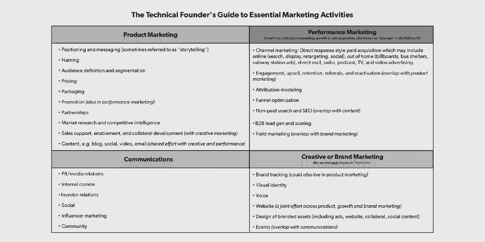
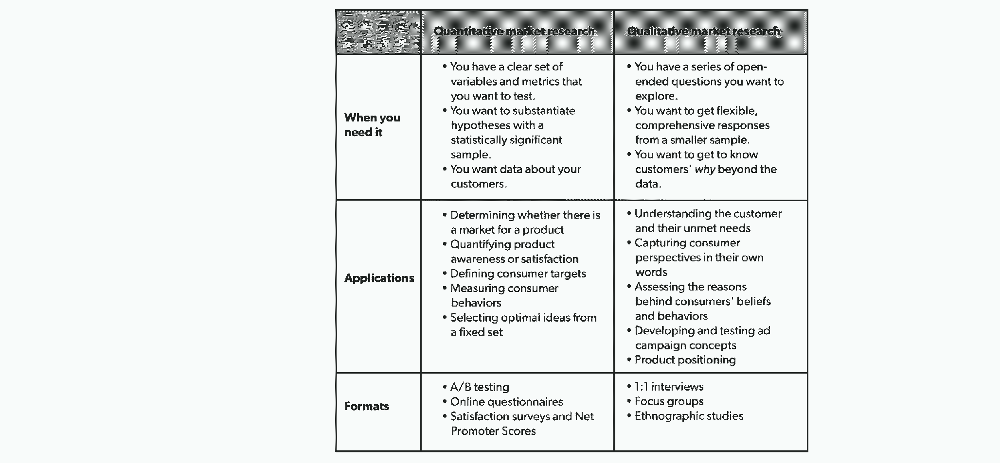

# 2019 年给创业者的 30 条最佳建议

> 原文：<https://review.firstround.com/the-30-best-pieces-of-advice-for-entrepreneurs-in-2019>

新的一年总是呈现出双重的机会:反思过去，然后从这些洞见中汲取灵感来塑造我们的未来。每年一月,《评论》都会利用这种双重性，让回顾过去和展望未来成为一种传统。**在我们年度回顾展的第七期*****中，我们将重温 2019 年塑造公司建设的有思想的个人和大胆的想法。**(如果你很想知道这个系列是如何随着时间的推移而演变的，请查看从 [2018](https://firstround.com/review/the-30-best-pieces-of-advice-for-entrepreneurs-in-2018/ "null") 、 [2017](https://firstround.com/review/the-30-best-pieces-of-advice-for-entrepreneurs-in-2017/ "null") 、 [2016](https://firstround.com/review/the-30-best-pieces-of-advice-for-entrepreneurs-in-2016/ "null") 、 [2015](https://firstround.com/review/the-30-best-pieces-of-advice-for-entrepreneurs-in-2015/ "null") 、 [2014](https://firstround.com/review/The-30-Best-Pieces-of-Advice-for-Entrepreneurs-in-2014/ "null") 和 [2013](https://firstround.com/review/30-Best-Pieces/ "null") 的先前版本。)*

*在过去的 365 天里，我们与技术领域最敏锐的头脑进行了交谈，他们慷慨地分享了各自领域的战术知识，从[如何确定一流工程团队的规模](https://firstround.com/review/how-to-size-and-assess-teams-from-an-eng-lead-at-stripe-uber-and-digg/ "null")到[大多数初创公司都缺少的新兴设计角色](https://firstround.com/review/defining-growth-design-the-guide-to-the-role-most-startups-are-missing/ "null")。虽然我们可以单独欣赏他们智慧的笔触，但只有当我们退后一步，把他们放在一起考虑时，整幅画才成为焦点。除了揭示他们来之不易的成就背后的“如何”之外，我们见过的领导人也更多地揭示了企业家精神不那么光彩的一面。*

*无论是应对初创企业生活中的情绪怪物的[建议](https://firstround.com/review/make-friends-with-the-monster-chewing-on-your-leg-and-other-tips-for-surviving-startups/ "null")还是应对创始人彻底失败的[观点](https://firstround.com/review/founder-exposed-opening-up-about-startup-failures-and-vulnerability/ "null")，经营者们在过去一年的回顾中分享的建议都强调了一个简单的主题:**对创业的真实描述不是成功的故事，而是正在进行的工作。**这是关于当事情*没有*向上和向右时会发生什么。这是关于学习如何照顾自己，不仅仅是作为一个创始人或领导者，而是作为一个人(这也是我们最近的《创业状态》报告的主题[)。](https://stateofstartups2019.firstround.com/ "null")*

*因此，在今年的版本中，我们不仅仅庆祝底线或终点线，而是更加曲折的创业之路。我们希望这篇评论在你自己的旅程中发挥了很小的作用。在接下来的一年里，我们将继续为您带来重要的故事，这些故事将帮助您度过起起落落以及其间的一切。事不宜迟，这里是我们在 2019 年听到的一些突出的建议——希望你可以应用它们，让你的下一个十年更加光明。*

*让我们从《开始》和《获得成功》这两本书之间的一个主要例子开始。今年早些时候，我们分享了一个关于 **[Looker](https://looker.com/#exit-popup "null")** 如何建成的冗长(甚至对我们来说)的深入故事。这里有一个小小的尝试:*

*2012 年， **[劳埃德·塔布](https://www.linkedin.com/in/lloydtabb/ "null")** 给第一轮合伙人 **[比尔·特伦查德](https://firstround.com/person/bill-trenchard/#mystory "null")** 发了一封 216 字的电子邮件，推销他的新数据分析初创公司。快进到 2019 年，谷歌云宣布打算以 26 亿美元收购该公司。在那段时间里，Looker 从单一客户到 1700 多家，从一个小团队到 700 人的公司。*

*

The pitch email Lloyd Tabb sent to Bill Trenchard and Marc Randolph during Looker’s seed raise in 2012.* 

*根据他的经验，Tabb 提供了两条重要的建议:*

***不要过早筹集种子资金**。“我们等了将近一年来筹集资金，直到我们知道这是一项风险业务——并不是每个初创公司都是这样，你不想被套牢，”塔布说。这还有一个额外的好处，就是让筹款变得更容易。“从你擅长推销自己，到简单地说‘问问利用我们的人的意见’"*

***决定不决定。**Looker 团队不确定如何最好地将产品推向市场。他们探索了高度定制化的咨询模式和自我 SaaS 方法。“传统观点认为你需要尽早锁定一个商业模式，但我们决定不做决定，”塔布说。“作为创始人，我们经常觉得我们必须知道所有事情的答案。当你不知道一些事情的时候，抑制住向前犁的冲动，等着看什么是有效的。”*

*很容易被锁定在某条路上，一条你无法爬出来的路，无论是过早地筹款，过早地承诺一个模型，还是匆忙做出决定。你没有很多重来的机会，所以要小心行事。*

**“如果我们都更公开地谈论工作中情感的大起大落，甚至只是对朋友，会发生什么？”问 **[莫莉·格拉汉姆](https://www.linkedin.com/in/mograham/ "null")**([放弃你的乐高](https://firstround.com/review/give-away-your-legos-and-other-commandments-for-scaling-startups/ "null")名声)。正如她所言，初创公司的玩家在为生存而战，人们对他们的公司不屑一顾，这带来了焦虑、恐惧和兴奋的循环，这是完全正常的。但是没有*知道*这也是每个人内心的感受，孤独感也会被添加到列表中。**

**这是一个策略，这是 Chan Zuckerberg 的倡议，Quip 和脸书校友个人使用的天气起伏:**给它两个星期。“如果你睡在上面，仍然感到焦虑，这并不意味着你应该把所有的乐高玩具拿回来。格雷厄姆说:“创业之神并没有暗示你应该发送那封愤怒的电子邮件。相反，观察你周围任何需要改变的情绪，承认它，然后继续前进。每天都这样做，如果两周后情绪还是一样，那么你应该考虑做点什么。但更常见的情况是，5 月份让你感到心力交瘁的事情到了 6 月份就会烟消云散，你会感谢自己没有采取行动。”****

**这些年来，我们发现面试是一项几乎每个招聘经理和领导者都可以提高的技能，因为招聘好员工至关重要。这就是为什么当我们点击这篇文章的发布按钮时，我们希望它是你想要保存并在多年后返回的一篇文章。我们被他们的反应震惊了。在成为黑客新闻的热门话题并被成千上万的人广泛阅读后，我们很高兴地看到**让人们分享他们的首要面试问题——最重要的是，** ***为什么*** **他们问这个问题**——似乎引起了共鸣。**

**我们将在下面重点介绍几个我们最喜欢的，但是一定要看看完整的名单。**

**在你共事过的人中，你欣赏谁，为什么？Slack 的朱尔斯·沃尔特发现，直接询问求职者的价值观并没有那么有效，而询问她欣赏谁则能让她清楚地看到自己努力培养的品质。**

**你真正擅长什么，但再也不想做了？当 [VSCO](https://vsco.co/ "null") 的[布莱恩·梅森](https://www.linkedin.com/in/bryanrmason/ "null")问这个问题时，他惊讶于人们经常回答说他们从来不想做他正在寻找的事情。**

**告诉我你犯错误或失败的一次经历。你从这次经历中学到了什么？你能给我举另外两个例子吗？科利·休斯(Glossier 的创始人，陈·扎克伯格倡议和产品搜索)发现，只问一次失败是不够的，因为每个人的口袋里都有现成的答案。那些能指出三个不同例子的人是真正的不断学习者。**

**在 Eventbrite 工作了 10 年，在 Airbnb 工作了 7 年之后，Lenny Rachitsky 和 **[Nels Gilbreth](https://www.linkedin.com/in/nels-gilbreth-36a9821/ "null")** 已经见证了年度计划的方方面面，无论是三个月后仍在制定计划的团队，还是匆忙完成计划，却在六个月后放弃的团队。幸运的是，这两人汇集了他们的知识，开发了“ **W 框架**”，这是一个使用即插即用模板(如[这个](https://docs.google.com/document/d/1JI73WrGplrhNE46aLyRD_B74gEynI77EPgXn1ic6WeQ/edit# "null"))和常见陷阱标注的年度和季度规划的分步过程。**

****

**这里有一个让你开始的提示:**你的计划需要重点——可能比你感觉舒服的**更多的重点。把你的资源放在少量的赌注上(我们说的是三到五次)。Rachitsky 和 Gilbreth 开始相信，你担心投入太多资源的赌注最终会成功。他们建议，如果好主意不容易腐烂(可以以后再做)，不具有战略意义(不要直接支持这个计划的战略)，或者不具有差异化(让你在竞争中脱颖而出)，就砍掉它们。**

**找到你最有影响力的赌注，然后全押。大胆的想法需要大胆的资源。**

**Jeff Wald 将 Fred Wilson 作为投资者，筹集了超过 6000 万美元，并将他的初创公司卖给了 ADP。但他也目睹了他的公司破产(让他破产和沮丧)，被董事会强迫找一个教练，并处理了一桩棘手的联合创始人离婚案。公开这样的失败可能看起来很时髦，但沃尔德希望增加对话的深度。**

**首先，在*故障*和*漏洞*之间是有区别的。谈论你的初创公司是如何破产的，并不等同于深入探究你作为领导者个人的感受或失败。此外，大多数失败的故事都被安全地限制在过去时，并伴随着后续的成功。**

**提起你过去是如何失败的是一回事，尤其是当你已经获得成功的时候。谈论我仍在纠结的问题，表现出任何弱点——现在时态——会让我感到更加畏缩。**

**沃尔德已经准备好先发制人:“我与冒名顶替综合症做斗争，担心不抓住机会和做大所必需的风险，”他说。“我对自己能完成的事情没有信心，这有时会阻止我真正去尝试。从避免结婚到没有联合创始人就不开公司，我仍然对向未知领域飞跃抱有不确定性。所以这就是我现在正在做的，现在时态。”**

**当 **[Gloria Lin](https://twitter.com/immunoglobulin "null")** 离开 Stripe 创办公司的时候，她并没有想法，也没有联合创始人。在她最终与乔尔·波洛尼(Joel Poloney)合作创办网站(Siteline)之前，林在一年的时间里“约会”了六位不同的潜在联合创始人，这是我们见过的探索创业想法和寻找合作伙伴的最周到的过程之一。**

**

Gloria Lin and her co-founder, Joel Poloney** 

**在她详细的[五步框架](https://firstround.com/review/the-founder-dating-playbook-heres-the-process-i-used-to-find-my-co-founder/ "null")之外，我们特别喜欢联合创始人问卷——林和其他创始人用来更深入地调查联合创始人兼容性的跨越六个类别的 50 个问题。“我确信，许多联合创始人之所以失败，部分原因是他们没有从深层次理解对方的动机和恐惧，”她说。下面是这些问题的一个小例子——下载下面的 PDF 文件来查看完整的列表。**

****是什么让你坚韧不拔？这是林的最爱之一。她寻找例子、故事和它们背后的思想。****

****多元化&包容性有多重要？具体来说，你会如何付诸行动？林发现，更多切实可行的建议表明联合创始人更重视这件事，而那些表示关心但保持泛泛而谈的人则表明他们还没有投入太多心思。****

****在我们达到产品/市场契合度之前，您希望自己的角色是什么？在我们达成产品/市场契合度后，您希望自己的角色是什么？林说:“你可能开始时销售领先，但很快就不得不把你的乐高玩具送给别人——我一直在寻找对此感到非常舒服的人。”。****

**Nikhyl Singhal 是一个完美的产品共鸣板:他共同创立了三家初创公司，帮助推出了谷歌视频聊天和照片，并在四年内将 Credit Karma 的产品团队从 10 人扩大到 75 人。当他为创始人和产品负责人提供建议时，他总是发现自己在给出同样的建议:**针对公司面临的挑战，调整产品团队规模的能力是一个秘密武器**。**

**在一堂关于建立产品团队的大师课上，Singhal 分享了许多关于避免陷阱、雇佣谁以及创始人与产品负责人在每个阶段的角色的建议，从他所谓的早年“醉酒走路”到高速增长的阵痛。(他还提供了[产品/市场契合度的绝佳定义](https://firstround.com/review/how-to-craft-your-product-team-at-every-stage-from-pre-product-market-fit-to-hypergrowth/#text_9f5a5b130b974499b9d1d1a234b534f5 "null")，非常值得你花时间去了解。)但也许最有帮助的是这张简明扼要的图表:**

****

**除了是[畅销书作家](https://www.harpercollins.com/author/cr-102449/esther-perel/ "null")、 [TED](https://www.ted.com/talks/esther_perel_the_secret_to_desire_in_a_long_term_relationship?language=en "null") 演讲人和[播客主持人](https://howswork.estherperel.com/episodes/prologue "null")之外，埃丝特·佩雷尔、还拥有数十年为《财富》500 强公司担任夫妻治疗师和组织顾问的经验。因此，当她同意在今年的评估中分享她的智慧时，我们仔细聆听了她的每一句话。除了探究冲突的根本原因(以及[她关于从一开始就建立健康的联合创始人关系的额外 PDF 指南](https://firstround.com/review/how-to-fix-the-co-founder-fights-youre-sick-of-having-lessons-from-couples-therapist-esther-perel/ "null"))，佩雷尔还做了一个简单的观察，这个观察很突出:*当我们不同意或试图给出负面反馈时，我们经常会诉诸最糟糕的冲动，这将小争吵变成全面战争*。**

**为了缓解这种趋势，Perel 分享了三个实用技巧:**

**1.**注意什么在起作用**。每天记录下你的合伙人一周内做的积极的事情。提升他们做对的事情，而不是关注他们做错的事情。他们为你欣赏的公司做了什么？没有他们，你将无法完成什么？**

**2.**停止分类说话**。我们有一种倾向，用“你总是”或“你从不”这样的陈述来混淆我们的经历和感受与事实。相反，你可以说，“你可能不知道，但是感觉你一直在做这件事。”**

**3.**启动 10 秒拍摄时钟**。研究强调，当人们处于冲突中时，他们在反驳之前不会听某人超过 10 秒钟的论点。尽量简短，让他们向你反映。**

**在领导团队超过十年后，脸书产品设计副总裁 **[朱莉·卓](https://twitter.com/joulee "null")** 发布了一个经理的形成，这是她希望在自己的旅程开始时拥有的手册。书中的一个观察给我们留下了最深刻的印象:**向你管理的人和你自己提出试探性的问题，是提升领导水平的最佳方式**。这里有两个值得偷的问题，来自卓自己的工具包:**

****我的下属还会乐意为我工作吗？**当一名经理担任一个新的角色，而他以前团队的成员也和他一起飞跃时，这传达了很多信息。在追踪团队健康状况的匿名调查中，一些公司会明确地问这样一个问题:“你会再次为你的经理工作吗？”如果你的组织不这样做，简单地思考这个问题可能是有用的。**

****我所有的 1:1 是不是都觉得有点尴尬？讨论错误、对抗紧张或谈论秘密的希望并不容易，但是没有牢固的关系可以仅仅建立在表面的玩笑上。令人不快的真相需要说出来才能被解决。****

**您能自信地说每位报告员都希望再次加入您的团队吗？如果你不确定答案是肯定的，那么很可能是否定的——就像你必须问“我恋爱了吗？”你可能不是。**

**Lenny Rachitsky 说，经理们不应该把绩效评估看作是一件苦差事，而应该把它看作是一个运用定制方法产生巨大影响的机会。(你可能从提示 4 中认出了他的名字——如果你还没有注册他的简讯,我们强烈推荐[注册。)Rachitsky 在 **Airbnb** 开发了自己的绩效管理框架后，已经亲眼看到了这种方法的好处。以下是他的一些优秀建议:](https://www.lennyrachitsky.com/ "null")**

****花足够的时间准备**。每六个月应该花三到五个小时来准备谈话。如果你一年中找不到十几个小时专注于你的报告事业，那通常意味着你有太多的报告——或者你不应该成为一名经理。**

**描绘出“杀死它”的样子。从未来 6 到 12 个月的完美状态开始回溯。雄心勃勃的人不仅想知道如何变得更好，还想知道如何摆脱困境。**

**确保你有一个后续计划。让你的报告列出五到七项他们希望在接下来的六个月里采取的具体行动，并将它们添加到一个简单的电子表格中。然后安排每月一次的检查，从日常工作中抽身出来。**

***[使用这个模板](https://docs.google.com/document/d/1SXO4eH8ZvpuONpdlxpu6y1ufDS0n6vbciV4IJzpm-sc/edit?usp=sharing "null")* *从 Rachitsky 的框架里，* *[获取更详细的分步建议](https://firstround.com/review/the-power-of-performance-reviews-use-this-system-to-become-a-better-manager/ "null")* *充分利用它。***

**

Lenny Rachitsky, a former product lead at Airbnb.** 

**普尼特·索尼 曾在谷歌(Google)和 Flipkart 等大型公司担任产品负责人，之后开始创业，共同创立了。在从大到小的飞跃之后，他发现创业公司招聘最难的部分不是说服人们加入——而是找到与创始人有共同心态的候选人。“每当我找到一个人，他扫清了谦逊、坚韧、激情和财务准备这些障碍，总比增加 10 个没有这种感觉的员工要好，”他说。为了弄清这一点，Soni **花了面试的大部分时间试图说服候选人** ***而不是*** **加入**。而是候选人是否会对自己的创业感到满意，而不是相反。“你需要确保他们为自己做出正确的决定。他说:“这就好像你是他们的朋友，而不是试图雇佣他们的公司的首席执行官。”**

**当胡姆**[的丽兹·佛斯莱恩](http://fosslien.com/ "null")** 大学毕业后找到第一份工作时，她感受到了成为工作烈士的压力:一个人在深夜和周末工作，同时默默忍受焦虑及其潜在的副作用。从那以后，她写了(并配了插图)一本关于管理工作情绪的书，这本书用一些有用的策略来抵制不健康的规范，比如这个:**记住“足够”不可能是“当你感觉良好的时候”，因为感觉良好是一个移动的目标。****

**Fosslien 在组织一次活动时感到不知所措，她向教练求助后捡起了这块金块。教练问她“你什么时候才能知道你已经做得够多了？”“当活动进展顺利时”的答案对 Fosslien 来说似乎是显而易见的，但她的教练笑着提醒她，大多数活动实际上不是她所能控制的，一旦潜在的问题，如演讲者生病，下雨，或宴会承办人没有出现。“她提醒我,**足够必须是一个在你控制范围内的衡量标准,**”FOSS lien 说。**

****

**经过 7 个队列、981 个配对和近 2，000 名参与者，我们的[快速通道导师计划](https://fasttrack.firstround.com/ "null")已经成为我们在第一轮所做的最有影响力的事情之一。以下是我们多年来注意到的一些事情:**虽然每个导师都有丰富的经验和智慧，但并不总是清楚如何最有效地与他们的学员分享。**为了帮助解决这个问题，我们邀请了我们社区中一些最有经验的导师来分享他们成为更好导师的最佳建议。我们在下面挑出了几个最喜欢的，但是[看看完整的列表](https://firstround.com/review/how-to-be-a-career-changing-mentor-25-tips-from-the-best-mentors-we-know/ "null")。**

**询问克隆人的情况。 *想象你克隆了自己。你会让你的克隆人做什么，你不会让克隆人做什么？*[Clover Health](https://www.cloverhealth.com/en/ "null")[的 Matt Wallaert](https://twitter.com/mattwallaert "null") 问这个问题是为了更好地理解他的学员想要的结果，他认为这是导师工作的主要部分。“作为导师，我的工作不是告诉别人什么是对的，或者试图影响他们的需求。他说:“我的职责是帮助界定这些需求的边界，让它们清晰可见，然后在这个方向上开辟一条道路。”。**

****关闭脚本**。“问一个开放式的问题，比如‘上周你在想什么？’总有一层一般的东西，但保持安静，等待真正的挑战出现。通常，它们最终会与预先计划好的议程项目大相径庭，而且更加重要，”丘斯·首席运营官说。**

****[《》张](https://www.linkedin.com/in/jiaona/ "null")**[在 Dropbox、Airbnb 和 WeWork 做产品，在斯坦福大学教书，](https://techcrunch.com/2019/12/19/snackpass/ "null")[对](https://angeltrack.firstround.com/meet-the-angels/jiaona-zhang "null") [Snackpass](https://techcrunch.com/2019/12/19/snackpass/ "null") 这样的初创公司进行天使投资。那次经历告诉她，是时候抛开打造 MVP，转而专注于创造**最不讨喜的产品**。原因如下:“如果你端上烤焦的披萨，你不会得到人们是否喜欢披萨的反馈。你只知道他们不喜欢烤焦的披萨，”张说。“类似地，当你只依赖 MVP，最快最便宜的功能原型时，你可能实际上没有测试你的产品，而是一个很差或有缺陷的版本。”**

**虽然你可以查看[她关于如何避免烤焦披萨的完整框架](https://firstround.com/review/dont-serve-burnt-pizza-and-other-lessons-in-building-minimum-lovable-products/ "null")，但这里有一个她将用户喜爱放在(咳咳)产品构建核心的实用技巧:**到** **从用户的原因(而不是业务原因)开始，使用语句，** ***如果这个产品可以...？*****

**下面是张在创建 Airbnb Plus 时的一个例子:**

****别问:**如果这款产品能帮助 Airbnb 与豪华酒店竞争，岂不是很神奇？**

**相反，你可以问:如果用户有各种高质量的选择，让他们宝贵的假期变得更加特别，这不是很神奇吗？**

**

Jiaona Zhang ("JZ"), Director of Product Management at WeWork.** 

**作为温室的首席技术官，迈克·布福特建立了一个工程团队，在最初的五年里从一个人发展到 60 人——令人遗憾的是零损耗。但是在多年庆祝这位英国领导人的完美比赛之后，他重新考虑了他的方法。"**离职有健康和不健康的原因。这就是我们应该关注的地方，而不仅仅是决定公司是否会哀悼他们的离开。****

**以零遗憾流失率为目标是有问题的，因为它混淆了人们离开的原因——以及他们留下的原因。优化健康的行为，而不是不惜任何代价保持。**

**以下是布福特支持健康流动的两个策略:**

****成为资源**。以一对一的方式告诉所有人你在他们的搜索中可以扮演的角色。Boufford 说他在纽约的技术界人脉很广，希望帮助他们找到一份很酷的下一份工作，而不仅仅是下一份工作。他还主动提出帮助思考商业模式和职业调整方面的具体机会。**

**公开你自己的抱负。“我经常告诉人们，虽然我看不到自己会很快离开温室，但我也不打算退休后在这里领取我的金表。他说:“我希望有一天能成为一名创始人，创办自己的公司。**

**我们最近的 2019 年初创公司状况报告中最能引发对话的发现是关于社区的——我们调查的近 80%的创始人表示，建立一个社区对他们的业务很重要，其中 28%的人将其描述为他们的护城河。所以今年我们格外感谢 **[贝利理查森](https://twitter.com/baileyelaine "null")** 的智慧。她是 Instagram 的早期雇员，目前是 [People & Company](https://www.people-and.com/ "null") 的合伙人，也是《聚在一起 *[、](https://www.amazon.com/Get-Together-build-community-people/dp/1732265194/ref=sr_1_3?keywords=get+together&qid=1578557619&sr=8-3 "null")* 的合著者，这是从零开始建立团队不可或缺的指南。**

**如果她必须指出创业社区战略中的一个常见失误，那就是没有专注于奉献和重复。她说:“有趣的是，科技公司痴迷于用户留存，但当涉及到社区时，他们往往会忘记这个指标。不是跟踪谁来这么简单。谁一直出现，为什么？**

**许多准社区缺少的成分是奉献。我们举办一次性活动或年度筹款活动，但我们不会给潜在的社区成员继续出现或举手承担责任的机会。**

**

A glimpse from the pages of Get Together, from Stripe Press** 

**时隔七年， **[萨沙·奥尔洛夫](https://www.linkedin.com/in/sashaorloff/ "null")** 近日决定卸任 **[LendUp](https://www.lendup.com/ "null")** 联合创始人兼 CEO。在随后的间隙，他与创始人、首席执行官和投资者进行了 100 次咖啡聊天，为他的下一部剧本收集建议。(即使你不是创始人，我们认为你也能从他收集的建议中找到有价值的经验，这些建议涉及考虑职业转型、安排休假和规划下一步行动。)**

**这里有一个引人注目的战术要点:奥尔洛夫得到建议，列出三个清单:他想培养的技能、他想从事的行业和他的不可谈判性。后来，他能够用一句话表达他想要的东西:*我对探索 Y 行业中的角色 X 感兴趣，我的必备条件是 Z* 。这份清晰的职业论文使他能够更有效地最大化他的人际网络。他说:“人们想帮忙，但如果你自己不知道要去哪里，他们也帮不了多少。**

**增长就是优化可持续的体验，从而吸引更多长期参与的用户，并在此过程中尽快学习。但是对于 **Dropbox** 的 **[Angel Steger](https://www.linkedin.com/in/angelsteger/ "null")** 来说，这是关于速度——而不是匆忙——这就是为什么她建议增加增长设计，这是一个正在形成的新兴设计子集。她表示:“工程师或项目经理往往会试图加快执行进度，以便能提前两周发货。”。“但是跳过成长设计师带来的细节工作会伤害你的学习。混乱的测试、定义不清的问题、缺乏数据——这些都是在发展过程的一开始就没有考虑到设计的结果。”**

**并不总是关于发射速度。更清晰的体验让用户更容易快速行动，从而更快地让增长实验达到统计显著性。你可能认为通过修剪设计细节来“节省时间”,但这可能会增加几周的时间。**

**

Angel Steger, Dropbox’s Director of Growth Design** 

**在第一家快餐休闲餐厅在华盛顿开业 12 年后， **Sweetgreen** 现在拥有 100 多个地点和一个拥有超过 150 万用户的应用程序，所有这些都紧随解锁独角兽地位之后。支撑这些证据的是一种指导哲学，联合创始人纳撒尼尔·鲁称之为大规模亲密关系。他说:“我们希望每家餐厅都感觉像是你的‘甜姐儿’，而不仅仅是‘甜姐儿’。举一个说明性的例子:虽然 Ru 和他的联合创始人最初有在头三年内扩张到洛杉矶、纽约和迈阿密的宏伟计划，但他们最终意识到，通过对扩张说不，他们可以专注于建立品牌并变得更强，而不仅仅是更大。他们在华盛顿呆了六年，策划从建立供应链到考察房地产的各种策略，这让他们能够让飞轮转动起来——并在进入新市场之前从错误中吸取教训。**

**虽然在各个方面尽可能快地成长很诱人，但决定你是谁的却是那些你说不的决定。**

**谷歌和推特的元老级人物凯伦·维克瑞已经在强大的网络基础上打造了长达数十年的技术生涯。但她也自称内向，这就是为什么她写了一本优秀的书，里面满是轻量级的社交策略。根据 Wickre 的说法，关键是每天练习一点——并且在不需要具体帮助的时候练习。**

**如果你把你的人脉当成一种你经常用来取款的个人自动取款机，你很快就会失望(并透支)。**

**从每天花 10 分钟的时间来运用这些策略开始:**

**把它作为早晨的热身。当 Wickre 浏览她的电子邮件和标题时，她会分享一两个她没有联系过的人感兴趣的故事，并附上简短的说明:“这让我想起了你。你有什么看法？你好吗？”**

****保留一份运行中的待办事项清单**。简单地跟进你遇到的事情是有力量的。在你的谈话或会议之后，想想你说过要发的那篇文章，以及你想把他们介绍给谁——然后记下来。**

****带着感激结束一天。给你喜欢的人或者你想与之交流的人发几张“想你”的便条。****

**Zainab Ghadiyali 的科技之路一点也不传统。拥有化学背景的她，在抵达硅谷之前，开始了她在国际公共卫生非营利机构的职业生涯。尽管她的简历令人印象深刻——跨越了在脸书的工程职位的上升，她目前在 Airbnb 的产品负责人的角色以及作为 Wogrammer 的联合创始人的兼职角色——她对冒名顶替综合症也不陌生。“非常规的职业道路会让你更容易患上冒名顶替综合症。你可能会更担心自己可能会失败，或者你不属于这里，因为你不符合这个模式，”Ghadiyali 说。**

**

Zainab Ghadiyali, Product Lead at Airbnb and co-founder of Wogrammer** 

**为了击退它，她依靠这些她从玛丽·卢·杰普森那里听到的至理名言:“这个世界上有两种人——建造沙堡的人和摧毁沙堡的人。我尽量让自己周围的人都是建设者，而不是清洁工。**

**下面 Ghadiyali 概述了你如何在自己的职业生涯中发现建设者和引路人:**

****

**经过十多年的公司建设， **[NerdWallet](https://www.nerdwallet.com/ "null")** 联合创始人兼首席执行官 **[陈永正](https://www.linkedin.com/in/tim-chen-1722b9/ "null")** 在 2019 年划出时间，反思他作为创始人的旅程。他最大的观察之一是关于会议。“我们的会议结构变得脆弱。我等了太久才更有意识地知道哪些会议服务于什么目的，”陈说。“以前，当我们有重要话题时，我们会召集全体人员。但是当你有超过 300 个人的时候，所有的手都是一个相当钝的工具。现在，我们开始考虑我们的目标，而不是论坛。”**

**对于其他希望更有意识地让会议变得不那么糟糕的创始人，陈提供了另一个建议:取消首席执行官最喜欢的会议。你知道的一个例子是，一大群人聚在一起发布状态更新，这可能是一封电子邮件，只对会议所有者有用。“我很长时间以来都在主持这样的会议，”他承认道。“我正在读一本描述这种现象的书，我当时就想，‘哦，我的上帝。这完全是我的会议。所以，我拔掉了插头。不要浪费任何人的时间。"**

**里克·努奇喜欢说他是以结果为导向的。但是 **[Guru](https://www.getguru.com/ "null")** 的联合创始人兼 CEO 真的是这个意思。考虑下面的例子:Guru 有两个松弛渠道，每个员工都承诺阅读，#Wins(如何赢得交易)和#CS-Wins(结束客户成功循环的发光“之后”照片)。庆祝胜利的做法并不独特，但这家初创公司对这些渠道的做法更加深入。“每份成功公告都是由达成交易的 AE 或负责推广的 CSM 撰写的，大约有五六段。他们清楚地勾勒出客户的问题、我们为解决问题所做的工作以及这些工作给他们带来的好处之间的界限，”Nucci 说。“对我们来说，很容易就能写出一篇名为“*新客户”的帖子。遇到了知识管理问题。需要一个现代的维基*这不仅会导致松弛渠道中的争吵，而且这种方法无助于我们的设计师、工程师、营销人员和项目经理深入了解我们的客户所面临的问题。"**

****

**布莱恩·罗森伯格 坚信让学习成为你的北极星。例如，当他还是 [SkillSlate](https://en.wikipedia.org/wiki/SkillSlate "null") 的联合创始人时，Rothenberg 不是在董事会上回顾上个月的指标和里程碑的总结，而是将内容转移到他们已经学到的东西和他们计划在未来测试的新假设上。(第一轮合伙人和 SkillSlate 投资人 [Phin Barnes](https://firstround.com/person/phin-barnes/#mystory "null") 是这种策略的超级粉丝[。)](https://sneakerheadvc.com/no-more-milestones-i-mean-it-87523ef2ffa "null")**

**同样，当他在 2013 年加入 Eventbrite 时，Rothenberg 注意到了一个熟悉的发布 buzzy 功能的循环，希望增长，为发布欢呼——然后转向下一个。“没有足够的持续迭代来帮助一个功能实现充分的采用或功能/产品匹配，”他说。要打破轮子，问这样的问题:我们学到了什么？我们达到预期的效果了吗？我们到底该不该保留这个特征？**

**不要只问“我们做了什么？”通过询问“我们学到了什么？”来记录你的进步被问题而不是成就所驱动，开启了未来的影响和进一步的学习。**

**作为第一轮的常驻营销专家， **[阿瑞尔·杰克森](https://www.linkedin.com/in/ariellerjackson/ "null")** 帮助早期创始人寻找他们自己的全职营销人员，这一追求可能会很快失控。“创始人通常会说，他们需要营销人员，因为他们想‘成长’，或者是因为董事会成员或投资者的推荐。她警告说:“你需要考虑清楚这次招聘要解决的实际问题。为了帮助创始人锁定他们的初创企业需要的特定口味，杰克逊将基本营销工作分为四大类:**

****

**“我知道非常非常少的人在所有这些方面都很强，”她说。“我不知道这种将所有功能都包含在一个包中的愿望来自哪里——你不会期望一个工程师对漂亮的前端 UI 和后端系统感到惊讶。”**

**同时精通产品、性能、创意和沟通的营销人才是难得一见的。如果你找到了，很好。但更有可能的是，你需要精简你的工作描述，并开始分清主次。**

***准备好开始修剪了吗？从 Alma* *的第一份市场招聘中获得灵感。***

**“围绕同理心的对话通常止于‘更有同理心吧！’ **[Corgibytes](https://corgibytes.com/ "null")** 的首席执行官 **[安德里亚·古莱特](https://www.linkedin.com/in/andreamgoulet/ "null")** 说:“我们需要向前迈出一步，认识到同理心是一种可以学习的技能。她正看着你们，工程师们。**

**原因如下:提交消息、拉请求、命名、测试、错误消息是给人的消息，也是给机器的消息。未来的读者包括同事，甚至六个月后的你自己——如果不能通过清晰地传达你的推理来对这些读者表现出同理心，就会产生[有问题的遗留代码](https://firstround.com/review/forget-technical-debt-heres-how-to-build-technical-wealth/ "null")。“没有同理心的操作与困扰工程团队的最大问题之一直接相关。所以不要告诉我这与你的日常工作无关，”她说。**

**编码是一种交流形式。沟通根植于同理心。因此，软件工程师可以从利用同理心中获益良多。这不是一个抽象的、形而上学的谜——这是一种我们需要尊重的技能，也是我们需要锻炼的肌肉。**

**作为**[Duo Security](https://duo.com/ "null")****[的第一位产品设计负责人，Sally Carson](https://www.linkedin.com/in/sally-carson/ "null")** 的任务是从零开始构建她的功能——考虑到设计往往资源不足，而 [EPD 凳子](https://firstround.com/review/defining-product-design-a-dispatch-from-airbnbs-design-chief/ "null")的其他腿增长更快，她必须发挥创造力，以赢得众所周知的席位。“用户研究不应该只是设计在某个黑暗的角落里做的事情，然后报告出来。她说:“如果你把它变成一项团队运动，那么工程师和项目经理就能实时地看到自己的洞察力——你不需要说服他们任何事情。**

**她用来传播其职能工作的一个策略涉及到一个电影转折:她的团队在所有人面前举办了一场“研究日场”，放映两分钟的精彩片段。“视频是将研究成果社会化的一种流行形式，”卡森说。"但是经常发布的是整个研究未经编辑的片段."没有人会坐视不管。相反，寻找低成本的方法来提升整个组织对设计功能独特优势的理解。**

**

Sally Carson, Duo's Head of Product Design and User Research** 

**“领导一个销售团队不仅仅是检查销售代表是否达到他们的目标。设定合理的预期——确保销售代表有一条实现这些目标的清晰途径,**[Atrium](https://www.atriumhq.com/ "null")****[Karen rho rer](https://www.linkedin.com/in/karenrhorer/ "null")**说道。**

**我们经常以雄心勃勃的配额形式提出遥远的目标，不给销售代表任何如何达到目标的指导，然后给他们一个 PIP，或者在他们没有达到目标时解雇他们。这是一个从根本上破碎的方法。**

**例如，销售代表可能觉得他们没有多少直接控制权，也不清楚如何移动销售指针。考虑这两个目标之间的差异:**

**目标 A: 你需要增加 10%的胜率。**

****目标 B:** 您需要为您的每个公开机会安排下一次会面，并与您拥有有效机会的每个客户的至少 3 名联系人保持联系。**

**第一个是更常见的销售目标，第二个更具战术性，更明确地在销售代表的直接控制之下，更有可能产生切实的结果。**

**定性研究是探索性的，涉及情感，所以它看起来很模糊，更容易被忽略。但是创业公司这样做是有风险的，杰西·凯撒说，他是一名独立研究员，曾在百事可乐和亚马逊工作过。“当我们把真实的人记在心里时，我们会制造更好的产品，解决更大的问题，而你不可能毫无顾忌地做到这一点。**说到市场调研，quant 只能告诉你这么多。没有洞察力的数据是无用的**。这并不是说 quant 没有它的时刻。两者都是进入产品和市场的有价值的镜头，但它们是做根本不同事情的工具。鉴于创始人经常不确定何时使用哪一个，凯撒提供了他的选择正确的指南:**

****

**许多优秀的招聘指南关注团队成员的质量，但是团队成员的数量也同样重要。进入 **Stripe** 的 **[Will Larson](https://twitter.com/lethain "null")** 和他的优秀著作 *[一个优雅的谜题:工程管理系统](https://www.amazon.com/Elegant-Puzzle-Systems-Engineering-Management/dp/1732265186 "null")* ，它概述了对规模团队有用的比率。例如，他认为经理的经理应该支持四到六个经理——低于这个数字，人们可能会试图干涉日常经营。或者拿这个来说:**永远不要让经理支持超过八个人**。参照安迪·格罗夫的 *[高产出管理](https://www.amazon.com/High-Output-Management-Andrew-Grove/dp/0679762884 "null")* ，拉森指出，经理们应该每周花大约半天的时间在每份报告上。但是把 8 个小时的一对一、团队同步、面试和所有的人手加起来，很快你一周的一半时间都在开会。限制你的团队规模不仅能保证生产力，还能保证每个报告的公平投资。**

***摄影由* *[邦妮雷伊米尔斯](http://www.bonnieraemillsphoto.com/ "null")* *和* *[布兰登·史密斯](http://www.manonstilts.com/photos/ "null")* *。上图由* *[亚历杭德罗·加西亚·依班娜](https://craniodsgn.es/ "null")* *创作，由(左起)卡伦·维克瑞、莱尼·拉奇斯基、朱莉·卓、埃丝特·佩雷尔和普尼特·索尼主演。***