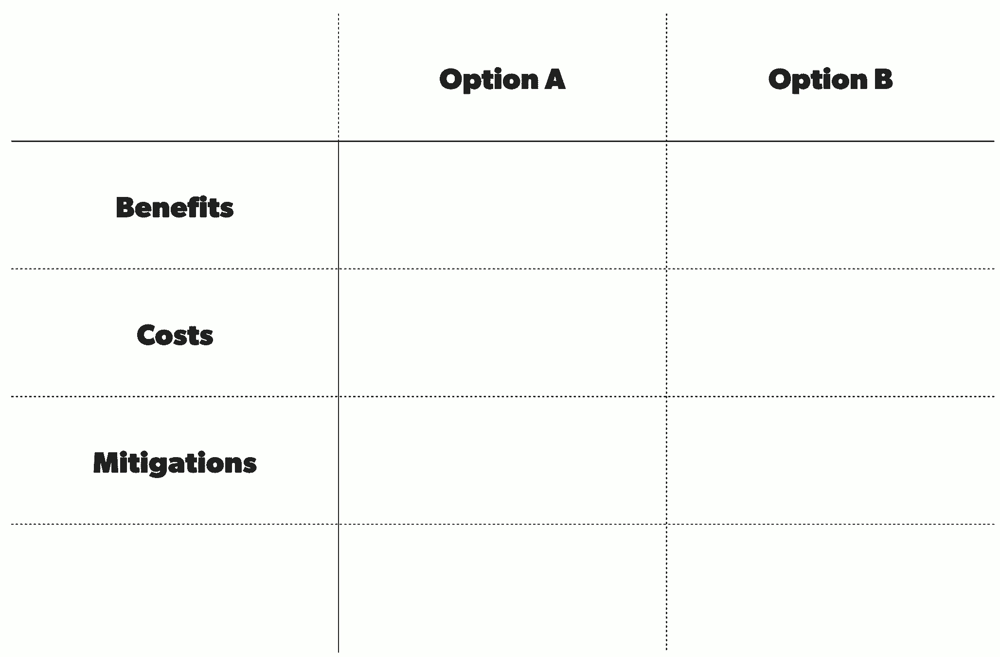
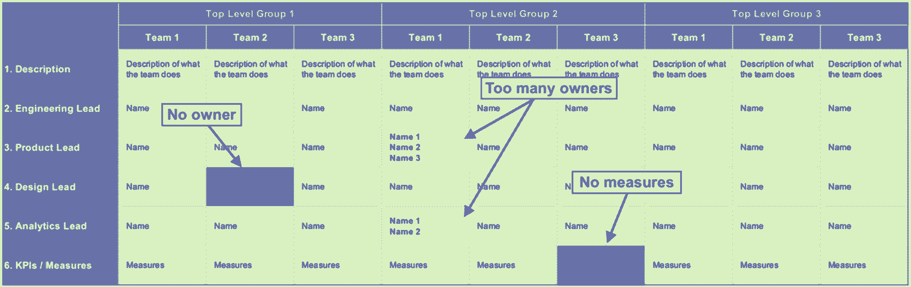
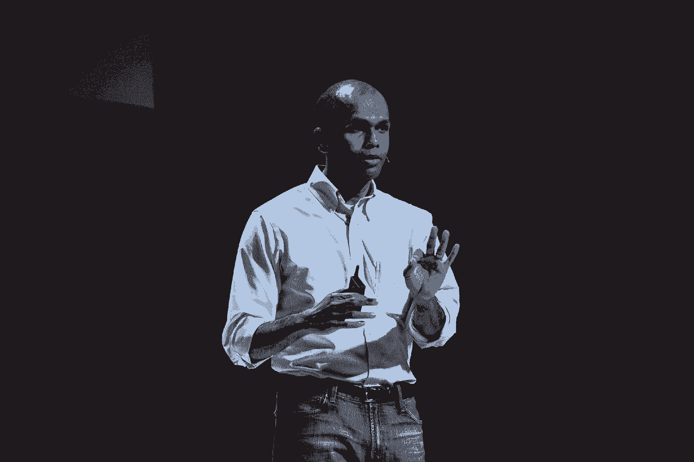

# 帮助创业领导者应对棘手问题的 6 个决策框架

> 原文：<https://review.firstround.com/the-6-decision-making-frameworks-that-help-startup-leaders-tackle-tough-calls>

当谈到我们做出的选择时，我们大多数人都喜欢认为自己做出了“最好”的决定。虽然每天的决定(早餐吃什么，是否阅读这篇文章)不会消耗太多的精神能量，但我们在扩大初创公司规模时遇到的选择往往更有分量:考虑是否要进行新一轮融资，或者将哪些新产品功能添加到路线图中，这些都因没有安全网的高压环境而加剧。好的决策可以[加速你公司的发展](https://firstround.com/review/from-zero-to-ipo-how-growth-needs-to-evolve-at-every-startup-stage/ "null")和[培养团队间的信任](https://firstround.com/review/our-6-must-reads-for-creating-and-accelerating-trust-on-teams/ "null")，坏的决策会危及底线和挫伤士气，有时是不可逆转的。

当然，困境在于高风险的决策很少如此明确。在一个团队中，很难就“最佳”选项的含义达成共识；选择过多，领导者可能会陷入优柔寡断的瘫痪，浪费宝贵的时间和机会。你如何做出一个兼顾速度和智慧的选择？你应该更重视数据，还是跟着感觉走？你如何在不煽动冲突的情况下调和聪明、意志坚强的经营者的观点？

为了寻求真知灼见，我们仔细研究了经验丰富的领导者的建议，他们在扩大初创公司和大公司规模的过程中处理了最具挑战性的决策。一个共同的主题出现了:决策的艺术并不总是关于捕捉一些难以捉摸的“最佳”决策— **它是关于最大限度地利用信息，获得利益相关者的信任，并坚定地执行。**

在这篇综述中，我们收集了六个经过时间考验的工具、框架和原则，用于在快速发展的初创公司做出高质量的决策。它们包括提取决策所需信息的策略、测试潜在解决方案的策略和调和冲突观点的策略。我们希望它们能帮助你消除决策过程中的恐惧，让你清晰地做出选择，推动你的创业向前发展。

当一个创业团队规模很小，或多或少同步的时候，大部分选择可以由创始团队决定。但是随着你的团队规模的扩大，以及你达到了前所未有的新的里程碑，你会觉得关于什么是“好的决策”的指导方针开始变得模糊了。

正如**[的首席运营官一样，克莱尔·休斯·约翰逊](https://www.linkedin.com/in/claire-hughes-johnson-7058/ "null")** 开发了一个决策框架，已经成为团队所有新老成员共享的决策指南。根据 Johnson 的说法，**你需要记录描述你工作方式的具体核心原则。**

一旦它们被写下来，你就需要不断地重复它们，直到每个人都理解了它们。Stripe 称之为“操作原则”(许多公司都有“价值观”，但 Stripe 希望将哲学信仰与应用于日常业务运营的具体原则区分开来。)正如约翰逊所描述的，Stripe 的两个运营原则是:

**严谨思考:**“我们关心把事情做好，通常需要从基本原则出发进行推理。我们努力工作来发现公认智慧中的错误。僵硬并不意味着没有发明综合症；我们对周围的世界感兴趣，并认为其他公司、行业和学术领域有很多东西可以教给我们。但在很多情况下，进步来自于选择人迹罕至的道路。”

**信任和放大:**“我们希望在一个由非常优秀的人组成的公司工作，他们对同事格外友好。人们应该致力于扩大彼此的影响，在短期和长期内尽力互相帮助。”

你可以在这里找到他们公开发布的完整名单。

还应该以承认潜在紧张关系的方式来定义它们。当两个原则看起来有冲突时，上下文应该告诉你哪个原则应该优先。例如，“严谨思考”对于高影响力和不可逆转的决策至关重要，但“紧急行动”对于影响力较低和潜在可调整的决策至关重要。这样，你的核心原则更像是一个行动指南，而不是一个没有牙齿的美好愿望清单。

这也使它们成为招聘新人和评估业绩的有用指标。候选人的能力或经验是否符合你的经营原则？现有员工是否以支持他们的方式履行他们的职责？你应该将自己的经营原则融入到招聘和绩效评估过程中，让它们变得有用，并时刻牢记在心。

你的原则应该足够清晰明了，以至于咨询这些原则的人会做出与你的公司创始人相同的决定。

运营原则在培训新加入公司的经理时发挥着更大的作用。她说:“如果你不小心，经理们会带来他们在之前职位上的所有规则和行为——他们会对他们的团队产生巨大的影响。“这就是为什么我们为新领导建立了一个不同的入职计划，以确保他们真正理解 Stripe 基于我们的原则运营的不同方式。”

这是一种非常常见的失败模式:一家初创公司的创始团队使用一套他们都暗中知道并同意的不成文的信念来做出招聘决定和产品决定——但他们从来没有大声说出来或记录在核心的某个地方。

“当你在一个小团队中，总是在同一个房间里工作时，很多事情都会有机地发生，”约翰逊说。“你有很多非正式的能力来完成事情，因为你能立即理解正在做出的是什么样的决定，以及你想如何处理它。但是当你扩展的时候，你不能很容易地用一种新的方式教给别人，让他们马上理解。他们必须学会理解它。”

如果你是一家公司的领导，你知道这些潜规则是什么吗？您是否对需要做出的常见决策类型进行了分类？你是否记录了指导你如何做决定的信念？如果没有，暂停，现在就做。

*[阅读 Stripe 的首席运营官关于创业公司可持续发展所需步骤的更多内容。](https://firstround.com/review/to-grow-faster-hit-pause-and-ask-these-questions-from-stripes-coo/ "null")*

当创业公司扩大规模，团队成长，视角变得更加多样化，问题变得越来越复杂。随着**[flat iron Health](https://flatiron.com/ "null")**从 4 名员工膨胀到 135 名，CTO**[Gil Shklarski](https://www.linkedin.com/in/shklarski/ "null")**注意到一个明显的人员问题:**他的工程领导很难做出精简的决策**，无论是与产品领导谈判还是围绕内部辩论达成一致。

为了打破决策僵局，Shklarski 根据他的高管教练 Marcy Swenson 介绍给他的模型开发了一个框架。在 Flatiron 的团队成员中，这种矩阵被称为“决策的 Xanax ”,使他越来越独立和分散的团队能够在艰难的选择中快速而明智地前进。

首先，区分*好的决策*和*好的决策*非常重要:

你可以做出一个很好的决定，但如果人们对这个决定不满意，这个决定仍然会给你的团队带来混乱。

该框架旨在提高团队的一致性，同时减少决策过程中的压力。有两种类型的决策:

类型 1:不可逆转的决定

第二类:可逆决策

该系统可用于这两种情况。但是 Shklarski 的目标是优化第二类决策。这些是最常出现的，也正是那种不应该上升到最高领导层的事情。“人们会期待并接受第一类决策的审查和管理费用，”他说。“简化第二类决策会让团队和团队中的人开心，让事情在没有通常压力的情况下完成。”

它从一个基本图表开始，顶部是你正在决定的两个(或更多)选项。在左栏中，您有收益、成本和独特的缓解措施。

对于独自做决定的人来说，这可能是一个快速、结构化的思考过程。但是如果一个团队通过一个建议一起工作，Shklarski 建议把它写在白板上或谷歌文档中，每个人都可以看到并合作。

这张图表可能看起来像一个普通的利弊清单，但是当你把它付诸实践时，真正的奇迹就会发生。特别是，它位于标记为“缓解”的行中

Shklarski 说:“练习的领导者应该更像是一个促进者，而不是把他们自己的观点和判断放在最前面。”“她应该鼓励每个人想出点子，并且**包括每个选项的社会考虑或衍生结果**——而不仅仅是对工作的既定因果关系。比如:某个决定会让老板开心吗？一个团队会有活力吗？在组织中值得关注的人会得到机会吗？”

主持人还需要确保没有人主导对话，每个人都可以记录他们认为的好处和顾虑。这有助于心理安全，促进会话的话轮转换。

填写每个选择的成本和收益应该非常简单。值得注意的是，**成本一行还应该强调与每个选择相关的风险。**

另一件要注意的事情是确保你在每个专栏中生成足够多的内容，并围绕**整体思考选择一条特定的路径将如何在现实中发挥作用**。谁会得到帮助？谁会不爽？长期影响是什么？短期影响？随着公司的发展，这些影响会如何变化？认真钻研，把每一个选择都投射到未来。

然后你开始缓解。Shklarski 说:“**主持人应该在这里向团队介绍如何软化、减轻或分散与每个选项相关的风险。“如果你还没有这样做，这个练习将迫使你和每个人仔细思考如果选择了这个选项会是什么样子。”**

开展缓解对话可以从更广泛的人群中获得意见和反馈，并促使团队从其他角度看待情况，包括公司内可能触及当前决策或受其影响的其他部门的观点。它还能让每个人合作，寻找可能的解决方案，消除对他人的负面影响。

以下是降低风险和生成矩阵这一行的一些最佳实践:

问自己一些问题，增加客观转变的视角。例如:

什么对我们的客户最有利？

对病人来说什么是最好的？(或者最终受到影响的人。)

董事会想让我们做什么？(董事会代表了公司的客观利益。)

问自己一些从不同角度解决风险的问题。例如:

成本/风险的根本原因是什么，我们能减轻它吗？

我们能以其他方式解决这个技术债务/管理债务吗？

我们能通过其他方式解决潜在的焦虑吗？

我们可以做出长期/短期的权衡吗？

有时在谈话中，你最终会增加一栏 C 或 D，因为新的选择或想法会带来不同或更少的风险。

该练习让团队中的每个人都将自己的恐惧、希望和社会焦虑融入到决策过程中，并看到它们作为重要因素被认真对待。

继续阅读 Shklarski 矩阵在实践中应用的详细示例。

**[Elliot Shmukler](https://www.linkedin.com/in/eshmu/ "null")**在他的职业生涯中，一直是人和产品动态互动的前排座位，在 [Wealthfront](https://www.wealthfront.com/ "null") 和 [Instacart](https://www.instacart.com/ "null") 担任产品副总裁。

他调解刚愎自用、观点似乎相反的项目经理之间分歧的经验，让他转向了一个熟悉的决策框架:A/B 测试，这是一个独特的转变。他说:“我想使用一个框架，既能展示产品的最佳选择，又能鼓励我的产品经理们采用与生俱来的不同方法进行构思。

当 Shmukler 注意到他的团队中的争议模式时，他受到启发，使用 A/B 测试来解决分数。他观察到，当项目经理涉及到两种截然不同的思维风格的冲突时，他们很可能会发生冲突:远见者的方式和数据驱动的项目经理的方式。“有远见的产品经理阅读茶叶，更多地根据直觉做出决定，而数据驱动的项目经理则通过实验和分析做出决定，”他说。

对于有远见的项目经理来说，当他们知道某样东西有效并想把它带给世界其他地方时，就会产生很多力量。什姆克勒承认，他所认识的许多有远见的项目经理已经或正在成为创始人或首席执行官，因为他们坚信要把与个人相关的事情规模化。"[雷德·霍夫曼](https://en.wikipedia.org/wiki/Reid_Hoffman "null")创建 LinkedIn 是为了反映他对职业社交的态度，以及他对在线社交应该如何运作的愿景。显然，这个产品已经发展了很多年，但是这个网站仍然在很大程度上忠实于他最初的设想，这是正确的。

数据驱动型项目经理有条不紊地发展自己的洞察力，在做决定前不那么固执。“我会用这样一句话来形容这些产品经理:'[强烈的观点，微弱的](http://bobsutton.typepad.com/my_weblog/2006/07/strong_opinions.html "null")'数据驱动型项目经理的立场与其说来自他们的生活方式，不如说来自他们对新数据的观察和收集。“随着更多信息的到来，他们更有可能提炼这些见解，”什姆克勒说。给这些类型的经前综合症起一个可识别的名字更具挑战性，因为数据在最前面。但你会发现他们在成长型团队中工作，并被数据已经占据重要地位的角色所吸引。"

鉴于这些截然不同的风格，作为一名领导者，协调这些不同的产品管理方法可能是一个挑战。对于产品负责人来说，这个场景可能听起来很熟悉:一个有远见的项目经理说，“我们需要做 x。”然后，一个数据驱动的项目经理回应。“不，X 错了。没用的。Shmukler 无数次面临这种情况，随着他的团队不断壮大，每天都是如此。他表示:“这很耗精力，而且很难在不偏袒任何一方的情况下解决。”。

**与其给出结论，不如测试两种理论，让数据来评判。**乍一看，这种方法似乎更有利于以数据为导向的人，但它让每个项目经理都有能力推进想法。他们独立学习，而不是觉得有人替他们做了决定。”

为了说明其简单的有效性，Shmukler 将 A/B 测试作为一种管理实践进行了应用:“一群有远见的项目经理想要改变我们谈论公司的方式，特别是在我们主页上的语言。他说:“更注重指标的项目经理表示，他们之前已经进行过这些实验，而且对注册没有影响。

“为了解决这种情况，必须有人来决定是否安排时间和人员进行测试。不管怎样，有人会认为你做了一个错误的决定。他说:“有远见的项目经理会说你太受数据驱动，没有立足于更大的目标，而数据驱动的项目经理会说这是浪费时间。“通用 A/B 测试解决了这个问题，因为不需要做出这样的决定。**取而代之的是，有一种理解是，来自可信团队的任何想法都将以轻量级的方式进行测试。结果——而不是一个单一的仲裁者——决定想法是否应该进一步发展。**

在这种情况下，Shmukler 要求团队合作，将理论付诸试验，以衡量影响。“有远见的项目经理为主页编写新内容，数据驱动的项目经理负责构建实验。实施需要一两天，而我们收集数据需要一个多月，”他说。“所有测试结果都在仪表板上公开，整个公司都可以访问。两个阵营都很高兴:数据驱动的项目经理可以使用数据进行实验并确定结果，而有远见的项目经理可以在那里得到他们的想法。在这个具体案例中，新的主页语言并没有产生重大影响。没有不愉快的感觉。有远见的项目经理重新调整并重新引导他们的精力到新的、不同的想法上。"

继续阅读，深入了解通用 A/B 测试的好处和挑战，以及如何实施的技巧。

透明度是初创公司良好决策的关键因素。当好的决策得到执行，但缺乏自上而下的透明度时，它会引发冲突并侵蚀信任。

这是 James Everingham 加入 insta gram[担任工程主管后不久学到的一课。(如今，他是脸书](https://www.instagram.com/ "null")**[Calibra](https://newsroom.fb.com/news/2019/06/coming-in-2020-calibra/ "null")** 的工程主管。将团队转移到新办公室的决定让团队经理大吃一惊。这位经理理所当然地受到了震动，但他的回应让埃弗宁厄姆印象深刻:“我真的很失望，”这位经理告诉埃弗宁厄姆。“这是我第一次了解到这一点。你根本没把我牵扯进来。你不够透明。”

James Everingham at First Round's Founder Summit

这就是为 Everingham 解开透明度难题的原因。“我意识到这一切都是为了理清决策。他说:“当你想到透明度时，你通常会想到沟通方面:告诉所有人正在发生的事情，或者承认你犯了错误。"**但是当人们说事情不透明时，他们可能指的是决策*****不透明。**这是一种感觉，有时决策会从领导团队高高在上的位置上滚下来，看起来毫无缘由。相反，拉开决策过程的帷幕，将一些过程和原则放在背后，这样就不会有这个神秘的黑匣子可供猜测了。”*

*Instagram 上清晰决策的解决方案可以归结为两件事:**使用决策过程的框架和原则，以及与单一责任所有者建立明确的角色。“我们必须让我们的决策变得可以理解、一致和可重复。我们还必须确保人们明白谁是做出特定决定的唯一人选。它是关于标准化我们的算法和指导方针，”Everingham 说。***

*Everingham 和他的团队做出的第一个修正是建立了一个 RACI 模式来分配角色和做决定。在咨询行业很常见，这是一个非常适合创业公司的工具。它的工作方式是在每个项目或决策*之前，识别并分配谁负责***【R*******A****C****C****咨询*和 ***I*** *通知*。***

*“我见过的关于这一点的最喜欢的例子是将 RACI 应用到《星球大战》中的[，”Everingham 说。“如果你像我一样是个极客，那就太完美了。基本上，在消灭绝地的努力中，赏金猎人负责，或者说做实际工作，而达斯·维德负责，冲锋队被征求意见，达斯·西迪厄斯被告知最后发生了什么。”](https://www.linkedin.com/pulse/raci-responsibility-model-explained-star-wars-matthew-inman/ "null")*

*当然，Instagram 应用 RACI 模型处理的问题略有不同。“我们将它用于我们最重要的计划，实际上我们总是从定义‘A’开始。例如，当试图确定我们将使用哪种数据库架构向前发展时，我们挑选我们的首席技术官作为负责任的决策者，”Everingham 说。*

*“R 小组负责完成工作，并就我们应该做的事情提出建议，其中包括从一组接受咨询的工程师那里收集信息。有一个最终演示，让 CTO 了解他们的想法，同时也邀请了“C”组来听取决策。最后，我们积极确定谁需要被告知该决定，并将其传达给每一个受影响的群体。”*

*在一家更大的公司，RACI 模式如何帮助减少混乱是显而易见的。但是，对于一个刚刚起步、汇报路线更简单、团队更精简的初创公司来说，这有必要吗？*

*“当我们开始这个过程时，Instagram 是一家相对成熟的公司。当你越来越老越来越大的时候，做这些事情就越来越难了。“如果你是一个新的创始人，刚刚起步，这可能看起来像是尖头管理的东西，这是正确的。通常你一开始就能本能地解决大部分问题。但我坚信，如果在你需要它的时候，它已经成为你文化的一部分，事情就会简单得多。”*

*从一开始就建立问责制度可以帮助创业公司避免更大的陷阱。“决策出错的方式太多了，无论是所有者太多，过于关注共识，还是无法在你面前捕捉或阐明决策。经历整个过程可能看起来很麻烦，但是你几乎总是会发现一些需要澄清的事情。即使你现在还没有遇到这些问题，我保证它会出现的。这是一种很好的团队力量，”他说。*

*你可以拥有比决策者更多的决策，但如果决策者比决策更多，那你就遇到问题了。*

*“我们想要一个单一的决策模型。Everingham 说:“我们希望人们确切地了解是谁在做决定，所以你只能有一个‘A’，或决策者。*

*为此，Everingham 和他的团队求助于另一个缩写: **RAM、**或责任分配矩阵。*

*“我们需要强调每个决策或项目背后的‘谁’,并确保只有一个共同的理解，所以我们在电子表格中构建了一个 RAM，将职能或团队放在顶部，将任务垂直放置，并在方框中填写所有者的姓名，”他说。“关键是谁打电话。其中一些有不止一个名称，这表明缺乏一致性。他们中的一些人甚至没有任何名字，这突出了一个明显的差距。”*

**

*“作为一个组织，我发现这是一次很好的锻炼，”Everingham 说。“这让我想起了艾森豪威尔的经典名言，‘计划是无用的，但规划是必不可少的。’就其本身而言，RAM 是相当无用的，但构建它并明确所有者的过程对于调整你的公司至关重要。这是一个框架，它概述了责任，并让每个人都可以看到如何做出决策。"*

*继续阅读 Everingham 为增加 Instagram 的透明度而采取的更多措施。*

*一个决定是否“好”并不仅仅取决于你做出的选择:你需要考虑共同的原则、透明度和——戴夫·吉鲁亚尔 会说——*纯粹的速度。**

*在这里， **[新贵](https://www.upstart.com/ "null")** 的创始人兼首席执行官讨论了为什么领导者不应该浪费时间犹豫不决，而是倾向于加速:*

*你还记得上一次你在开会的时候，有人说“我们要在离开房间之前做出这个决定”吗？那种感觉有多棒？你不是刚想抱抱那个人吗？*

*制定和重新制定决策的过程浪费了公司大量的时间。关键要点:什么时候做决定比做什么决定更重要。*

*从一开始就决定何时做出决定是一个深刻而强大的变化，它将加速一切。*

*如果你习惯性地在开始每个决策过程时都考虑这个决策值多少时间和精力，谁需要意见，什么时候你会有一个答案，那么你已经练就了速度的第一块重要肌肉。*

*这并不是说所有的决定都应该迅速做出。有些决策比其他决策更复杂或更关键。你应该等待更多的信息。有些决定不容易逆转，或者如果你选择不当，会造成太大的伤害。最重要的是，有些决策不需要立即做出，以保持下游速度。*

*重要的是要内化一个决定可能是多么不可逆转、致命还是非致命。很少有不能撤销的。*

*在我在谷歌的多年里，我看到埃里克·施密特经常使用这种方法来做决策——甚至可能都没有想过。因为创始人拉里和谢尔盖是(现在也是)非常有主见的领导人，参与每个重大决策，埃里克知道他不能做出重大的单方面选择。这可能会拖延很多事情，但埃里克确保决策是在一个具体的时间框架内做出的——一个现实的时间框架——但也是一个坚定的时间框架。他让这成为自己的习惯，这让谷歌的世界变得不同。*

*今天，在 Upstart，我们是一个小得多的公司，我们每天都要做出几次重要的决定。我们深深地被这样一种信念所驱使，即快速的决定远比缓慢的决定好，而且从根本上说也比不做决定好。日复一日，每时每刻，我们都在思考每个决定有多重要，值得花多少时间。*

*有些决定值得争论和分析几天，但绝大多数不值 10 分钟。*

*请注意，速度并不要求一个领导自上而下地打所有电话。好的决策艺术要求你从你的团队中收集意见和观点，然后以一种清楚地表达所有意见的方式推动最终决策。随着我职业生涯的成长，我已经从一开始就告诉人们我有正确的答案，转向引导讨论得出结论。我不会称之为建立共识——你不希望共识成为你的人质——但其他人的意见将帮助你更快地做出正确的决定，并得到团队的认可。*

*这不是对草率决定的投票。我有时可能有点太“脚踏实地”，有时我的联合创始人安娜会说，“这是一个重大决定。尽管我们认为我们知道该做什么，但还是让我们等 24 小时吧。*

*知道何时结束争论并做出决定是一门艺术。当双方都有很好的论点和很多情绪时，许多领导人不愿意做出最后的决定。我们直觉上希望团队自己做出正确的决定。但我发现，当人们听说你正在接过接力棒，并为一个决定承担责任时，他们会大大地松一口气。使用“首席执行官特权”——做最后的决定——并不是你每天都需要的。只要你有节制地做，你实际上可以让你的员工更舒服，通过扣动扳机，合乎逻辑地解释你的选择并坚持下去，产生更多的信任。*

*事实上，衡量团队的舒适度是衡量你是否走得足够快的一个非常有用的方法。*

*你知道你开得够快了如果出现一种低级的不适，人们会感到紧张。但是如果你走得太快，你会从他们的脸上看出来，这一点也很重要。*

*当我还在谷歌的时候，拉里·佩奇非常擅长快速做出决定，以至于人们担心团队会把车开下悬崖。他会在不让人感到不适的情况下，尽可能地推波助澜。他本能地会问，“为什么不呢？为什么我们不能做得比这更快？”然后等着看人们是否开始尖叫。他真的让每个人都围绕着这个理论，快速决策，除非是致命的，总是更好的。*

*更多阅读 Girouard 的文章，了解为什么创业公司应该把追求速度作为一种习惯。*

*一个“好”决策的最后一个要素是你如何向一个更好的团队证明和传达它。*

***[Gokul Rajaram](https://www.linkedin.com/in/gokulrajaram1/ "null")** ，在 **[Square](https://squareup.com/us/en "null")** 负责鱼子酱，与 Square 同事 [Jeff Kolovson](https://www.linkedin.com/in/jeffreykolovson/ "null") 一起开发了 SPADE 决策框架。这个框架，代表着**S**setting、**P**people、**A**alternatives、 **D** ecide 和 **E** xplain，已经被用来做出重要的决定，而不依赖于缓慢爬行的一致决策。*

*

Gokul Rajaram, Caviar Lead at Square* 

*“一旦你对自己选择的重要性进行了快速评估，并开始反复使用决策框架，就会有所收获。你意识到做决定不需要几天。一两个小时就能搞定。在这段时间里，你可以利用这个框架快速做出高质量的选择，”拉贾拉姆说。*

*基于他在第一轮 CEO 峰会上的演讲，他在文章中详细介绍了前四个步骤。然而，在这里，我们将重点放在确保一个强有力的决定坚持着陆的最后和关键步骤上:*

***解释***

*一旦作出决定，框架的最后一步要求被任命的决策者解释决定。她必须清楚地说明她选择这个选项的原因，并解释这个决定的预期影响。如果决策者一做决定就记录下她的想法，这个过程就容易多了。这个阶段包括三个步骤:*

***让有新观点的人来执行决策和流程。**向没有深入参与决策过程的人寻求意见。“如果你要对这个决定负责，那就去见那个人，解释这个决定，并获得认同。他说:“如果你创建了一个高质量的决策框架，他不太可能会否决。”*

***召开推理会议。这需要协调，但将所有参与决策的顾问召集在一起也很重要。预订一个会议室或线路，包括迄今为止的所有参与者。然后，引导他们做决定。“现在是你解释决策并真正掌握决策权的时候了。可能会有抱怨或分歧，但这是你明确成为决定的主人的时刻，”拉贾拉姆说。***

*召开承诺会议。做出决定后，最重要的是每个人——不管是支持还是反对结果——都要在会上大声承诺支持。“在房间里走一圈，要求他们每个人一次支持一个决定，”他说。“承诺会议真的很重要，因为当你在同事面前承诺支持一项决定时，你就更有可能支持它。作为决策者，你负责执行决策，因此你需要他们的支持来帮助你前进。”*

*决定做出后，每个参与者都必须大声承诺支持。大声承诺支持将你与更大的利益捆绑在一起。*

***为先例和后人流传判决的编年史。既然决定已经做出，真正的工作就开始了。“在承诺会议之后，你需要弄清楚下一步将如何授权和执行，”Rajaram 说。“决策者必须在一页纸的文件中总结决策背后的黑桃。这份简报应该由决策者通过电子邮件发送给公司的其他人或尽可能广泛的受众。为什么？因为公司需要了解决策的内容和方式。”***

*Square 使用电子邮件别名(notes@)向公司发送各种决策和会议记录。“过去几年，我们开始向公司发送 SPADE 摘要，”他说。“看到越来越多的决策使用这一框架做出，并发送给公司，这真是令人欣慰。员工开始记录整个组织内关于重要主题的高质量决策。这就是鼓励更多人面对困难决定并分享他们如何做出决定的方式。”*

**[请继续阅读 Rajaram 如何使用 SPADE 框架来帮助同步和加速困难选择的协作。](https://firstround.com/review/square-defangs-difficult-decisions-with-this-system-heres-how/ "null")**

**在做出和执行高质量决策方面，有更多的智慧，比如这篇关于* *[的文章，讲述了 Adobe 的产品营销总监如何驾驭选择的悖论](https://firstround.com/review/heres-how-adobes-director-of-product-marketing-navigates-the-paradox-of-choice/ "null")* *，以及这个* *[令人信服的相信自己直觉的案例。](https://firstround.com/review/8-Rare-Gems-from-Heidi-Roizen-on-Building-a-Fulfilling-Life-and-Career/ "null")**