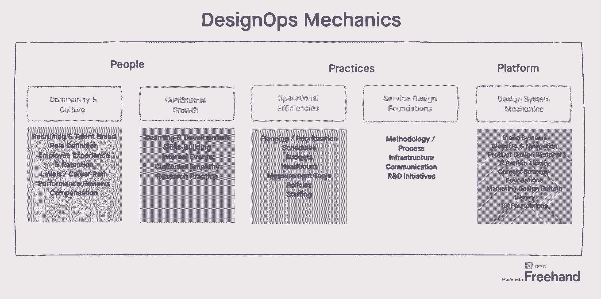

# 向您的组织结构图中添加设计方案的案例—来自 Vision 的经验教训

> 原文：<https://review.firstround.com/the-case-for-adding-designops-to-your-org-chart-lessons-from-invision>

新生的初创公司的早期设计雇员和领导成熟组织的设计领导者[的日常日历和任务清单可能看起来大不相同。但在本质上，设计师经常与许多相同的绊脚石作斗争——努力将设计融入公司的成功秘诀，而不是满足于在蛋糕上添加一些点缀。](https://firstround.com/review/heres-how-asana-won-with-its-product-redesign/ "https://firstround.com/review/heres-how-asana-won-with-its-product-redesign/")

随着设计不断成熟并巩固其作为公司长期架构支柱的地位，有一把双刃剑需要应对。在公司的端到端愿景中，设计为蓬勃发展的清晰声音而奋斗。但随着这种声音，大量的跨职能工作、流程细节和会议日程也随之而来。**不知不觉中，设计师们忙得没时间设计了。**

在[成长旅程](https://firstround.com/review/ready-set-hypergrowth-how-duos-product-design-lead-primed-her-team-for-momentum/ "https://firstround.com/review/ready-set-hypergrowth-how-duos-product-design-lead-primed-her-team-for-momentum/")的每个阶段，进入一个正在组织中获得动力的角色:设计运营，其任务是打造高效的工作流程，优化设计的内部合作伙伴关系，并创造可长期扩展的功能增长。

在这次评估中，我们总是在寻找那些虽然没有被广泛认可，但可能是你的公司正在寻找的秘方的角色(就像这个关于同事设计功能子集增长设计的简介)。草拟设计运营的要求已经在我们的编辑愿望清单上有一段时间了，所以当我们遇到 **[艾莉森·兰德](https://www.linkedin.com/in/alisonrand/ "https://www.linkedin.com/in/alisonrand/")** 时，这是命中注定的，这位设计运营专家长期以来一直在[发关于这个无定形学科的](https://twitter.com/alisonrand "https://twitter.com/alisonrand")、[博客](https://medium.com/@alisonrand "https://medium.com/@alisonrand")甚至[播客](https://www.ncommon.design/ "https://www.ncommon.design/")。谁更适合做我们这次旅行的向导呢？

兰德公司在短短的时间内就在 DesignOps 的巨大变革中占据了第一排的位置——甚至在该功能获得正式头衔之前。在担任[automatic](https://automattic.com/ "https://automattic.com/")的设计运营主管之前，她曾担任过 [Hot Studio](https://hotstudio.com/ "https://hotstudio.com/") (一家被脸书收购的设计公司)和 [frog](https://www.frogdesign.com/ "https://www.frogdesign.com/") 的项目策划总监。现在，她是数字产品设计平台**[InVision](https://www.invisionapp.com/ "https://www.invisionapp.com/")****的高级设计运营总监，该平台为结构化工作流程构建协作工具，并为全球的产品团队提供教育和社区。**

**“我的设计运营之旅真的回到了起点。兰德说:“我总是笑，因为在我职业生涯的这个时候，我正在领导一个设计运营和协作平台的设计运营，这太不可思议了。”。**

**虽然 Rand 每天都沉浸在大量的设计操作中，但她很清楚这个学科仍然被误解了。“围绕设计操作的定义有很多模糊之处。她说:“这与作为幕僚长的含义模糊不清没有什么不同。“简而言之，我的工作就是确保公司充分利用他们雇佣的优秀设计师——他们的时间、技能和发展潜力。”**

**设计作为一种功能在各种规模的组织中真正开始成熟。这已经达到了一个临界点，公司需要考虑如何扩展他们的设计流程——这是 DesignOps 进入并创造奇迹的最佳时机。**

**在这次独家采访中，兰德概述了这一角色的实际意义，以及它如何成为你甚至不知道你的公司需要的推动力。但是有一个问题。这个设计功能子集不是一双可以穿在脚上开始跑步的跑鞋——鞋子必须合脚。她将带领我们评估贵公司自身的设计成熟度，然后概述如何让您的第一个设计团队获得成功。无论您是否对将这一新学科添加到您的领导层感到好奇，或者在增加任何新员工之前寻找运营最佳实践，Rand 都有大量的框架可供分享。**

# **什么是设计运营——它在解决什么问题？**

**Rand 说:“多年来，我对设计的定义是 **DesignOps 搭建了一个平台，使设计策略和执行能够和谐地协同工作**。随着设计在一家公司的足迹越来越大，视觉和行动的融合变得前所未有的重要。“过去，设计师大多被认为是像素完美主义者——在产品开发的最新阶段加入进来。但我们已经看到了这种设计思维的许多演变和成熟，对许多公司来说，设计现在已经参与到顾客旅程的每一步，”她说。**

**但随着范围的扩大，设计师现在面临着一系列巨大的挑战，包括:**

****筒仓:**“尽管在大多数公司，设计师都被期望与营销、工程和产品团队紧密合作，但这些部门通常是完全相互独立的，没有共享的 okr。”**

****复杂性:**“设计工具和系统种类繁多，千变万化，越来越复杂——经常会导致瓶颈。我见过很多不愿意采用开发人员的过程和工具的设计团队(比如吉拉)。有单独的计划和跟踪策略，以及跨产品、利益相关者和高管的一般不一致。开发过程中缺乏质量保证最终会导致糟糕的客户体验，”**

**职业道路:“设计师通常被期望身兼数职——从创意总监、制作人到项目经理。这样就没有时间磨练你的手艺了。关于组织如何为设计师设计职业道路也有很多模糊之处——如果他们真的规划了的话。”**

****战略监督:**“许多公司可能会*说*设计带来了战略视角，但现实表明，许多设计师纯粹是生产角色。这一切都是被动的——应开发人员和领导战略的产品经理的要求而创造，而不是在构思阶段为产品设计确定方向。”**

****独角兽的神话:**“不同类型的设计角色之间有很多细微的差别，这一点经常被忽略。公司可能会招聘一名视觉设计师，但他们实际上需要的是一名有创意的技术专家。或者，他们可能有一个产品设计师，作为沟通设计师会更好，但他们没有利用这些技能。”**

**这些问题如今尤为突出。"**由于新冠肺炎和向远程工作的过渡，公司的数字化转型速度如此之快，完善其设计实践的需求和愿望将更加突出**。这里有一个临界点。**当设计师管理所有这些过程时，他们实际上并不是在设计——他们会变得非常不开心，**兰德说如果你想去掉那些额外的流程管理层，这样你的设计师就可以专注于工艺，你就得开始考虑你能带来的设计操作人员的类型。"**

**DesignOps 的目标是端到端地看待这些挑战，并设计出能够大规模应对这些挑战的敏捷设计系统和流程。但是在我们深入探讨之前，兰德公司做了一个快速的澄清:“**如果我要揭穿关于设计运作的最大误解，那就是它纯粹是一个项目管理角色**。她说:“公司以这种方式思考问题、以这种方式招聘员工，实际上是在给自己帮倒忙。”。**

**DesignOps 能做的不仅仅是让项目保持正轨。我们考虑设计师的整个端到端体验——从招聘、入职、角色定义、等级和职业道路——加上我们可以武装他们的工具和流程，以获得尽可能平稳的体验。**

**所有这些关于设计系统、流程和结构的讨论，可能会让创意人员心里有点痒痒。这是兰德在职业生涯中多次遇到的反应。“这是一个被严重误解的角色，令人沮丧。但这也是一个不可思议的机会，我们可以把我们的股份放在地上，然后说，‘这是我们帮助你们公司更上一层楼的方式。’”她说。**

**我永远不会忘记当有人问我，“DesignOps 是不是剥夺了设计的乐趣？”这与事实相去甚远——design ops 通过让设计师专注于他们最擅长的事情，将快乐*带回了设计中。***

## **开始使用人员、实践、平台框架。**

**在经历了大部分顾问生涯后，Rand 在 Automattic 开始了她的第一次内部设计之旅。开始时，她用一本[剧本](http://www.momentdesign.com/idea/design-management-framework/ "http://www.momentdesign.com/idea/design-management-framework/")武装自己，让我们在深入研究之前鸟瞰理解 DesignOps 的魔力。**

**“我首先在整个公司进行了一次大规模的倾听之旅，不仅与公司的每一位设计师交谈，还与所有跨职能部门的合作伙伴交谈。对于我想改变什么，我有自己的想法，但首先我需要对什么可行，什么不可行进行平衡。她说:“我当时正在进行自己的设计成熟度评估。**

**你不能把每个人说的话都当真——通常情况下，他们认为他们已经跑了一半，但他们还没跨过起跑线。**

**接下来，她整理了倾听之旅的笔记，强调了共同的主题，将后续步骤分解为**人员、实践、平台**设计管理框架。(如果你真的想深入了解这一点，她已经在她的媒体页面上对此进行了深入探讨。)“DesignOps 的视野非常广阔——我喜欢这个框架的一点是，它将设计归结为运营的最基本要素。你必须从某个地方开始，”她说。**

****人物:**“我思考一个设计师的整个经历，从招聘，到入职，到角色定义，到平级和职业道路。她说:“我仔细检查人才品牌的真实性，以及多元化、平等和包容在日常生活中的真实面貌。更具策略意义的是: **"** 为了解决职业发展方面的问题，我们为每位设计师制定了[个人职业使命](https://automattic.design/2018/09/08/personal-professional-mission-ppm/ "https://automattic.design/2018/09/08/personal-professional-mission-ppm/")，并为 Automattic 的所有设计师建立了一个集中的合作模式。我们实施了针对特定学科的实践领域社区，涵盖了我们全部的设计才能，包括产品体验、创意技术和情感设计。”**

**实践:“我考虑生产领域的每个方面，包括你的传统项目和管道管理、产能规划、预算和年度规划，”兰德说。 **"** 我们确立了我们的设计原则，并制定了明确反映这些原则的 okr，为我们的设计师指明了道路，让他们能够更清晰地了解优先事项以及它们与我们产品目标的关系。我们还创建了每周视觉状态会议，通过尽早审查工作和共同处理反馈来培养跨职能合作伙伴关系。”**

****平台:**“这包括围绕员工、合同和衡量的基础设施，以及对设计系统的思考，就像一个卓越中心，让你最接近你的客户，”她说。“我们立足于客户研究和对用户的同情——更重要的是，将这一视角引入产品路线图，以便付诸实践。这与[设计的四个行星](https://automattic.design/2019/03/03/the-four-planets-of-design/ "https://automattic.design/2019/03/03/the-four-planets-of-design/")相一致:发现、假设、交付和倾听。”**

****

**“明确地说，一路上有大量的迭代，总的来说，这个过程花了将近一年的时间，”Rand 说。但是耐心是值得的。"**这是关于认识到你现在建立的习惯和框架将会成为你的公司在未来几年的经营方式。如果这些都是坏习惯，那要花上几年的时间才能忘记和打破它们。你越早确立这些良好设计卫生的原则，你的公司就会变得越强大。”****

**像任何变革管理流程一样，将 DesignOps 整合到一家公司是一个小游戏。**

# **您的公司准备好接受设计运营了吗——您想要什么？**

**由于她在 InVision 的角色，她深深地融入了设计行业，Rand 估计这个行业现在有超过 800 名设计人员，而且这个数字还在继续上升。但这并不意味着围绕这一角色的所有模糊之处都消失了。“我无法告诉你我与招聘人员进行了多少次对话，他们联系我只是为了更好地了解他们要招聘的角色。她说:“所有这些公开的简历都是为 DesignOps 准备的，但公司还没有真正定义这意味着什么，所以招聘人员都迷失了方向。”**

**如果你仔细观察，就会发现这不仅仅是招聘经理和招聘人员之间简单的沟通失误。“我一次又一次地看到公司或招聘经理期望增加人手就能解决问题。他们认为，‘哦，如果我想提高设计水平，我就必须雇佣更多的人。但是更多的人并不意味着更好的合作——事实上，通常是相反的。**

**最大化设计的潜力并不是把身体扔向问题，而是理解要解决的问题，并用正确的协作模型和结构化的工作流程有意识地解决它。**

**在坐下来起草职位描述之前，先问这些问题。如果你看到很多肯定的回答，你可能会从这位新员工身上受益:**

**你的设计师和设计负责人是否被流程工作压得喘不过气来，以至于他们不太关注工艺和交付？**

**设计领导者是在做出重大决策的房间里吗？**

**你是否经历了设计师更替率的上升？**

**你希望设计成为你公司的竞争优势吗？**

**还有一个评估是兰德认为最重要的——尽管这个答案需要一些自我反省。“在它的核心，设计和变化是密不可分的。当你试图成为一个更成熟的设计组织时，这意味着从根本上改变你的运营方式。”**

**如果你的公司只从像素推动和唯船论的心态来关心设计，并且不准备改变这种心态，你就没有准备好进行设计运作。**

**“承认自己有问题，但还没有做好解决问题的准备，这没什么丢人的。她说:“自我意识必须放在第一位。**

**但是兰德已经看到很多公司的正念 delta 相当广泛——而且她有研究支持她。2019 年，InVision 发布了[新的设计前沿报告](https://www.invisionapp.com/design-better/design-maturity-model/ "https://www.invisionapp.com/design-better/design-maturity-model/")，这是一项对数千家公司的调查，旨在探索设计与整体业务之间的关系。这项研究(设计领域有史以来最大的一次)将公司分为五个设计成熟度级别，从最基础的第一级(约占受访公司的 40%)，设计师仅担任基于生产的角色，到第五级公司，设计牢牢植根于整个商业战略(仅占受访公司的 2%)。**

**“我们从研究中看到的是**大多数公司高估了他们设计功能的成熟程度**。兰德说:“他们说这是战略和决策的主要部分，但一旦你深入了解细节，这些说法就真的站不住脚了。”。(InVision 还提供了一种基于调查的产品，允许公司根据模型来衡量自己的成熟度。)**

**有些人可能会将 DesignOps 与稳健、成熟的设计实践联系起来，比如 Airbnb **和 [Spotify](https://spotify.design/article/dialling-up-the-joy-turning-down-the-pain-design-ops-at-spotify "https://spotify.design/article/dialling-up-the-joy-turning-down-the-pain-design-ops-at-spotify") 。但兰德认为，大大小小的创业公司都可以利用这个职能团队的力量。回到她之前的观点，这不仅仅是从员工人数的角度看哪些公司在设计上投资更多——事实上，InVision 的研究表明，一级公司比五级公司平均雇佣更多的设计师，分别为 30 名和 15 名。**

**“我可能在强调这一点，但如果有一件事我想让人们明白的话，那就是当你的跨职能合作伙伴不在船上一起进行这场变革之旅时，你不能仅仅通过增加更多的人来解决这个问题。她说:“这是关于在正确的时间增加正确的人，并用他们需要的工具武装他们。**

**但是如果你准备好开始以正确的方式攀登这座山——慢慢地，有条不紊地，用正确的装备——以下是你对第一次雇佣的期望。**

## **如何在野外发现最好的设计操作者？**

**当你听到“运营”这个词时，你可能会想到电子表格、预算和分析——但仔细看看，你会发现事情远不止你看到的那样。“运营的设计角色是关系型的——如何在整个组织中建立真正强大的关系？兰德说:“这不是一蹴而就的事情，在一些不可避免的摩擦中，你必须适应工作。**

**我总是说硬技能是赌注——是软技能让出色的设计团队领导者脱颖而出。**

**她概述了最佳设计人员为您的组织带来的软硬技能的独特组合:**

****人际关系:**“对于设计和设计团队来说，关系是成功的关键。他们必须将利益相关者聚集在一起，清楚地了解问题，并就期望的结果达成一致。”**

****天生的领导者:**“寻找愿意为团队的成功而努力的人。培养一种有凝聚力的文化是 DesignOps 角色的一个基本部分——这种文化会让团队对使用共享的流程和标准感到舒适。”**

****科学家:**“最好的设计运营领导者是数据驱动设计的大师。他们在分析、实验和衡量具体工作的成功方面有着成熟的实践。”**

****远见者:**“最终，将最成熟的设计组织和设计运营领导者区分开来的是他们对业务战略和优先级的理解。其他一切都会慢慢流下来。”**

**这是一种独特的技能组合，而且这一不断发展的学科相对来说仍处于起步阶段，当你为 DesignOps 发布招聘信息时，不太可能会有各种各样具有相同背景和头衔的人来敲你的门。如果你在寻找如何[找到合适的设计师人选的建议，](https://firstround.com/review/An-Inside-Look-at-Facebooks-Method-for-Hiring-Designers/ "https://firstround.com/review/An-Inside-Look-at-Facebooks-Method-for-Hiring-Designers/")兰德在这里也有一些建议:**

**她说:“我从来没有雇佣过任何有传统项目管理背景的人来担任设计部门的角色。“寻找有相关能力的人，系统思考者，或者在社会科学、机械工程甚至神经科学等相关领域工作过的人。你要找的人要有能力在任何特定时刻调整高度，有能力将事情从头到尾看清楚，还要有系统思维和执行能力。”**

**

Alison Rand, Senior Director of Design Operations at InVision.** 

**她强调，对于一个非常规的角色来说，放弃更常规的参数是至关重要的。兰德说:“尽量不要走传统路线——虽然有些学校刚刚开始设计管理培训，但生活技能对于建立信任、促进合作和带着好奇心朝着共同目标前进非常重要。”。“我曾经为我们的实习项目雇用了一名拥有机械工程学位的麻省理工学院毕业生，因为她在理解构成系统整体的各个组件方面令人惊叹。”**

**合适的设计人员的简历会显示出解决复杂、离散问题的动力——而不是任何确切的头衔或工作经历。**

**当谈到面试时，除了[依靠问题](https://firstround.com/review/40-favorite-interview-questions-from-some-of-the-sharpest-folks-we-know/ "https://firstround.com/review/40-favorite-interview-questions-from-some-of-the-sharpest-folks-we-know/")来探究软硬技能的特殊组合，还要花时间为候选人设计一个练习来完成。兰德说:“过去，我会创建一个案例客户或提案请求(RFP)问题来解决，并给候选人最多两个小时的时间来想出一个计划，并将其提交给跨专业的面试小组。”。“候选人很容易*谈论*他们是如何以某种方式运作的。但是你永远也不会知道如果没有一起完成一个项目，一个人是否能坚持到底。你不能仅仅通过浏览简历就完全欣赏一个候选人的解决问题、批判性思维和沟通能力。”**

## **如何在空白画布上画出杰作？**

**“作为第一个被雇佣的人加入一家公司，在*任何一个*领域都是令人无法抗拒的。她说:“这就像是给了你你想去的最终目的地——没有任何方向或交通工具带你去那里。”。兰德在华特·迪士尼的创造性领导三人模式中找到了安慰和清晰:梦想家、现实主义者和批评家。**

**梦想者展示了未来的愿景，并超越了其他人可能看到的界限。他们关注的是**什么。****

****现实主义者**在逻辑规划风格内考虑做梦者的愿景。他们关注行动计划和**如何**的想法。**

**评论家探讨了将这个想法变成现实的障碍。他们找出弱点和远景背后的逻辑，并最终考虑原因。**

**“当然，这里没有放之四海而皆准的标准，但我发现，像任何运营角色一样，设计人员通常属于现实主义角色。她说:“你相信愿景，并专注于如何实现它。”。“你必须成为客户的代言人——在这种情况下，你的客户就是公司的设计师。”**

**但是在签约成为一个组织的第一个设计人员时，有时你需要同时扮演这三个角色。“这个领域仍然很新，而且正在大规模发展。兰德说:“你必须带着梦想者的愿景，即设计如何在公司蓬勃发展，挖掘如何实现这一愿景的想法，你还必须留意可能会阻碍你前进的雷区。”**

**她的处方是让自己扎根于变革管理的核心原则，并开始积聚动力。“先在全公司进行一次大规模的倾听之旅，然后将你的注意力缩小到一个小团体。找出那些愿意和你一起工作并且相信你的潜力的合作伙伴。引入一些持怀疑态度的人。绘制失败的高风险区域，”她说。**

**接下来，寻找一个早期的胜利——一个相对较小的区域，具有巨大的影响潜力，可以向外扩散。“我和其他人一样对此感到内疚，但当你加入一家公司，看到这片变革的沃土时，就很难只见树木不见森林了。她说:“通过确定一个可以产生重大影响并让球滚动起来的基础领域，开始锻炼这些变化肌肉。”**

**她对从哪里开始的建议？“人才能力规划是一个很好的起点。大多数产品驱动的组织并不真正知道谁在做什么——更重要的是，不知道这如何达到更广泛的公司目标和路线图。如果你开始规划需要做什么工作，谁有空，你就会更清楚地了解你在设计成熟度方面所处的位置，以及设计如何安全地融入公司的结构。”**

## **向最优秀的设计人员学习。**

**当您开始进入广阔的 DesignOps 领域时，您是否正在寻找一些灵感？兰德公司推荐了几个引起她注意的路标:**

**Pinterest: “他们从第一天起就在支持设计运营和围绕员工和客户体验发展团队方面做得很好。他们回到了文化设计的基本原则，即文化设计到底意味着什么，以及它与最终用户体验的关系。”**

****USAA:** “首席设计官，[梅里亚·莫尔顿-加勒特](https://www.linkedin.com/in/meriahlanagarrett/ "https://www.linkedin.com/in/meriahlanagarrett/")，带来了强大的以设计为主导的思维镜头。我喜欢他们在设计运营中也有数据分析的事实。这就像水晶球在窥视未来——为了进一步发展 DesignOps，您需要证明对底线的影响和结果。它必须是可以量化的。”**

****设计运营峰会:**“罗森菲尔德媒体每年都会举办一次[设计运营峰会](https://rosenfeldmedia.com/designopssummit2020/ "https://rosenfeldmedia.com/designopssummit2020/")，如果你有兴趣了解更多关于这个领域的知识并开始行动，那是一次不容错过的活动。同时，你也可以加入他们的[设计社区](https://rosenfeldmedia.com/designops-community/#join-us "https://rosenfeldmedia.com/designops-community/#join-us")**

****DesignOps Assembly:** “这个[超级活跃的 Slack 频道](https://www.linkedin.com/company/designops-assembly/ "https://www.linkedin.com/company/designops-assembly/")由两位 rockstar DesignOps 负责人 [Meredith Black](https://www.linkedin.com/in/msmeredithblack/ "https://www.linkedin.com/in/msmeredithblack/") (之前 Pinterest 的)和 [Elyse Hornbacher](https://www.linkedin.com/in/elysehornbacher/ "https://www.linkedin.com/in/elysehornbacher/") (脸书)运营。这是谈话的重点！”**

# **如何在不增加任何人员的情况下实施设计运营原则？**

**对于那些还没有准备好向专门的设计运营团队迈进的公司来说，没有理由完全搁置这个问题。“并不是每家公司都在为设计运营投入人力。**但是你围绕设计建立的习惯——愿景和战略、业务目标、跨职能工作、职业规划、优先排序和映射回 OKRs——你必须做好。否则，当你决定启用 DesignOps 时，它们已经沉入海底，要花很多很多个月才能移动指针。她说:“这就像一次大型锻炼前的拉伸和热身——你会在以后省去很多痛苦。”。****

**为了尽早开始培养协作和和谐的跨职能部门，Rand 建议从她的剧本中借鉴一些关键策略:**

****视觉状态:**“这是我从梅雷迪思·布莱克(Meredith Black)那里得知的，她当时是 Pinterest 的设计运营主管。简单到每周开一次约一小时的会，回顾所有的跨产品设计工作，让每个人都更好地理解工作是如何联系的(或不联系的)。这里重要的一点是，你还邀请了跨职能领导，这样你们就可以一起研究工作。这是每周的一个关键时刻，您需要围绕审查设计工作建立流程和严谨性，无需 DesignOps pro。”**

****顾问委员会:**“设计顾问委员会是一个由多个跨职能合作伙伴组成的小团体，它不一定只有领导层。你应该把不同层次的人聚集在一起。在这个小组里，你可以抛出疯狂的想法，进行实验，并获得反馈。我也强烈建议让你最容易产生摩擦的人加入进来。”**

****结构化沟通:**“建立一个你可以反复清洗、冲洗和重复的沟通策略。建立有效的频率和正确的渠道来交流设计团队成员在做什么。我们为视觉设计系统 Helios 做了这个。我们实施了这一计划，并精心策划了一场路演，以获得认同。一旦我们得到它，我们就把它放入我们的[设计系统管理器](https://www.invisionapp.com/design-system-manager "https://www.invisionapp.com/design-system-manager")，它现在就在那里，所有人都可以访问。借用 *'* *[有效频率](https://en.wikipedia.org/wiki/Effective_frequency#:~:text=Business%20Dictionary%20defines%20it%20as,)%20to%20buy%20that%20product.%22 "https://en.wikipedia.org/wiki/Effective_frequency#:~:text=Business%20Dictionary%20defines%20it%20as,)%20to%20buy%20that%20product.%22")* *'* 的一个广告概念——消费者需要多少次才能理解这个信息？这将因公司而异，但开始尝试不同的想法，看看什么能坚持下去。”**

**超越流程，让设计工作变得更容易——而不是更难——需要在设计团队领导加入组织之前，就仔细考虑设计师的职业规划。“如果组织忽视这一点，将会面临巨大的风险。设计的核心是以人为中心。**我们非常关心人们对我们产品和品牌的体验，但在我们自己的内部设计团队中，我们却忘记了这项工作。这就是我被吸引加入 Invision 的原因——这正是该公司要解决的问题。****

**如果我们没有记住我们的用户体验和员工体验是密不可分的，那么我们就在用错误的方式思考问题。**

**“对于优秀设计师来说，这是一个竞争空前激烈的市场。提供远程工作或良好的福利不足以留住最耀眼的明星。兰德说:“这是一个发展机会。**

**首先，她建议你借鉴她自己的剧本，为你公司的设计师整理出**个人职业使命**。“我们关注三个关键领域——他们喜欢做什么，他们现在在做什么，以及公司的使命是什么。她说:“我们在寻找他们喜欢做的事情和对公司最有利的事情之间最接近的契合点。**

**“对你如何成长和发展你的员工保持关注，因为当人们觉得公司对他们进行了投资，他们有机会成长时，你会从这些人那里获得全新水平的承诺，”兰德说。**

**她发现了一个重要的问题，许多公司——从小型新贵到大型企业——仍在苦苦挣扎。不是每个人都想走上管理或领导的快车道。你是如何支持和培养想要成为组织主题专家的员工的？**

**“我称之为**培养两条尾巴**——有些人想进入他们的行业。她说:“提升这一职业的同时，仍有大量的责任，但你没有管理员工的责任——我把它比作一种友谊。”“还有一些人想要管理员工，要么是因为他们对此充满热情，要么是因为他们认为这只是通往公司领导层的传统途径。认识到这是两条截然不同的道路非常重要。一个不比另一个好，他们都以完全不同的方式为您的组织做出了巨大贡献。”**

**如果你对员工成长和发展的唯一定义是进入管理层，你将永远无法培养出让你的公司脱颖而出并赢得市场份额所需的激情专家。**

# **总结:为成功设置设计操作。**

**无论你是准备为这个新兴的学科贡献人力，并增强你的设计组织，还是刚刚开始整合这些原则，兰德敦促每个人最不喜欢的美德——耐心。“将设计整合为商业战略的一部分需要时间——但这是值得的，”她说。**

**“不要只把帽子挂在几个项目上就把它压死。她说:“请记住，如果你想改进设计运营在公司的运作方式，需要整个组织的精心协调——而不仅仅是一次性的胜利。**

**兰德对 DesignOps 在过去几年里取得的进步感到兴奋，因为她担任了 DesignOps 的第一个正式负责人，但她渴望看到未来会怎样。**

**“我在 Automattic 与富有远见的设计领袖约翰·梅达一起工作。他在*快公司*接受采访，标题是“[在现实中，设计并不那么重要。他因此受到了很多推特上的憎恨！但在某种程度上，他是对的，我完全理解他说的话，”她说。"](https://www.fastcompany.com/90320120/john-maeda-in-reality-design-is-not-that-important "https://www.fastcompany.com/90320120/john-maeda-in-reality-design-is-not-that-important")[工程、产品、设计应该是一个三脚凳](https://firstround.com/review/defining-product-design-a-dispatch-from-airbnbs-design-chief/ "https://firstround.com/review/defining-product-design-a-dispatch-from-airbnbs-design-chief/")，但往往我们表现得并不像。每个人都认为自己的腿更重要。我们需要打破这种保护性，并理解这不是关于任何一个学科，而是关于客户。”**

**她用一个预测结束了我们，这个预测让我们热衷于在未来几年里密切关注设计运营:“我可以断言，我认为设计运营角色的未来状态将是 EDP 运营或 CX 运营的混合能力，在组织结构图中坐在一起。最终，对企业最有利的是减少对单个设计原则的关注，而是真正以协作为中心，为最具凝聚力的客户体验服务。”**

***摄影由* *[迈克尔乔治](https://www.michaelgeorgephoto.com/ "https://www.michaelgeorgephoto.com/")* *完成。***